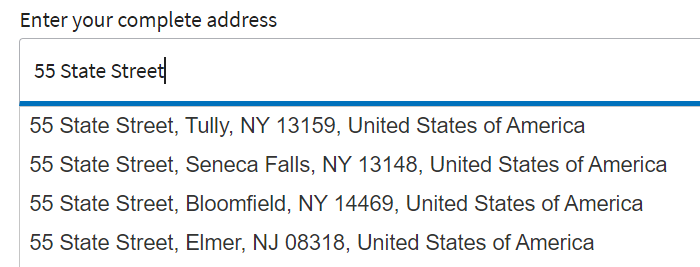
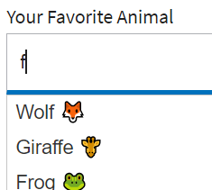

# Implementing Auto Complete

Implement auto complete capability in AEM forms using jquery's auto complete feature.
The sample included with this article uses a variety of data sources(static array, dynamic array populated from an REST API response) to populate the suggestions as the user starts typing into the text field.

The code used to accomplish the auto complete capability is associated with the initialize event of the field.

## Providing suggestion for address




The following is the code used to provide street address suggestions

```javascript
$(".streetAddress input").autocomplete({
    source: function(request, response) {
        $.ajax({
            url: "https://api.geoapify.com/v1/geocode/autocomplete?text=" + request.term + "&apiKey=Your API Key", //please get your own API key with geoapify.com
            responseType: "application/json",
            success: function(data) {
                console.log(data.features.length);
                response($.map(data.features, function(item) {
                    return {
                        label: [item.properties.formatted],
                        value: [item.properties.formatted]
                    };
                }));
            },
        });
    },
    minLength: 5,
    select: function(event, ui) {
        console.log(ui.item ?
            "Selected: " + ui.item.label :
            "Nothing selected, input was " + this.value);
    }

});
```


## Suggestions with emoji's



The following code was used to display emoji's in the suggestions list

``` javascript
var values=["Wolf \u{1F98A}", "Lion \u{1F981}","Puppy \u{1F436}","Giraffe \u{1F992}","Frog \u{1F438}"];
$(".Animals input").autocomplete( {
minLength: 1, source: values, delay: 0
}

);

```

The [sample form can be downloaded](assets/auto-complete-form.zip) from here. Please make sure you provide your own username/API key  using the code editor for the code to make successful REST calls.

>[!NOTE]
>
> For auto complete to work make sure your form uses the following client library **cq.jquery.ui**. This client library comes with AEM.
