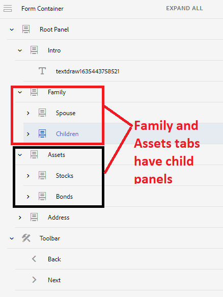

# Navigation tabs with multiple panels

When your form has left navigation tabs and if one of the tabs has multiple panels, you may want to hide the title of the child panels and still be able to navigate between the tabs and the child panels of these tab

## Create Adaptive Form

Create an adaptive form with the following structure. The root panel has child panels which are displayed as tabs on the left. Some of these "**tabs**" have additional child panels. For example the Family tab has two child panels called Spouse and Children.

A toolbar is also added under the FormContainer with the Prev and Next buttons




The default behavior of this form would be to display all the panels on the left and then navigate from one tab to another on clicking the next button.

To change this default behavior we need to do the following

>[!VIDEO](https://video.tv.adobe.com/v/338369?quality=12&learn=on)


Add the following code the click event of the **Next** button using the code editor

``` javascript
window.guideBridge.setFocus(null, 'nextItemDeep', true);

```

Add the following code the click event of the **Prev** button using the code editor

``` javascript
window.guideBridge.setFocus(null, 'prevItemDeep', true);

```

The above code will help you navigate between the tabs and the child panels of each tab.

## Hide the child panels title

Use the style editor to hide the title of the tabs child panels.

>[!VIDEO](https://video.tv.adobe.com/v/338370?quality=12&learn=on)

>[!NOTE]
>
>The capability described in this article does not work in the last tab. For example if the Address tab had child panels this functionality would not work.
