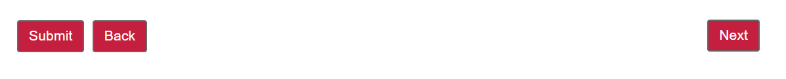

# Space the toolbar button

When you add Next and Prev buttons to the toolbar in AEM Forms, the buttons by default are placed next to each other. You may want to push the Next button to the extreme right in the toolbar while keeping the prev/back button in the left

## Style the toolbar

The above use case can be easily accomplished by using the style editor. Once you have added the Prev/Next button to the toolbar, make sure you have selected the Style layer from the edit menu. With the style mode selected, select the toolbar to open its styling properties sheet. Expand the Dimensions and Position section and make sure you are seeing all the properties. Set the following properties
* Dimensions and Position
    * Width: 100%
    * Position: relative

Save your changes

## Style the Next button

Select the Next button and make sure you open the style property sheet of the next button(not the next button text). Set the following properties
* Dimensions and Position
    * position: absolute Top 1px Right 1px
* Border
    * Border Radius: 4px(Top,Right,Bottom,Left)

Save your changes
