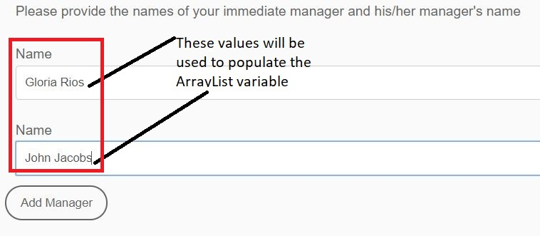
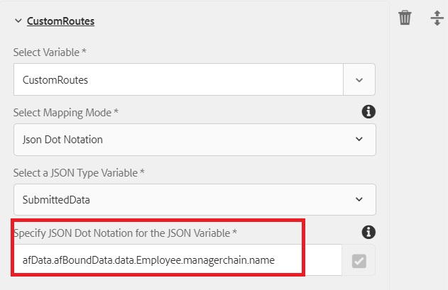

# ArrayList Variable in AEM Workflow

Variables of type ArrayList have been introduced in AEM Forms 6.5. A common use case for using ArrayList variable is to define custom routes to be used in the AssignTask. 

In order to use ArrayList variable in an AEM Workflow, you need to create an Adaptive Form which generates repeating elements in the submitted data. A common practice is to define a schema which contains an array element. For the purpose of this article, I have created a simple JSON schema containing array elements. The use case is of an employee filling out an expense report. In the expense report, we capture the submitter's manager name and manager's manager name. The manager's names are stored in an array called managerchain. The screenshot below shows the expense report form and the data from the Adaptive Forms submission.



Following is the data from the adaptive form submission. The adaptive form was based on JSON schema the data bound to the schema is stored under the data element of the afBoundData element. The managerchain is an array and we need to populate the ArrayList with the name element of the object inside the managerchain array.

```json
{
    "afData": {
        "afUnboundData": {
            "data": {
                "numericbox_2762582281554154833426": 700
            }
        },
        "afBoundData": {
            "data": {
                "Employee": {
                    "Name": "Conrad Simms",
                    "Department": "IT",
                    "managerchain": [{
                        "name": "Gloria Rios"
                    }, {
                        "name": "John Jacobs"
                    }]
                },
                "expense": [{
                    "description": "Hotel",
                    "amount": 300
                }, {
                    "description": "Air Fare",
                    "amount": 400
                }]
            }
        },
        "afSubmissionInfo": {
            "computedMetaInfo": {},
            "stateOverrides": {},
            "signers": {},
            "afPath": "/content/dam/formsanddocuments/helpx/travelexpensereport",
            "afSubmissionTime": "20190402102953"
            }
        }
}
```

To initialize the ArrayList variable of subtype string you can either use the JSON Dot Notation or XPath mapping mode. The following screenshot shows you populating an ArrayList variable called CustomRoutes using the JSON Dot Notation. Make sure you are pointing to an element in an array object as shown in the screenshot below. We are populating the  CustomRoutes ArrayList with the names of the managerchain array object.
The CustomRoutes ArrayList is then used to populate the Routes in the AssignTask component

Once the CustomRoutes ArrayList variable is initialized with the values from the submitted data, the Routes of the AssignTask component are then populated using the CustomRoutes variable. The screenshot below shows you the custom routes in an AssignTask 


To test this workflow on your system, please follow the following steps

* Download and save the ArrayListVariable.zip file to your file system
* [Import the zip file](assets/arraylistvariable.zip) using the AEM Package Manager
* [Open the TravelExpenseReport form](http://localhost:4502/content/dam/formsanddocuments/helpx/travelexpensereport/jcr:content?wcmmode=disabled)
* Enter a couple of expenses and the 2 manager's names
* Hit the submit button
* [Open your inbox](http://localhost:4502/aem/inbox)
* You should see a new task titled "Assign to expense administrator"
* Open the form associated with the task
* You should see two custom routes with the manager names
[Explore the ReviewExpenseReportWorkflow.](http://localhost:4502/editor.html/conf/global/settings/workflow/models/ReviewExpenseReport.html) This workflow uses the ArrayList variable,  JSON type variable, Rule editor in Or-Split component
