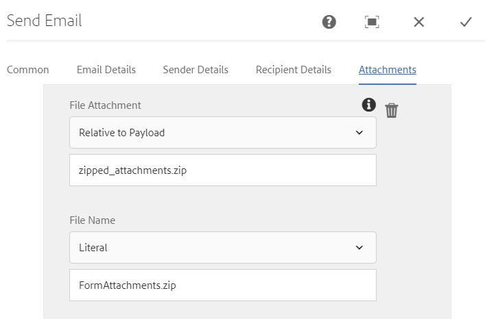
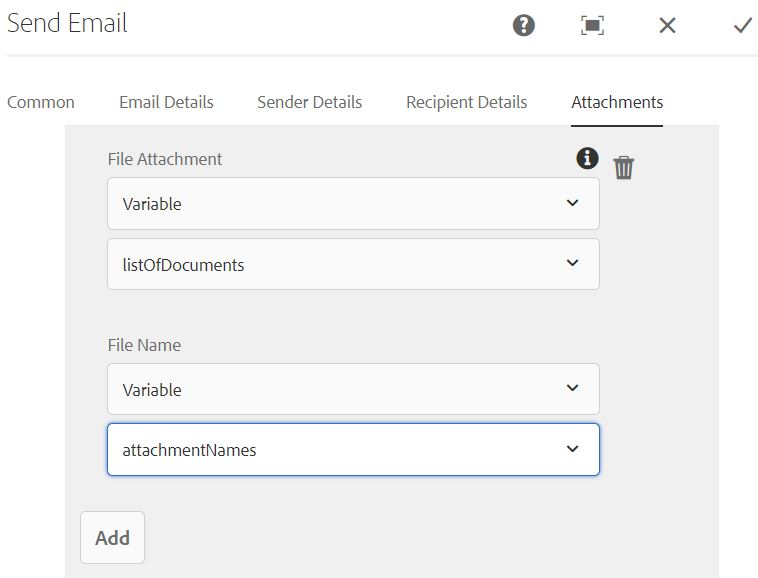

# Introduction

Common use case is to send the adaptive form attachments using send email component in an AEM workflow. 
Customers typically would zip the form attachments or send the attachments as individual files using send email component.

## Send the form attachments in a zip file

To accomplish the use case a custom workflow process step was written. In this custom process step a zip file with the form attachments in created and stored under the payload folder in a file named *zipped_attachments.zip*

## Send the form attachments individually

To accomplish this use case a custom workflow process step was written. In this custom process step we populate workflow variables of type ArrayList of Documents and ArrayList of Strings.

## Next Steps

[Zip Form Attachments](./custom-process-step.md)
