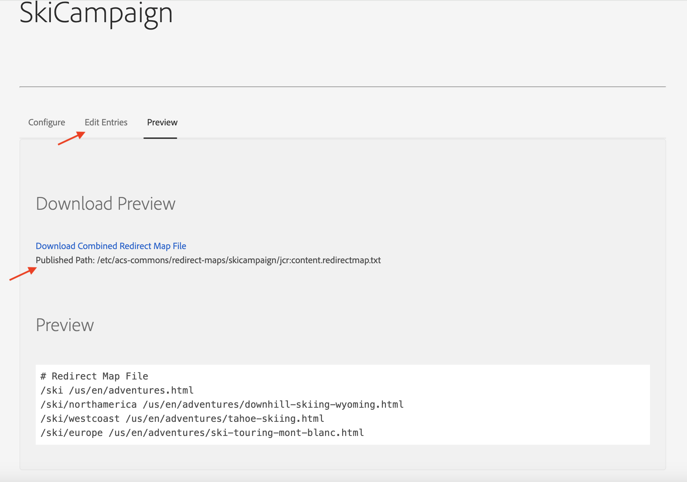
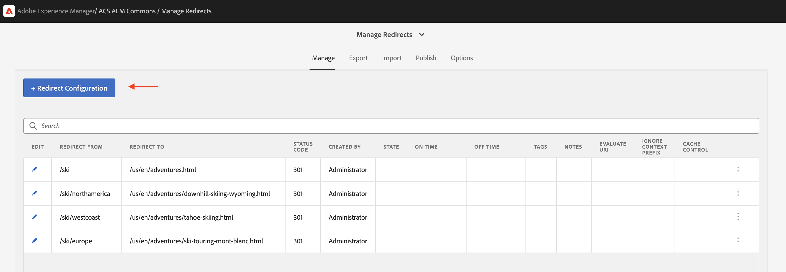
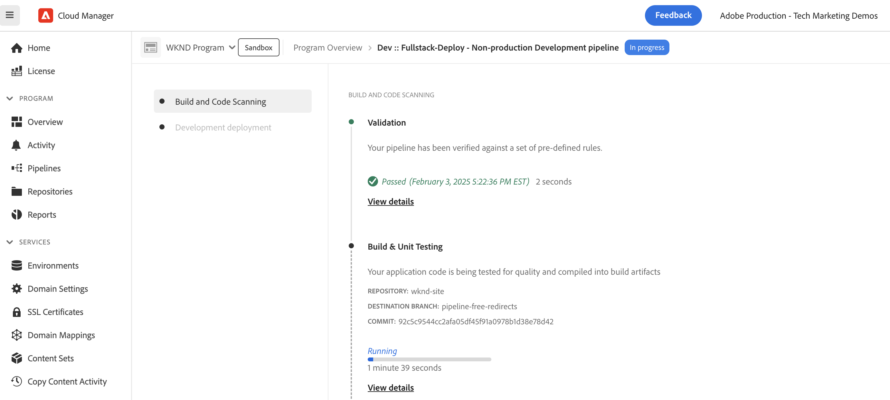

# URL redirects using pipeline-free configurations

Learn how to manage URL redirects without using the AEM code or config pipelines whenever you need to add or update a redirect. Thus, enabling the marketing team to manage the redirects without needing a developer.

There are multiple options to manage URL redirects in AEM, for more information, see [URL redirects](url-redirection.md). The tutorial focuses on creating URL redirects as key-value pairs in a text file like [Apache RewriteMap](https://httpd.apache.org/docs/2.4/rewrite/rewritemap.html) and uses AEM as a Cloud Service specific configuration to load them into the Apache/Dispatcher module.

## Prerequisites

To complete this tutorial, you need:

- AEM as a Cloud Service environment with version **18311 or higher**.

- The sample [WKND Sites](https://github.com/adobe/aem-guides-wknd) project must be deployed onto it.

## Tutorial use case

For the demo purpose, let's assume that the WKND marketing team is launching a new ski campaign. They would like to create short URLs for the ski adventure pages and manage them on their own like how they manage the content.

Based on the marketing team's requirements, the following are the URL redirects that need to be created. 

| Source URL | Target URL |
|------------|------------|
| /ski       | /us/en/adventures.html |
| /ski/northamerica | /us/en/adventures/downhill-skiing-wyoming.html |
| /ski/westcoast | /us/en/adventures/tahoe-skiing.html |
| /ski/europe | /us/en/adventures/ski-touring-mont-blanc.html |

Now, let's see how to manage these URL redirects and required one-time Dispatcher configurations in AEM as a Cloud Service environment.

## How to manage URL redirects{#manage-redirects}

To manage the URL redirects there are multiple options available, let's explore them. 

### Text file in DAM

The URL redirects can be managed as key-value pairs in a text file and uploaded to the AEM Digital Asset Management (DAM).

For example, the above URL redirects can be saved in a text file named `skicampaign.txt` and uploaded to the DAM @ `/content/dam/wknd/redirects` folder. Upon review and approval, the marketing team can publish the text file.

```
# Ski Campaign Redirects separated by the TAB character
/ski      /us/en/adventures.html
/ski/northamerica  /us/en/adventures/downhill-skiing-wyoming.html
/ski/westcoast   /us/en/adventures/tahoe-skiing.html
/ski/europe          /us/en/adventures/ski-touring-mont-blanc.html
```

### ACS Commons - Redirect Map Manager

The [ACS Commons - Redirect Map Manager](https://adobe-consulting-services.github.io/acs-aem-commons/features/redirect-map-manager/index.html) provides a user-friendly interface to manage the URL redirects. 

For example, the marketing team can create a new *Redirect Maps* page named `SkiCampaign` and add the above URL redirects using the **Edit Entries** tab. The URL redirects are available at `/etc/acs-commons/redirect-maps/skicampaign/jcr:content.redirectmap.txt`. 



>[!IMPORTANT]
>
>The ACS Commons version **6.7.0 or higher** is required to use the Redirect Map Manager, for more information, see the [ACS Commons - Redirect Manager](https://adobe-consulting-services.github.io/acs-aem-commons/features/redirect-manager/index.html).

### ACS Commons - Redirect Manager

Alternatively, the [ACS Commons - Redirect Manager](https://adobe-consulting-services.github.io/acs-aem-commons/features/redirect-manager/index.html) also provides a user-friendly interface to manage the URL redirects.

For example, the marketing team can create a new configuration named `/conf/wknd` and add the above URL redirects using the **+ Redirect Configuration** button. The URL redirects are available at `/conf/wknd/settings/redirects.txt`.



>[!IMPORTANT]
>
>The ACS Commons version **6.10.0 or higher** is required to use the Redirect Manager, for more information, see the [ACS Commons - Redirect Manager](https://adobe-consulting-services.github.io/acs-aem-commons/features/redirect-manager/subpages/rewritemap.html).

## How to configure the Dispatcher

To load the URL redirects as a RewriteMap and apply them to the incoming requests, the following Dispatcher configurations are required.

### Enable Dispatcher module for flexible mode

First, verify that the Dispatcher module is enabled for _flexible mode_. The presence of `USE_SOURCES_DIRECTLY` file in the `dispatcher/src/opt-in` folder indicates that the Dispatcher is in flexible mode.

### Load URL redirects as RewriteMap

Next, create a new configuration file `managed-rewrite-maps.yaml` at `dispatcher/src/opt-in` folder with the following structure.

```yaml
maps:
- name: <MAPNAME>.map # e.g. skicampaign.map
    path: <ABSOLUTE_PATH_TO_URL_REDIRECTS_FILE> # e.g. /content/dam/wknd/redirects/skicampaign.txt, /etc/acs-commons/redirect-maps/skicampaign/jcr:content.redirectmap.txt, /conf/wknd/settings/redirects.txt
    wait: false # Optional, default is false, when true, the Apache waits for the map to be loaded before starting
    ttl: 300 # Optional, default is 300 seconds, the reload interval for the map
```

During the deployment, the Dispatcher creates the `<MAPNAME>.map` file in the `/tmp/rewrites` folder.
    
>[!IMPORTANT]
>
> The file name (`managed-rewrite-maps.yaml`) and location (`dispatcher/src/opt-in`) should be exactly as mentioned above, think of it as a convention to follow.

### Apply URL redirects to incoming requests

Finally, create or update the Apache rewrite config file to use the above map (`<MAPNAME>.map`). For example, let's use the `rewrite.rules` file from the `dispatcher/src/conf.d/rewrites` folder to apply the URL redirects.

```
...
# Use the RewriteMap to define the URL redirects
RewriteMap <MAPALIAS> dbm=sdbm:/tmp/rewrites/<MAPNAME>.map

RewriteCond ${<MAPALIAS>:$1} !=""
RewriteRule ^(.*)$ ${<MAPALIAS>:$1|/} [L,R=301]    
...
```

### Example configurations

Let's review the Dispatcher configurations for each of the URL redirect management options mentioned [above](#manage-redirects).
    
>[!BEGINTABS]

>[!TAB Text file in DAM]

When the URL redirects are managed as key-value pairs in a text file and uploaded to the DAM, the configurations are as follows.

[!BADGE dispatcher/src/opt-in/managed-rewrite-maps.yaml]{type=Neutral tooltip="File name of code sample below."}

```yaml
maps:
- name: skicampaign.map
  path: /content/dam/wknd/redirects/skicampaign.txt
```

[!BADGE dispatcher/src/conf.d/rewrites/rewrite.rules]{type=Neutral tooltip="File name of code sample below."}

```
...

# The DAM-managed skicampaign.txt file as skicampaign.map
RewriteMap skicampaign dbm=sdbm:/tmp/rewrites/skicampaign.map

# Apply the RewriteMap for matching request URIs
RewriteCond ${skicampaign:%{$1}} !=""
RewriteRule ^(.*)$ ${skicampaign:%{$1}|/} [L,R=301]

...
```

>[!TAB ACS Commons - Redirect Map Manager]

When the URL redirects are managed using the ACS Commons - Redirect Map Manager, the configurations are as follows.

[!BADGE dispatcher/src/opt-in/managed-rewrite-maps.yaml]{type=Neutral tooltip="File name of code sample below."}

```yaml
maps:
- name: skicampaign.map
  path: /etc/acs-commons/redirect-maps/skicampaign/jcr:content.redirectmap.txt
```

[!BADGE dispatcher/src/conf.d/rewrites/rewrite.rules]{type=Neutral tooltip="File name of code sample below."}

```
...

# The Redirect Map Manager-managed skicampaign.map
RewriteMap skicampaign dbm=sdbm:/tmp/rewrites/skicampaign.map

# Apply the RewriteMap for matching request URIs
RewriteCond ${skicampaign:%{$1}} !=""
RewriteRule ^(.*)$ ${skicampaign:%{$1}|/} [L,R=301]

...
```

>[!TAB ACS Commons - Redirect Manager]

When the URL redirects are managed using the ACS Commons - Redirect Manager, the configurations are as follows.

[!BADGE dispatcher/src/opt-in/managed-rewrite-maps.yaml]{type=Neutral tooltip="File name of code sample below."}

```yaml
maps:
- name: skicampaign.map
  path: /conf/wknd/settings/redirects.txt
```

[!BADGE dispatcher/src/conf.d/rewrites/rewrite.rules]{type=Neutral tooltip="File name of code sample below."}

```
...

# The Redirect Manager-managed skicampaign.map
RewriteMap skicampaign dbm=sdbm:/tmp/rewrites/skicampaign.map

# Apply the RewriteMap for matching request URIs
RewriteCond ${skicampaign:%{$1}} !=""
RewriteRule ^(.*)$ ${skicampaign:%{$1}|/} [L,R=301]

...
```

>[!ENDTABS]

## How to deploy the configurations

>[!IMPORTANT]
>
>The *pipeline-free* term is used to emphasize that the configurations are *deployed only once* and the marketing team can manage the URL redirects by updating the text file.

To deploy the configurations, use the [full-stack](https://experienceleague.adobe.com/en/docs/experience-manager-cloud-service/content/implementing/using-cloud-manager/cicd-pipelines/introduction-ci-cd-pipelines#full-stack-pipeline) or [web tier config](https://experienceleague.adobe.com/en/docs/experience-manager-cloud-service/content/implementing/using-cloud-manager/cicd-pipelines/introduction-ci-cd-pipelines#web-tier-config-pipelines) pipeline in the [Cloud Manager](https://my.cloudmanager.adobe.com/).




Once the deployment is successful, the URL redirects are active and the marketing team can manage them without needing a developer.

## How to test the URL redirects

Let's test the URL redirects using the browser or `curl` command. Access the `/ski/westcoast` URL and verify that it redirects to `/us/en/adventures/tahoe-skiing.html`.

## Summary

In this tutorial, you learned how to manage URL redirects using pipeline-free configurations in AEM as a Cloud Service environment. 

The marketing team can manage the URL redirects as key-value pairs in a text file and upload them to the DAM or use the ACS Commons - Redirect Map Manager or Redirect Manager. The Dispatcher configurations are updated to load the URL redirects as a RewriteMap and apply them to the incoming requests.

## Additional resources

- [Pipeline-free URL Redirects](https://experienceleague.adobe.com/en/docs/experience-manager-cloud-service/content/implementing/content-delivery/pipeline-free-url-redirects)
- [URL redirects](url-redirection.md)
