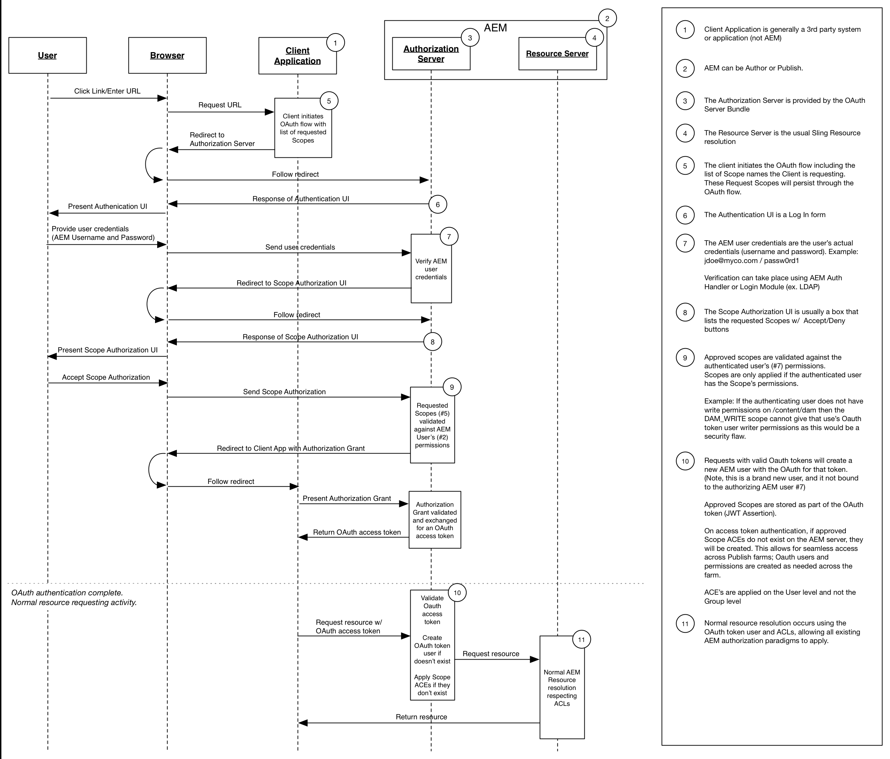

# Developing OAuth Scopes

Adobe Experience Manager's extensible OAuth scopes allow for access control for resources from a client application that is authorized by an end user. The diagram below illustrates the request flow in the context of AEM.

AEM provides three scopes:

* Profile
* Offline access
* Replicate

AEM's extensible OAuth scopes allow other custom scopes to be defined. For example, a custom scope can be developed and deployed to AEM that allows a mobile app authorized via OAuth to be restricted to reading, but not writing assets.

OAuth is the preferred method of authorizing a client application since it uses an access token instead of requiring an AEM user's credentials to be provided to that application.

* [View the code](https://github.com/Adobe-Consulting-Services/acs-aem-samples/blob/legacy/bundle/src/main/java/com/adobe/acs/samples/authentication/oauth/impl/SampleScopeWithPrivileges.java)
