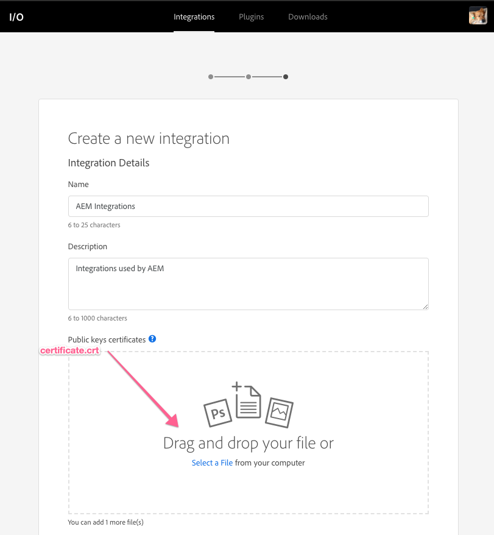
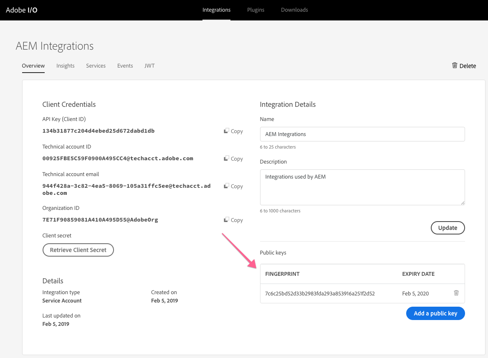

# Setup public and private keys for use with AEM and Adobe I/O{#setup-public-and-private-keys-for-use-with-aem-and-adobe-i-o}

AEM uses public/private key pairs to securely communicate with Adobe I/O and other web services. This short tutorial illustrates how compatible keys and keystores can be generated using the openssl command line tool that works with both AEM and Adobe I/O.

>[!CAUTION]
>
>This guide creates self-signed keys useful for development and  use  in lower environments. In production scenarios, keys are typically generated and managed by an organization's IT security team.

## Generate the public/private key pair {#generate-the-public-private-key-pair}

The [openssl](https://www.openssl.org/docs/man1.0.2/man1/openssl.html) command line tool's [req command](https://www.openssl.org/docs/man1.0.2/man1/req.html) can be used to generate a key pair compatible with Adobe I/O and Adobe Experience Manager.

\```
$ openssl req -x509 -sha256 -nodes -days 365 -newkey rsa:2048 -keyout private.key -out certificate.crt
\```

To complete the openssl generate command, provide the certificate information when requested. Adobe I/O and AEM do not care what these values are, however they should align with, and describe your key.

\```
Generating a 2048 bit RSA private key
...........................................................+++
...+++
writing new private key to 'private.key'
-----
You are about to be asked to enter information that will be incorporated
into your certificate request.
What you are about to enter is what is called a Distinguished Name or a DN.
There are quite a few fields but you can leave some blank
For some fields there will be a default value,
If you enter '.', the field will be left blank.
-----
Country Name (2 letter code) []:US
State or Province Name (full name) []:CA
Locality Name (eg, city) []:San Jose
Organization Name (eg, company) []:Adobe
Organizational Unit Name (eg, section) []:Adobe Experience Manager
Common Name (eg, fully qualified host name) []:com.adobe
Email Address []:example@adobe.com
\```

## Add key pair to a new keystore {#add-key-pair-to-a-new-keystore}

Key pairs can be added to a new PKCS12 keystore. As part of [openssl's pcks12 command,](https://www.openssl.org/docs/man1.0.2/man1/pkcs12.html) the name of the keystore (via `-  caname`), the name of the key (via -name) and the keystore's password (via `-  passout`) are defined.

These values are required to load the keystore and keys into AEM.

\```
$ openssl pkcs12 -export -caname my-keystore -in certificate.crt -name my-key -inkey private.key -out keystore.p12 -passout pass:my-password
\```

The output of this command is a keystore.p12 file.

>[!NOTE]
>
>The parameter values of **my-keystore**, **my-key** and **my-password** are to be replaced by your own values.

## Verify the keystore contents {#verify-the-keystore-contents}

The Java [keytool command line tool](https://docs.oracle.com/middleware/1213/wls/SECMG/keytool-summary-appx.htm#SECMG818) provides visibility into a keystore to ensure the keys are successfully loaded in the keystore file (keystore.p12).

\```
$ keytool -keystore keystore.p12 -list

Enter keystore password: my-password

Keystore type: jks
Keystore provider: SUN

Your keystore contains 1 entry

my-key, Feb 5, 2019, PrivateKeyEntry,
Certificate fingerprint (SHA1): 7C:6C:25:BD:52:D3:3B:29:83:FD:A2:93:A8:53:91:6A:25:1F:2D:52
\```

 

## Adding the keystore to AEM {#adding-the-keystore-to-aem}

AEM uses the generated **private key** to securely communicate with Adobe I/O and other web services. In order for the private key to be accessible to AEM, it must be installed into an AEM user's keystore.

Navigate to **AEM &gt; Tools &gt; Security &gt; Users** and **edit the user** the private key is to be associated with.

### Create an AEM keystore {#create-an-aem-keystore}


*AEM > Tools > Security > Users > Edit user*

If prompted to Create KeyStore, do so. This Keystore will exist only in AEM and is NOT the keystore created via openssl. The password can be anything and does not have to be the same as the password used in the openssl command.

### Install the private key via the keystore {#install-the-private-key-via-the-keystore}


*User > Keystore > Add private key from keystore*

In the user's keystore console, click **Add Private Key form KeyStore file** and add the following information:

* **New Alias**: the key's alias in AEM. This can be anything and does not have to correspond with the name of the keystore created with the openssl command.
* **Keystore File**: the output of the openssl pkcs12 command (keystore.p12)
* **Private Key Alias**: The password set in the openssl pkcs12 command via `-  passout` argument. 

* **Private Key Password**: The password set in the openssl pkcs12 command via `-  passout` argument.

### Verify the private key is loaded into the AEM keystore {#verify-the-private-key-is-loaded-into-the-aem-keystore}


*User > Keystore*

When the private key is successfully loaded from the provided keystore into the AEM keystore, the private key's metadata displays in the User's Keystore console.

## Adding the public key to Adobe I/O {#adding-the-public-key-to-adobe-i-o}

The matching public key must be uploaded to Adobe I/O to allow the AEM service user, who has the public key's corresponding private to securely communicate.

### Create a Adobe I/O new integration {#create-a-adobe-i-o-new-integration}



*[Adobe I/O Console](https://console.adobe.io/) > New Integration*

Creating a new Integration in Adobe I/O requires uploading a public certificate. Upload the **certificate.crt** generated by the openssl req command.

### Verify the public keys are loaded in Adobe I/O {#verify-the-public-keys-are-loaded-in-adobe-i-o}



The installed public keys and their Expiry dates are listed in the Integrations console on Adobe I/O. Multiple public keys can be added via the **Add a public key** button.

Now AEM hold the private key and the Adobe I/O integration holds the corresponding public key, allowing AEM to securely communicate with Adobe I/O.
