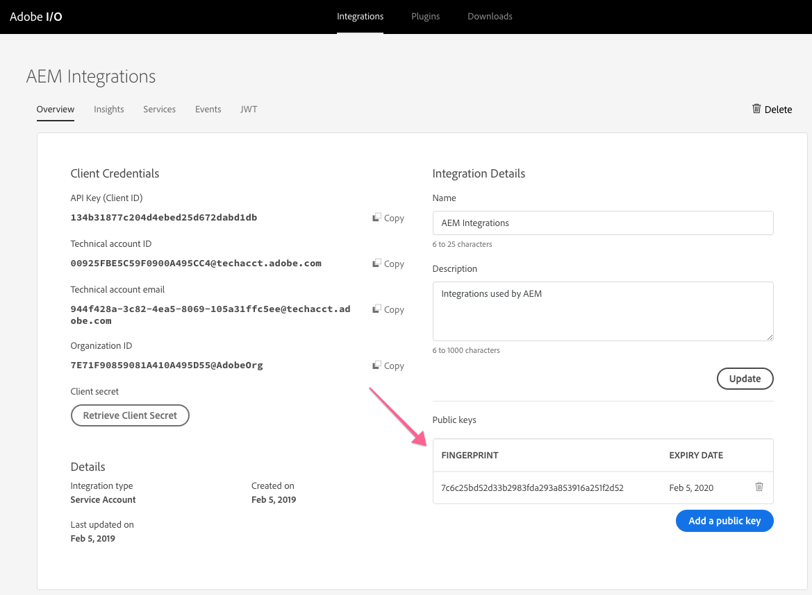
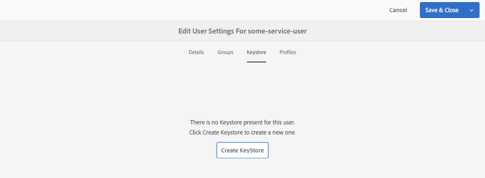
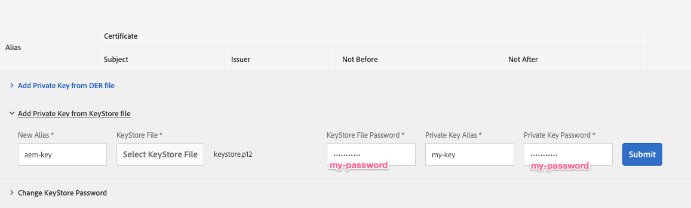
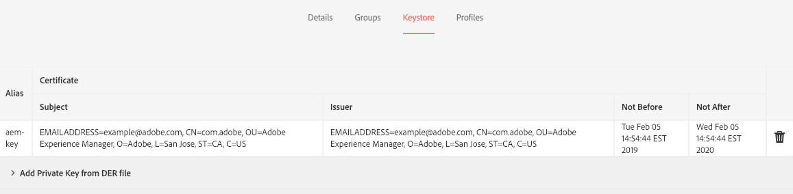
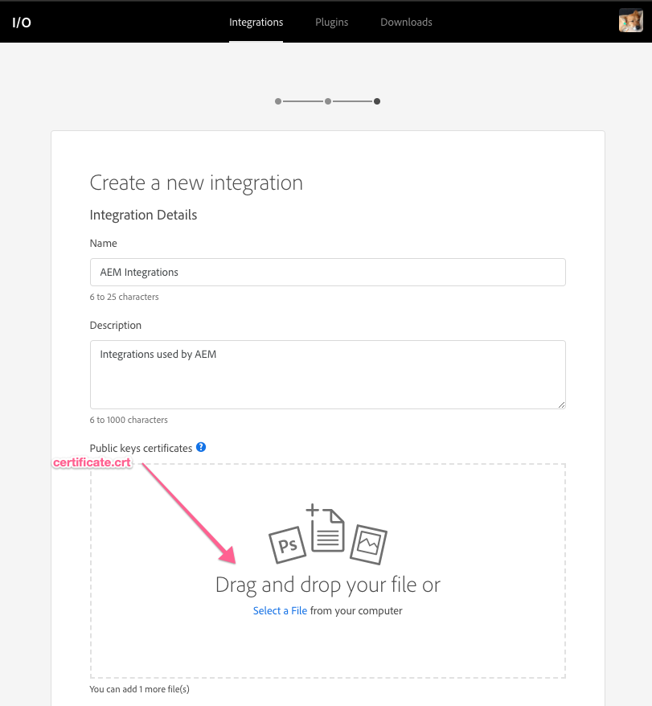

# Setup public and private keys for use with Adobe I/O

AEM uses public/private key pairs to securely communicate with Adobe I/O and other web services. This short tutorial illustrates how compatible keys and keystores can be generated using the [!DNL openssl] command-line tool that works with both AEM and Adobe I/O.

>[!CAUTION]
>
>This guide creates self-signed keys useful for development and  use  in lower environments. In production scenarios, keys are typically generated and managed by an organization's IT security team.

## Generate the public/private key pair {#generate-the-public-private-key-pair}

The [[!DNL openssl]](https://www.openssl.org/docs/man1.0.2/man1/openssl.html) command-line tool's [[!DNL req] command](https://www.openssl.org/docs/man1.0.2/man1/req.html) can be used to generate a key pair compatible with Adobe I/O and Adobe Experience Manager.

```shell
$ openssl req -x509 -sha256 -nodes -days 365 -newkey rsa:2048 -keyout private.key -out certificate.crt
```

To complete the [!DNL openssl generate] command, provide the certificate information when requested. Adobe I/O and AEM do not care what these values are, however they should align with, and describe your key.

```
Generating a 2048 bit RSA private key
...........................................................+++
...+++
writing new private key to 'private.key'
-----
You are about to be asked to enter information that will be incorporated
into your certificate request.
What you are about to enter is what is called a Distinguished Name or a DN.
There are quite a few fields but you can leave some blank
For some fields there will be a default value,
If you enter '.', the field will be left blank.
-----
Country Name (2 letter code) []:US
State or Province Name (full name) []:CA
Locality Name (eg, city) []:San Jose
Organization Name (eg, company) []:Example Co
Organizational Unit Name (eg, section) []:Digital Marketing
Common Name (eg, fully qualified host name) []:com.example
Email Address []:me@example.com
```

## Add key pair to a new keystore {#add-key-pair-to-a-new-keystore}

Key pairs can be added to a new [!DNL PKCS12] keystore. As part of [[!DNL openssl]'s [!DNL pcks12] command,](https://www.openssl.org/docs/man1.0.2/man1/pkcs12.html) the name of the keystore (via `-  caname`), the name of the key (via `-name`) and the keystore's password (via `-  passout`) are defined.

These values are required to load the keystore and keys into AEM.

```shell
$ openssl pkcs12 -export -caname my-keystore -in certificate.crt -name my-key -inkey private.key -out keystore.p12 -passout pass:my-password
```

The output of this command is a `keystore.p12` file.

>[!NOTE]
>
>The parameter values of **[!DNL my-keystore]**, **[!DNL my-key]** and **[!DNL my-password]** are to be replaced by your own values.

## Verify the keystore contents {#verify-the-keystore-contents}

The Java&trade; [[!DNL keytool] command-line tool](https://docs.oracle.com/middleware/1213/wls/SECMG/keytool-summary-appx.htm#SECMG818) provides visibility into a keystore to ensure that the keys are successfully loaded in the keystore file ([!DNL keystore.p12]).

```shell
$ keytool -keystore keystore.p12 -list

Enter keystore password: my-password

Keystore type: jks
Keystore provider: SUN

Your keystore contains 1 entry

my-key, Feb 5, 2019, PrivateKeyEntry,
Certificate fingerprint (SHA1): 7C:6C:25:BD:52:D3:3B:29:83:FD:A2:93:A8:53:91:6A:25:1F:2D:52
```

 

## Adding the keystore to AEM {#adding-the-keystore-to-aem}

AEM uses the generated **private key** to securely communicate with Adobe I/O and other web services. For the private key to be accessible to AEM, it must be installed into an AEM user's keystore.

Navigate to **AEM &gt; [!UICONTROL Tools] &gt; [!UICONTROL Security] &gt; [!UICONTROL Users]** and **edit the user** the private key is to be associated with.

### Create an AEM keystore {#create-an-aem-keystore}


*AEM > [!UICONTROL Tools] > [!UICONTROL Security] > [!UICONTROL Users] > Edit user*

When prompted to create a keystore, do so. This keystore exists only in AEM and is NOT the keystore created via openssl. The password can be anything and does not have to be the same as the password used in the [!DNL openssl] command.

### Install the private key via the keystore {#install-the-private-key-via-the-keystore}


*[!UICONTROL User] > [!UICONTROL Keystore] > [!UICONTROL Add private key from keystore]*

In the user's keystore console, click **[!UICONTROL Add Private Key form KeyStore file]** and add the following information:

* **[!UICONTROL New Alias]**: the key's alias in AEM. This can be anything and does not have to correspond with the name of the keystore created with the openssl command.
* **[!UICONTROL KeyStore File]**: the output of the openssl pkcs12 command (keystore.p12)
* **[!UICONTROL KeyStore File Password]**: The password set in the openssl pkcs12 command via `-passout` argument.
* **[!UICONTROL Private Key Alias]**: The value provided to the `-name` argument in the openssl pkcs12 command above (i.e. `my-key`).
* **[!UICONTROL Private Key Password]**: The password set in the openssl pkcs12 command via `-passout` argument.

>[!CAUTION]
>
>The KeyStore File Password and Private Key Password is the same for both inputs. Entering a mismatched password results in the key not being imported.

### Verify that the private key is loaded into the AEM keystore {#verify-the-private-key-is-loaded-into-the-aem-keystore}


*[!UICONTROL User] > [!UICONTROL Keystore]*

When the private key is successfully loaded from the provided keystore into the AEM keystore, the private key's metadata displays in the user's keystore console.

## Adding the public key to Adobe I/O {#adding-the-public-key-to-adobe-i-o}

The matching public key must be uploaded to Adobe I/O to allow the AEM service user, who has the public key's corresponding private to securely communicate.

### Create an Adobe I/O new integration {#create-a-adobe-i-o-new-integration}



*[[!UICONTROL Create Adobe I/O Integration]](https://developer.adobe.com/console/) > [!UICONTROL New Integration]*

Creating an integration in Adobe I/O requires uploading a public certificate. Upload the **certificate.crt** generated by the `openssl req` command.

### Verify that the public keys are loaded in Adobe I/O {#verify-the-public-keys-are-loaded-in-adobe-i-o}


The installed public keys and their expiration dates are listed in the [!UICONTROL Integrations] console on Adobe I/O. Multiple public keys can be added via the **[!UICONTROL Add a public key]** button.

Now AEM holds the private key and the Adobe I/O integration holds the corresponding public key, allowing AEM to securely communicate with Adobe I/O.
