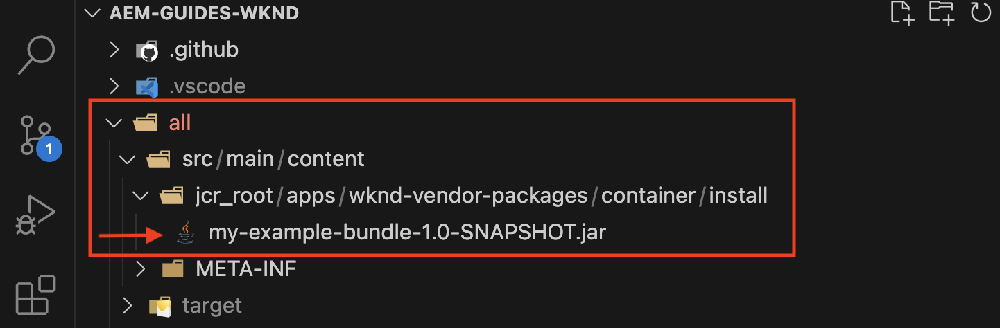
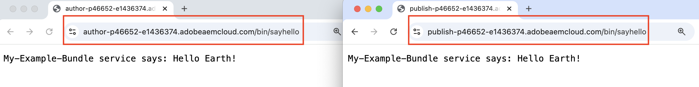
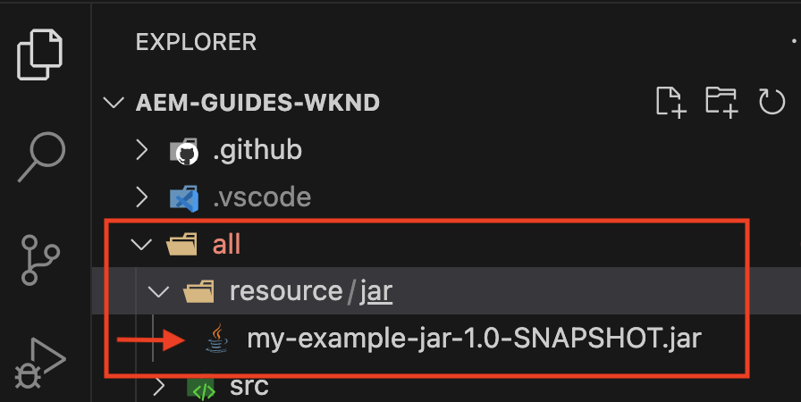
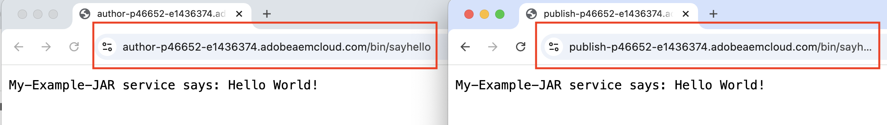
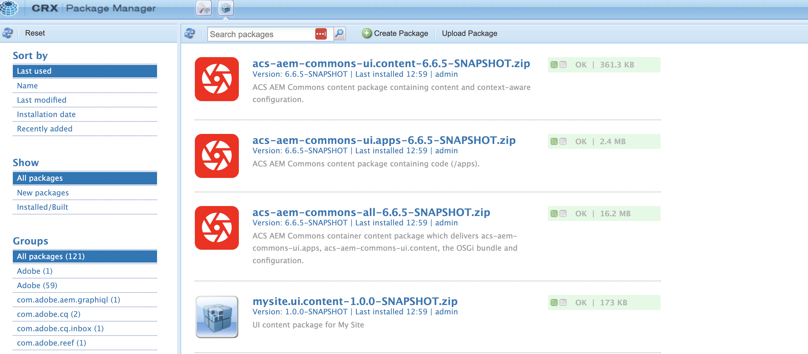
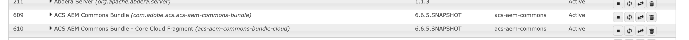

# Install third party artifacts - not available in the public Maven repository

Learn how to install third-party artifacts that are *not available in the public Maven repository* when building and deploying an AEM project.

The **third-party artifacts** can be: 

- [OSGi bundle](https://www.osgi.org/resources/architecture/): An OSGi bundle is a Java&trade; archive file that contains Java classes, resources, and a manifest that describes the bundle and its dependencies. 
- [Java jar](https://docs.oracle.com/javase/tutorial/deployment/jar/basicsindex.html): A Java&trade; archive file that contains Java classes and resources.
- [Package](https://experienceleague.adobe.com/en/docs/experience-manager-65/content/sites/administering/contentmanagement/package-manager#what-are-packages): A package is a zip file containing repository content in file-system serialization form.

## Standard scenario

Typically you would install the third-party bundle, package that *is available* in the public Maven repository as a dependency in your AEM project's `pom.xml` file.

For example:

- [AEM WCM Core Components](https://github.com/adobe/aem-core-wcm-components) **bundle** is added as a dependency in the [WKND project's](https://github.com/adobe/aem-guides-wknd/blob/main/pom.xml#L747-L753) `pom.xml` file. Here the `provided` scope is used as the AEM WCM Core Components bundle is provided by the AEM runtime. If the bundle is not provided by the AEM runtime, you would use the `compile` scope and it is the default scope.

- [WKND Shared](https://github.com/adobe/aem-guides-wknd-shared) **package** is added as a dependency in the [WKND project's](https://github.com/adobe/aem-guides-wknd/blob/main/pom.xml#L767-L773) `pom.xml` file.


## Rare scenario

Occasionally, when building and deploying an AEM project, you may need to install a third-party bundle or jar or package **that is not available** in the [Maven Central Repository](https://mvnrepository.com/) or the [Adobe Public Repository](https://repo.adobe.com/index.html). 

The reasons could be:

- The bundle or package is provided by an internal team or third-party vendor and _is not available in the public Maven repository_.

- The Java&trade; jar file _is not an OSGi bundle_ and may or may not be available in the public Maven repository.

- You need a feature that is not yet released in the latest version of the third-party package available in the public Maven repository. You decided to install the locally built RELEASE or SNAPSHOT version. 

## Prerequisites

To follow this tutorial, you need:

- The [local AEM development environment](https://experienceleague.adobe.com/en/docs/experience-manager-learn/cloud-service/local-development-environment-set-up/overview) or [Rapid Development Environment(RDE)](https://experienceleague.adobe.com/en/docs/experience-manager-learn/cloud-service/developing/rde/overview) set-up.

- The [AEM WKND project](https://github.com/adobe/aem-guides-wknd) _to add the third-party bundle or jar or package_ and verify the changes.

## Set-up

- Set up the AEM 6.X or AEM as a Cloud Service (AEMCS) local development environment or RDE environment.

- Clone and deploy the AEM WKND project.

    ```
    $ git clone git@github.com:adobe/aem-guides-wknd.git
    $ cd aem-guides-wknd
    $ mvn clean install -PautoInstallPackage 
    ```

    Verify the WKND site pages render correctly.

## Install a third-party bundle in an AEM project{#install-third-party-bundle}

Let's install & use a demo OSGi [my-example-bundle](./assets/install-third-party-articafcts/my-example-bundle.zip) that _is not available in the public Maven repository_ to the AEM WKND project.

The **my-example-bundle** exports `HelloWorldService` OSGi service, its `sayHello()` method returns `Hello Earth!` message.

For more details, refer to the README.md file in the [my-example-bundle.zip](./assets/install-third-party-articafcts/my-example-bundle.zip) file.

### Add the bundle to `all` module

The first step is to add the `my-example-bundle` to the AEM WKND project's `all` module.

- Download and extract the [my-example-bundle.zip](./assets/install-third-party-articafcts/my-example-bundle.zip) file.

- In the AEM WKND project's `all` module, create the `all/src/main/content/jcr_root/apps/wknd-vendor-packages/container/install` directory structure. The `/all/src/main/content` directory exists, you only need to create the `jcr_root/apps/wknd-vendor-packages/container/install` directories.

- Copy the `my-example-bundle-1.0-SNAPSHOT.jar` file from the extracted `target` directory to the above `all/src/main/content/jcr_root/apps/wknd-vendor-packages/container/install` directory.

    

### Use the service from the bundle

Let's use the `HelloWorldService` OSGi service from the `my-example-bundle` in the AEM WKND project.

- In the AEM WKND project's `core` module, create the `SayHello.java` Sling servlet @ `core/src/main/java/com/adobe/aem/guides/wknd/core/servlet`.

    ```java
    package com.adobe.aem.guides.wknd.core.servlet;

    import java.io.IOException;

    import javax.servlet.Servlet;
    import javax.servlet.ServletException;

    import org.apache.sling.api.SlingHttpServletRequest;
    import org.apache.sling.api.SlingHttpServletResponse;
    import org.apache.sling.api.servlets.HttpConstants;
    import org.apache.sling.api.servlets.ServletResolverConstants;
    import org.apache.sling.api.servlets.SlingSafeMethodsServlet;
    import org.osgi.service.component.annotations.Component;
    import org.osgi.service.component.annotations.Reference;
    import com.example.services.HelloWorldService;

    @Component(service = Servlet.class, property = {
        ServletResolverConstants.SLING_SERVLET_PATHS + "=/bin/sayhello",
        ServletResolverConstants.SLING_SERVLET_METHODS + "=" + HttpConstants.METHOD_GET
    })
    public class SayHello extends SlingSafeMethodsServlet {
        
            private static final long serialVersionUID = 1L;

            // Injecting the HelloWorldService from the `my-example-bundle` bundle
            @Reference
            private HelloWorldService helloWorldService;
        
            @Override
            protected void doGet(SlingHttpServletRequest request, SlingHttpServletResponse response) throws ServletException, IOException {
                // Invoking the HelloWorldService's `sayHello` method
                response.getWriter().write("My-Example-Bundle service says: " + helloWorldService.sayHello());
            }
    }
    ```

- In the AEM WKND project's root `pom.xml` file, add the `my-example-bundle` as a dependency. 

    ```xml
    ...
    <!-- My Example Bundle -->
    <dependency>
        <groupId>com.example</groupId>
        <artifactId>my-example-bundle</artifactId>
        <version>1.0-SNAPSHOT</version>
        <scope>system</scope>
        <systemPath>${maven.multiModuleProjectDirectory}/all/src/main/content/jcr_root/apps/wknd-vendor-packages/container/install/my-example-bundle-1.0-SNAPSHOT.jar</systemPath>
    </dependency>
    ...
    ```

    Here:
    - The `system` scope indicates that the dependency should not be looked up in the public Maven repository.
    - The `systemPath` is the path to the `my-example-bundle` file in the AEM WKND project's `all` module.
    - The `${maven.multiModuleProjectDirectory}` is a Maven property that points to the root directory of the multi-module project.

- In the AEM WKND project's `core` module's `core/pom.xml` file, add the `my-example-bundle` as a dependency.

    ```xml
    ...
    <!-- My Example Bundle -->
    <dependency>
        <groupId>com.example</groupId>
        <artifactId>my-example-bundle</artifactId>
    </dependency>
    ...
    ```

- Build and deploy the AEM WKND project using the following command:

    ```
    $ mvn clean install -PautoInstallPackage
    ```

- Verify the `SayHello` servlet works as expected by accessing the URL `http://localhost:4502/bin/sayhello` in the browser.

- Commit above changes to the AEM WKND project's repository. Then verify the changes in the RDE or AEM environment by running the Cloud Manager pipeline.

    

The [tutorial/install-3rd-party-bundle](https://github.com/adobe/aem-guides-wknd/compare/main...tutorial/install-3rd-party-bundle) branch of the AEM WKND project has the above changes for your reference.

### Key learnings{#key-learnings-bundle}

The OSGi bundles that are not available in the public Maven repository can be installed in an AEM project by following these steps:

- Copy the OSGi bundle to the `all` module's `jcr_root/apps/<PROJECT-NAME>-vendor-packages/container/install` directory. This step is necessary to package and deploy the bundle to the AEM instance.

- Update the root and core module's `pom.xml` files to add the OSGi bundle as a dependency with the `system` scope and `systemPath` pointing to the bundle file. This step is necessary to compile the project.

## Install a third-party jar in an AEM project

In this example, the `my-example-jar` is not an OSGi bundle, but a Java jar file.

Let's install & use a demo [my-example-jar](./assets/install-third-party-articafcts/my-example-jar.zip) that _is not available in the public Maven repository_ to the AEM WKND project.

The **my-example-jar** is a Java jar file that contains a `MyHelloWorldService` class with a `sayHello()` method that returns `Hello World!` message.

For more details, refer to the README.md file in the [my-example-jar.zip](./assets/install-third-party-articafcts/my-example-jar.zip) file.

### Add the jar to `all` module

The first step is to add the `my-example-jar` to the AEM WKND project's `all` module.

- Download and extract the [my-example-jar.zip](./assets/install-third-party-articafcts/my-example-jar.zip) file.

- In the AEM WKND project's `all` module, create the `all/resource/jar` directory structure. 

- Copy the `my-example-jar-1.0-SNAPSHOT.jar` file from the extracted `target` directory to the above `all/resource/jar` directory.

    

### Use the service from the jar

Let's use the `MyHelloWorldService` from the `my-example-jar` in the AEM WKND project.

- In the AEM WKND project's `core` module, create the `SayHello.java` Sling servlet @ `core/src/main/java/com/adobe/aem/guides/wknd/core/servlet`.

    ```java
    package com.adobe.aem.guides.wknd.core.servlet;

    import java.io.IOException;

    import javax.servlet.Servlet;
    import javax.servlet.ServletException;

    import org.apache.sling.api.SlingHttpServletRequest;
    import org.apache.sling.api.SlingHttpServletResponse;
    import org.apache.sling.api.servlets.HttpConstants;
    import org.apache.sling.api.servlets.ServletResolverConstants;
    import org.apache.sling.api.servlets.SlingSafeMethodsServlet;
    import org.osgi.service.component.annotations.Component;

    import com.my.example.MyHelloWorldService;

    @Component(service = Servlet.class, property = {
            ServletResolverConstants.SLING_SERVLET_PATHS + "=/bin/sayhello",
            ServletResolverConstants.SLING_SERVLET_METHODS + "=" + HttpConstants.METHOD_GET
    })
    public class SayHello extends SlingSafeMethodsServlet {

        private static final long serialVersionUID = 1L;

        @Override
        protected void doGet(SlingHttpServletRequest request, SlingHttpServletResponse response)
                throws ServletException, IOException {

            // Creating an instance of MyHelloWorldService
            MyHelloWorldService myHelloWorldService = new MyHelloWorldService();

            // Invoking the MyHelloWorldService's `sayHello` method
            response.getWriter().write("My-Example-JAR service says: " + myHelloWorldService.sayHello());
        }
    }    
    ```

- In the AEM WKND project's root `pom.xml` file, add the `my-example-jar` as a dependency. 

    ```xml
    ...
    <!-- My Example JAR -->
    <dependency>
        <groupId>com.my.example</groupId>
        <artifactId>my-example-jar</artifactId>
        <version>1.0-SNAPSHOT</version>
        <scope>system</scope>
        <systemPath>${maven.multiModuleProjectDirectory}/all/resource/jar/my-example-jar-1.0-SNAPSHOT.jar</systemPath>
    </dependency>            
    ...
    ```

    Here:
    - The `system` scope indicates that the dependency should not be looked up in the public Maven repository.
    - The `systemPath` is the path to the `my-example-jar` file in the AEM WKND project's `all` module.
    - The `${maven.multiModuleProjectDirectory}` is a Maven property that points to the root directory of the multi-module project.    

- In the AEM WKND project's `core` module's `core/pom.xml` file, make two changes:

    - Add the `my-example-jar` as a dependency.

        ```xml
        ...
        <!-- My Example JAR -->
        <dependency>
            <groupId>com.my.example</groupId>
            <artifactId>my-example-jar</artifactId>
        </dependency>
        ...
        ```

    - Update `bnd-maven-plugin` configuration to include the `my-example-jar` into the OSGi bundle (aem-guides-wknd.core) that is being built.

        ```xml
        ...
        <plugin>
            <groupId>biz.aQute.bnd</groupId>
            <artifactId>bnd-maven-plugin</artifactId>
            <executions>
                <execution>
                    <id>bnd-process</id>
                    <goals>
                        <goal>bnd-process</goal>
                    </goals>
                    <configuration>
                        <bnd><![CDATA[
                    Import-Package: javax.annotation;version=0.0.0,*
                    <!-- Include the 3rd party jar as inline resource-->
                    -includeresource: \
                    lib/my-example-jar.jar=my-example-jar-1.0-SNAPSHOT.jar;lib:=true
                            ]]></bnd>
                    </configuration>
                </execution>
            </executions>
        </plugin>        
        ...
        ```
        
- Build and deploy the AEM WKND project using the following command:

    ```
    $ mvn clean install -PautoInstallPackage
    ```

- Verify the `SayHello` servlet works as expected by accessing the URL `http://localhost:4502/bin/sayhello` in the browser.

- Commit above changes to the AEM WKND project's repository. Then verify the changes in the RDE or AEM environment by running the Cloud Manager pipeline.

    

The [tutorial/install-3rd-party-jar](https://github.com/adobe/aem-guides-wknd/compare/main...tutorial/install-3rd-party-jar) branch of the AEM WKND project has the above changes for your reference.    

In scenarios where the Java jar file _is available in the public Maven repository but is NOT an OSGi bundle_, you can follow the above steps except the `<dependency>`'s `system` scope and `systemPath` elements are not required.

### Key learnings{#key-learnings-jar}

The Java jars that are not OSGi bundles and may or may not be available in the public Maven repository can be installed in an AEM project by following these steps:

- Update the `bnd-maven-plugin` configuration in the core module's `pom.xml` file to include the Java jar as an inline resource in the OSGi bundle that is being built.

The following steps are only required if the Java jar is not available in the public Maven repository:

- Copy the Java jar to the `all` module's `resource/jar` directory. 

- Update the root and core module's `pom.xml` files to add the Java jar as a dependency with the `system` scope and `systemPath` pointing to the jar file. 
    
## Install a third-party package in an AEM project

Let's install the [ACS AEM Commons](https://adobe-consulting-services.github.io/acs-aem-commons/) _SNAPSHOT_ version built locally from the main branch. 

It is purely done to demonstrate the steps to install an AEM package that is not available in the public Maven repository. 

The ACS AEM Commons package is available in the public Maven repository. Refer the [Add ACS AEM Commons to your AEM Maven project](https://adobe-consulting-services.github.io/acs-aem-commons/pages/maven.html) to add it to your AEM project.

### Add the package to `all` module

The first step is to add the package to the AEM WKND project's `all` module.

- Comment or remove the ACS AEM Commons release dependency from the POM file. Refer the [Add ACS AEM Commons to your AEM Maven project](https://adobe-consulting-services.github.io/acs-aem-commons/pages/maven.html) to identify the dependency.

- Clone the `master` branch of the [ACS AEM Commons repository](https://github.com/Adobe-Consulting-Services/acs-aem-commons) to your local machine.

- Build the ACS AEM Commons SNAPSHOT version using the following command:

    ```
    $mvn clean install
    ```

- The locally built package is located @ `all/target`, there are two .zip files, the one ending with `-cloud` is meant for AEM as a Cloud Service and the other one is for AEM 6.X.

- In the AEM WKND project's `all` module, create the `all/src/main/content/jcr_root/apps/wknd-vendor-packages/container/install` directory structure. The `/all/src/main/content` directory exists, you only need to create the `jcr_root/apps/wknd-vendor-packages/container/install` directories.

- Copy the locally built package (.zip) file to the `/all/src/main/content/jcr_root/apps/mysite-vendor-packages/container/install` directory.

- Build and deploy the AEM WKND project using the following command:

    ```
    $ mvn clean install -PautoInstallPackage
    ```

- Verify the installed ACS AEM Commons package:

    - CRX Package Manager @ `http://localhost:4502/crx/packmgr/index.jsp`

        

    - The OSGi console @ `http://localhost:4502/system/console/bundles`

        

- Commit above changes to the AEM WKND project's repository. Then verify the changes in the RDE or AEM environment by running the Cloud Manager pipeline.

### Key learnings{#key-learnings-package}

The AEM packages that are not available in the public Maven repository can be installed in an AEM project by following these steps:

- Copy the package to the `all` module's `jcr_root/apps/<PROJECT-NAME>-vendor-packages/container/install` directory. This step is necessary to package and deploy the package to the AEM instance.


## Summary

In this tutorial, you learned how to install third-party artifacts (bundle, Java jar and package) that are not available in the public Maven repository when building and deploying an AEM project.
