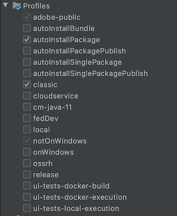
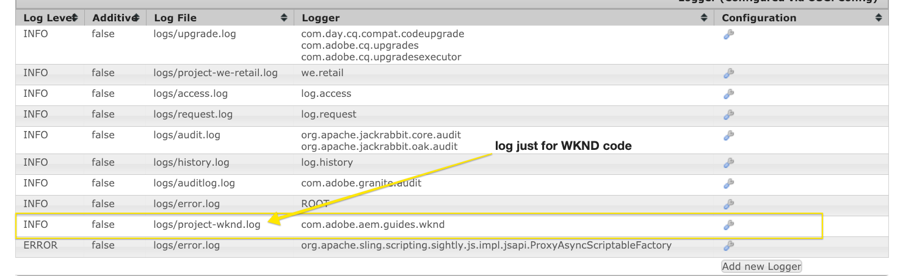
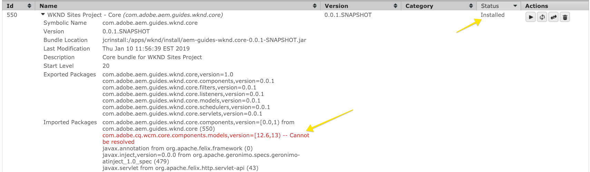
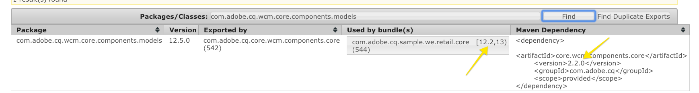
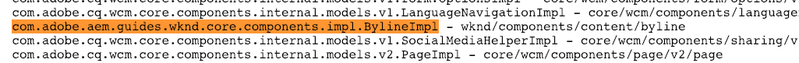
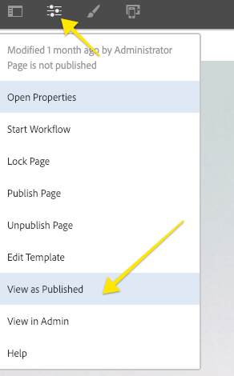
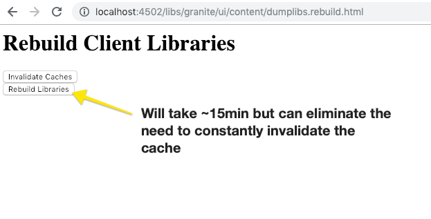

# Set up a Local AEM Development Environment 

Guide to setting up a local development for Adobe Experience Manager, AEM. Covers important topics of local installation, Apache Maven, integrated development environments and debugging/troubleshooting. Development with **Eclipse IDE, CRXDE Lite, Visual Studio Code, and IntelliJ** are discussed.

## Overview

Setting up a local development environment is the first step when developing for Adobe Experience Manager or AEM. Take the time to set up a quality development environment to increase your productivity and write better code, faster. We can break an AEM local development environment into four areas:

* Local AEM instances
* [!DNL Apache Maven] project
* Integrated Development Environments (IDE)
* Troubleshooting

## Install local AEM Instances

When we refer to a local AEM instance, we are talking about a copy of Adobe Experience Manager that is running on a developer's personal machine. ***All*** AEM development should start by writing and running code against a local AEM instance.

If you are new to AEM, there are two basic run modes can be installed: ***Author*** and ***Publish***. The ***Author*** [runmode](https://experienceleague.adobe.com/docs/experience-manager-65/deploying/configuring/configure-runmodes.html?lang=en)  is the environment that digital marketers use to create and manage content. When developing most of the time, you are deploying code to an Author instance. This allows you to create pages and add and configure components. AEM Sites is a WYSIWYG authoring CMS and therefore most of the CSS and JavaScript can be tested against an authoring instance.

It is also *critical* test code against a local ***Publish*** instance. The ***Publish*** instance is the AEM environment that visitors to your website interact with. While the ***Publish*** instance is the same technology stack as the ***Author*** instance, there are some major distinctions with configurations and permissions. The code must be tested against a local ***Publish*** instance before being promoted to higher-level environments.

### Steps

1.  Ensure that Java&trade; is installed.
    * Prefer [Java&trade; JDK 11](https://experience.adobe.com/#/downloads/content/software-distribution/en/general.html?1_group.propertyvalues.property=.%2Fjcr%3Acontent%2Fmetadata%2Fdc%3AsoftwareType&1_group.propertyvalues.operation=equals&1_group.propertyvalues.0_values=software-type%3Atooling&orderby=%40jcr%3Acontent%2Fjcr%3AlastModified&orderby.sort=desc&layout=list&p.offset=0&p.limit=14) for AEM 6.5+
    * [Java&trade; JDK 8](https://www.oracle.com/java/technologies/downloads/) for AEM versions before AEM 6.5
1.  Get a copy of the [AEM QuickStart Jar and a [!DNL license.properties]](https://experienceleague.adobe.com/docs/experience-manager-65/deploying/deploying/deploy.html).
1.  Create a folder structure on your computer like the following:

   ```plain
   ~/aem-sdk
       /author
       /publish
   ```

1.  Rename the [!DNL QuickStart] JAR to ***aem-author-p4502.jar*** and place it beneath the `/author` directory. Add the ***[!DNL license.properties]*** file beneath the `/author` directory.

1.  Make a copy of the [!DNL QuickStart] JAR, rename it to ***aem-publish-p4503.jar*** and place it beneath the `/publish` directory. Add a copy of the ***[!DNL license.properties]*** file beneath the `/publish` directory.

   ```plain
   ~/aem-sdk
       /author
           + aem-author-p4502.jar
           + license.properties
       /publish
           + aem-publish-p4503.jar
           + license.properties
   ```

1.  Double-click the ***aem-author-p4502.jar*** file to install the **Author** instance. This starts the author instance, running on port **4502** on the local computer.

   Double-click the ***aem-publish-p4503.jar*** file to install the **Publish** instance. This starts the Publish instance, running on port **4503** on the local computer.

   >[!NOTE]
   >
   >Depending on your development machine's hardware, it may be difficult to have both an **Author and Publish** instance running at the same time. Rarely do you need to run both simultaneously on a local setup.

### Using command line

An alternative to double clicking the JAR file is to launch AEM from the command line or create a script (`.bat` or `.sh`) depending on your local operating system flavor. Below is an example of the sample command:

```shell
$ java -Xmx2048M -Xdebug -Xnoagent -Djava.compiler=NONE -Xrunjdwp:transport=dt_socket,server=y,suspend=n,address=30303 -jar aem-author-p4502.jar -gui -r"author,localdev"
```

Here, the `-X` are JVM options and `-D` are additional framework properties, for more information, see [Deploying and Maintaining an AEM instance](https://experienceleague.adobe.com/docs/experience-manager-65/deploying/deploying/deploy.html) and [Further options available from the Quickstart file](https://experienceleague.adobe.com/docs/experience-manager-65/deploying/deploying/custom-standalone-install.html#further-options-available-from-the-quickstart-file).

## Install Apache Maven

***[!DNL Apache Maven]*** is a tool to manage the build and deploy procedure for Java-based projects. AEM is a Java-based platform and [!DNL Maven] is the standard way to manage code for an AEM project. When we say ***AEM Maven Project*** or just your ***AEM Project***, we are referring to a Maven project that includes all the *custom* code for your site.

All AEM Projects should be built off the latest version of the **[!DNL AEM Project Archetype]**: [https://github.com/adobe/aem-project-archetype](https://github.com/adobe/aem-project-archetype). The [!DNL AEM Project Archetype] provides a bootstrap of an AEM project with some sample code and content. The [!DNL AEM Project Archetype] also includes **[!DNL AEM WCM Core Components]** configured to be used on your project.

>[!CAUTION]
>
>When starting a new project, it is a best practice to use the latest version of the archetype. Keep in mind that there are multiple versions of the archetype and not all versions are compatible with earlier versions of AEM.

### Steps

1.  Download [Apache Maven](https://maven.apache.org/download.cgi)
2.  Install [Apache Maven](https://maven.apache.org/install.html) and ensure that the installation has been added to your command-line `PATH`.
    * [!DNL macOS] users can install Maven using [Homebrew](https://brew.sh/)
3.  Verify that **[!DNL Maven]** is installed by opening a new command-line terminal and executing the following:

   ```shell

   $ mvn --version
   Apache Maven 3.3.9
   Maven home: /Library/apache-maven-3.3.9
   Java version: 1.8.0_111, vendor: Oracle Corporation
   Java home: /Library/Java/JavaVirtualMachines/jdk1.8.0_111.jdk/Contents/Home/jre
   Default locale: en_US, platform encoding: UTF-8

   ```

   >[!NOTE]
   >
   > In, the past addition of `adobe-public` Maven profile was needed to point `nexus.adobe.com` to download AEM artifacts. All AEM artifacts are now available via Maven Central and the `adobe-public` profile is not needed.

## Set Up an Integrated Development Environment

An integrated development environment or IDE is an application that combines a text editor, syntax support, and build-tools. Depending on the type of development you are doing, one IDE might be preferable over another. Regardless of the IDE, it is important to be able to periodically ***push*** code to a local AEM instance in order to test it. It is important to occasionally ***pull*** configurations from a local AEM instance into your AEM project in order to persist to a source-control management system like Git.

Below are a few of the more popular IDEs that are used with AEM development with corresponding videos that show the integration with a local AEM instance.

>[!NOTE]
>
> The WKND Project has been updated to default to work on AEM as a Cloud Service. It has been updated to be [backwards compatible with 6.5/6.4](https://github.com/adobe/aem-guides-wknd#building-for-aem-6xx). If using AEM 6.5 or 6.4, append the `classic` profile to any Maven commands.

```shell
$ mvn clean install -PautoInstallSinglePackage -Pclassic
```

When, using an IDE please make sure to check `classic` in your Maven Profile tab.



*IntelliJ Maven Profile*

### [!DNL Eclipse] IDE

The **[[!DNL Eclipse] IDE](https://www.eclipse.org/ide/)** is one of the more popular IDEs for Java&trade; development, in large part because it is open source and ***free***! Adobe provides a plugin, **[[!DNL AEM Developer Tools]](https://experienceleague.adobe.com/docs/experience-manager-64/developing/devtools/aem-eclipse.html)**, for [!DNL Eclipse] to allow easier development with a nice GUI to synchronize code with a local AEM instance. The [!DNL Eclipse] IDE is recommended for developers new to AEM in large part because of the GUI support by [!DNL AEM Developer Tools].

#### Installation and Setup

1. Download and install the [!DNL Eclipse] IDE for [!DNL Java&trade; EE Developers]: [https://www.eclipse.org](https://www.eclipse.org/)
1. Follow the instructions to install the [!DNL AEM Developer Tools] plugin: [https://experienceleague.adobe.com/docs/experience-manager-65/developing/devtools/aem-eclipse.html](https://experienceleague.adobe.com/docs/experience-manager-65/developing/devtools/aem-eclipse.html)

>[!VIDEO](https://video.tv.adobe.com/v/25906?quality=12&learn=on)

* 00:30 - Import Maven Project  
* 01:24 - Build and deploy source code with Maven  
* 04:33 - Push code changes with AEM Developer Tool  
* 10:55 - Pull code changes with AEM Developer Tool  
* 13:12 - Using the integrated debugging tools of Eclipse

### IntelliJ IDEA

The **[IntelliJ IDEA](https://www.jetbrains.com/idea/)** is a powerful IDE for professional Java&trade; development. [!DNL IntelliJ IDEA] comes in two flavors, a ***free*** [!DNL Community] edition and a commercial (paid) [!DNL Ultimate] version. The free [!DNL Community] version of [!DNL IntellIJ IDEA] is sufficient for more AEM development, however the [!DNL Ultimate] [expands its capability set](https://www.jetbrains.com/idea/download).

#### [!DNL Installation and Setup]

1. Download and install the [!DNL IntelliJ IDEA]: [https://www.jetbrains.com/idea/download](https://www.jetbrains.com/idea/download)
1. Install [!DNL Repo] (command-line tool): [https://github.com/Adobe-Marketing-Cloud/tools/tree/master/repo](https://github.com/Adobe-Marketing-Cloud/tools/tree/master/repo#installation)

>[!VIDEO](https://video.tv.adobe.com/v/26089/?quality=12&learn=on)

* 00:00 - Import Maven Project  
* 05:47 - Build and deploy source code with Maven  
* 08:17 - Push changes with Repo  
* 14:39 - Pull changes with Repo  
* 17:25 - Using the integrated debugging tools of IntelliJ IDEA

### [!DNL Visual Studio Code]

**[Visual Studio Code](https://code.visualstudio.com/)** has quickly become a favorite tool for ***front-end developers*** with enhanced JavaScript support, [!DNL Intellisense], and browser debugging support. **[!DNL Visual Studio Code]** is open source, free, with many powerful extensions. [!DNL Visual Studio Code] can be set up to integrate with AEM with the help of an Adobe tool, **[repo](https://github.com/Adobe-Marketing-Cloud/tools/tree/master/repo#integration-into-visual-studio-code).** There are also several community-supported extensions that can be installed to integrate with AEM.

[!DNL Visual Studio Code] is a great choice for front-end developers who primarily write CSS/LESS, and JavaScript code to create AEM client libraries. This tool may not be the best choice for new AEM developers since node definitions (dialogs, components) need to be edited in raw XML. There are several Java&trade; extensions available for [!DNL Visual Studio Code], however if primarily doing Java&trade; development [!DNL Eclipse IDE] or [!DNL IntelliJ] may be preferred.

#### Important links

* [**Download**](https://code.visualstudio.com/Download) **Visual Studio Code**
* **[repo](https://github.com/Adobe-Marketing-Cloud/tools/tree/master/repo#integration-into-visual-studio-code)** - FTP-like tool for JCR content
* **[aemfed](https://aemfed.io/)** - Speed up your AEM front-end workflow
* **[AEM Sync](https://marketplace.visualstudio.com/items?itemName=Yinkai15.aemsync)** - Community supported&#42; extension for Visual Studio Code

>[!VIDEO](https://video.tv.adobe.com/v/25907?quality=12&learn=on)

* 00:30 - Import Maven Project  
* 00:53 - Build and deploy source code with Maven  
* 04:03 - Push code changes with Repo command-line tool  
* 08:29 - Pull code changes with Repo command-line tool  
* 10:40 - Push code changes with aemfed tool  
* 14:24 - Troubleshooting, Rebuild Client Libraries

### [!DNL CRXDE Lite]

[CRXDE Lite](https://experienceleague.adobe.com/docs/experience-manager-64/developing/devtools/developing-with-crxde-lite.html) is a browser-based view of the AEM repository. [!DNL CRXDE Lite] is embedded in AEM and allows a developer to perform standard development tasks like editing files, defining components, dialogs, and templates. [!DNL CRXDE Lite] is ***not*** intended to be a full development environment but is effective as a debugging tool. [!DNL CRXDE Lite] is useful when extending or simply understanding product code outside of your code base. [!DNL CRXDE Lite] provides a powerful view of the repository and a way to effectively test and manage permissions.

[!DNL CRXDE Lite] should be used with other IDEs to test and debug code but never as the primary development tool. It has limited syntax support, no auto-complete capabilities, and limited integration with source control management systems.

>[!VIDEO](https://video.tv.adobe.com/v/25917?quality=12&learn=on)

## Troubleshooting

***Help!*** My code isn't working! As with all development, there are times (probably many), where your code is not working as expected. AEM is a powerful platform, but with great power... comes great complexity. Below are a few high level-starting points when troubleshooting and tracking down issues (but far from an exhaustive list of things that can go wrong):

### Verify Code Deployment

A good first step, when encountering an issue is to verify that the code has been deployed and installed successfully to AEM.

1. **Check [!UICONTROL Package Manager]** to ensure that the code package has been uploaded and installed: [http://localhost:4502/crx/packmgr/index.jsp](http://localhost:4502/crx/packmgr/index.jsp). Check the time stamp to verify that the package has been installed recently.  
1. If doing incremental file updates using a tool like [!DNL Repo] or [!DNL AEM Developer Tools], **check [!DNL CRXDE Lite]** that the file has been pushed to the local AEM instance and that the file contents are updated: [http://localhost:4502/crx/de/index.jsp](http://localhost:4502/crx/de/index.jsp)  
1. **Check that the bundle is uploaded** if seeing issues related to Java&trade; code in an OSGi bundle. Open the [!UICONTROL Adobe Experience Manager Web Console]: [http://localhost:4502/system/console/bundles](http://localhost:4502/system/console/bundles) and search for your bundle. Ensure that the bundle has an **[!UICONTROL Active]** status. See below for more information related to troubleshooting a bundle in an **[!UICONTROL Installed]** state.

#### Check the Logs

AEM is a chatty platform and logs useful information in the **error.log**. The **error.log** can be found where AEM has been installed: < `aem-installation-folder>/crx-quickstart/logs/error.log`.

A useful technique for tracking down issues is to add log statements in your Java&trade; Code:

```java
import org.slf4j.Logger;
import org.slf4j.LoggerFactory;
...

public class MyClass {
    private final Logger log = LoggerFactory.getLogger(getClass());

    ...

    String myVariable = "My Variable";

    log.debug("Debug statement of myVariable {}", myVariable);

    log.info("Info statement of myVariable {}", myVariable);
}
```

By default the **error.log** is configured to log *[!DNL INFO]* statements. If you want to change the log level, you can do so by going to [!UICONTROL Log Support]: [http://localhost:4502/system/console/slinglog](http://localhost:4502/system/console/slinglog). You may also find that the **error.log** is too chatty. You can use the [!UICONTROL Log Support] to configure log statements for just a specified Java&trade; package. This is a best practice for projects, in order to easily separate custom code issues from OOTB AEM platform issues.

 

#### Bundle is in an Installed state {#bundle-active}

All bundles (excluding Fragments) should be in an **[!UICONTROL Active]** state. If you see your code bundle in an [!UICONTROL Installed] state, then there is an issue that needs to be resolved. Most times this is a dependency issue:



In the above screenshot, the [!DNL WKND Core bundle] is an [!UICONTROL Installed] state. This is because the bundle is expecting a different version of `com.adobe.cq.wcm.core.components.models` than is available on the AEM instance. 

A useful tool that can be used is the [!UICONTROL Dependency Finder]: [http://localhost:4502/system/console/depfinder](http://localhost:4502/system/console/depfinder). Add the Java&trade; package name to inspect what version is available on the AEM instance:



Continuing with the above example, we can see that the version installed on the AEM instance is **12.2** vs **12.6** that the bundle was expecting. From there, you can work backwards and see if the [!DNL Maven] dependencies on AEM match the [!DNL Maven] dependencies in the AEM project. In, the above example [!DNL Core Components] **v2.2.0** is installed on the AEM instance but the code bundle was built with a dependency on **v2.2.2**, hence the reason for the dependency issue.

#### Verify Sling Models Registration {#osgi-component-sling-models}

AEM components must be backed by a [!DNL Sling Model] to encapsulate any business logic and ensure that the HTL rendering script remains clean. If experiencing issues where the Sling Model cannot be found, it may be helpful to check the [!DNL Sling Models] from the console: [http://localhost:4502/system/console/status-slingmodels](http://localhost:4502/system/console/status-slingmodels). This tells you if your Sling Model has been registered and which resource type (the component path) it is tied to.



Shows the registration of a [!DNL Sling Model], `BylineImpl` that is tied to a component resource type of `wknd/components/content/byline`.

#### CSS or JavaScript Issues

For most CSS and JavaScript issues, using the browser's development tools is the most effective way to troubleshoot. To narrow down the issue when developing against an AEM author instance, it is helpful to view the page "as Published".



Open the [!UICONTROL Page Properties] menu and click [!UICONTROL View as Published]. This opens the page without the AEM Editor and with a query parameter set to **wcmmode=disabled**. This effectively disables the AEM authoring UI and makes troubleshooting/debugging front-end issues much easier.

Another commonly encountered issue when developing front-end code is old or outdated CSS/JS is being loaded. As a first step, ensure that the browser history has been cleared and if necessary start an incognito browsers or fresh session.

#### Debugging Client Libraries

With the different methods of categories and embeds to include multiple client libraries it can be cumbersome to troubleshoot. AEM exposes several tools to help with this. One of the most important tools is [!UICONTROL Rebuild Client Libraries] which force AEM to recompile any LESS files and generate the CSS.

* [Dump Libs](http://localhost:4502/libs/granite/ui/content/dumplibs.html) - Lists all the client libraries registered in the AEM instance. &lt;host&gt;/libs/granite/ui/content/dumplibs.html
* [Test Output](http://localhost:4502/libs/granite/ui/content/dumplibs.test.html) - allows a user to see the expected HTML output of clientlib includes based on category. &lt;host&gt;/libs/granite/ui/content/dumplibs.test.html
* [Libraries Dependencies validation](http://localhost:4502/libs/granite/ui/content/dumplibs.validate.html) - highlights any dependencies or embedded categories that cannot be found. &lt;host&gt;/libs/granite/ui/content/dumplibs.validate.html
* [Rebuild Client Libraries](http://localhost:4502/libs/granite/ui/content/dumplibs.rebuild.html) - allows a user to force AEM to rebuild all the client libraries or invalidate the cache of client libraries. This tool is effective when developing with LESS as this can force AEM to recompile the generated CSS. In general, it is more effective to Invalidate Caches and then perform a page refresh versus rebuilding all the libraries. &lt;host&gt;/libs/granite/ui/content/dumplibs.rebuild.html



>[!NOTE]
>
>If you are constantly having to invalidate the cache using the [!UICONTROL Rebuild Client Libraries] tool, it may be worth it to do a one time rebuild of all client libraries. This may take around 15 minutes, but typically eliminates any caching issues in the future.
