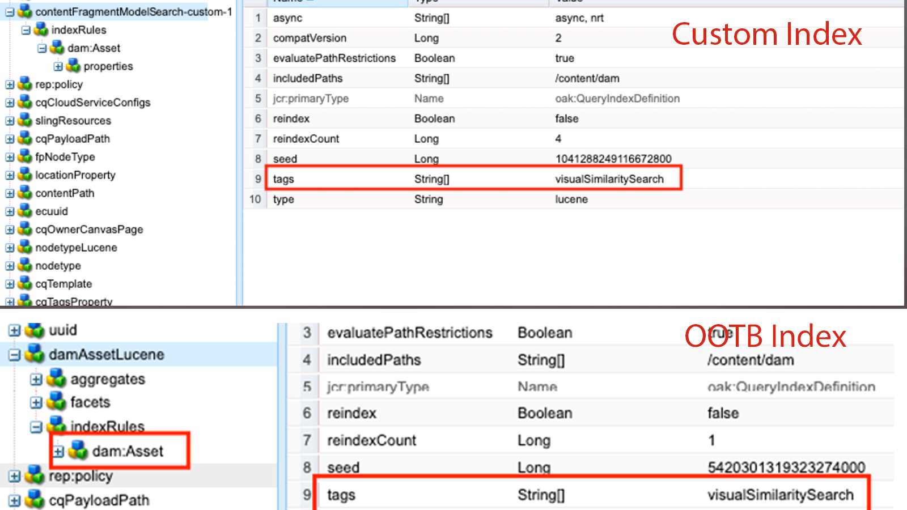
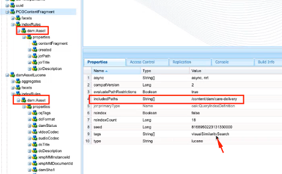
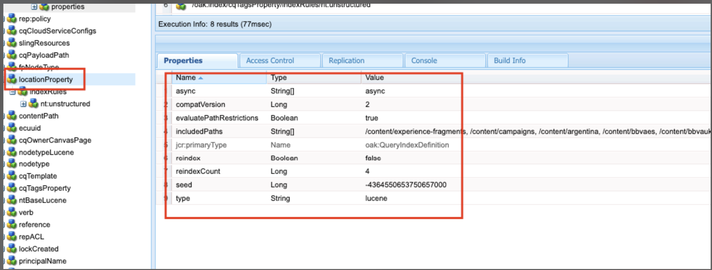
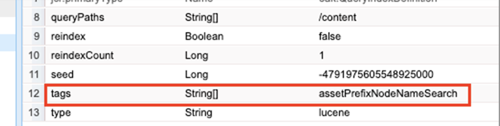
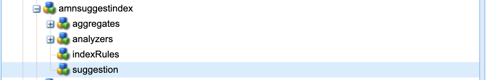
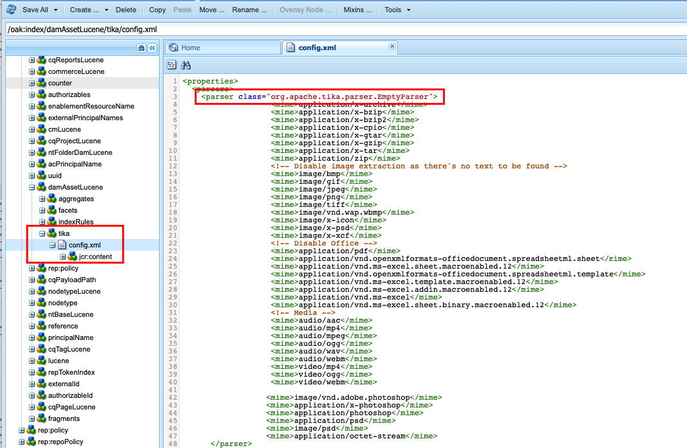
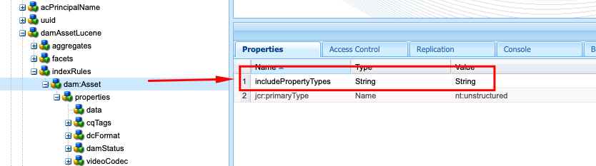
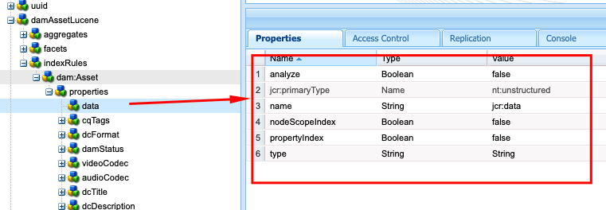

# Indexing best practices in AEM

Learn about indexing best practices in Adobe Experience Manager (AEM). Apache [Jackrabbit Oak](https://jackrabbit.apache.org/oak/docs/query/query.html) powers the content search in AEM and the following are key points:

- Out of the box, AEM provides various indexes to support search and query functionality, for example `damAssetLucene`, `cqPageLucene` and more.  
- All index definitions are stored in the repository under `/oak:index` node.
- AEM as a Cloud Service only supports Oak Lucene indexes. 
- Index configuration should be managed in the AEM project codebase and deployed using Cloud Manager CI/CD pipelines.
- If multiple indexes are available for a given query, the **index with the lowest estimated cost is used**.
- If no index is available for a given query, the content tree is traversed to find the matching content. However, the default limit via `org.apache.jackrabbit.oak.query.QueryEngineSettingsService` is to traverse only 10,0000 nodes.
- The results of a query are **filtered at last** to ensure that the current user has read access. This means that the query results may be smaller than the number of indexed nodes.
- The reindexing of the repository after index definition changes requires time and it depends on the size of the repository.

To have an efficient and correct search functionality that does not impact the performance of the AEM instance, it is important to understand the indexing best practices.

## Custom vs OOTB index

At times, you must create custom indexes to support your search requirements. However follow below guidelines before creating custom indexes:

- Understand the search requirements and check if the OOTB indexes can support the search requirements. Use **Query Performance Tool**, available at [local SDK](http://localhost:4502/libs/granite/operations/content/diagnosistools/queryPerformance.html) and AEMCS via the Developer Console or `https://author-pXXXX-eYYYY.adobeaemcloud.com/ui#/aem/libs/granite/operations/content/diagnosistools/queryPerformance.html?appId=aemshell`.

- Define an optimal query, use the [optimizing queries](https://experienceleague.adobe.com/en/docs/experience-manager-cloud-service/content/operations/query-and-indexing-best-practices) flow chart and [JCR Query Cheat Sheet](https://experienceleague.adobe.com/docs/experience-manager-65/assets/JCR_query_cheatsheet-v1.1.pdf?lang=en) for reference.

- If the OOTB indexes cannot support the search requirements, you have two options. However, review the [Tips for Creating Efficient Indexes](https://experienceleague.adobe.com/en/docs/experience-manager-65/content/implementing/deploying/practices/best-practices-for-queries-and-indexing)
    - Customize the OOTB index: Preferred option as it is easy to maintain and upgrade.
    - Fully custom index: Only if the above option does not work.

### Customize the OOTB index

- In **AEMCS**, when customizing the OOTB index use **\<OOTBIndexName>-\<productVersion>-custom-\<customVersion>** naming convention. For example, `cqPageLucene-custom-1` or `damAssetLucene-8-custom-1`. This helps to merge the customized index definition whenever the OOTB index is updated. See [Changes to Out-of-the-Box Indexes](https://experienceleague.adobe.com/en/docs/experience-manager-cloud-service/content/operations/indexing) for more details.

- In **AEM 6.X**, the above naming _does not work_, however simply update the OOTB index with necessary properties in the `indexRules` node.

- Always copy the latest OOTB index definition from the AEM instance using the CRX DE Package Manager (/crx/packmgr/), rename it and add customizations inside the XML file.

- Store index definition into the AEM project at `ui.apps/src/main/content/jcr_root/_oak_index` and deploy it using Cloud Manager CI/CD pipelines. See [Deploying Custom Index Definitions](https://experienceleague.adobe.com/en/docs/experience-manager-cloud-service/content/operations/indexing) for more details.

### Fully custom index

Creating fully custom index must be your last option and only if the above option does not work.

- When creating a fully custom index, use **\<prefix>.\<customIndexName>-\<version>-custom-\<customVersion>** naming convention. For example, `wknd.adventures-1-custom-1`. This helps to avoid naming conflicts. Here, `wknd` is the prefix and `adventures` is the custom index name. This convention is applicable for both AEM 6.X and AEMCS and helps to prepare for future migration to AEMCS.

- AEMCS only supports Lucene indexes, so to prepare for future migration to AEMCS, always use Lucene indexes. See [Lucene Indexes vs Property Indexes](https://experienceleague.adobe.com/en/docs/experience-manager-65/content/implementing/deploying/practices/best-practices-for-queries-and-indexing) for more details.

- Avoid creating a custom index on the same node type as the OOTB index. Instead, customize the OOTB index with necessary properties in the `indexRules` node. For example, do not create a custom index on the `dam:Asset` node type but customize the OOTB `damAssetLucene` index. _It has been a common root cause of performance and functional issues_.

- Also, avoid adding multiple node types for example `cq:Page` and `cq:Tag` under the indexing rules (`indexRules`) node. Instead, create separate indexes for each node type.

- As mentioned in above section, store index definition into the AEM project at `ui.apps/src/main/content/jcr_root/_oak_index` and deploy it using Cloud Manager CI/CD pipelines. See [Deploying Custom Index Definitions](https://experienceleague.adobe.com/en/docs/experience-manager-cloud-service/content/operations/indexing) for more details.

- The index definition guidelines are:
    - The node type (`jcr:primaryType`) should be `oak:QueryIndexDefinition`
    - The index type (`type`) should be `lucene`
    - The async property (`async`) should be `async,nrt`
    - Use `includedPaths` and avoid `excludedPaths` property. Always set `queryPaths` value to the same value as `includedPaths` value. 
    - To enforce the path restriction, use `evaluatePathRestrictions` property and set it to `true`.
    - Use `tags` property to tag the index and while querying specify this tags value to use the index. The general query syntax is `<query> option(index tag <tagName>)`.
    
    ```xml
    /oak:index/wknd.adventures-1-custom-1
        - jcr:primaryType = "oak:QueryIndexDefinition"
        - type = "lucene"
        - compatVersion = 2
        - async = ["async", "nrt"]
        - includedPaths = ["/content/wknd"]
        - queryPaths = ["/content/wknd"]
        - evaluatePathRestrictions = true
        - tags = ["customAdvSearch"]
    ...
    ```

### Examples

To understand the best practices, let's review few examples.

#### Improper use of tags property

Below image shows custom and OOTB index definition, highlighting the `tags` property, both indexes use same `visualSimilaritySearch` value. 



##### Analysis

This is an improper use of the `tags` property on the custom index. The Oak query engine picks the custom index over the OOTB index cause of the lowest estimated cost.

The correct way is to customize the OOTB index and add necessary properties in the `indexRules` node. See [Customizing the OOTB index](#customize-the-ootb-index) for more details.

#### Index on the `dam:Asset` node type

Below image shows custom index for the `dam:Asset` node type with the `includedPaths` property set to a specific path.



##### Analysis

If you perform omnisearch on Assets, it returns incorrect results cause the custom index has lower estimated cost.

Do not create a custom index on the `dam:Asset` node type but customize the OOTB `damAssetLucene` index with necessary properties in the `indexRules` node. 

#### Multiple node types under indexing rules

Below image shows custom index with multiple node types under the `indexRules` node.


##### Analysis

 It is not recommended to add multiple node types in a single index, however, it is fine to index node types in the same index if the node types are closely related, for example, `cq:Page` and `cq:PageContent`.

 A valid solution is to customize the OOTB `cqPageLucene` and `damAssetLucene` index, add necessary properties under the existing `indexRules` node. 

#### Absence of `queryPaths` property

Below image shows custom index (not following naming convention as well) without `queryPaths` property.



##### Analysis

Always set `queryPaths` value to the same value as `includedPaths` value. Also, to enforce the path restriction, set `evaluatePathRestrictions` property to `true`.

#### Querying with index tag

Below image shows custom index with `tags` property and how to use it while querying.



```
/jcr:root/content/dam//element(*,dam:Asset)[(jcr:content/@contentFragment = 'true' and jcr:contains(., '/content/sitebuilder/test/mysite/live/ja-jp/mypage'))]order by @jcr:created descending option (index tag assetPrefixNodeNameSearch)
```

##### Analysis

Demonstrates how to set non-conflicting and correct `tags` property value on the index and use it while querying. The general query syntax is `<query> option(index tag <tagName>)`. Also see [Query Option Index Tag](https://jackrabbit.apache.org/oak/docs/query/query-engine.html#query-option-index-tag)

#### Custom index

Below image shows custom index with `suggestion` node for achieving the advanced search functionality.



##### Analysis

It is a valid use case to create a custom index for the [advanced search](https://jackrabbit.apache.org/oak/docs/query/lucene.html#advanced-search-features) functionality. However, index name should follow the **\<prefix>.\<customIndexName>-\<version>-custom-\<customVersion>** naming convention.

## Index optimization by disabling Apache Tika

AEM uses [Apache Tika](https://tika.apache.org/) for _extracting metadata and text content from file_ types like PDF, Word, Excel, and more. The extracted content is stored in the repository and indexed by the Oak Lucene index.

At times users do not require the ability to search within the content of a file/asset, in such cases, you can improve the indexing performance by disabling the Apache Tika. The advantages are:

- Faster indexing
- Index size reduction
- Less hardware usage

>[!CAUTION]
>
>Before disabling the Apache Tika, ensure that the search requirements do not require the ability to search within the content of an asset.


### Disable by mime type

To disable Apache Tika by mime type, use following steps:

- Add the `tika` node of `nt:unstructured` type under custom or OOBT index definition. In following example, the PDF mime type is disabled for OOTB `damAssetLucene` index.

```xml
/oak:index/damAssetLucene
    - jcr:primaryType = "oak:QueryIndexDefinition"
    - type = "lucene"
    ...
    <tika jcr:primaryType="nt:unstructured">
        <config.xml/>
    </tika>
```

- Add the `config.xml` with following details under the `tika` node.

```xml
<properties>
  <parsers>
    <parser class="org.apache.tika.parser.EmptyParser">
      <mime>application/pdf</mime>
      <!-- Add more mime types to disable -->
  </parsers>
</properties>
```

- To refresh the stored index, set the `refresh` property to `true` under the index definition node, see [Index Definition Properties](https://jackrabbit.apache.org/oak/docs/query/lucene.html#index-definition:~:text=Defaults%20to%2010000-,refresh,-Optional%20boolean%20property) for more details.

The following image shows the OOTB `damAssetLucene` index with the `tika` node and `config.xml` file that disables the PDF and other mime types.



### Disable completely

To disable Apache Tika completely, follow below steps:

- Add `includePropertyTypes` property at `/oak:index/<INDEX-NAME>/indexRules/<NODE-TYPE>` and set the value to `String`. For example in below image, the `includePropertyTypes` property is added for the `dam:Asset` node type of the OOBT `damAssetLucene` index.



- Add `data` with below properties under the `properties` node, make sure it is first node above the property definition. For example see below image:

```xml
/oak:index/<INDEX-NAME>/indexRules/<NODE-TYPE>/properties/data
    - jcr:primaryType = "nt:unstructured"
    - type = "String"
    - name = "jcr:data"
    - nodeScopeIndex = false
    - propertyIndex = false
    - analyze = false
```



- Reindex the updated index definition by setting the `reindex` property to `true` under the index definition node.

## Helpful tools

Let's review few tools that can help you to define, analyze, and optimize the indexes.

### Index creation tool

The [Oak Index Definition Generator](https://oakutils.appspot.com/generate/index) tool helps **to generate the index definition** based on the input queries. It is a good starting point to create a custom index.

### Analyze index tool

The [Index Definition Analyzer](https://oakutils.appspot.com/analyze/index) tool helps **to analyze the index definition** and provides recommendations to improve the index definition.

### Query performance tool

The OOTB _Query Performance Tool_ available at [local SDK](http://localhost:4502/libs/granite/operations/content/diagnosistools/queryPerformance.html) and AEMCS via the Developer Console or `https://author-pXXXX-eYYYY.adobeaemcloud.com/ui#/aem/libs/granite/operations/content/diagnosistools/queryPerformance.html?appId=aemshell` helps **to analyze the query performance** and [JCR Query Cheat Sheet](https://experienceleague.adobe.com/docs/experience-manager-65/assets/JCR_query_cheatsheet-v1.1.pdf?lang=en) to define the optimal query.

### Troubleshooting tools and tips

Most of the below are applicable for AEM 6.X and local troubleshooting purposes.

- Index Manager available at `http://host:port/libs/granite/operations/content/diagnosistools/indexManager.html` for getting index info like type, last updated, size.

- Detailed logging of Oak query and indexing-related Java&trade; packages like `org.apache.jackrabbit.oak.plugins.index`, `org.apache.jackrabbit.oak.query`, and `com.day.cq.search` via `http://host:port/system/console/slinglog` for troubleshooting.

- JMX MBean of _IndexStats_ type available at `http://host:port/system/console/jmx` for getting index info like status, progress, or statistics related to asynchronous indexing. It also provides _FailingIndexStats_, if there are no results here, means that no indexes are corrupt. AsyncIndexerService marks any index that fails to update for 30 minutes (configurable) as corrupt and stops indexing them. If a query is not giving expected results, it is helpful for developers to check this before proceeding with reindexing as reindexing is computationally expensive and time consuming. 

- JMX MBean of _LuceneIndex_ type available at `http://host:port/system/console/jmx` for Lucene Index statistics like size, number of documents per index definition.

- JMX MBean of _QueryStat_ type available at `http://host:port/system/console/jmx` for Oak Query Statistics including slow and popular queries with details like query, execution time.

## Additional resources

Refer to the following documentation for more information:

- [Oak Queries and Indexing](https://experienceleague.adobe.com/en/docs/experience-manager-65/content/implementing/deploying/deploying/queries-and-indexing)
- [Query and Indexing Best Practices](https://experienceleague.adobe.com/en/docs/experience-manager-cloud-service/content/operations/query-and-indexing-best-practices)
- [Best Practices for Queries and Indexing](https://experienceleague.adobe.com/en/docs/experience-manager-65/content/implementing/deploying/practices/best-practices-for-queries-and-indexing)

