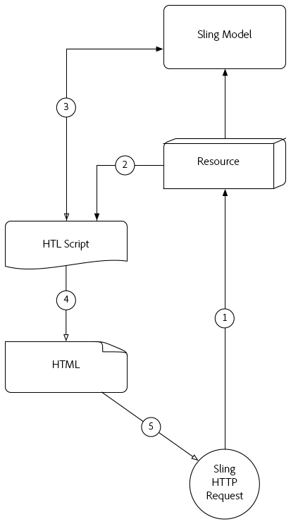
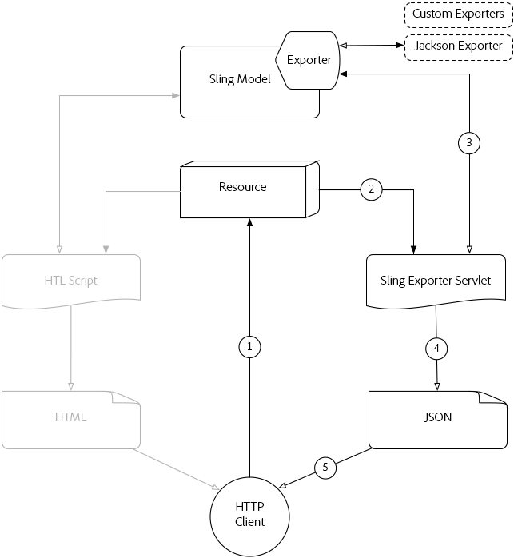

# Understand [!DNL Sling Model Exporter]

Apache [!DNL Sling Models] 1.3.0 introduces [!DNL Sling Model Exporter], an elegant way to export or serialize [!DNL Sling Model] objects into custom abstractions. This article juxtaposes the traditional use-case of using [!DNL Sling Models] to populate HTL scripts, with leveraging the [!DNL Sling Model Exporter] framework to serialize a [!DNL Sling Model] into JSON.

## Traditional Sling Model HTTP Request flow

The traditional use-case for [!DNL Sling Models] is to provide a business abstraction for a resource or request, which provides HTL scripts (or, previously JSPs) an interface for accessing business functions.

Common patterns are developing [!DNL Sling Models] that represent AEM Components or Pages, and using the [!DNL Sling Model] objects to feed the HTL scripts with data, with an end result of HTML that's displayed in the browser.

### Sling Model HTTP Request flow

1. [!DNL HTTP GET] Request is made for a resource in AEM.

   Example: `HTTP GET /content/my-resource.html`

1. Based on the request resource’s `sling:resourceType`, the appropriate Script is resolved.  

1. The Script adapts the Request or Resource to the desired [!DNL Sling Model].  

1. The Script uses the [!DNL Sling Model] object to generate the HTML rendition.  

1. The HTML generated by the Script is returned in the HTTP Response.

This traditional pattern works well in the context of generating HTML as the [!DNL Sling Model] can be easily leveraged via HTL. Creating more structured data such a JSON or XML is a far more tedious endeavour as HTL doesn't naturally lend itself to the definition of these formats.

## [!DNL Sling Model Exporter] HTTP Request flow

Apache [!DNL Sling Model Exporter] comes with a Sling provided Jackson Exporter that automatically serializes an "ordinary" [!DNL Sling Model] object into JSON. The Jackson Exporter, while quite configurable, at its core inspects the [!DNL Sling Model] object, and generates JSON using any "getter" methods as JSON keys, and the getter return values as the JSON values.

The direct serialization of [!DNL Sling Models] allows them to service both normal Web requests with their HTML responses created using the traditional [!DNL Sling Model] request flow (see above), but also expose JSON renditions that can be consumed by web services or JavaScript applications.

*This flow describes the flow using the provided Jackson Exporter to produce JSON output. Use of custom exporters follow the same flow but with their output format.*

1. HTTP GET Request is made for a resource in AEM with the selector and extension registered with the [!DNL Sling Model]’s Exporter.

   Example: `HTTP GET /content/my-resource.model.json`

1. Sling resolves the the requested resource’s `sling:resourceType`, selector and extension to a dynamically generated Sling Exporter Servlet, which is mapped to the [!DNL Sling Model] with Exporter.  
1. The resolved Sling Exporter Servlet invokes the [!DNL Sling Model Exporter] against the [!DNL Sling Model] object adapted from the request or resource (as determined by the Sling Models adaptables).
1. The exporter serializes the [!DNL Sling Model] based on the Exporter Options and Exporter-specific Sling Model annotations and returns the result to the Sling Exporter Servlet.
1. The Sling Exporter Servlet returns the JSON rendition of the [!DNL Sling Model] in the HTTP Response.

>[!NOTE]
>
>While the Apache Sling project provides the Jackson Exporter that serializes [!DNL Sling Models] to JSON, the Exporter framework also supports custom Exporters. For example, a project could implement a custom Exporter that serializes a [!DNL Sling Model] into XML.

>[!NOTE]
>
>Not only does [!DNL Sling Model Exporter] *serialize* [!DNL Sling Models], it can also export them as Java objects. The exporting to other Java objects does not play a role in the HTTP Request flow, and thus does not appear in the above diagram.

## Supporting materials

* [Apache [!DNL Sling Model Exporter] Framework documentation](https://sling.apache.org/documentation/bundles/models.html#exporter-framework-since-130)
