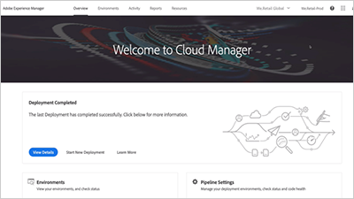
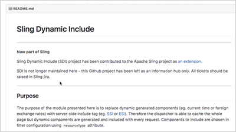
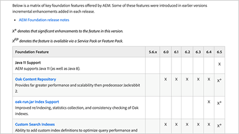

# AEM Foundation videos and tutorials {#overview}

Adobe Experience Manager provides a common set of capabilities available to users of AEM Sites, Assets, and Forms.

## What's new

* **[Use Workflow AEM (Video)](./workflow/use-workflow.md)**
    *AEM Workflow provides a way to collaborate, manage, and process content in AEM.*

* **[Understand Cloud Manager for AEM (Video)](./cloud-manager/understand-cloud-manager-for-aem.md)**  
    *Cloud Manager for AEM allows easy management, inspection, and self-service of AEM environments.*

* **[Set up public and private keys for use with Adobe I/O (Tutorial)](./authentication/set-up-public-private-keys-for-use-with-aem-and-adobe-io.md)**  
    *Learn how keys and keystores are generated using [!DNL openssl] that work with AEM and Adobe I/O.*

* **[Use the Cloud Manager CI/CD Pipeline (Video)](./cloud-manager/use-the-cicd-pipeline-in-cloud-manager-for-aem.md)**  
    *Learn how to use Cloud Manager's CI/CD pipeline to ensure safe and consistent deployments.*

## Staff picks

<table>
<tr>
  <td>
    
    

     <a href="./cloud-manager/understand-cloud-manager-for-aem.md">
    <strong>Understand Cloud Manager for AEM</strong>
    </a>
    

    

    <em>Cloud Manager for AEM provides a simple, yet robust solution that allows easy management, inspection, and self-service of AEM environments.</em>
    

  </td>
   <td>
    
     

     <a href="./development/set-up-sling-dynamic-include.md">
    <strong>Set up Sling Dynamic Include (SDI)</strong>
    </a>
    

    

    <em>Explore how to set up Sling Dynamic Include (SDI) and allow dynamic AEM components to always serve fresh content.</em>
    

  </td>
  <td>
    
    

    <a href="./administration/understand-reasons-to-upgrade.md">
    <strong>Understand Reasons to Upgrade AEM</strong>
    </a>
    

    

    <em>A high-level breakdown of key features to understand, when considering upgrading to the latest version of AEM.</em>
    

  </td>
</tr>
</table>

## Additional resources

* [Experience League - Explore AEM](https://experienceleague.adobe.com/#recommended/solutions/experience-manager)
* [AEM as a Cloud Service tutorials](/help/cloud-service/overview.md)
* [AEM Sites videos and tutorials](/help/sites/overview.md)
* [AEM Assets videos and tutorials](/help/assets/overview.md)
* [AEM Forms videos and tutorials](/help/forms/overview.md)
