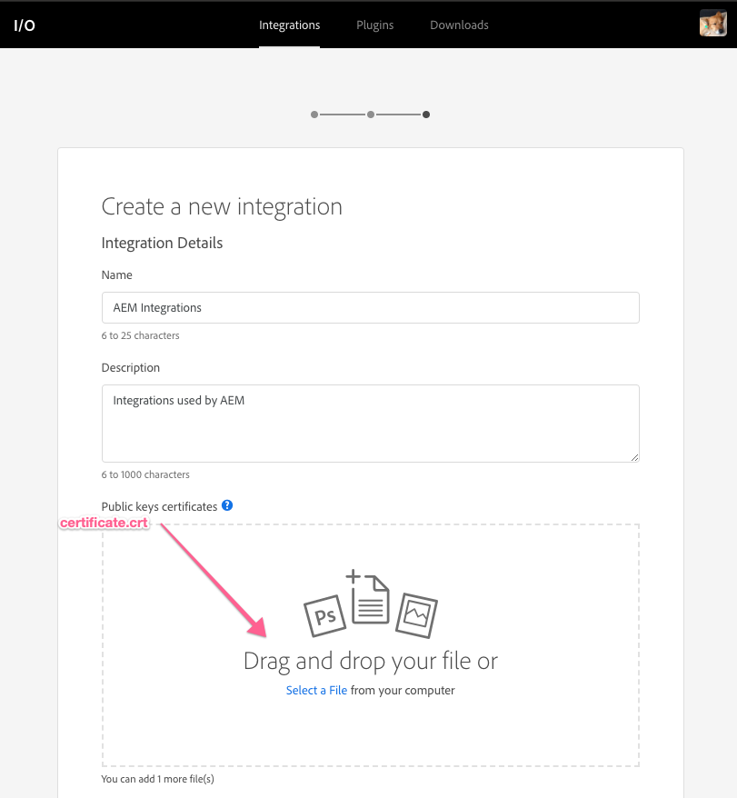

# Overview {#overview}

Adobe Experience Manager Foundation provides a common set of capabilities available to users of AEM Sites, Assets and Forms.

## What's New

* **[Understand Cloud Manager for AEM (Video)](./cloud-manager/understand-cloud-manager-for-aem.md)**
    

    *Adobe Managed Services' (AMS) Cloud Manager for AEM provides a simple, yet robust solution that allows easy management, introspect and self-service of AEM environments.*
    

* **[Understand Cloud Manager for AEM (Video)](./cloud-manager/understand-cloud-manager-for-aem.md)**
    

    *Adobe Managed Services' (AMS) Cloud Manager for AEM provides a simple, yet robust solution that allows easy management, introspect and self-service of AEM environments.*
    

* **[Understand Cloud Manager for AEM (Video)](./cloud-manager/understand-cloud-manager-for-aem.md)**  
     
    *Adobe Managed Services' (AMS) Cloud Manager for AEM provides a simple, yet robust solution that allows easy management, introspect and self-service of AEM environments.*

## Staff Picks

<table>
<tr>
  <td>
    
     
     <a href="https://docs.adobe.com/content/help/en/experience-manager-learn/getting-started-wknd-tutorial-develop/overview.html">
    <b>Testing</b> 
    </a>
    

    <i>Test description.</i>
    

  </td>
   <td>
    
     
     <a href="https://docs.adobe.com/content/help/en/experience-manager-learn/getting-started-wknd-tutorial-develop/overview.html">
    <b>Testing</b> 
    </a>
    

    <i>Test description.</i>
    

  </td>
  <td>
    
     
     <a href="https://docs.adobe.com/content/help/en/experience-manager-learn/getting-started-wknd-tutorial-develop/overview.html">
    <b>Testing</b> 
    </a>
     
    <i>Test description.</i>
  </td>
</tr>
</table>

## Additional Resources

* [Experience League - Explore AEM](https://experienceleague.adobe.com/#recommended/solutions/experience-manager)
* [AEM Sites Authoring User Guide](https://helpx.adobe.com/experience-manager/6-5/sites/authoring/user-guide.html)
* [AEM Sites Developing User Guide](https://helpx.adobe.com/experience-manager/6-5/sites/developing/user-guide.html)
* [AEM Sites Administering User Guide](https://helpx.adobe.com/experience-manager/6-5/sites/administering/user-guide.html)
* [AEM Sites Deploying User Guide](https://helpx.adobe.com/experience-manager/6-5/sites/deploying/user-guide.html)
* [AEM Assets Videos and Tutorials](/help/assets/overview.md)
* [AEM Forms Videos and Tutorials](/help/forms/introduction.md)
