# Develop Projects in AEM

This is a development tutorial illustrating how to develop for [!DNL AEM Projects]. In this tutorial we will create a custom Project template that can be used to create Projects within AEM for managing content authoring workflows and tasks.

>[!VIDEO](https://video.tv.adobe.com/v/16904?quality=12&learn=on)

*This video gives a brief demo of the finished workflow that is created in the tutorial below.*

## Introduction {#introduction}

[[!DNL AEM Projects]](https://experienceleague.adobe.com/en/docs/experience-manager-65/content/sites/authoring/projects/projects) is a feature of AEM designed to make it easier to manage and group all of the workflows and tasks associated with content creation as part of an AEM Sites or Assets implementation.

AEM Projects comes with several [OOTB project templates](https://experienceleague.adobe.com/en/docs/experience-manager-65/content/sites/authoring/projects/projects). When creating a project, authors can choose from these available templates. Large AEM implementations with unique business requirements will want to create custom Project templates, tailored to meet their needs. By creating a custom Project template developers can configure the project dashboard, hook into custom workflows, and create additional business roles for a project. We will look at the structure of a Project Template and create a sample one.

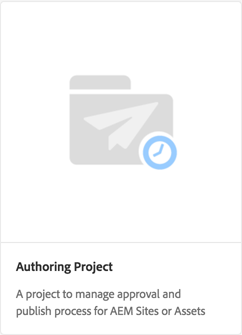

## Setup

This tutorial will step through the code necessary to create a custom Project template. You can download and install the [attached package](./assets/develop-aem-projects/projects-tasks-guide.ui.apps-0.0.1-SNAPSHOT.zip) to a local environment to follow along with the tutorial. You can also access the full Maven project hosted on [GitHub](https://github.com/Adobe-Marketing-Cloud/aem-guides/tree/feature/projects-tasks-guide).

* [Finished Tutorial Package](./assets/develop-aem-projects/projects-tasks-guide.ui.apps-0.0.1-SNAPSHOT.zip)
* [Full Code Repository on GitHub](https://github.com/Adobe-Marketing-Cloud/aem-guides/tree/feature/projects-tasks-guide)

This tutorial assumes some basic knowledge of [AEM development practices](https://experienceleague.adobe.com/en/docs/experience-manager-65/content/implementing/developing/introduction/the-basics) and some familiarity with [AEM Maven project setup](https://docs.adobe.com/content/help/en/experience-manager-65/developing/devtools/ht-projects-maven.html). All code mentioned is intended to be used as a reference and should only be deployed to a [local development AEM instance](https://experienceleague.adobe.com/en/docs/experience-manager-65/content/implementing/deploying/deploying/deploy).

## Structure of a project template

Project Templates should be put under source control and should live beneath your application folder under /apps. Ideally they should be placed in a subfolder with the naming convention of **&#42;/projects/templates/**&lt;my-template&gt;. By placing following this naming convention any new custom templates will automatically become available to authors when creating a project. The configuration of available Project Templates is set at: **/content/projects/jcr:content** node by the **cq:allowedTemplates** property. By default this is a regular expression: **/(apps|libs)/.&#42;/projects/templates/.&#42;**

The root node of a Project Template will have a **jcr:primaryType** of **cq:Template**. Beneath the root node of there are three nodes: **gadgets**, **roles**, and **workflows**. These nodes are all **nt:unstructured**. Beneath the root node can also be a thumbnail.png file that gets displayed when selecting the template in the Create Project wizard.

The full node structure:

```shell
/apps/<my-app>
    + projects (nt:folder)
         + templates (nt:folder)
              + <project-template-root> (cq:Template)
                   + gadgets (nt:unstructured)
                   + roles (nt:unstructured)
                   + workflows (nt:unstructured)

```

### Project Template Root

The root node of the project template is of type **cq:Template**. On this node you can configure properties **jcr:title** and **jcr:description** that is displayed in the Create Project Wizard. There is also a property called **wizard** that points to a form that will populate the Properties of the project. The default value of: **/libs/cq/core/content/projects/wizard/steps/defaultproject.html** should work fine for most cases, as it allows the user to populate the basic Project properties and add group members.

*&#42;Note the Create Project Wizard does not use the Sling POST servlet. Instead values are posted to a custom servlet: **com.adobe.cq.projects.impl.servlet.ProjectServlet**. This should be taken into account when adding custom fields.*

An example of a custom wizard can be found for the Translation Project Template: **/libs/cq/core/content/projects/wizard/translationproject/defaultproject**.

### Gadgets {#gadgets}

There are no additional properties on this node but the children of the gadgets node control which Project Tiles populate the Project's dashboard when a new Project is created. [The Project Tiles](https://experienceleague.adobe.com/en/docs/experience-manager-65/content/sites/authoring/projects/projects) (also known as gadgets or pods) are simple cards that populate the workplace of a Project. A full list of ootb tiles can be found under: **/libs/cq/gui/components/projects/admin/pod. **Project owners can always add/remove tiles after a project has been created.

### Roles {#roles}

There are three [default Roles](https://experienceleague.adobe.com/en/docs/experience-manager-65/content/sites/authoring/projects/projects) for every project: **Observers**, **Editors**, and **Owners**. By adding child nodes beneath the roles node, you can add additional business-specific Project Roles for the template. You can then tie these roles to specific workflows associated with the project.

### Workflows {#workflows}

One the most enticing reasons for creating a custom Project Template are that it gives you the ability to configure the available workflows for use with the project. These can OOTB workflows or custom workflows. Beneath the **workflows** node there needs to be a **models** node (also `nt:unstructured`) and child nodes beneath specify the available workflow models. The property **modelId **points to the workflow model under /etc/workflow and the property **wizard** points to the dialog used when starting the workflow. A significant advantage of Projects is the ability to add a custom dialog (wizard) to capture business-specific metadata at the start of the workflow that can the drive further actions within the workflow.

```shell
<projects-template-root> (cq:Template)
    + workflows (nt:unstructured)
         + models (nt:unstructured)
              + <workflow-model> (nt:unstructured)
                   - modelId = points to the workflow model
                   - wizard = dialog used to start the workflow
```

## Creating a project template {#creating-project-template}

Since we are primarily copying/configuring nodes, we will use CRXDE Lite. In your local AEM instance, open up [CRXDE Lite](http://localhost:4502/crx/de/index.jsp).

1. Start by creating a folder beneath `/apps/&lt;your-app-folder&gt;` named `projects`. Create another folder beneath that named `templates`.

   ```shell
   /apps/aem-guides/projects-tasks/
                       + projects (nt:folder)
                                + templates (nt:folder)
   ```

1. To make things easier, we will start our custom template from the existing Simple Project template.

    1. Copy and paste the node **/libs/cq/core/content/projects/templates/default** beneath the *templates* folder created in Step 1.

   ```shell
   /apps/aem-guides/projects-tasks/
                + templates (nt:folder)
                     + default (cq:Template)
   ```

1. You should now have a path like **/apps/aem-guides/projects-tasks/projects/templates/authoring-project**.

    1. Edit the **jcr:title** and **jcr:description** properties of the author-project node to custom title and description values.

        1. Leave the **wizard** property pointing to the default Project properties.

   ```shell
   /apps/aem-guides/projects-tasks/projects/
            + templates (nt:folder)
                 + authoring-project (cq:Template)
                      - jcr:title = "Authoring Project"
                      - jcr:description = "A project to manage approval and publish process for AEM Sites or Assets"
                      - wizard = "/libs/cq/core/content/projects/wizard/steps/defaultproject.html"
   ```

1. For this project template we want to make use of Tasks.
    1. Add a new **nt:unstructured** node beneath authoring-project/gadgets called **tasks**. 
    1. Add String properties to the tasks node for **cardWeight** = "100", **jcr:title**="Tasks", and **sling:resourceType**="cq/gui/components/projects/admin/pod/taskpod".

   Now the [Tasks tile](https://experienceleague.adobe.com/docs/#Tasks) will show up by default when a new project is created.

   ```shell
   ../projects/templates/authoring-project
       + gadgets (nt:unstructured)
            + team (nt:unstructured)
            + asset (nt:unstructured)
            + work (nt:unstructured)
            + experiences (nt:unstructured)
            + projectinfo (nt:unstructured)
            ..
            + tasks (nt:unstructured)
                 - cardWeight = "100"
                 - jcr:title = "Tasks"
                 - sling:resourceType = "cq/gui/components/projects/admin/pod/taskpod"
   ```

1. We will add a custom Approver Role to our project template.

    1. Beneath the project template (authoring-project) node add a new **nt:unstructured** node-labeled **roles**. 
    1. Add another **nt:unstructured** node labeled approvers as a child of the roles node. 
    1. Add String properties **jcr:title** = "**Approvers**", **roleclass** ="**owner**", **roleid**="**approvers**".
        1. The name of the approvers node, as well as jcr:title and roleid can be any string value (as long as roleid is unique). 
        1. **roleclass** governs the permissions applied for that role based on the [three OOTB roles](https://experienceleague.adobe.com/en/docs/experience-manager-65/content/sites/authoring/projects/projects): **owner**, **editor**, and **observer**.
        1. In general if the custom role is more of a managerial role then the roleclass can be **owner;** if it is a more specific authoring role like Photographer or Designer then **editor** roleclass should suffice. The big difference between **owner** and **editor** is that project owners can update the project properties and add new users to the project.

   ```shell
   ../projects/templates/authoring-project
       + gadgets (nt:unstructured)
       + roles (nt:unstructured)
           + approvers (nt:unstructured)
                - jcr:title = "Approvers"
                - roleclass = "owner"
                - roleid = "approver"
   ```

1. By copying the Simple Project template, you will get four OOTB workflows configured. Each node beneath workflows/models points to a specific workflow and a start dialog wizard for that workflow. Later in this tutorial we will create a custom workflow for this project. For now, delete the nodes beneath workflow/models:

   ```shell
   ../projects/templates/authoring-project
       + gadgets (nt:unstructured)
       + roles (nt:unstructured)
       + workflows (nt:unstructured)
            + models (nt:unstructured)
               - (remove ootb models)
   ```

1. To make it easy for content authors to identify the Project Template you can add a custom Thumbnail. The recommended size would be 319x319 pixels.
    1. In CRXDE Lite create a file as a sibling of gadgets, roles, and workflows nodes named **thumbnail.png**.
    1. Save and then navigate to the `jcr:content` node and double-click the `jcr:data` property (avoid clicking 'view').
        1. This should prompt you with an edit `jcr:data` file dialog and you can upload a custom thumbnail.

   ```shell
   ../projects/templates/authoring-project
       + gadgets (nt:unstructured)
       + roles (nt:unstructured)
       + workflows (nt:unstructured)
       + thumbnail.png (nt:file)
   
   ```

Finished XML representation of the Project Template:

```xml
<?xml version="1.0" encoding="UTF-8"?>
<jcr:root xmlns:sling="http://sling.apache.org/jcr/sling/1.0" xmlns:cq="http://www.day.com/jcr/cq/1.0" xmlns:jcr="http://www.jcp.org/jcr/1.0" xmlns:nt="http://www.jcp.org/jcr/nt/1.0"
    jcr:description="A project to manage approval and publish process for AEM Sites or Assets"
    jcr:primaryType="cq:Template"
    jcr:title="Authoring Project"
    ranking="{Long}1"
    wizard="/libs/cq/core/content/projects/wizard/steps/defaultproject.html">
    <jcr:content
        jcr:primaryType="nt:unstructured"
        detailsHref="/projects/details.html"/>
    <gadgets jcr:primaryType="nt:unstructured">
        <team
            jcr:primaryType="nt:unstructured"
            jcr:title="Team"
            sling:resourceType="cq/gui/components/projects/admin/pod/teampod"
            cardWeight="60"/>
        <tasks
            jcr:primaryType="nt:unstructured"
            jcr:title="Tasks"
            sling:resourceType="cq/gui/components/projects/admin/pod/taskpod"
            cardWeight="100"/>
        <work
            jcr:primaryType="nt:unstructured"
            jcr:title="Workflows"
            sling:resourceType="cq/gui/components/projects/admin/pod/workpod"
            cardWeight="80"/>
        <experiences
            jcr:primaryType="nt:unstructured"
            jcr:title="Experiences"
            sling:resourceType="cq/gui/components/projects/admin/pod/channelpod"
            cardWeight="90"/>
        <projectinfo
            jcr:primaryType="nt:unstructured"
            jcr:title="Project Info"
            sling:resourceType="cq/gui/components/projects/admin/pod/projectinfopod"
            cardWeight="100"/>
    </gadgets>
    <roles jcr:primaryType="nt:unstructured">
        <approvers
            jcr:primaryType="nt:unstructured"
            jcr:title="Approvers"
            roleclass="owner"
            roleid="approvers"/>
    </roles>
    <workflows
        jcr:primaryType="nt:unstructured"
        tags="[]">
        <models jcr:primaryType="nt:unstructured">
        </models>
    </workflows>
</jcr:root>
```

## Testing the custom project template

Now we can test our Project Template by creating a Project.

1. You should see the custom template as one of the options for project creation.

   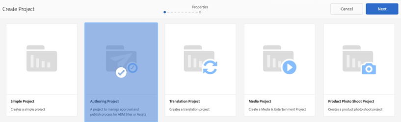

1. After selecting the custom template click 'Next' and notice that when populating Project Members, you can add them as an Approver role. 

   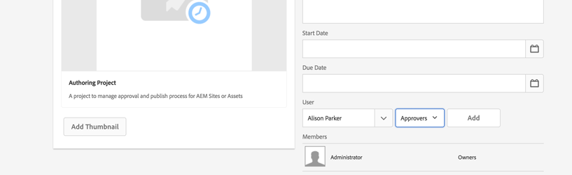

1. Click 'Create' to finish creating the project based off the custom Template. You will notice on the Project Dashboard that the Tasks Tile and the other tiles configured under gadgets appear automatically.

   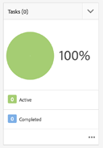


## Why Workflow?

Traditionally AEM workflows that center around an approval process have used Participant workflow steps. AEM's Inbox includes details around Tasks and Workflow and enhanced integration with AEM Projects. These features make using the Projects Create Task process steps a more attractive option.

### Why Tasks?

Using a Task Creation Step over traditional Participant steps offers a couple of advantages:

* **Start and Due Date** - makes it easy for authors to manage their time, the new Calendar feature makes use of these dates.
* **Priority** - built in priorities of Low, Normal, and High allows authors to prioritize the work
* **Threaded Comments** - as authors work on a task they have the ability to leave comments increasing collaboration
* **Visibility** - Task tiles and views with Projects allow managers to view how time is being spent
* **Project Integration** - Tasks are already integrated with Project roles and dashboards

Like Participant steps, Tasks can be dynamically assigned and routed. Task metadata like Title, Priority can also be dynamically set based on previous actions as we will see with the following tutorial.

While Tasks have some advantages over Participant Steps they do carry additional overhead, and are not as useful outside of a Project. In addition, all dynamic behavior of Tasks must be coded using ecma scripts which have its own limitations.

## Sample use-case requirements {#goals-tutorial}


The above diagram outlines the high-level requirements for our sample approval workflow.

The first step is to create a Task to finish editing a piece of content. We will allow the workflow initiator to choose the assignee of this first task.

Once the first task is complete the assignee will have three options for routing the workflow:

**Normal **- normal routing creates a task assigned to the Project's Approver group to review and approve. Priority of the task is Normal and the due date is five days from when it is created.

**Rush** - rush routing also creates a task assigned to the Project's Approver group. Priority of the task is High and the due date is only one day.

**Bypass** - in this sample workflow the initial participant has the option to bypass the approval group. (yes this might defeat the purpose of an 'Approval' workflow but it allows us to illustrate additional routing capabilities)

The Approver Group can approve the content or send it back to the initial assignee for rework. In the case of being sent back for, rework a new task is created and appropriately labeled 'Sent Back for Rework'.

The last step of the workflow makes use of the ootb Activate Page/Asset process step and replicates the payload.

## Create the workflow model

1. From the AEM Start Menu, navigate to Tools -&gt; Workflow -&gt; Models. Click 'Create' in the upper right-hand corner to create a Workflow Model.

   Give the new model a title: "Content Approval Workflow" and a url name: "content-approval-workflow".

   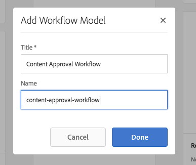

   [For more information related to creating workflows, read here](https://experienceleague.adobe.com/en/docs/experience-manager-65/content/implementing/developing/extending-aem/extending-workflows/workflows-models). 

1. As a best practice custom workflows should be grouped in their own folder beneath /etc/workflow/models. In CRXDE Lite, create a **'nt:folder'** beneath /etc/workflow/models named **"aem-guides"**. Adding a subfolder ensures that custom workflows are not accidentally overwritten during upgrades or Service Pack installations.

   &#42;Note it is important to never place the folder or custom workflows beneath ootb subfolders like /etc/workflow/models/dam or /etc/workflow/models/projects as the entire subfolder may also be overwritten by upgrades or service packs.

   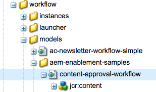

   Location of workflow model in 6.3

   >[!NOTE]
   >
   >If using AEM 6.4+ the location of Workflow has changed. See [here for more details.](https://experienceleague.adobe.com/en/docs/experience-manager-65/content/implementing/developing/extending-aem/extending-workflows/workflows-best-practices)

   If using AEM 6.4+ the workflow model is created under `/conf/global/settings/workflow/models`. Repeat the above steps with the /conf directory and add a subfolder named `aem-guides` and move the `content-approval-workflow` beneath it.

   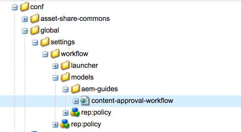
   Location of workflow model in 6.4+

1. Introduced in AEM 6.3 is the ability to add Workflow Stages to a given workflow. The stages will appear to the user from the Inbox on the Workflow Info tab. It will show the user the current stage in the workflow as well as the stages preceding and following it.

   To configure the stages, open up the Page Properties dialog from the SideKick. The fourth tab is labeled "Stages". Add the following values to configure the three stages of this workflow:

    1. Edit Content
    1. Approval
    1. Publish

   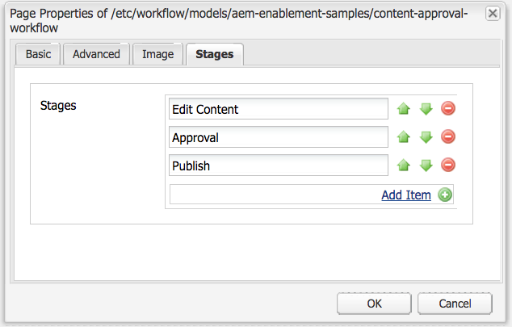

   Configure the Workflow Stages from the Page Properties dialog.

   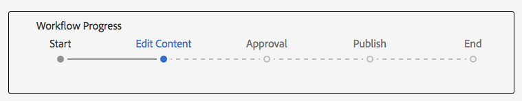

   The workflow progress bar as seen from the AEM Inbox.

   Optionally you can upload an **Image** to the Page Properties that is used as the Workflow thumbnail when users select it. Image dimensions should be 319x319 pixels. Adding a **Description** to the Page Properties will also show up when a user goes to select the workflow.

1. The Create Project Task workflow process is designed to create a Task as a step in the workflow. Only after completing the task will the workflow move forward. A powerful aspect of the Create Project Task step is that it can read workflow meta-data values and use those to dynamically create the task.

   First delete the Participant Step that gets created by default. From the Sidekick in the components menu expand the **"Projects"** subheading and drag+drop the **"Create Project Task"** onto the model.

   Double+Click the "Create Project Task" step to open the workflow dialog. Configure the following properties:

   This tab is common for all workflow process steps and we will set the Title and Description (these will not be visible to the end user). The important property that we will set is the Workflow Stage to **"Edit Content"** from the drop-down menu.

   ```shell
   Common Tab
   -----------------
       Title = "Start Task Creation"
       Description = "This the first task in the Workflow"
       Workflow Stage = "Edit Content"
   ```

   The Create Project Task workflow process is designed to create a Task as a step in the workflow. The Task Tab allows us to set all the values of the task. In our case we want the Assignee to be dynamic so we will leave it blank. The rest of the property values:

   ```shell
   Task Tab
   -----------------
       Name* = "Edit Content"
       Task Priority = "Medium"
       Description = "Edit the content and finalize for approval. Once finished submit for approval."
       Due In - Days = "2"
   ```

   The routing tab is an optional dialog that can specify available actions for the user completing the task. These Actions are just string values and are saved to the workflow's metadata. These values can be read by scripts and/or process steps later in the workflow to dynamically "route" the workflow. Based on the workflow goals we will, add three actions to this tab:

   ```shell
   Routing Tab
   -----------------
       Actions =
           "Normal Approval"
           "Rush Approval"
           "Bypass Approval"
   ```

   This tab allows us to configure a Pre-Create Task Script where we can programmatically decide various values of the Task before it is created. We have the option of pointing the script to an external file or embedding a short script directly in the dialog. In our case we will point the Pre-Create Task Script to an external file. In Step 5 we will create that script.

   ```shell
   Advanced Settings Tab
   -----------------
      Pre-Create Task Script = "/apps/aem-guides/projects/scripts/start-task-config.ecma"
   ```

1. In the previous step we referenced a Pre-Create Task Script. We will create that script now in which we will set the Assignee of the Task based on the value of a workflow metadata value "**assignee**". The **"assignee"** value is set when the workflow is kicked off. We will also read the workflow metadata to dynamically choose the priority of the task by reading the "**taskPriority"** value of the workflow's metadata as well as the **"taskDueDate" **to dynamically set when the first task is due.

   For organizational purposes we have created a folder beneath our app folder to hold all our project-related scripts: **/apps/aem-guides/projects-tasks/projects/scripts**. Create a file beneath this folder named **"start-task-config.ecma"**. &#42;Note make sure the path to your start-task-config.ecma file matches the path set in the Advanced Settings Tab in Step 4.

   Add the following as the contents of the file:

   ```
   // start-task-config.ecma
   // Populate the task using values stored as workflow metadata originally posted by the start workflow wizard
   
   // set the assignee based on start workflow wizard
   var assignee = workflowData.getMetaDataMap().get("assignee", Packages.java.lang.String);
   task.setCurrentAssignee(assignee);
   
   //Set the due date for the initial task based on start workflow wizard
   var dueDate = workflowData.getMetaDataMap().get("taskDueDate", Packages.java.util.Date);
   if (dueDate != null) {
       task.setProperty("taskDueDate", dueDate);
   }
   
   //Set the priority based on start workflow wizard
   var taskPriority = workflowData.getMetaDataMap().get("taskPriority", "Medium");
   task.setProperty("taskPriority", taskPriority);
   ```

1. Navigate back to the Content Approval Workflow. Drag+Drop the **OR Split** component (found in the Sidekick beneath 'Workflow' category) beneath the **Start Task** Step. On the Common Dialog select the radio button for 3 Branches. The OR Split will read the workflow metadata value **"lastTaskAction"** to determine the route of the workflow. The **"lastTaskAction"** property is set to one of the values from the Routing Tab configured in Step 4. For each of the Branch tabs fill out the **Script** text area with the following values:

   ```
   function check() {
   var lastAction = workflowData.getMetaDataMap().get("lastTaskAction","");
   
   if(lastAction == "Normal Approval") {
       return true;
   }
   
   return false;
   }
   ```

   ```
   function check() {
   var lastAction = workflowData.getMetaDataMap().get("lastTaskAction","");
   
   if(lastAction == "Rush Approval") {
       return true;
   }
   
   return false;
   }
   ```

   ```
   function check() {
   var lastAction = workflowData.getMetaDataMap().get("lastTaskAction","");
   
   if(lastAction == "Bypass Approval") {
       return true;
   }
   
   return false;
   }
   ```

   &#42;Note we are doing a direct String match to determine the route so it is important that the values set in the Branch scripts match the Route values set in Step 4.

1. Drag+Drop another "**Create Project Task**" step on to the model to the far left (Branch 1) beneath the OR split. Fill out the dialog with the following properties:

   ```
   Common Tab
   -----------------
       Title = "Approval Task Creation"
       Description = "Create a an approval task for Project Approvers. Priority is Medium."
       Workflow Stage = "Approval"
   
   Task Tab
   ------------
       Name* = "Approve Content for Publish"
       Task Priority = "Medium"
       Description = "Approve this content for publication."
       Days = "5"
   
   Routing Tab - Actions
   ----------------------------
       "Approve and Publish"
       "Send Back for Revision"
   ```

   Since this is the Normal Approval route the priority of the task is set to Medium. In addition we give the Approvers group 5 days to complete the Task. Assignee is left blank on the Task Tab as we will dynamically assign this in the Advanced Settings Tab. We give the Approvers group two possible routes when completing this task: **"Approve and Publish"** if they approve the content and it can be published and **"Send Back for Revision"** if there are issues that the original editor needs to correct. The approver can leave comments that the original editor will see if the workflow is returned to him/her.

  Earlier in this tutorial we created a Project Template that included an Approvers Role. Each time a new Project is created from this Template a project-specific Group is created for the Approvers role. Just like a Participant Step a Task can only be assigned to a User or Group. We want to assign this task to the project group that corresponds to the Approvers Group. All workflows that are launched from within a Project will have metadata that maps the Project Roles to the Project specific group.

   Copy+Paste the following code in the **Script** text area of the **Advanced Settings **tab. This code will read the workflow metadata and assign the task to the Project's Approvers group. If it cannot find the approvers group value it will fall back to assigning the task to the Administrators group.

   ```
   var projectApproverGrp = workflowData.getMetaDataMap().get("project.group.approvers","administrators");
   
   task.setCurrentAssignee(projectApproverGrp);
   ```

1. Drag+Drop another "**Create Project Task**" step on to the model to the middle branch (Branch 2) beneath the OR split. Fill out the dialog with the following properties:

   ```
   Common Tab
   -----------------
       Title = "Rush Approval Task Creation"
       Description = "Create a an approval task for Project Approvers. Priority is High."
       Workflow Stage = "Approval"
   
   Task Tab
   ------------
       Name* = "Rush Approve Content for Publish"
       Task Priority = "High"
       Description = "Rush approve this content for publication."
       Days = "1"
   
   Routing Tab - Actions
   ----------------------------
       "Approve and Publish"
       "Send Back for Revision"
   ```

   Since this is the Rush Approval route the priority of the task is set to High. In addition we give the Approvers group only a single day to complete the task. Assignee is left blank on the Task Tab as we will dynamically assign this in the Advanced Settings Tab.

   We can re-use the same script snippet as in Step 7 to populate the **Script** text-area on the** Advanced Settings **tab. Copy+Paste the below code:

   ```
   var projectApproverGrp = workflowData.getMetaDataMap().get("project.group.approvers","administrators");
   
   task.setCurrentAssignee(projectApproverGrp);
   ```

1. Drag+Drop a** No Operation** component to the far right branch (Branch 3). The No Operation component does not perform any action and it will advanced immediately, representing the original editor's desire to bypass the approval step. Technically we could leave this Branch without any workflow steps, but as a best practice we will add a No Operation step. This makes it clear to other developers what the purpose of Branch 3 is.

   Double click the workflow step and configure the Title and Description:

   ```
   Common Tab
   -----------------
       Title = "Bypass Approval"
       Description = "Placeholder step to indicate that the original editor decided to bypass the approver group."
   ```

   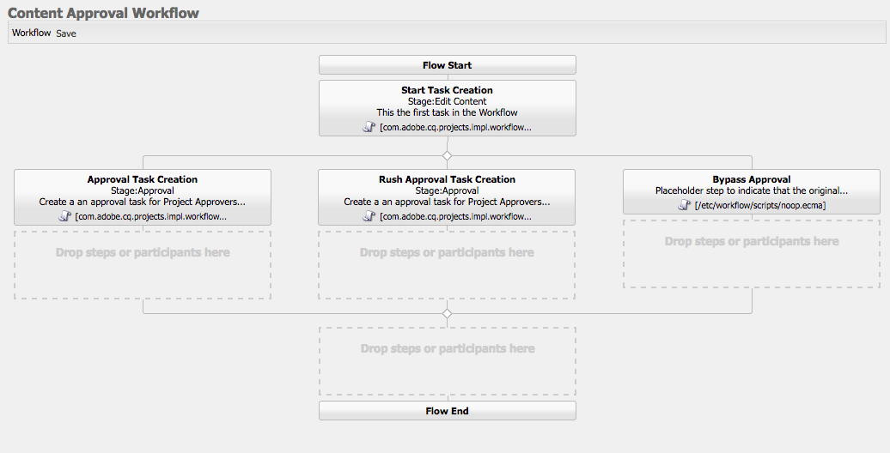

   The Workflow Model should look like this after all three branches in the OR split have been configured.

1. Since the Approvers group has the option of sending the workflow back to the original editor for further revisions we will rely on the **Goto** step to read the last action taken and route the workflow to the beginning or let it continue.

   Drag+Drop the Goto Step component (found in the Sidekick under Workflow) beneath the OR split where it re-joins. Double click and configure the following properties in the dialog:

   ```
   Common Tab
   ----------------
       Title = "Goto Step"
       Description = "Based on the Approver groups action route the workflow to the beginning or continue and publish the payload."
   
   Process Tab
   ---------------
       The step to go to. = "Start Task Creation"
       
   ```

   The last piece that we will configure is the Script as part of the Goto process step. The Script value can be embedded via the dialog or configured to point to an external file. The Goto Script must contain a **function check()** and return true if the workflow should go to the specified step. A return of false results in the workflow moving forward.

   If the approver group chooses the **"Send Back for Revision"** action (configured in Step 7 and 8) then we want to return the workflow to the **"Start Task Creation"** step.

   On the Process Tab add the following snippet to the Script text-area:

   ```
   function check() {
   var lastAction = workflowData.getMetaDataMap().get("lastTaskAction","");
   
   if(lastAction == "Send Back for Revision") {
       return true;
   }
   
   return false;
   }
   ```

1. To the publish the payload we will use the ootb **Activate Page/Asset** Process step. This process step requires little configuration and will add the workflow's payload to the replication queue for activation. We will add the step beneath the Goto step and in this way it can only be reached if the Approver group has approved the content for publishing or the original editor chose the Bypass Approval route.

   Drag+Drop the **Activate Page/Asset** Process step (found in the Sidekick under WCM Workflow) beneath the Goto Step in the model.

   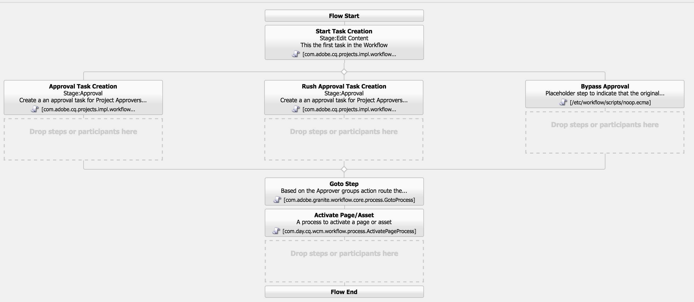

   What the workflow model should look like after adding the Goto step and Activate Page/Asset step.

1. If the Approver group sends the content back for revision we want to let the original editor know. We can accomplish this by dynamically changing the Task creation properties. We will key off of the lastActionTaken property value of **"Send Back for Revision"**. If that value is present we will modify the title and description to indicate that this task is the result of content being sent back for revision. We will also update the priority to **"High"** so that it is the first item the editor works on. Finally we will set the task due date to one day from when the workflow was sent back for revision.

   Replace the start `start-task-config.ecma` script (created in Step 5) with the following:

   ```
   // start-task-config.ecma
   // Populate the task using values stored as workflow metadata originally posted by the start workflow wizard
   
   // set the assignee based on start workflow wizard
   var assignee = workflowData.getMetaDataMap().get("assignee", Packages.java.lang.String);
   task.setCurrentAssignee(assignee);
   
   //Set the due date for the initial task based on start workflow wizard
   var dueDate = workflowData.getMetaDataMap().get("taskDueDate", Packages.java.util.Date);
   if (dueDate != null) {
       task.setProperty("taskDueDate", dueDate);
   }
   
   //Set the priority based on start workflow wizard
   var taskPriority = workflowData.getMetaDataMap().get("taskPriority", "Medium");
   task.setProperty("taskPriority", taskPriority);
   
   var lastAction = workflowData.getMetaDataMap().get("lastTaskAction","");

   //change the title and priority if the approver group sent back the content
   if(lastAction == "Send Back for Revision") {
     var taskName = "Review and Revise Content";
   
     //since the content was rejected we will set the priority to High for the revison task
     task.setProperty("taskPriority", "High"); 
   
     //set the Task name (displayed as the task title in the Inbox) 
     task.setProperty("name", taskName);
     task.setProperty("nameHierarchy", taskName);
     
     //set the due date of this task 1 day from current date
     var calDueDate = Packages.java.util.Calendar.getInstance();
     calDueDate.add(Packages.java.util.Calendar.DATE, 1);
     task.setProperty("taskDueDate", calDueDate.getTime());
     
   }
   ```

## Create the "start workflow" wizard {#start-workflow-wizard}

When kicking off a workflow from within a project you must specify a wizard to start the workflow. The default wizard: `/libs/cq/core/content/projects/workflowwizards/default_workflow` allows the user to enter a Workflow Title, a start comment, and a payload path for the workflow to run. There are also several other examples found under: `/libs/cq/core/content/projects/workflowwizards`.

Creating a custom wizard can be very powerful as you can collect critical information before the workflow starts. The data is stored as part of the workflow's metadata and workflow processes can read this and dynamically change behavior based on values entered. We will create a custom wizard to dynamically assign the first task in the workflow based on a start wizard value.

1. In CRXDE-Lite we will create a sub-folder beneath `/apps/aem-guides/projects-tasks/projects` folder called "wizards". Copy the default wizard from: `/libs/cq/core/content/projects/workflowwizards/default_workflow` beneath the newly created wizards folder and rename it to **content-approval-start**. The full path should now be: `/apps/aem-guides/projects-tasks/projects/wizards/content-approval-start`.

   The default wizard is a 2-column wizard with the first column showing Title, Description and Thumbnail of the workflow model selected. The second column includes fields for the Workflow Title, Start Comment and Payload Path. The wizard is a standard Touch UI form and makes use of standard [Granite UI Form components](https://experienceleague.adobe.com/docs/) to populate the fields.

   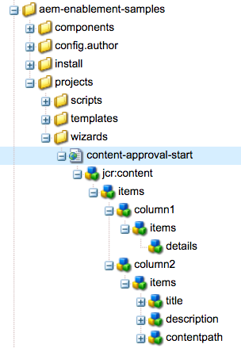

1. We will add an additional field to the wizard that is used to set the assignee of the first task in the workflow (see [Create the Workflow Model](#create-workflow-model): Step 5).

   Beneath `../content-approval-start/jcr:content/items/column2/items` create a new node of type `nt:unstructured` named **"assign"**. We will use the Projects User Picker component (which is based off of the [Granite User Picker Component](https://experienceleague.adobe.com/docs/)). This form field makes it easy to restrict the user and group selection to only those belonging to the current project.

   Below is the XML representation of the **assign** node:

   ```xml
   <assign
       granite:class="js-cq-project-user-picker"
       jcr:primaryType="nt:unstructured"
       sling:resourceType="cq/gui/components/projects/admin/userpicker"
       fieldLabel="Assign To"
       hideServiceUsers="{Boolean}true"
       impersonatesOnly="{Boolean}true"
       showOnlyProjectMembers="{Boolean}true"
       name="assignee"
       projectPath="${param.project}"
       required="{Boolean}true"/>
   ```

1. We will also add a priority selection field that will determine the priority of the first task in the workflow (see [Create the Workflow Model](#create-workflow-model): Step 5).

   Beneath `/content-approval-start/jcr:content/items/column2/items` create a new node of type `nt:unstructured` named **priority**. We will use the [Granite UI Select component](https://experienceleague.adobe.com/docs/experience-manager-release-information/aem-release-updates/previous-updates/aem-previous-versions.html) to populate the form field.

   Beneath the **priority** node we will add an **items** node of **nt:unstructured**. Beneath the **items** node add 3 more nodes to populate the selection options for High, Medium, and Low. Each node is of type **nt:unstructured** and should have a **text** and **value** property. Both the text and value should be the same value:

    1. High
    1. Medium
    1. Low

   For the Medium node add an additional Boolean property named "**selected"** with a value set to **true**. This will ensure Medium is the default value in the selection field.

   Below is an XML representation of the node structure and properties:

   ```xml
   <priority
       jcr:primaryType="nt:unstructured"
       sling:resourceType="granite/ui/components/coral/foundation/form/select"
       fieldLabel="Task Priority"
       name="taskPriority">
           <items jcr:primaryType="nt:unstructured">
               <high
                   jcr:primaryType="nt:unstructured"
                   text="High"
                   value="High"/>
               <medium
                   jcr:primaryType="nt:unstructured"
                   selected="{Boolean}true"
                   text="Medium"
                   value="Medium"/>
               <low
                   jcr:primaryType="nt:unstructured"
                   text="Low"
                   value="Low"/>
               </items>
   </priority>
   ```

1. We will allow the workflow initiator to set the due date of the initial task. We will use the [Granite UI DatePicker](https://experienceleague.adobe.com/docs/) form field to capture this input. We will also add a hidden field with a [TypeHint](https://sling.apache.org/documentation/bundles/manipulating-content-the-slingpostservlet-servlets-post.html#typehint) to ensure that the input is stored as a Date type property in the JCR.

   Add two **nt:unstructured** nodes with the following properties represented below in XML:

   ```xml
   <duedate
       granite:rel="project-duedate"
       jcr:primaryType="nt:unstructured"
       sling:resourceType="granite/ui/components/coral/foundation/form/datepicker"
       displayedFormat="YYYY-MM-DD HH:mm"
       fieldLabel="Due Date"
       minDate="today"
       name="taskDueDate"
       type="datetime"/>
   <duedatetypehint
       jcr:primaryType="nt:unstructured"
       sling:resourceType="granite/ui/components/coral/foundation/form/hidden"
       name="taskDueDate@TypeHint"
       type="datetime"
       value="Calendar"/>
   ```

1. You can view the full code for the start wizard dialog [here](https://github.com/Adobe-Marketing-Cloud/aem-guides/blob/master/projects-tasks-guide/ui.apps/src/main/content/jcr_root/apps/aem-guides/projects-tasks/projects/wizards/content-approval-start/.content.xml).

## Connecting the workflow and project template {#connecting-workflow-project}

The last thing we need to do is ensure that the workflow model is available to be kicked off from within one of the Projects. To do this, we need to re-visit the Project Template we created in Part 1 of this series.

The Workflow configuration is an area of a Project Template that specifies the available workflows to be used with that project. The configuration is also responsible for specifying the Start Workflow Wizard when kicking off the workflow (which we created in the [previous steps)](#start-workflow-wizard). The Workflow configuration of a Project Template is "live" meaning that updating the workflow configuration will effect new Projects created as well as existing Projects that use the template.

1. In CRXDE-Lite navigate to the authoring project template created earlier at `/apps/aem-guides/projects-tasks/projects/templates/authoring-project/workflows/models`.

   Beneath the models node add a new node named **contentapproval** with a node type of **nt:unstructured**. Add the following properties to the node:

   ```xml
   <contentapproval
       jcr:primaryType="nt:unstructured"
       modelId="/etc/workflow/models/aem-guides/content-approval-workflow/jcr:content/model"
       wizard="/apps/aem-guides/projects-tasks/projects/wizards/content-approval-start.html"
   />
   ```

   >[!NOTE]
   >
   >If using AEM 6.4 the location of Workflow has changed. Point the `modelId` property to the location of the runtime workflow model under `/var/workflow/models/aem-guides/content-approval-workflow`
   >
   >
   >See [here for more details about the change in location of workflow.](https://experienceleague.adobe.com/en/docs/experience-manager-65/content/implementing/developing/extending-aem/extending-workflows/workflows-best-practices)

   ```xml
   <contentapproval
       jcr:primaryType="nt:unstructured"
       modelId="/var/workflow/models/aem-guides/content-approval-workflow"
       wizard="/apps/aem-guides/projects-tasks/projects/wizards/content-approval-start.html"
   />
   ```

1. Once the Content Approval workflow has been added to the Project Template it should be available to kick off from the Workflow Tile of the project. Go ahead and launch and play around with the various routings we have created.

## Supporting materials

* [Download Finished Tutorial Package](./assets/develop-aem-projects/projects-tasks-guide.ui.apps-0.0.1-SNAPSHOT.zip)
* [Full Code Repository on GitHub](https://github.com/Adobe-Marketing-Cloud/aem-guides/tree/feature/projects-tasks-guide)
* [AEM Projects Documentation](https://experienceleague.adobe.com/en/docs/experience-manager-65/content/sites/authoring/projects/projects)
