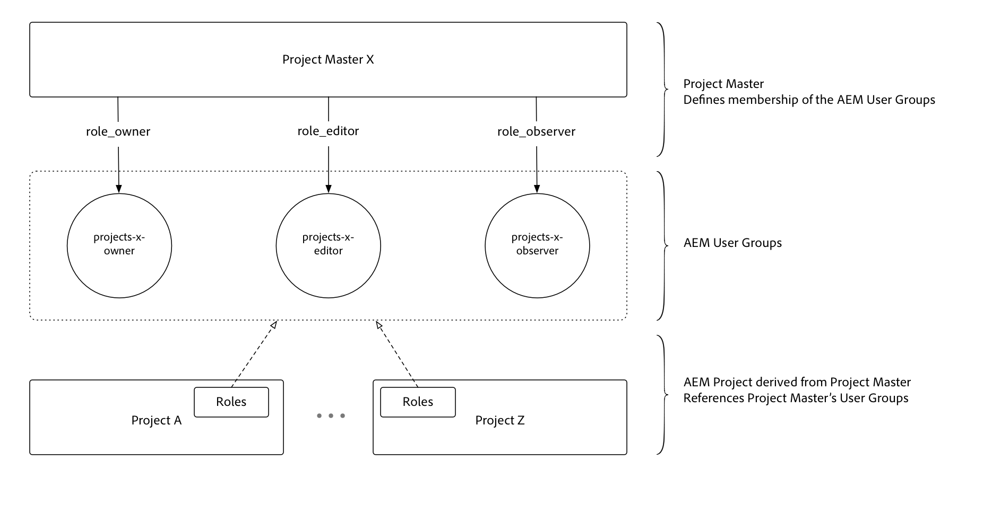

# Use Project Masters

Project Masters greatly simplifies user and team management with [!DNL AEM Projects].

>[!VIDEO](https://video.tv.adobe.com/v/17740?quality=12&learn=on)

Administrators can now create a **[!DNL Master Project]** and assign users to roles/permissions as part of a Project Team. Projects can be created from a Master Project and automatically inherit the Team membership. This offers several advantages:

* Reuse existing Teams across multiple projects
* Accelerates project creation as Teams do not have to be re-created by hand
* Manage Team membership from a central location and any updates to Teams are automatically inherited by Projects
* avoids creation of duplicate ACLs which can cause performance issues

[!DNL Master Projects] can be created under the [!UICONTROL Masters] folder under [!UICONTROL AEM Projects]. Once a Master Project is created, it shows as an option alongside available templates in the wizard when new Projects are created.

[!DNL Project Masters] URL (local AEM Author instance): [http://localhost:4502/projects.html/content/projects/masters](http://localhost:4502/projects.html/content/projects/masters)

## Delete [!DNL Project Masters]

Deleting a master project results in unusable derived projects. 

Before deleting a master project, ensure that all derived projects are finished and removed from AEM. Make sure to save any required project data before removing the derived projects. Once all derived projects are removed from AEM, the master project can safely be deleted.

## Mark [!DNL Project Masters] as Inactive

By changing the master project's status to inactive in the project's properties, the inactive master projects disappears from the master projects list. 

To show inactive master projects, toggle the "show active" filter button in the top bar (next to the list display toggle). To make the inactive project active again, simply select the inactive master project, edit project properties, and set it once again to be active.

## Understand [!DNL Project Masters]

[!DNL Project Masters] work by defining a set of AEM user groups (owners, editor, and observer) and allowing derived Projects to reference and reuse those centrally defined user groups.

This reduces the overall number of user groups required in AEM. Before [!DNL Project Masters], each project created 3 user groups with the accompanying ACEs to enforce permission-ing, thus 100 projects yielded 300 user groups. Project Masters allows any number of Projects to reuse the same three groups, assuming the shared membership aligns to Business requirements across the project.
