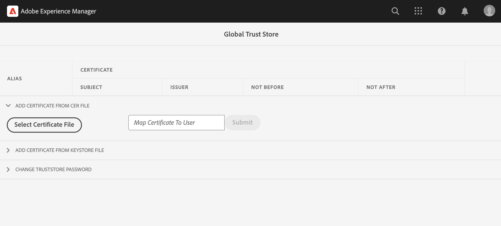

# Call internal APIs having private certificates

Learn how to make HTTPS calls from AEM to web APIs using private or self-signed certificates.

By default when trying to make an HTTPS connection to a web API that uses a self-signed certificate, the connection fails with the error:

```
PKIX path building failed: sun.security.provider.certpath.SunCertPathBuilderException: unable to find valid certification path to requested target
```

This issue typically occurs when the **API's SSL certificate is not issued by a recognized certificate authority (CA)** and Java&trade; application cannot validate SSL/TLS certificate.

Let's learn how to successfully call APIs that have private or self-signed certificates by using [Apache HttpClient](https://hc.apache.org/httpcomponents-client-4.5.x/index.html) and **AEM's global TrustStore**.


## Prototypical API invocation code using HttpClient

The following code makes an HTTPS connection to a web API:

```java
...
String API_ENDPOINT = "https://example.com";

// Create HttpClientBuilder
HttpClientBuilder httpClientBuilder = HttpClientBuilder.create();

// Create HttpClient
CloseableHttpClient httpClient = httpClientBuilder.build();

// Invoke API
CloseableHttpResponse closeableHttpResponse = httpClient.execute(new HttpGet(API_ENDPOINT));

// Code that reads response code and body from the 'closeableHttpResponse' object
...

```

The code uses the [Apache HttpComponent](https://hc.apache.org/)'s [HttpClient](https://hc.apache.org/httpcomponents-client-4.5.x/index.html) library classes and their methods.


## HttpClient and load AEM TrustStore material

To call an API endpoint that has _private or self-signed certificate_, the [HttpClient](https://hc.apache.org/httpcomponents-client-4.5.x/index.html)'s `SSLContextBuilder` must be loaded with AEM's TrustStore, and used to faciliate the connection. 

Follow the below steps:

1. Login to **AEM Author** as an **administrator**.
1. Navigate to **AEM Author > Tools > Security > Trust Store**, and open the **Global Trust Store**. If accessing first time, set a password for the Global Trust Store.

    

1. To import a private certificate, click **Select Certificate File** button and select desired certificate file with `.cer` extension. Import it by clicking **Submit** button.

1. Update Java&trade; code like below. Note that to use `@Reference` to get AEM's `KeyStoreService` the calling code must be an OSGi component/service, or a Sling Model (and `@OsgiService` is used there).

    ```java
    ...

    // Get AEM's KeyStoreService reference
    @Reference
    private com.adobe.granite.keystore.KeyStoreService keyStoreService;

    ...

    // Get AEM TrustStore using KeyStoreService
    KeyStore aemTrustStore = getAEMTrustStore(keyStoreService, resourceResolver);

    if (aemTrustStore != null) {

        // Create SSL Context
        SSLContextBuilder sslbuilder = new SSLContextBuilder();

        // Load AEM TrustStore material into above SSL Context
        sslbuilder.loadTrustMaterial(aemTrustStore, null);

        // Create SSL Connection Socket using above SSL Context
        SSLConnectionSocketFactory sslsf = new SSLConnectionSocketFactory(
                sslbuilder.build(), NoopHostnameVerifier.INSTANCE);

        // Create HttpClientBuilder
        HttpClientBuilder httpClientBuilder = HttpClientBuilder.create();
        httpClientBuilder.setSSLSocketFactory(sslsf);

        // Create HttpClient
        CloseableHttpClient httpClient = httpClientBuilder.build();

        // Invoke API
        closeableHttpResponse = httpClient.execute(new HttpGet(API_ENDPOINT));

        // Code that reads response code and body from the 'closeableHttpResponse' object
        ...
    } 

    /**
     * 
     * Returns the global AEM TrustStore
     * 
     * @param keyStoreService OOTB OSGi service that makes AEM based KeyStore
     *                         operations easy.
     * @param resourceResolver
     * @return
     */
    private KeyStore getAEMTrustStore(KeyStoreService keyStoreService, ResourceResolver resourceResolver) {

        // get AEM TrustStore from the KeyStoreService and ResourceResolver
        KeyStore aemTrustStore = keyStoreService.getTrustStore(resourceResolver);

        return aemTrustStore;
    }
    
    ...

    ```
    
    * Inject the OOTB `com.adobe.granite.keystore.KeyStoreService` OSGi service into your OSGi component.
    * Get the global AEM TrustStore using `KeyStoreService` and `ResourceResolver`, the `getAEMTrustStore(...)` method does that. 
    * Create an object of `SSLContextBuilder`, see Java&trade; [API details](https://javadoc.io/static/org.apache.httpcomponents/httpcore/4.4.8/index.html?org/apache/http/ssl/SSLContextBuilder.html).
    * Load the global AEM TrustStore into `SSLContextBuilder` using `loadTrustMaterial(KeyStore truststore,TrustStrategy trustStrategy)` method. 
    * Pass `null` for `TrustStrategy` in above method, it ensures that only AEM trusted certificates succeed during API execution.


>[!CAUTION]
>
>API calls with valid CA-issued certificates fail when executed using the mentioned approach. Only API calls with AEM trusted certificates are allowed to succeed when following this method. 
>
>Use the [standard approach](#prototypical-api-invocation-code-using-httpclient) for executing API calls of valid CA-issued certificates, meaning that only APIs associated with private certificates should be executed using the previously mentioned method.

## Avoid JVM Keystore changes

A conventional approach to effectively invoke internal APIs with private certificates involves modifying the JVM Keystore. It is achieved by importing the private certificates using the Java&trade; [keytool](https://docs.oracle.com/en/java/javase/11/tools/keytool.html#GUID-5990A2E4-78E3-47B7-AE75-6D1826259549) command. 

However, this method is not aligned with security best practices and AEM offers a superior option through the utilization of the **Global Trust Store** and [KeyStoreService](https://javadoc.io/doc/com.adobe.aem/aem-sdk-api/latest/com/adobe/granite/keystore/KeyStoreService.html).
