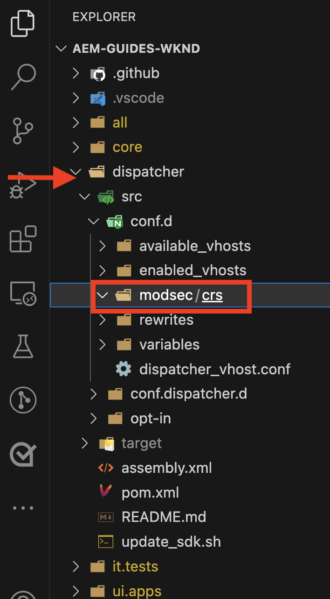
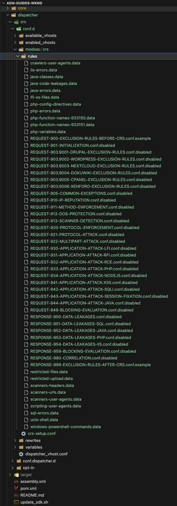
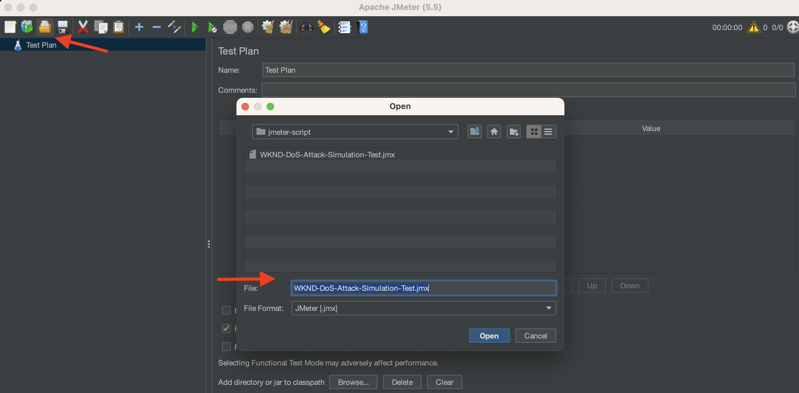
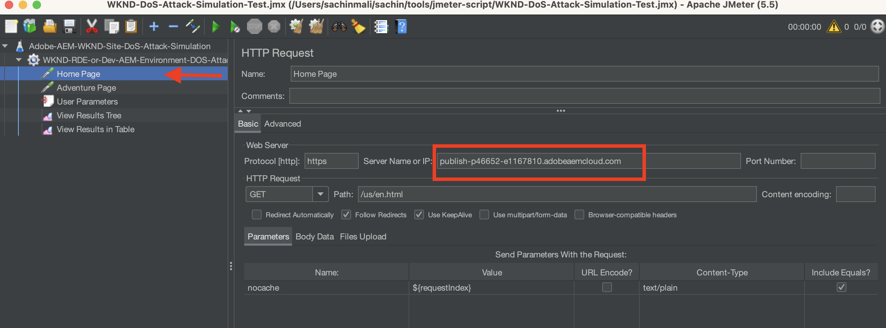
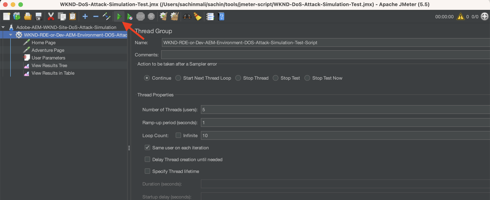
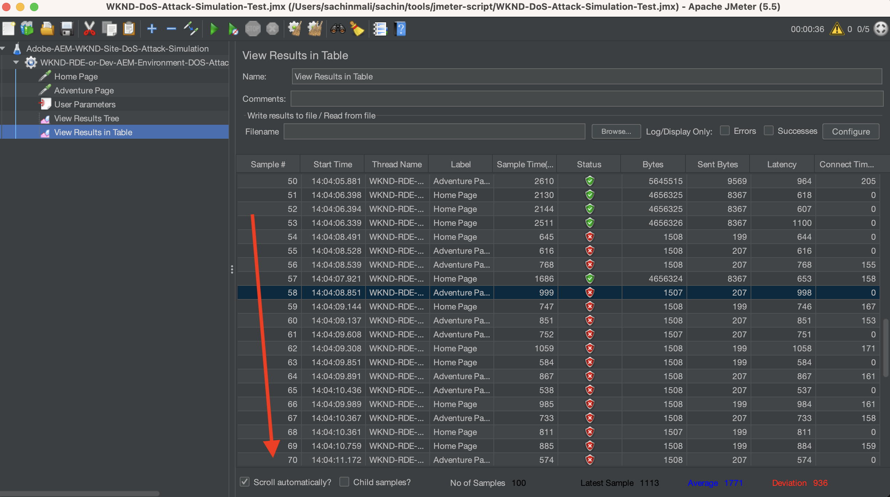
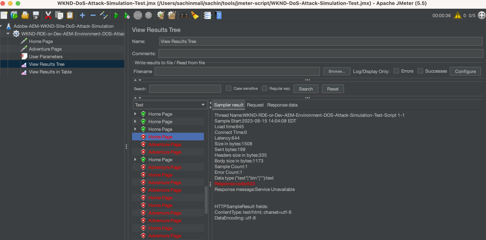

# Use ModSecurity to protect your AEM site from DoS attacks

Learn how to enable ModSecurity to protect your site from Denial of Service (DoS) attacks using the **OWASP ModSecurity Core Rule Set (CRS)** on the Adobe Experience Manager (AEM) Publish Dispatcher.


>[!VIDEO](https://video.tv.adobe.com/v/3422976?quality=12&learn=on)

## Overview

The [Open Web Application Security Project&reg; (OWASP)](https://owasp.org/) foundation provides the [**OWASP Top 10**](https://owasp.org/www-project-top-ten/) outlining the ten most critical security concerns for web applications.

ModSecurity is an open-source, cross-platform solution that provides protection from a range of attacks against web applications. It also allows for HTTP traffic monitoring, logging, and real-time analysis.

OWSAP&reg; also provides the [OWASP&reg; ModSecurity Core Rule Set (CRS)](https://github.com/coreruleset/coreruleset). The CRS is a set of generic **attack detection** rules for use with ModSecurity. Thus CRS aims to protect web applications from a wide range of attacks, including the OWASP Top Ten, with a minimum of false alerts.

This tutorial demonstrates how to enable and configure the **DOS-PROTECTION** CRS rule to protect your site from a potential DoS attack.

>[!TIP]
>
>It is important to note, the AEM as a Cloud Service's [managed CDN](https://experienceleague.adobe.com/docs/experience-manager-cloud-service/content/implementing/content-delivery/cdn.html) satisfies most customer's performance and security requirements. However, ModSecurity provides an extra layer of security and allows customer-specific rules, and configurations.

## Add CRS to Dispatcher project module

1. Download and extract the [latest OWASP ModSecurity Core Rule Set](https://github.com/coreruleset/coreruleset/releases).

    ```shell
    # Replace the X.Y.Z with relevent version numbers.
    $ wget https://github.com/coreruleset/coreruleset/archive/refs/tags/vX.Y.Z.tar.gz

    # For version v3.3.5 when this tutorial is published
    $ wget https://github.com/coreruleset/coreruleset/archive/refs/tags/v3.3.5.tar.gz

    # Extract the downloaded file
    $ tar -xvzf coreruleset-3.3.5.tar.gz
    ```

1. Create the `modsec/crs` folders within `dispatcher/src/conf.d/` in your AEM project's code. For example, in the local copy of the [AEM WKND Sites project](https://github.com/adobe/aem-guides-wknd).

    {width="200" zoomable="yes"}

1. Copy the `coreruleset-X.Y.Z/rules` folder from the downloaded CRS release package into the `dispatcher/src/conf.d/modsec/crs` folder.
1. Copy the `coreruleset-X.Y.Z/crs-setup.conf.example` file from the downloaded CRS release package into the `dispatcher/src/conf.d/modsec/crs` folder and rename it to `crs-setup.conf`.
1. Disable all the copied CRS rules from the `dispatcher/src/conf.d/modsec/crs/rules` by renaming them as `XXXX-XXX-XXX.conf.disabled`. You can use the below commands to rename all files at once.

    ```shell
    # Go inside the newly created rules directory within the dispathcher module
    $ cd dispatcher/src/conf.d/modsec/crs/rules

    # Rename all '.conf' extension files to '.conf.disabled'
    $ for i in *.conf; do mv -- "$i" "$i.disabled"; done
    ```

    See renamed CRS rules and config file in the WKND project code.

    {width="200" zoomable="yes"}

## Enable and configure Denial of Service (DoS) protection rule

To enable and configure the Denial of Service (DoS) protection rule, follow the below steps:

1. Enable the DoS protection rule by renaming the `REQUEST-912-DOS-PROTECTION.conf.disabled` to `REQUEST-912-DOS-PROTECTION.conf` (or remove the `.disabled` from rulename extension) within the `dispatcher/src/conf.d/modsec/crs/rules` folder.
1. Configure the rule by defining the  **DOS_COUNTER_THRESHOLD, DOS_BURST_TIME_SLICE, DOS_BLOCK_TIMEOUT** variables.
    1. Create a `crs-setup.custom.conf` file within the `dispatcher/src/conf.d/modsec/crs` folder.
    1. Add the below rule snippet to the newly created file.
    
    ```
    # The Denial of Service (DoS) protection against clients making requests too quickly.
    # When a client is making more than 25 requests (excluding static files) within
    # 60 seconds, this is considered a 'burst'. After two bursts, the client is
    # blocked for 600 seconds.
    SecAction \
        "id:900700,\
        phase:1,\
        nolog,\
        pass,\
        t:none,\
        setvar:'tx.dos_burst_time_slice=60',\
        setvar:'tx.dos_counter_threshold=25',\
        setvar:'tx.dos_block_timeout=600'"    
    ```

In this example rule configuration, **DOS_COUNTER_THRESHOLD** is 25, **DOS_BURST_TIME_SLICE** is 60 seconds, and **DOS_BLOCK_TIMEOUT** timeout is 600 seconds. This configuration identifies more than two occurrences of 25 requests, excluding static files, within 60 seconds qualify as a DoS attack, resulting in the requesting client to be blocked for 600 seconds (or 10 mins). 

>[!WARNING]
>
>To define the appropriate values for your needs, collaborate with your Web Security team.

## Initialize the CRS

To initialize the CRS, remove common false positives, and add local exceptions for your site follow the below steps:

1. To initialize the CRS, remove `.disabled` from the **REQUEST-901-INITIALIZATION** file. In other words, rename the `REQUEST-901-INITIALIZATION.conf.disabled` file to `REQUEST-901-INITIALIZATION.conf`.
1. To remove the common false positives like local IP (127.0.0.1) ping, remove `.disabled` from the **REQUEST-905-COMMON-EXCEPTIONS** file.
1. To add local exceptions like the AEM platform or your site-specific paths, rename the `REQUEST-900-EXCLUSION-RULES-BEFORE-CRS.conf.example` to `REQUEST-900-EXCLUSION-RULES-BEFORE-CRS.conf`
    1. Add AEM platform-specific path exceptions to the newly renamed file.

    ```
    ########################################################
    # AEM as a Cloud Service exclusions                    #
    ########################################################
    # Ignoring AEM-CS Specific internal and reserved paths

    SecRule REQUEST_URI "@beginsWith /systemready" \
        "id:1010,\
        phase:1,\
        pass,\
        nolog,\
        ctl:ruleEngine=Off"    

    SecRule REQUEST_URI "@beginsWith /system/probes" \
        "id:1011,\
        phase:1,\
        pass,\
        nolog,\
        ctl:ruleEngine=Off"

    SecRule REQUEST_URI "@beginsWith /gitinit-status" \
        "id:1012,\
        phase:1,\
        pass,\
        nolog,\
        ctl:ruleEngine=Off"

    ########################################################
    # ADD YOUR SITE related exclusions                     #
    ########################################################
    ...
    ```

1. Also, remove the `.disabled` from **REQUEST-910-IP-REPUTATION.conf.disabled** for IP reputation block check and `REQUEST-949-BLOCKING-EVALUATION.conf.disabled` for anomaly score check.

>[!TIP]
>
>When configuring on AEM 6.5 make sure to replace the above paths with respective AMS or on-prem paths that verify the health of the AEM (aka heartbeat paths).

## Add ModSecurity Apache configuration

To enable ModSecurity (aka `mod_security` Apache module), follow the below steps:

1. Create `modsecurity.conf` at `dispatcher/src/conf.d/modsec/modsecurity.conf` with the below key configurations.

    ```
    # Include the baseline crs setup
    Include conf.d/modsec/crs/crs-setup.conf

    # Include your customizations to crs setup if exist
    IncludeOptional conf.d/modsec/crs/crs-setup.custom.conf

    # Select all available CRS rules:
    #Include conf.d/modsec/crs/rules/*.conf

    # Or alternatively list only specific ones you want to enable e.g.
    Include conf.d/modsec/crs/rules/REQUEST-900-EXCLUSION-RULES-BEFORE-CRS.conf
    Include conf.d/modsec/crs/rules/REQUEST-901-INITIALIZATION.conf
    Include conf.d/modsec/crs/rules/REQUEST-905-COMMON-EXCEPTIONS.conf
    Include conf.d/modsec/crs/rules/REQUEST-910-IP-REPUTATION.conf
    Include conf.d/modsec/crs/rules/REQUEST-912-DOS-PROTECTION.conf
    Include conf.d/modsec/crs/rules/REQUEST-949-BLOCKING-EVALUATION.conf

    # Start initially with engine off, then switch to detection and observe, and when sure enable engine actions
    #SecRuleEngine Off
    #SecRuleEngine DetectionOnly
    SecRuleEngine On

    # Remember to use relative path for logs:
    SecDebugLog logs/httpd_mod_security_debug.log

    # Start with low debug level
    SecDebugLogLevel 0
    #SecDebugLogLevel 1

    # Start without auditing
    SecAuditEngine Off
    #SecAuditEngine RelevantOnly
    #SecAuditEngine On

    # Tune audit accordingly:
    SecAuditLogRelevantStatus "^(?:5|4(?!04))"
    SecAuditLogParts ABIJDEFHZ
    SecAuditLogType Serial

    # Remember to use relative path for logs:
    SecAuditLog logs/httpd_mod_security_audit.log

    # You might still use /tmp for temporary/work files:
    SecTmpDir /tmp
    SecDataDir /tmp
    ```

1. Select the desired `.vhost` from your AEM project's Dispatcher module `dispatcher/src/conf.d/available_vhosts`, for example, `wknd.vhost`, add the below entry outside the `<VirtualHost>` block.

    ```
    # Enable the ModSecurity and OWASP CRS
    <IfModule mod_security2.c>
        Include conf.d/modsec/modsecurity.conf
    </IfModule>

    ...

    <VirtualHost *:80>
        ServerName    "publish"
        ...
    </VirtualHost>
    ```

All the above _ModSecurity CRS_ and _DOS-PROTECTION_ configurations are available on the AEM WKND Sites Project's [tutorial/enable-modsecurity-crs-dos-protection](https://github.com/adobe/aem-guides-wknd/tree/tutorial/enable-modsecurity-crs-dos-protection) branch for your review.

### Validate Dispatcher configuration

When working with AEM as a Cloud Service, before deploying your _Dispatcher configuration_ changes, it's recommended to validate them locally using `validate` script of the [AEM SDK's Dispatcher Tools](https://experienceleague.adobe.com/docs/experience-manager-learn/cloud-service/local-development-environment-set-up/dispatcher-tools.html).

```
# Go inside Dispatcher SDK 'bin' directory
$ cd <YOUR-AEM-SDK-DIR>/<DISPATCHER-SDK-DIR>/bin

# Validate the updated Dispatcher configurations
$ ./validate.sh <YOUR-AEM-PROJECT-CODE-DIR>/dispatcher/src
```

## Deploy

Deploy the locally validated Dispatcher configurations using the Cloud Manager [Web Tier](https://experienceleague.adobe.com/docs/experience-manager-cloud-service/content/implementing/using-cloud-manager/cicd-pipelines/configuring-production-pipelines.html?#web-tier-config) or [Full Stack](https://experienceleague.adobe.com/docs/experience-manager-cloud-service/content/implementing/using-cloud-manager/cicd-pipelines/configuring-production-pipelines.html?#full-stack-code) pipeline. You can also use the [Rapid Development Environment](https://experienceleague.adobe.com/docs/experience-manager-learn/cloud-service/developing/rde/overview.html) for faster turnaround time.

## Verify

To verify the DoS protection, in this example, let's send more than 50 requests (25 request threshold times two occurrences) within a span of 60 seconds. However, these requests should pass through the AEM as a Cloud Service [built-in](https://experienceleague.adobe.com/docs/experience-manager-cloud-service/content/implementing/content-delivery/cdn.html) or any [other CDN](https://experienceleague.adobe.com/docs/experience-manager-cloud-service/content/implementing/content-delivery/cdn.html?#point-to-point-CDN) fronting your website. 

One technique to achieve the CDN pass-through is to add a query parameter with a **new random value on each site page request**.

To trigger a larger number of requests (50 or more) within a short period (like 60 seconds), the Apache [JMeter](https://jmeter.apache.org/) or [Benchmark or ab tool](https://httpd.apache.org/docs/2.4/programs/ab.html) can be used.

### Simulate DoS attack using JMeter script

To simulate a DoS attack using JMeter, follow the below steps:

1. [Download Apache JMeter](https://jmeter.apache.org/download_jmeter.cgi) and [install](https://jmeter.apache.org/usermanual/get-started.html#install) it locally
1. [Run](https://jmeter.apache.org/usermanual/get-started.html#running) it locally using the `jmeter` script from the `<JMETER-INSTALL-DIR>/bin` directory.
1. Open the sample [WKND-DoS-Attack-Simulation-Test](assets/modsecurity-crs/WKND-DoS-Attack-Simulation-Test.jmx) JMX script into JMeter using the **Open** tool menu.

    

1. Update the **Server Name or IP** field value in _Home Page_ and _Adventure Page_ HTTP Request sampler matching your test AEM environment URL. Review other details of the sample JMeter script.
    
    

1. Execute the script by pressing the **Start** button from the tool menu. The script sends 50 HTTP requests (5 users and 10 loop counts) against the WKND site's _Home Page_ and _Adventure Page_. Thus a total of 100 requests to non-static files, it qualifies the DoS attack per **DOS-PROTECTION** CRS rule custom configuration.
    
    

1. The **View Results in Table** JMeter listener shows **Failed** response status for request number ~ 53 and beyond. 
    
    

1. The **503 HTTP Response code** is returned for the failed requests, you can view the details using the **View Results Tree** JMeter listener.

    

### Review logs

The ModSecurity logger configuration logs the details of the DoS attack incident. To view the details, follow the below steps:

1. Download and open the `httpderror` log file of the **Publish Dispatcher**.
1. Search for word `burst` in the log file, to see the **error** lines

    ```
    Tue Aug 15 15:19:40.229262 2023 [security2:error] [pid 308:tid 140200050567992] [cm-p46652-e1167810-aem-publish-85df5d9954-bzvbs] [client 192.150.10.209] ModSecurity: Warning. Operator GE matched 2 at IP:dos_burst_counter. [file "/etc/httpd/conf.d/modsec/crs/rules/REQUEST-912-DOS-PROTECTION.conf"] [line "265"] [id "912170"] [msg "Potential Denial of Service (DoS) Attack from 192.150.10.209 - # of Request Bursts: 2"] [ver "OWASP_CRS/3.3.5"] [tag "application-multi"] [tag "language-multi"] [tag "platform-multi"] [tag "paranoia-level/1"] [tag "attack-dos"] [tag "OWASP_CRS"] [tag "capec/1000/210/227/469"] [hostname "publish-p46652-e1167810.adobeaemcloud.com"] [uri "/content/wknd/us/en/adventures.html"] [unique_id "ZNuXi9ft_9sa85dovgTN5gAAANI"]

    ...

    Tue Aug 15 15:19:40.515237 2023 [security2:error] [pid 309:tid 140200051428152] [cm-p46652-e1167810-aem-publish-85df5d9954-bzvbs] [client 192.150.10.209] ModSecurity: Access denied with connection close (phase 1). Operator EQ matched 0 at IP. [file "/etc/httpd/conf.d/modsec/crs/rules/REQUEST-912-DOS-PROTECTION.conf"] [line "120"] [id "912120"] [msg "Denial of Service (DoS) attack identified from 192.150.10.209 (1 hits since last alert)"] [ver "OWASP_CRS/3.3.5"] [tag "application-multi"] [tag "language-multi"] [tag "platform-multi"] [tag "paranoia-level/1"] [tag "attack-dos"] [tag "OWASP_CRS"] [tag "capec/1000/210/227/469"] [hostname "publish-p46652-e1167810.adobeaemcloud.com"] [uri "/us/en.html"] [unique_id "ZNuXjAN7ZtmIYHGpDEkmmwAAAQw"]
    ```

1. Review the details like _client IP address_, action, error message, and request details.

## Performance impact of ModSecurity

Enabling the ModSecurity and associated rules has some performance implications, so be mindful of which rules are required, redundant, and skipped. Partner with your Web Security experts to enable, and customize the CRS rules.

### Additional Rules

This tutorial only enables and customizes the **DOS-PROTECTION** CRS rule for demonstration purposes. It is recommended to partner with Web Security experts to understand, review, and configure appropriate rules.
