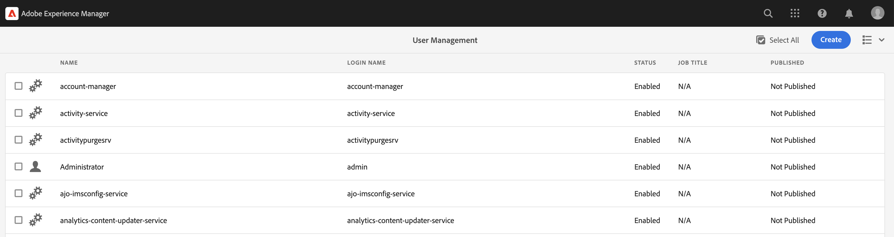
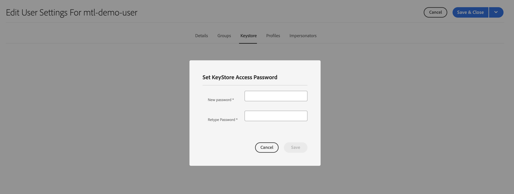
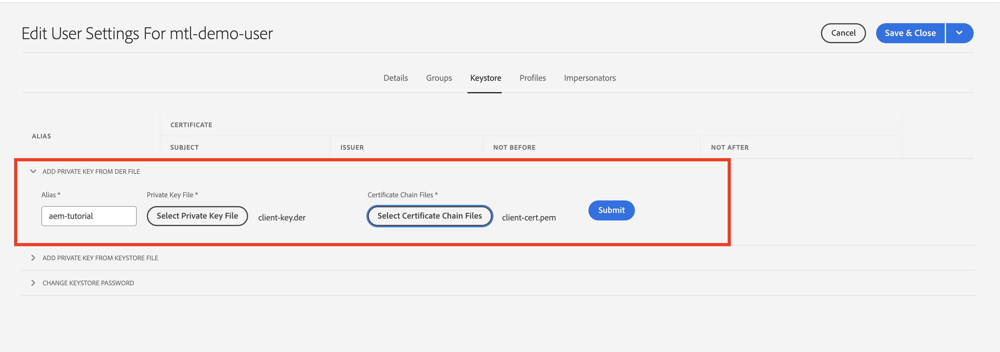
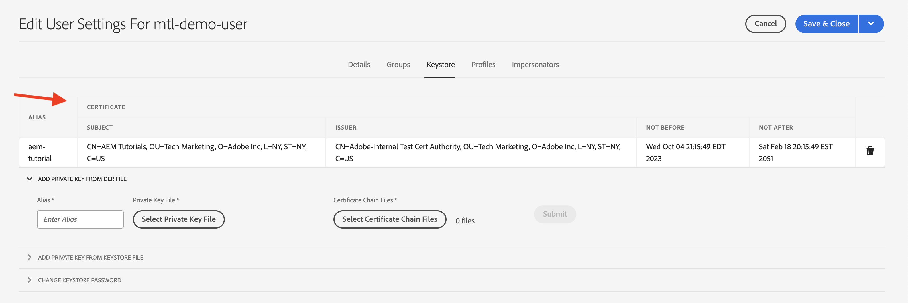

# Mutual Transport Layer Security (mTLS) authentication

Learn how to make HTTPS calls from AEM to web APIs that require Mutual Transport Layer Security (mTLS) authentication.

The mTLS or two-way TLS authentication enhances the security of the TLS protocol by requiring **both the client and the server to authenticate each other**. This authentication is done by using digital certificates. It is commonly used in scenarios where strong security and identity verification are critical.

By default when trying to make an HTTPS connection to a web API that requires mTLS authentication, the connection fails with the error:

```
javax.net.ssl.SSLHandshakeException: Received fatal alert: certificate_required
```

This issue occurs when client does not present a certificate to authenticate itself.

Let's learn how to successfully call APIs that require mTLS authentication by using [Apache HttpClient](https://hc.apache.org/httpcomponents-client-4.5.x/index.html) and **AEM's KeyStore and TrustStore**.


## HttpClient and load AEM KeyStore material

At a high level, the following steps are required to call a mTLS protected API from AEM.

### AEM Certificate Generation

Request the AEM certificate by partnering with your organization's security team. The security team provides or asks the certificate-related details such as key, certificate signing request (CSR), and using CSR the certificate is issued.

For demo purposes, generate the certificate-related details such as key, certificate signing request (CSR). In below example, a self-signed CA is used to issue the certificate.

- First, generate the internal Certification Authority (CA) certificate.

    ```shell
    # Create an internal Certification Authority (CA) certificate
    openssl req -new -x509 -days 9999 -keyout internal-ca-key.pem -out internal-ca-cert.pem
    ```

- Generate the AEM certificate. 

    ```shell
    # Generate Key
    openssl genrsa -out client-key.pem

    # Generate CSR
    openssl req -new -key client-key.pem -out client-csr.pem

    # Generate certificate and sign with internal Certification Authority (CA)
    openssl x509 -req -days 9999 -in client-csr.pem -CA internal-ca-cert.pem -CAkey internal-ca-key.pem -CAcreateserial -out client-cert.pem

    # Verify certificate
    openssl verify -CAfile internal-ca-cert.pem client-cert.pem
    ```

- Convert the AEM Private Key to DER format, AEM's KeyStore requires the private key in DER format.

    ```shell
    openssl pkcs8 -topk8 -inform PEM -outform DER -in client-key.pem -out client-key.der -nocrypt
    ```

>[!TIP]
>
>The self-signed CA certificates are used for development purposes only. For production, use a trusted Certificate Authority (CA) to issue the certificate.


### Certificate Exchange

If using a self-signed CA for the AEM certificate, like above, exchange the certificate or internal Certification Authority (CA) certificate with the API provider. 

Also, if the API provider is using a self-signed CA certificate, receive the certificate or internal Certification Authority (CA) certificate from the API provider.

### Certificate Import

To import AEM's certificate, follow the below steps:

1. Log in to **AEM Author** as an **administrator**.

1. Navigate to **AEM Author > Tools > Security > Users > Create or Select an existing user**.

    

    For demo purposes, a new user named `mtl-demo-user` is created.

1. To open the **User Properties**, click the user name.

1. Click **Keystore** tab and then click **Create Keystore** button. Then in the **Set KeyStore Access Password** dialog, set a password for this user's keystore and click Save.

    

1. In the new screen, under the **ADD PRIVATE KEY FROM DER FILE** section, follow the below steps:

    1. Enter Alias

    1. Import the AEM Private Key in DER format, generated above.

    1. Import the Certificate Chain Files, generated above.

    1. Click Submit

        

1. Verify that the certificate is imported successfully.

    

If the API provider is using a self-signed CA certificate, import the received certificate into AEM's TrustStore, follow the steps from [here](https://experienceleague.adobe.com/docs/experience-manager-learn/foundation/security/call-internal-apis-having-private-certificate.html#httpclient-and-load-aem-truststore-material).

Likewise, if AEM is using self-signed CA certificate, request the API provider to import it.

### Prototypical mTLS API invocation code using HttpClient

Update Java&trade; code like below. To use `@Reference` annotation to get AEM's `KeyStoreService` service the calling code must be an OSGi component/service, or a Sling Model (and `@OsgiService` is used there).


```java
...

// Get AEM's KeyStoreService reference
@Reference
private com.adobe.granite.keystore.KeyStoreService keyStoreService;

...

// Get AEM KeyStore using KeyStoreService
KeyStore aemKeyStore = getAEMKeyStore(keyStoreService, resourceResolver);

if (aemKeyStore != null) {

    // Create SSL Context
    SSLContextBuilder sslbuilder = new SSLContextBuilder();

    // Load AEM KeyStore material into above SSL Context with keystore password
    // Ideally password should be encrypted and stored in OSGi config
    sslbuilder.loadKeyMaterial(aemKeyStore, "admin".toCharArray());

    // If API provider cert is self-signed, load AEM TrustStore material into above SSL Context
    // Get AEM TrustStore
    KeyStore aemTrustStore = getAEMTrustStore(keyStoreService, resourceResolver);
    sslbuilder.loadTrustMaterial(aemTrustStore, null);

    // Create SSL Connection Socket using above SSL Context
    SSLConnectionSocketFactory sslsf = new SSLConnectionSocketFactory(
            sslbuilder.build(), NoopHostnameVerifier.INSTANCE);

    // Create HttpClientBuilder
    HttpClientBuilder httpClientBuilder = HttpClientBuilder.create();
    httpClientBuilder.setSSLSocketFactory(sslsf);

    // Create HttpClient
    CloseableHttpClient httpClient = httpClientBuilder.build();

    // Invoke API
    closeableHttpResponse = httpClient.execute(new HttpGet(MTLS_API_ENDPOINT));

    // Code that reads response code and body from the 'closeableHttpResponse' object
    ...
} 

/**
 * Returns the AEM KeyStore of a user. In this example we are using the
 * 'mtl-demo-user' user.
 * 
 * @param keyStoreService
 * @param resourceResolver
 * @return AEM KeyStore
 */
private KeyStore getAEMKeyStore(KeyStoreService keyStoreService, ResourceResolver resourceResolver) {

    // get AEM KeyStore of 'mtl-demo-user' user, you can create a user or use an existing one. 
    // Then create keystore and upload key, certificate files.
    KeyStore aemKeyStore = keyStoreService.getKeyStore(resourceResolver, "mtl-demo-user");

    return aemKeyStore;
}

/**
 * 
 * Returns the global AEM TrustStore
 * 
 * @param keyStoreService OOTB OSGi service that makes AEM based KeyStore
 *                         operations easy.
 * @param resourceResolver
 * @return
 */
private KeyStore getAEMTrustStore(KeyStoreService keyStoreService, ResourceResolver resourceResolver) {

    // get AEM TrustStore from the KeyStoreService and ResourceResolver
    KeyStore aemTrustStore = keyStoreService.getTrustStore(resourceResolver);

    return aemTrustStore;
}

...

```

- Inject the OOTB `com.adobe.granite.keystore.KeyStoreService` OSGi service into your OSGi component.
- Get the user's AEM KeyStore using `KeyStoreService` and `ResourceResolver`, the `getAEMKeyStore(...)` method does that. 
- If the API provider is using a self-signed CA certificate, get the global AEM TrustStore, the `getAEMTrustStore(...)` method does that.
- Create an object of `SSLContextBuilder`, see Java&trade; [API details](https://javadoc.io/static/org.apache.httpcomponents/httpcore/4.4.8/index.html?org/apache/http/ssl/SSLContextBuilder.html).
- Load the user's AEM KeyStore into `SSLContextBuilder` using `loadKeyMaterial(final KeyStore keystore,final char[] keyPassword)` method.
- The keystore password is the password that was set when creating the keystore, it should be stored in OSGi config, see [Secret Configuration Values](https://experienceleague.adobe.com/docs/experience-manager-cloud-service/content/implementing/deploying/configuring-osgi.html#secret-configuration-values).

## Avoid JVM Keystore changes

A conventional approach to effectively invoke mTLS APIs with private certificates involves modifying the JVM Keystore. It is achieved by importing the private certificates using the Java&trade; [keytool](https://docs.oracle.com/en/java/javase/11/tools/keytool.html#GUID-5990A2E4-78E3-47B7-AE75-6D1826259549) command. 

However, this method is not aligned with security best practices and AEM offers a superior option through the utilization of the **User specific KeyStores and Global TrustStore** and [KeyStoreService](https://javadoc.io/doc/com.adobe.aem/aem-sdk-api/latest/com/adobe/granite/keystore/KeyStoreService.html).