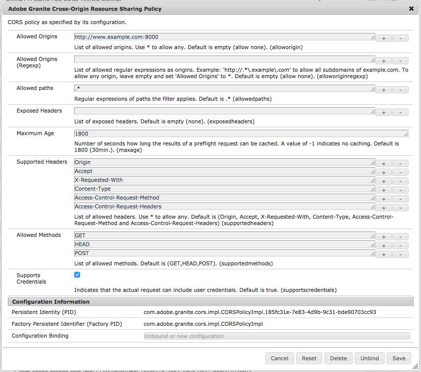

# Understand Cross-Origin Resource Sharing ([!DNL CORS])

Adobe Experience Manager's Cross-Origin Resource Sharing ([!DNL CORS]) facilitates non-AEM web properties to make client-side calls to AEM, both authenticated and unauthenticated, to fetch content or directly interact with AEM.

The OSGI configuration outlined in this document is sufficient for:

1. Single-origin resource sharing on AEM Publish
2. CORS access to AEM Author

If multi-origin CORS access is required on AEM Publish, refer to [this documentation](https://experienceleague.adobe.com/docs/experience-manager-learn/getting-started-with-aem-headless/deployments/configurations/cors.html?lang=en#dispatcher-configuration).

## Adobe Granite Cross-Origin Resource Sharing Policy OSGi configuration

CORS configurations are managed as OSGi configuration factories in AEM, with each policy being represented as one instance of the factory.

* `http://<host>:<port>/system/console/configMgr > Adobe Granite Cross Origin Resource Sharing Policy`



[!DNL Adobe Granite Cross-Origin Resource Sharing Policy] (`com.adobe.granite.cors.impl.CORSPolicyImpl`)

### Policy selection

A policy is selected by comparing the

* `Allowed Origin` with the `Origin` request header
* and `Allowed Paths` with the request path.

The first policy matching these values are used. If none is found, any [!DNL CORS] request is denied.

If no policy is configured at all, [!DNL CORS] requests will also not be answered as the handler is disabled and thus effectively denied - as long as no other module of the server responds to [!DNL CORS].

### Policy properties

#### [!UICONTROL Allowed Origins]

* `"alloworigin" <origin> | *`
* List of `origin` parameters specifying URIs that may access the resource. For requests without credentials, the server may specify &#42; as a wildcard, thereby allowing any origin to access the resource. *It is absolutely not recommended to use `Allow-Origin: *` in production since it allows every foreign (i.e. attacker) website to make requests that without CORS are strictly prohibited by browsers.*

#### [!UICONTROL Allowed Origins (Regexp)]

* `"alloworiginregexp" <regexp>`
* List of `regexp` regular expressions specifying URIs that may access the resource. *Regular expressions can lead to unintended matches if not carefully built, allowing an attacker to use a custom domain name that would also match the policy.* It is generally recommended to have separate policies for each specific origin hostname, using `alloworigin`, even if that means repeated configuration of the other policy properties. Different origins tend to have different life-cycles and requirements, thus benefitting from clear separation.

#### [!UICONTROL Allowed Paths]

* `"allowedpaths" <regexp>`
* List of `regexp` regular expressions specifying resource paths for which the policy applies.

#### [!UICONTROL Exposed Headers]

* `"exposedheaders" <header>`
* List of header parameters indicating response headers that browsers are allowed to access. For CORS requests (not pre-flight), if not empty these values are copied into the `Access-Control-Expose-Headers` response header. The values in the list (header names) are then made accessible to the browser; without it, those headers are not readable by the browser.

#### [!UICONTROL Maximum Age]

* `"maxage" <seconds>`
* A `seconds` parameter indicating how long the results of a pre-flight request can be cached.

#### [!UICONTROL Supported Headers]

* `"supportedheaders" <header>`
* List of `header` parameters indicating which HTTP request headers can be used when making the actual request.

#### [!UICONTROL Allowed Methods]

* `"supportedmethods"`
* List of method parameters indicating which HTTP methods can be used when making the actual request.

#### [!UICONTROL Supports Credentials]

* `"supportscredentials" <boolean>`
* A `boolean` indicating whether or not the response to the request can be exposed to the browser. When used as part of a response to a pre-flight request, this indicates whether or not the actual request can be made using credentials.

### Example configurations

Site 1 is a basic, anonymously accessible, read-only scenario where content is consumed via [!DNL GET] requests:

```json
{
  "supportscredentials":false,
  "exposedheaders":[
    ""
  ],
  "supportedmethods":[
    "GET",
    "HEAD"
  ],
  "alloworigin":[
    "http://127.0.0.1:3000",
    "https://site1.com"
    
  ],
  "maxage:Integer": 1800,
  "alloworiginregexp":[
    "http://localhost:.*"
    "https://.*\.site1\.com"
  ],
  "allowedpaths":[
    "/content/_cq_graphql/site1/endpoint.json",
    "/graphql/execute.json.*",
    "/content/site1/.*"
  ],
  "supportedheaders":[
    "Origin",
    "Accept",
    "X-Requested-With",
    "Content-Type",
    "Access-Control-Request-Method",
    "Access-Control-Request-Headers",
  ]
}
```

Site 2 is more complex and requires authorized and mutating (POST, PUT, DELETE) requests:

```json
{
  "supportscredentials":true,
  "exposedheaders":[
    ""
  ],
  "supportedmethods":[
    "GET",
    "HEAD"
    "POST",
    "DELETE",
    "PUT"
  ],
  "alloworigin":[
    "http://127.0.0.1:3000",
    "https://site2.com"
    
  ],
  "maxage:Integer": 1800,
  "alloworiginregexp":[
    "http://localhost:.*"
    "https://.*\.site2\.com"
  ],
  "allowedpaths":[
    "/content/site2/.*",
    "/libs/granite/csrf/token.json",
  ],
  "supportedheaders":[
    "Origin",
    "Accept",
    "X-Requested-With",
    "Content-Type",
    "Access-Control-Request-Method",
    "Access-Control-Request-Headers",
    "Authorization",
    "CSRF-Token"
  ]
}
```

## Dispatcher caching concerns and configuration {#dispatcher-caching-concerns-and-configuration}

Starting with Dispatcher 4.1.1+ response headers can be cached. This makes it possible to cache [!DNL CORS] headers along w the [!DNL CORS]-requested resources, as long as the request is anonymous.

Generally, the same considerations for caching content at Dispatcher can be applied to caching CORS response headers at dispatcher. The following table defines when [!DNL CORS] headers (and thus [!DNL CORS] requests) can be cached.

| Cacheable | Environment | Authentication Status | Explanation |
|-----------|-------------|-----------------------|-------------|
| No        | AEM Publish | Authenticated         | Dispatcher caching on AEM Author is limited to static, non-authored assets. This makes it difficult and impractical to cache most resources on AEM Author, including HTTP response headers. |
| No        | AEM Publish | Authenticated         | Avoid caching CORS headers on authenticated requests. This aligns to the common guidance of not caching authenticated requests, as it is difficult to determine how the authentication/authorization status of the requesting user will effect the delivered resource. |
| Yes        | AEM Publish | Anonymous         | Anonymous requests cache-able at dispatcher can have their response headers cached as well, ensuring future CORS requests can access the cached content. Any CORS configuration change on AEM Publish **must** be followed by an invalidation of affected cached resources. Best practices dictate on code or configuration deployments the dispatcher cache is purged, as it's difficult to determine what cached content may be effected. |

### Allowing CORS request headers

To allow the required [HTTP request headers to passthrough to AEM for processing](https://experienceleague.adobe.com/docs/experience-manager-dispatcher/using/configuring/dispatcher-configuration.html?lang=en#specifying-the-http-headers-to-pass-through-clientheaders), they must be allowed in the Disaptcher's `/clientheaders` configuration.

```
/clientheaders {
   ...
   "Origin"
   "Access-Control-Request-Method"
   "Access-Control-Request-Headers"
}
```

### Caching CORS resposne headers
 
To allow the caching and serving of CORS headers on cached content, add following [/cache /headers configuration](https://experienceleague.adobe.com/docs/experience-manager-dispatcher/using/configuring/dispatcher-configuration.html?lang=en#caching-http-response-headers) to the AEM Publish `dispatcher.any` file.

```
/publishfarm {
    ...
    /cache {
        ...
        # CORS HTTP response headers
        # https://developer.mozilla.org/en-US/docs/Web/HTTP/CORS#the_http_response_headers
        /headers {
            ...
            "Access-Control-Allow-Origin"
            "Access-Control-Expose-Headers"
            "Access-Control-Max-Age"
            "Access-Control-Allow-Credentials"
            "Access-Control-Allow-Methods"
            "Access-Control-Allow-Headers"
        }
    ...
    }
...
}
```

Remember to **restart the web server application** after making changes to the `dispatcher.any` file.

It is likely clearing the cache entirely is required to ensure the headers are appropriately cached on the next request after a `/cache/headers` configuration update.

## Troubleshooting CORS

Logging is available under `com.adobe.granite.cors`:

* enable `DEBUG` to see details about why a [!DNL CORS] request was denied
* enable `TRACE` to see details about all requests going through the CORS handler

### Tips:

* Manually recreate XHR requests using curl, but make sure to copy all headers and details, as each one can make a difference; some browser consoles allow to copy the curl command
* Verify if request was denied by the CORS handler and not by the authentication, CSRF token filter, dispatcher filters, or other security layers
  * If CORS handler responds with 200, but `Access-Control-Allow-Origin` header is absent on the response, review the logs for denials under [!DNL DEBUG] in `com.adobe.granite.cors`
* If dispatcher caching of [!DNL CORS] requests is enabled
  * Ensure the `/cache/headers` configuration is applied to `dispatcher.any` and the web server is successfully restarted
  * Ensure the cache was properly cleared after any OSGi or dispatcher.any configuration changes.
* if required, check presence of authentication credentials on the request.

## Supporting materials

* [AEM OSGi Configuration factory for Cross-Origin Resource Sharing Policies](http://localhost:4502/system/console/configMgr/com.adobe.granite.cors.impl.CORSPolicyImpl)
* [Cross-Origin Resource Sharing (W3C)](https://www.w3.org/TR/cors/)
* [HTTP Access Control (Mozilla MDN)](https://developer.mozilla.org/en-US/docs/Web/HTTP/Access_control_CORS)
