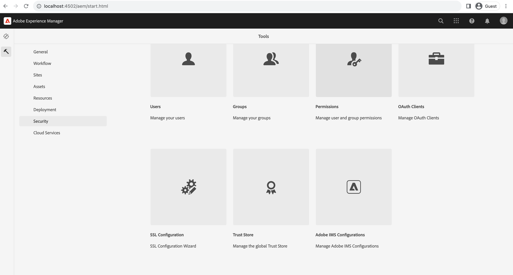
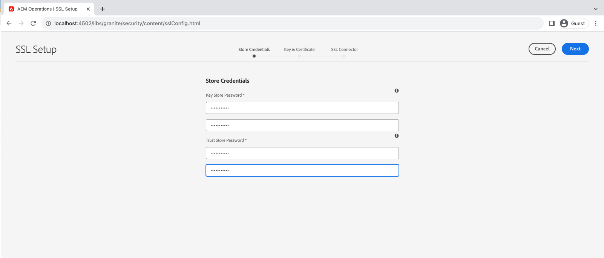
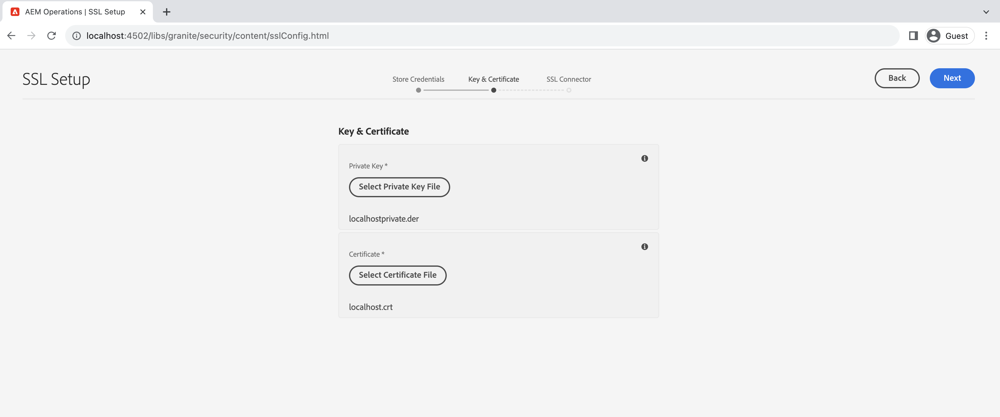
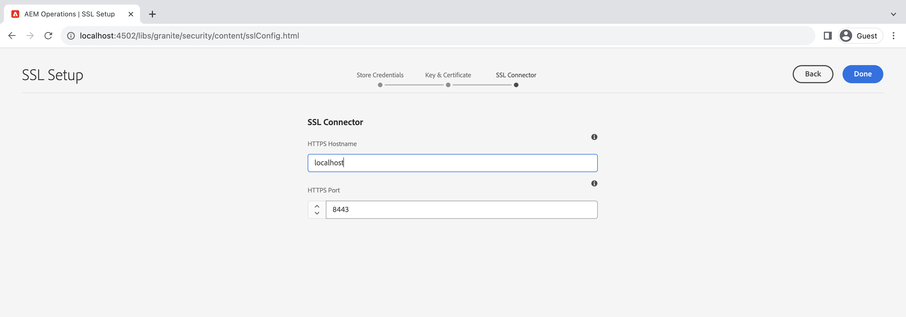
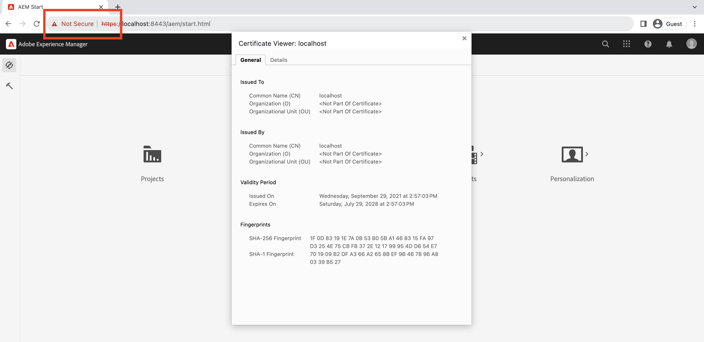

# Use the SSL Wizard in AEM

Learn how to set up SSL in Adobe Experience Manager to make it run over HTTPS using the built-in SSL wizard.

>[!VIDEO](https://video.tv.adobe.com/v/17993?quality=12&learn=on)


>[!NOTE]
>
>For managed environments, it is best for the IT department to provide CA-trusted certificates and keys.
>
>Self-signed certificates are only to be used for development purposes.

## Using SSL Configuration Wizard 

Navigate to __AEM Author > Tools > Security > SSL Configuration__, and open the __SSL Configuration Wizard__.



### Create store credentials

To create a _Key Store_ associated with the `ssl-service` system user and a global _Trust Store_, use the __Store Credentials__ wizard step.

1. Enter the password and confirm password for the __Key Store__ associated with the `ssl-service` system user.
1. Enter the password and confirm password for the global __Trust Store__. Note it is a system-wide Trust Store and if it is already created, the entered password is ignored.

    

### Upload private key and certificate

To upload the _private key_ and _SSL certificate_, use the __Key & Certificate__ wizard step. 

Typically, your IT department provides the CA-trusted certificate and key, however self-signed certificate can be used for __development__ and __testing__ purposes. 

To create or download the self-signed certificate, see the [Self-Signed private key and certificate](#self-signed-private-key-and-certificate).

1. Upload the __Private Key__ in the DER (Distinguished Encoding Rules) format. Unlike PEM, DER-encoded files do not contain plain text statements such as `-----BEGIN CERTIFICATE-----`
1. Upload the associated __SSL Certificate__ in the `.crt` format.

    

### Update SSL connector details

To update the _hostname_ and _port_ use the __SSL Connector__ wizard step.

1. Update or verify the __HTTPS Hostname__ value, it should match the `Common Name (CN)` from the certificate.
1. Update or verify the __HTTPS Port__ value.

    

### Verify the SSL setup

1. To verify the SSL, click the __Go to HTTPS URL__ button.
1. If using selg-signed certificate, you see `Your connection is not private` error.

    

## Self-Signed private key and certificate

The following zip contains [!DNL DER] and [!DNL CRT] files required for setting up AEM SSL locally and intended for local development purposes only.

The [!DNL DER] and [!DNL CERT] files are provided for convenience and generated using the steps outlined in the Generate Private Key and Self-Signed Certificate section below.

If needed, the certificate pass phrase is **admin**.

This localhost - private key and self-signed certificate.zip (expires July 2028)

[Download the Certificate file](assets/use-the-ssl-wizard/certificate.zip)

### Private key and self-signed certificate generation

The above video depicts the setup and configuration of SSL on an AEM author instance using self-signed certificates. The below commands using [[!DNL OpenSSL]](https://www.openssl.org/) can generate a private key and certificate to be used in Step 2 of the wizard.

```shell
### Create Private Key
$ openssl genrsa -aes256 -out localhostprivate.key 4096

### Generate Certificate Signing Request using private key
$ openssl req -sha256 -new -key localhostprivate.key -out localhost.csr -subj '/CN=localhost'

### Generate the SSL certificate and sign with the private key, will expire one year from now
$ openssl x509 -req -extfile <(printf "subjectAltName=DNS:localhost") -days 365 -in localhost.csr -signkey localhostprivate.key -out localhost.crt

### Convert Private Key to DER format - SSL wizard requires key to be in DER format
$ openssl pkcs8 -topk8 -inform PEM -outform DER -in localhostprivate.key -out localhostprivate.der -nocrypt

```
