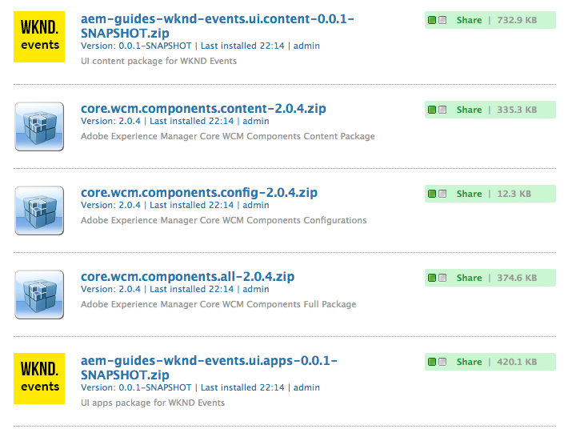
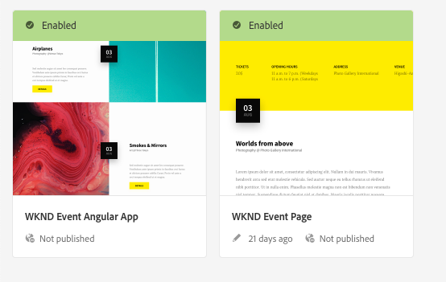
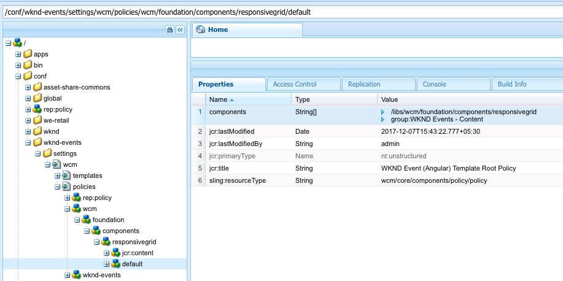
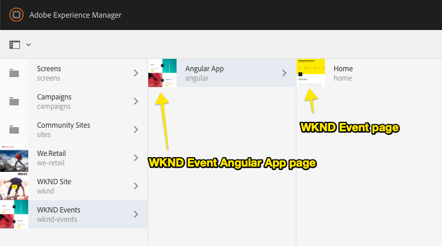

# Getting Started with Angular and AEM SPA Editor - Chapter 0{#getting-started-with-angular-and-aem-spa-editor-chapter}

## Prerequisites {#prerequisites}

Review the required tooling and instructions for setting up a [local development environment.](/help/getting-started-spa-wknd-tutorial-develop/angular.md#local-dev-env)

## Download the starter project {#starter-project}

To accelerate the tutorial, we will start with a predefined project. Download the ** aem -guides.wknd-events.angular.starter.zip** 
ZIP file from Github, and unzip on your local development machine.

* [Download the Angular WKND Events starter project](https://github.com/Adobe-Marketing-Cloud/aem-guides-wknd-events/releases/tag/angular-v1.0.0)

You can also clone the [Git Repository](https://github.com/Adobe-Marketing-Cloud/aem-guides-wknd-events) and start the tutorial from there:

```shell
$ git clone git@github.com:Adobe-Marketing-Cloud/aem-guides-wknd-events.git
$ cd aem-guides-wknd-events
$ git checkout angular/start
```

## The AEM project {#inspect}

Persona: AEM Developer

>[!NOTE]
>
>When starting a new SPA Editor enabled project it is recommended to use the [Maven Archetype for SPA Starter Kit](https://github.com/adobe/aem-spa-project-archetype).

The [Maven AEM Project Archetype](https://github.com/Adobe-Marketing-Cloud/aem-project-archetype)was used to create the base project structure. When creating new AEM projects, the latest archetype should always be used.

The following properties were used when generating the AEM project from the [AEM Archetype](https://github.com/Adobe-Marketing-Cloud/aem-project-archetype/releases/tag/aem-project-archetype-14):

| Property |Value |
|---|---|
| groupId |com.adobe.aem.guides |
| artifactId |aem-guides-wknd-events |
| version |0.0.1-SNAPSHOT |
| package |com.adobe.aem.guides.wkndevents |
| appsFolderName |wknd-events |
| artifactName |WKND Events |
| componentGroupName |WKND Events - Content |
| confFolderName |wknd-events |
| contentFolderName |wknd-events |
| cssId |wknd-events |
| packageGroup |aem-guides/wknd-events |
| siteName |WKND Events |

1. There are five areas to the project:

    * **Parent POM** - deploys maven modules and manages dependency versions
    * **core** - Java bundle containing all core functionality like OSGi services, listeners or schedulers, as well as component-related Java code such as servlets or request filters.
    * **ui.apps** - contains the /apps parts of the project, ie JavaScript and CSS clientlibs, components, and runmode specific configs.
    * **ui.content** - contains structural content and configurations (/content, /conf)
    * **angular-app **- a webpack project for the Angular application. Later in the chapter the webpack project will be turned into a Maven module to be deployed to AEM as a client library.

   More details about the inner workings of the project can be found in [Getting Started with AEM Sites Part 1 - Project Setup](https://helpx.adobe.com/experience-manager/kt/sites/using/getting-started-wknd-tutorial-develop/part1.html#project-structure).

1. From the command line, within the `aem-guides-wknd-events`directory run the following:

   ```shell
   $ mvn -PautoInstallPackage clean install
   ```

   The above command will deploy the project to AEM running on [https://localhost:4502](https://localhost:4502/).

   >[!CAUTION]
   >
   >If you recieve an error during the build, [ensure your maven settings.xml file includes Adobe's nexus repository](https://helpx.adobe.com/experience-manager/kb/SetUpTheAdobeMavenRepository.html).

1. Navigating to [https://localhost:4502/crx/packmgr/index.jsp](https://localhost:4502/crx/packmgr/index.jsp) you should see that 5 packages were installed. The ui.apps and ui.content package for the WKND events project and 3 packages for AEM Core Components.

   

1. The **ui.content** module includes two templates as part of the starter project. Inspect the templates by navigating to [https://localhost:4502/libs/wcm/core/content/sites/templates.html/conf/wknd-events](https://localhost:4502/libs/wcm/core/content/sites/templates.html/conf/wknd-events)

   You should see templates for **WKND Event Angular App** and **WKND Event Page**:

   

   The SPA Editor is designed to work with Editable templates. This gives the implementation the full power of re-usable policies and other features. With the initial release of the SPA Editor, the UI for Editable Templates **cannot** be used. This is expected to be updated in the next release of the SPA Editor.

   In order to update features of the template, developers will need to do this manually via [CRXDE Lite](https://localhost:4502/conf/wknd-events/settings/wcm/policies.html) or in the XML in the **ui.content** project.

   For example, the allowed components on the layout container are defined here:  
   `/conf/wknd-events/settings/wcm/policies/wcm/foundation/components/responsivegrid/default`

   

## Understanding the base content structure {#understanding-the-base-content-structure}

Persona: AEM Developer

There are two templates used in defining the Page structure in AEM.

* WKND Event Angular App Template
* WKND Event Page Template

These template types serve different roles and are used differently in the page structure's buildout.

### WKND Event Angular App template {#wknd-event-angular-app-template}

This template is used to represent the root of the Angular application and will define components in the Angular app that persist across views, such as the header. In  Angular  parlance, this defines content that is exposed in Angular component's that exist ***outside*** of the Angular Route's &lt;router-outlet/&gt; tag.

This template also includes Page Policy level configurations that help identify this resource as the SPA Editor application's root resource, as well as holds configuration elements that define how the site's content is serialized to JSON. This will be explored later in this tutorial when the HierarchyPage implementation is reviewed.

There is a single WKND Event Angular App page at the root of the SPA Editor site.

### WKND Event Page template {#wknd-event-page-template}

The WKND Event Page represents a normal content page that exists underneath the WKND Event Angular App page.

There are typically many of these content pages compromising a SPA Editor site.

### Page structure {#page-structure}

The following is the basic page structure, with the Angular app root being at **/content/angular** and the first content page of the SPA Editor existing under the Angular app root page at **/content/angular/home**.

 

## Next steps {#next-steps}

Next part in the tutorial:

* [Chapter 1 - Creating the Angular App](/help/getting-started-spa-wknd-tutorial-develop/angular/chapter-1.md)

## Help! {#help}

