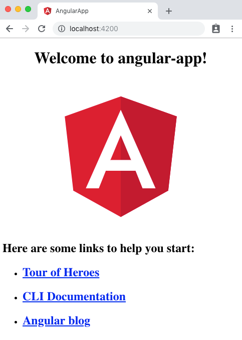
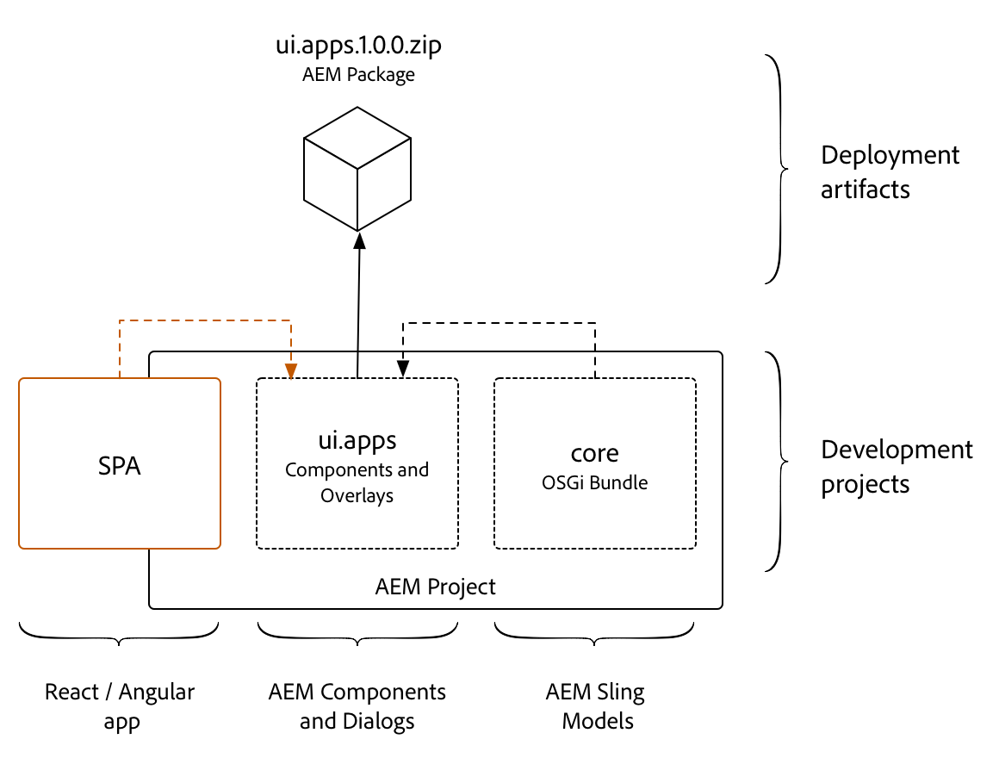
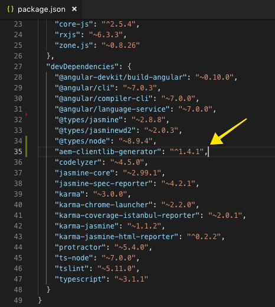
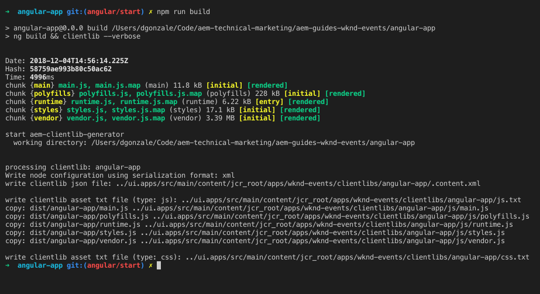
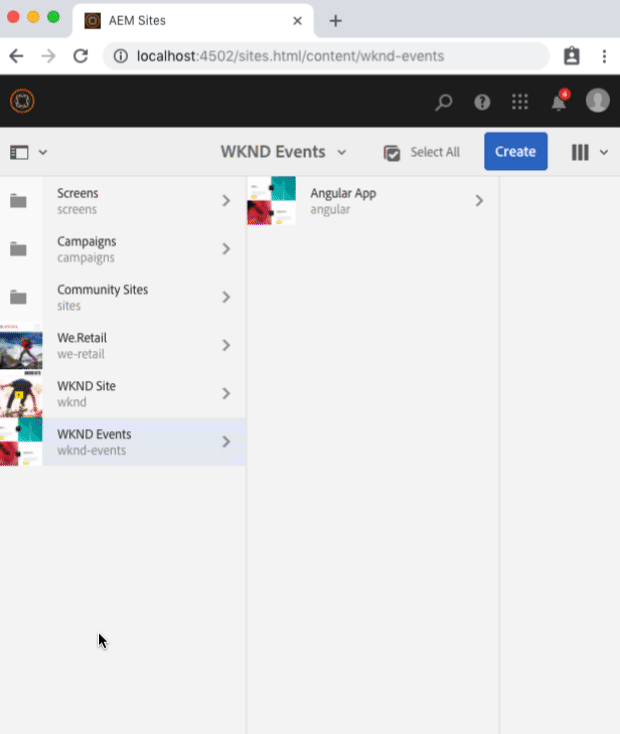

# Getting Started with Angular and AEM SPA Editor - Chapter 1{#getting-started-with-angular-and-aem-spa-editor-chapter}

## Bootstrapping the Angular application {#bootstrapping-the-angular-application}

Angular applications developed for AEM SPA Editor start out like any other Angular application, however, require minor additions to integrate into the AEM build process using the ** aem -  clientlib -manager** NPM module and an integration into the overall AEM project via the **frontend-maven-plugin** Maven plugin.

In this chapter well explore how to incorporate the Angular application project into the overall AEM project.

## The Angular application {#angular-app}

Persona: Front End Developer

A starter Angular application has been created using [Angular's CLI](https://angular.io/guide/quickstart), using the create-project configurations:

* **Enable Routing** using the Angular Router
* Use **SCSS** for style support

1. Install [Angular CLI](https://www.npmjs.com/package/@angular/cli) globally. This is used to generate Angular components as well as to build and serve the Angular application via the **ng** command.

   ```shell
   $ npm install -g @angular/cli
   ```

1. Run the Angular application locally by navigating to the **aem-guides-wknd-events/angular-app** directory and executing the following commands:

   ```shell
   $ cd aem-guides-wknd-events/angular-app
   $ npm install 
   $ ng serve
   ```

1. Review the Angular app by executing** ng serve**, which starts the Angular application on a local dev web server running at [https://localhost:4200/](https://localhost:4200/).

   

1. Build a deployable distribution of the app by pressing **Ctrl + C** to stop the server. Execute the following command on the command line:

   ```shell
   $ npm run build 
   ```

   This builds the application, via **ng serve** in defined by a script definition in **package.json**.

   Several files are created beneath the `angular-app/build` folder.

   ```
   /aem-guides-wknd-events
       /angular-app
           /dist
               /angular-app
                   index.html
                   favicon.ico
                   main.<hash>.js
                   polyfills.<hash>.js
                   runtime.<hash>.js
                   styles.<hash>.js
   ```

   ... along with the accompanying **.js.map** files.

   Next, we will move these files into an AEM Client Library and deploy them to AEM as part of the **ui.apps** Maven module.

## Integration approach {#approach}

The SPA development will be done in the Webpack project. The compiled SPA, following a production build, is then copied into the `  ui .apps` module as an AEM [Client Library](https://helpx.adobe.com/experience-manager/6-4/sites/developing/using/clientlibs.html) and deployed to AEM as part of our `  ui   .apps` AEM package. The concept is similar to the integration of the `core` Java bundle, where the Java bundle is compiled into a jar file that is embedded into the `  ui .apps` module and deployed to AEM as an AEM package.



To achieve this integration two tools will be used:

1. [aem-clientlib-generator](https://www.npmjs.com/package/aem-clientlib-generator) used to transform compiled CSS and JS files into an AEM client library
1. [frontend-maven-plugin](https://github.com/eirslett/frontend-maven-plugin) used to trigger NPM commands via a Maven build. This plugin will download/install Node and NPM locally for the project, ensuring consistency and making the project easy to integrate with a Continuous Integration/Continuous Deployment environment.

## Configure the aem-clientlib-generator NPM module {#aem-clientlibs-generator}

Persona: Angular Developer

1. Install the [aem-clientlibs-generator](https://www.npmjs.com/package/aem-clientlib-generator) node plugin as part of the `react-app` project.

   ```shell
   $ cd aem-guides-wknd-events/angular-app
   $ npm install aem-clientlib-generator --save-dev
   ```

1. Notice that **package.json** has been updated with the dev dependencies for **aem-clientlib-generator.**

   

   aem-guides-wknd-events/angular-app/package.json

1. Create a new file beneath the ** aem -guides-wknd-events/angular-app **folder named **clientlib.config.js**. Populate the file with the following:

   ```
   module.exports = {
       // default working directory (can be changed per 'cwd' in every asset option)
       context: __dirname,
   
       // path to the clientlib root folder (output)
       clientLibRoot: "./../ui.apps/src/main/content/jcr_root/apps/wknd-events/clientlibs",
   
       libs: {
           name: "angular-app",
           allowProxy: true,
           categories: ["wknd-events.angular"],
           serializationFormat: "xml",
           jsProcessor: ["default:none","min:none"],
           assets: {
               js: [
                   "dist/angular-app/**/*.js"
               ],
               css: [
                   "dist/angular-app/**/*.css"
               ]
           }
       }
   };
   ```

   This file directs the ** aem -  clientlib -generator **to create a client library in the ** ui .apps** module beneath **/apps/wknd-events/clientlibs**. The client library will have a category of **wknd-events.angular** and will include any files with an extension of **.js** and **.css** beneath the **angular-app/dist/angular-app** **folder** reviewed in the above step.

   There are two items of specific note in this config:

    1. The **assets: { ...  css : [ ... ] } ** does not do anything since Angular applications, by default, do not generate CSS as such, but rather embed CSS in the **styles.&lt;hash&gt;.js**. This entry could be removed, however, we'll leave it in as it simply results in a  noop  (no operation).  
    
    1. The [** jsProcessor's  ** are set to **none**](https://helpx.adobe.com/experience-manager/kb/how-to-change-the-minification-engine-for-client-libraries-in-AEM.html) since the Angular production build utilizes more modern JavaScript processing tooling that what AEM Client Libraries provide.

1. Add the clientlib directive as part of the npm run build script by updating `react-app/package.json` file with the following line:

   ```
   //package.json
   ...
    "scripts": {
      "build": "ng build && clientlib --verbose"
       ...
   }
   ...
   ```

1. Test out the changes by running the following command:

   ```shell
   $ npm run build
   ```

   

   Output of: npm run build

1. Beneath `/ui.apps/src/main/content/jcr_root/apps/wknd-events/clientlibs/` should be a new folder named `angular-app`and should contain **JavaScript** files generated from the Angular application *(remember, Angular application embed the CSS in the styles.js, thus there are no .css files)*.
1. Ensure the compiled Angular files are not committed to source control (Git). While these files are copied into the **/apps/wknd-events/clientlibs **to be deployed, they are themselves are built artifacts, and thus should not be checked into source control, rather, these files should be rebuilt at build-time. This is a similar to how compiled OSGi bundle JAR files are are not checked into source control.

   Ignore the **angular-app **AEM client library in ** ui .apps** from source control by adding the following entry to the bottom of the project's root `.gitignore` file (** aem -guides-wknd-events/.gitignore**).

   ```
   #aem-guides-wknd-events/.gitignore
   ....
   
   ## Angular app
   /ui.apps/src/main/content/jcr_root/apps/wknd-events/clientlibs/angular-app
   ```

## Configure the frontend-maven-plugin Maven plugin  {#frontend-maven-plugin}

Persona: AEM Developer

Next, configure the `angular-app` project to also be a **Maven** module. This way it can be triggered by the parent reactor POM and the entire AEM project can be built with a single command. As mentioned earlier the [frontend-maven-plugin](https://github.com/eirslett/frontend-maven-plugin) will be used to install and trigger an **npm build** within the angular-app project.

1. Open up the parent reactor POM, `aem-guides-wknd-events/pom.xml`, and add the `angular-app` as a module to build. The order in which the modules are built matters:

   ```xml
   ...
   <modules>
       <module>core</module>
       <!-- add Angular App -->
       <module>angular-app</module>
       <module>ui.apps</module>
       <module>ui.content</module>
   </modules>
   ...
   ```

   Your IDE may indicate that the new **angular-app** module cannot be found. Ignore this warning for now as it will will be resolved in Step 3 beflow.

1. Within the parent reactor POM, `/pom.xml`, and add the following properties for the **frontend-maven-plugin**, **node** and **npm** versions.

   >[!NOTE]
   >
   >Use the same version of **node** and **npm** that you have installed locally.

   ```xml
   ...
    <properties>
       <aem.host>localhost</aem.host>
       <aem.port>4502</aem.port>
       <aem.publish.host>localhost</aem.publish.host>
       <aem.publish.port>4503</aem.publish.port>
       <sling.user>admin</sling.user>
       <sling.password>admin</sling.password>
       <vault.user>admin</vault.user>
       <vault.password>admin</vault.password>
   
       <!-- Update: Used by frontend-maven-plugin -->
       <frontend-maven-plugin.version>1.6</frontend-maven-plugin.version>
       <node.version>v10.8.0</node.version>
       <npm.version>6.2.0</npm.version>
       <!-- end update -->
   
       <project.build.sourceEncoding>UTF-8</project.build.sourceEncoding>
       <project.reporting.outputEncoding>UTF-8</project.reporting.outputEncoding>
   </properties>
   ...
   ```

   These properties will be used by the **frontend-maven-plugin** to determine the local version of node and npm to install. As a best practice version properties should be managed at the parent pom level.

1. Create a new file named **pom.xml** beneath **aem-guides-wknd-events** `/angular-app`folder. Populate the **pom.xml **with the following:

   ```xml
   <?xml version="1.0" encoding="UTF-8"?>
   <project xmlns="https://maven.apache.org/POM/4.0.0" xmlns:xsi="https://www.w3.org/2001/XMLSchema-instance" xsi:schemaLocation="https://maven.apache.org/POM/4.0.0 https://maven.apache.org/maven-v4_0_0.xsd">
       <modelVersion>4.0.0</modelVersion>
   
       <!-- ====================================================================== -->
       <!-- P A R E N T  P R O J E C T  D E S C R I P T I O N                      -->
       <!-- ====================================================================== -->
       <parent>
           <groupId>com.adobe.aem.guides</groupId>
           <artifactId>aem-guides-wknd-events</artifactId>
           <version>0.0.1-SNAPSHOT</version>
           <relativePath>../pom.xml</relativePath>
       </parent>
   
       <!-- ====================================================================== -->
       <!-- P R O J E C T  D E S C R I P T I O N                                   -->
       <!-- ====================================================================== -->
       <artifactId>aem-guides-wknd-events.angular</artifactId>
       <packaging>pom</packaging>
       <name>WKND Events - Angular App</name>
       <description>UI Angular application code for WKND Events</description>

       <!-- ====================================================================== -->
       <!-- B U I L D   D E F I N I T I O N                                        -->
       <!-- ====================================================================== -->
       <build>
       <plugins>
       <plugin>
           <groupId>com.github.eirslett</groupId>
           <artifactId>frontend-maven-plugin</artifactId>
           <version>${frontend-maven-plugin.version}</version>
   
           <executions>
   
           <execution>
               <id>install node and npm</id>
               <goals>
               <goal>install-node-and-npm</goal>
               </goals>
               <configuration>
               <nodeVersion>${node.version}</nodeVersion>
               <npmVersion>${npm.version}</npmVersion>
           </configuration>
           </execution>
   
           <execution>
               <id>npm install</id>
               <goals>
               <goal>npm</goal>
               </goals>
               <!-- Optional configuration which provides for running any npm command -->
               <configuration>
               <arguments>install</arguments>
               </configuration>
           </execution>
   
           <execution>
               <id>npm run build</id>
               <goals>
               <goal>npm</goal>
               </goals>
               <configuration>
               <arguments>run build</arguments>
               </configuration>
           </execution>
   
           </executions>
       </plugin>
       </plugins>
   </build>
   </project>
   ```

1. Within the `angular-app` folder run the following **Maven** command to trigger a build of the **angular-app Maven project.**

   ```shell
   $ cd aem-guides-wknd-events/angular-app
   $ mvn clean install
   ```

   You should see that the **frontend-maven-plugin** downloads and installs a isolated version of node and npm used exclusilvely for the build. The command **npm run build **is then executed which will build the Angular app and then copy the compiled JS and CSS files into the **ui.apps** project.

   Check the timestamps of the files in: `/ui.apps/src/main/content/jcr_root/apps/wknd-events/clientlibs/angular-app/js`to confirm that these files were just built.

1. Navigate to the parent Angular project and run the following command to build the entire project and deploy it to AEM:

   ```shell
   $ cd aem-guides-wknd-events
   $ mvn -PautoInstallPackage clean install
   ```

   

   Output of: mvn -PautoInstallPackage clean install

1. After the build, a new folder appears at ** aem -guides-wknd-events/angular-app/node** which contains the build-time **node**,  **npm** and  **node_modules** created by the **frontend-maven-plugin**. Since these are transient build artifacts as well, they should not be added to source control (Git), so they should be added to the Angular applications' **.gitignore** file.

   Add the following to the end of the ** aem -guides-wknd-events/angular-app/.  gitignore ** file  ..

   ```
   #aem-guides-wknd-events/angular-app/.gitignore
   ...
   
   # Front-end maven plugin
   node/
   ```

1. Navigate to [CRXDE-Lite](https://localhost:4502/crx/de/index.jsp#/apps/wknd-events/clientlibs/angular-app) to verify that the Angular App and the rest of the AEM project has been deployed beneath `/apps/wknd-events/clientlibs/angular-app`.

   

   /apps/wknd-events/clientlibs/angular-app

## Integrate the Angular application on the AEM page {#integrate-angular-app}

Persona: AEM Developer

Next we will integrate the Angular app on to the page via the AEM Client Library.

Open up the `aem-guides-wknd-events/ui.apps` project to edit.

1. Beneath `/apps/wknd-events/components/structure/page` open the file **customheaderlibs.html**.

   This HTL template will get loaded in the HTML **&lt;head&gt;** section.

   Replace the contents of the file with the following:

   ```xml
   <!--/*
   Custom Headerlibs for Angular App
   */-->
   <sly data-sly-use.clientLib="${'/libs/granite/sightly/templates/clientlib.html'}"></sly>
   <base href="/"/>
   <meta name="viewport" content="width=device-width, initial-scale=1, shrink-to-fit=no">
   <meta property="cq:datatype" data-sly-test="${wcmmode.edit || wcmmode.preview}" content="JSON"/>
   <meta property="cq:wcmmode" data-sly-test="${wcmmode.edit}" content="edit"/>
   <meta property="cq:wcmmode" data-sly-test="${wcmmode.preview}" content="preview"/>
   <meta property="cq:pagemodel_root_url" 
       data-sly-use.page="com.adobe.aem.guides.wkndevents.core.models.HierarchyPage" 
       content="${page.rootUrl}"/>
   <sly data-sly-call="${clientLib.css @ categories='wknd-events.angular'}"></sly>      
   ```

   This sets a meta property for **cq:pagemodel_root_url**. This will be used by the AEM SPA Editor SDK to identify the root page JSON to load.

   Note that we include the CSS at the top of the page as this will load the Responsive Grid CSS, used to support Layout Mode. The Angular app's styles, however, are included in **styles.js** which is part of the JavaScript for the **wknd-events  .angular ** Client Library.

1. Beneath `/apps/wknd-events/components/structure/page` open the file **customfooterlibs.html.**

   This HTL template will get loaded at the bottom of the page right before the closing** &lt;/body&gt;** tag.

   Replace the contents of the file with the following:

   ```xml
   <!--/*
   Custom footer Angular App
   */-->
   <sly data-sly-use.clientLib="${'/libs/granite/sightly/templates/clientlib.html'}"></sly>
   <sly data-sly-test="${wcmmode.edit || wcmmode.preview}"
        data-sly-call="${clientLib.js @ categories='cq.authoring.pagemodel.messaging'}"></sly>
   <sly data-sly-call="${clientLib.js @ categories='wknd-events.angular'}"></sly>
   ```

   This will load the JS for the `wknd-events.angular`client library at the bottom of the page. The code above also includes the `cq.authoring.pagemodel.messaging` when the page is being edited in the AEM environment. This client library allows for the SPA editing capabilities using the AEM Sites Editor.

1. Create a new file named **body.html** beneath `/apps/wknd-events/components/structure/page`

   Populate **body.html** with the following:

   ```xml
   <!--/*
   - body.html
   
   Includes the HTML element that will be targeted by the Angular SPA as specified in: 
   - angular-app/src/app/app.component.ts
   */-->
   <app-root></app-root>
   ```

   This will insert the DOM element that the Angular application is targeting.

1. Deploy the changes to AEM by running the following maven command from the project root:

   ```shell
   $ cd aem-guides-wknd-events
   $ mvn -PautoInstallPackage clean install
   ```

1. Navigate to [https://localhost:4502/editor.html/content/wknd-events/angular/home.html](https://localhost:4502/editor.html/content/wknd-events/angular/home.html)

   You should now see the Angular app being rendered on the AEM page, however the Sidebar doesn't work and on refresh, the page becomes blank. This is because Angular's default routing has taken over and is working against the AEM Page Editor. 

   

   We'll fix this in the next chapter by setting up the Angular routes to properly map to resources in AEM.

## Next steps {#next-steps}

Next part in the tutorial:

* [Chapter 2 - Setting up Angular routes and Page resolution](https://chl-author-preview.corp.adobe.com/content/help/en/experience-manager/kt/sites/using/getting-started-spa-wknd-tutorial-develop/angular/chapter-2.html)

View the solution for [Chapter 1 on GitHub](https://github.com/Adobe-Marketing-Cloud/aem-guides-wknd-events/tree/angular/chapter-1).

## Help! {#help}

