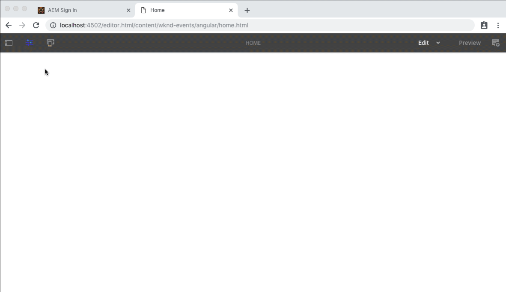

# Getting Started with Angular and AEM SPA Editor - Chapter 2 {#getting-started-with-angular-and-aem-spa-editor-chapter}

## Setting up Angular routes and page resolution {#setting-up-angular-routes-and-page-resolution}

The framework of the AEM and Angular application integration is based around AEM exposing JSON representations of pages and their components, and mapping the JSON the Angular application's components. Since AEM's paradigm for separating logical sets of content is via Pages, this mechanism is leveraged to form the backbone of how the views of the Angular application are managed as well.

Each AEM page will be mapped to an Angular Route, which in turn can expose the page's content as defined by the Angular application. In this chapter, we'll look at how we can define the mappings between the AEM content and the Angular app using the Angular Router module.

## Add the Adobe SPA Editor JavaScript SDK dependencies {#add-the-adobe-spa-editor-javascript-sdk-dependencies}

Persona: Angular Developer

The Angular app will make use of several Adobe-provided  npm  modules that comprise the AEM SPA Editor JavaScript SDK.

* [@adobe/cq-spa-page-model-manager](https://www.npmjs.com/package/@adobe/cq-spa-page-model-manager)
* [@adobe/cq-spa-page-component-mapping](https://www.npmjs.com/package/@adobe/cq-spa-component-mapping)
* [@adobe/cq-angular-editable-components](https://www.npmjs.com/package/@adobe/cq-angular-editable-components)

Open a command line, and navigate to the **aem-guides-wknd-events/angular-app** and execute the following commands, automatically saving them as project dependencies to the **package.json**.

```shell
$ npm install @adobe/cq-spa-page-model-manager --save
$ npm install @adobe/cq-spa-component-mapping --save
$ npm install @adobe/cq-angular-editable-components --save
```

## Setting up Angular router {#setting-up-angular-router}

1. Open **aem-guide-wknd-events/angular-app/src/app/app-routing.module.ts** in the IDE.

   In the ` `routes: Routes = [];`` array, we need to define the routes, or navigation path to Angular component mappings. Remember, Angular evaluates the Routes array top to bottom, using the first match.

   Update the **routes variable** as follows:

   ```
   ...
   const routes: Routes = [
    {
       matcher: AemPageMatcher,
       component: PageComponent,
       resolve: {
         path: AemPageDataResolver
       }
     },
     {
       path: '',
       redirectTo: 'content/wknd-events/angular/home.html',
       pathMatch: 'full'
     }
   ];
   ```

   Reviewing these two routes:

    * **Lines 3-9** define the first route, that is responsible for matching all other navigation URLs to the Angular PageComponent, which is responsible for dynamically rendering the page's content using mapped Angular components.  
  
      We'll explore the role and definitions of **AemPageMatcher**, the **PageComponent** and the **AemPageDataResolver** in the following steps; at this point, the IDE will report them as unresolved.
    
    * **Lines 10-14**, define the last route that handles the empty path, or what we commonly think of as **/**, is mapped to redirect to the home page at **content/wknd-events/angular/home.html**, or the Angular app's root page.

1. The **AemPageMatcher** is a custom Angular router [UrlMatcher](https://angular.io/api/router/UrlMatcher), that matches anything that "looks like" a page in AEM that is part of this Angular application.

   Add the following function above the `const routes Routes = [ .. ]`definition in the **app-routing.module.ts.**

   ```
   import { Routes, RouterModule, UrlSegment,
            UrlMatchResult } from '@angular/router';
   ...
   export function AemPageMatcher ( url: UrlSegment[] ): UrlMatchResult {
     const path = url.join('/');
   
     if (path.startsWith('content/wknd-events/angular/')) {
       return ({
         consumed: url,
         posParams: { path: url[url.length - 1]}
       });
     }
   }
   ```

   This implementation simply checks to make sure that the requested Angular route path starts with **content/wknd-events/angular/**. This logic can, of course, be adjusted to accommodate the AEM content architecture that drives the Angular app as needed. Since this is a JavaScript method, it can be as simple or complex as required.

1. The **PageComponent** is the name of the Angular Component that represents a Page in AEM, and the matched routes will invoke.

   For now, allow this variable to remain unresolved as we'll satisfy this dependency shortly with a PageComponent implementation in a later step.

1. The **AemPageDataResolver** is a custom [Angular Router Resolver](https://angular.io/api/router/Resolve) used to transform the route URL, which is the path in AEM including the `.html` extension, to the resource path in AEM, which is the page path less the extension.

   For example, the **AemPageDataResolver** transforms a route's URL of **content/wknd-events/angular/home.html **into /**content/wknd-events/angular/home**.

   This may seem odd at this point, however the way a page's content is looked up in the JSON object is by its resource path, so we must derive it and expose it as part of the [  ActivatedRoute ](https://angular.io/api/router/ActivatedRoute) for use later.

   Add the following function above the `const routes Routes = [ .. ]` definition in the **app-routing.module.ts.**

   ```
   import { NgModule, Injectable } from '@angular/core';
   import { Routes, RouterModule, UrlSegment, UrlMatchResult, 
            Resolve, ActivatedRouteSnapshot } from '@angular/router';
   ...
   @Injectable()
   export class AemPageDataResolver implements Resolve<string> {
     constructor() {}
   
     resolve(route: ActivatedRouteSnapshot) {
       // Returns the absolute resource path with no extension, ex: /content/wknd-events/angular/home/event-1
       return '/' + route.url.join('/').replace(/\.[^/.]+$/, '');
     }
   }
   ```

   In order to use [Resolve's](https://angular.io/api/router/Resolve) in the Angular Routers, they must be registered in the **app-router.model.ts's @NgModule:**

   ```
   @NgModule({
     imports: [RouterModule.forRoot(routes)],
     exports: [RouterModule],
     providers: [AemPageDataResolver]
   })
   ```

1. Lastly, an idiosyncrasy of Angular and the SPA Editor framework must be addressed.

   Because we've defined a single, dynamic route (via the AemPageMatcher), multiple routes map to PageComponent. In order to avoid confusing the AEM SPA Editor during authoring, the Angular Router must be told not to reuse PageComponent objects across this singular route definition, else AEM authors may see content from Page A showing up on Page B during the authoring experience.

   To achieve this, a simple Angular [RouteReuseStrategy](https://angular.io/api/router/RouteReuseStrategy) is defined that prevents this caching.

   Add the following function above the `const routes Routes = [ .. ]` definition in the **app-routing.module.ts**.

   ```
   import { Routes, RouterModule, UrlSegment, UrlMatchResult,
            Resolve, ActivatedRouteSnapshot, DetachedRouteHandle, RouteReuseStrategy } from '@angular/router';
   ...
   export class AemPageRouteReuseStrategy implements RouteReuseStrategy {
       shouldDetach(route: ActivatedRouteSnapshot): boolean { return false; }
       store(route: ActivatedRouteSnapshot, detachedTree: DetachedRouteHandle): void {}
       shouldAttach(route: ActivatedRouteSnapshot): boolean { return false; }
       retrieve(route: ActivatedRouteSnapshot): DetachedRouteHandle|null { return null; }
       shouldReuseRoute(future: ActivatedRouteSnapshot, curr: ActivatedRouteSnapshot): boolean { return false; }
   }
   ```

   Similarly to the **AemPageDataResolver** in the previous step, the **AemPageRouteReuseStrategy** must be registered with the Router model.

   ```
   @NgModule({
     imports: [RouterModule.forRoot(routes)],
     exports: [RouterModule],
     providers: [AemPageDataResolver, {
       provide: RouteReuseStrategy,
       useClass: AemPageRouteReuseStrategy
     }]
   })
   ```

1. After these additions, the **app-routing.module.ts** should look like the following.

   ```
   import { NgModule, Injectable } from '@angular/core';
   import { Routes, RouterModule, UrlSegment, UrlMatchResult,
            Resolve, ActivatedRouteSnapshot,
            DetachedRouteHandle, RouteReuseStrategy } from '@angular/router';
   
   export function AemPageMatcher ( url: UrlSegment[] ): UrlMatchResult {
     const path = url.join('/');
   
     if (path.startsWith('content/wknd-events/angular/')) {
       return ({
         consumed: url,
         posParams: { path: url[url.length - 1]}
       });
     }
   }
   
   @Injectable()
   export class AemPageDataResolver implements Resolve<string> {
     constructor() {}
   
     resolve(route: ActivatedRouteSnapshot) {
       // Returns the absolute resource path with no extension, ex: /content/wknd-events/angular/home/event-1
       return '/' + route.url.join('/').replace(/\.[^/.]+$/, '');
     }
   }
   
   export class AemPageRouteReuseStrategy implements RouteReuseStrategy {
       shouldDetach(route: ActivatedRouteSnapshot): boolean { return false; }
       store(route: ActivatedRouteSnapshot, detachedTree: DetachedRouteHandle): void {}
       shouldAttach(route: ActivatedRouteSnapshot): boolean { return false; }
       retrieve(route: ActivatedRouteSnapshot): DetachedRouteHandle|null { return null; }
       shouldReuseRoute(future: ActivatedRouteSnapshot, curr: ActivatedRouteSnapshot): boolean { return false; }
   }
   
   const routes: Routes = [
    {
       matcher: AemPageMatcher,
       component: PageComponent,
       resolve: {
         path: AemPageDataResolver
       }
     },
     {
       path: '',
       redirectTo: 'content/wknd-events/angular/home.html',
       pathMatch: 'full'
     }
   ];
   
   @NgModule({
     imports: [RouterModule.forRoot(routes)],
     exports: [RouterModule],
     providers: [AemPageDataResolver, {
       provide: RouteReuseStrategy,
       useClass: AemPageRouteReuseStrategy
     }]
   })
   export class AppRoutingModule { }
   ```

### Setting up the Angular AppComponent {#setting-up-the-angular-appcomponent}

The Angular application needs a baseline setup for in order to support the inclusions of editable components.

1. In your IDE, open **aem-guides-wknd-events/angular-app/src/app/app.component.ts** and import **ModelManager** and **Constants** from the newly installed **@adobe/cq-spa-page-model-manager **dependency.

   ```
   import { ModelManager, Constants } from '@adobe/cq-spa-page-model-manager';
   
   ```

1. Next, the Angular application must be set up to initialize itself with JSON data from AEM, which drives the dynamic build-out of the SPA.

   This is done using [ModelManager's initialize method](https://www.npmjs.com/package/@adobe/cq-spa-page-model-manager#modelmanagerinitializeconfig) which makes an HTTP Request to the URL defined by the `<meta name="cq:pagemodel_root_url".../>` and was added in the **customheaderlibs.html **for the AEM Page implementation and resolves to **/content/wknd-events/angular.model.json**, the page using the WKND Event Angular App template and represents the app's root.

   ```
   ...
   export class AppComponent {
     constructor() {
       ModelManager.initialize();
     }
   }
   ```

1. In your IDE, open **aem-guides-wknd-events/angular-app/src/app/app.component.html** and remove everything except `<router-outlet></router-outlet>`. This tag is provided by the Angular Router, renders the result of a resolved route.

   After this update, the **app.component.html** should consist of a single line:

   ```xml
   <router-outlet></router-outlet>
   ```

### Creating an Angular Page component {#creating-an-angular-page-component}

Next, an Angular **Page component** is required to process the JSON retrieved in the call to **ModelManager.initialize()** and will be used at the Angular component to render the routes.

The Page component is used to represent the JSON of a page in AEM, and start the process of transforming the JSON into a series of dynamically instantiated Angular components, that ultimately deliver the experience to the user. This is done by exposing the necessary data to the [AemPageComponent](https://www.npmjs.com/package/@adobe/cq-angular-editable-components#aempagecomponent.md) provided by [@adobe/cq-angular-editable-components](https://www.npmjs.com/package/@adobe/cq-angular-editable-components#aempagecomponent.md_modelname); our PageComponent will effectively act as a data collector and proxy for the [AEMPageComponent](https://www.npmjs.com/package/@adobe/cq-angular-editable-components#aempagecomponent.md).

1. Using Angular CLI, create a new Angular Page component, by running the following command from the command line in **aem-guides-wknd-events/angular-app:**

   ```shell
   $ ng generate component components/page
   ```

   This generates a new Angular component at: **aem-guides-wknd-events/angular-app/src/app/components/page.**

   ```
   import { Component, OnInit } from '@angular/core';
   
   @Component({
     selector: 'app-page',
     templateUrl: './page.component.html',
     styleUrls: ['./page.component.scss']
   })
   export class PageComponent implements OnInit {
   
     constructor() { }
   
     ngOnInit() { }
   }
   
   ```

   This command also updates** aem-guides-wknd-events/angular-app/src/app/app.module.ts** to include the **PageComponent**.

1. Update the PageComponent's constructor to accept the [ActivatedRoute](https://angular.io/api/router/ActivatedRoute), which is provided by the Angular Router module configured above. The ActivatedRoute contains the state indicating which AEM Page's JSON content should be loaded into this Angular Page component instance.

   ```
   import { Component, OnInit } from '@angular/core';
   import { ActivatedRoute } from '@angular/router';
   
   @Component({
     selector: 'app-page',
     templateUrl: './page.component.html',
     styleUrls: ['./page.component.scss']
   })
   export class PageComponent implements OnInit {
   
     constructor(private route: ActivatedRoute) {
       // Use the route to load the appropriate JSON data
     }
   
     ngOnInit() { }
   }
   ```

   **Line 2** above imports the [ActivatedRoute](https://angular.io/api/router/ActivatedRoute).

   **Line 11** updates the constructor to accept the activated route, which Angular automatically provides.

1. The constructor for this Angular component needs to access the JSON data for this AEM page path, and expose it to its template. ** [ModelManager.getData(*path*)](https://www.npmjs.com/package/@adobe/cq-spa-page-model-manager#modelmanagergetdataconfig)** can be used for this, with the appropriate path derived from the ActivatedRoute's snapshot URL.

   ```
   import { Component, OnInit } from '@angular/core';
   import { ActivatedRoute } from '@angular/router';
   import { ModelManager } from '@adobe/cq-spa-page-model-manager';
   
   @Component({
     selector: 'app-page',
     templateUrl: './page.component.html',
     styleUrls: ['./page.component.scss']
   })
   export class PageComponent implements OnInit {
   
     constructor(private route: ActivatedRoute) {
       // Get the data set by the AemPageDataResolver in the Router
       const path = route.snapshot.data.path;
   
       // Get the JSON data for the ActivatedRoute's path from ModelManager.
       // If the data exists in the JSON retrieved from ModelManager.initialize() that data will be used.
       // else ModelManager handles retrieving the data from AEM.
       ModelManager.getData(path).then((data) => {
         // Get the data that drives page.component.html
       });
     }
   
     ngOnInit() { }
   }
   
   ```

   **Line 3** imports the **ModelManager.**

   **Line 14** gets the ActivatedRoute's data attribute, set in the Router via the **AemPageDataResolver**.

   **Line 19-21 **requests the JSON data corresponding to the path from the ModelManager (initialized in **app.component.ts** above), for processing.

1. Next the specific values required by the [AemPageComponent](https://www.npmjs.com/package/@adobe/cq-angular-editable-components#class-aempagecomponent) (see Step 5 below) must be selected from the JSON retrieved by the [ModelManager.getData(..)](https://www.npmjs.com/package/@adobe/cq-spa-page-model-manager#modelmanagergetdataconfig) for this route's path.

   ```
   import { Component, OnInit } from '@angular/core';
   import { ActivatedRoute } from '@angular/router';
   import { ModelManager, Constants } from '@adobe/cq-spa-page-model-manager';
   
   @Component({
     selector: 'app-page',
     templateUrl: './page.component.html',
     styleUrls: ['./page.component.scss']
   })
   export class PageComponent implements OnInit {
     path;
     items;
     itemsOrder;
   
     constructor(private route: ActivatedRoute) {
       // Get the data set by the AemPageDataResolver in the Router
       const path = route.snapshot.data.path;
   
       // Get the JSON data for the ActivatedRoute's path from ModelManager.
       // If the data exists in the JSON retrieved from ModelManager.initialize() that data will be used.
       // else ModelManager handles retrieving the data from AEM.
       ModelManager.getData(path).then((data) => {
         // Get the data well need to populate the template (which includes an Angular AemPageComponent
   
         // These 3 values, pulled from the JSON are stored as class variables allowing them to be exposed to
         this.path = data[Constants.PATH_PROP];
         this.items = data[Constants.ITEMS_PROP];
         this.itemsOrder = data[Constants.ITEMS_ORDER_PROP];
   
         window.scrollTo(0, 0);
       });
     }
   
     ngOnInit() { }
   }
   ```

   **Line 3** imports Constants, which will be used to select fields from the JSON data.

   **Lines 11-13** sets class variables which will be available in the Angular component's template (see Step 6).

   **Line 26** sets the **path** property value from the JSON for the ActivatedRoute. This should be the same as the path variable used to select the appropriate JSON sub-tree.

   **Line 27** sets the **items** property value from the JSON for the ActivatedRoute which contains a JSON representation of the all the authored AEM components on the page.

   **Line 28** sets the ** itemsOrder ** property value which defines the order of the items data.

   **Line 30** sets the browser windows' position to top left, to ensure upon page navigation the experience resets to the top of the page (since there are no full page requests). This window positioning may or may not be required based on your desired end-user experience.

1. Now that **paths**, **items**, and **itemsOrder** are available to our **PageComponent**, we can pass these into the **AemPageComponent**. In the IDE, open **aem-guides-wknd-events/angular-app/src/app/components/page/page.component.html**. The **page.component.html** will include an ** AemPageComponent ** ,  and utilized the **path**, **items**, and ** itemsOrder **. The **AemPageComponent**, provided via the SPA Editor JavaScript SDK's will then iterate over this data and dynamically instantiate Angular components based on the JSON data.

   ```xml
   <aem-page
     class="structure-page"
     [attr.data-cq-page-path]="path"
     [cqPath]="path"
     [cqItems]="items"
     [cqItemsOrder]="itemsOrder"></aem-page>
   ```

1. The `<aem-page ..>` added in the previous step is provided via the **@adobe/cq-angular-editable-components' SpaAngularEditableComponentsModule**. In order to allow the `<aem-page ..>` Angular component to properly resolve the **SpaAngularEditableComponentsModule** must be added to the **app.module.ts**.

   Open **aem-guides-wknds-events/angular-app/src/app/app.module.ts** and import **SpaAngularEditableComponentsModule** from** @adobe/cq-angular-editable-components**.

   ```
   import { BrowserModule } from '@angular/platform-browser';
   import { NgModule } from '@angular/core';
   import { SpaAngularEditableComponentsModule } from '@adobe/cq-angular-editable-components';
   import { AppRoutingModule } from './app-routing.module';
   import { AppComponent } from './app.component';
   import { PageComponent } from './components/page/page.component';
   
   @NgModule({
     declarations: [
       AppComponent,
       PageComponent
     ],
     imports: [
       BrowserModule,
       AppRoutingModule,
       SpaAngularEditableComponentsModule
     ],
     providers: [],
     bootstrap: [AppComponent]
   })
   export class AppModule { }
   ```

   **Line 3** imports **SpaAngularEditableComponentsModule**.

   **Line 16** declares **SpaAngularEditableComponentsModule **as an import for this Angular application's Module.

1. The last step is to satisfy the dependency on the Angular PageComponent into the Angular Router module created above. Simply add an import statement for the PageComponent to **app-router.module.ts** to satisfy.

   ```
   import { NgModule, Injectable } from '@angular/core';
   import { Routes, RouterModule, UrlSegment, UrlMatchResult,
            Resolve, ActivatedRouteSnapshot, DetachedRouteHandle } from '@angular/router';
   import { RouteReuseStrategy } from '@angular/router';
   import { PageComponent } from './components/page/page.component';
   ...
   ```

   Line 4 imports the Angular PageComponent defined above.

1. Build the project and deploy to AEM.

   ```shell
   $ cd aem-guides-wknd-events
   $ mvn -PautoInstallPackage clean install
   ```

1. In AEM open then [WKND Events Angular page](https://localhost:4502/content/wknd-events/angular/home.html?wcmmode=disabled) and open the browser's developer tools.

   Note the `<meta property="cq:pagemodel_root_url" content="/content/wknd-events/angular.model.json"/>` defines the **cq:pagemodel_root_url **which informs the Angular app of the content entry point.

   Review the output of **HTTP GET /content/wknd-events/angular.model.json** and note the **path**, **items** and **itemsOrder** properties in the JSON which were previously mapped the Angular **PageComponent's** class variables.

   

## Next steps {#next-steps}

Next part in the tutorial:

* [Chapter 3 - Mapping AEM content to Angular components](/help/getting-started-spa-wknd-tutorial-develop/angular/chapter-3.md)

View the solution for [Chapter 2 on GitHub](https://github.com/Adobe-Marketing-Cloud/aem-guides-wknd-events/tree/angular/chapter-2).

## Help! {#help}

