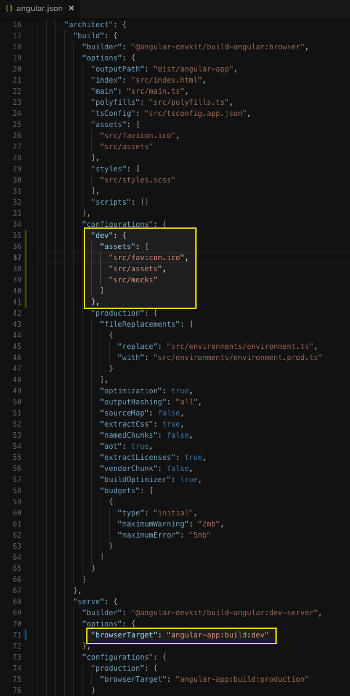

# Getting Started with Angular and AEM SPA Editor - Chapter 4{#getting-started-with-angular-and-aem-spa-editor-chapter}

## Setting up the Angular development environment {#setting-up-the-angular-development-environment}

As seen in the previous chapter, Angular app development can be performed and deployed into AEM for review, however, this full life-cycle is cumbersome and does not support the development velocity typically enjoyed during front-end development.

In this chapter, we'll explore how the need for a running AEM instance can be removed for front-end development.

## AEM Proxy JSON approach {#aem-proxy-json-approach}

Persona: Angular Developer

The first approach we'll look at is having the Angular app run on the local web dev server (via **ng serve** ``or **npm  start**), allowing the natural real-time update and reload of the Angular app, while leveraging the content (both the JSON and images) that reside in AEM.

1. Update **aem-guides-wknd-events/angular-app/src/index.html** with the following HTML.

   This HTML mimics the HTML the AEM generates for the Angular app's entry page at **/content/wknd-events/angular.html,** with exception of the JavaScript  include  of the Angular application itself. The Angular application's JavaScript is automatically injected into the index.html.

   ```xml
   <!DOCTYPE HTML>
   <html lang="en-US">
     <head>
       <base href="/"/>
       <title>WKND Events - Angular App</title>
       <meta charset="UTF-8"/>
       <meta name="template" content="wknd-events-page-template"/>
       <meta name="viewport" content="width=device-width, initial-scale=1, shrink-to-fit=no"/>
       <meta property="cq:pagemodel_root_url" 
             content="/content/wknd-events/angular.model.json"/>
     </head>
   
     <body class="page basicpage">
       <app-root></app-root>
     </body>
   </html>
   ```

   **Lines 9-10** sets the **cq:pagemodel_root_url** meta attribute to the JSON entry point for the application.

1. Create a new file at **aem-guides-wknd-events/angular-app/proxy.aem.conf.json **and populate it with:

   ```
   [
     {
       "context": [
         "/content/**/**.model.json",
         "/content/**/**.jpeg",
         "/content/**/**.jpg"
       ],
       "target": "http://localhost:4502",
       "auth": "admin:admin",
       "logLevel": "debug"
     }
   ]
   ```

   The **proxy.aem.conf.json** leverages native Angular request proxy support.

   This proxies request for** model.json** and **jpeg** images to AEM running at [localhost:4502](http://localhost:4502), since AEM is responsible for serving the content to drive the experience.

   Note that this proxy sets an HTTP Request head that includes a basic auth header for **admin  :admin **, allowing the Angular app to access the content from AEM Author, which denies anonymous access by default.

1. Start or restart the local web server by running the following command from the **angular-app** folder, using the **--proxy-config** flag to point to the newly created **proxy.aemconf.json:**

   ```shell
   $ ng serve --proxy-config ./proxy.aem.conf.json
   
   ```

1. In the web browser, navigate to [http://localhost:4200/content/wknd-events/angular/home.html](http://localhost:4200/content/wknd-events/angular/home.html), which Angular maps to src/index.html. The browser should render the page driven by the content in AEM.

   

   The **left** browser displays the Angular app run on the **local dev** **web server** at [http://localhost:4200](http://localhost:4200/content/wknd-events/angular/home.html).

   The **right** browser displays the Angular app run on **AEM Author **at [http://localhost:4502](http://localhost:4502/editor.html/content/wknd-events/angular/home.html).

## Mock JSON approach {#mock-json-approach}

Persona: Angular Developer

Another approach to rapid development is to use a static or mock JSON file to develop against. This removes the dependency on a local AEM instance. It also allows the front-end developer to update the JSON in order to test functionality and mock new JSON responses without the dependency on a back-end developer.

This does require the front-end developer be provided up-to-date examples of the JSON AEM generates.

1. Follow the **Step 1** of the **Proxy JSON approach outlined above**, if you haven't already. This will set up the Angular app's **index.html** to support this approach.
1. In the browser navigate to [http://localhost:4502/content/wknd-events/angular.model.json](http://localhost:4502/content/wknd-events/angular.model.json)

   This is the JSON exported by AEM that is driving the application. Copy the JSON output or download it here:

   [Get File](assets/angular_model.json)
   Create or copy this file to** wknd-events/angular-app/src/mocks/json/angular.model.json**, creating the intermediate folders as needed. It is important the filename (**angular.model.json**) matches the file that is requested by the Angular application.

1. Pick a FPO (For Placement Only) image that will be used for images that are authors in AEM, or download the provided FPO image here:

   [Get File](assets/fpo.jpg)
   This image can be anything to your liking! Copy this file to** wknd-events/angular-app/src/mocks/assets/fpo.jpg**, creating the intermediate folders as needed. 

1. Create and copy the configuration below to **wknd-events/angular-app/proxy.mock.conf.json**.

   ```
   [
     {
       "context": [
         "/content/**/*.model.json"
       ],
       "pathRewrite": { "^/content/wknd-events" : "/mocks/json"} ,
       "target": "http://localhost:4200",
       "logLevel": "debug"
     },
     {
       "context": [
         "/content/**/*.jpg",
         "/content/**/*.jpeg"
       ],
       "pathRewrite": { ".*": "/mocks/assets/fpo.jpg" },
       "target": "http://localhost:4200",
       "logLevel": "debug"
     }
   ]
   ```

   **Lines 3-9** map requests for **/content/&#42;&#42;/&#42;.model.json** to be mapped into** /mocks/  json **.

   In this case requests for **/content/wknd-events/angular.model.json** are mapped to **/mocks/json/angular.model.json**. Likewise, if a request for **/content/wknd-events/angular/home/events/event-x.model.json** is made, it maps to **/mocks/json/angular/home/events/event-x.model.json**.

   **Lines 15-26** map request for JPEGs to a single FPO (For Placement Only) image at **/mocks/assets/fpo.jpg**.

   Note that the target is set to **http://localhost:4200** which is the host and port the Angular web devserver runs on.

   As other asset types are utilized by the Angular app from AEM, similar rules can be created in the Angular app to surface appropriate mock data.

1. Update ** aem -guides-wknd-events/angular-app/angular.json, **create a new configuration to be used with the command **ng serve**, we'll call it **dev**. Add the assets array that defines which files in src to copy to dist during **ng serve**. We'll add the default **src/favicon.  ico **, **src/assets** and our newly added** src/mocks**.

   Under the serve command definition, update the build command to target the new dev configuration by postfixing the build directive   with  ** :  dev **.

   If **src/mocks **is added to the default build options, (Line 25 below) then any CSS or JavaScript provided for use with mocking (which is done later in this tutorial to enabled local development with AEM Responsive Grid) would be copied to the dist folder on build, and we'd have to update the **clientlib.config.js** to exclude them. Updating the serve' architecture is a more elegant solution.

   

   angular-app/angular.json

   **Line 35** defines a new configuration named **dev**.

   **Line 46-40** defines the src folders that will be made available to the running Angular application when this configuration is invoked. This is a copy of **Line 25-28** (the default configuration) with the addition of the new **src/mocks** folder.

   **Line 71** is part of the "serve" configuration (**Line 68**), and defines the build config by appending the new dev config name after **angular-app  :build **.

1. Restart the Angular app using the **proxy.mock.conf.json**.

   ```shell
   $ ng serve --proxy-config proxy.mock.conf.json
   ```

   Upon start, the Angular app running on the local web devserver should display:

   

   http://localhost:4200/content/wknd-events/angular/home.html

   Keep in mind that mock JSON files must be updated to reflect the content structures that will drive the Angular app.

### Having some fun with Mock JSON  {#having-some-fun-with-mock-json}

Instead of using boring FPO images, this approach works with FPO image services such as [fillmurray.com](https://www.fillmurray.com/) and [placecage.com](https://www.placecage.com/). *(Neither fillmurray.com or placecage.com are affiliated in any way with Adobe).*

To use a hosted FPO service, simply update the **proxy.mock.conf.json** rule for the the JPEG proxying.

```
[
  {
    "context": [
      "/content/**/*.model.json"
    ],
    "pathRewrite": { "^/content/wknd-events" : "/mocks/json"} ,
    "target": "http://localhost:4200",
    "logLevel": "debug"
  },
  {
    "context": [
      "/content/**/*.jpg",
      "/content/**/*.jpeg"
    ],
    "logLevel": "debug",
    "pathRewrite": { ".*": "/1000/450" },
    "target": "https://www.fillmurray.com",
    "secure": true,
    "changeOrigin": true
  }
]
```

The proxy rule for the **&#42;.model.json** remains the same, however the the rules for the JPEG images is updated to proxy the requests to the FPO service.

Adjust the ** pathRew   rite ** image size as desired; the re-written format is `/<width>/<height>`, with different combinations resulting in differing FPO images. Restart the Angular app local web devserver using the command:

```shell
$ ng serve --proxy-config proxy.mock.conf.json
```

And you should see something like this:


Mock proxy data using fillmurray.com for FPO images

Review the [HTTP Proxy Module's documentation](https://github.com/chimurai/http-proxy-middleware#options) for even more powerful configurations to change the FPO service's URL based on the mock content.

## Local front-end development flow {#local-front-end-development-flow}

Persona: Angular Developer, CSS Developer

Using either mock JSON approach (Proxy JSON or Mock JSON) front-end developers can develop locally against the Angular App and immediately see the changes reflected on their local web devserver.


This animation illustrates a simple example of updating CSS and mock content in the Angular application and having the changes immediately reflected in the local web devserver, rendering the Angular application using the mock data. Any changes to the Angular application (not just CSS and mock content) can be affected in this manner.

## Next steps {#next-steps}

Next part in the tutorial:

* [Chapter 5 - Setting up the Styles](../../../../sites/using/getting-started-spa-wknd-tutorial-develop/angular/chapter-5.md)

View the solution for [Chapter 4 on GitHub](https://github.com/Adobe-Marketing-Cloud/aem-guides-wknd-events/tree/angular/chapter-4).
