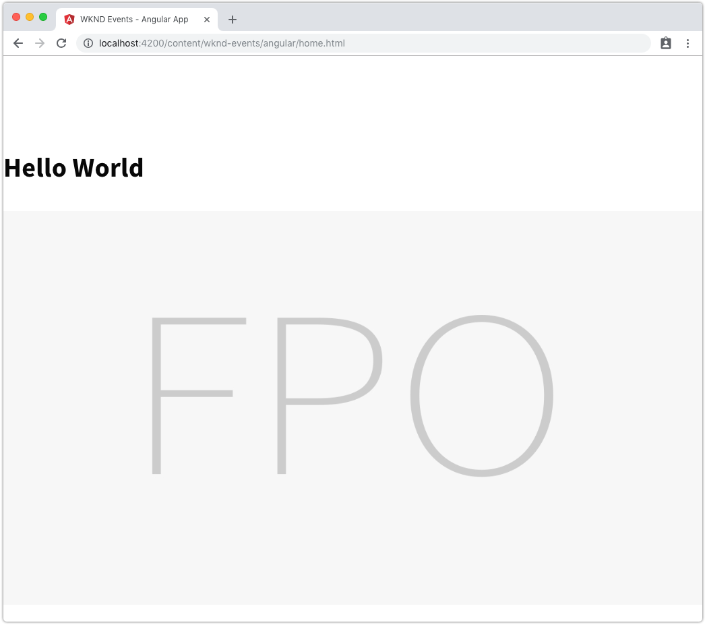

# Getting Started with Angular and AEM SPA Editor - Chapter 5{#getting-started-with-angular-and-aem-spa-editor-chapter}

## Setting up the styles {#setting-up-the-styles}

When creating the Angular project, SCSS was selected, so the Angular project is automatically set up to use SCSS to define the styles.

*Since Angular and the front-end build process owns the compilation the Styles, any supported technology can be used.*

This chapter sets up the basic WKND Event site styles including variables and mixins that will re-used across other Angular components.

## Creating the base styles  {#creating-the-base-styles}

Persona: CSS Developer

The base styles will comprise of:

* **variables** which centrally define the experience's brand stands.
* **mixins** which define complex collections of brand standards, such as responsive media queries.
* A **shared** file which exposes all shared files (variables and mixins) to other style files.
* The main **styles** file that defines basic, global styles.

1. Create an new file at **aem-guides-wknd-events/angular-app/src/styles/_variables.scss **and populate with the following SCSS variable definitions. These variables will be used thoughout the Angular app to ensure consistency of design.

   ```css
   //variables for WKND Events
   
   //Typography
   $em-base:             20px;
   $base-font-size:      1rem;
   $small-font-size:     1.4rem;
   $lead-font-size:      2rem;
   $title-font-size:     5.2rem;
   $h1-font-size:        3rem;
   $h2-font-size:        2.5rem;
   $h3-font-size:        2rem;
   $h4-font-size:        1.5rem;
   $h5-font-size:        1.3rem;
   $h6-font-size:        1rem;
   $base-line-height:    1.5;
   $heading-line-height: 1.3;
   $lead-line-height:    1.7;
   
   $font-serif:         'Asar', serif;
   $font-sans:          'Source Sans Pro', sans-serif;
   
   $font-weight-light:      300;
   $font-weight-normal:     400;
   $font-weight-semi-bold:  600;
   $font-weight-bold:       700;
   
   //Colors
   $color-white:            #ffffff;
   $color-black:            #080808;
   
   $color-yellow:           #FFEA08;
   $color-gray:             #808080;
   $color-dark-gray:        #707070;
   
   //Functional Colors
   
   $color-primary:          $color-yellow;
   $color-secondary:        $color-gray;
   $color-text:             $color-gray;

   //Layout
   $max-width: 1200px;
   $header-height: 80px;
   $header-height-big: 100px;
   
   // Spacing
   $gutter-padding: 12px;
   
   // Mobile Breakpoints
   $mobile-screen: 160px;
   $small-screen:  767px;
   $medium-screen: 992px;
   ```

1. Create an new file at **aem-guides-wknd-events/angular-app/src/styles/_mixins.scss **and populate with the following SCSS mixin definitions. These variables will be used thoughout the Angular application to aid in consistency of complex styling.

   Note the this **_mixins.scss** imports and makes use of the **variables** defined in **_variables.scss**.

   ```css
   @import "variables";
   
   @mixin media($types...) {
     @each $type in $types {
   
       @if $type == tablet {
         @media only screen and (min-width: $small-screen + 1) and (max-width: $medium-screen) {
           @content;
         }
       }
   
       @if $type == desktop {
         @media only screen and (min-width: $medium-screen + 1) {
           @content;
         }
       }
   
       @if $type == mobile {
         @media only screen and (min-width: $mobile-screen + 1) and (max-width: $small-screen) {
           @content;
         }
       }
     }
   }
   
   @mixin content-area () {
     margin: 0 auto;
     max-width: $max-width;
     padding: $gutter-padding;
   }
   
   @mixin component-padding() {
     padding: 0 $gutter-padding !important;
   }
   
   @mixin drop-shadow () {
     box-shadow: 0 4px 8px 0 rgba(0, 0, 0, 0.2), 0 6px 20px 0 rgba(0, 0, 0, 0.19);
   }
   ```

1. Create an new file at **aem-guides-wknd-events/angular-app/src/styles/_shared.scss **and include the newly created **_variables.scss** and **_mixins.scss**. This **_shared.scss** provides a single include in Angular components' SCSS files to these shared styles can be re-used.

   ```css
   @import "variables";
   @import "mixins";
   ```

1. Update **aem-guides-wknd-events/angular-app/src/styles.scss **and populate with the baseline styles. Note that this file includes the newly created **styles/_shared.scss** which exposes the variables and mixins.

   ```css
   @import "./styles/shared";
   
   /* Google Font import */
   @import url('https://fonts.googleapis.com/css?family=Asar|Source+Sans+Pro:400,600,700');
   
   body {
     background-color: $color-white;
     font-family: $font-sans;
     margin: 0;
     padding: 0;
   
     font-size: $base-font-size;
     font-weight: $font-weight-light;
     text-align: left;
     color: $color-black;
     line-height: 1.5;
     line-height: 1.6;
     letter-spacing: 0.3px;
   
     padding-top: $header-height-big;
     @include media(mobile) {
       padding-top: $header-height;
     }  
   }
   
   h1, h2, h3, h4 {
     font-family: $font-sans;
   }
   
   h1 {
     font-size:  $h1-font-size;
   }
   
   h2 {
     font-size: $h2-font-size;
   }
   
   h3 {
     font-size: $h3-font-size;
   }
   
   h4 {
     font-size: $h4-font-size;
   }
   
   h5 {
     font-size: $h5-font-size;
   }
   
   h6 {
     font-size: $h6-font-size;
   }
   
   p {
     color: $color-text;
     font-family: $font-serif;
   }
   
   ul {
     list-style-position: inside;
   }
   
   ol, ul {
     padding-left: 0;
     margin-bottom: 0;
   }
   
   hr {
     height: 2px;
     border: 0 none;
     margin: 0 auto;
     max-width: $max-width;
   }
   
   *:focus {
     outline: none;
   }
   
   textarea:focus, input:focus{
     outline: none;
   }
   
   body {
     overflow-x: hidden;
   }
   
   img {
     vertical-align: middle;
     border-style: none;
     width: 100%;
   }
   ```

1. After applying the base styles, the Angular application should render with updates fonts, and sizing.

   

## Next steps {#next-steps}

Next part in the tutorial:

* [Chapter 6 - Building components](../../../../sites/using/getting-started-spa-wknd-tutorial-develop/angular/chapter-6.md)

View the solution for [Chapter 5 on GitHub](https://github.com/Adobe-Marketing-Cloud/aem-guides-wknd-events/tree/angular/chapter-5).
