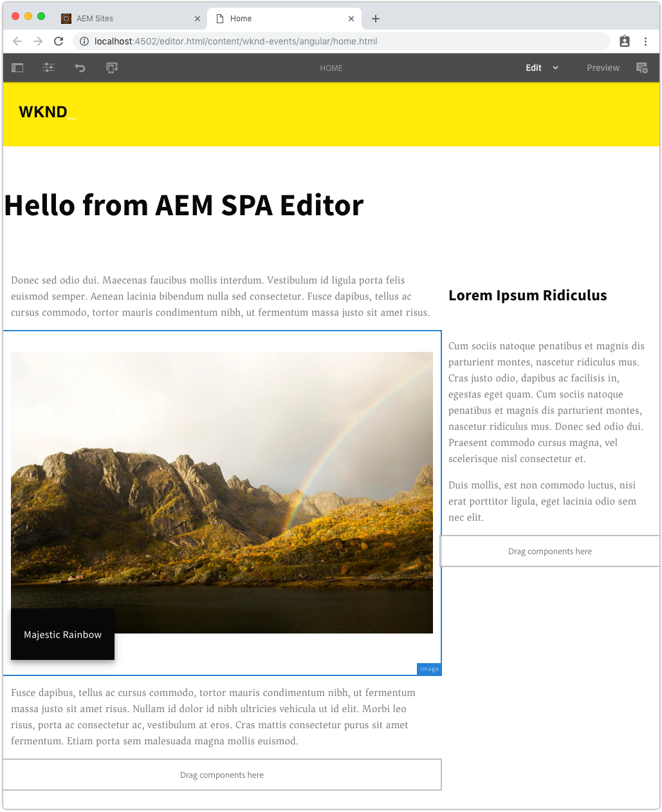
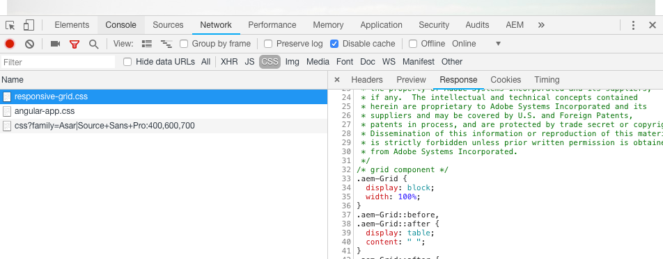
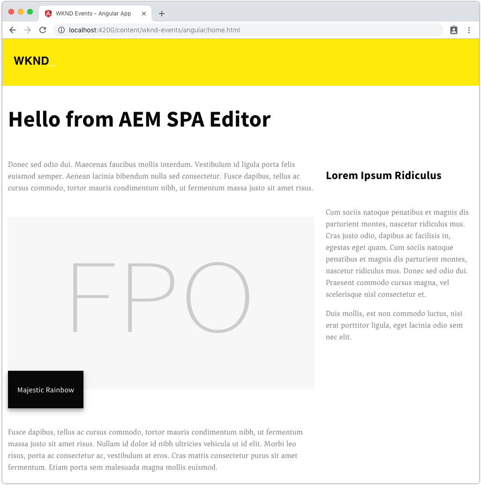

# Getting Started with Angular and AEM SPA Editor - Chapter 7{#getting-started-with-angular-and-aem-spa-editor-chapter}

## Layouting with AEM Responsive Grid {#layouting-with-aem-responsive-grid}

AEM Sites' Page Editor provides [Layout Mode](https://helpx.adobe.com/experience-manager/6-4/sites/authoring/using/responsive-layout.html), which enables authors to re-size components and containers, for general layout purposes as well as in the context of responsive design. This feature is also available in AEM's SPA Editor.

To enable Layout Mode for use with SPA Editor Angular apps, AEM's Responsive Grid CSS must be included in the project.

As part of the starter project, a dedicated client library for the Responsive Grid has been included in the ** ui .apps** project. You can view the client library at** /  aem -guides-wknd-events/  ui .apps/src/main/content/jcr_root/apps/wknd-events/clientlibs/responsive-grid**. This client library has a category of **wknd-events.grid** and includes a single file named **grid.less **which includes the necessary CSS for the Layout Mode and the responsive grid to work.

Next, we will make sure that this CSS is loaded with the Angular app.

1. Beneath **wknd-events/aem-guides-wknd-events/angular-app** open **clientlib.config.js.** Update **clientlib.config.js** to make the **wknd-events.grid** a dependency of the Angular app:

   ```
   module.exports = {
       // default working directory (can be changed per 'cwd' in every asset option)
       context: __dirname,
   
       // path to the clientlib root folder (output)
       clientLibRoot: "./../ui.apps/src/main/content/jcr_root/apps/wknd-events/clientlibs",
   
       libs: {
           name: "angular-app",
           allowProxy: true,
           categories: ["wknd-events.angular"],
           dependencies:["wknd-events.grid"],
           serializationFormat: "xml",
           jsProcessor: ["default:none","min:none"],
           assets: {
               js: [
                   "dist/angular-app/**/*.js"
               ],
               css: [
                   "dist/angular-app/**/*.css"
               ]
           }
       }
   };
   ```

   **Line 12 **adds a dependency on the **wknd-events.grid** clientlib category, which is provided via the intial project at **ui.apps/src/main/content/jcr_root/apps/wknd-events/clientlibs/responsive-grid**.

1. Deploy the changes to AEM from the root of the project using maven:

   ```shell
   $ cd aem-guides-wknd-events
   $ mvn -PautoInstallPackage clean install
   ```

1. Navigate to [https://localhost:4502/editor.html/content/wknd-events/angular/home.html](https://localhost:4502/editor.html/content/wknd-events/angular/home.html). You should now be able to use the layout controls on the component to re-size components based on the grid.

   

   Use the layout controls to resize the components in the AEM SPA Editor

1. Add a couple of layout containers and resize them so there is a main content region and a sidebar region. You should be able to create an article that looks similar to this:

   

## Integrating Responsive Grid into local development {#integrating-responsive-grid-into-local-development}

The Responsive Grid CSS currently is being hosted and served from the AEM instance, via the **wknd-events  .grid ** client library, which means local Angular development must have an AEM instance available to serve this CSS. This creates a hard dependency on a running AEM instance, which we don't want to impose on the Angular development team.

To resolve this, the Responsive Grid CSS can be copied into the Angular app's, and update the **index.html**, used for local Angular app development, to point to it.

1. [Locate the responsive grid CSS as served by AEM](https://localhost:4502/etc.clientlibs/wknd-events/clientlibs/responsive-grid.css) using the browser's Network panel.

   

   https://localhost:4502/etc.clientlibs/wknd-events/clientlibs/responsive-grid.css

1. Copy the **responsive-grid.css** as served up form AEM into **angular-app/src/mocks/css/responsive-grid.css**

   angular-app/src/mocks/css/responsive-grid.css

   [Get File](assets/responsive-grid.css)

1. Open and update angular-app/src/index.html to include a `<link.../>` include for the mock **responsive-grid.css**.

   ```xml
   <!DOCTYPE HTML>
   <html lang="en-US">
     <head>
       <base href="/"/>
       <title>WKND Events - Angular App</title>
       <meta charset="UTF-8"/>
       <meta name="template" content="wknd-events-page-template"/>
       <meta name="viewport" content="width=device-width, initial-scale=1, shrink-to-fit=no"/>
       <meta property="cq:pagemodel_root_url" 
             content="/content/wknd-events/angular.model.json"/>
       <link rel="stylesheet" href="/mocks/css/responsive-grid.css" type="text/css">
     </head>
   
     <body class="page basicpage">
       <app-root></app-root>
     </body>
   </html>
   ```

   **Line 10** adds a reference to the the **responsive-grid.css** file that has been copied into the mocks folder.

   This allows the AEM Responsive Grid to layout the views of the Angular applicaiton based on the consumed JSON. This approach supports both the AEM Proxy and Mock JSON development approaches.

1. If using the Mock JSON local development method, update the mock **angular.model.json** with the new JSON from AEM that includes the Responsive Grid configurations.

   Copy the result of [https://localhost:4502/content/wknd-events/angular.model.json](https://localhost:4502/content/wknd-events/angular.model.json) and replace the contents of **angular-app/src/mocks/json/angular.model.json**.

   angular-app/src/mocks/json/angular.model.json

   [Get File](assets/angular_model-2.json)

1. Re-start AEM wit the preferred proxy configuration, and the Angular app should render using the AEM Responsive Grid layout.

   

   Angular application served using: ng serve --proxy-config ./proxy.mock.conf.json

   As you can see, even though the page is being rendered in the local dev web server, the layout defined by the AEM Author in the SPA Editor is reflected without any

## Next Steps {#next-steps}

Next chapter of the tutorial:

* [Chapter 8 - Multi-page navigation with the List component](../../../../sites/using/getting-started-spa-wknd-tutorial-develop/angular/chapter-8.md)

View the solution for [Chapter 7 on GitHub](https://github.com/Adobe-Marketing-Cloud/aem-guides-wknd-events/tree/angular/chapter-7).
