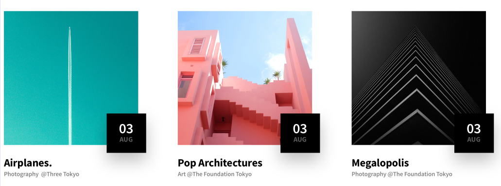
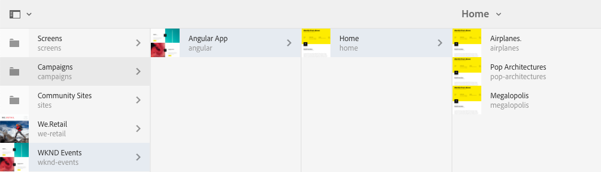
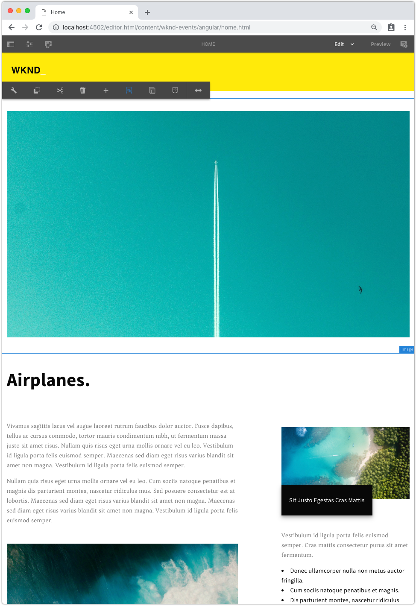
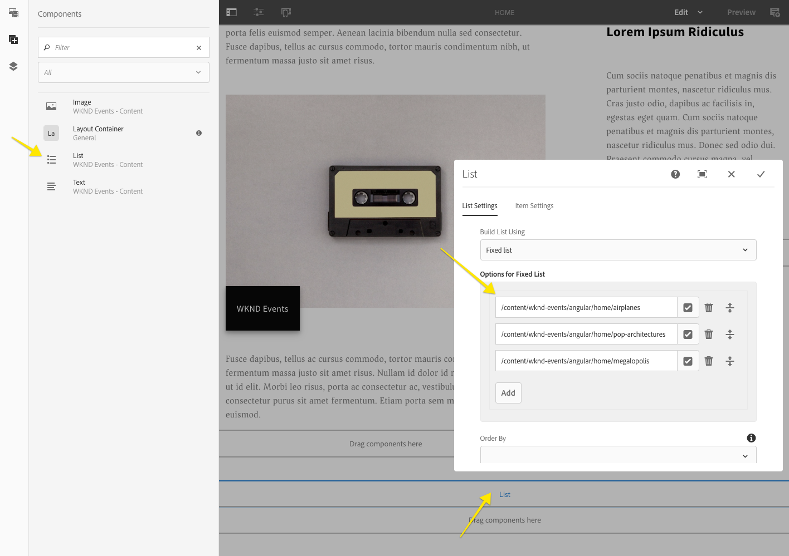

# Getting Started with Angular and AEM SPA Editor - Chapter 8{#getting-started-with-angular-and-aem-spa-editor-chapter}

## Muti-page navigation with the List component {#muti-page-navigation-with-the-list-component}

Now that we have a handle on using the SPA Editor JS SDK-provided Container components to render responsive grids and layout containers as well as strict content components like Text and Image that display authored content, let's take a look at a navigation component that will leverage the dynamic routing setup in [Chapter 2](/help/getting-started-spa-wknd-tutorial-develop/angular/chapter-2.md).

For this, the Core Components' List component will be leveraged and displayed in the following manner at the bottom of our first page to cross-promote other content.

Our List component will display a list of links to other AEM pages that are part of the overall Angular experience. This Angular component will map to an [AEM List component](https://github.com/Adobe-Marketing-Cloud/aem-core-wcm-components/tree/master/content/src/content/jcr_root/apps/core/wcm/components/list/v2/list), which is provided by AEM Core Components to a custom Angular component that will display the content in the horizontal, panel-style layout.

The Core Component's List component provides an array of items that includes a URL, path, optional description, title and a timestamp for when the page was last modified. A sample of the List JSON model can be seen below:



List (with navigation) component mock-up

## A twist on the development flow {#a-twist-on-the-development-flow}

Persona: Angular Developer

Depending on the established development flow for front-end developers, it is possible to get into a "chicken or the egg" situation; meaning the front-end developer requires the JSON output from authored AEM Components in order to properly develop the business logic and view of the Angular component. But because there is no Angular component yet, the front-end developer cannot add the component to an AEM page, author is with sample content, and either use the JSON directly via the AEM Proxy approach or copy it out for the Mock JSON approach.

In this chapter well explore how we can work around this conundrum!

## Creating the "bare" List component {#creating-the-bare-list-component}

Persona: Angular Developer

We'll be using a the Core Component's List component, whose [JSON output is documented](https://content/help/en/experience-manager/core-components/using/list.html#SampleComponentOutput), however this approach is useful for undocumented component configurations or custom AEM components whose JSON output may not be documented yet by the development team.

The List Angular component is built out in a similar fashion as the Text and Image components in [Chapters 3](/help/getting-started-spa-wknd-tutorial-develop/angular/chapter-3.md) and [6](/help/getting-started-spa-wknd-tutorial-develop/angular/chapter-6.md).

The basic steps are:

1. Generate a **new Angular component**
1. Add the **@Inputs** that map to the JSON keys that this Angular component will need  

1. **Build business logic** to expose content via public getters for consumption in the** list.component.html**

1. Define the **EditConfig** for the Angular component.
1. Map the Angular component to the  appropriate **:type** value

1. Add the new Angular component to the **app.module.ts's entryComponents** array.
1. Build the **view** of the component in** list.component.html**

1. **Style** the component appropriately in **list.component.scss**

To resolve or "chicken or the egg" we'll change the order as follows:

1. Generate a **new Angular component**
1. Define the **EditConfig** for the Angular component.
1. Map the Angular component to the  appropriate **: type** value

1. Add the new Angular component to the **app.module.ts's entryComponents** array.  
  
   ***Build out the sample content in AEM Author to provide true-to-form JSON***

1. Add the **@Inputs** that map to the JSON keys that this Angular component will need  

1. **Build business logic** to expose content via public getters for consumption in the** list.component.html**

1. Build the **view** of the component in** list.component.html**

1. **Style** the component appropriately in **list.component.scss**

1. When using the development flow approach we're exploring, it is usually most helpful to run in AEM Proxy mode, since this assumes a running and available AEM instance anyhow.

   Restart the local dev web server to use the AEM Proxy.

   ```shell
   $ cd aem-guides-wknd-events/angular-app
   $ ng serve --proxy-config ./proxy.aem.conf.json
   ```

1. Create a new List Angular component using the **ng generate** command from the **angular-app** folder.

   ```shell
   $ cd aem-guides-wknd-events/angular-app
   $ ng generate component components/list
   ```

1. Add an **ListEditConfig** implementation to the bottom of **list.component.ts** that checks if the **items** array is empty.

   ```
   import { Component, OnInit, Input } from '@angular/core';
   
   @Component({
     selector: 'app-list',
     templateUrl: './list.component.html',
     styleUrls: ['./list.component.scss']
   })
   export class ListComponent implements OnInit {
   
     constructor() { }
   
     ngOnInit() {}
   }
   const ListEditConfig = {
     emptyLabel: 'List',
   
     isEmpty: function(componentData) {
       return !componentData || !componentData.items || 
        componentData.items.length < 1;
     }
   };
   ```

   Set  the `: host-context` for this Angular component to display block to allow the placeholder to render in the SPA Editor, by adding the following rule to** list.component.scss**.

   ```css
   :host-context {
       display: block;
   }
   
   ```

   and optionally remove everything from **list.component.html **for tidiness.

1. At the bottom of the **list.component.ts** file, map this Angular component to the type **wknd-events/components/content/list**, and register the **ListEditConfig**.

   ```
   ...
   import { MapTo } from '@adobe/cq-angular-editable-components';
   
   @Component({ ... })
   export class ListComponent implements OnInit { ... }
   const ListEditConfig = { ... }
   
   MapTo('wknd-events/components/content/list')(ListComponent, ListEditConfig);
   
   ```

1. Register this ListComponent in **app.module.ts's entryComponents** array.

   ```
   ...
     entryComponents: [ImageComponent, ListComponent, TextComponent]
   ...
   ```

   At this point the List Component is registered to the appropriate type, and has an EditConfig

1. Build and deploy the application to AEM Author.

   ```shell
   $ cd aem-guides-wknd-events
   $ mvn -PautoInstallPackage clean install
   ```

## Creating the sample content in AEM Author {#creating-the-sample-content-in-aem-author}

Persona: Angular Developer

With the empty List component developed, the front-end developer can author the List component in AEM Author and generate the real sample JSON to develop against.

Optionally, the content (Pages) built out in this section can be installed directly via the AEM Packages:

* [  aem -guides-wknd-events.angular.pages-0.0.1-SNAPSHOT.zip](https://github.com/Adobe-Marketing-Cloud/aem-guides-wknd-events/releases/download/angular-v1.0.0/aem-guides-wknd-events.angular.pages-0.0.1-SNAPSHOT.zip)  

* [  aem -guides-wknd-events.images-0.0.1-SNAPSHOT.zip](https://github.com/Adobe-Marketing-Cloud/aem-guides-wknd-events/releases/download/angular-v1.0.0/aem-guides-wknd-events.images-0.0.1-SNAPSHOT.zip)

1. On AEM Author, navigate to **Sites &gt; WKND Events &gt; Angular &gt; Home** and **create 3 new sub-pages** using the** Event Page template, using the following pages:**

    * Title: **Airplanes**.
    * Description: **Photography @Three Tokyo**

    * Title: **Pop Architectures**
    * Description: **Art @The Foundation Tokyo**

    * Title: Megalopolis
    * Description: **Photography @The Foundation Tokyo**

   

   Sites > WKND Events > Angular > Home

1. Build out these three pages using the Layout Container, Text and Image component's.

   Add at least an image to the existing Image component, as this will drive the images display in the List component.

   >[!NOTE]
   >
   >Note that the Image components resource path must stay as is `([cq  :Page ]/jcr  :content /root/  responsivegrid /image`) as this is the resource path we'll use to derive the `img  src`in the list.component.html.

    * [Download the AEM Package containing thematic Images](https://github.com/Adobe-Marketing-Cloud/aem-guides-wknd-events/releases/download/angular-v1.0.0/aem-guides-wknd-events.images-0.0.1-SNAPSHOT.zip) used used in example build-out below.

   

   Example Event page (/content/wknd-events/angular/home/airplanes)

1. After all three Event pages are created and populated with content, add a WKND Events List component to the bottom of the Home page.

   Edit the List component, and point to the three new Event pages created in Step 2.

   

   Adding and authoring the List component on the Home page

   Now that the sample content that will drive the Angular application's experience is created in AEM, we can switch back to local Angular development using the AEM Proxy method.

   Alternatively, if the Mock JSON method is preferred, the JSON from

   can be copied into the mock content

   ** aem -guides-wknd-events/angular-app/src/app/mocks/json/angular.model.json**.

   angular.model.json

   [Get File](assets/angular_model-1.json)
   Now with the sample, content we can code in real-time against the JSON data and quickly build out the the Angular list component.

## Finishing the List component using the sample content {#finishing-the-list-component-using-the-sample-content}

Persona: Angular Developer

Inspecting the JSON from [http://localhost:4502/content/wknd-events/angular.model.json](http://localhost:4502/content/wknd-events/angular.model.json) the list component's content can be located an understood.

The list component's JSON is essentially an array (at the list key) of JSON objects, with each object representing a list item. Each list item has the following attributes exposed:

* **url**: the path segment of the URL to the AEM page
* **path**: the absolute path to the AEM page
* **description**: the AEM Page's description (set via Page Properties &gt; Basic Tab &gt; Description field)
* **lastModified**: the timestamp indicating when the page was last modified
* **title**: the AEM Page's title (set in the Create Page wizards or Page Properties &gt; Basic Tab &gt; Title field)

```
list: {
    dateFormatString: "yyyy-MM-dd",
    items: [{
        url: "/content/wknd-events/angular/home/airplanes.html",
        path: "/content/wknd-events/angular/home/airplanes",
        description: "Photography @Three Tokyo",
        lastModified: 1544025388813,
        title: "Airplanes."
      },
      {
        url: "/content/wknd-events/angular/home/pop-architectures.html",
        path: "/content/wknd-events/angular/home/pop-architectures",
        description: "Art @The Foundation Tokyo",
        lastModified: 1544030752638,
        title: "Pop Architectures"
      },
      {
        url: "/content/wknd-events/angular/home/megalopolis.html",
        path: "/content/wknd-events/angular/home/megalopolis",
        description: "Photography @The Foundation Tokyo",
        lastModified: 1544030825100,
        title: "Megalopolis"
      }
    ],
    showDescription: true,
    showModificationDate: true,
    linkItems: true,
    : type: "wknd-events/components/content/list"
  }
}
```

1. Inject the data from the list component's JSON representation using Angular `@Inputs`.

   `@Inputs` can only inject the top level JSON elements, so we want to inject the arrays of Items.

   ```
   import { Component, OnInit, Input } from '@angular/core';
   import { MapTo } from '@adobe/cq-angular-editable-components';
   
   @Component({
     selector: 'app-list',
     templateUrl: './list.component.html',
     styleUrls: ['./list.component.scss']
   })
   export class ListComponent implements OnInit {
   
     @Input() items: object[];
   
     constructor() { }
   
     ngOnInit() { }
   }
   ```

   **Line 11** injects the list components' JSON property items, which holds a list of the AEM pages to display into a field named "items" in the Angular component. See the JSON above.

1. Next, the Angular component is augmented with business logic to transform and expose the list content in a way that can drive the Angular component's view (**list.component.html**).

   For this a simple **Event** JavaScript class is created to transform each item in items, into an object that represents a WKND Event page.

   ```
   import { Component, OnInit, Input } from '@angular/core';
   import { MapTo } from '@adobe/cq-angular-editable-components';
   
   @Component({
     selector: 'app-list',
     templateUrl: './list.component.html',
     styleUrls: ['./list.component.scss']
   })
   export class ListComponent implements OnInit {
   
     @Input() items: object[];
   
     constructor() { }
   
     get events(): Event[] {
       return this.items.map(item => {
         return new Event(item);
       });
     }
   
     ngOnInit() { }
   }
   
   class Event {
     private monthNames: string[] = ['Jan', 'Feb', 'Mar', 'Apr', 'May', 'Jun', 'Jul', 'Aug', 'Sep', 'Oct', 'Nov', 'Dec'];
   
     date: Date;
     path: string;
     url: string;
     title: string;
     description: string;
   
     constructor(data) {
       this.path = data.path;
       this.title = data.title;
       this.description = data.description;
       this.url = data.url;
       this.date = new Date(data.lastModified);
     }
   
     public get imageUrl(): string {
       return this.path + '/_jcr_content/root/responsivegrid/image.coreimg.jpeg';
     }
   
     public get month(): string {
       return this.monthNames[this.date.getMonth()];
     }
   
     public get day(): string {
       let tmp = this.date.getDate().toString();
   
       if (tmp.length === 1) {
         tmp = '0' + tmp;
       }
   
       return tmp;
     }
   }
   
   const ListEditConfig = {
     emptyLabel: 'List',
   
     isEmpty: function(componentData) {
       return !componentData || !componentData.items || componentData.items.length < 1;
     }
   };
   
   MapTo('wknd-events/components/content/list')(ListComponent, ListEditConfig);
   ```

   **Lines 24-58** define a JavaScript class **Event** that represents each list item.

   **Lines 33-39** define the Item classes constructor which is driven by the JSON object for each item at the list component's JSON's items key.

   **Lines 41-43** define a getter for the image, creating a URL that points to the target page's image component resource. In this tutorial, this sub-path **`/_jcr_content/root/responsivegrid/image.coreimg.jpeg`** is hardcoded.

   **Lines 45-47** define a getter for the three-letter month name (using the look-up array defined at **Line 19**)

   **Lines 49-57** define a getter for the date, padded with a leading 0 if necessary.

   **Lines 15-19** define a getter on the ListComponent itself that transforms the list JSON objects into **Event** objects which will be used in the **list.component.html** to drive the view. 

1. Update **list.component.html** with the required HTML to render the list experience. Note that the custom getter `events()`  is  used in `*ngFor`to iterate over the **Event** objects to render.

   ```xml
   <ul *ngIf="events.length > 0" class="list">
       <li *ngFor="let event of events" class="event">
         
         <a [routerLink]="event.url" class="event__image-link">
           
           
           <span class="event__date">
               <div class="event__date-text">{{ event.day }}</div>
               <div class="event__date-text--secondary">{{ event.month }}</div>
           </span>
         </a>
   
         <a [routerLink]="event.url" class="event__title">{{ event.title }}</a>
         <span class="event__description">{{ event.description }}</span>
       </li>
     </ul>
   ```

   **Line 1** loops over the Event objects returned by the `events()` getter.

   **Lines 4 and 13** creates an [Angular Router link](https://angular.io/api/router/RouterLink) allowing clicks on these elements to be handled by the Angular router, to that the correct AEM page JSON content is presented in the Angular app.

   The rest of the code simply displays the content exposed by the Event JavaScript object.

1. Add the follow SCSS to **list.component.scss** to style the Angular List component.

   ```css
   @import '~src/styles/shared';
   
   :host-context {
       display: block;
   }
   
   $eventBoxSize: 25vw;
   $eventDateBoxSize: 4.75vw;
   
   .events {
       display: flex;
       flex-direction: row;
       flex-wrap: wrap;
       justify-content: space-around;
       align-items: flex-start;
   
       list-style: none;
       margin: 0;
       padding: 0;
   }
   
   .event {
       width: 400px;
       margin: 50px 50px;
   
       @include media(desktop, tablet) {
           width: $eventBoxSize;
           margin: 35px 35px;
       }
   }
   
   .event__image-link {
       text-decoration: none;
       position: relative;
       display: block;
   }
   
   .event__image {
       object-fit: cover;
       object-position: center;
       height: 400px;
   
       @include media(desktop, tablet) {
           height: $eventBoxSize;
       }
   }
   
   .event__date {
       $offset: -25px;
       $size: 80px;
   
       height: $size;
       width: $size;
   
       @include media(desktop, tablet) {
           height: $eventDateBoxSize;
           width: $eventDateBoxSize;
       }

       right: $offset;
       bottom: $offset;
   
       position: absolute;
       background-color: $color-black;
       color: $color-white;
       padding: 1rem;
       text-align: center;
       font-weight: $font-weight-bold;
       display: flex;
       justify-content: center;
       flex-direction: column;
       text-align: center;
   
       @include drop-shadow();
   }
   
   .event__date-text  {
       color: $color-white;
       font-size: $h2-font-size;
       font-weight: $font-weight-semi-bold;
       line-height: 2rem;
   }
   
   .event__date-text--secondary  {
       color: $color-dark-gray;
       font-size: $small-font-size;
       font-weight: $font-weight-semi-bold;
       text-transform: uppercase;
       line-height: 1.75rem;
   }
   
   .event__title {
       font-size: $lead-font-size;
       font-weight: $font-weight-bold;
       color: $color-black;
       text-decoration: none;
       display: block;
       margin: 2rem 0 0 0;
       line-height: 2rem;
   }
   
   .event__description {
       font-size: $small-font-size;
       font-weight: $font-weight-semi-bold;
       color: $color-text;
       line-height: 2rem;
       margin: 0;
   }
   ```

1. Explore the multi-page navigation functionality implemented via the List component:

    1. Navigate to the Angular app on the local dev web server ([https://localhost:4200](/))
    1. Scroll tot he bottom and review the List component items
    1. Click on a list item to see that page in the Angular app
    1. Click on the WKND logo in the header to return to the home page
    1. Rinse and repeat!

   

   Multi-page navigation in the Angular application using the AEM Proxy method.

1. Build and deploy the updated project to AEM Author so the List component is functional in the AEM SPA Editor.

   ```shell
   $ cd aem-guides-wknd-events
   $ mvn -PautoInstallPackage clean install
   ```

   Head over to AEM Author and play around with authoring content and creating new pages!

It's import to note we never explicitly, in code, informed the Angular app about these new pages. Using the **AEM SPA Editor JavaScript SDKs**, the **JSON exposed via AEM Content Services**, and **Angular's dynamic routing**, we've allowed AEM authors to create new content independently from the development process, and enable it to be automatically and seamlessly surfaced in the Angular application experience using real Angular components!

## Done! {#done}

Congratulations! You've finished the [Getting Started with Angular and AEM SPA Editor tutorial](/help/getting-started-spa-wknd-tutorial-develop/angular/angular.md)!
