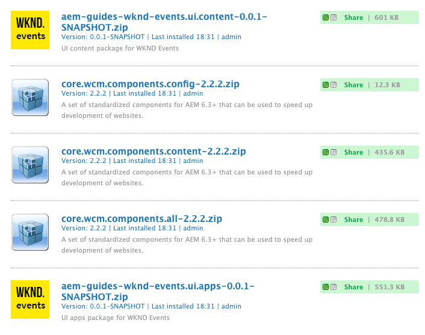
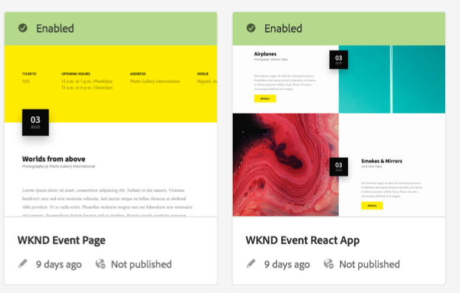
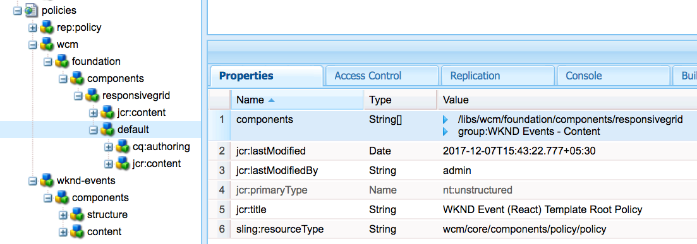
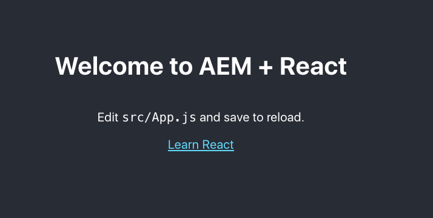
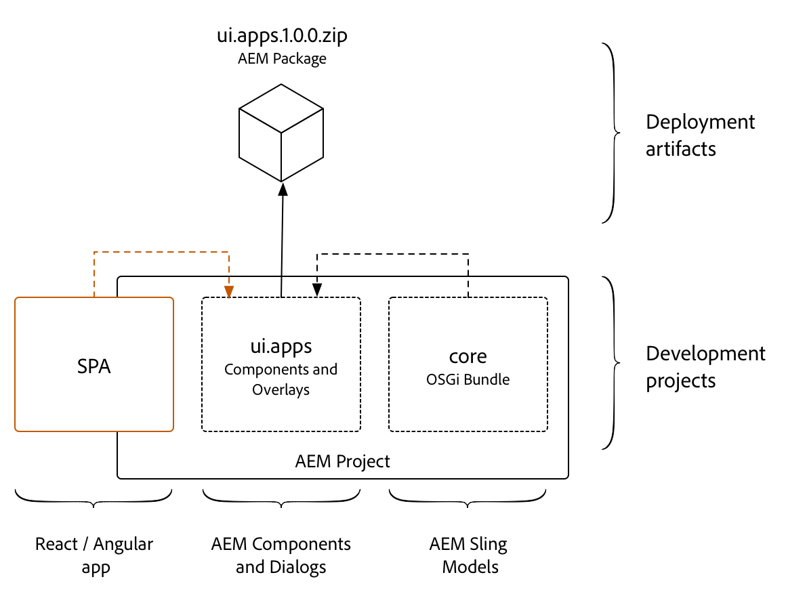
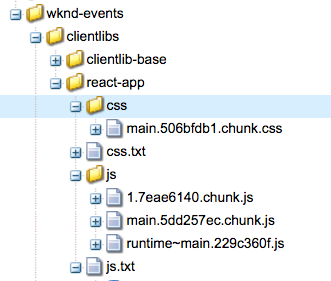
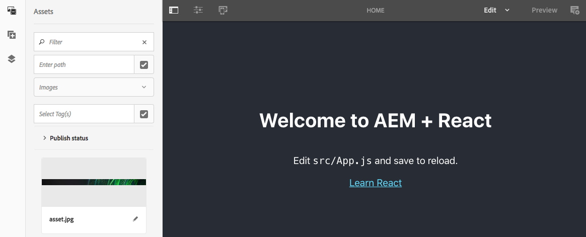

# Getting Started with React and AEM SPA Editor - Chapter 0{#getting-started-with-react-and-aem-spa-editor-chapter}

Chapter 0 details the setup of a Maven multi module AEM project with a dedicated module for Single Page Application or SPA development. The goal for this chapter is to integrate a React project, based on the Create React App, with a traditional AEM Maven build process.

## Tutorial Table of Contents {#toc}

## Prerequisites {#prerequisites}

Review the required tooling and instructions for setting up a [local development environment here.](../../../../sites/using/getting-started-spa-wknd-tutorial-develop/react.md#local-dev-env)

**New to AEM?** [Check out how to set up a local development environment](https://helpx.adobe.com/experience-manager/kt/platform-repository/using/local-aem-dev-environment-article-setup.html).

## Download Starter Project {#starter-project}

To accelerate the tutorial, we will start from a predefined project. Download the following ZIP file and unzip locally:

[Get File](assets/start-aem-wknd-events-react.zip)
You can also clone the [Git Repository](https://github.com/Adobe-Marketing-Cloud/aem-guides-wknd-events) and start the tutorial from there:

```shell
$ git clone git@github.com:Adobe-Marketing-Cloud/aem-guides-wknd-events.git
$ cd aem-guides-wknd-events
$ git checkout react/start
```

## The AEM Project {#inspect}

Persona: AEM Developer

>[!NOTE]
>
>When starting a new SPA Editor enabled project it is recommended to use the [Maven Archetype for SPA Starter Kit](https://github.com/adobe/aem-spa-project-archetype).

There are a couple options for creating a Maven Multimodule project for AEM. This tutorial leverages the [Maven AEM Project Archetype 14](https://github.com/Adobe-Marketing-Cloud/aem-project-archetype). The recommended approach for starting a new SPA Editor enabled project is to use the [Maven Archetype for SPA Starter Kit](https://github.com/adobe/aem-spa-project-archetype).

The following properties were used when generating the AEM project from [Archetype 14](https://github.com/Adobe-Marketing-Cloud/aem-project-archetype/releases/tag/aem-project-archetype-14):

| Property |Value |
|---|---|
| groupId |com.adobe.aem.guides |
| artifactId |aem-guides-wknd-events |
| version |0.0.1-SNAPSHOT |
| package |com.adobe.aem.guides.wkndevents |
| appsFolderName |wknd-events |
| artifactName |WKND Events |
| componentGroupName |WKND Events - Content |
| confFolderName |wknd-events |
| contentFolderName |wknd-events |
| cssId |wknd-events |
| packageGroup |aem-guides/wknd-events |
| siteName |WKND Events |

1. There are five areas to the project:

    * **Parent POM** - deploys maven modules and manages dependency versions
    * **core** - Java bundle containing all core functionality like OSGi services, listeners or schedulers, as well as component-related Java code such as servlets or request filters.
    * **ui.apps** - contains the /apps parts of the project, ie JS&CSS clientlibs, components, runmode specific configs as well as Hobbes-tests
    * **ui.content** - contains structural content and configurations (/content, /conf)
    * **react-app **- a webpack project for the React application. Later in the chapter the webpack project will be turned into a Maven module to be deployed to AEM as a client library.

   More details about the inner workings of the project can be found in [Getting Started with AEM Sites Part 1 - Project Setup](https://helpx.adobe.com/experience-manager/kt/sites/using/getting-started-wknd-tutorial-develop/part1.html#project-structure).

1. From the command line, within the `aem-guides-wknd-events`directory run the following:

   ```shell
   $ mvn clean install -PautoInstallPackage -Padobe-public
   ```

   The above command will deploy the project to AEM running on [http://localhost:4502](http://localhost:4502/).

   >[!NOTE]
   >
   >The inclusion of the **adobe-public **profile as part of the Maven command can be made optional. You can avoid having to include this everytime by updating your settings.xml file to include Adobe's nexus repository based on this [article](https://helpx.adobe.com/experience-manager/kb/SetUpTheAdobeMavenRepository.html).

1. Navigating to [http://localhost:4502/crx/packmgr/index.jsp](http://localhost:4502/crx/packmgr/index.jsp) you should see that 5 packages were installed. The ui.apps and ui.content package for the WKND events project and 3 packages for AEM Core Components.

   

1. The **ui.content** module includes two templates as part of the starter project. Inspect the templates by navigating to: [http://localhost:4502/libs/wcm/core/content/sites/templates.html/conf/wknd-events](http://localhost:4502/libs/wcm/core/content/sites/templates.html/conf/wknd-events)

   You should see a template for WKND Event Page and WKND Event React App:

   

   The SPA Editor is designed to work with Editable templates. This gives the implementation the full power of re-usable policies and other features. With the initial release of the SPA Editor the UI for Editable Templates **cannot** be used. This is expected to be updated in the next release of the SPA Editor.

   In order to update features of the template, developers will need to do this manually via [CRXDE-Lite](http://localhost:4502/conf/wknd-events/settings/wcm/policies.html) or in the XML in the **ui.content** project.

   For example, the allowed components on the layout container are defined here:  
   `/conf/wknd-events/settings/wcm/policies/wcm/foundation/components/responsivegrid/default`

   

## The React App {#react-app}

Persona: Front End Developer

A starter React application has been created using the [create-react-app](https://github.com/facebook/create-react-app#creating-an-app) module from Facebook.

1. Navigate to the react-app directory and run the following commands:

   ```shell
   $ cd <src-dir>/aem-guides-wknd-events/react-app
   $ npm install
   $ npm start
   ```

1. The command `npm start` should launch the React app on a local dev server running at [http://localhost:3000/](http://localhost:3000/).

   

1. Press ctrl+c to stop the server.

   ```shell
   $ npm run build
   ```

   Notice that several files are created beneath the `react-app/build` folder.

   ```
   /aem-guides-wknd-events
       /react-app
           /build
               /static
                   /css
                       main.<hash>.chunk.css
                       main.<hash>.chunk.css.map
                   /js
                       main.<hash>.chunk.js
                       main.<hash>.chunk.js.map
                       <hash>.chunk.js
   ```

   Next, we will move these files into an AEM client library and deploy as part of the **ui.apps** module.

## Integration Approach {#approach}

The SPA development will be done in the Webpack project. The compiled SPA, following a production build, is then copied into the `ui.apps` module as an AEM [client-side library](https://helpx.adobe.com/experience-manager/6-4/sites/developing/using/clientlibs.html) and deployed to AEM as part of an AEM package. The concept is similar to the integration of the `core` Java bundle, where the Java bundle is compiled into a jar file that is embedded into the ui.apps module and deployed to AEM as an AEM package.



To achieve this integration two tools will be used:

1. [aem-clientlib-generator](https://www.npmjs.com/package/aem-clientlib-generator) - used to transform compiled CSS and JS files into an AEM client library
1. [frontend-maven-plugin](https://github.com/eirslett/frontend-maven-plugin) - used to trigger NPM commands via a Maven build. This plugin will download/install Node and NPM locally for the project, ensuring consistency and making the project easy to integrate with a Continuous Integration/Continuous Deployment environment.

## Configure aem-clientlibs-generator {#aem-clientlibs-generator}

Persona: AEM Developer

1. Install the [aem-clientlibs-generator](https://www.npmjs.com/package/aem-clientlib-generator) node plugin as part of the `react-app` project.

   ```shell
   $ cd <src>/aem-guides-wknd-events/react-app
   $ npm install aem-clientlib-generator --save-dev
   ```

1. Notice that **package.json** has been updated with the dev dependencies for **aem-clientlib-generator.**

   ```
   //package.json
   {
      ...
   
       "devDependencies": {
           "aem-clientlib-generator": "^1.4.1"
       }
   }
   ```

1. Create a new file beneath the `aem-guides-wknd-events/react-app` folder named **clientlib.config.js**. Populate the file with the following:

   ```
   module.exports = {
       // default working directory (can be changed per 'cwd' in every asset option)
       context: __dirname,
   
       // path to the clientlib root folder (output)
       clientLibRoot: "./../ui.apps/src/main/content/jcr_root/apps/wknd-events/clientlibs",
   
       libs: {
           name: "react-app",
           allowProxy: true,
           categories: ["wknd-events.react"],
           serializationFormat: "xml",
           jsProcessor: ["min:gcc"],
           assets: {
               js: [
                   "build/static/**/*.js"
               ],
               css: [
                   "build/static/**/*.css"
               ]
           }
       }
   };
   ```

   This file directs the **aem-clientlib-generator **to create a client library in the **ui.apps** module beneath /apps/wknd-events/clientlibs. The client library will have a category of **wknd-events.react** and will include any files with an extension of .js and .css beneath the react-app/build/static folder.

1. Add the clientlib directive as part of the npm run build script by updating `react-app/package.json` file with the following line:

   ```
   //package.json
   
   ...
   
    "scripts": {
      "build": "react-scripts build && clientlib --verbose",
       ...
   }
   
   ...
   ```

1. Test out the changes by running the following command:

   ```shell
   $ cd <src>/aem-guides-wknd-events/react-app
   $ npm run build
   
   > react-scripts build && clientlib --verbose
   
   Creating an optimized production build...
   Compiled successfully.
   
   File sizes after gzip:
   
   37.34 KB  build/static/js/main.d1cb61c2.js
   299 B     build/static/css/main.c17080f1.css
   
   The project was built assuming it is hosted at the server root.
   You can control this with the homepage field in your package.json.
   For example, add this to build it for GitHub Pages:
   
   "homepage" : "http://myname.github.io/myapp",
   
   The build folder is ready to be deployed.
   You may serve it with a static server:
   
   npm install -g serve
   serve -s build
   
   Find out more about deployment here:
   
   http://bit.ly/2vY88Kr

   start aem-clientlib-generator
   working directory: ../src/aem-guides-wknd-events/react-app
   
   processing clientlib: react-app
   Write node configuration using serialization format: xml
   write clientlib json file: ../ui.apps/src/main/content/jcr_root/apps/wknd-events/clientlibs/react-app/.content.xml
   
   write clientlib asset txt file (type: js): ../ui.apps/src/main/content/jcr_root/apps/wknd-events/clientlibs/react-app/js.txt
   copy: build/static/js/1.7eae6140.chunk.js ../ui.apps/src/main/content/jcr_root/apps/wknd-events/clientlibs/react-app/js/1.7eae6140.chunk.js
   copy: build/static/js/main.5dd257ec.chunk.js ../ui.apps/src/main/content/jcr_root/apps/wknd-events/clientlibs/react-app/js/main.5dd257ec.chunk.js
   copy: build/static/js/runtime~main.229c360f.js ../ui.apps/src/main/content/jcr_root/apps/wknd-events/clientlibs/react-app/js/runtime~main.229c360f.js
   
   write clientlib asset txt file (type: css): ../ui.apps/src/main/content/jcr_root/apps/wknd-events/clientlibs/react-app/css.txt
   copy: build/static/css/main.506bfdb1.chunk.css ../ui.apps/src/main/content/jcr_root/apps/wknd-events/clientlibs/react-app/css/main.506bfdb1.chunk.css
   ```

1. Beneath `/ui.apps/src/main/content/jcr_root/apps/wknd-events/clientlibs/` should be a new folder named `react-app`and should contain both the **css** and **js** files generated from the react app.
1. **(Optional)** Ignore the **react-app **AEM client library in ui.apps from source control.

   The client library react-app in ui.apps should always be generated by the aem-clientlib-generator at build time. It is important ignore this client library from source control. For example, if using Git, a file named **.gitignore** would be created beneath the ui.apps folder:

   ```
   # ui.apps/.gitignore
   # Ignore React generated client libraries from source control
   react-app
   ```

## Configure frontend-maven-plugin {#frontend-maven-plugin}

Persona: AEM Developer

Next, configure the `react-app` project to also be a **Maven** module. This way it can be triggered by the parent reactor POM and the entire AEM project can be built with a single command. As mentioned earlier the [frontend-maven-plugin](https://github.com/eirslett/frontend-maven-plugin) will be used to install and trigger an npm build within the react-app project.

1. Open up the parent reactor POM, `<src>/aem-guides-wknd-events/pom.xml`, and add the `react-app` as a module to build. The order in which the modules are built matters:

   ```xml
   ...
   <modules>
       <module>core</module>
       <!-- add React App -->
       <module>react-app</module>
       <module>ui.apps</module>
       <module>ui.content</module>
   </modules>
   ...
   ```

1. Within the parent reactor POM, `<src>/aem-guides-wknd-events/pom.xml`, and add the following properties for the **frontend-maven-plugin**, **node** and **npm** versions.

   >[!NOTE]
   >
   >Use the same version of **node** and **npm** that you have installed locally.

   ```xml
   ...
    <properties>
       <aem.host>localhost</aem.host>
       <aem.port>4502</aem.port>
       <aem.publish.host>localhost</aem.publish.host>
       <aem.publish.port>4503</aem.publish.port>
       <sling.user>admin</sling.user>
       <sling.password>admin</sling.password>
       <vault.user>admin</vault.user>
       <vault.password>admin</vault.password>
   
       <!-- Update: Used by frontend-maven-plugin -->
       <frontend-maven-plugin.version>1.6</frontend-maven-plugin.version>
       <node.version>v10.8.0</node.version>
       <npm.version>6.2.0</npm.version>
       <!-- end update -->
   
       <project.build.sourceEncoding>UTF-8</project.build.sourceEncoding>
       <project.reporting.outputEncoding>UTF-8</project.reporting.outputEncoding>
   </properties>
   ...
   ```

   These properties will be used by the frontend-maven-plugin to determine the local version of node and npm to install. As a best practice version properties should be managed at the parent pom level.

1. Create a new file named **pom.xml** beneath `<src>/aem-guides-wknd-events/react-app`folder. Populate the **pom.xml **with the following:

   ```xml
   <?xml version="1.0" encoding="UTF-8"?>
   <project xmlns="http://maven.apache.org/POM/4.0.0" xmlns:xsi="http://www.w3.org/2001/XMLSchema-instance" xsi:schemaLocation="http://maven.apache.org/POM/4.0.0 http://maven.apache.org/maven-v4_0_0.xsd">
       <modelVersion>4.0.0</modelVersion>
   
       <!-- ====================================================================== -->
       <!-- P A R E N T  P R O J E C T  D E S C R I P T I O N                      -->
       <!-- ====================================================================== -->
       <parent>
           <groupId>com.adobe.aem.guides</groupId>
           <artifactId>aem-guides-wknd-events</artifactId>
           <version>0.0.1-SNAPSHOT</version>
           <relativePath>../pom.xml</relativePath>
       </parent>
   
       <!-- ====================================================================== -->
       <!-- P R O J E C T  D E S C R I P T I O N                                   -->
       <!-- ====================================================================== -->
       <artifactId>aem-guides-wknd-events.react</artifactId>
       <packaging>pom</packaging>
       <name>WKND Events - React App</name>
       <description>UI React application code for WKND Events</description>

       <!-- ====================================================================== -->
       <!-- B U I L D   D E F I N I T I O N                                        -->
       <!-- ====================================================================== -->
       <build>
       <plugins>
       <plugin>
           <groupId>com.github.eirslett</groupId>
           <artifactId>frontend-maven-plugin</artifactId>
           <version>${frontend-maven-plugin.version}</version>
   
           <executions>
   
           <execution>
               <id>install node and npm</id>
               <goals>
               <goal>install-node-and-npm</goal>
               </goals>
               <configuration>
               <nodeVersion>${node.version}</nodeVersion>
               <npmVersion>${npm.version}</npmVersion>
           </configuration>
           </execution>
   
           <execution>
               <id>npm install</id>
               <goals>
               <goal>npm</goal>
               </goals>
               <!-- Optional configuration which provides for running any npm command -->
               <configuration>
               <arguments>install</arguments>
               </configuration>
           </execution>
   
           <execution>
               <id>npm run build</id>
               <goals>
               <goal>npm</goal>
               </goals>
               <configuration>
               <arguments>run build</arguments>
               </configuration>
           </execution>
   
           </executions>
       </plugin>
       </plugins>
   </build>
   </project>
   ```

1. Within the `react-app` folder run the following **Maven** command to trigger a build:

   ```shell
   $ cd <src>/aem-guides-wknd-events/react-app
   $ mvn clean install
   ```

   You should see that the **frontend-maven-plugin** downloads and installs a local version of node and npm. The command npm run build is then executed which will build the React app and then copy the compiled JS and CSS files into the ui.apps project.

   Check the timestamps of `/ui.apps/src/main/content/jcr_root/apps/wknd-events/clientlibs/react-app/css/main.<hash>.css` and `/ui.apps/src/main/content/jcr_root/apps/wknd-events/clientlibs/react-app/js/main.<hash>.js`to confirm that these files were just built.

1. Navigate to the Parent Reactor POM and run the following command to build the entire project and deploy it to AEM:

   ```shell
   $ cd <src>/aem-guides-wknd-events
   $ mvn -PautoInstallPackage -Padobe-public clean install
   
   ...
   Package imported.
   Package installed in 53ms.
   [INFO] ------------------------------------------------------------------------
   [INFO] Reactor Summary:
   [INFO]
   [INFO] aem-guides-wknd-events ............................. SUCCESS [  0.291 s]
   [INFO] WKND Events - Core ................................. SUCCESS [  2.176 s]
   [INFO] WKND Events - React App ............................ SUCCESS [ 21.766 s]
   [INFO] WKND Events - UI apps .............................. SUCCESS [  3.548 s]
   [INFO] WKND Events - UI content ........................... SUCCESS [  0.302 s]
   [INFO] ------------------------------------------------------------------------
   [INFO] BUILD SUCCESS
   [INFO] ------------------------------------------------------------------------
   [INFO] Total time: 29.073 s
   [INFO] Finished at: 2018-10-10T10:35:19-04:00
   [INFO] Final Memory: 49M/617M
   [INFO] ------------------------------------------------------------------------
   ...
   ```

1. Navigate to [CRXDE-Lite](http://localhost:4502/crx/de/index.jsp#/apps/wknd-events/clientlibs/react-app) to verify that the React App and the rest of the AEM project has been deployed beneath `/apps/wknd-events/clientlibs/react-app`.

   

## Integrate the React app on the Page {#integrate-react-app}

Persona: AEM Developer

Next we will integrate the React app on to the page via the client library.

Open up the `aem-guides-wknd-events/ui.apps` project to edit.

1. Beneath `/apps/wknd-events/components/structure/page` open the file **customheaderlibs.html**.

   This HTL template will get loaded in the HTML &lt;head&gt; section.

   Replace the contents of the file with the following:

   ```xml
   <!--/*
   Custom Headerlibs for React Site
   */-->
   <meta name="viewport" content="width=device-width, initial-scale=1, shrink-to-fit=no">
   <meta property="cq:datatype" data-sly-test="${wcmmode.edit || wcmmode.preview}" content="JSON"/>
   <meta property="cq:wcmmode" data-sly-test="${wcmmode.edit}" content="edit"/>
   <meta property="cq:wcmmode" data-sly-test="${wcmmode.preview}" content="preview"/>
   <meta property="cq:pagemodel_root_url" 
       data-sly-use.page="com.adobe.aem.guides.wkndevents.core.models.HierarchyPage" 
       content="${page.rootUrl}"/>
   <sly data-sly-use.clientlib="/libs/granite/sightly/templates/clientlib.html">
   <sly data-sly-call="${clientlib.css @ categories='wknd-events.react'}"/>
   ```

   This will load the CSS for the **wknd-events.react** client library at the top of the page. This will also set a meta property for **cq:pagemodel_root_url**. This will be used by the AEM SPA Editor SDK to identify the root page JSON to load.

1. Beneath `/apps/wknd-events/components/structure/page` open the file **customfooterlibs.html.**

   This HTL template will get loaded at the bottom of the page right before the closing &lt;/body&gt; tag.

   Replace the contents of the file with the following:

   ```xml
   <!--/*
   Custom footer React libs
   */-->
   <sly data-sly-use.clientLib="${'/libs/granite/sightly/templates/clientlib.html'}"></sly>
   <sly data-sly-test="${wcmmode.edit || wcmmode.preview}"
       data-sly-call="${clientLib.js @ categories='cq.authoring.pagemodel.messaging'}"></sly>
   <sly data-sly-call="${clientLib.js @ categories='wknd-events.react'}"></sly>
   
   ```

   This will load the JS for the `wknd-events.react`client library at the bottom of the page. The code above also incluces the `cq.authoring.pagemodel.messaging` when the page is being edited in the AEM environment. This client library allows for the SPA editing capabilities using the AEM Sites Editor.

1. Create a new file named **body.html** beneath `/apps/wknd-events/components/structure/page`

   Populate **body.html** with the following:

   ```xml
   <!--/*
   - body.html
   - includes div that will be targeted by SPA
   */-->
   <div id="root"></div>
   ```

   This will insert the DOM element that the React application is targeting. You can see in the code `/aem-guides-wknd-events/react-app/src/index.js`:

1. Deploy the changes to AEM

   Deploy the changes by running the following maven command from the project root:

   ```shell
   $ cd aem-guides-wknd-events
   $ mvn -PautoInstallPackage -Padobe-public clean install
   ```

1. Navigate to [http://localhost:4502/editor.html/content/wknd-events/react/home.html](http://localhost:4502/editor.html/content/wknd-events/react/home.html)

   You should now see the React application being rendered on the AEM page.

   

## Next Steps {#next-steps}

Next part in the tutorial:

* [Chapter 1 - Editable Components](../../../../sites/using/getting-started-spa-wknd-tutorial-develop/react/chapter-1.md)

View the solution for [GitHub](https://github.com/Adobe-Marketing-Cloud/aem-guides-wknd-events).

Download the finished package for this part of the tutorial:

## Help! {#help}

