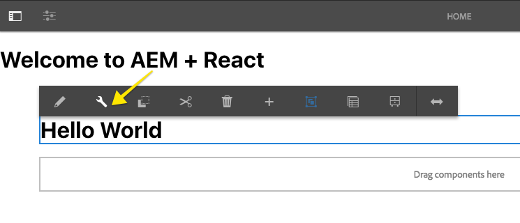
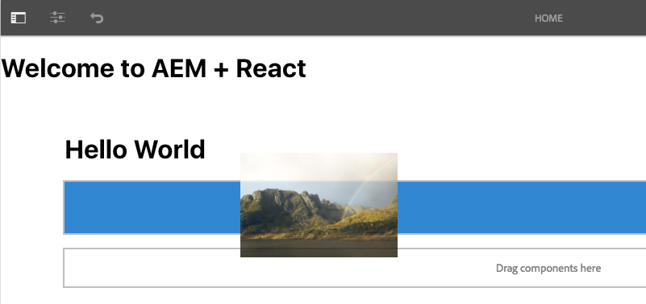
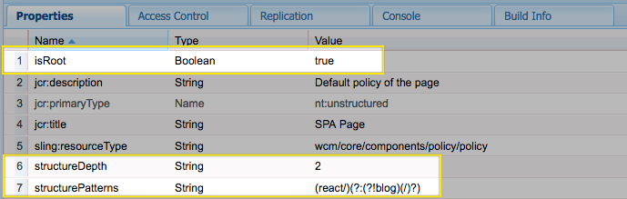

# Getting Started with React and AEM SPA Editor - Chapter 1{#getting-started-with-react-and-aem-spa-editor-chapter}

Chapter 1 covers the installation of the AEM SPA Editor JS SDK and the implementation of two React components that map to AEM Text and Image components. The JSON model that drives the integration between AEM and React is inspected.

## Tutorial Table of Contents {#table-of-contents}

## Prerequisites {#prerequisites}

*New to AEM?* [Check out how to set up a local development environment](https://helpx.adobe.com/experience-manager/kt/platform-repository/using/local-aem-dev-environment-article-setup.html) before continuing.

This is Chapter 1 of the multi-part tutorial. This assumes the completion of [Chapter 0](chapter-0-project-setup.md) and installation of tools needed for a [local development environment.](react.md#local-dev-env)

The solution for [Chapter 0 can be found on GitHub](https://github.com/Adobe-Marketing-Cloud/aem-guides-wknd-events) or you can download the packages below:

## Install AEM SPA Editor JS SDK {#install-spa-editor}

Persona: Front End Developer

**What is the AEM SPA Editor JS SDK?**

In short, the SPA Editor JS SDK is a collection of open source JavaScript libraries that provide a framework for allowing authors to edit the contents of a Single Page Application deployed in AEM. AEM delivers the content in the form of JSON and the SPA Editor JS SDK maps the JSON to React components. Please read [SPA Editor Overview](https://helpx.adobe.com/experience-manager/6-4/sites/developing/using/spa-overview.html) for a more comprehensive view into how the SPA Editor works.

The AEM SPA Editor JS SDK is made available via three NPM modules:

* [@adobe/cq-spa-component-mapping](https://www.npmjs.com/package/@adobe/cq-spa-component-mapping) - provides helpers to map AEM Components to SPA components. This module is not tied to a specific SPA framework.
* [@adobe/cq-spa-page-model-manager](https://www.npmjs.com/package/@adobe/cq-spa-page-model-manager) - provides the API to manage the model representation of the AEM Pages that are used to compose a SPA. This module is not tied to a specific SPA framework.
* [@adobe/cq-react-editable-components](https://www.npmjs.com/package/@adobe/cq-react-editable-components) - provides generic React helpers and components to support AEM authoring. This module also wraps the cq-spa-page-model-manager and cq-spa-component-mapping to make these available to the React framework.

Next, install the AEM SPA Editor JS SDK as part of the `react-app` project using `npm`.

1. Open a new terminal window and navigate into the `react-app` directory:

   ```shell
   $ cd <src>/aem-guides-wknd-events/react-app
   ```

1. Install the following NPM modules provided by Adobe:

   ```shell
   $ npm install @adobe/cq-spa-component-mapping
   $ npm install @adobe/cq-spa-page-model-manager
   $ npm install @adobe/cq-react-editable-components
   ```

1. Install peer dependencies:

   ```shell
   $ npm install react-fast-compare
   $ npm install ajv --save-dev
   $ npm install clone --save-dev
   ```

1. `react-app/package.json` should now look something like this:

   ```
   //package.json
   
   {
       "name": "react-app",
       "version": "0.1.0",
       "private": true,
       "dependencies": {
           "@adobe/cq-react-editable-components": "^1.0.3",
           "@adobe/cq-spa-component-mapping": "^1.0.3",
           "@adobe/cq-spa-page-model-manager": "^1.0.1",
           "react": "^16.5.2",
           "react-dom": "^16.5.2",
           "react-fast-compare": "^2.0.2",
           "react-scripts": "2.0.4"
       },
       ...
   
       "devDependencies": {
           "aem-clientlib-generator": "^1.4.1",
           "ajv": "^6.5.4",
           "clone": "^2.1.2"
       }
   }
   ```

## Integrate AEM SPA Editor JS SDK {#integrate-spa-editor}

Persona: Front End Developer

Next we will integrate the React application with the AEM SPA editor JS SDK. Once this is complete the React app will be driven by a JSON model that originates in AEM.

Using the editor of your choice open `react-app` under `aem-guides-wknd-events/react-app`.

1. Start by initializing the App with the JSON Model from AEM.

   Update the file `index.js`beneath `react-app/src` with the following:

   ```
   // src/index.js
   
   import React from 'react';
   import ReactDOM from 'react-dom';
   import { ModelManager, Constants } from '@adobe/cq-spa-page-model-manager';
   import App from './App';
   import './index.css';
   
   function render(model) {
       ReactDOM.render((
           <App cqChildren={ model[Constants.CHILDREN_PROP] } cqItems={ model[Constants.ITEMS_PROP] } cqItemsOrder={ model[Constants.ITEMS_ORDER_PROP] }
               cqPath={ ModelManager.rootPath } locationPathname={ window.location.pathname }/>), document.getElementById('root'));
   }
   
   ModelManager.initialize({ path: process.env.REACT_APP_PAGE_MODEL_PATH }).then(render);
   ```

1. Update the file `App.js` beneath `react-app/src` with the following:

   ```
   // src/App.js
   
   import React from 'react';
   import { Page, withModel, EditorContext, Utils } from '@adobe/cq-react-editable-components';
   
   // This component is the application entry point
   class App extends Page {
   
       render() {
           return (
               <div className="App">
                   <header className="App-header">
                       <h1>Welcome to AEM + React</h1>
                   </header>
                   <EditorContext.Provider value={ Utils.isInEditor() }>
                       { this.childComponents }
                       { this.childPages }
                   </EditorContext.Provider>
               </div>
           );
       }
   }
   
   export default withModel(App);
   ```

   App.js continues to be the entry point of the application but it now extends the Page class from `@adobe/cq-react-editable-components`. In the render() function `this.childComponents`and `this.childPages` will include React components that are driven by the JSON model.

   The `EditorContext` wrapper is responsible for facilitating the communication model between the AEM editor and the React application. This includes indicators (blue boxes) for which parts of the application are editable and automatically refreshes the React component when it is updated by an author in AEM. The `EditorContext` is only active in the AEM authoring environment, based on the value of `Utils.isInEditor()`. 

1. Beneath `react-app/src` create a folder structure for `/components/page`. Beneath the `page` folder add two files: `Page.js`and `Page.css`

   ```
   /react-app
       /src
           /components
               /page
                   Page.js
                   Page.css
   ```

   All of the React components we will create will be stored in a dedicated folder beneath `/components.`

1. Populate **Page.js** with the following:

   ```
   /*
   Page.js
   
   - WKND specific implementation of Page
   - Maps to wknd-events/components/structure/page
   */
   
   import {Page, MapTo, withComponentMappingContext } from "@adobe/cq-react-editable-components";
   require('./Page.css');
   // This component is a variant of a React Page component mapped to the "structure/page" resource type
   // No functionality is changed other than to add an app specific CSS class
   class WkndPage extends Page {
   
       get containerProps() {
           let attrs = super.containerProps;
           attrs.className = (attrs.className || '') + ' WkndPage ' + (this.props.cssClassNames || '');
           return attrs
       }
   }
   
   MapTo('wknd-events/components/structure/page')(withComponentMappingContext(WkndPage));
   ```

   This is the first time we are using the `MapTo` function which serves to map an AEM component to a React component. In this case we are mapping the resource type `wknd-events/components/structure/page` from AEM to a React component `WKNDPage`.

1. Populate **Page.css** with the following:

   ```css
   /* Center and max-width the content */
   .WkndPage {
       max-width: 1200px;
       margin: 0 auto;
       padding: 12px;
       padding: 0;
       float: unset !important; 
   }
   ```

1. Create a file named **MappedComponents.js** beneath `/react-app/src/components`. Populate MappedComponents.js with the following:

   ```
   /*
   Dedicated file to include all React components that map to an AEM component
   */
   
   require('./page/Page');
   ```

1. Update **index.js** beneath `/react-app/src` to include the **MappedComponents.js**:

   ```
   // src/index.js
       ...
       import App from './App';
       //include Mapped Components
   +  import "./components/MappedComponents";
   
       ...
   ```

1. From the root of the project `aem-guides-wknd-events` run the Maven command to build and deploy the updates to AEM:

   ```shell
   $ cd <src>/aem-guides-wknd-events
   $ mvn -PautoInstallPackage -Padobe-public clean install
   ```

1. Navigate to [https://localhost:4502/content/wknd-events/react/home.html](https://localhost:4502/content/wknd-events/react/home.html). You should see the &lt;h1&gt;** Welcome to AEM + React **&lt;/h1&gt;.

   Using the browser's developer tools inspect the HTML rendered by the React app. You should see some empty divs that are generated by the React App. One of the divs should include the `WkndPage` css class created in step 4.

     

   [link](https://github.com/godanny86/aem-guides-wknd-events/blob/tutorial/chapter-1/chapter-1.md#text-component)

## Text Component {#text-component}

Persona: Front End Developer

Next we will map the AEM [Text](https://github.com/Adobe-Marketing-Cloud/aem-core-wcm-components/tree/master/content/src/content/jcr_root/apps/core/wcm/components/text/v2/text) component to a React component that will allow users to author rich text as part of the app.

Using the editor of your choice open `react-app` under `aem-guides-wknd-events/react-app`.

1. Beneath `react-app/src/components`create a subfolder named `text`. Beneath the text folder create another file `Text.js`

   ```
   /react-app
       /src
           /components
               /text
                   Text.js
   ```

1. Populate **Text.js** with the following:

   ```
   /*
   Text.js
   
   Maps to wknd-events/components/content/text
   */
   
   import React, {Component} from 'react';
   import {MapTo} from '@adobe/cq-react-editable-components';
   /**
   * Default Edit configuration for the Text component that interact with the Core Text component and sub-types
   *
   * @type EditConfig
   */
   const TextEditConfig = {
   
       emptyLabel: 'Text',
   
       isEmpty: function(props) {
           return !props || !props.text || props.text.trim().length < 1;
       }
   };
   
   /**
   * Text React component
   */
   class Text extends Component {
   
       get richTextContent() {
           return <div dangerouslySetInnerHTML={{__html:  this.props.text}}/>;
       }
   
       get textContent() {
           return <div>{this.props.text}</div>;
       }
   
       render() {
           return this.props.richText ? this.richTextContent : this.textContent;
       }
   }
   
   MapTo('wknd-events/components/content/text')(Text, TextEditConfig);
   ```

1. Update `react-app/src/components/MappedComponents.js` to require `Text.js`.

   ```
   // src/components/MappedComponents.js
   
   require('./page/Page');
   require('./text/Text');
   ```

1. From the root of the project `aem-guides-wknd-events` run the following command to build and deploy the updates to AEM:

   ```
   $ cd <src>/aem-guides-wknd-events
   $ mvn -PautoInstallPackage -Padobe-public clean install
   ```

1. Navigate to [https://localhost:4502/editor.html/content/wknd-events/react/home.html](https://localhost:4502/editor.html/content/wknd-events/react/home.html). You should see an empty Text Component with a placeholder. You should be able to edit the component and add a new message. You can also add new Text components to the page.

   

1. View [https://localhost:4502/content/wknd-events/react/home.model.json](https://localhost:4502/content/wknd-events/react/home.model.json) in another tab in the browser. Search for `wknd-events/components/content/text` to find the JSON exported by the AEM Text component.

   ```
   //partial contents of /content/wknd-events/react/home.model.json
   ...
   
   "text": {
       "text": "<h1>Hello World</h1>\r\n",
       "richText": true,
       ":type": "wknd-events/components/content/text"
   }
   
   ...
   ```

   The **MapTo** functionality provided by **@adobe/cq-react-editable-components** maps the Text JSON to the React Text component based on the **:type **value. The **MapTo** also makes available the values of text and richText as React props to the Text component.

   ```
   this.props.text === "<h1>Hello World</h1>\r\n"
   this.props.richText === true
   ```

## Image Component {#image-component}

Persona: Front End Developer

Next we will map the AEM [Image](https://github.com/Adobe-Marketing-Cloud/aem-core-wcm-components/tree/master/content/src/content/jcr_root/apps/core/wcm/components/image/v2/image) component to a React component that will allow users to include an Image in the app.

Using the editor of your choice open `react-app` under `aem-guides-wknd-events/react-app`.

1. Beneath `react-app/src/components` create a subfolder named `image`. Beneath the `image` folder create a file named `Image.js`:

   ```shell
   /react-app
       /src
           /components
               /image
                   Image.js
   ```

1. Populate** Image.js** with the following:

   ```
   import React, {Component} from 'react';
   import {MapTo} from '@adobe/cq-react-editable-components';
   
   /**
   * Default Edit configuration for the Image component that interact with the Core Image component and sub-types
   *
   * @type EditConfig
   */
   const ImageEditConfig = {
   
       emptyLabel: 'Image',
   
       isEmpty: function(props) {
           return !props || !props.src || props.src.trim().length < 1;
       }
   };
   
   /**
   * Image React Component
   * 
   */
   class Image extends Component {
   
       get content() {
           return 
       }
   
       render() {
           return (<div className="Image">
                   {this.content}
               </div>);
       }
   }
   
   MapTo('wknd-events/components/content/image')(Image, ImageEditConfig);
   ```

1. Update `src/components/MappedComponents.js` to require `Image.js.`

   ```
   // src/components/MappedComponents.js
   
   require('./page/Page');
   require('./text/Text');
   require('./image/Image');
   ```

1. From the root of the project `aem-guides-wknd-events` run the following command to build and deploy the updates to AEM:

   ```
   $ cd <src>/aem-guides-wknd-events
   $ mvn -PautoInstallPackage -Padobe-public clean install
   ```

1. Navigate to [https://localhost:4502/editor.html/content/wknd-events/react/home.html](https://localhost:4502/editor.html/content/wknd-events/react/home.html). You should see an empty Image Component with a placeholder. You should be able to edit the component and add a new Image. You can also drag + drop an image on to the app.

   

1. View [https://localhost:4502/content/wknd-events/react/home.model.json](https://localhost:4502/content/wknd-events/react/home.model.json) in another tab in the browser. Search for `wknd-events/components/content/image` to find the JSON exported by the AEM Image component.

   ```
   // partial contents /content/wknd-events/react/home.model.json
   ...
   
   "image": {
       "alt": "Alternative Text here",
       "title": "This is a caption",
       "src": "/content/wknd-events/react/home/_jcr_content/root/responsivegrid/image.coreimg.jpeg/1539196394835.jpeg",
       "srcUriTemplate": "/content/wknd-events/react/home/_jcr_content/root/responsivegrid/image.coreimg{.width}.jpeg/1539196394835.jpeg",
       "lazyEnabled": false,
       "widths": [],
       ":type": "wknd-events/components/content/image"
   }
   ...
   ```

   Just like with the Text component the MapTo functionality exposes the JSON values of alt, title, src that can then be used by the React Image component.

   Don't worry about the styles for now, in the next chapter we will start adding CSS and look at the front-end developer cycle.

## Next Steps {#next-steps}

Next part in the tutorial:

* [Chapter 2 - Front End Development](../../../../sites/using/getting-started-spa-wknd-tutorial-develop/react/chapter-2.md)

View the solution for [Chapter 1 on GitHub](https://github.com/Adobe-Marketing-Cloud/aem-guides-wknd-events/tree/chapter-1/editable-components).

Download the finished package for this part of the tutorial:

## (Bonus) HierarchyPage Sling Model {#hierarchypage-sling-model}

Persona: Backend Developer

The AEM SPA JS SDK is designed to parse a JSON schema into a JavaScript Model. A Sling Model, **HierarchyPage.java **has been included in the starter project that will expose content within AEM as JSON that matches the expected schema. A key feature of the exported JSON by the HierarchyPageImpl is the ability to expose the content of multiple AEM pages in a single request. This allows the SPA to be initialized with most of the content of the app and can remove the need for subsequent requests as a user navigates the app.

In the editor of your choice open the `<src>/aem-guides-wknd-events/core`module.

1. Open `core/src/main/java/com/adobe/aem/guides/wkndevents/core/models/HierarchyPage.java`

   ```java
   package com.adobe.aem.guides.wkndevents.core.models;
   
   import com.adobe.cq.export.json.ContainerExporter;
   import com.adobe.cq.export.json.hierarchy.HierarchyNodeExporter;
   import com.fasterxml.jackson.annotation.JsonIgnore;
   import com.fasterxml.jackson.annotation.JsonProperty;
   
   public interface HierarchyPage extends HierarchyNodeExporter, ContainerExporter {
   
       ...
   }
   
   ```

   The interface HierarchyPage extends two interfaces:

    * **ContainerExporter** - Defines the JSON of a container component like a page, responsive grid, or parsys
    * **HierarchyNodeExporter** - Defines the JSON of a hierarchical node, like a root page and it's child pages

1. Open `core/src/main/java/com/adobe/aem/guides/wkndevents/core/models/impl/HierarchyPageImpl.java`

   This is the implemenation of the **HierarchyPage** interface.

   >[!NOTE]
   >
   >Currently the **HierarchyPageImpl** is copied into the project. In the near future a default HieararchyPageImpl will be made available via **Core Components**. Developers will continue to have the option to extend but will no longer be responsible for maintaining the implementation. Make sure to check back for updates.

   ```java
   @Model(adaptables = SlingHttpServletRequest.class, adapters = {HierarchyPage.class, ContainerExporter.class}, resourceType = HierarchyPageImpl.RESOURCE_TYPE)
   @Exporter(name = ExporterConstants.SLING_MODEL_EXPORTER_NAME, extensions = ExporterConstants.SLING_MODEL_EXTENSION)
   public class HierarchyPageImpl implements HierarchyPage {
   
   /**
    * Resource type of associated with the current implementation
    */
   protected static final String RESOURCE_TYPE = "wknd-events/components/structure/page";
   ```

   The **HierarchyPageImpl** is registered as Sling Model Exporter for the **wknd-events/components/structure/pageresource** type. If implementing a custom project you would update the RESOURCE_TYPE to point to your project's base page component.

   The methods getRoodModel() and getRootPage() are used to find and return what is considered to be the "root" of the application. There are three properties stored on an App template's policy used to drive the collection of content:

    1. **PR_IS_ROOT** = "isRoot" - Helps identify the rootPage of the application. The rootPage is used as the starter point to collect all the child pages of the app.
    1. **STRUCTURE_DEPTH_PN** = "structureDepth" - identifies how deep in the hierarchy to collect child pages.
    1. **STRUCTURE_PATTERNS_PN** = "structurePatterns" - a regular expression that can be used to ignore or exclude certain pages from automatically being collected.

1. Open up [CRXDE-Lite](https://localhost:4502/crx/de/index.jsp#/conf/wknd-events/settings/wcm/policies/wknd-events/components/structure/app/default)

   Navigate to `/conf/wknd-events/settings/wcm/policies/wknd-events/components/structure/app/default`. This is the policy for the wknd-events-app-template template. Notice the properties for `isRoot`, `structureDepth`, `structurePatterns`.

   

   >[!CAUTION]
   >
   >At the time of writing this tutorial the SPA Editor does not support Editable Templates in the UI. Full support for Editable Templates is expected in the near future. Until then, updates to the templates will need to be done via CRXDE-Lite or by modifying the XML in the **ui.content** module.

1. Open the React Root Page at [https://localhost:4502/content/wknd-events/react.html](https://localhost:4502/content/wknd-events/react.html)

   The page may render blank for now. This page is built using the **wknd-events-app-template**.

1. Change the extension to model.json: [https://localhost:4502/content/wknd-events/react.model.json](https://localhost:4502/content/wknd-events/react.model.json)

   Notice that content of the current page is exposed and the content of child page: `/content/wknd-events/react/home`.

   ```
   // /content/wknd-events/react.model.json 
   
   {
   ":type": "wknd-events/components/structure/app",
   ":items": {},
   ":itemsOrder": [],
   ":children": {
   "/content/wknd-events/react/home": {
       ":type": "wknd-events/components/structure/page",
       ":items": { ... },
       ":itemsOrder": [
       "root"
       ],
       ":path": "/content/wknd-events/react/home",
       ":hierarchyType": "page",
       "title": "Home"
       }
   },
   ":path": "/content/wknd-events/react",
   ":hierarchyType": "page",
   "title": "React App"
   }
   ```

## Help! {#help}

