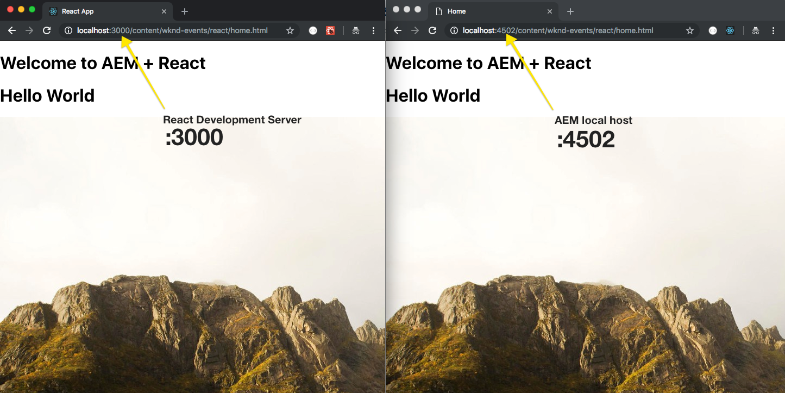

# Getting Started with React and AEM SPA Editor - Chapter 2{#getting-started-with-react-and-aem-spa-editor-chapter}

Chapter 2 focuses on Front End Development outside of AEM. Developers will be able to modify JS and CSS files and see the changes immediately reflected in the browser, without the need for a full development build. Popular front end tools like Webpack development server, SASS, and Styleguidist are integrated into the project.

## Tutorial Table of Contents {#table-of-contents}

## Prerequisites {#prerequisites}

**New to AEM?** [Check out how to set up a local development environment](https://helpx.adobe.com/experience-manager/kt/platform-repository/using/local-aem-dev-environment-article-setup.html) before continuing.

This is Chapter 2 of a multi-part tutorial. This assumes the completion of [Chapter 1](/help/getting-started-spa-wknd-tutorial-develop/react/chapter-1.md) and the installation of tools needed for a [local development environment.](/help/getting-started-spa-wknd-tutorial-develop/react.md#local-dev-env) View the [Chapter 1 code on GitHub](https://github.com/Adobe-Marketing-Cloud/aem-guides-wknd-events).

Download the solution files from the previous chapter:

This chapter focuses on Front End development outside of AEM. In the previous chapter every time a change was made to the React app we had to endure a lengthy build and deploy process to AEM. In this chapter we will look at two different ways of developing the React app against the development server that comes packaged with the React app. Developers will be able to modify JS and CSS files and see the changes immediately reflected in the browser without having to do a full project build, resulting in rapid development. We will also install several popular front end tools to accelerate the development process.

## Install Sass Support {#sass}

Persona: Front End Developer

A React best practice is to keep each component modular and self contained. A general recomendation is to avoid re-using the same CSS class name across components, which make the use of preprocessors not as powerful. This project will use [Sass](https://sass-lang.com/) for a few useful features like variables and mixins. This project will also loosely follow [SUIT CSS naming conventions](https://github.com/suitcss/suit/blob/master/doc/components.md). SUIT is a variation of BEM notation, Block Element Modifier, used to create consistent CSS rules.

Open a new terminal window.

1. Navigate to the `<src>/aem-guides-wknd-events/react-app` directory and install [node-sass](https://github.com/sass/node-sass):

   ```shell
   $ cd <src>/aem-guides-wknd-events/react-app
   $ npm install node-sass --save
   ```

   We can now use .scss files and the power of Sass in the project. More information can be found here for [adding a Sass stylesheet with a React project](https://github.com/facebook/create-react-app/blob/master/packages/react-scripts/template/README.md#adding-a-sass-stylesheet).

1. Open up `<src>/aem-guides-wknd-events/react-app` in the editor of your choice.

   Add a folder beneath r `eact-app/src` named `styles`. Add two files beneath styles named `_shared.scss` and `_variables.scss`

   ```
     /aem-guides-wknd-events
       /react-app
         /src
           /components
   +       /styles
   +          _shared.scss
   +          _variables.scss
   ```

   These files will include some global variables and mixins we want to re-use across the project.

1. Populate `_variables.scss` with the following:

   ```css
   //variables for WKND Events
   
   //Typography
   $em-base:             20px;
   $base-font-size:      1rem;
   $small-font-size:     1.4rem;
   $lead-font-size:      2rem;
   $title-font-size:     5.2rem;
   $h1-font-size:        3rem;
   $h2-font-size:        2.5rem;
   $h3-font-size:        2rem;
   $h4-font-size:        1.5rem;
   $h5-font-size:        1.3rem;
   $h6-font-size:        1rem;
   $base-line-height:    1.5;
   $heading-line-height: 1.3;
   $lead-line-height:    1.7;
   
   $font-serif:         'Asar', serif;
   $font-sans:          'Source Sans Pro', sans-serif;
   
   $font-weight-light:      300;
   $font-weight-normal:     400;
   $font-weight-semi-bold:  600;
   $font-weight-bold:       700;
   
   //Colors
   $color-white:            #ffffff;
   $color-black:            #080808;
   
   $color-yellow:           #FFEA08;
   $color-gray:             #808080;
   $color-dark-gray:        #707070;
   
   //Functional Colors
   
   $color-primary:          $color-yellow;
   $color-secondary:        $color-gray;
   $color-text:             $color-gray;

   //Layout
   $max-width: 1200px;
   $header-height: 80px;
   $header-height-big: 100px;
   
   // Spacing
   $gutter-padding: 12px;
   
   // Mobile Breakpoints
   $mobile-screen: 160px;
   $small-screen:  767px;
   $medium-screen: 992px;
   ```

1. Populate **_shared.scss** with the following Sass mixins and import **_variables.scss**:

   ```css
   @import './variables';
   
   //Mixins
   @mixin media($types...) {
       @each $type in $types {
   
         @if $type == tablet {
           @media only screen and (min-width: $small-screen + 1) and (max-width: $medium-screen) {
             @content;
           }
         }
     
         @if $type == desktop {
           @media only screen and (min-width: $medium-screen + 1) {
             @content;
           }
         }
   
         @if $type == mobile {
           @media only screen and (min-width: $mobile-screen + 1) and (max-width: $small-screen) {
             @content;
           }
         }
       }
     }
     
     @mixin content-area () {
       max-width: $max-width;
       margin: 0 auto;
       padding: $gutter-padding;
     }
   
     @mixin component-padding() {
         padding: 0 $gutter-padding !important;
     }
   
     @mixin drop-shadow () {
       box-shadow: 0 4px 8px 0 rgba(0, 0, 0, 0.2), 0 6px 20px 0 rgba(0, 0, 0, 0.19);
     }
   ```

   In the next sections we will start to use the above Sass variables and mixins in the application.

## Proxy JSON Approach {#proxy-json}

Persona: Front End Developer

The first approach to rapid development will be to configure a proxy between the development server that is bundled with the React project and a local AEM instance. With this approach, requests to AEM content like the JSON Model and images will be made available and served as if the request(s) had originated on the static development server.

See here for more information on [Proxying API Requests in Development](https://github.com/facebook/create-react-app/blob/master/packages/react-scripts/template/README.md#proxying-api-requests-in-development) with the Create React App.

It is assumed that an AEM instance is running locally at [https://localhost:4502](https://localhost:4502/).

In the editor of your choice open `/aem-guides-wknd-events/react-app`.

1. Update `react-app/package.json` to configure the proxy endpoint:

   ```
   // package.json
   
   ...
   
   "scripts": {
       ...
     },
   +  "proxy": "https://localhost:4502",
    
   ...
   ```

1. Create a file beneath `/aem-guides-wknd-events/react-app` named `.env.development`. Populate it with the following:

   ```
   # Configure Proxy end point
   REACT_APP_PAGE_MODEL_PATH=/content/wknd-events/react.model.json
   ```

   **.env.development** is an example of an environment variables file when running the application in *development* mode. More information around setting up [environment variables can be found here](https://github.com/facebook/create-react-app/blob/master/packages/react-scripts/template/README.md#adding-custom-environment-variables).

   In src**/index.js** there is already a line to initialize JSON Model using the environment variable REACT_APP_PAGE_MODEL_PATH:

   ```
   // src/index.js
   
   ModelManager.initialize({ path: process.env.REACT_APP_PAGE_MODEL_PATH }).then(render);
   ```

   The request to `/content/wknd-events/react.model.json` won't exist on the static server, so it will be proxied in from AEM when running the app in development mode.

1. Open a terminal window and start the React app in development mode:

   ```shell
   $ cd <src>/aem-guides-wknd-events/react-app
   $ npm start
   
     Starting the development server...
     Compiled Successfully!
   
     You can now view react-app in the browser.
     Local:            https://localhost:3000/
   ```

1. Open a browser and log in to AEM at [https://localhost:4502.](/) Open a new tab and navigate to [https://localhost:3000/content/wknd-events/react/home.html](https://localhost:3000/content/wknd-events/react/home.html)

   You should now see the React app on the development server running with the same content as on the AEM instance:

   

   >[!CAUTION]
   >
   >Since AEM author instance has an authentication requirement it will be necessary to open a new tab in the browser and log in to the local AEM instance. If you see a blank screen this is most likely the case.

   The way the proxy feature is set up in the [Create React App](https://github.com/facebook/create-react-app/blob/master/packages/react-scripts/template/README.md) (and at the time this tutorial was written) should negate any [CORS issues](https://stackoverflow.com/questions/21854516/understanding-ajax-cors-and-security-considerations) If you see any errors like below during development look at updating the [AEM CORS configuration](https://helpx.adobe.com/experience-manager/kt/platform-repository/using/cors-security-article-understand.html).

   ```shell
   Fetch API cannot load https://localhost:4502/content.... No 'Access-Control-Allow-Origin' header is present on the requested resource. Origin 'https://localhost:3000' is therefore not allowed access. If an opaque response serves your needs, set the request's mode to 'no-cors' to fetch the resource with CORS disabled.
   
   ```

1. Re-name `/src/index.css`-> `index.scss.` Update **index.scss **with the following:

   ```css
   /* src/index.scss */
   
   @import './styles/shared';
   
   /* Google Font import */
   @import url('https://fonts.googleapis.com/css?family=Asar|Source+Sans+Pro:400,600,700');
   
   body {
       //font-weight: $normal;
       background-color: $color-white;
       font-family: $font-sans;
       margin: 0;
       padding: 0;
   
       font-weight: $font-weight-light;
       font-size: $em-base;
       text-align: left;
       color: $color-black;
       line-height: 1.5;
       line-height: 1.6;
       letter-spacing: 0.3px;
   }
   
   h1, h2, h3, h4 {
       font-family: $font-sans;
   }
   
   h1 {
     font-size:  $h1-font-size;
   }
   
   h2 {
     font-size: $h2-font-size;
   }
   
   h3 {
     font-size: $h3-font-size;
   }
   
   h4 {
     font-size: $h4-font-size;
   }
   
   h5 {
     font-size: $h5-font-size;
   }
   
   h6 {
     font-size: $h6-font-size;
   }
   
   p {
     color: $color-text;
     font-family: $font-serif;
   }
   
   ul {
       list-style-position: inside;
   }
   
   // abstracts/overrides
   
   ol, ul {
       padding-left: 0;
       margin-bottom: 0;
   }
   
   hr {
       height: 2px;
       //background-color: fade($dusty-gray, (.3*100));
       border: 0 none;
       margin: 0 auto;
       max-width: $max-width;
   }
   
   *:focus {
       outline: none;
   }
   
   textarea:focus, input:focus{
           outline: none;
   }
   
   body {
       overflow-x: hidden;
   }
   
   img {
       vertical-align: middle;
       border-style: none;
       width: 100%;
   }
   ```

1. Update `src/index.js` to include `  index .scss`and remove the import of `index.css:`

   ```
   /* src/index.js */
   import React from 'react';
   import ReactDOM from 'react-dom';
   import { ModelManager, Constants } from '@adobe/cq-spa-page-model-manager';
   - import './index.css';
   + import './index.scss';
   import App from './App';
   ```

1. Return to the browser and navigate to [https://localhost:3000/content/wknd-events/react/home.html](https://localhost:3000/content/wknd-events/react/home.html).

   You should see that the fonts have changed. Make some test changes to** index.scss **and verify that the changes are automatically compiled and displayed on the static server.

   

## Mock JSON Approach {#mock-json}

Persona: Front End Developer

Another approach to rapid development is to use a static or mock JSON file to develop against. This removes the dependency on a local AEM instance. It also allows the Front End developer to update the JSON in order to test functionality and mock new JSON responses without the dependency on a Back End developer.

The initial set up of the mock JSON will require a **local AEM instance**.

1. In the browser navigate to [https://localhost:4502/content/wknd-events/react.model.json](https://localhost:4502/content/wknd-events/react.model.json)

   This is the JSON exported by AEM that is driving the application. Copy the JSON output.

1. Open the React app in the editor of your choice: `<src>/aem-guides-wknd-events/react-app`.

   Underneath `react-app` there should be a folder named **public**. Add a new file named **mock.model.json**:

   ```
   /aem-guides-wknd-events
     /react-app
       /public
         favicon.ico
         index.html
         manifest.json
   +     mock.model.json
       /src
   ```

1. Paste the copied JSON from the previous step into **mock.model.json**

   ```
   {
     ":items": {},
     ":itemsOrder": [],
     ":type": "wknd-events/components/structure/app",
     ":hierarchyType": "page",
     ":path": "/content/wknd-events/react",
     ":children": {
         "/content/wknd-events/react/home": {
             ":items": {
                 "root": {
                     "gridClassNames": "aem-Grid aem-Grid--12 aem-Grid--default--12",
                     "columnCount": 12,
                     "columnClassNames": {
                         "responsivegrid": "aem-GridColumn aem-GridColumn--default--12"
                     },
                     ":items": {
                         "responsivegrid": {
                             "gridClassNames": "aem-Grid aem-Grid--12 aem-Grid--default--12",
                             "columnCount": 12,
                             "columnClassNames": {
                                 "image": "aem-GridColumn aem-GridColumn--default--9 aem-GridColumn--offset--default--0 aem-GridColumn--default--none",
                                 "text": "aem-GridColumn aem-GridColumn--default--12"
                             },
                             ":items": {
                                 "text": {
                                     "text": "<h1>Hello World</h1>\r\n",
                                     "richText": true,
                                     ":type": "wknd-events/components/content/text"
                                 },
                                 "image": {
                                     "alt": "Alternative Text here",
                                     "title": "This is a caption",
                                     "src": "/content/wknd-events/react/home/_jcr_content/root/responsivegrid/image.coreimg.jpeg/1539196394835.jpeg",
                                     "srcUriTemplate": "/content/wknd-events/react/home/_jcr_content/root/responsivegrid/image.coreimg{.width}.jpeg/1539196394835.jpeg",
                                     "lazyEnabled": false,
                                     "widths": [],
                                     ":type": "wknd-events/components/content/image"
                                 }
                             },
                             ":itemsOrder": [
                                 "text",
                                 "image"
                             ],
                             ":type": "wcm/foundation/components/responsivegrid"
                         }
                     },
                     ":itemsOrder": [
                         "responsivegrid"
                     ],
                     ":type": "wcm/foundation/components/responsivegrid"
                 }
             },
             ":itemsOrder": [
                 "root"
             ],
             ":type": "wknd-events/components/structure/page",
             ":hierarchyType": "page",
             ":path": "/content/wknd-events/react/home",
             "title": "Home"
         }
     },
     "title": "React App"
   }
   ```

1. Add a new folder beneath the **public** folder named **images**. Select an image from your desktop and add it to the **images** folder, naming it **mock-image.jpeg**.

   Feel free to grab an image from [Unsplash.com](https://unsplash.com/), many of the images used in this tutorial originate from that site.

   ```
   /aem-guides-wknd-events
     /react-app
       /public
         favicon.ico
         index.html
         manifest.json
         mock.model.json
   +     /images
   +        mock-image.jpeg 
       /src
   ```

1. Update the **mock.model.json** to point to the local image source versus the one from AEM Assets. In mock.model.json search for **wknd-events/components/content/image**.

   Update the src value to point to **mock-image.jpeg**.

   ```
     "image": {
             "alt": "Alternative Text here",
             "title": "This is a caption",
   -         "src": "/content/wknd-events/react/home/_jcr_content/root/responsivegrid/image.coreimg.jpeg/1539196394835.jpeg",
   +         "src": "/images/mock-image.jpeg",
             "srcUriTemplate": "/content/wknd-events/react/home/_jcr_content/root/responsivegrid/image.coreimg{.width}.jpeg/1539196394835.jpeg",
             "lazyEnabled": false,
             "widths": [],
             ":type": "wknd-events/components/content/image"
         }
   ```

1. Update `react-app/.env.development`file to point to the `mock.model.json`. Comment out the proxy REACT_APP_PAGE_MODEL_PATH for now.

   ```shell
     #Request the JSON from AEM
     #REACT_APP_PAGE_MODEL_PATH=/content/wknd-events/react.model.json
   
     # Request the JSON from Mock JSON
   + REACT_APP_PAGE_MODEL_PATH=mock.model.json
   ```

1. If it is still running, restart the React development server. Environment variables are only embedded at build time, hence the need to restart if any change is made.

   Navigate to to [https://localhost:3000/content/wknd-events/react/home.html](https://localhost:3000/content/wknd-events/react/home.html). The mock image should now be shown.

1. Make some other content changes to **mock.model.json** and see the changes automatically reflected in the browser.

   

## Header Component {#header-component}

Persona: Front End Developer

Next a dedicated React component will be created for the header of the application.

1. Beneath `/react-app/src/components`add a folder named header. Beneath /header add two files named **Header.js** and **Header.scss**:

   ```shell
   /react-app
     /src
       /components
   +      /header
   +        Header.js
   +        Header.scss
         /image
         /page
   ```

1. Populate** Header.js **with the following to create a React component for the Header:

   ```
   // src/components/header/Header.js
   
   import React, {Component} from 'react';
   import './Header.scss';
   
   export default class Header extends Component {
   
     render() {
         return (
         <header className="Header">
             <div className="Header-wrapper">
                 <h1 className="Header-title">WKND<span className="Header-title--inverse">_</span></h1>
             </div>
           </header>
         );
     }
   }
   ```

1. Populate** Header.scss** with the following to add some styles to the component:

   ```css
   @import '../../styles/shared';
   
   .Header {
       background-color: $color-primary;
       height: $header-height;
       width: 100%;
       position: fixed;
       top: 0;
       z-index: 99;
   
       @include media(tablet,desktop) {
         height: $header-height-big;
       }
   
       &-wrapper {
           @include content-area();
           display: flex;
           justify-content: space-between;
       }
   
       &-title {
           font-family: 'Helvetica';
           font-size: 20px; 
           float: left;
           padding-left: $gutter-padding;
       
           @include media(tablet,desktop) {
             font-size: 24px;
           }
       }
   
       &-title--inverse {
           color: $color-white;
       }
     }
   ```

1. Update **App.js** at `react-app/src/App.js` to include the Header component:

   ```
   import React from 'react';
   import { Page, withModel, EditorContext, Utils } from '@adobe/cq-react-editable-components';
   + import Header from './components/header/Header';
   
   // This component is the application entry point
   class App extends Page {
   
       render() {
           return (
               <div className="App">
   +                <Header />
                   <EditorContext.Provider value={ Utils.isInEditor() }>
   ```

1. Update body rule in the file **index.scss** at react-app/src/index.scss to account for the header height:

   ```css
   /* index.scss */
   body {
       //font-weight: $normal;
       background-color: $color-white;
       font-family: $font-sans;
       margin: 0;
       padding: 0;
       font-weight: $font-weight-light;
       font-size: $em-base;
       text-align: left;
       color: $color-black;
       line-height: 1.5;
       line-height: 1.6;
       letter-spacing: 0.3px;
   
   +    padding-top: $header-height-big;
   +    @include media(mobile, tablet) {
   +        padding-top: $header-height;
   +    }
   }
   ```

   On the static development server you should now see the changes to the header:

   

## Update Image Component {#image-component}

Persona: Front End Developer

Next we will add the option to display a caption below the Image component if **props.title** is populated:

1. Update `react-app/src/components/image/Image.js` with the following:

   ```
   import React, {Component} from 'react';
   import {MapTo} from '@adobe/cq-react-editable-components';
   + require('./Image.scss');
   
   ...
   
   class Image extends Component {
   
   +    get caption() {
   +        if(this.props.title && this.props.title.length > 0) {
   +            return <span className="Image-caption">{this.props.title}</span>;
   +        }
   +        return null;
   +    }
   
       get content() {
           return 
       }
   
       render() {
           return (<div className="Image">
                   {this.content}
   +               {this.caption}
               </div>);
       }
   }
   ```

1. Beneath `react-app/src/components/image/` add a new file named **Image.scss**. Populate it with the following:

   ```css
   @import '../../styles/shared';
   
   .Image {
     @include component-padding();
   
     &-image {
       margin: 2rem 0;
       width: 100%;
       border: 0;
       font: inherit;
       padding: 0;
       vertical-align: baseline; 
     }
   
     &-caption {
       color: $color-white;
       background-color: $color-black;
       height: 3em;
       position: relative;
       padding: 20px 10px;
       top: -10px;
       @include drop-shadow();
   
       @include media(tablet) {
           padding: 25px 15px;
           top: -14px;
       }
   
       @include media(desktop) {
           padding: 30px 20px;
           top: -16px;
       }
     }
   }
   ```

1. On the static development server you should now see the changes to the Image component:

   

## Update Text Component {#text-component}

Persona: Front End Developer

Next we will make some small modifications to the Text component to promote consistency across all of the mapped components.

1. Update the `render()`function in `react-app/src/components/text/Text.js` with the following to add a wrapper div. Also add an import of a `Text.scss` file.

   ```css
     import React, {Component} from 'react';
     import {MapTo} from '@adobe/cq-react-editable-components';
   + require('./Text.scss');
   
   ...
   
   class Text extends Component {
   
   ...
   
       render() {
   +        let innercontent = this.props.richText ? this.richTextContent : this.textContent;
   +        return (<div className="Text">
   +                {innercontent}
   +            </div>);
       }
   }
   ...
   ```

1. Beneath `react-app/src/components/text/` add a new file named `Text.scss`. Populate it with the following:

   ```css
   @import '../../styles/shared';
   
   .Text {
     @include component-padding();
   }
   ```

## Integrate Responsive Grid {#responsive-grid}

Persona: Front End Developer

AEM ships with an edit mode called [Layout Mode](https://helpx.adobe.com/experience-manager/6-4/sites/authoring/using/responsive-layout.html), which when enabled allows authors to re-size components and containers to optimize content on different device widths. This feature is baked into the SPA Editing capabilities. The only action needed is to integrate AEM's Responsive Grid CSS into our project.

As part of the starter project a dedicated client library for the Responsive Grid has been included in the ui.apps project. You can view the client library at `/aem-guides-wknd-events/ui.apps/src/main/content/jcr_root/apps/wknd-events/clientlibs/responsive-grid`. This client library has a category of wknd-events.grid and includes a single file named grid.less which includes the necessary CSS for the Layout Mode and the responsive grid to work. Next we will make sure that this CSS is loaded with the React app.

1. Beneath `<src>/aem-guides-wknd-events/react-app`open up **clientlib.config.js**. Update clientlib.config.jsto make the wknd-events.grid a dependency of react app:

   ```
   module.exports = {
       // default working directory (can be changed per 'cwd' in every asset option)
       context: __dirname,
   
       // path to the clientlib root folder (output)
       clientLibRoot: "./../ui.apps/src/main/content/jcr_root/apps/wknd-events/clientlibs",
   
       libs: {
           name: "react-app",
           allowProxy: true,
           categories: ["wknd-events.react"],
           serializationFormat: "xml",
           jsProcessor: ["min:gcc"],
   +        dependencies:["wknd-events.grid"],
           assets: {
               js: [
                   "build/static/**/*.js"
               ],
               css: [
                   "build/static/**/*.css"
               ]
           }
       }
   };
   ```

1. Deploy the changes to AEM from the root of the project using maven:

   ```shell
   $ cd <src>/aem-guides-wknd-events
   $ mvn -PautoInstallPackage -Padobe-public clean install
   ```

1. Navigate to [https://localhost:4502/editor.html/content/wknd-events/react/home.html](https://localhost:4502/editor.html/content/wknd-events/react/home.html). You should now be able to use the layout controls on the component to re-size components based on the grid.

    

1. Add a couple of layout containers and resize them so there is a main content region and a sidebar region. You should be able to create an article that looks similar to this:

   

1. The last step is to ensure development on the static server can continue and include the responsive grid css. Beneath `aem-guides-wknd-events/react-app/public`folder update the **index.html** file to add a call to responsive-grid.css:

   ```xml
   <head>
   + <link rel="stylesheet" href="/etc.clientlibs/wknd-events/clientlibs/responsive-grid.css" type="text/css">
   ...
   </head>
   ```

1. Beneath `aem-guides-wknd-events/react-app/` update .env.development to use the AEM proxy, if you aren't already:

   ```shell
     #Request the JSON from AEM
   + REACT_APP_PAGE_MODEL_PATH=/content/wknd-events/react.model.json
   
     # Request the JSON from Mock JSON
     #REACT_APP_PAGE_MODEL_PATH=mock.model.json
   ```

1. Start the development server:

   ```shell
   $ cd <src>/aem-guides-wknd-events/react-app
   $ npm start
   ```

   Navigate to [https://localhost:3000/content/wknd-events/react/home.html](https://localhost:3000/content/wknd-events/react/home.html). You should see the responsive grid in place and the content that was just authored in AEM.

   >[!NOTE]
   >
   >If you want to develop locally without AEM and the proxy you can always copy + paste the responsive grid CSS and place it as a static CSS file in the public folder beneath aem-guides-wknd-events/react-app/public.

## Next Steps {#next-steps}

Next part in the tutorial:

* [Chapter 3](/help/getting-started-spa-wknd-tutorial-develop/react/chapter-3.md)

View the [Chapter 2 Solution on GitHub.](https://github.com/Adobe-Marketing-Cloud/aem-guides-wknd-events)

Download the finished packages:

## (Bonus) Integrate Styleguidist {#styleguidist}

Persona: Front End Developer

A popular way to develop SPA components is to develop them in isolation. This allows a developer to track the various states a component can be in. Several tools exist to make this easy like [Styleguidist](https://react-styleguidist.js.org/) and [Storybook](https://storybook.js.org/). This project will use Styleguidist as it combines a style guide and documentation into a single tool. More information on integrating Styleguidist with React can be found [here](https://github.com/facebook/create-react-app/blob/master/packages/react-scripts/template/README.md#getting-started-with-styleguidist).

1. Install Styleguidist from the command line:

   ```shell
   $ cd <src>/aem-guides-wknd-events/react-app
   $ npm install --save react-styleguidist
   ```

1. Beneath **react-app** update **package.json** to add Styleguidist scripts:

   ```
     "scripts": {
       "start": "react-scripts start",
       "build": "react-scripts build && clientlib --verbose",
       "test": "react-scripts test",
       "eject": "react-scripts eject",
   +   "styleguide": "styleguidist server",
   +   "styleguide:build": "styleguidist build"
     }
   ```

1. Create a file beneath react-app named **styleguide.config.js**. Add the following configuration rules:

   ```
   const path = require('path')
   module.exports = {
       components: 'src/components/**/[A-Z]*.js',
       assetsDir: 'public/images',
       require: [
           path.join(__dirname, 'src/index.scss')
         ],
       ignore:  ['src/components/**/Page.js','src/components/**/MappedComponents.js','src/components/**/Header.js','**/__tests__/**', '**/*.test.{js,jsx,ts,tsx}', '**/*.spec.{js,jsx,ts,tsx}', '**/*.d.ts']
   }
   ```

1. Update `react-app/src/components/image/Image.js` to export the component:

   ```
     /**
     * Image React Component
     * 
     */
   + export default class Image extends Component {
   
    ...
   ```

1. Create a new file named** Image.md** beneath `react-app/src/components/image`. Populate **Image.md **with the following:

   ```
     Image:
   
       ```js
       <Image  alt="Alternative Text here"
       src="mock-image.jpeg"/>
       ```
   
     Image with a caption:
   
       ```js
       <Image  alt="Alternative Text here" title="This is a caption" 
       src="mock-image.jpeg"/>
       ```
   ```

1. From the command line beneath the react-app start the Styleguidist server:

   ```shell
    $ cd <src>/aem-guides-wknd-events/react-app
    $ npm run styleguide
   
    You can now view your style guide in the browser:
   
     Local:            https://localhost:6060/
     On your network:  https://192.168.1.152:6060/
   ```

   

1. Repeat the steps above for the **Text** component. Challenge: add two states for plain text and rich text:

   

## Help! {#help}

