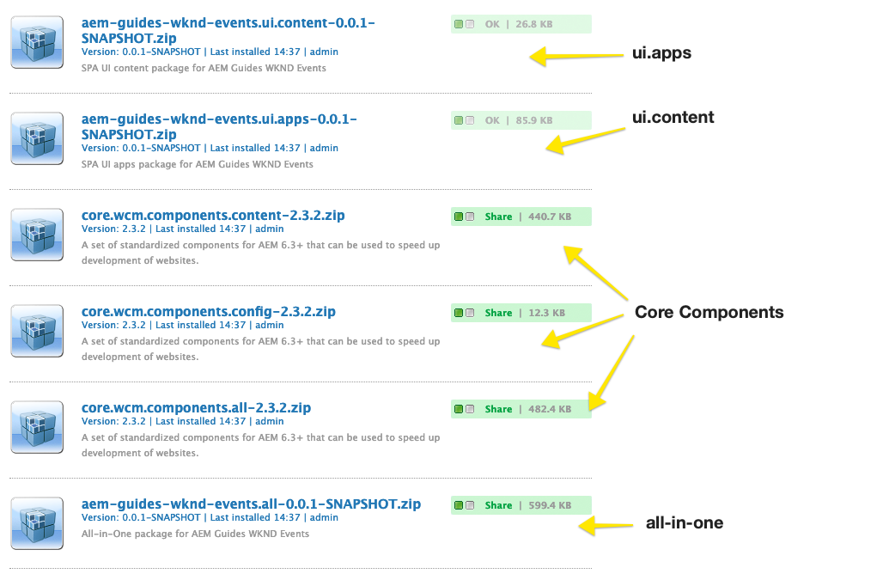

# Getting Started with React and AEM SPA Editor - SPA Starter Kit {#getting-started-with-react-and-aem-spa-editor-spa-starter-kit}

## Objective

1. Learn the best practices for starting a new SPA enablement project with the [Maven Archetype for SPA Starter Kit](https://github.com/adobe/aem-spa-project-archetype/tree/master).
2. Learn how a webpack project's build artifacts can be integrated and deployed as an AEM client library.
3. Understand how the plugins of [aem-clientlib-generator](https://www.npmjs.com/package/aem-clientlib-generator) and [frontend-maven-plugin](https://github.com/eirslett/frontend-maven-plugin) are used to automate the build process.

## Background

SPA development will be done primarily in a webpack project outside of AEM. This offers several advantages:

* Separation of front-end and back-end concerns.
* Front-end tooling has a very rapid lifecycle. By moving the front-end development outside of AEM, it ensures that the latest and greatest versions of these tools can be used, independent of the version of AEM.

At a high level, the integration approach is as follows:

1. A webpack production build is triggered.
2. The compiled SPA, the production distribution of CSS and JS, is copied into the **ui.apps** module as an AEM [client library](https://helpx.adobe.com/experience-manager/6-4/sites/developing/using/clientlibs.html)
3. The **ui.apps** is deployed to AEM as part of an AEM package.


The concept is similar to the integration of a Java bundle, where the Java bundle is compiled into a jar file that is embedded into the **ui.apps** module and deployed to AEM as an AEM package.

To achieve this integration, two tools are used:

* [aem-clientlib-generator](https://www.npmjs.com/package/aem-clientlib-generator) - used to transform compiled CSS and JS files into an AEM client library
* [frontend-maven-plugin](https://github.com/eirslett/frontend-maven-plugin) - used to trigger NPM commands via a Maven build. This plugin will download/install Node and NPM locally for the project, ensuring consistency and making the project easy to integrate with a Continuous Integration/Continuous Deployment environment.

## Exercise 1 - Generate a new project

1. Open a new terminal command line prompt.
2. Check that Maven is install and available with the following command:

    ```shell
    $ mvn --version
    Apache Maven 3.3.9
    Maven home: /Library/apache-maven-3.3.9
   ```

3. Generate a new React-enabled SPA project from the [aem-spa-project-archetype](https://github.com/adobe/aem-spa-project-archetype)

    ```shell
    mvn archetype:generate -B \
     -DarchetypeCatalog=local  \
     -DarchetypeGroupId=com.adobe.cq.spa.archetypes  \
     -DarchetypeArtifactId=aem-spa-project-archetype  \
     -DarchetypeVersion=1.0.4 \
     -Dpackage=com.adobe.aem.guides.wkndevents.core \
     -DgroupId=com.adobe.aem.guides \
     -DartifactId=aem-guides-wknd-events \
     -Dversion=0.0.1-SNAPSHOT \
     -DprojectTitle="AEM Guides WKND Events"  \
     -DprojectName=wknd-events  \
     -DcomponentGroup="WKND Events - Content" \
     -DoptionFrontend=react
     ```

     This should create a new maven project in a folder: `aem-guides-wknd-events`. Documentation for the individual parameters used can be found on [aem-spa-project-archetype](https://github.com/adobe/aem-spa-project-archetype)

     > [!NOTE]
     > For the purposes of following this tutorial please use version **1.0.4** of the archetype. However, it is always a best practice to use the **latest** version of the archetype to generate a new project.

## Exercise 2 - Inspect the project

1. Open the newly created maven project `aem-guides-wknd-events` in Visual Studio Code or the IDE of your choice.
2. There are 5 folders in the project that represent individual Maven modules
    * **all** Combines all modules in a single package
    * **core**: OSGi bundle containing Java code
    * **react-app** React application
    * **ui.apps** - AEM components and dialog definitions
    * **ui.content** - AEM templates and configurations

    

3. Beneath the **react-app** folder, open the file: `package.json`.
4. Inspect the **npm** scripts **build** command:

    `"build": "react-scripts build && clientlib --verbose"`

    This will trigger a production build of the react application and then copy the compiled JS and CSS into an AEM Client library.
5. In the `package.json` inspect the **dependencies**:

    ```json
    "dependencies": {
        "@adobe/cq-react-editable-components": "~1.0.4",
        "@adobe/cq-spa-component-mapping": "~1.0.3",
        "@adobe/cq-spa-page-model-manager": "~1.0.3",
        "aem-clientlib-generator": "^1.4.1",
        ...
    ```

    The dependencies prefixed with **@adobe/** comprise the AEM SPA Editor JS SDK. It is made available via three NPM modules:

    * [@adobe/cq-spa-component-mapping](https://www.npmjs.com/package/@adobe/cq-spa-component-mapping) - provides helpers to map AEM Components to SPA components. This module is not tied to a specific SPA framework.
    * [@adobe/cq-spa-page-model-manager](https://www.npmjs.com/package/@adobe/cq-spa-page-model-manager) - provides the API to manage the model representation of the AEM Pages that are used to compose a SPA. This module is not tied to a specific SPA framework.
    * [@adobe/cq-react-editable-components](https://www.npmjs.com/package/@adobe/cq-react-editable-components) - provides generic React helpers and components to support AEM authoring. This module also wraps the cq-spa-page-model-manager and cq-spa-component-mapping to make these available to the React framework.

    Also notice the dependency for **aem-clientlib-generator**.
6. Beneath the **react-app** folder, open the file: `clientlib.config.js`:

    ```js
    module.exports = {
    // default working directory (can be changed per 'cwd' in every asset option)
    context: __dirname,

    // path to the clientlib root folder (output)
    clientLibRoot: "./../ui.apps/src/main/content/jcr_root/apps/wknd-events/clientlibs",

        libs: {
            name: "wknd-events-react",
            allowProxy: true,
            categories: ["wknd-events-react"],
            embed: ["wknd-events.responsivegrid"],
            jsProcessor: ["min:gcc"],
            serializationFormat: "xml",
            assets: {
                js: [
                    "build/static/**/*.js"
                ],
                css: [
                    "build/static/**/*.css"
                ]
            }
        }
    };
    ```

    This is the [aem-clientlib-generator](https://www.npmjs.com/package/aem-clientlib-generator) configuration used to transform the production build of the react app into an AEM client library that will be copied into the **ui.apps** folder based on the **clientLibRoot** value.

## Exercise 3 - Updates to the project

There are a few updates to the project we recommend making.

1. Update the file `pom.xml` located at the root of the project: `<src>/aem-guides-wknd-events/pom.xml`:

    ```diff
    <dependency>
        <groupId>com.adobe.cq</groupId>
        <artifactId>core.wcm.components.all</artifactId>
        <type>zip</type>
    -   <version>2.2.2</version>
    +   <version>2.3.2</version>
        <scope>provided</scope>
    </dependency>
    ```

    > [!NOTE]
    > For the purposes of following this tutorial we will use **2.3.2** version of Core Components. As a best practice, always try and use the latest version of Core Components.

2. Update the `filter.xml` file under `ui.apps/src/main/content/META-INF/vault/filter.xml`:

    ```diff
     <?xml version="1.0" encoding="UTF-8"?>
     <workspaceFilter version="1.0">
    -    <filter root="/apps/wknd-events" mode="merge"/>
    +    <filter root="/apps/wknd-events" />
     </workspaceFilter>
    ```

    This is a [bug](https://github.com/adobe/aem-spa-project-archetype/issues/69) in the current archetype and will be resolved with the next update to the archetype.

You can skip the next steps and still complete the tutorial. However, if starting a new project we recommend a few updates to ensure the project is properly set up to be used with source control and unwanted files are not checked in.

In this exercise the SCM language **git** is used. If using another method of source control follow the same practices to ignore these files and folders.

1. Beneath the `react-app` folder add a new file named `.gitignore`:

    ```plain
    # dependencies
    /node_modules
    /node

    # testing
    /coverage

    # production
    /build

    # misc
    .DS_Store
    .env.local
    .env.development.local
    .env.test.local
    .env.production.local

    npm-debug.log*
    yarn-debug.log*
    yarn-error.log*
    ```

    This will safely ignore node libraries that are downloaded and installed when the react app is compiled.

2. Under the `ui.apps` folder `ui.apps/src/main/content/jcr_root/apps/wknd-events/clientlibs` add a new file named `.gitignore`:

    ```plain
    # ignore generated client libraries from SPA project
    wknd-events-react
    ```

    This ensures that the compiled JS and CSS from the react-app are ignored from source control.

## Exercise 4 - Build the project

Next we will build and deploy the project to a local instance of AEM.

1. Ensure that you have a local instance of AEM running [http://localhost:4502](http://localhost:4502).
2. Open a terminal window and navigate to `<src>/aem-guides-wknd-events`. Run the following Maven command:

    ```shell
    $ cd <src>/aem-guides-wknd-events
    $ mvn -PautoInstallPackage clean install
    ...
    [INFO] ------------------------------------------------------------------------
    [INFO] Reactor Summary:
    [INFO] 
    [INFO] AEM Guides WKND Events Reactor ..................... SUCCESS [  0.320 s]
    [INFO] AEM Guides WKND Events Core ........................ SUCCESS [  7.364 s]
    [INFO] AEM Guides WKND Events React App ................... SUCCESS [ 35.407 s]
    [INFO] AEM Guides WKND Events - SPA UI apps ............... SUCCESS [  1.060 s]
    [INFO] AEM Guides WKND Events - SPA UI content ............ SUCCESS [  0.734 s]
    [INFO] AEM Guides WKND Events All-in-One .................. SUCCESS [  1.065 s]
    [INFO] ------------------------------------------------------------------------
    [INFO] BUILD SUCCESS
    [INFO] ------------------------------------------------------------------------
    ```

3. Open a new browser and navigate to AEM: [http://localhost:4502](http://localhost:4502).
4. Login as an administrator with the credentials:
    * User name: **admin**
    * Password: **admin**
5. Click **Tools** > **Deployment** > **Packages** to navigate to CRX Package Manager:

    

6. You should see that the package has been deployed:

    

    Notice that

