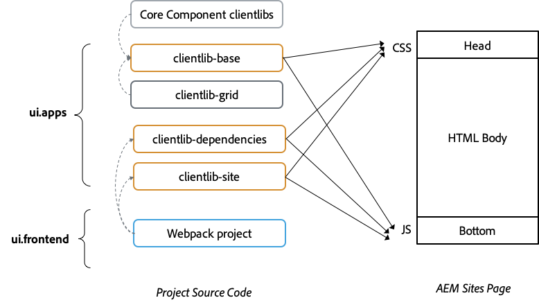
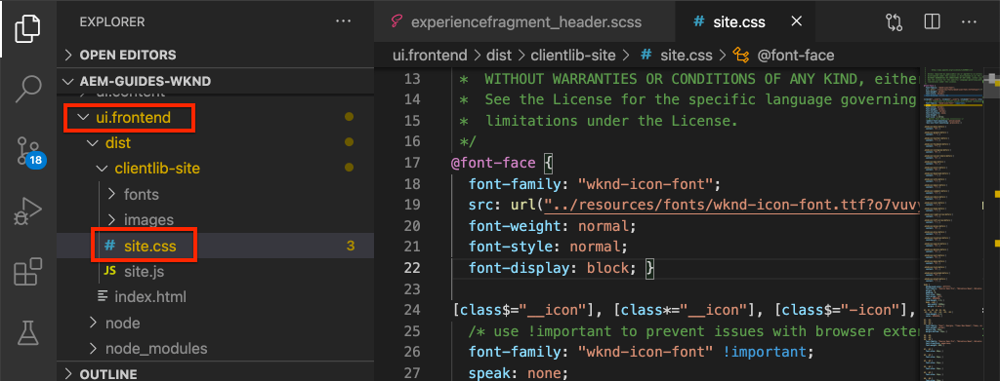
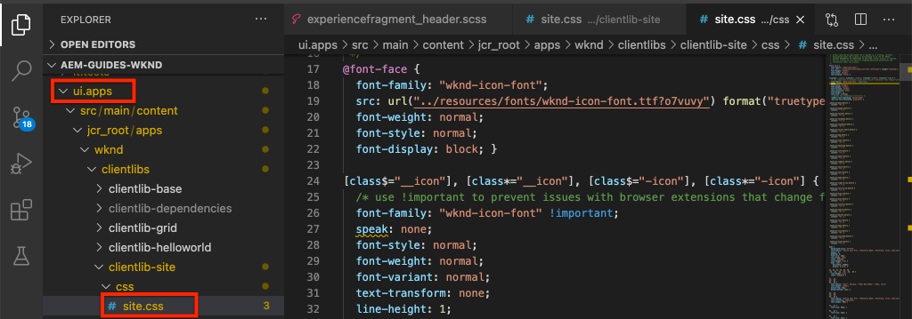
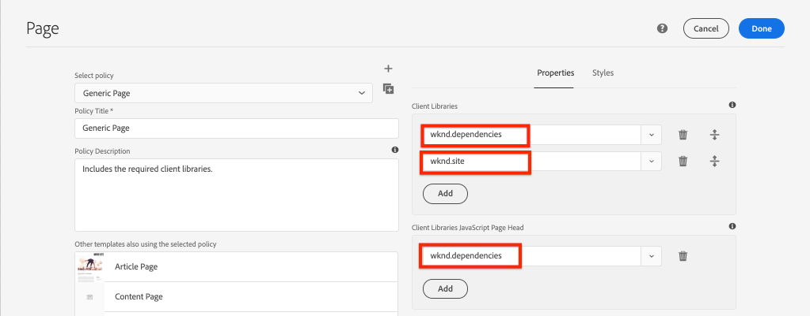
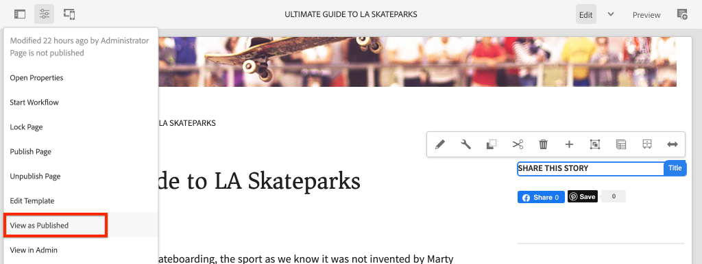
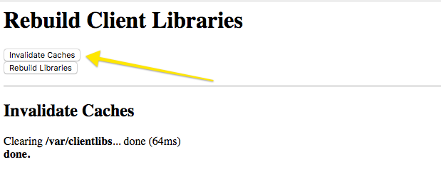

# Client-Side Libraries and Front-end Workflow {#client-side-libraries}

Learn how Client-Side Libraries or clientlibs are used to deploy and manage CSS and Javascript for an Adobe Experience Manager (AEM) Sites implementation. This tutorial will also cover how the [ui.frontend](https://docs.adobe.com/content/help/en/experience-manager-core-components/using/developing/archetype/uifrontend.html) module, a de-coupled [webpack](https://webpack.js.org/) project, can be integrated into the end-to-end build process.

## Prerequisites {#prerequisites}

Review the required tooling and instructions for setting up a [local development environment](overview.md#local-dev-environment). 

It is also recommended to review the [Component Basics](component-basics.md#client-side-libraries) tutorial to understand the fundamentals of client-side libraries and AEM.

### Starter Project

Check out the base-line code the tutorial builds on:

1. Clone the [github.com/adobe/aem-guides-wknd](https://github.com/adobe/aem-guides-wknd) repository.
2. Check out the `client-side-libraries/start` branch

   ```shell
   $ git clone git@github.com:adobe/aem-guides-wknd.git ~/code/aem-guides-wknd
   $ cd ~/code/aem-guides-wknd
   $ git checkout client-side-libraries/start
   ```

3. Deploy code base to a local AEM instance using your Maven skills:

   ```shell
   $ cd ~/code/aem-guides-wknd
   $ mvn clean install -PautoInstallSinglePackage
   ```

You can always view the finished code on [GitHub](https://github.com/adobe/aem-guides-wknd/tree/client-side-libraries/solution) or check the code out locally by switching to the branch `client-side-libraries/solution`.

## Objective

1. Understand how client-side libraries are included onto a page via an editable template.
2. Learn how to use the UI.Frontend Module and a webpack development server for dedicated front-end development.
3. Understand the end-to-end workflow of delivering compiled CSS and JavaScript to a Sites implementation.

## What you will build {#what-you-will-build}

In this chapter you will add some baseline styles for the WKND site and the Article Page Template in an effort to bring the implementation closer to the [UI design mockups](assets/pages-templates/wknd-article-design.xd). You will use an advanced front-end workflow to integrate a webpack project into an AEM client library.

>[!VIDEO](https://video.tv.adobe.com/v/30359/?quality=12&learn=on)

## Background {#background}

Client-Side Libraries provides a mechanism to organize and manage CSS and JavaScript files necessary for an AEM Sites implementation. The basic goals for client-side libraries or clientlibs are:

1. Store CSS/JS in small discrete files for easier development and maintenance
2. Manage dependencies on 3rd party frameworks in an organized fashion
3. Minimize the number of client-side requests by concatenating CSS/JS into one or two requests.

More information about using [Client-Side Libraries can be found here.](https://docs.adobe.com/content/help/en/experience-manager-65/developing/introduction/clientlibs.html)

Client-side libraries do have some limitations. Most notably is a limited support for popular front-end languages like Sass, LESS, and TypeScript. In the tutorial we will look at how the **ui.frontend** module can help solve this.

Deploy the starter code base to a local AEM instance and navigate to [http://localhost:4502/editor.html/content/wknd/us/en/magazine/guide-la-skateparks.html](http://localhost:4502/editor.html/content/wknd/us/en/magazine/guide-la-skateparks.html). This page is currently un-styled. We will next implement Client-side libraries for the WKND brand to add CSS and Javascript to the page.

## Client-Side Libraries Organization {#organization}

Next we will explore the organization of clientlibs generated by the [AEM Project Archetype](https://docs.adobe.com/content/help/en/experience-manager-core-components/using/developing/archetype/overview.html).



*High level diagram Client-side Library organization and page inclusion*

>[!NOTE]
>
> The following client-side library organization is generated by AEM Project Archetype but represents merely a starting point. How a project ultimately manages and delivers CSS and Javascript to a Sites implementation can vary dramatically based on resources, skillsets and requirements.

1. Using the Eclipse or other IDE open up the **ui.apps** module.
2. Expand the path `/apps/wknd/clientlibs` to view the clientlibs generated by the archetype.

    

    We will inspect these clientlibs in greater detail below.

3. Inspect the properties of `clientlibs/clientlib-base`.

    **clientlib-base** represents the base level of CSS and JavaScript needed for the WKND site to function. Notice the property `categories` which is set to `wknd.base`. `categories` is a tagging mechanism for clientlibs and is how they can be referenced.

    Notice the `embed` property and the `String[]` of values. The `embed` property embeds other clientlibs based on their category. **clientlib-base** will include all of the AEM Core Component clientlibraries that are needed. This includes artifacts like javascript for the Carousel, Quick search components to function. **clientlib-base** will not include any CSS and Javascript of its own, but instead will just embed other client libraries. **clientlib-base** embeds the **clientlib-grid** clientlib with the category of `wknd.grid`.

    Notice the `allowProxy` property set to `true`. It is a best practice to always set `allowProxy=true` on clientlibs. The `allowProxy` property allows us to store the clientlibs with our application code under `/apps` **but** then delivers the clientlibs over a path prefixed with `/etc.clientlibs` inorder to avoid exposing any application code to end-users. More information about the [allowProxy property can be found here.](https://docs.adobe.com/content/help/en/experience-manager-65/developing/introduction/clientlibs.html#locating-a-client-library-folder-and-using-the-proxy-client-libraries-servlet). 

4. Inspect the properties of `clientlibs/clientlib-grid`.

    **clientlib-grid** is responsible for including/generating the CSS necessary for the [Layout mode](https://docs.adobe.com/content/help/en/experience-manager-65/authoring/siteandpage/responsive-layout.html) to work with the AEM Sites editor. **clientlib-grid** had a category set to `wknd.grid` and is embedded via **clientlib-base**. 

    The grid can be customized to use different amounts of columns and breakpoints. Next we will update the default breakpoints generated.

5. Update the file `/apps/wknd/clientlibs/clientlib-grid/less/grid.less`:

    ```css
    @import (once) "/libs/wcm/foundation/clientlibs/grid/grid_base.less";

    /* maximum amount of grid cells to be provided */
    @max_col: 12;
    @screen-small: 767px;
    @screen-medium: 1024px;
    @screen-large: 1200px;
    @gutter-padding: 14px;

    /* default breakpoint */
    .aem-Grid {
    .generate-grid(default, @max_col);
    }

    /* phone breakpoint */
    @media (max-width: @screen-small) {
        .aem-Grid {
            .generate-grid(phone, @max_col);
        }
    }
    /* tablet breakpoint */
    @media (min-width: (@screen-small + 1)) and (max-width: @screen-medium) {
        .aem-Grid {
            .generate-grid(tablet, @max_col);
        }
    }

    .aem-GridColumn {
    padding: 0 @gutter-padding;
    }

    .responsivegrid.aem-GridColumn {
    padding-left: 0;
    padding-right: 0;
    }
    ```

    This will change the breakpoints to correspond to our Template breakpoints set in `/ui.content/src/main/content/jcr_root/conf/wknd/settings/wcm/templates/article-page-template/structure/.content.xml`. 

    Notice that this file actually references a `grid_base.less` file under `/libs` which contains a custom mixin to generate the grid.

6. Inspect the properties for `clientlibs/clientlib-site`.

    **clientlib-site** will contain all of the site-specific styles for the WKND Brand. Note the category of `wknd.site`. The CSS and Javascript that generates this clientlib will actually be maintained in the `ui.frontend` module. We will explore this integration next.

7. Inspect the properties for `clientlibs/clientlib-dependencies`.

    **clientlib-dependencies** is intended to embed any 3rd party dependencies. It is a separate clientlib so that it can be loaded in the top of the HTML page if needed. Note the category of `wknd.dependencies`. The CSS and Javascript that generates this clientlib will actually be maintained in the `ui.frontend` module. We will explore this integration later in the tutorial.

## Using the ui.frontend module {#ui-frontend}

Next we will explore the use of the **[ui.frontend](https://docs.adobe.com/content/help/en/experience-manager-core-components/using/developing/archetype/uifrontend.html)** module.

### Motivation

Client-side libraries have some limitations when it comes to support of languages like [Sass](https://sass-lang.com/) or [TypeScript](https://www.typescriptlang.org/). There has also been an explosion of open-source tools like [NPM](https://www.npmjs.com/) and [webpack](https://webpack.js.org/) that accelerate and optimize front-end development.

The basic idea behind the **ui.frontend** module is to be able to use great tools like NPM and Webpack to manage a majority of front-end development. A key integration piece built into the **ui.frontend** module, [aem-clientlib-generator](https://github.com/wcm-io-frontend/aem-clientlib-generator) takes the compiled CSS and JS artifacts from a webpack/npm project and transforms them into AEM client-side libraries. This gives a front-end developer greater freedom to choose different tools and technologies.


### Use

Now we will add some base styles for the WKND brand by adding some Sass files (`.scss` extension) via the **ui.frontend** module.

1. Open up the **ui.frontend** module and navigate to `src/main/webpack/base/sass`.

    
2. Create a new file named `_variables.scss` beneath the folder `src/main/webpack/base/sass`.

3. Populate `_variables.scss` with the following:

    ```css
    //== Colors
    //
    //## Gray and brand colors for use across theme.

    $black:                  #202020;
    $gray:                   #696969;
    $gray-light:             #EBEBEB;
    $gray-lighter:           #F7F7F7;
    $white:                  #ffffff;
    $yellow:                 #FFE900;
    $blue:                   #0045FF;
    $pink:                   #FF0058;

    $brand-primary:           $yellow;

    //== Layout
    $gutter-padding: 14px;
    $max-width: 1164px;
    $max-body-width: 1680px;
    $screen-xsmall: 475px;
    $screen-small: 767px;
    $screen-medium: 1024px;
    $screen-large: 1200px;

    //== Scaffolding
    //
    //## Settings for some of the most global styles.
    $body-bg:                   $white;
    $text-color:                $black;
    $text-color-inverse:        $gray-light;

    $brand-secondary:           $black;

    $brand-third:               $gray-light;
    $link-color:                $blue;
    $link-hover-color:          $link-color;
    $link-hover-decoration:     underline;
    $nav-link:                  $black;
    $nav-link-inverse:          $gray-light;

    //== Typography
    //
    //## Font, line-height, and color for body text, headings, and more.

    $font-family-sans-serif:  "Source Sans Pro", "Helvetica Neue", Helvetica, Arial, sans-serif;
    $font-family-serif:       "Asar",Georgia, "Times New Roman", Times, serif;
    $font-family-base:        $font-family-sans-serif;

    $font-size-base:          18px;
    $font-size-large:         24px;
    $font-size-xlarge:        48px;
    $font-size-medium:        18px;
    $font-size-small:         14px;
    $font-size-xsmall:        12px;

    $font-size-h1:            40px;
    $font-size-h2:            36px; 
    $font-size-h3:            24px; 
    $font-size-h4:            16px; 
    $font-size-h5:            14px;
    $font-size-h6:            10px; 

    $line-height-base:        1.5;
    $line-height-computed:    floor(($font-size-base * $line-height-base)); // ~20px

    $font-weight-light:      300;
    $font-weight-normal:     normal;
    $font-weight-semi-bold:  400;
    $font-weight-bold:       600;
    ```

    Sass allows us to create variables, which can then be used throughout different files to ensure consistency. Notice the Font Families. Later in the tutorial we will see how we can include a call to Google web fonts, in order to use these fonts.

4. Create another file named `_elements.scss` beneath `src/main/webpack/base/sass` and populate it with the following:

    ```css
    body {
        background-color: $body-bg;
        font-family: $font-family-base;
        margin: 0;
        padding: 0;
        font-size: $font-size-base;
        text-align: left;
        color: $text-color;
        line-height: $line-height-base;

        .root {
            max-width: $max-width;
            margin: 0 auto;
        }
    }
    
    // Headings
    // -------------------------
    
    h1, h2, h3, h4, h5, h6,
    .h1, .h2, .h3, .h4, .h5, .h6 {
        line-height: $line-height-base;
        color: $text-color;
    }
    
    h1, .h1,
    h2, .h2,
    h3, .h3 {
        font-family: $font-family-serif;
        font-weight: $font-weight-normal;
        margin-top: $line-height-computed;
        margin-bottom: ($line-height-computed / 2);
    }
    
    h4, .h4,
    h5, .h5,
    h6, .h6 {
        font-family: $font-family-sans-serif;
        text-transform: uppercase;
        font-weight: $font-weight-bold;
    }
    
    h1, .h1 { font-size: $font-size-h1; }
    h2, .h2 { font-size: $font-size-h2; }
    h3, .h3 { font-size: $font-size-h3; }
    h4, .h4 { font-size: $font-size-h4; }
    h5, .h5 { font-size: $font-size-h5; }
    h6, .h6 { font-size: $font-size-h6; }
    
    a {
        color: $link-color;
        text-decoration: none;
    }
    
    h1 a, h2 a, h3 a {
        color: $pink; /* for wednesdays :-) */
    }
    
    // Body text
    // -------------------------
    
    p {
        margin: 0 0 ($line-height-computed / 2);
        font-size: $font-size-base;
        line-height: $line-height-base + 1;
        text-align: justify;
    }
    ```

    Notice that the `_elements.scss` file makes use of the variables in the `_variables.scss`.

5. Update `_shared.scss` beneath `src/main/webpack/base/sass` to include the `_elements.scss` and `_variables.scss` files.

    ```css
    @import './variables';
    @import './elements';
    ```

6. Open a command line terminal and install the **ui.frontend** module using the `npm install` command:

    ```shell
    $ cd ~/code/aem-guides-wknd/ui.frontend
    $ npm install
    ```

    >[!NOTE]
    >
    > `npm install` only needs to be run once, following a new clone or generation of the project.

7. In the same terminal, build and deploy the **ui.frontend** module by using the `npm run dev` command:

    ```shell
    $ npm run dev
    ...
    Entrypoint site = clientlib-site/css/site.css clientlib-site/js/site.js
    Entrypoint dependencies = clientlib-dependencies/js/dependencies.js
    start aem-clientlib-generator
    ...
    copy: dist/clientlib-site/css/site.css ../ui.apps/src/main/content/jcr_root/apps/wknd/clientlibs/clientlib-site/css/site.css
    ```

    The command `npm run dev` should build and compile the source code for the Webpack project and ultimately populate the **clientlib-site** and **clientlib-dependencies** in the **ui.apps** module.

    >[!NOTE]
    >
    > There is also a `npm run prod` profile which will minify the JS and CSS. This is the standard compilation whenever the webpack build is triggered via Maven. More details about the [ui.frontend module can be found here](https://docs.adobe.com/content/help/en/experience-manager-core-components/using/developing/archetype/uifrontend.html).

8. Inspect the file `site.css` beneath `ui.frontend/dist/clientlib-site/css/site.css`. Notice that the CSS is mostly made up of contents of the `_elements.scss` file created earlier but the variables have been replaced with actual values.

    

9. Inspect the file `ui.frontend/clientlib.config.js`. This is the configuration file for an npm plugin, [aem-clientlib-generator](https://github.com/wcm-io-frontend/aem-clientlib-generator). **aem-clientlib-generator** is the tool responsible for transforming the compiled CSS/JavaScript and copy it into the **ui.apps** module.

10. Inspect the file `site.css` in the **ui.apps** module at `ui.apps/src/main/content/jcr_root/apps/wknd/clientlibs/clientlib-site/css/site.css`. This should be an identical copy of the `site.css` file from the **ui.frontend** module. Now that it is in **ui.apps** module it can be deployed to AEM.

    

    >[!NOTE]
    >
    > Since **clientlib-site** is actually compiled during build time, using either **npm** or **maven**, it can actually be ignored from source control in the **ui.apps** module. Inspect the `.gitignore` file beneath **ui.apps**.

>[!Caution]
>
> The use of the **ui.frontend** module may not be necessary for all projects. The **ui.frontend** module adds additional complexity and if there is not a need/desire to use some of these advanced front-end tools (Sass, webpack, npm...) it may be overkill. For this reason it is considered an optional part of the AEM Project Archetype and the use of standard client-side libraries and vanilla CSS and JavaScript continues to be fully supported.

## Page and Template Inclusion {#page-inclusion}

Next we will review how the project is set up to include the clientlibs in AEM templates/pages. A common best practice in web development is to include CSS in the HTML Header `<head>` and JavaScript right before closing `</body>` tag.

1. In the **ui.apps** module navigate to `ui.apps/src/main/content/jcr_root/apps/wknd/components/structure/page`.

    

    This is the `page` component that is used to render all pages in the WKND implementation.

2. Open the file `customheaderlibs.html`. Notice the lines `${clientlib.css @ categories='wknd.base'}`. This indicates that the CSS for the clientlib with a category of `wknd.base` will be included via this file, effectively including **clientlib-base** in the header of all our pages.

3. Update `customheaderlibs.html` to include a reference to Google font styles that we specified earlier in the **ui.frontend** module. We will also comment out ContextHub for now...

    ```html
    <link href="//fonts.googleapis.com/css?family=Source+Sans+Pro:400,600|Asar&display=swap" rel="stylesheet">
    <sly data-sly-use.clientLib="/libs/granite/sightly/templates/clientlib.html"
     data-sly-call="${clientlib.css @ categories='wknd.base'}"/>

    <!--/* Include Context Hub 
    <sly data-sly-resource="${'contexthub' @ resourceType='granite/contexthub/components/contexthub'}"/>
    */-->
    ```

4. Inspect the file `customfooterlibs.html`. This file, like `customheaderlibs.html` is meant to be overwritten by implementing projects. Here the line `${clientlib.js @ categories='wknd.base'}` means that the JavaScript from **clientlib-base** will be included at the bottom of all our pages.

5. Build and deploy the project to a local AEM instance using Maven:

    ```shell
    $ cd ~/code/aem-guides-wknd
    $ mvn clean install -PautoInstallSinglePackage
    ```

6. Browse to the WKND Templates at [http://localhost:4502/libs/wcm/core/content/sites/templates.html/conf/wknd](http://localhost:4502/libs/wcm/core/content/sites/templates.html/conf/wknd).

7. Select and open the **Article Page Template** in the Template Editor.

    

8. Click the **Page Information** icon and in the menu select **Page Policy** to open the **Page Policy** dialog.

    

    *Page Information &gt; Page Policy*

9. Notice that the categories for `wknd.dependencies` and `wknd.site` are listed here. By default clientlibs configured via the Page Policy are split to include the CSS in the page head and the JavaScript at the body end. If desired you can explicitly list that the clientlib JavaScript be loaded in the Page head. This is the case for `wknd.dependencies`. 

    

    >[!NOTE]
    >
    > It is also possible to reference the `wknd.site` or `wknd.dependencies` from the page component directly, using the `customheaderlibs.html` or `customfooterlibs.html` script, as we saw eaerlier for the `wknd.base` clientlib. Using the Template gives some flexibility in that you can pick and choose which clientlibs are used per template. For example if you have a very heavy JavaScript library that is only going to be used on a select template. 

10. Navigate to the **LA Skateparks** page created using the **Article Page Template**: [http://localhost:4502/editor.html/content/wknd/us/en/magazine/guide-la-skateparks.html](http://localhost:4502/editor.html/content/wknd/us/en/magazine/guide-la-skateparks.html). You should see a difference in fonts and some basic styles applied to indicate that the CSS created in the **ui.frontend** module is working.

11. Click the **Page Information** icon and in the menu select **View As Published** to open the article page outside of the AEM editor.

    

12. View the Page source of [http://localhost:4502/content/wknd/us/en/magazine/guide-la-skateparks.html?wcmmode=disabled](http://localhost:4502/content/wknd/us/en/magazine/guide-la-skateparks.html?wcmmode=disabled) and you should be able to see the following clientlib references in the `<head>`:

    ```html
    <head>
    ...
    <link rel="stylesheet" href="/etc.clientlibs/wknd/clientlibs/clientlib-base.css" type="text/css">
    <script type="text/javascript" src="/etc.clientlibs/wknd/clientlibs/clientlib-dependencies.js"></script>
    <link rel="stylesheet" href="/etc.clientlibs/wknd/clientlibs/clientlib-dependencies.css" type="text/css">
    <link rel="stylesheet" href="/etc.clientlibs/wknd/clientlibs/clientlib-site.css" type="text/css">
    ...
    </head>
    ```

    Notice that the clientlibs are using the proxy `/etc.clientlibs` endpoint. You should also see the following clientlib includes at the bottom of the page:

    ```html
    ...
    <script type="text/javascript" src="/etc.clientlibs/wknd/clientlibs/clientlib-site.js"></script>
    <script type="text/javascript" src="/etc.clientlibs/wknd/clientlibs/clientlib-base.js"></script>
    ...
    </body>
    ```

    >[!WARNING]
    >
    >It is critical on the publish side that the client libraries are **not** served from **/apps** as this path should be restricted for security reasons using the [Dispatcher filter section](https://docs.adobe.com/content/help/en/experience-manager-dispatcher/using/configuring/dispatcher-configuration.html#example-filter-section). The [allowProxy property](https://docs.adobe.com/content/help/en/experience-manager-65/developing/introduction/clientlibs.html#locating-a-client-library-folder-and-using-the-proxy-client-libraries-servlet) of the client library ensures the CSS and JS are served from **/etc.clientlibs**.

## Webpack DevServer {#webpack-dev-server}

In the previous couple of exercises we were able to update several Sass files in the **ui.frontend** module and through a build process, ultimately see these changes reflected in AEM. Next we will look at leveraging a [webpack-dev-server](https://webpack.js.org/configuration/dev-server/) to rapidly develop our front-end styles.

>[!VIDEO](https://video.tv.adobe.com/v/30352/?quality=12&learn=on)

Below are the high level steps shown in the video:

1. Start the webpack dev server by running the following command from within the **ui.frontend** module:

    ```shell
    $ cd ~/code/aem-guides-wknd/ui.frontend/
    $ npm start

    > aem-maven-archetype@1.0.0 start code/aem-guides-wknd/ui.frontend
    > webpack-dev-server --open --config ./webpack.dev.js
    ```

2. This should open a new browser window at [http://localhost:8080/](http://localhost:8080/) with static markup.
3. Copy the page source of the LA skatepark article page at [http://localhost:4502/content/wknd/us/en/magazine/guide-la-skateparks.html?wcmmode=disabled](http://localhost:4502/content/wknd/us/en/magazine/guide-la-skateparks.html?wcmmode=disabled).
4. Paste the copied markup from AEM into the `index.html` in the **ui.frontend** module beneath `src/main/webpack/static`.
5. Edit the copied markup and remove any references to **clientlib-site** and **clientlib-dependencies**:

    ```html
    <!-- remove -->
    <script type="text/javascript" src="/etc.clientlibs/wknd/clientlibs/clientlib-dependencies.js"></script>
    <link rel="stylesheet" href="/etc.clientlibs/wknd/clientlibs/clientlib-dependencies.css" type="text/css">
    <link rel="stylesheet" href="/etc.clientlibs/wknd/clientlibs/clientlib-site.css" type="text/css">
    ...
    <script type="text/javascript" src="/etc.clientlibs/wknd/clientlibs/clientlib-site.js"></script>
    ```

    We can remove those references because the webpack dev server will generate these artifacts automatically.

6. Edit the `.scss` files and see the changes automatically reflected in the browser.
7. Review the `/aem-guides-wknd.ui.frontend/webpack.dev.js` file. This contains the webpack configuration used to start the webpack-dev-server. Note that it proxies the paths `/content` and `/etc.clientlibs` from a locally running instance of AEM. This is how the images, and other clientlibs (not managed by the **ui.frontend** code) are made available.

    >[!CAUTION]
    >
    > The image src of the static markup points to a live image component on a local AEM instance. Images will appear broken if the path to the image changes, if AEM is not started, or if the browser uses has not logged into the local AEM instance.
8. You can **stop** the webpack server from the command line by typing `CTRL+C`.

## Putting It Together {#putting-it-together}

The focus of this tutorial is on client-side libraries and potential front-end workflows to integrate with AEM. With this in mind, we will accelerate the implementation by installing [client-side-libraries-final-styles.zip](assets/client-side-libraries/client-side-libraries-final-styles.zip), which provides some default styles for Core components used on the Article Page Template:

* [Breadcrumb](https://docs.adobe.com/content/help/en/experience-manager-core-components/using/components/breadcrumb.html)
* [Download](https://docs.adobe.com/content/help/en/experience-manager-core-components/using/components/download.html)
* [Image](https://docs.adobe.com/content/help/en/experience-manager-core-components/using/components/image.html)
* [List](https://docs.adobe.com/content/help/en/experience-manager-core-components/using/components/list.html)
* [Navigation](https://docs.adobe.com/content/help/en/experience-manager-core-components/using/components/navigation.html)
* [Quick Search](https://docs.adobe.com/content/help/en/experience-manager-core-components/using/components/quick-search.html)
* [Separator](https://docs.adobe.com/content/help/en/experience-manager-core-components/using/components/separator.html)

>[!VIDEO](https://video.tv.adobe.com/v/30351/?quality=12&learn=on)

Below are the high level steps shown in the video:

1. Download [client-side-libraries-final-styles.zip](assets/client-side-libraries/client-side-libraries-final-styles.zip) and unzip the contents beneath `ui.frontend/src/main/webpack`. The contents of the zip should overwrite the following folders:

    ```plain
    /src/main/webpack
             /base
             /components
             /resources
    ```

2. Preview the new styles using the webpack dev server:

     ```shell
    $ cd ~/code/aem-guides-wknd/ui.frontend/
    $ npm start

    > aem-maven-archetype@1.0.0 start code/aem-guides-wknd/ui.frontend
    > webpack-dev-server --open --config ./webpack.dev.js
    ```

3. Deploy the code base to a local AEM instance to see the new styles applied to the LA skate park article:

    ```shell
    $ cd ~/code/aem-guides-wknd
    $ mvn -PautoInstallSinglePackage clean install
    ```

## Congratulations! {#congratulations}

Congratulations, the Article Page now has some consistent styles that match the WKND brand and you have become familiar with the **ui.frontend** module!

### Next Steps {#next-steps}

Learn how to implement individual styles and re-use Core Components using Experience Manager's Style System. [Developing with the Style System](style-system.md) covers using the Style System to extend Core Components with brand-specific CSS and advanced policy configurations of the Template Editor.

View the finished code on [GitHub](https://github.com/adobe/aem-guides-wknd) or review and deploy the code locally at on the Git brach `client-side-libraries/solution`.

1. Clone the [github.com/adobe/aem-wknd-guides](https://github.com/adobe/aem-guides-wknd) repository.
2. Check out the `client-side-libraries/solution` branch.

## Additional Tools and Resources {#additional-resources}

### aemfed {#develop-aemfed}

[**aemfed**](https://aemfed.io/) is an open-source,  command-line  tool that can be used to speed up front-end development. It is powered by  [aemsync](https://www.npmjs.com/package/aemsync), [Browsersync](https://www.npmjs.com/package/browser-sync) and [Sling Log Tracer](https://sling.apache.org/documentation/bundles/log-tracers.html).

At a high level **aemfed** is designed to listen to file changes within the **ui.apps** module and automatically syncs them directly to a running AEM instance. Based on the changes, a local browser will automatically refresh, thereby speeding up front-end development. It also is built to work with Sling Log tracer to automatically display any server-side errors directly in the terminal. 

If you are doing a lot of work within the **ui.apps** module, modifying HTL scripts and creating custom components, **aemfed** can be a very powerful tool to use. [Full documentation can be found here.](https://github.com/abmaonline/aemfed).

### Debugging Client-side Libraries {#debugging-clientlibs}

With different methods of **categories** and **embeds** to include multiple client libraries it can be cumbersome to troubleshoot. AEM exposes several tools to help with this. One of the most important tools is **Rebuild Client Libraries** which will force AEM to re-compile any LESS files and generate the CSS.

* [**Dump Libs**](http://localhost:4502/libs/granite/ui/content/dumplibs.html) - Lists all of the client libraries registered in the AEM instance. `<host>/libs/granite/ui/content/dumplibs.html`

* [**Test Output**](http://localhost:4502/libs/granite/ui/content/dumplibs.test.html) - allows a user to see the expected HTML output of clientlib includes based on category. `<host>/libs/granite/ui/content/dumplibs.test.html`

* [**Libraries Dependencies validation**](http://localhost:4502/libs/granite/ui/content/dumplibs.validate.html) - highlights any dependencies or embedded categories that cannot be found. `<host>/libs/granite/ui/content/dumplibs.validate.html`

* [**Rebuild Client Libraries**](http://localhost:4502/libs/granite/ui/content/dumplibs.rebuild.html) - allows a user to force AEM to rebuild all of the client libraries or invalidate the cache of client libraries. This tool is particularly effective when developing with LESS as this can force AEM to re-compile the generated CSS. In general it is more effective to Invalidate Caches and then perform a page refresh versus rebuilding all of the libraries. `<host>/libs/granite/ui/content/dumplibs.rebuild.html`


