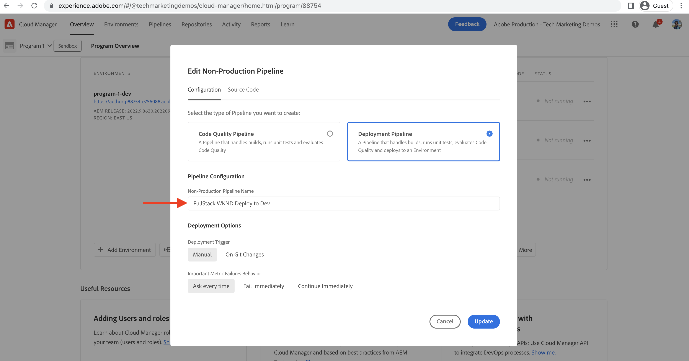
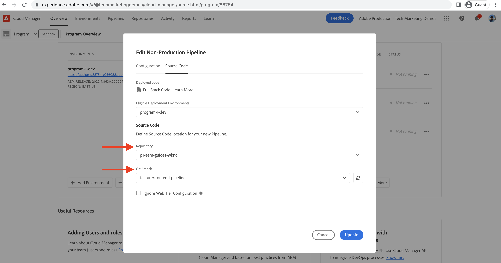
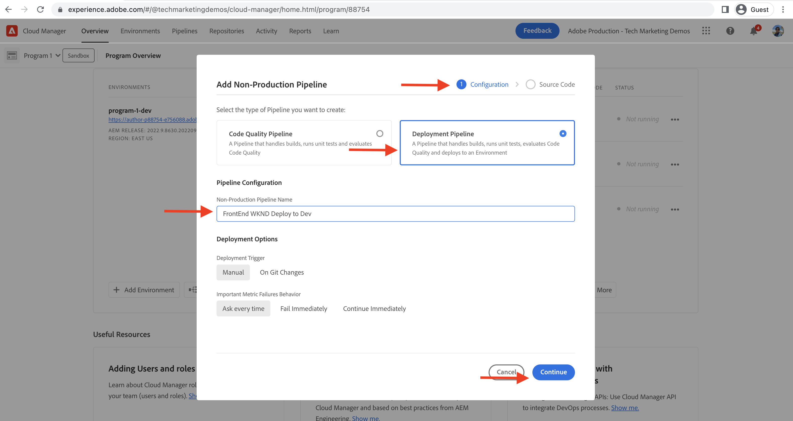
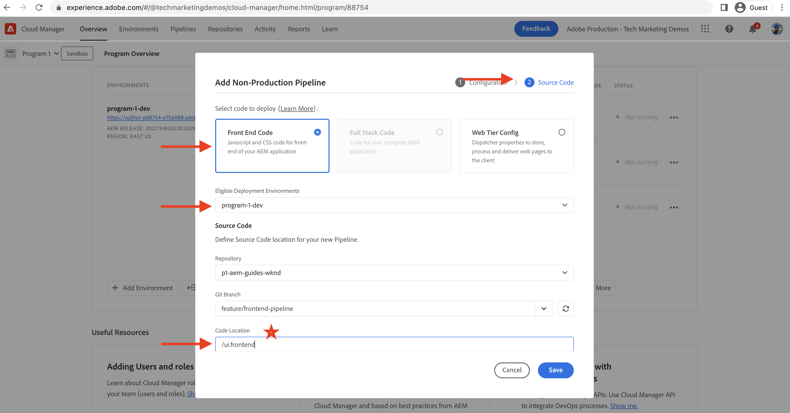
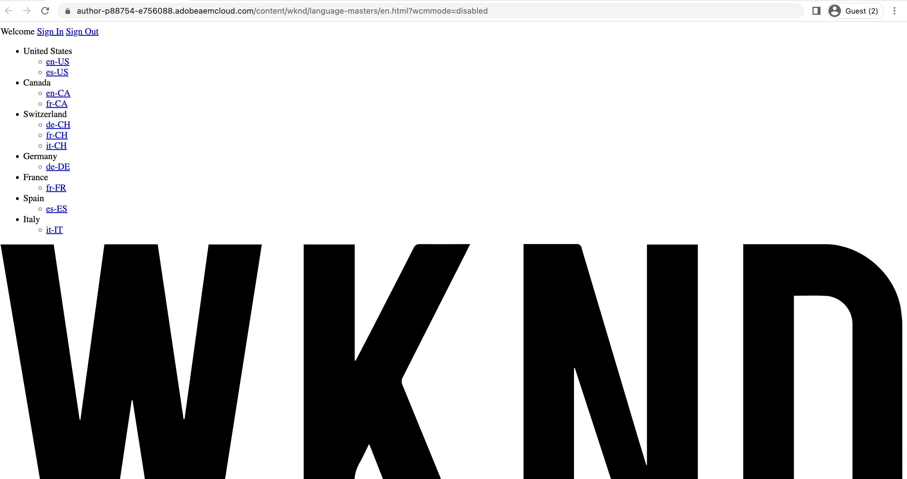
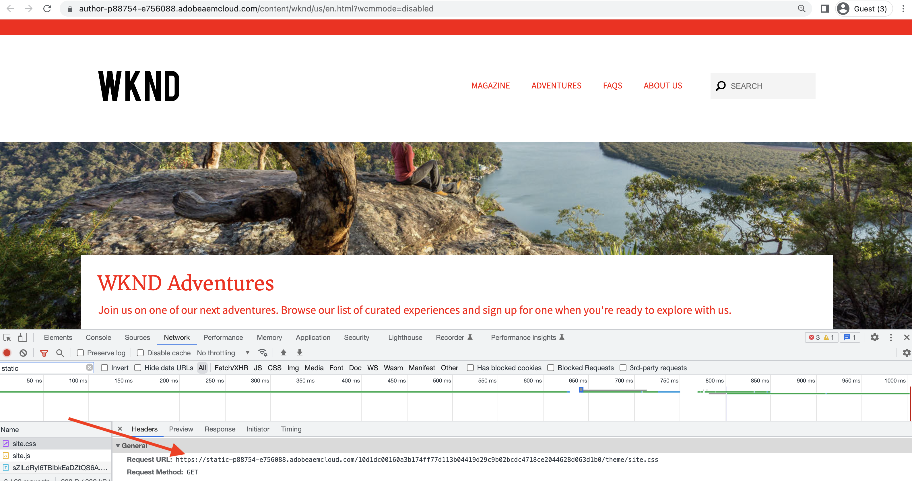
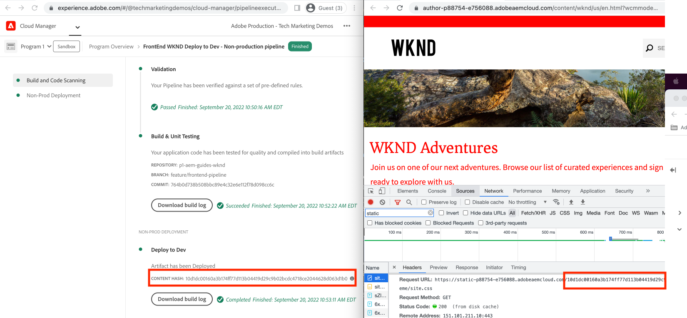

# Deploy using the front-end pipeline

In this chapter, we create and run a front-end pipeline in Adobe Cloud Manager. It only builds the files from `ui.frontend` module and deploys them to the built-in CDN in AEM as a Cloud Service. Thus moving away from the  `/etc.clientlibs` based front-end resources delivery.

## Objectives {#objectives}

* Create and run a front-end pipeline.
* Verify that front-end resources are NOT delivered from `/etc.clientlibs` but from a new hostname starting with `https://static-`

## Using the front-end pipeline

>[!VIDEO](https://video.tv.adobe.com/v/3409420?quality=12&learn=on)

## Prerequisites {#prerequisites}

This is a multi-part tutorial and it is assumed that the steps outlined in the [Update Standard AEM Project](./update-project.md) have been completed.

Ensure you have [privileges to create, and deploy pipelines in Cloud Manager](https://experienceleague.adobe.com/docs/experience-manager-cloud-manager/content/requirements/users-and-roles.html?lang=en#role-definitions) and [access to an AEM as a Cloud Service environment](https://experienceleague.adobe.com/docs/experience-manager-cloud-service/content/implementing/using-cloud-manager/manage-environments.html).

## Rename existing pipeline

 Rename the existing pipeline from __Deploy to Dev__ to  __FullStack WKND Deploy to Dev__ by going to the __Configuration__ tab's __Non-Production Pipeline Name__ field. This is to make it explicit whether a pipeline is full-stack or front-end by just looking at its name.

Also in the __Source Code__ tab, make sure that Repository and Git Branch field values are correct and the branch has your front-end pipeline contract changes.

## Create a front-end pipeline

To __ONLY__ build and deploy the front-end resources from the `ui.frontend` module, perform the following steps:

1.   In the Cloud Manager UI, from the __Pipelines__ section, click __Add__ button, then select __Add Non-Production Pipeline__ (or __Add Production Pipeline__) based on the AEM as a Cloud Service environment you want to deploy to.

1.   In the __Add Non-Production Pipeline__ dialog, as part of the __Configuration__ steps, select the __Deployment Pipeline__ option, name it as __FrontEnd WKND Deploy to Dev__, and click __Continue__

1.   As part of the __Source Code__ steps, select the __Front End Code__ option, and pick the environment from __Eligible Deployment Environments__. In the __Source Code__ section ensure that Repository and Git Branch field values are correct and the branch has your front-end pipeline contract changes. 
And __most importantly__ for the __Code Location__ field the value is `/ui.frontend` and finally, click __Save__.

## Deployment sequence

* First run the newly renamed __FullStack WKND Deploy to Dev__ pipeline to remove the WKND clientlib files from the AEM repository. And most importantly prepare the AEM for the front-end pipeline contract by adding __Sling config__ files (`SiteConfig`, `HtmlPageItemsConfig`).

>[!WARNING]
>
>After, the __FullStack WKND Deploy to Dev__ pipeline completion you will have an __unstyled__ WKND Site, which may appear broken. Please plan for an outage or deploy during odd hours, this is a one-time disruption you have to plan for during the initial switch from using a single full-stack pipeline to the front-end pipeline.

* Finally, run the __FrontEnd WKND Deploy to Dev__ pipeline to build only `ui.frontend` module and deploy the front-end resources directly to the CDN. 

>[!IMPORTANT]
>
>You notice that the __unstyled__ WKND site is back to normal and this time __FrontEnd__ pipeline execution was much faster than the full-stack pipeline.

## Verify style changes and new delivery paradigm

* Open the WKND Site's any page and you can see the text color us __Adobe Red__ and the front-end resources (CSS, JS) files are delivered from the CDN. The resource request hostname starts with `https://static-pXX-eYY.p123-e456.adobeaemcloud.com/$HASH_VALUE$/theme/site.css` and likewise the site.js or any other static resources that you referenced in the `HtmlPageItemsConfig` file.

>[!TIP]
>
>The `$HASH_VALUE$` here is the same as what you see in the __FrontEnd WKND Deploy to Dev__  pipeline's __CONTENT HASH__ field. AEM is notified of the front-end resource's CDN URL, the value is stored at `/conf/wknd/sling:configs/com.adobe.cq.wcm.core.components.config.HtmlPageItemsConfig/jcr:content` under __prefixPath__ property.

## Congratulations! {#congratulations}

Congratulations, you created, ran, and verified the Front-End pipeline that only builds and deploys the 'ui.frontend' module of the WKND Sites project. Now your front-end team can quickly iterate on the site's design and front-end behavior, outside of full AEM project's life cycle.

## Next steps {#next-steps}

In the next chapter, [Considerations](considerations.md), you will review the impact on the front-end and back-end development process.
