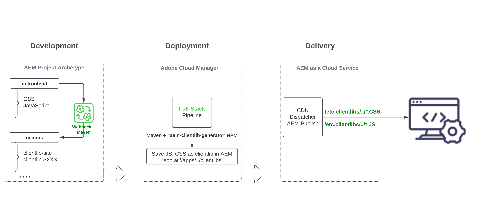

# Review the full-stack AEM project's 'ui.frontend' module {#aem-full-stack-ui-frontent}

In, this chapter we review the development, deployment, and delivery of front-end artifacts of a full-stack AEM project, by focusing on the 'ui.frontend' module of the __WKND Sites project__.


## Objectives {#objective}

* Understand the build and deployment flow of front-end artifacts in an AEM full-stack project
* Review the AEM full-stack project's `ui.frontend` module's [webpack](https://webpack.js.org/) configs
* AEM client library (also know as clientlibs) generation process

## Front-end deployment flow for AEM full-stack and Quick Site Creation projects

>[!IMPORTANT]
>
>This video explains and demonstrates the front-end flow for both **Full-Stack and Quick Site Creation** projects to outline the subtle difference in the front-end resources build, deploy, and delivery model.

>[!VIDEO](https://video.tv.adobe.com/v/3409344?quality=12&learn=on)

## Prerequisites {#prerequisites}


* Clone the [AEM WKND Sites project](https://github.com/adobe/aem-guides-wknd)
* Built and deployed the cloned AEM WKND Sites project to AEM as a Cloud Service. 

See the AEM WKND Site project [README.md](https://github.com/adobe/aem-guides-wknd/blob/main/README.md) for more details.

## AEM full-stack project front-end artifact flow {#flow-of-frontend-artifacts}

Below is a high-level representation of the __development, deployment, and delivery__ flow of the front-end artifacts in a full-stack AEM project.




During the development phase, front-end changes like styling, and rebranding are carried out by updating the CSS, JS files from the `ui.frontend/src/main/webpack` folder. Then during build-time, the [webpack](https://webpack.js.org/) module-bundler and maven plugin turn these files into optimized AEM clientlibs under `ui.apps` module. 

Front-end changes are deployed to AEM as a Cloud Service environment when running the [__Full-stack__ pipeline in Cloud Manager](https://experienceleague.adobe.com/docs/experience-manager-cloud-service/content/implementing/using-cloud-manager/cicd-pipelines/introduction-ci-cd-pipelines.html).

The front-end resources are delivered to the web browsers via URI paths starting with `/etc.clientlibs/`, and are typically cached on AEM Dispatcher and CDN.


>[!NOTE]
>
> Similarly, in the __AEM Quick Site Creation Journey__, the [front-end changes](https://experienceleague.adobe.com/docs/experience-manager-cloud-service/content/sites/administering/site-creation/quick-site/customize-theme.html) are deployed to AEM as a Cloud Service environment by running the __Front-End__ pipeline, see [Set up Your Pipeline](https://experienceleague.adobe.com/docs/experience-manager-cloud-service/content/sites/administering/site-creation/quick-site/pipeline-setup.html)

### Review webpack configs in the WKND Sites project {#development-frontend-webpack-clientlib}

*   There are three __webpack__ config files used to bundle the WKND sites front-end resources.

    1. `webpack.common` - This contains the __common__ configuration to instruct the WKND resource bundling and optimization. The __output__ property tells where to emit the  consolidated files (also known as JavaScript bundles, but not to be confused with AEM OSGi bundles) it creates. The default name is set to `clientlib-site/js/[name].bundle.js`.

    ```javascript
        ...
        output: {
                filename: 'clientlib-site/js/[name].bundle.js',
                path: path.resolve(__dirname, 'dist')
            }
        ...    
    ```

    1. `webpack.dev.js` contains the __development__ configuration for the webpack-dev-serve and points to the HTML template to use. It also contains a proxy configuration to an AEM instance running on `localhost:4502`.

    ```javascript
        ...
        devServer: {
            proxy: [{
                context: ['/content', '/etc.clientlibs', '/libs'],
                target: 'http://localhost:4502',
            }],
        ...    
    ```

    1. `webpack.prod.js` contains the __production__ configuration and uses the plugins to transform the development files into optimized bundles.

    ```javascript
        ...
        module.exports = merge(common, {
            mode: 'production',
            optimization: {
                minimize: true,
                minimizer: [
                    new TerserPlugin(),
                    new CssMinimizerPlugin({ ...})
            }
        ...    
    ```


*   The bundled resources are moved to the `ui.apps` module using [aem-clientlib-generator](https://www.npmjs.com/package/aem-clientlib-generator) plugin, using the configuration managed in the `clientlib.config.js` file.

```javascript
    ...
    const BUILD_DIR = path.join(__dirname, 'dist');
    const CLIENTLIB_DIR = path.join(
    __dirname,
    '..',
    'ui.apps',
    'src',
    'main',
    'content',
    'jcr_root',
    'apps',
    'wknd',
    'clientlibs'
    );
    ...
```

*   The __frontend-maven-plugin__ from `ui.frontend/pom.xml` orchestrates webpack bundling and clientlib generation during AEM project build.

  `$ mvn clean install -PautoInstallSinglePackage`

### Deployment to AEM as a Cloud Service {#deployment-frontend-aemaacs}

The [__Full-stack__ pipeline](https://experienceleague.adobe.com/docs/experience-manager-cloud-service/content/implementing/using-cloud-manager/cicd-pipelines/introduction-ci-cd-pipelines.html?#full-stack-pipeline) deploys these changes to an AEM as a Cloud Service environment.


### Delivery from AEM as a Cloud Service {#delivery-frontend-aemaacs}

The front-end resources deployed via the full-stack pipeline are delivered from the AEM Site to web browsers as `/etc.clientlibs` files. You can verify this by visiting the [publicly hosted WKND site](https://wknd.site/content/wknd/us/en.html) and viewing source of the webpage. 

```html
    ....
    <link rel="stylesheet" href="/etc.clientlibs/wknd/clientlibs/clientlib-site.lc-181cd4102f7f49aa30eea548a7715c31-lc.min.css" type="text/css">

    ...

    <script async src="/etc.clientlibs/wknd/clientlibs/clientlib-site.lc-d4e7c03fe5c6a405a23b3ca1cc3dcd3d-lc.min.js"></script>
    ....
```

## Congratulations! {#congratulations}

Congratulations, you reviewed the full-stack project's ui.frontend module

## Next steps {#next-steps}

In the next chapter, [Update Project to use Front-end Pipeline](update-project.md), you will update the AEM WKND Sites Project to enable it for the front-end pipeline contract.
