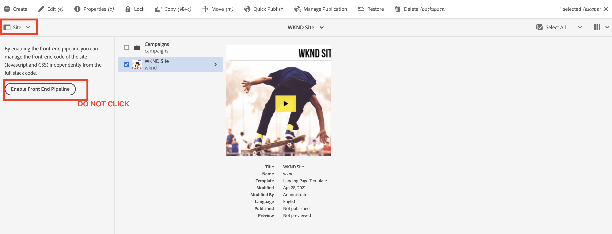

# Update full-stack AEM project to use front-end pipeline {#update-project-enable-frontend-pipeline}

In this chapter, we make config changes to the __WKND Sites project__ to use the front-end pipeline to deploy JavaScript and CSS, rather than requiring a complete full-stack pipeline execution. This decouples the development and deployment lifecycle of front-end and back-end artifacts, allowing for a more rapid, iterative development process overall.

## Objectives {#objectives}

* Update full-stack project to use the front-end pipeline

## Overview of configuration changes in the full-stack AEM project

>[!VIDEO](https://video.tv.adobe.com/v/3409419?quality=12&learn=on)

## Prerequisites {#prerequisites}

This is a multi-part tutorial and it is assumed that you have reviewed the ['ui.frontend' Module](./review-uifrontend-module.md).


## Changes to the full-stack AEM project

There are three project-related config changes and a style change to deploy for a test run, thus in total four specific changes in the WKND project to enable it for the front-end pipeline contract.

1.  Remove the `ui.frontend` module from full-stack build cycle

    * In, the WKND Sites Project 's root `pom.xml` comment the `<module>ui.frontend</module>` submodule entry.

    ```xml
        ...
        <modules>
        <module>all</module>
        <module>core</module>
        <!--
        <module>ui.frontend</module>
        -->                
        <module>ui.apps</module>
        ...
    ```

    * And comment related dependency from the `ui.apps/pom.xml`

    ```xml
        ...
        <!-- ====================================================================== -->
        <!-- D E P E N D E N C I E S                                                -->
        <!-- ====================================================================== -->
            ...
        <!--
            <dependency>
                <groupId>com.adobe.aem.guides</groupId>
                <artifactId>aem-guides-wknd.ui.frontend</artifactId>
                <version>${project.version}</version>
                <type>zip</type>
            </dependency>
        -->    
        ...
    ```

1.  Prepare the `ui.frontend` module for the front-end pipeline contract by adding two new webpack config files.

    * Copy the existing `webpack.common.js` as `webpack.theme.common.js`, and change `output` property and `MiniCssExtractPlugin`, `CopyWebpackPlugin` plugin config params as below:

    ```javascript
    ...
    output: {
            filename: 'theme/js/[name].js', 
            path: path.resolve(__dirname, 'dist')
        }
    ...

    ...
        new MiniCssExtractPlugin({
                filename: 'theme/[name].css'
            }),
        new CopyWebpackPlugin({
            patterns: [
                { from: path.resolve(__dirname, SOURCE_ROOT + '/resources'), to: './clientlib-site' }
            ]
        })
    ...
    ```

    * Copy the existing `webpack.prod.js` as `webpack.theme.prod.js`, and change the `common` variable's location to the above file as

    ```javascript
    ...
        const common = require('./webpack.theme.common.js');
    ...
    ```

    >[!NOTE]
    >
    >The above two 'webpack' config changes are to have different output file and folder names, so we can easily  differentiate between clientlib (Full-stack) and theme generated (front-end) pipeline front-end artifacts. 
    >
    >As you guessed, the above changes can be skipped to use existing webpack configs too but the below changes are required.
    >
    >It's up to you how you want to name or organize them.

    
    * In the `package.json` file, make sure, the  `name` property value is the same as the site name from the `/conf` node. And under the `scripts` property, a `build` script instructing how to build the front-end files from this module.
    
    ```javascript
        {
        "name": "wknd",
        "version": "1.0.0",
        ...

        "scripts": {
            "build": "webpack --config ./webpack.theme.prod.js"
        }

        ...
        }
    ```

1.  Prepare the `ui.content` module for the front-end pipeline by adding two Sling configs.

    * Create a file at `com.adobe.cq.wcm.core.components.config.HtmlPageItemsConfig` - this includes all the front-end files that the `ui.frontend` module generates under the `dist` folder using webpack build process.

    ```xml
    ...
        <css
        jcr:primaryType="nt:unstructured"
        element="link"
        location="header">
        <attributes
            jcr:primaryType="nt:unstructured">
            <as
                jcr:primaryType="nt:unstructured"
                name="as"
                value="style"/>
            <href
                jcr:primaryType="nt:unstructured"
                name="href"
                value="/theme/site.css"/>
    ...
    ```

    >[!TIP]
    >
    >    See the complete [HtmlPageItemsConfig](https://github.com/adobe/aem-guides-wknd/blob/feature/frontend-pipeline/ui.content/src/main/content/jcr_root/conf/wknd/_sling_configs/com.adobe.cq.wcm.core.components.config.HtmlPageItemsConfig/.content.xml) in the __AEM WKND Sites project__.


    *   Second the `com.adobe.aem.wcm.site.manager.config.SiteConfig` with the `themePackageName` value being the same as the `package.json` and `name` property value and `siteTemplatePath` pointing to a `/libs/wcm/core/site-templates/aem-site-template-stub-2.0.0` stub path value.

    ```xml
    ...
        <?xml version="1.0" encoding="UTF-8"?>
        <jcr:root xmlns:sling="http://sling.apache.org/jcr/sling/1.0" xmlns:jcr="http://www.jcp.org/jcr/1.0" xmlns:nt="http://www.jcp.org/jcr/nt/1.0"
                jcr:primaryType="nt:unstructured"
                siteTemplatePath="/libs/wcm/core/site-templates/aem-site-template-stub-2.0.0"
                themePackageName="wknd">
        </jcr:root>
    ...
    ```

    >[!TIP]
    >
    >    See, the complete [SiteConfig](https://github.com/adobe/aem-guides-wknd/blob/feature/frontend-pipeline/ui.content/src/main/content/jcr_root/conf/wknd/_sling_configs/com.adobe.aem.wcm.site.manager.config.SiteConfig/.content.xml) in the __AEM WKND Sites project__.

1.  A theme or styles change to deploy via front-end pipeline for a test run, we are changing `text-color` to Adobe red (or you can pick your own) by updating the `ui.frontend/src/main/webpack/base/sass/_variables.scss`.

    ```css
        $black:     #a40606;
        ...
    ```

Finally, push these changes to your program's Adobe git repository.


>[!AVAILABILITY]
>
> These changes are available on GitHub inside the [__front-end pipeline__](https://github.com/adobe/aem-guides-wknd/tree/feature/frontend-pipeline) branch of the __AEM WKND Sites project__.


## Caution - _Enable Front End Pipeline_ button

The [Rail Selector](https://experienceleague.adobe.com/docs/experience-manager-cloud-service/content/sites/authoring/getting-started/basic-handling.html) 's [Site](https://experienceleague.adobe.com/docs/experience-manager-cloud-service/content/sites/authoring/getting-started/basic-handling.html) option shows the **Enable Front End Pipeline** button upon selecting your site root or site page. Clicking **Enable Front End Pipeline** button will override the above **Sling configs**, make sure **you do not click** this button after deploying above changes via Cloud Manager pipeline execution. 



If it is clicked by mistake, you have to rerun the pipelines to make sure that front-end pipeline contract and changes are restored.

## Congratulations! {#congratulations}

Congratulations, you have updated the WKND Sites project to enable it for the front-end pipeline contract.

## Next steps {#next-steps}

In the next chapter, [Deploy using the Front-End Pipeline](create-frontend-pipeline.md), you will create and run a front-end pipeline and verify how we __moved away__ from the '/etc.clientlibs' based front-end resources delivery.
