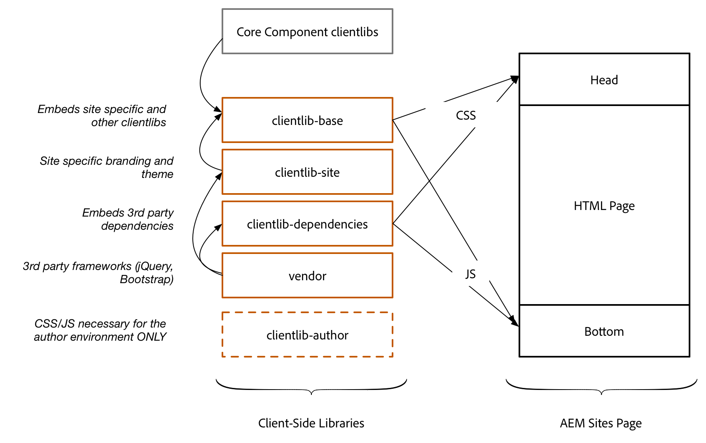
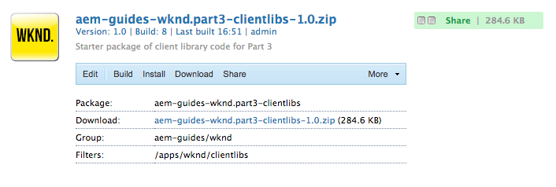
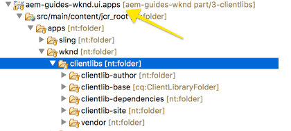
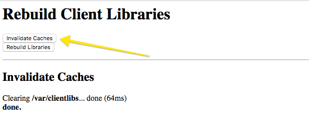
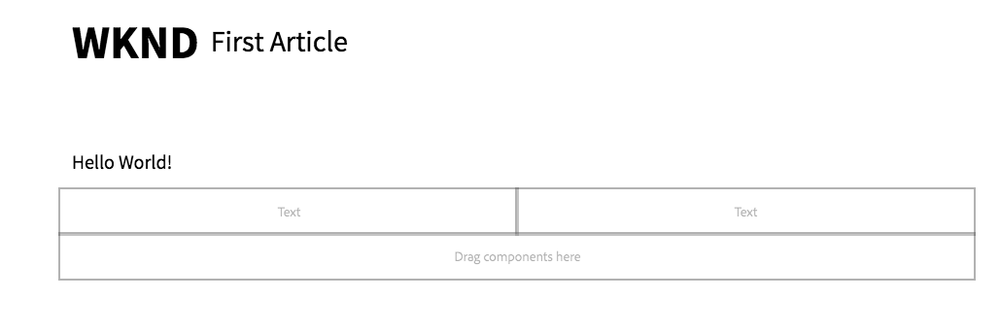
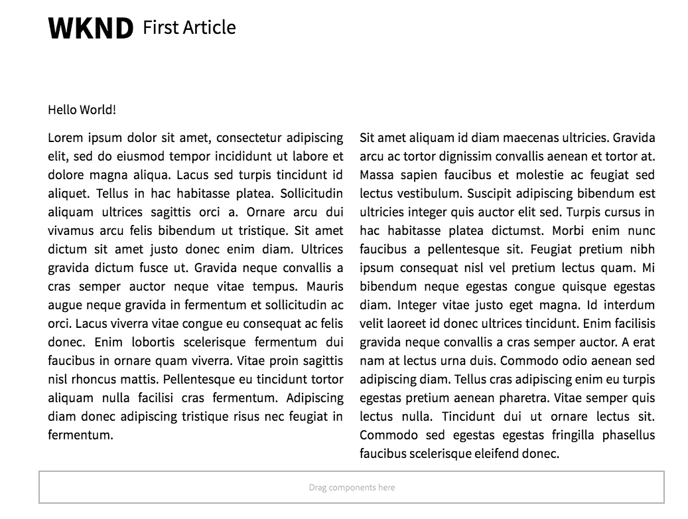
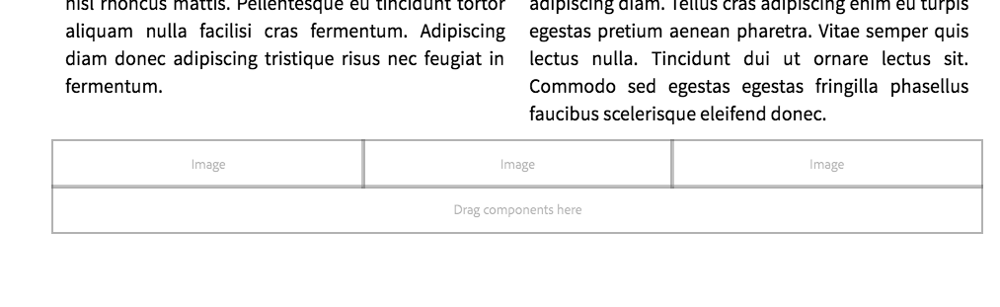
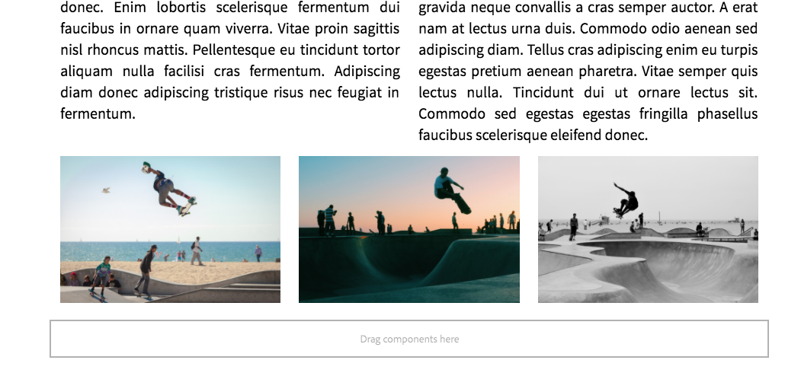
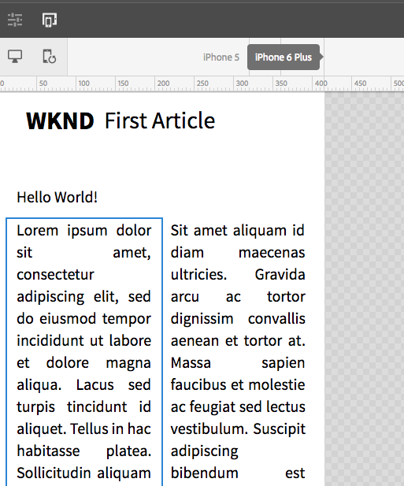
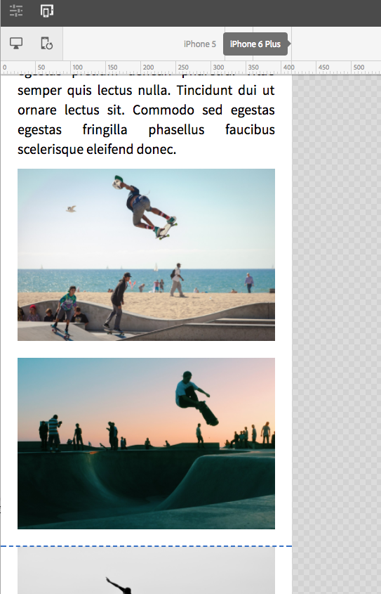

# Getting Started with AEM Sites Part 3 - Client-Side Libraries and Responsive Grid{#getting-started-with-aem-sites-part-client-side-libraries-and-responsive-grid}

Covers creation of AEM Client-Side Libraries or clientlibs to deploy and manage CSS and Javascript for an AEM Sites implementation. Integration with AEM's responsive grid and mobile emulator.

## Prerequisites {#prerequisites}

This is Part 3 of the multi-part tutorial. ** [Part 2 can be found here](../../../../sites/using/getting-started-wknd-tutorial-develop/part2.md) **and an ** [overview can be found here](../../../../sites/using/getting-started-wknd-tutorial-develop.md)**.

You can check out the following branch on GitHub if you want to skip the previous parts:** [part/2-base-page-templates](https://github.com/Adobe-Marketing-Cloud/aem-guides-wknd/tree/part/2-base-page-templates). **

Or you can download and install the Chapter 2 package: [https://github.com/Adobe-Marketing-Cloud/aem-guides-wknd/releases](https://github.com/Adobe-Marketing-Cloud/aem-guides-wknd/releases)

## Front-end Frameworks {#front-end-workflow}

Below are some of the front-end technologies used in the creation of the WKND site. The intention is to give you an idea of how 3rd party frameworks can easily be integrated into an AEM Site.

** [LESS](http://lesscss.org/) **- popular CSS pre-compiler that allows variables and other functionality. AEM client libraries naitively support LESS compilation. Saas or other pre-compilers can be used but would need to be compiled outside of AEM.

** [Boostrap](http://getbootstrap.com/)** - popular framework used to build responsive websites.

** [jQuery](https://jquery.com/) **- popular JavaScript feature rich library for manipulating HTML

## Clientlibs Structure {#clientlibs-structure}

Client-Side Libraries provides a mechanism to organize and manage CSS and JavaScript files necessary for an AEM Sites implementation. The basic goals for client libraries or clientlibs are:

1. Store CSS/JS in small discrete files for easier development and maintenance
1. Manage dependencies on 3rd party frameworks in an organized fashion
1. Minimize the number of client-side requests by concatenating CSS/JS into one or two requests
1. Minify CSS/JS that is delivered to optimize speed/performance of a site

More information about using [Client-Side Libraries can be found here.](https://helpx.adobe.com/experience-manager/6-4/sites/developing/using/clientlibs.html)

Client-Side Libraries provide many ways for organization, below is a convention used by the WKND site and WE.Retail sites and can be applied to most Sites implementations.



High Level Clientlib Architecture

## Implementing Client Libraries {#implement-clientlibs}

Creating a client library is similar to creating any other type of node in AEM. The basic structure includes:

```
[cq:ClientLibraryFolder] - jcr:primaryType
     - categories (String[])
     - embed (String[])
     - dependencies (String[])
     + css.txt (nt:file)
     + js.txt (nt:file)

```

There are a lot of nodes and files for the WKND site client libraries. To expedite the tutorial (and to avoid tedious steps) install the below package that includes all of the client libraries for the WKND site.

Client Libraries are considered code and thus are stored in the **ui.apps** module beneath **/apps/wknd/clientlibs**.

1. The AEM project archetype creates **/apps/clientlibs/clientlib-base** automatically. The below packages will update the clientlib-base definition and create:

    * clientlib-author
    * clientlib-dependencies
    * clientlib-site
    * vendor

1. Download **wknd-sites-clientlibs-chapter-3.zip** and install via [CRX Package Manager](http://localhost:4502/crx/packmgr/index.jsp). Or download the **SRC Code** and unzip directly inside your project on the file system beneath ui.appps/src/main/content/jcr_root/apps/wknd/clientlibs.

   [Get File](assets/aem-guides-wknd_part3-clientlibs.zip)

   SRC Code (ui.apps/src/main/content/jcr_root/apps/wknd/clientlibs)

   [Get File](assets/src-chap3-clientlibs.zip)
   

1. In the **ui.apps** module there should now be a **clientlibs** folder beneath **/apps/wknd**. With 5 folders beneath the clientlibs folder:

   

1. This clientlibrary represents the base level of CSS and JavaScript needed for the WKND site to function. This library won't include any CSS/JS files directly, instead it will include multiple client libraries via the embed property. 

<table border="1" cellpadding="1" cellspacing="0" width="100%"> 
 <tbody> 
  <tr> 
   <td>Name</td> 
   <td>Type</td> 
   <td>Value</td> 
   <td>Description<br /> </td> 
  </tr> 
  <tr> 
   <td>jcr:primaryType</td> 
   <td>Name</td> 
   <td>cq:ClientLibraryFolder</td> 
   <td><em>defines a client library</em></td> 
  </tr> 
  <tr> 
   <td>allowProxy</td> 
   <td>Boolean</td> 
   <td>true</td> 
   <td><em>exposes CSS/JS via /etc.clientlibs</em></td> 
  </tr> 
  <tr> 
   <td>categories</td> 
   <td>String[]</td> 
   <td>wknd.base</td> 
   <td><em>category(s) that allows the clientlib to be referenced</em></td> 
  </tr> 
  <tr> 
   <td>embed</td> 
   <td>String[]</td> 
   <td><p>wknd.webfonts<br /> core.wcm.components.image.v2,<br /> core.wcm.components.breadcrumb.v2,<br /> core.wcm.components.search.v1,<br /> core.wcm.components.form.text.v2,<br /> bootstrap-v3.3.7.js,<br /> wknd.site</p> <p> </p> </td> 
   <td><em>embeds the clientlibs by their respective category. Include any CoreComponent clientlibs here. Also including bootstrap but just the JS. LESS imports is used to include the rest of the bootstrap library. The <strong>wknd.site</strong> category embeds the clientlib-site library. <strong>wknd.webfonts</strong> is split and embedded at the top so that the webfonts are correctly imported.</em></td> 
  </tr> 
 </tbody> 
</table>

   ```xml
   <?xml version="1.0" encoding="UTF-8"?>
   <jcr:root xmlns:cq="http://www.day.com/jcr/cq/1.0" xmlns:jcr="http://www.jcp.org/jcr/1.0"
       jcr:primaryType="cq:ClientLibraryFolder"
       allowProxy="{Boolean}true"
       categories="[wknd.base]"
       embed="[wknd.webfonts,core.wcm.components.image.v2,core.wcm.components.breadcrumb.v2,core.wcm.components.search.v1,core.wcm.components.form.text.v2,bootstrap-v3.3.7.js,wknd.site]"/>
   
   ```

   >[!NOTE]
   >
   >Several Core Components come with client libraries that need to be included on the page in order for the component to function properly. For example see **/apps/core/wcm/components/image/v2/image/clientlibs**. 
   >
   >
   >There are two client libraries in this folder one named **editor** and another named **site. **The **editor** clientlib is meant just for the author environment and typically included by the component dialog. The **site **clientlib is the one that needs to be included in the project's clientlib in order for the component to behave properly. For each Core Component you can view the README.md to understand what each clientlib does: **/apps/core/wcm/components/image/v2/image/README.md**.

1. This clientlibrary embeds some common AEM javascript dependencies that would be used for integrating analytics, ContextHub, [CSRF protection](https://helpx.adobe.com/experience-manager/6-4/sites/developing/using/csrf-protection.html) and other Adobe marketing cloud offerings. The version of jquery that ships with AEM (/libs/clientlibs/granite/jquery) will be used. You can download a newer version of jquery and create a new client library if necessary.

<table border="1" cellpadding="1" cellspacing="0" width="100%"> 
 <tbody> 
  <tr> 
   <td>Name</td> 
   <td>Type</td> 
   <td>Value</td> 
   <td>Description<br /> (tutorial info only don't copy)</td> 
  </tr> 
  <tr> 
   <td>jcr:primaryType</td> 
   <td>Name</td> 
   <td>cq:ClientLibraryFolder</td> 
   <td><em>defines a client library</em></td> 
  </tr> 
  <tr> 
   <td>allowProxy</td> 
   <td>Boolean</td> 
   <td>true</td> 
   <td><em>exposes CSS/JS via /etc.clientlibs</em></td> 
  </tr> 
  <tr> 
   <td>categories</td> 
   <td>String[]</td> 
   <td>wknd.dependencies<br /> </td> 
   <td><em>category(s) that allows the clientlib to be referenced</em></td> 
  </tr> 
  <tr> 
   <td>embed</td> 
   <td>String[]</td> 
   <td>jquery<br /> granite.utils<br /> granite.jquery<br /> cq.jquery<br /> granite.shared<br /> cq.shared<br /> underscore</td> 
   <td><em>embeds jquery and several granite frameworks. Only a single version of jquery is actually embedded as both granite.jquery and cq.jquery are just wrappers.</em></td> 
  </tr> 
 </tbody> 
</table>

   ```xml
   <?xml version="1.0" encoding="UTF-8"?>
   <jcr:root xmlns:cq="http://www.day.com/jcr/cq/1.0" xmlns:jcr="http://www.jcp.org/jcr/1.0"
       jcr:primaryType="cq:ClientLibraryFolder"
       allowProxy="{Boolean}true"
       categories="[wknd.dependencies]"
       embed="[jquery,granite.utils,granite.jquery,cq.jquery,granite.shared,cq.shared,underscore]"/>
   
   ```

   >[!NOTE]
   >
   >The clientlib-dependencies typically consists mostly of Javascript. However since these dependencies are needed for features like ContextHub they will be included in the at the top of the page in the HTML head.

1. **vendor **- This is a single nt:folder that includes all of the 3rd party front-end frameworks used on the site. Currently there is only a **bootstrap** client library beneath the vendor folder. The source files for bootstrap have been included so that bootstrap's LESS variables can be used in the sites LESS directly. A js-only client library has been added (/apps/wknd/clientlibs/vendor/bootstrap/js) to load just the js library only.
1. This is the main client library for the WKND site. It includes site specific LESS files as well as a couple of javascript files. Two files **grid.less**, **main.less** are inspected below in more detail.

<table border="1" cellpadding="1" cellspacing="0" width="100%"> 
 <tbody> 
  <tr> 
   <td>Name</td> 
   <td>Type</td> 
   <td>Value</td> 
   <td>Description<br /> (tutorial info only don't copy)</td> 
  </tr> 
  <tr> 
   <td>jcr:primaryType</td> 
   <td>Name</td> 
   <td>cq:ClientLibraryFolder</td> 
   <td><em>defines a client library</em></td> 
  </tr> 
  <tr> 
   <td>allowProxy</td> 
   <td>Boolean</td> 
   <td>true</td> 
   <td><em>exposes CSS/JS via /etc.clientlibs</em></td> 
  </tr> 
  <tr> 
   <td>categories</td> 
   <td>String[]</td> 
   <td>wknd.site<br /> </td> 
   <td><em>category(s) that allows the clientlib to be referenced</em></td> 
  </tr> 
 </tbody> 
</table>

   **main.less** - **/apps/wknd/clientlibs/clientlib-site/main.less**

   Includes all of bootstrap via a LESS import. A common/variables.less file is created that is heavily based on the bootstrap/variables.less file. It is separate so that the bootstrap source can be kept intact as much as possible. The main.less also includeds a file named grid.less that will be responsible for creating AEM's responsive grid.

   Finally main.less file imports LESS files related to each component that comprises the site. Notice that each component has its own folder and LESS file.

   ```css
   /* WKND main.less */
   
   /* Import Core Bootstrap */
   @import "/apps/wknd/clientlibs/vendor/bootstrap/src/less/bootstrap.less";
   
   /* Bootstrap Overrides */
   @import "site/css/variables.less";
   
   /* Import Responsive Grid */
   @import "site/css/grid.less";
   
   /* Custom Icons for WKND site */
   @import "site/css/wkndicons.less";
   
   /* Common Styles */
   @import "site/css/common.less";

   /* Import WKND page styles first */
   @import "components/page/page.less";
       
   /* Import WKND Components styles */
   @import "components/breadcrumb/breadcrumb.less";
   @import "components/header/header.less";
   @import "components/image/image.less";
   @import "components/layout-container/layout-container.less";
   @import "components/navigation/navigation.less";
   @import "components/search/search.less";
   @import "components/text/text.less";
   @import "components/title/title.less";

   ```

   **grid.less** -** /apps/wknd/clientlibs/clientlib-site/site/css/grid.less**

   Generates the AEM responsive grid that will allow content authors to use all the capabilities of the [AEM Layout Mode](https://docs.adobe.com/docs/en/aem/6-3/author/page-authoring/responsive-layout.html) and the Layout Container. It uses a custom mixin found in grid_base.less to generate the grid. Notice that the Phone and Tablet breakpoints use variables found in the variables.less file. These breakpoints match the breakpoints defined in the empty template type: /conf/wknd/settings/wcm/template-types/empty-page/structure/jcr:content/cq:responsive/breakpoints.

   **grid_base.less **is a file provided by AEM that has been copied into the WKND project's library for simplicity and portability between versions of AEM.

   >[!CAUTION]
   >
   >**The location of the grid_base LESS file provided by AEM has changed from 6.3 to 6.4. If referencing the file directly in your own project ensure that the correct location is used:**
   >* **6.3** Path to Responsive Grid: /etc/clientlibs/wcm/foundation/grid/grid_base.less
   >* **6.4** Path to Responsive Grid: /libs/wcm/foundation/clientlibs/grid/grid_base.less

   ```css
   /*
    * grid_base.less is a file provided by AEM. 
    * For portability between versions of AEM the file has been copied into WKND project's client library.
    *
    * 6.3 Path to Responsive Grid: /etc/clientlibs/wcm/foundation/grid/grid_base.less
    * 6.4 Path to Responsive Grid:  /libs/wcm/foundation/clientlibs/grid/grid_base.less
    * 
    */
    
   @import "grid_base.less";
    
   /* maximum amount of grid cells to be provided */
   @max_col: 12;
    
   /* default breakpoint */
   .aem-Grid {
       .generate-grid(default, @max_col);
       width: auto;
   }
   
   /* phone breakpoint */
   @media (max-width: @screen-sm-min) {
       .aem-Grid {
           .generate-grid(phone, @max_col);
       }
   }
   
   /* tablet breakpoint */
   @media (min-width: (@screen-sm-min + 1)) and (max-width: @screen-lg-min) {
       .aem-Grid {
           .generate-grid(tablet, @max_col);
       }
   }
   
   .aem-GridColumn {
       padding: 0 @grid-gutter-width/2;
   }
   
   .responsivegrid.aem-GridColumn.aem-GridColumn--default--12 {
    padding-left: 0;
    padding-right: 0;
   }
   
   .responsivegrid.aem-GridColumn.aem-GridColumn--default--12 > .aem-GridColumn.aem-GridColumn--default--12 {
       padding-left: 0;
       padding-right: 0;
   }
   
   ```

1. Most of the LESS files under the **clientlib-site/components** folder are empty placeholders. Styles are added in the next chapter to some of the Core Components. For now there are a few basic styles to give the page some structure.

    * **page/page.less** &gt; fixes the width of the root container of the page
    * **image/image.less** &gt; adds a margin to the image component
    * **header/header.less**  &gt; styles the header and includes an additonal style to make it fixed

1. Javascript to add behavior to a component is also included in the clientlib-site/components folder.

   The script **components/header/header.js** adds an additonal CSS class to the header component to make it sticky when the page is scrolled. Javascript files are included by noting them in **/apps/wknd/clientlibs/clientlib-site/js.txt **as seen below:

   ```
   #base=.
   
   components/header/header.js
   ```

1. As a best practice the code base for the Author environment should be nearly identical to the Publish environment. There are certain cases in which some extra CSS/JS is necessary to provide a better authoring experience. The WKND site has a fixed-header design and in the Editor this makes it difficult to select the Header component in edit mode. Therefore a small amount of CSS overrides will be stored in this client library and only loaded in the Author environment. This practice should be used sparingly and only when absolutely necessary.

<table border="1" cellpadding="1" cellspacing="0" width="100%"> 
 <tbody> 
  <tr> 
   <td>Name</td> 
   <td>Type</td> 
   <td>Value</td> 
   <td>Description<br /> </td> 
  </tr> 
  <tr> 
   <td>jcr:primaryType</td> 
   <td>Name</td> 
   <td>cq:ClientLibraryFolder</td> 
   <td><em>defines a client library</em></td> 
  </tr> 
  <tr> 
   <td>categories</td> 
   <td>String[]</td> 
   <td>wknd.author<br /> </td> 
   <td><em>category(s) that allows the clientlib to be referenced</em></td> 
  </tr> 
 </tbody> 
</table>

## Adding Clientlibs to the Page {#clientlibs-to-page}

Next the clientlibs needed to be included via the base page. The Core Component page provides two files designed to include custom clientlibs in the html head for CSS and at the very bottom of the page for JavaScript. The AEM project archetype has already included the **wknd.base** client library. Updates are needed to include **wknd.dependencies** and in the authoring environment **wknd.author**.

In the **ui.apps** module modify files beneath: **/apps/wknd/components/structure/page**

1. This will override /apps/core/wcm/components/page/v2/page/customheaderlibs.html

   ```xml
   <!--/*
       /apps/wknd/components/structure/page/customheaderlibs.html
   
   */-->
   
   <meta name="viewport" content="width=device-width, initial-scale=1, shrink-to-fit=no">
    
   <sly data-sly-use.clientLib="/libs/granite/sightly/templates/clientlib.html"
        data-sly-call="${clientlib.js @ categories='wknd.dependencies'}"/>
   <sly data-sly-use.clientLib="/libs/granite/sightly/templates/clientlib.html"
        data-sly-call="${clientlib.css @ categories='wknd.base'}"/>
        
   <!--/* Load authoring related client libraries */-->
   <sly data-sly-test="${wcmmode.preview || wcmmode.edit}" data-sly-call="${clientLib.all @ categories='wknd.author'}"/>
   
   <!--/* Include Context Hub */-->
   <sly data-sly-resource="${'contexthub' @ resourceType='granite/contexthub/components/contexthub'}"/>
   ```

   This includes the CSS for the **wknd.base **client library and the JS for the **wknd.dependencies** client library. Typically it is a best practice to include JS at the bottom of the page. The wknd.dependencies JS is used for loading libraries that support targeted content like ContextHub and so in this case it is a best practice to load it at the top of the page. The author-specific client library **wknd.author *is also loaded. ***Notice the **wcmmode** conditional, this means that only if the page is open in the Author editing environment will this client library be loaded. More information about the [WCMMode can be found here.](https://helpx.adobe.com/experience-manager/6-3/sites/developing/using/reference-materials/javadoc/com/adobe/cq/sightly/SightlyWCMMode.html)

   ContextHub is a JS based framework for personalization, it is loaded in the header. This tutorial does not cover implementing ContextHub but more information about [ContextHub can be found here.](https://helpx.adobe.com/experience-manager/6-4/sites/developing/using/contexthub.html)

1. This will be included at the very bottom of the page and will include the JS for **wknd.base** client library. It will override: /apps/core/wcm/components/page/v2/page/customfooterlibs.html. No changes are needed as the AEM project archetype created this file already.

   ```xml
   <!--/*
       /apps/wknd/components/structure/page/customfooterlibs.html
   */-->
   <sly data-sly-use.clientlib="/libs/granite/sightly/templates/clientlib.html">
       <sly data-sly-call="${clientlib.js @ categories='wknd.base'}"/>
   </sly>
   ```

1. Deploy the code base to add both client libraries and updated page component to the local AEM instance. 
1. Updating the base page component will update any pages created via the WKND Article Template.

    1. Open up a page created from the Article Template: [http://localhost:4502/editor.html/content/wknd/en/first-article.html](http://localhost:4502/editor.html/content/wknd/en/first-article.html). You should see the updated fonts and fixed width container.
    1. View the page as published by clicking the **Page Properties **menu icon (upper left, next to the sidebar icon) **&gt;** **"View as Published"** button
    
    1. This will open a new tab with **wcmmode=disabled** added as a URL parameter. Viewing the page with wcmmode=disabled is a great way to debug/develop as there is a significant amount of Javascript for the Sites editor to support component authoring. [http://localhost:4502/content/wknd/en/first-article.html?wcmmode=disabled](http://localhost:4502/content/wknd/en/first-article.html?wcmmode=disabled)
    
    1. Viewing the page source you should see following tags:

    

   ```xml
   /* Source of http://localhost:4502/content/wknd/first-article.html?wcmmode=disabled */
   <html>
       <head>
       ...
           <script type="text/javascript" src="/etc.clientlibs/wknd/clientlibs/clientlib-dependencies.js"></script>
           <link rel="stylesheet" href="/etc.clientlibs/wknd/clientlibs/clientlib-base.css" type="text/css">
       </head>
       <body>
           ...
               <script type="text/javascript" src="/etc.clientlibs/wknd/clientlibs/clientlib-base.js"></script>
   
       </body>
   </html>
   ```

   The main takeaway is that the CSS and Javascript is dynamically loaded from a path that starts with **/etc.clientlibs**. The client libraries are stored beneath **/apps/wknd** to make it easier from an organizational standpoint as it is in the same directory as our component code. It is critical on the publish side that the client libraries are **not** served from /apps as this path should be restricted for security reasons using the [Dispatcher filter section](https://docs.adobe.com/docs/en/dispatcher/disp-config.html#Example /filter section). The [allowProxy property](https://docs.adobe.com/docs/en/aem/6-3/develop/the-basics/clientlibs.html#Locating a Client Library Folder and Using the Proxy Client Libraries Servlet) of the client library ensures the CSS and JS are served from /etc.clientlibs. [](https://helpx.adobe.com/experience-manager/dispatcher/using/dispatcher-configuration.html#ConfiguringAccesstoContentfilter) [](https://helpx.adobe.com/experience-manager/6-4/sites/developing/using/clientlibs.html#main-pars_title_8ced)

## Debugging Client Libraries {#debugging-clientlibs}

With different methods of **categories** and **embeds** to include multiple client libraries it can be cumbersome to troubleshoot. AEM exposes several tools to help with this. One of the most important tools is **Rebuild Client Libraries** which will force AEM to re-compile any LESS files and generate the CSS.

* [Dump Libs](http://localhost:4502/libs/granite/ui/content/dumplibs.html) - Lists all of the client libraries registered in the AEM instance. **&lt;host&gt;/libs/granite/ui/content/dumplibs.html**

* [Test Output](http://localhost:4502/libs/granite/ui/content/dumplibs.test.html)** **- allows a user to see the expected HTML output of clientlib includes based on category.** &lt;host&gt;/libs/granite/ui/content/dumplibs.test.html**

* [Libraries Dependencies validation](http://localhost:4502/libs/granite/ui/content/dumplibs.validate.html)** - **highlights any dependencies or embedded categories that cannot be found. **&lt;host&gt;/libs/granite/ui/content/dumplibs.validate.html**

* [Rebuild Client Libraries](http://localhost:4502/libs/granite/ui/content/dumplibs.rebuild.html) - allows a user to force AEM to rebuild all of the client libraries or invalidate the cache of client libraries. This tool is particularly effective when developing with LESS as this can force AEM to re-compile the generated CSS. In general it is more effective to Invalidate Caches and then perform a page refresh versus rebuilding all of the libraries. **&lt;host&gt;/libs/granite/ui/content/dumplibs.rebuild.html**

 

## Authoring with Responsive Grid {#responsive-grid-use}

At this point everything needed to leverage [AEM's Responisve Grid](https://helpx.adobe.com/experience-manager/6-4/sites/authoring/using/responsive-layout.html) and Layout features should be enabled. Try resizing a few components using different device widths to see this working.

1. Add a text component and use the Layout Mode to shrink it to half the page width. Repeat with a second text component to get 2 components side by side.

   

   Populate the Text Component with some text. 

   

1. Add 3 Image components to the page. Next resize each of them so that the three Image components equal 1/3 of the page width and sit side by side.

   

   Populate the images with some pictures.

   

1. While in [Layout](https://helpx.adobe.com/experience-manager/6-4/sites/authoring/using/responsive-layout.html) mode use the emulator to preview the page in Mobile views. Notice that the columns simply shrink, creating a layout that is not optimized for the screen device.

   

   Resize the components to make them stack vertically in Mobile view by expanding the width to full page width for each one.

   

1. You can upload several images to AEM Assets that match the WKND lifestyle design. These images will be used later. Imagery is license-free from [https://unsplash.com/](https://unsplash.com/)

   You can download and install the below package on your local AEM instance.

   [Get File](assets/wknd-dam-assets.zip)

   >[!CAUTION]
   >
   >The storing of DAM assets outside of AEM and in source control is rare. If you are following the tutorial on the Git repo we have added the DAM assets to the project. This is to allow someone to pick up the tutorial at any point and not a best practice.

## Help! {#help}

## Next Steps {#next-steps}

Next part in the tutorial: [Getting Started with AEM Sites Part 4 - Developing with the Style System](../../../../sites/using/getting-started-wknd-tutorial-develop/part4.md)

Download the finished package for this part of the tutorial: ** [https://github.com/Adobe-Marketing-Cloud/aem-guides-wknd/releases](https://github.com/Adobe-Marketing-Cloud/aem-guides-wknd/releases)**
