# Getting Started with AEM Sites Part 4 - Developing with the Style System{#getting-started-with-aem-sites-part-developing-with-the-style-system}

Covers using the Style System to extend Core Components with brand-specific CSS and advanced policy configurations of the Template Editor. Content Fragments are also integrated to create long form article text.

## Prerequisites {#prerequisites}

This is Part 4 of the multi-part tutorial. ** [Part 3 can be found here](/help/getting-started-wknd-tutorial-develop/part3.md) **and an ** [overview can be found here](/help/getting-started-wknd-tutorial-develop/getting-started-wknd-tutorial-develop.md)**.

You can check out the following branch on GitHub if you want to skip the previous parts: [part/3-clientlibs](https://github.com/Adobe-Marketing-Cloud/aem-guides-wknd/tree/part/3-clientlibs). Or you can download and install the Chapter 3 package: ** [https://github.com/Adobe-Marketing-Cloud/aem-guides-wknd/releases](https://github.com/Adobe-Marketing-Cloud/aem-guides-wknd/releases)**

## Component Planning {#component-planning}

We will identify areas of the article mockup to turn into editable components.

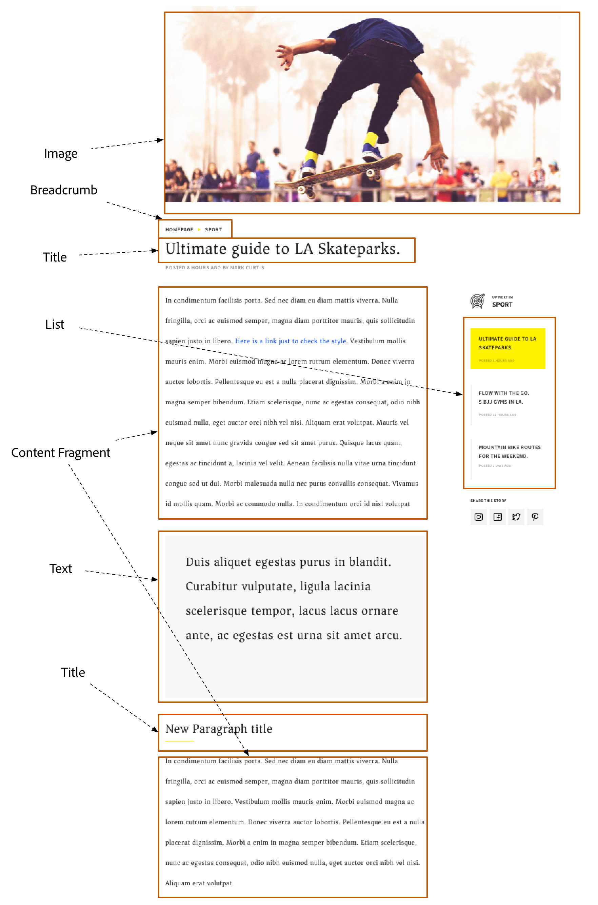

** [Breadcrumb](https://github.com/Adobe-Marketing-Cloud/aem-core-wcm-components/tree/master/content/src/content/jcr_root/apps/core/wcm/components/breadcrumb/v2/breadcrumb)**

* Configurable start level
* Option to show hidden navigation items
* Exclude the current page from the breadcrumb

** [Content Fragment](https://helpx.adobe.com/experience-manager/6-4/assets/using/content-fragments.html)**

* Allow for article text (copy) to be created and managed independently of a page
* Promotes reuse and variations for cross-channel

** [Image](https://github.com/Adobe-Marketing-Cloud/aem-core-wcm-components/tree/master/content/src/content/jcr_root/apps/core/wcm/components/image/v2/image)**

* Smart loading of optimal rendition
* In-place editing, cropping, rotating, and resizing
* Image title, description, accessibility text and link

** [List](https://github.com/Adobe-Marketing-Cloud/aem-core-wcm-components/tree/master/content/src/content/jcr_root/apps/core/wcm/components/list/v2/list)**

* Multiple sources:

    * List page children
    * List tagged items
    * List query result
    * List static items

* Ordering, pagination and limit
* Styles

** [Text](https://github.com/Adobe-Marketing-Cloud/aem-core-wcm-components/tree/master/content/src/content/jcr_root/apps/core/wcm/components/text/v2/text)**

* In-place editing
* Rich Text authoring

** [Title](https://github.com/Adobe-Marketing-Cloud/aem-core-wcm-components/tree/master/content/src/content/jcr_root/apps/core/wcm/components/title/v2/title)**

* In-place editing
* Use the Page title with option to override the text

The Core Components provide all the above functionality. We will focus on styling the components to match the mockups.

## Style System {#style-system}

The [Style System](https://helpx.adobe.com/experience-manager/6-3/release-notes/style-system-fp.html) allows developers and template editors to create multiple visual variations of a component. Authors can then in turn decide which style to use when composing a page. We will leverage the Style System throughout the rest of the tutorial to achieve several unique styles, while leveraging Core Components in a low code approach.

The general idea with the Style System is that authors can choose various styles of how a component should look. The "styles" are backed by additional CSS classes that are injected into the outer div of a component. In the client libraries CSS rules are added based on these style classes so that the component changes appearance.

You can find [detailed documentation for Style System here.](https://helpx.adobe.com/experience-manager/6-3/release-notes/style-system-fp.html) There is also a great [video overview for using the Style System](https://helpx.adobe.com/experience-manager/kt/sites/using/style-system-feature-video-use.html).

## Title Component {#title-component}

At this point the Title Component has been proxied into the project under **/apps/wknd/components/content/title**. There is also an empty LESS file that will contain the CSS styles for the Title component:** /apps/wknd/clientlibs/clientlib-site/components/title/title.less**.

The mockups contain a unique style for the Title component with an underline. Instead of creating 2 components or modifying the component dialog, the Style System can be used to allow authors the option to add an underline style.

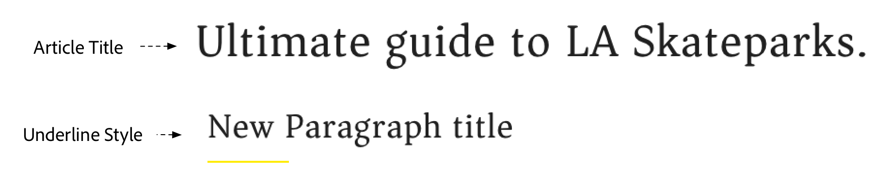

>[!NOTE]
>
>It is considered a best practice to always tightly scope styles to the target component. This ensures that extra styles don't affect other areas of the page.
>
>All Core Components adhere to a strict ** [BEM notation](https://github.com/Adobe-Marketing-Cloud/aem-core-wcm-components/wiki/CSS-coding-conventions)**. It is a best practice to target the outer CSS class when creating a default style for a component. Another best practice is to target class names specified by the Core Component BEM notation rather than HTML elements.

**Title Component BEM Notation**

```
BLOCK cmp-title
    ELEMENT cmp-title__text
```

1. In the **ui.apps** module create a new folder named **styles **beneath **/apps/wknd/clientlibs/clientlib-site/components/title**
1. Create a file named **default.less** beneath the style folder in the previous step: **/apps/wknd/clientlibs/clientlib-site/components/title/styles/default.less**

   Add the following code:

   ```css
   /* WKND Title Default style */
   
   .cmp-title {
    
    font-family: @font-family-serif;
    
    h1 {
     font-size: 48px;
    }
    
    h2 {
     font-size: 36px;
    }
    
    h3 {
     font-size: 30px;
    }
    
    h4 {
     font-size: 24px;
    }
    
    h5 {
     font-size: 20px;
    }
    
    h6 {
     font-size: 16px;
    }
   }
   ```

   This will change the font family to a Serif font and change the default sizes for header elements.

1. Create a file named **underline.less** beneath the style folder in the previous step: **/apps/wknd/clientlibs/clientlib-site/components/title/styles/underline.less**

   Add the following code:

   ```css
   /* WKND Title Underline style */
   
   .cmp-title--underline {
    
    .cmp-title {
     .cmp-title__text {
      &:after {
      display: block;
         width: 84px;
         padding-top: 8px;
         content: '';
         border-bottom: 2px solid @brand-primary;
      }
     }
    }
   }
   
   ```

   This will add a partial underline beneath the title component with the WKND's brand primary color (yellow).

1. Update **/apps/wknd/clientlibs/clientlib-site/components/title/title.less **with the following code to inculde the default and underline styles:

   ```css
   /* WKND Title Styles */
   
   @import (once) "styles/default.less";
   @import (once) "styles/underline.less";
   ```

   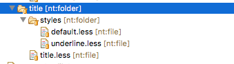

1. 
1. Click the Title Component in the Layout Container to open its policy configuration:

   <!--
   Comment Type: annotation
   Last Modified By: pid90611
   Last Modified Date: 2018-02-13T08:44:40.769-0500
   "its policy configuration"
   -->

   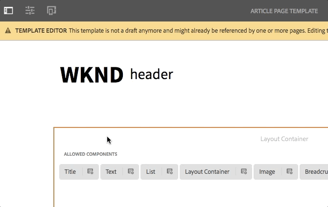

1. Update the Policy with the following values:

   Policy Title &#42; : **WKND Title - Article**

   Properties &gt; Sizes &gt; **Check all sizes**

   Properties &gt; Styles Tab &gt; Add a new style

   **Underline** : **cmp-title--underline**

   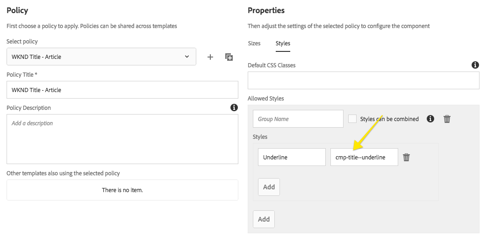

   Notice how ***cmp-title--underline*** added in the template policy matches top level CSS class rule specified in the **underline.less file.** 

1. You should now be able to apply the style to a Title component on a page using the Article Template. Navigate to: [https://localhost:4502/editor.html/content/wknd/en/first-article.html](https://localhost:4502/editor.html/content/wknd/en/first-article.html)

   

   View the HTML source of the Title Component when no style is applied:

   ```xml
   <div class="title aem-GridColumn aem-GridColumn--default--12">
       <div class="cmp-title">
           <h2 class="cmp-title__text">New paragraph</h2>
       </div>
   </div>
   ```

   HTML source of the Title component when the Underline style is applied:

   ```xml
   <div class="title cmp-title--underline aem-GridColumn aem-GridColumn--default--12">
       <div class="cmp-title">
           <h2 class="cmp-title__text">New paragraph</h2>
       </div>
   </div>
   ```

   Note that CSS classes applied through the Style System always populate the outer div surrounding the component.

## Text Component {#text-cmp-component}

Next we will add some additional styles to the text component so that authors are able to create a Quote Block style, in addition to standard article text.


**Text Component BEM Notation**

```
BLOCK cmp-text
    ELEMENT cmp-text__paragraph (only present if text is NOT Rich Text)
```

1. Beneath **/apps/wknd/clientlibs/clientlib-site/components/text**

    1. Create a new folder named **styles**
    1. In the **styles** folder create a file named **default.less**
    
    1. In the **styles** folder create a file named **quote.less**

   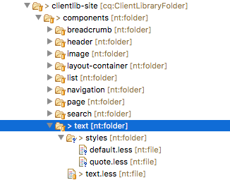

1. Populate **/apps/wknd/clientlibs/clientlib-site/components/text/styles/default.less **with the following:

   ```css
   /* WKND Text Default style */
   
   .cmp-text {
    
    font-family: @font-family-serif;
    
       p {
        *padding: 0 20px;
        text-align: justify;
        font-size: 20px;
        line-height: 2.42857143;
       }
   }
   
   ```

1. Populate **/apps/wknd/clientlibs/clientlib-site/components/text/styles/quote.less **with the following:

   ```css
   /* WKND Text Quote style */
   
   .cmp-text--quote {
   
         background-color:@brand-secondary;
         padding: 1em 3em;
        margin: 1em 0em;
         
         blockquote {
          margin: 0;
          font-size: 36px;
          border: none;
          padding: 14px 0px;
         }
         
         u {
          text-decoration: none;
          font-family: @font-family-sans-serif;
          &:before {
                   border-top: 2px solid @brand-primary;
                   content: '';
                   display: block;
                   width: 80px;
          }
         }
   }
   
   ```

1. Update **/apps/wknd/clientlibs/clientlib-site/components/text/text.less **to include the **default.less** and **quote.less** files:

   ```css
   /* WKND Text Styles */

   @import (once) "styles/default.less";
   @import (once) "styles/quote.less";

   ```

1. 
1. Click the Text Component in the Layout Container to open its policy configuration. Configure the following:

    1. Policy Title &#42; = **WKND Text - Article**
    1. Plugins &gt; Formatting &gt; Check **Show underline option**
    1. Plugins &gt; Paragraph Styles &gt; Check **Enable paragraph styles**. Remove all elements except for **Paragraph** and **Quote**
    
    1. Styles &gt; Add a new Style named **Quote Block **with a value of **cmp-text--quote**

   

1.

    1. Edit the text component (pencil icon)
    1. Expand the RTE to full screen
    1. Use the Paragraph dropdown to create a Block Quote and add a famous quote.
    1. On a new line below the Block Quote create a paragraph element and add the name of the author
    1. Apply the Underline RTE style to the Author Name
    1. Save changes
    1. Change the Style to Quote Block style

   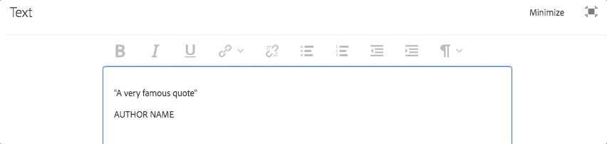 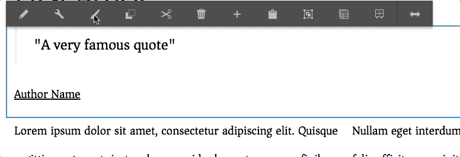

## Breadcrumb Component {#breadcrumb-component}

The Breadcrumb component as offered from the Core Component meets our functional requirements. It has already been proxied into our project, we will add some styling to match the design. We will also make the Breadcrumb component a fixed component as part of the Article Template to promote consistency across Article Pages. For now only a default style will be enabled for the Breadcrumb component.

**Breadcrumb BEM Notation:**

```
BLOCK cmp-breadcrumb
    ELEMENT cmp-breadcrumb__list
    ELEMENT cmp-breadcrumb__item
    ELEMENT cmp-breadcrumb__item-link
```

1. Beneath **/apps/wknd/clientlibs/clientlib-site/components/breadcrumb**

    1. Create a new folder named **styles**
    1. In the **styles** folder create a file named **default.less**

1. Update **default.less**

   /apps/wknd/clientlibs/clientlib-site/components/breadcrumb/styles/default.less with the following:

   ```css
   /* WKND Breadcrumb Default styles */
   
   .cmp-breadcrumb {
   
    .cmp-breadcrumb__list {
      padding: @breadcrumb-padding-vertical @breadcrumb-padding-horizontal 0px 0px;
      margin-bottom: 0px;
      margin-top:30px;
      list-style: none;
      background-color: @breadcrumb-bg;
      border-radius: @border-radius-base;
      font-size: @font-size-small;
       
       @media (max-width: @screen-md) {
           margin-top: 0px;
       } 
       @media (max-width: @screen-xs) {
           font-size: @font-size-small;
       }
   }
        
    .cmp-breadcrumb__item {
       display: inline-block;
       padding:10px 5px;
       text-transform: uppercase;
         
       &:before {
         font-family: 'Wkndicons';
         content: "\e80d";
         color: @brand-primary;
         padding-right: 5px;
       }
       
       &:first-child {
        padding-left: 0;
        &:before {
         content: none;
        }
       }
     }
     
     .cmp-breadcrumb__item-link {
       color:  @breadcrumb-color;
        text-decoration:none;
        font-weight: 600;
        &:first {
            padding-left: 0px;
        }
     }
     
    }  
   ```

1. Update **breadcrumb.less**

   /apps/wknd/clientlibs/clientlib-site/components/breadcrumb/breadcrumb.less to include default.less file:

   ```css
   /* WKND Breadcrumb styles */
   
   @import (once) "styles/default.less";
   ```

1. If you have been editing the code base within Eclipse or another IDE, deploy the code to AEM to validate that the Breadcrumb LESS has been added to the code base.

   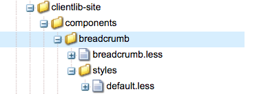

   Breadcrumb component and LESS file are deployed

## Content Fragment Component {#content-fragment}

For the article body we will leverage [AEM Content Fragments](https://helpx.adobe.com/experience-manager/6-4/assets/using/content-fragments.html). Content Fragments are de-coupled from the presentation layer and promote reuse of content across channels. The editorial UI of Content Fragments lends itself to working with large amounts of text. We will add a component to the WKND application to be able to reference Content Fragments into an article page. To view an [overview of Content Fragments click here.](/help/content-fragments-feature-video-understand.md)

1. The Content Fragment component is a separate module of AEM Core Components. The paren pom.xml must be updated to ensure it is available on AEM.

   Add the following dependency to **aem-guides-wkn/pom.xml**:

   ```xml
   //pom.xml
   
   ...
   <dependencies>
   ...
   <dependency>
       <groupId>com.adobe.cq</groupId>
       <artifactId>core.wcm.components.extension</artifactId>
       <type>zip</type>
       <version>1.0.0</version>
   </dependency>
   ...
   </dependencies>
   ```

1. Make the following updates to the ui.apps/pom.xml:

   ```xml
   // ui.apps/pom.xml
   
   ...
   
   <dependencies>
   ...
       <dependency>
           <groupId>com.adobe.cq</groupId>
    <artifactId>core.wcm.components.extension</artifactId>
    <type>zip</type>
       </dependency>
   ...
   </dependencies>
   ```

   ```xml
   // ui.apps/pom.xml
   
   <plugins>
   ...
   
     <!-- ====================================================================== -->
               <!-- V A U L T   P A C K A G E   P L U G I N                                -->
               <!-- ====================================================================== -->
               <plugin>
                   <groupId>com.day.jcr.vault</groupId>
                   <artifactId>content-package-maven-plugin</artifactId>
                   <extensions>true</extensions>
                   <configuration>
                       <filterSource>src/main/content/META-INF/vault/filter.xml</filterSource>
                       <verbose>true</verbose>
                       <failOnError>true</failOnError>
                       <group>aem-guides/wknd</group>
                       <embeddeds>
                           <embedded>
                               <groupId>com.adobe.aem.guides</groupId>
                               <artifactId>aem-guides-wknd.core</artifactId>
                               <target>/apps/wknd/install</target>
                           </embedded>
                       </embeddeds>
                       <subPackages>
                           <subPackage>
                               <groupId>com.adobe.cq</groupId>
                               <artifactId>core.wcm.components.all</artifactId>
                               <filter>true</filter>
                           </subPackage>
                           <!-- Add Extension as a Sub Package -->
                           <subPackage>
                      <groupId>com.adobe.cq</groupId>
                      <artifactId>core.wcm.components.extension</artifactId>
                      <filter>true</filter>
                           </subPackage>
                       </subPackages>
                   </configuration>
               </plugin>
   ...
   </plugins>
   ```

1. There is a Content Fragment reference component in AEM Core Components. It was not included automatically by the AEM project archetype. Manually proxy the component into the WKND code base.

   Create a **cq:Component** node named **contentfragment** beneath **/apps/wknd/components/content.**

   Add the following properties to the node:

   | Name |Type |Value |
   |---|---|---|
   | componentGroup |String |**WKND.Content** |
   | jcr:description |String |**Displays content from a referenced Content Fragment** |
   | jcr:title |String |**Content Fragment** |
   | *jcr:primaryType* |*Name* |*cq:Component* |
   | sling:resourceSuperType |String |**core/wcm/extension/components/contentfragment/v1/contentfragment** |
   | cq:isContainer |Booean |true |

   ```xml
   <?xml version="1.0" encoding="UTF-8"?>
   <jcr:root xmlns:sling="https://sling.apache.org/jcr/sling/1.0" xmlns:cq="https://www.day.com/jcr/cq/1.0" xmlns:jcr="https://www.jcp.org/jcr/1.0"
       cq:isContainer="{Boolean}true"
       jcr:primaryType="cq:Component"
       componentGroup="WKND.Content"
       sling:resourceSuperType="core/wcm/extension/components/contentfragment/v1/contentfragment"
       jcr:title="Content Fragment"
       jcr:description="Displays content from a referenced Content Fragment"/>
   ```

1. Following the other examples for Breadcrumb, Text, and Title:

    1. Create a new folder beneath **/apps/wknd/clientlibs/clientlib-site/components/** named **contentfragment**. 
    
    1. Beneath this folder create a new file named **contentfragment.less. **
    1. Create a folder named** styles**
    1. Create a file named **default.less**

   Populate the contentfragment.less and default.less with the following:

   ```css
   /* WKND Content Fragment style - contentfragment.less */
   
   @import (once) "styles/default.less";
   ```

   ```css
   /* WKND Content Fragment style - default.less */
   
   .cmp-contentfragment {
    
    font-family: @font-family-serif;
    
       p {
        text-align: justify;
        font-size: 20px;
        line-height: (@line-height-base + 1);
       }
   }
   ```

   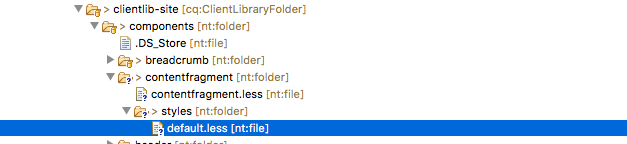

1. Add a line to the bottom of /apps/wknd/clientlibs/clientlib-site/main.less file to import the contentfragment.less file. The full contents of main.less should look like this:

   ```css
   /* WKND main.less */
   @charset "UTF-8";
   @import url('https://fonts.googleapis.com/css?family=Source+Sans+Pro:400,600|Asar');
   
   /* Import Core Bootstrap */
   @import "/apps/wknd/clientlibs/vendor/bootstrap/src/less/bootstrap.less";
   
   /* Bootstrap Overrides */
   @import "site/css/variables.less";
   
   /* Import Responsive Grid */
   @import "site/css/grid.less";
   
   /* Custom Icons for WKND site */
   @import "site/css/wkndicons.less";
   
   /* Common Styles */
   @import "site/css/common.less";

   /* Import WKND page styles first */
   @import "components/page/page.less";
       
   /* Import WKND Components styles */
   @import "components/breadcrumb/breadcrumb.less";
   @import "components/header/header.less";
   @import "components/image/image.less";
   @import "components/layout-container/layout-container.less";
   @import "components/navigation/navigation.less";
   @import "components/search/search.less";
   @import "components/text/text.less";
   @import "components/title/title.less";
   @import "components/contentfragment/contentfragment.less";

   ```

1. Enable the Content Fragment by updating the Layout Container Policy

    1. Navigate to the **Article Page Template:** [https://localhost:4502/editor.html/conf/wknd/settings/wcm/templates/article-page-template/structure.html](https://localhost:4502/editor.html/conf/wknd/settings/wcm/templates/article-page-template/structure.html)
    
    1. Select the main** Layout Container **and click its Policy Icon
    1. Update the **Allowed Components** to include the Content Fragment component under **WKND.Content**

   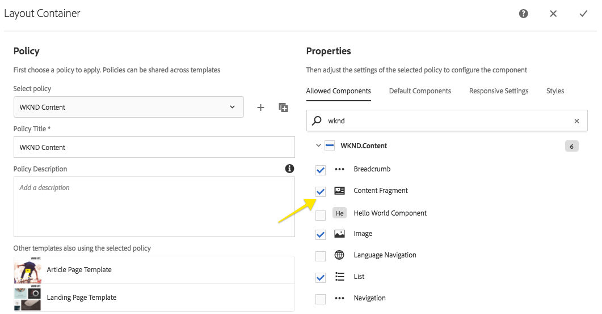

1. The Content Fragment component should now be enabled and allowed to be added to a page.

   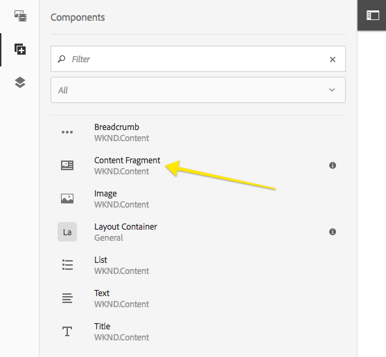

   Empty Content Fragment component added to a page.

1. You can create a new Content Fragment by navigating to [https://localhost:4502/assets.html/content/dam](https://localhost:4502/assets.html/content/dam) and clicking the Create button &gt; Content Fragment from the dropdown. [More information about authoring Content Fragments.](https://helpx.adobe.com/experience-manager/6-4/assets/using/content-fragments.html)

   

   Content Fragment author UI.

1. Navigate back to the content page in which the Content Fragment component was added (Step 4). Click the Wrench icon to bring up the dialog. Using the path finder you can navigate and select an existing content fragment from the DAM. Optionally you can use the Asset Finder filter to restict the assets to only Content Fragments and Drag+Drop one of the Content Fragments on to the component.

   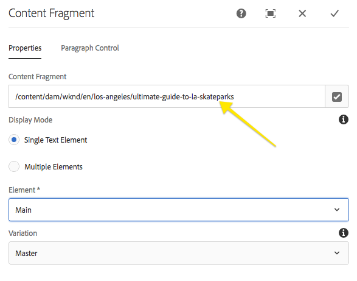

   Editing the Content Fragment component dialog to reference a content fragment.

   You will notice that each paragraph of the Content Fragment has a drop-zone to embed additional components within the Content Fragment. You will also notice that the content of the Content Fragment is read-only. This is by design so that the Content Fragment can only be updating by editing the original fragment.

## List Component {#list-component}

The List component as offered from the Core Component will be used to populate an Up Next list of articles. A List component will also be made a fixed part of the Article Page Template to promote consistency across Article Pages. The List component can be used for other parts of the site so a unique style will be created for the Up Next variation.

**List BEM Notation:**

```
BLOCK cmp-list
    ELEMENT cmp-list__item
    ELEMENT cmp-list__item-link
    ELEMENT cmp-list__item-title
    ELEMENT cmp-list__item-date
```

1. Beneath **/apps/wknd/clientlibs/clientlib-site/components/list**

    1. Create a new folder named **styles**
    1. In the **styles** folder create a file named **default.less**
    
    1. In the **styles** folder create a file named **upnext.less**

   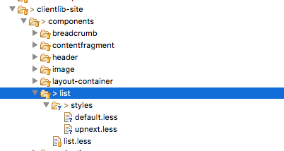

1. Populate the **default.less** file with the following:

   ```css
   /* WKND List Default Style */

   .cmp-list {
    
    float:left;
    padding:0;
    
    .cmp-list__item {
     list-style: none;
     float:left;
     width:100%;
     margin-bottom:1em;
    }
    
    .cmp-list__item-link {
     font-weight: 600;
     float:left;
     width:100%;
     padding: 0.5rem 1rem;
     
     &:hover {
      background: @brand-secondary;
     }
    }
    
    .cmp-list__item-title {
     width:100%;
     float:left;
    }
    
    .cmp-list__item-date {
     width:100%;
     float:left;
     color: @gray-light;
     font-size: @font-size-small; 
    }
    
   }
   ```

1. Populate **upnext.less **with the following:

   ```css
   /* WKND List Up Next Style */
       
   .cmp-list--upnext {
    
    .cmp-list {
      
      padding-left: 0em;
      
      .cmp-list__item {
       list-style: none;
       float:left;
       width:100%; 
       margin-bottom:1em;
      }
      
      .cmp-list__item-link {
       font-weight: normal;
       height: 120px;
       border-left: 6px solid @brand-secondary;
       
       &:hover {
        background: @brand-primary;
        border-color: @text-color;
       }
          
      }
      
      .cmp-list__item-title {
       color: @text-color;
       padding: 5px;
       text-transform: uppercase;
       
      }
      
      .cmp-list__item-date {
       color: @gray-light;
       font-size: @font-size-xsmall; 
       padding: 5px;
       text-transform: uppercase;
      }
      
     }
   }     
     
   ```

1. Update **list.less **with the following to include the **default** and **upnext** styles:

   ```css
   /* WKND List Styles */
   
   @import (once) "styles/default.less";
   @import (once) "styles/upnext.less";
   ```

1. Add a line to the bottom of **/apps/wknd/clientlibs/clientlib-site/main.less** file to import the **list.less** file. The full contents of **main.less** should look like this:

   ```css
   /* WKND main.less */
   
   /* Import Core Bootstrap */
   @import "/apps/wknd/clientlibs/vendor/bootstrap/src/less/bootstrap.less";
   
   /* Bootstrap Overrides */
   @import "site/css/variables.less";
   
   /* Import Responsive Grid */
   @import "site/css/grid.less";
   
   /* Custom Icons for WKND site */
   @import "site/css/wkndicons.less";
   
   /* Common Styles */
   @import "site/css/common.less";

   /* Import WKND page styles first */
   @import "components/page/page.less";
       
   /* Import WKND Components styles */
   @import "components/breadcrumb/breadcrumb.less";
   @import "components/header/header.less";
   @import "components/image/image.less";
   @import "components/layout-container/layout-container.less";
   @import "components/navigation/navigation.less";
   @import "components/search/search.less";
   @import "components/text/text.less";
   @import "components/title/title.less";
   @import "components/contentfragment/contentfragment.less";
   @import "components/list/list.less";
   ```

1. 
1. Click the policy icon for the **List Component** in the Layout Container to open its policy configuration. Configure the following:

    1. Policy Title &#42; = **WKND List - Article**
    1. List Settings &gt; Date Format &gt; **EEEE, d MMM y**
    1. Styles &gt; Add a new Style named **Up Next **with a value of **cmp-list--upnext**

   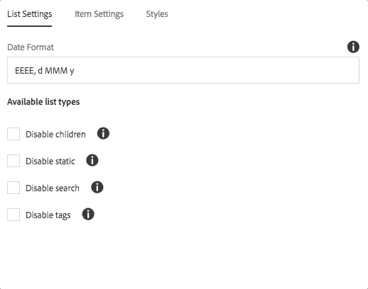

1.

    1. Drag + Drop a List Component on to the page
    1. Click the wrench icon to configure the List component
    1. List Settings &gt; Build List Using &gt; **Fixed List**

        1. Under** **Options for Fixed List** **&gt; **Add a couple of pages**

    1. Item Settings &gt; Check **Link Items**, **Show date**

   

   Several dynamic sources can be configured for the List component including:

    * Child pages
    * Tagged items
    * Query results.

   Full configuration details can be found in the [List Component README.](https://github.com/Adobe-Marketing-Cloud/aem-core-wcm-components/tree/master/content/src/content/jcr_root/apps/core/wcm/components/list/v2/list)

1. 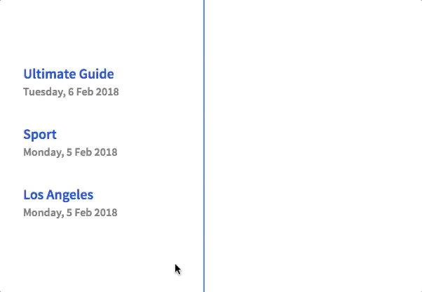

## Putting It Together {#putting-it-together}

Now that we have some more components to work with we can start to add some more structure to our Article Template. The powerful feature of Editable Templates is the flexibility to make some components of the page fixed and standard across all pages, while making other components editable at the page level. It is important to find a balance between what is editable at the page level and what needs to be managed at the template level.

Below is a diagram of the Article Template sliced into what is fixed, fixed and unlocked and what is fully editable.

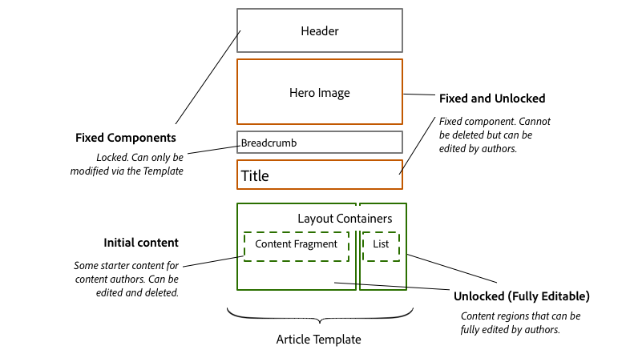

Article Template component architecture

The following videos show how we can implement the above requirements with AEM's Template Editor and then author an article page:

>[!VIDEO](https://video.tv.adobe.com/v/22109?quality=9)

>[!NOTE]
>
>Not shown in the ***Updating the Article Template Video*** is authoring initial content. Creating initial content is a great way to provide an author with some components already added to the page. The author can then choose to keep those components or delete them. Check out the following to [learn more about authoring initial content.](https://helpx.adobe.com/experience-manager/6-3/sites/authoring/using/templates.html#main-pars_title_1266227611)
>
>Bonus: Try adding a **Content Fragment** in the main layout container and a **List** component in the side layout container as initial content for the Article Template (but watch the video first).

>[!VIDEO](https://video.tv.adobe.com/v/22110?quality=9)

## Help! {#help}

## Next Steps {#next-steps}

Next part in the tutorial:

* [Getting Started with AEM Sites Part 5 - Navigation and Search](/help/getting-started-wknd-tutorial-develop/part5.md)
* Download the finished package for this part of the tutorial:** [https://github.com/Adobe-Marketing-Cloud/aem-guides-wknd/releases](https://github.com/Adobe-Marketing-Cloud/aem-guides-wknd/releases)**

