# Getting Started with AEM Sites Part 5 - Navigation and Search{#getting-started-with-aem-sites-part-navigation-and-search}

Covers dynamic navigation driven by the content hierarchy and including the Quick Search component in the Header. Composite Components and policy sharing between multiple templates are included. Basics of HTL templating language, and dialogs are also used.

## Prerequisites {#prerequisites}

This is Part 5 of the multi-part tutorial. ** [Part 4 can be found here](/help/getting-started-wknd-tutorial-develop/part4.md) **and an ** [overview can be found here](/help/getting-started-wknd-tutorial-develop/getting-started-wknd-tutorial-develop.md)**.

You can check out the following branch on GitHub if you want to skip the previous parts: ** [part/wknd-sites-guide-part-4](https://github.com/Adobe-Marketing-Cloud/aem-guides-wknd/tree/part/4-style-system)**. Or you can download and install the Chapter 4 package: [https://github.com/Adobe-Marketing-Cloud/aem-guides-wknd/releases](https://github.com/Adobe-Marketing-Cloud/aem-guides-wknd/releases)

## Content Hierarchy {#content-hierarchy}

It is important with any AEM implementation to plan out the content hierarchy as this is the primary mechanism for organizing the content. Site navigation is often heavily influenced by the content hierarchy and well-thought hierarchy can simplify the application. Permissions and support for multiple languages also play a role in content hierarchy planning.

* [Data Modeling - David Nuescheler's Model](https://docs.adobe.com/docs/en/aem/6-3/develop/the-basics/model-data.html)  

* [Multi Site Manager Best Practices](https://docs.adobe.com/docs/en/aem/6-3/administer/sites/msm/best-practices.html)

The fictitious WKND site is a life-style site with articles of things to do in several categories. We will create a content hierarchy that reflects this organization. The navigation will be dynamically populated based on the content hierarchy. We will also set up the site with a language root so that we can use [AEM's translation feature in the future.](https://docs.adobe.com/docs/en/aem/6-3/administer/sites/translation/tc-bp.html)

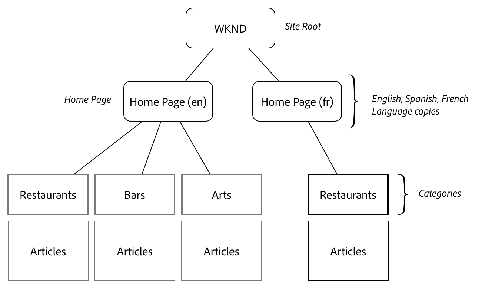

Top level hierarchy for WKND site structure.

## Update Site Hierarchy {#site-hierarchy}

A well populated site hierarchy is needed to see the navigation functioning properly. The Landing Page Template will be used to provide much of that structure.

1. 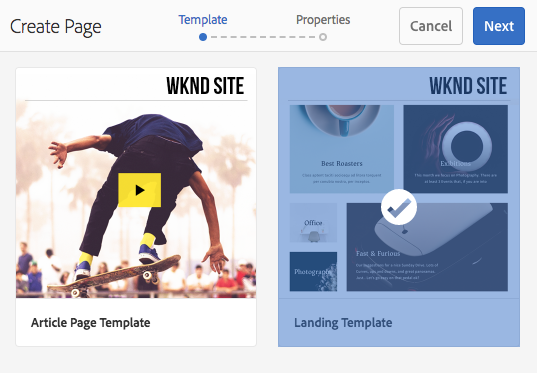

   The Navigation component relies on the site hierarchy to function. In order to see it working we will stub out the content hierarchy in advance. Use the Landing Template to create the following series of pages:

   ```
   /WKND (wknd)
        /Home (en)
            /Restaurant (restaurant)
            /Bars (bars)
            /Sport (sport)
            /Art (art)
            /Music (music)
            /Shopping (shopping)
   
   ```

   Add a new page beneath one of the categories that uses the Article Template. You should end up with something like the following:

   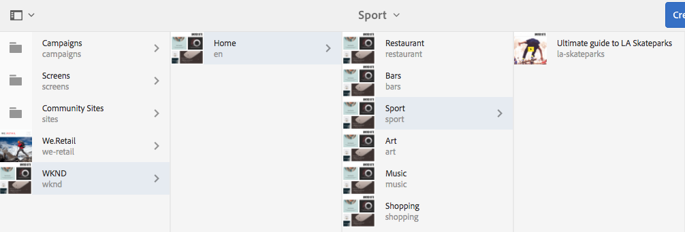

## Navigation Component {#navigation-component}

Core Components includes a ** [Navigation](https://github.com/Adobe-Marketing-Cloud/aem-core-wcm-components/tree/master/content/src/content/jcr_root/apps/core/wcm/components/navigation/v1/navigation)** component that we will leverage to create a header and footer navigation. The Navigation component creates a navigation based on the site structure. It has already been proxied into our project, we will add some styling to match the design.

**Navigation BEM Notation:**

```
BLOCK cmp-navigation
    ELEMENT cmp-navigation__group
    ELEMENT cmp-navigation__item
        MOD cmp-navigation__item--active
        MOD cmp-navigation__item--level-*
    ELEMENT cmp-navigation__item-link
```

We will implement the Navigation in **two** different ways for the Header and Footer. The footer navigation will be implemented first using an additional layout container to provide structure.

The **ui.apps** module will be updated.

1. The Navigation component was created by the AEM project archetype beneath /apps/wknd/components/content. This will be just a structural component for this project.

    1. Move the navigation component from **/apps/wknd/components/content** to **/apps/wknd/components/structure**
    
    1. Update the **componentGroup** to be **WKND.Structure**

   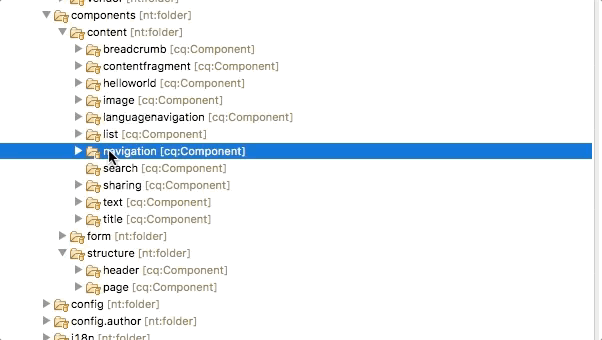 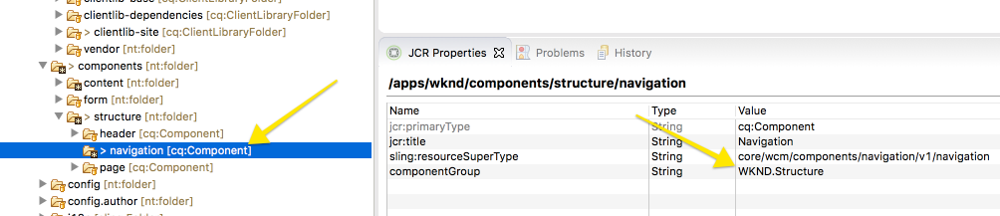

1. We will create a style for a new Layout Container which will act as the container for the navigation in the footer.

   Beneath **/apps/wknd/clientlibs/clientlib-site/components/layout-container**

    1. Create a new folder named **styles**
    1. Create a new file beneath styles named **footer.less**

   

1. 

   ```css
   /* WKND Layout Container Footer Style */
   
   @footer-background-color: #000;
   @footer-text-color: #fff;

   .cmp-layout-container--footer {
    background: @footer-background-color;
       min-height: 365px;
       margin-top: 3em;
       padding: 0 3em;
       
       @media (max-width: @grid-float-breakpoint) {
               min-height:267px; 
       }
       
    p {
        color: @footer-text-color;
        font-size: @font-size-xsmall;
        text-align:center;
       }     
   }  
   ```

   This will create a black background with white text for the container.

1. 

   ```css
   /* WKND Layout Container Styles */
   
   @import "styles/footer.less";
   ```

1. We will create a footer style for the Navigation component

   Beneath **/apps/wknd/clientlibs/clientlib-site/components/navigation**

    1. Create a new folder named **styles**
    1. Create a new file beneath styles named **nav-footer.less**

   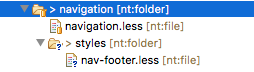

1. 

   ```css
   /* WKND Navigation Footer Style */
   
   .cmp-navigation--footer {
    
      .cmp-navigation {
           width: 100%;
           text-align: center;
           float: left;
           margin-top: 3em;
           
           .cmp-navigation__group {
               
               margin-top:2em;
               margin-left:2em;
               margin-right: 2em;
           
             .cmp-navigation__item {
               
               float:left;
               display: block;
               
               .cmp-navigation__item-link {
                   font-size: @font-size-xsmall;
                   text-transform: uppercase;
                   color: @navbar-inverse-color;
                   height:10em;
                   width: 10em;
                   text-align: center;
                   text-decoration: none;
                   padding-top: 4em;
                   float:left;
                   
                   &:hover,
                   &:focus {
                       background-color: @brand-primary;
                       color: @text-color;
                   }

               }
               
           }
           
           li.cmp-navigation__item--active .cmp-navigation__item-link {
               background-color: @navbar-inverse-bg;
               color: @brand-primary;
           }
       
            @media (max-width: @grid-float-breakpoint) {
               margin-top: 2em;    
           }
       }
       
       }

   }
   ```

1. 

   ```css
   /* WKND navigation styles */
   
   @import "styles/nav-footer.less";
   ```

1. 
1.

    1. Navigate to the Article Template: [https://localhost:4502/editor.html/conf/wknd/settings/wcm/templates/article-page-template/structure.html](https://localhost:4502/editor.html/conf/wknd/settings/wcm/templates/article-page-template/structure.html)
    1. Drag a new Layout Container as the very last Layout Container (use Component Tree for help)

   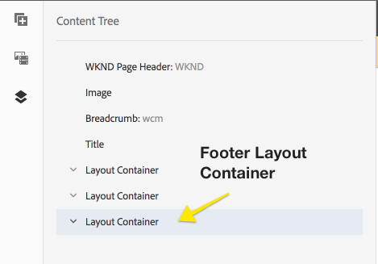

1.

    1. Click the Policy Icon to create a New Policy for the Footer Layout Container
    1. **Policy Title** = **WKND Layout Container - Footer**
    
    1. **Allowed Components** = Check **WKND.Content **and **WKND.Structure**
    
    1. **Styles **&gt;** Default CSS Classes **=** cmp-layout-container--footer full-width**

   The full-width class is something that should already be defined in /apps/wknd/clientlibs/clientlib-site/site/css/common.less. After saving the policy the layout container should stretch full-width and have a black background.

   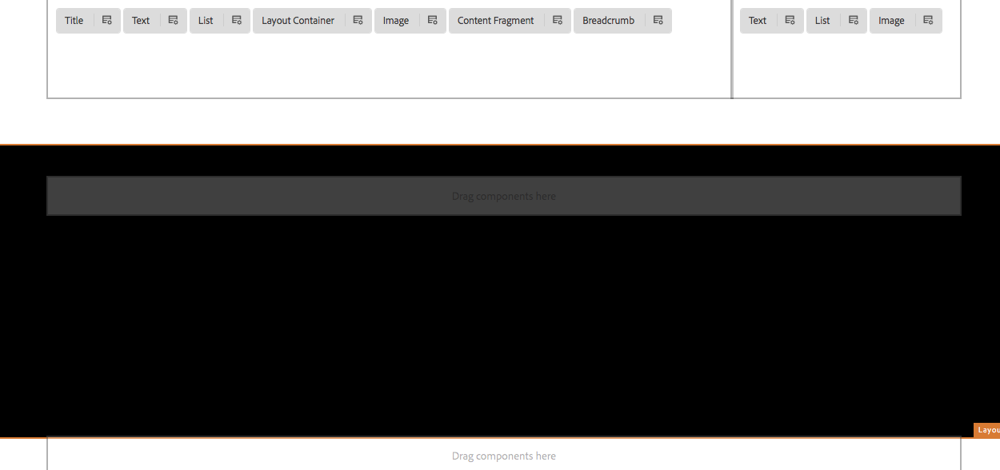

1.

    1. Add a Navigation component to the Footer layout container
    1. Configure the policy for the Navigation Component with the following:
    1. **Policy Title** = **WKND Navigation - Footer**
    
    1. **Navigation Root = /content/wknd/en**
    1. Check** Exclude navigation root**
    1. Un-check** Collect all child pages**

        1. **Navigation Structure Dept = 1**

    1. **Styles** &gt; **Default CSS Classes** = **cmp-navigation--footer**

   

1. Repeat the above steps (8-10) using the Landing Template: [https://localhost:4502/editor.html/conf/wknd/settings/wcm/templates/landing-template/structure.html](https://localhost:4502/editor.html/conf/wknd/settings/wcm/templates/landing-template/structure.html)

   You should be able to re-use the **WKND Layout Container - Footer** and **WKND Navigation - Footer** policies on the respective components.

   View one of the content pages. You should now be able to see the footer navigation populated on all the content pages.

   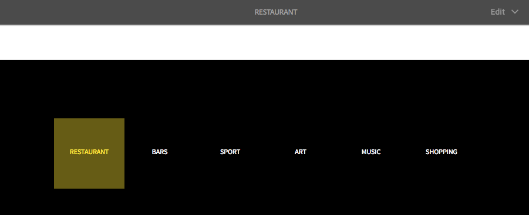

## Header Component {#header-composite-component}

The Header Component will include Navigation as well as Search and a Home/Logo link. We could create a Layout Container and follow the same approach as with the Footer. However attempting to resize all the components and getting them to align would be quite complicated for an author.

Instead we will create a composite component. The header component will embed a ** [Navigation](https://github.com/Adobe-Marketing-Cloud/aem-core-wcm-components/tree/master/content/src/content/jcr_root/apps/core/wcm/components/navigation/v1/navigation)** and ** [Quick Search](https://github.com/Adobe-Marketing-Cloud/aem-core-wcm-components/tree/master/content/src/content/jcr_root/apps/core/wcm/components/search/v1/search)** component inside of it. So when the header component is dragged onto the page it will bring the other two with it.

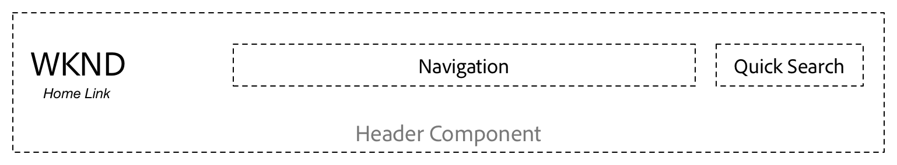

Header Component with embedded Navigation and Quick Search components

1. The Search component was created by the AEM project archetype beneath /apps/wknd/components/content. This will be a structural component for this project and embedded into the Header component.

    1. Move the Search component from **/apps/wknd/components/content** to **/apps/wknd/components/structure**
    
    1. Update the **componentGroup** to be **WKND.Structure**

   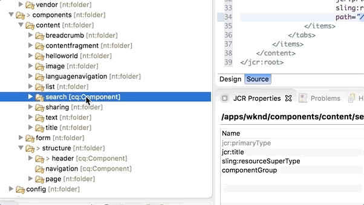 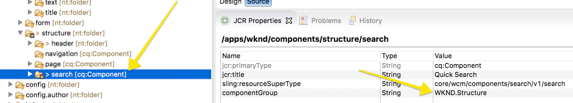

1. Dialogs (the Wrench icon) are used by authors to change content. Until now we have just been styling core components and relied on dialogs already defined. This dialog will allow a user to configure the Root Path to link the WKND Logo.

    1. Beneath **/apps/wknd/components/structure/header** edit the **cq:dialog**
    
    1. It is easiest to edit the xml directly so open **/wknd-sites-guide.ui.apps/src/main/content/jcr_root/apps/wknd/components/structure/header/_cq_dialog/.content.xml**

    

   ```xml
   <?xml version="1.0" encoding="UTF-8"?>
   <jcr:root xmlns:sling="https://sling.apache.org/jcr/sling/1.0" xmlns:cq="https://www.day.com/jcr/cq/1.0" xmlns:jcr="https://www.jcp.org/jcr/1.0" xmlns:nt="https://www.jcp.org/jcr/nt/1.0"
       jcr:primaryType="nt:unstructured"
       jcr:title="Header"
       sling:resourceType="cq/gui/components/authoring/dialog">
       <content
           jcr:primaryType="nt:unstructured"
           sling:resourceType="granite/ui/components/coral/foundation/container">
           <items jcr:primaryType="nt:unstructured">
               <tabs
                   jcr:primaryType="nt:unstructured"
                   sling:resourceType="granite/ui/components/coral/foundation/tabs"
                   maximized="{Boolean}true">
                   <items jcr:primaryType="nt:unstructured">
                       <header
                           jcr:primaryType="nt:unstructured"
                           jcr:title="Header Settings"
                           sling:resourceType="granite/ui/components/coral/foundation/fixedcolumns"
                           margin="{Boolean}true">
                           <items jcr:primaryType="nt:unstructured">
                               <column
                                   jcr:primaryType="nt:unstructured"
                                   sling:resourceType="granite/ui/components/coral/foundation/container">
                                   <items jcr:primaryType="nt:unstructured">
                                       <rootpath
                                           jcr:primaryType="nt:unstructured"
                                           sling:resourceType="granite/ui/components/coral/foundation/form/pathfield"
                                           fieldDescription="Populate the link of the WKND logo"
                                           fieldLabel="Root Path"
                                           name="./rootPath"
                                           rootPath="/content/wknd"/>
                                   </items>
                               </column>
                           </items>
                       </header>
                   </items>
               </tabs>
           </items>
       </content>
   </jcr:root>
   ```

1. Design Dialogs allow a user to update the Policy of a component. When working with structural components that will be re-used across templates it is advantageous to use Policies since the policy can be applied across templates.

   Create a Header Design Dialog to allow a user to configure the Root Path to link the WKND Logo via a Policy:

    1. Beneath **/apps/wknd/components/structure/header** create a new node named **cq:design_dialog **of type **nt:unstructured**
    
    1. It is easiest to edit the xml directly so open **/wknd-sites-guide.ui.apps/src/main/content/jcr_root/apps/wknd/components/structure/header/_cq_design_dialog/.content.xml**

   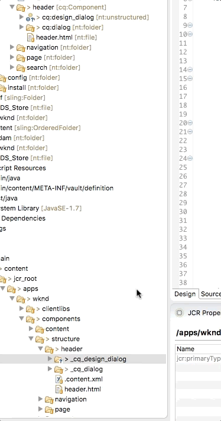 

   ```xml
   <?xml version="1.0" encoding="UTF-8"?>
   <jcr:root xmlns:sling="https://sling.apache.org/jcr/sling/1.0" xmlns:granite="https://www.adobe.com/jcr/granite/1.0" xmlns:cq="https://www.day.com/jcr/cq/1.0" xmlns:jcr="https://www.jcp.org/jcr/1.0" xmlns:nt="https://www.jcp.org/jcr/nt/1.0"
       jcr:primaryType="nt:unstructured"
       jcr:title="Navigation"
       sling:resourceType="cq/gui/components/authoring/dialog">
       <content
           granite:class="cmp-navigation__editor"
           jcr:primaryType="nt:unstructured"
           sling:resourceType="granite/ui/components/coral/foundation/container">
           <items jcr:primaryType="nt:unstructured">
               <tabs
                   jcr:primaryType="nt:unstructured"
                   sling:resourceType="granite/ui/components/coral/foundation/tabs"
                   maximized="{Boolean}true">
                   <items jcr:primaryType="nt:unstructured">
                       <properties
                           jcr:primaryType="nt:unstructured"
                           jcr:title="Properties"
                           sling:resourceType="granite/ui/components/coral/foundation/container"
                           margin="{Boolean}true">
                           <items jcr:primaryType="nt:unstructured">
                              <rootpath
                                   jcr:primaryType="nt:unstructured"
                                   sling:resourceType="granite/ui/components/coral/foundation/form/pathfield"
                                   fieldDescription="Populate the link of the WKND logo"
                                   fieldLabel="Root Path"
                                   name="./rootPath"
                                   rootPath="/content/wknd"/>
                           </items>
                       </properties>
                       <styletab
                           jcr:primaryType="nt:unstructured"
                           sling:resourceType="granite/ui/components/coral/foundation/include"
                           path="/mnt/overlay/cq/gui/components/authoring/dialog/style/tab_design/styletab"/>
                   </items>
               </tabs>
           </items>
       </content>
   </jcr:root>
   ```

   In the XML note the **&lt;rootpath /&gt;** node that has an attribute **name="./rootPath". **This will be the name of the property in which the Authors selection will be made.

   Note the **&lt;styletab&gt;** node and the path **/mnt/overlay/cq/gui/components/authoring/dialog/style/tab_design/styletab.** This will include the Style Tab and allow the Header component to leverage the style system.

1.

    1. Update **/apps/wknd/components/structure/header/header.html**

   ```xml
   <!--/* Header Component for WKND Site 
    
   */-->
    
   <header class="wknd-header">
    <div class="container">
     <a class="wknd-header-logo" href="${properties.rootPath || currentStyle.rootPath @ extension='html'}">WKND</a>
        <div class="cmp-search--header" data-sly-resource="${'search' @ resourceType='wknd/components/structure/search'}"></div>
        <div class="cmp-navigation--header" id="header-navbar" data-sly-resource="${'navigation' @ resourceType='wknd/components/structure/navigation'}"></div> 
    </div>
   </header>
   ```

   The snippet **${properties.rootPath || currentStyle.rootPath @ extension='html'}**

   Injects the path selected by the author via the Dialog or Design Dialog. It first looks to see if a properties value of rootPath exists (Dialog) and then falls back to look at the currentStyle (Design Dialog) for the value of the rootPath.

   Both **properties** and **currentStyle** are [Global Objects](https://helpx.adobe.com/experience-manager/htl/using/global-objects.html) made available to all components HTL scripts.

   The snippet **data-sly-resource="${'search' @ resourceType='wknd/components/structure/search'}" **includes the Search Component and looks for it as a resource beneath the header named **search. **

   The Navigation Component is included in the same way:** data-sly-resource="${'navigation' @ resourceType='wknd/components/structure/navigation'}"**

   This is an example of HTL Block Statements, [more information can be found here.](https://helpx.adobe.com/experience-manager/htl/using/block-statements.html)

1. Whenever creating composite components it is a best practice to create a cq:template to ensure that the embedded or sub-components have actual nodes/resources created in the JCR. If there is not a true node that maps to the sub-component odd behavior can occur with the Dialogs and Policies when saving.

   Beneath **/apps/wknd/components/structure/header**

    1. Create a new node named **cq:template** of type **nt:unstructured**
    
    1. Open the .content.xml for easier editing

   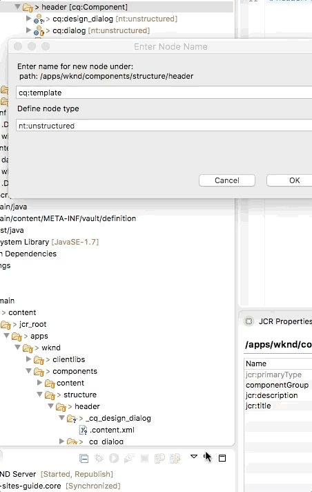 

   ```xml
   <?xml version="1.0" encoding="UTF-8"?>
   <jcr:root xmlns:sling="https://sling.apache.org/jcr/sling/1.0" xmlns:cq="https://www.day.com/jcr/cq/1.0" xmlns:jcr="https://www.jcp.org/jcr/1.0" xmlns:nt="https://www.jcp.org/jcr/nt/1.0"
       jcr:primaryType="nt:unstructured">
       <navigation
           jcr:primaryType="nt:unstructured"
           sling:resourceType="wknd/components/structure/navigation"/>
       <search
           jcr:primaryType="nt:unstructured"
           sling:resourceType="wknd/components/structure/search"/>
   </jcr:root>
   ```

   Replace /wknd-sites-guide.ui.apps/src/main/content/jcr_root/apps/wknd/components/structure/header/_cq_template/.content.xml

   with the above snippet. This will ensure that nodes for **navigation** and **search** are created when a Header component is added.

1. We will modify the styles of the header to account for the Navigation and Search components.

    1. Replace header.less with the following:

   ```css
   .wknd-header {
    position: fixed;
    z-index: 1030;
    top: 0;
    left: 0;
    right: 0;
    height:160px;
    padding-top: 45px;
    
    .container {
    .container-fixed();
   
       @media (min-width: @screen-sm-min) {
         width: (@container-sm - 48px);
       }
       @media (min-width: @screen-md-min) {
         width: (@container-md - 48px);
       }
       @media (min-width: @screen-lg-min) {
         width: (@container-lg - 48px);
       }
    }
    
    &.navbar-sticky {
        background-color: @body-bg;
        -webkit-box-shadow: 0px 8px 20px 0px rgba(0,0,0,0.26);
        -moz-box-shadow: 0px 8px 20px 0px rgba(0,0,0,0.26);
        box-shadow: 0px 8px 20px 0px rgba(0,0,0,0.26);
    }
    
     @media (max-width: @grid-float-breakpoint) {
        position: static;
        z-index: 1030;
        height: 92px;
        padding-top: 10px;
        &.navbar-sticky {
         box-shadow: none;
        }
    } 
   }
   
   a.wknd-header-logo {
    color: @text-color;
       font-weight: bolder;
       font-size: @font-size-xlarge;
       float:left;
       padding: 11px 12px;
       line-height: 28px;
       height: 50px;
       text-decoration: none;
       margin-left: -24px;
   
    @media (max-width: @grid-float-breakpoint) {
      font-size: (@font-size-large + 8px);
      margin-left: 0;
     }
     
     @media (max-width: @screen-sm-min) {
     margin-left: 10px;
    }
   }
   ```

1. Next we will add a new style for the navigation component in the header.

   Beneath **/apps/wknd/clientlibs/clientlib-site/components/navigation/styles**

    1. Create a new file named **nav-header.less**
    1. Populate it with the following:

   ```css
   /* WKND Navigation Header styles */
   
   @mobile-nav-bg-color: #000;
   @mobile-nav-link-color: #fff;
    
   .cmp-navigation--header {
    
    float:right;
    padding-top: .25em;
    min-width: 100px;
    
    .cmp-navigation {
     float:right;
     
     .cmp-navigation__group {
      list-style: none;
     }
     
     .cmp-navigation__item {
      display: block;
      float: left;
     }
     
     .cmp-navigation__item-link {
      color: @text-color;
         font-size: @font-size-medium;
         text-transform: uppercase;
         font-weight: bolder;
         padding: 15px 17px;
         text-decoration: none;
         
         &:hover,
           &:focus {
             background-color: @brand-primary;
           }
     }
     
     .cmp-navigation__item--active .cmp-navigation__item-link {
      background-color: @brand-primary;
     }
    }
    
    @media (max-width: @grid-float-breakpoint) {
     
     display:none;
    } 
   }
   ```

   Update **/apps/wknd/clientlibs/clientlib-site/components/navigation/navigation.less** to included the **nav-header.less** file:

   ```css
   /* WKND navigation styles */
   
   @import "styles/nav-footer.less";
   @import "styles/nav-header.less";
   ```

1. Next we will add a new style for the search component in the header.

   Beneath **/apps/wknd/clientlibs/clientlib-site/components/search**

    1. Create a new folder named **styles**
    1. Create a new file beneath **styles** named **search-header.less**
    
    1. Populate** search-header.less** with the following:

   ```css
   /* WKND Search Header styles */
   
   .cmp-search--header {
    float: right;
    margin-right: -12px;
   
    .cmp-search {
     
     &__form {
     
     .cmp-search__icon {
      top: 0.7rem;
     }
     
     .cmp-search__clear-icon {
      top: 0.7rem;
     }
      
     .cmp-search__input {
            background-color: @brand-secondary;
            color:@text-color;
            font-size: @navbar-font-size;
            border-radius: 0px;
            border:none;
            height:40px;
            width:165px;
            padding-right: 2rem;
            padding-left: 1.8rem;
            transition: ease-in-out, width .35s ease-in-out;
            
            &:focus {
                background-color: @body-bg;
                outline: none !important;
                border:1px solid @text-color;
                box-shadow: none;
                width: 265px;
            }
                
            &::placeholder { 
                text-transform: uppercase;    
                }
                
            }
     
     }
     
     .cmp-search__results {
      margin-top: 0.5em;
      background: @gray-dark;
      
      a.cmp-search__item {
       color: @brand-third;
       font-size: @font-size-small;
          height: 50px;
          text-overflow: ellipsis;
          padding: 0.5em;
      }
      
      a.cmp-search__item:hover {
       text-decoration:none;
       background: @gray-base;
      }
      
      .cmp-search__item-mark {
       background: @gray-base;
       color: @brand-third;
      } 
       } 
     }
     
      @media (max-width: @grid-float-breakpoint) {
       /*position: absolute;
       right: 0;
       margin-right:0em;*/
       .cmp-search__input {
            height:50px;
       }
     }
     
     @media (max-width: @screen-sm-min) {
      margin-right: 1em;
      position: absolute;
      right: 0;
      z-index: 100;
      margin-top: 0.25em;
      
      .cmp-search__input {
            &:focus {
               width: 100%;
       }
      }
     } 
   }
   
   ```

   Update **/apps/wknd/clientlibs/clientlib-site/components/search/search.less** to included the **search-header.less** file:

   ```css
   /* WKND Search styles */
   
   @import (once) "styles/search-header.less";
   ```

1. 
1. You should now see the header component includes a navigation and search on [https://localhost:4502/editor.html/conf/wknd/settings/wcm/templates/article-page-template/structure.html](https://localhost:4502/editor.html/conf/wknd/settings/wcm/templates/article-page-template/structure.html)

   However before we can configure it we must Delete it and re-add it. When it is re-added then the cq:template configured earlier will take effect and ensure the proper node structure is created. Currently as it stands it is not configured correctly. It can not be deleted through the UI.

   This will need to be done in CRXDE Lite or in Eclipse. Simply delete the following node:

   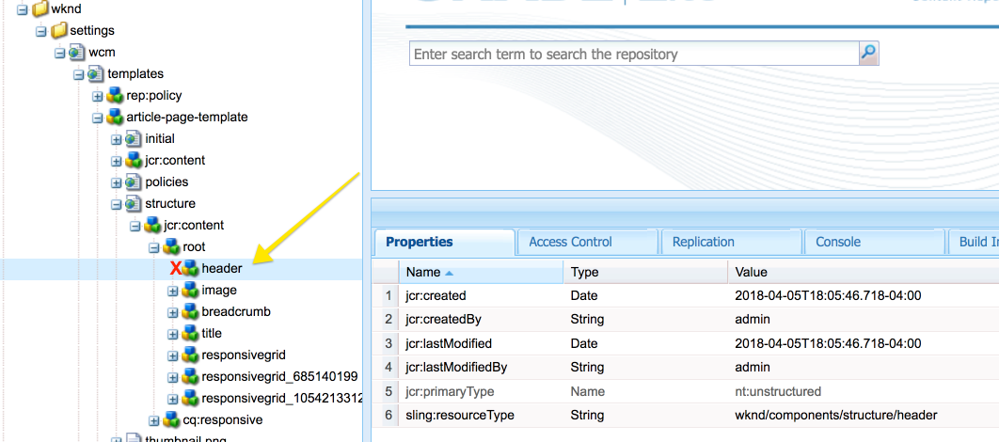

1. 
1. Configuring the Header, Navigation, and Search are shown in the below video:

>[!VIDEO](https://video.tv.adobe.com/v/21509?quality=9)

## Mobile Navigation {#mobile-navigation}

At this point we have used the AEM Style System to style the existing markup generated by a core component. LESS and CSS are very powerful tools to change a component visually but depending on the requirements there will be limitations. It is also possible to use JavaScript to manipulate the markup of a core component after it has loaded. In this way we can re-purpose the markup of the component to be used in a different way, but do not need to make any back-end code changes.

For the mobile navigation we would ideally like the navigation to pop out from the left hand-side and "push" the body of the page off screen. Given the nested location of the navigation in the header component it is not really achievable to accomplish this behavior with CSS alone. Instead we will use a little bit of Javascript to create a copy of the Header Navigation markup and append it to the body tag. This will allow us to create that mobile navigation visual effect.

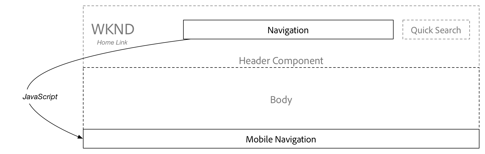

Use JavaScript to clone the Navigation items in the Header to a mobile navigation that will be appended to the HTML body. This will occur on page load or when the header component is added to the page.

1. Beneath **/apps/wknd/clientlibs/clientlib-site/components/navigation/styles **

    1. Create a new file named **nav-mobile.less**
    1. Populate it with the following:

   ```css
   /* WKND Navigation - Mobile */
   
   @nav-item-mobile-top-level-color: #fff;
   @nav-item-mobile-hover-color: @brand-primary;
   @nav-item-mobile-text-color: #888;
   @nav-item-mobile-border : solid 1px rgba(255, 255, 255, 0.05);
    
   .cmp-navigation--mobile {
        
     .cmp-navigation__group {
         list-style: none;
         display: inline-block;
         margin: 0;
         padding: 0;
     }
    
     .cmp-navigation__item {
         display: inline-block;
         float: left;
         width: 100%;
     }
    
     .cmp-navigation__item-link {
       display: block;
       color: @nav-item-mobile-text-color;
       text-decoration: none;
       height: 44px;
       line-height: 44px;
       border-top: @nav-item-mobile-border;
       padding: 0 1em 0 1em;
        
       &:hover {
           color: @nav-item-mobile-hover-color;
       }
     }
    
     .cmp-navigation__item--level-0, .cmp-navigation__item--level-1 {
      
             > .cmp-navigation__item-link {
                 color: @nav-item-mobile-top-level-color;
                  
                 &:hover {
                     color: @nav-item-mobile-hover-color;
                 }
             }
       }
        
       .cmp-navigation__item--level-2 {
           padding-left: 2em;
       }
        
       .cmp-navigation__item--level-3 {
           padding-left: 4em;
       }
   }

        #mobileNav, #toggleNav {
           display: none;
       }
        
       /*Styles to push mobile nav into view */
        
       @media (max-width: @grid-float-breakpoint) {
        
       .root.responsivegrid {
                   -moz-backface-visibility: hidden;
                   -webkit-backface-visibility: hidden;
                   -ms-backface-visibility: hidden;
                   backface-visibility: hidden;
                   -moz-transition: -moz-transform 0.5s ease;
                   -webkit-transition: -webkit-transform 0.5s ease;
                   -ms-transition: -ms-transform 0.5s ease;
                   transition: transform 0.5s ease;
                   padding-bottom: 1px;
       }
        
       #toggleNav {
                   -moz-backface-visibility: hidden;
                   -webkit-backface-visibility: hidden;
                   -ms-backface-visibility: hidden;
                   backface-visibility: hidden;
                   -moz-transition: -moz-transform 0.5s ease;
                   -webkit-transition: -webkit-transform 0.5s ease;
                   -ms-transition: -ms-transform 0.5s ease;
                   transition: transform 0.5s ease;
                   display: block;
                   height: 44px;
                   left: 0;
                   position: fixed;
                   top: 6px;
                   width: 80px;
                   z-index: 10001;
                   background: none;
               }
    
                   #toggleNav .toggle {
                       width: 80px;
                       height: 60px;
                       font-size: 40px;
                       color: @text-color;
                        
                       &:hover {
                           text-decoration:none;
                           color: @text-color;
                       }
                        
                   }
    
               #mobileNav {
                   -moz-backface-visibility: hidden;
                   -webkit-backface-visibility: hidden;
                   -ms-backface-visibility: hidden;
                   backface-visibility: hidden;
                   -moz-transform: translateX(-275px);
                   -webkit-transform: translateX(-275px);
                   -ms-transform: translateX(-275px);
                   transform: translateX(-275px);
                   -moz-transition: -moz-transform 0.5s ease;
                   -webkit-transition: -webkit-transform 0.5s ease;
                   -ms-transition: -ms-transform 0.5s ease;
                   transition: transform 0.5s ease;
                   display: block;
                   height: 100%;
                   left: 0;
                   overflow-y: auto;
                   position: fixed;
                   top: 0;
                   width: 275px;
                   z-index: 10002;
                   color: #858484;
                   background: #000;
                   box-shadow: inset -3px 0px 5px 0px rgba(0, 0, 0, 0.35);
               }

               body.navPanel-visible {
                   overflow-x: hidden;
                    
                   .root.responsivegrid {
                       -moz-transform: translateX(290px);
                       -webkit-transform: translateX(290px);
                       -ms-transform: translateX(290px);
                       transform: translateX(290px);
                   }
                    
                    #toggleNav {
                       -moz-transform: translateX(275px);
                       -webkit-transform: translateX(275px);
                       -ms-transform: translateX(275px);
                       transform: translateX(275px);
                   }
                    
                   #mobileNav {
                       -moz-transform: translateX(0);
                       -webkit-transform: translateX(0);
                       -ms-transform: translateX(0);
                       transform: translateX(0);
                   }
                    
           }    
       }
   ```

   The mobile nav will be scoped by the .**cmp-navigation--mobile** class. Several CSS **transform** rules are used to animate the mobile navigation opening and closing.

   Finally update **/apps/wknd/clientlibs/clientlib-site/components/navigation/navigation.less **to include the **nav-mobile.less** file:

   ```css
   /* WKND navigation styles */
   
   @import "styles/nav-footer.less";
   @import "styles/nav-header.less";
   @import "styles/nav-mobile.less";
   ```

1. Beneath** /apps/wknd/clientlibs/clientlib-site/components/navigation**

    1. Create a new file named **navigation.js**
    1. Populate it with the following:

   ```
   // Wrap bindings in anonymous namespace to prevent collisions
   jQuery(function($) {
       "use strict";
   
    function applyComponentStyles() {
   
     //Top Level Navigation (expected to only be one of these)
     $("#header-navbar .cmp-navigation").not("[data-top-nav-processed='true']").each(function() {
               // Mark the component element as processed to avoid the cyclic processing (see .not(..) above).
               var nav = $(this).attr("data-top-nav-processed", true),
                   $body = $('body');
               
               // Toggle Nav
               $('<div id="toggleNav">' +
                    '<a href="#mobileNav" class="toggle"><i class="wkndicon wkndicon-ico-bm" aria-hidden="true"></i></a>' +
                   '</div>'
               ).appendTo($body);
               
            // Navigation Panel.
               $(
                   '<div id="mobileNav" class="cmp-navigation--mobile">' +
                       '<nav class="cmp-navigation">' +
                           $(this).html() +
                       '</nav>' +
                   '</div>'
               )
                   .appendTo($body)
                   .panel({
                       delay: 500,
                       hideOnClick: true,
                       hideOnSwipe: true,
                       resetScroll: true,
                       resetForms: true,
                       side: 'left',
                       target: $body,
                       visibleClass: 'navPanel-visible'
                   });
           });
       }
   
     applyComponentStyles();
     
     $(".responsivegrid").bind("DOMNodeInserted", applyComponentStyles);
   });
   ```

   The above code will get called when the responsivegrid is added to the DOM. The first jQuery selector searches for the navigation in the Header. There is expected to only be one. There is a top-level check to avoid duplicate processing, in the case when the component is added via the AEM editor.

   Next an anchor tag is appended to the body. This is what users will click to toggle the mobile navigation. After that the header navigation is copied into a new div with an id of mobileNav and a class of cmp-navigation--mobile. This is the mobile navigation and is appended to the body.

   Finally a panel function is attached to toggle the mobile navigation visibility. This panel functionality is defined in a 3rd party utility file.

1. Next we will add a 3rd party javascript file modified from [https://html5up.net/](https://html5up.net/) to allow for click and swipe support of the mobile navigation.

   Beneath **/apps/wknd/clientlibs/clientlib-site/site**

    1. Create a new folder named **js**
    1. Create a new folder beneath **js** named **vendor**
    
    1. Create a new file named **util.js**
    1. Populate it with the following [**util.js**](https://github.com/Adobe-Marketing-Cloud/aem-guides-wknd/blob/part/5-navigation-search/ui.apps/src/main/content/jcr_root/apps/wknd/clientlibs/clientlib-site/site/js/vendor/util.js)   
       (we have included it as a link to GitHub since the code snippet is very long)

   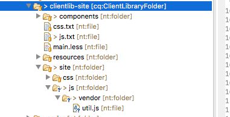

1. Since we will have a mobile navigation we will modify the header scroll behavior in mobile/tablet views.

    1. Update **/apps/wknd/clientlibs/clientlib-site/components/header/header.js** with the following:

   ```
   (function (site, $) {
       'use strict';
       var wkndheader = $(site + " .wknd-header"),
           scroll,
           mobileBreakpoint = 992;
       
       if($(window).scrollTop() > 0 && $(window).width() > mobileBreakpoint) {
           wkndheader.addClass("navbar-sticky");
       }
       
       $(window).scroll(function(){
            
            scroll = $(window).scrollTop();
       if(scroll > 0 && $(window).width() > mobileBreakpoint) {
           wkndheader.addClass("navbar-sticky");
       } else {
           wkndheader.removeClass("navbar-sticky");
       }
   });
   }('.root',jQuery));
   ```

1.

    1. Update **/apps/wknd/clientlibs/clientlib-site/js.txt **to include the **navigation.js** and **util.js** files:

   ```
   #base=.
   
   site/js/vendor/util.js
   components/header/header.js
   components/navigation/navigation.js
   ```

1. Make one more update to **/apps/wknd/clientlibs/clientlib-site/components/page/page.less** so that the body no longer has a margin in mobile/tablet view.

   ```css
   
   body.page {
    
       margin-top:160px;
       @media (max-width: @grid-float-breakpoint) {
           margin-top: 0px;     
       }
   }
   
   .root {
    .container-content();
   }
   ```

1. 
1. Final configurations and wrap up can be seen in the below video

## Putting It Together {#putting-it-together}

>[!VIDEO](https://video.tv.adobe.com/v/21510?quality=9)

## Help! {#help}

## Next Steps {#next-steps}

Next part in the tutorial:

* [Getting Started with AEM Sites Part 6 - Sling Models and Card Component](https://helpx.adobe.com/experience-manager/kt/sites/using/getting-started-wknd-tutorial-develop/part6.html)
* Download the finished package for this part of the tutorial: ** [https://github.com/Adobe-Marketing-Cloud/aem-guides-wknd/releases](https://github.com/Adobe-Marketing-Cloud/aem-guides-wknd/releases)**

