# Getting Started with AEM Sites Part 6 - Sling Models and Card Component{#getting-started-with-aem-sites-part-sling-models-and-card-component}

Covers the end to end creation of a custom card component that displays a teaser image, title, and description backed by an article page. Includes developing a Sling Model to encapsulate business logic to dynamically populate the card component and corresponding HTL to render the component. Also includes the creation of a design dialog to integrate the Style System in a custom component.

## Prerequisites {#prerequisites}

This is Part 6 of a multi-part tutorial. [Part 5 can be found here](../../../../sites/using/getting-started-wknd-tutorial-develop/part5.md) and an [overview can be found here](../../../../sites/using/getting-started-wknd-tutorial-develop.md).

You can check out the following branch on GitHub if you want to skip the previous parts: [feature/wknd-sites-guide-part-5](https://github.com/Adobe-Marketing-Cloud/aem-guides-wknd/tree/chapter/5-navigation-search). Or you can download and install the Chapter 5 package: [https://github.com/Adobe-Marketing-Cloud/aem-guides-wknd/releases](https://github.com/Adobe-Marketing-Cloud/aem-guides-wknd/releases).

## Card Component {#card-component}

>[!VIDEO](https://video.tv.adobe.com/v/21627?quality=9)

In this part, a Card Component is built to be used on the Home page. This is a custom component that displays some teaser information for new articles found on the site. A dialog allows a content author to point the component to an Article page. A custom **Sling Model** dynamically retrieves the Article's **Title**, **Description**, and **Hero Image** and is used to populate the card. A content author is able to override the **Title** and/or hide the **Description** in order to make the card fit better with the layout. The Card is surrounded with an anchor tag to **link** to the article. Finally the Style System is integrated to give content authors control in how the text is overlaid in the card.

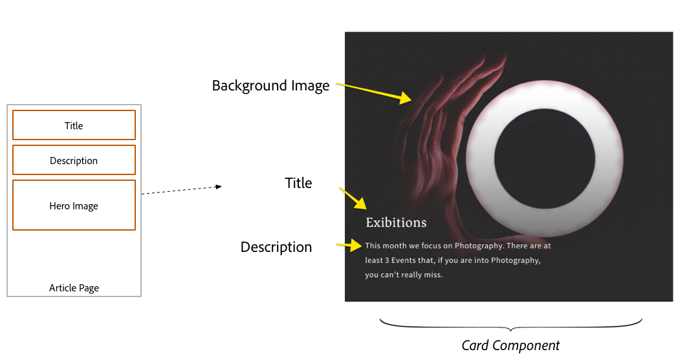

[Sling Models](https://sling.apache.org/documentation/bundles/models.html) are used to add business logic to meet the above requirements. Sling Models are entirely annotation driven "POJOs", making it easy to map data from the JCR into a Java variable.

## Create Card Component {#create-card-component}

As a first step, create the Card component and configure a dialog. The component will not render anything but allows a user to save some properties to the JCR.

1. In the **ui.apps** module beneath **/apps/wknd/components/content:**

   Add a new node named **card** of type **cq:Component.**

   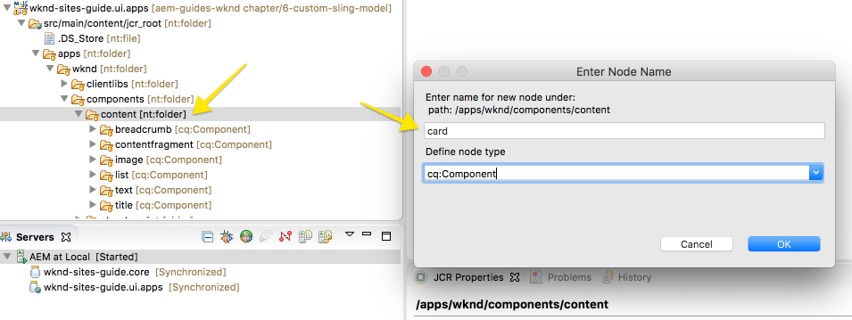

1. Add the following properties to the **Card component**

    * **componentGroup** = **WKND.Content**
    
    * **jcr:title** = **Card**
    
    * **jcr:description** = **Displays Title, Description, and image from an Article page**

   ```xml
   <?xml version="1.0" encoding="UTF-8"?>
   <jcr:root 
       xmlns:sling="http://sling.apache.org/jcr/sling/1.0"
       xmlns:jcr="http://www.jcp.org/jcr/1.0"
       jcr:primaryType="cq:Component"
       componentGroup="WKND.Content"
       jcr:title="Card"
       jcr:description="Displays Title, Description, and image from an Article page"/>
   ```

1. Beneath the **card** component, add a new file named **card.html**.
1. Populate **card.html** with the following:

   ```xml
   <div    
        data-sly-use.placeholderTemplate="core/wcm/components/commons/v1/templates.html"
        data-sly-test.isEmpty="${true}"
        class="cmp-card">
   </div>
   <sly data-sly-call="${placeholderTemplate.placeholder @ isEmpty=isEmpty}"></sly>  
   ```

   This will use the Core Component **core/wcm/components/commons/v1/templates.html** to render a placeholder before the component has been authored. Since the **isEmpty** parameter is set to true only the placeholder renders.

   The **card.html **is revisited later once the Sling Model has been created.

1. Next, define a dialog for the Card component with the following fields:

    * **articlePath** - path finder field for authors to select an article that will drive the content of the card. It is a required field.
    * **titleOverride** - The card by default will display the underlying Article's title. This is an optional text field for authors to override the display title in the card.
    * **hideDescription** - A checkbox that allows an author to toggle the display of the article's description in the card.

   Beneath the **card** component create a new node named **cq:dialog** of type **nt:unstructured**.

1. Update the **cq:dialog** with the following XML. It is easiest to open up the **.content.xml** and copy+paste the below xml into it.

   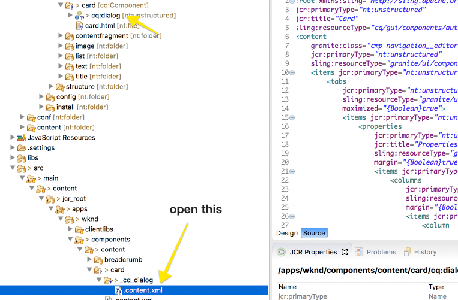 

   ```xml
   <?xml version="1.0" encoding="UTF-8"?>
   <jcr:root xmlns:sling="http://sling.apache.org/jcr/sling/1.0" xmlns:granite="http://www.adobe.com/jcr/granite/1.0" xmlns:cq="http://www.day.com/jcr/cq/1.0" xmlns:jcr="http://www.jcp.org/jcr/1.0" xmlns:nt="http://www.jcp.org/jcr/nt/1.0"
       jcr:primaryType="nt:unstructured"
       jcr:title="Card"
       sling:resourceType="cq/gui/components/authoring/dialog">
       <content
           granite:class="cmp-navigation__editor"
           jcr:primaryType="nt:unstructured"
           sling:resourceType="granite/ui/components/coral/foundation/container">
           <items jcr:primaryType="nt:unstructured">
               <tabs
                   jcr:primaryType="nt:unstructured"
                   sling:resourceType="granite/ui/components/coral/foundation/tabs"
                   maximized="{Boolean}true">
                   <items jcr:primaryType="nt:unstructured">
                       <properties
                           jcr:primaryType="nt:unstructured"
                           jcr:title="Properties"
                           sling:resourceType="granite/ui/components/coral/foundation/container"
                           margin="{Boolean}true">
                           <items jcr:primaryType="nt:unstructured">
                               <columns
                                   jcr:primaryType="nt:unstructured"
                                   sling:resourceType="granite/ui/components/coral/foundation/fixedcolumns"
                                   margin="{Boolean}true">
                                   <items jcr:primaryType="nt:unstructured">
                                       <column
                                           jcr:primaryType="nt:unstructured"
                                           sling:resourceType="granite/ui/components/coral/foundation/container">
                                           <items jcr:primaryType="nt:unstructured">
                                               <articlePath
                                                   jcr:primaryType="nt:unstructured"
                                                   sling:resourceType="granite/ui/components/coral/foundation/form/pathfield"
                                                   fieldDescription="The article page to populate the tile. Should point to a page using the Article Template."
                                                   fieldLabel="Article Page"
                                                   forceSelection="{Boolean}true"
                                                   name="./articlePath"
                                                   required="{Boolean}true"
                                                   rootPath="/content/wknd"/>
                                               <titleOverride
                                                   jcr:primaryType="nt:unstructured"
                                                   sling:resourceType="granite/ui/components/coral/foundation/form/textfield"
                                                   fieldDescription="Optional text input to override the article's title."
                                                   fieldLabel="Title Override"
                                                   name="./titleOverride"/>
                                               <hideDescription
                                                   jcr:primaryType="nt:unstructured"
                                                   sling:resourceType="granite/ui/components/coral/foundation/form/checkbox"
                                                   fieldDescription="Hide the article's description in desktop/tablet."
                                                   name="./hideDescription"
                                                   text="Hide Description"
                                                   uncheckedValue="{Boolean}false"
                                                   value="{Boolean}true"/>
                                           </items>
                                       </column>
                                   </items>
                               </columns>
                           </items>
                       </properties>
                   </items>
               </tabs>
           </items>
       </content>
   </jcr:root>
   ```

1.

    1. Update the [Landing Page Template's](http://localhost:4502/editor.html/conf/wknd/settings/wcm/templates/landing-page-template/structure.html) Layout Container to allow the **Card** Component
    
    1. Navigate to the WKND [Homepage](http://localhost:4502/editor.html/content/wknd/en.html). 
    1. Drag and drop a Card component on to the Layout Container on the Homepage.

   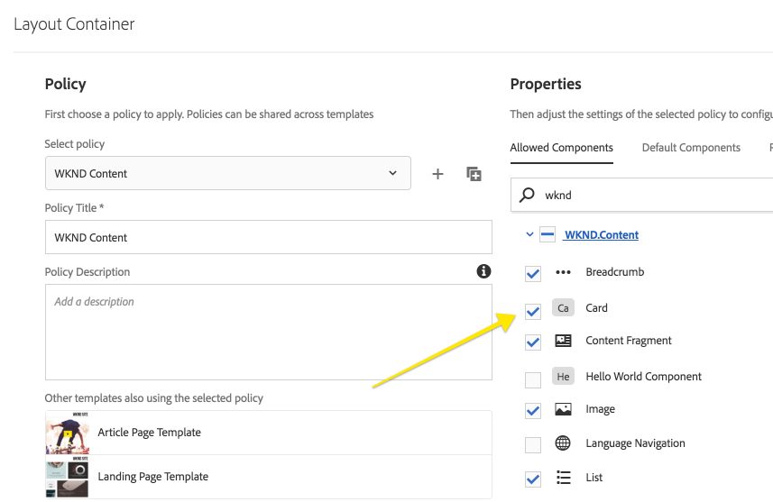

   Update Allowed Components on the Landing Page Template to include the Card Component

   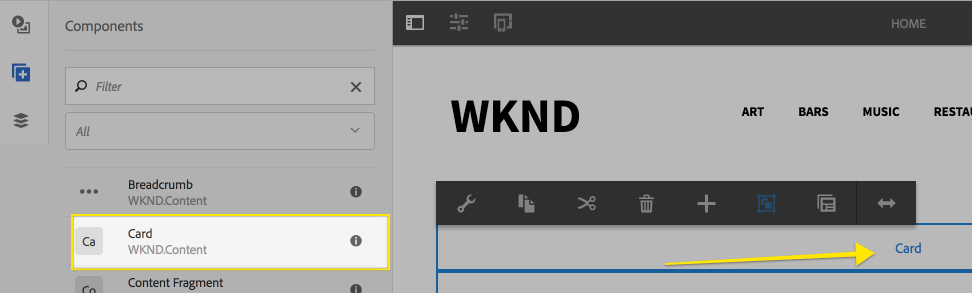

   Drag + Drop a new Card Component on to the Home Page

1. Open the dialog by clicking the **wrench** icon.

    1. Select a page that is using the Article template.
    1. Enter a value for **Title Override**. 
    1. Click **Hide Description**. 
    1. Save the dialog.

   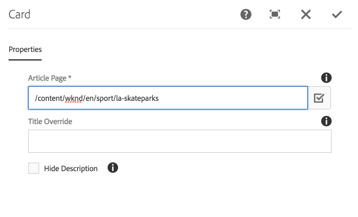

1. Navigate to ** [CRXDE-Lite](http://localhost:4502/crx/de/index.jsp)**

   In CRXDE use the tree navigation to find the page in which includes the card component.

   Find the **card** component beneath the **jcr:content** node i.e */content/wknd/en/jcr:content/root/responsivegrid/card*.

   Notice the property names of **articlePath**, **hideDescription**, **titleOverride** are stored on the card node. 

   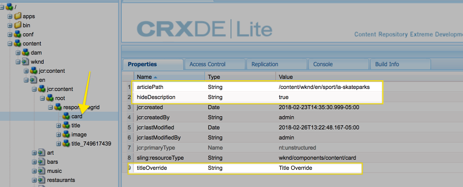

   Next a Sling Model will be written to read these properties and dynamically look up the Article Page based on the **articlePath**. Business logic to hide the description and/or override the displayed title will be implemented in the Sling Model.

## Update reactor and core pom.xml {#reactor-core-poms}

Update the **reactor** and **core pom.xml** files to use the latest standards and practices. This includes updating the AEM Uber Jar and using the new OSGi annotations.

Edit the Parent Reactor POM:** aem-guides-wknd/pom.xml**

### Edit aem-guides-wknd/pom.xml {#reactor-pom}

1. If targeting 6.4:

   ```xml
   <dependencies>
   ...
   
    <!-- AEM 6.4 Uber Jar -->
    <dependency>
        <groupId>com.adobe.aem</groupId>
        <artifactId>uber-jar</artifactId>
        <version>6.4.0</version>
        <classifier>apis</classifier>
        <scope>provided</scope>
    </dependency>
   
   ...
   </dependencies>
   ```

   >[!CAUTION]
   >
   >If using 6.3 + SP2 use the following version of the uber jar:

   ```xml
   <dependencies>
   ...
   
    <!-- AEM 6.3 SP2 Uber Jar -->
    <dependency>
        <groupId>com.adobe.aem</groupId>
        <artifactId>uber-jar</artifactId>
        <version>6.3.2</version>
        <classifier>apis</classifier>
        <scope>provided</scope>
    </dependency>
   
   ...
   </dependencies>
   ```

1. Including core.wcm.components.core allows the WKND project to leverage some of the APIs exposed by AEM Core Components.

   Below the existing Core Component dependency include the following:

   ```xml
   <dependencies>
   ...
    <dependency>
       <groupId>com.adobe.cq</groupId>
       <artifactId>core.wcm.components.all</artifactId>
       <type>zip</type>
       <version>2.0.4</version>
   </dependency>
   <!-- Add -->
   <dependency>
       <groupId>com.adobe.cq</groupId>
       <artifactId>core.wcm.components.core</artifactId>
       <version>2.0.4</version>
       <scope>provided</scope>
   </dependency>
   ...
   </dependencies>
   ```

1. 

   ```xml
   <dependency>
       <groupId>org.apache.commons</groupId>
       <artifactId>commons-lang3</artifactId>
       <version>3.0.1</version>
       <scope>provided</scope>
   </dependency>
   ```

The full contents of the updated [**parent pom.xml** can be found here.](https://github.com/Adobe-Marketing-Cloud/aem-guides-wknd/blob/part/6-custom-sling-model/pom.xml)

#### Edit aem-guides-wknd/core/pom.xml {#aem-guides-core-pom}

1. Include core.wcm.components.core as a new dependency in the **core** module.

   ```xml
   <dependencies>
   ...
   <!-- Add -->
        <dependency>
               <groupId>com.adobe.cq</groupId>
               <artifactId>core.wcm.components.core</artifactId>
           </dependency>
   ...
   </dependencies>
   ```

1. Update the **maven-bundle-plugin** to use the **Sling ModelsScannerPlugin:**

   ```xml
   <plugins>
   ...
   <plugin>
       <groupId>org.apache.felix</groupId>
       <artifactId>maven-bundle-plugin</artifactId>
       <extensions>true</extensions>
       <configuration>
           <instructions>
           <Import-Package>javax.inject;version=0.0.0,*</Import-Package>
               <Bundle-SymbolicName>com.adobe.aem.guides.wknd-sites-guide</Bundle-SymbolicName>
               <_plugin>org.apache.sling.bnd.models.ModelsScannerPlugin</_plugin>
           </instructions>
       </configuration>
       <dependencies>
           <dependency>
               <groupId>org.apache.sling</groupId>
               <artifactId>org.apache.sling.bnd.models</artifactId>
               <version>1.0.0</version>
           </dependency>
       </dependencies>
   </plugin>
   ...
   </plugins>
   ```

   The previous configuration forced the project to explicitly specify which packages contained Sling Models. The **ModelsScannerPlugin** enables the ability to create a Sling Model in any Java packages, resulting in more flexibility. See [here for more details.](https://sling.apache.org/documentation/bundles/models.html#registration-of-sling-models-classes-via-bnd-plugin)

1. 

   ```xml
   <dependency>
       <groupId>org.apache.commons</groupId>
       <artifactId>commons-lang3</artifactId>
   </dependency>
   ```

The full updates to [**core/pom.xml **can be found** **here. ](https://github.com/Adobe-Marketing-Cloud/aem-guides-wknd/blob/chapter/6-custom-sling-model/core/pom.xml)

## Card Interface {#card-interface}

Next create a public Java Interface for the Card. **Card.java** contains all of the methods needed to populate the Card component.

**In Eclipse or another IDE:**

1. Within the **wknd-sites-guide.core module** beneath **src/main/java** right+click to create a new Java package named **com.adobe.aem.guides.wknd.core.components**. Check **Create package-info.java** in the **New Java Package** dialog.

   See **Troubleshooting** if you do not see a **src/main/java** source folder. 

   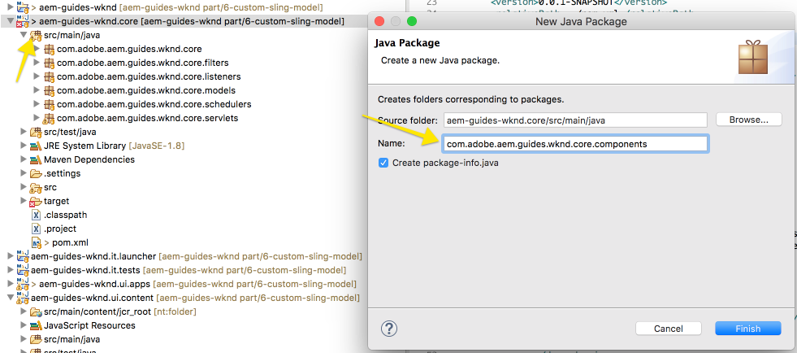

1. Beneath **com.adobe.aem.guides.wknd.components** update **package-info.java** with the following:

   ```java
   @Version("0.0.1")
   package com.adobe.aem.guides.wknd.core.components;
    
   import org.osgi.annotation.versioning.Version;
   ```

   A best practice is to version java packages that expose public interfaces. This can be used to alert consuming code if the exposed methods have changed.

1. Create a new Java Interface named **Card.java** by right+clicking   
   **com.adobe.aem.guides.wknd.core.components** package &gt; **New** &gt; **Interface**.

   For name, enter **Card** and click **Finish.**

   

1. Update **Card.java **with the following methods:

   ```java
   package com.adobe.aem.guides.wknd.core.components;
   
   public interface Card {
   
       /***
        * @return a string to display as the Title of the card.
        */
       String getTitle();
   
       /***
        * @return a string to display as the Description of the card.
        */
       String getDescription();
   
       /***
        * @return a path to populate link around the card.
        * 
        */
       String getLinkPath();
   
       /***
        * 
        * @return a path to populate the background image source of the card.
        */
       String getImageSrc();
   
       /***
        * @return a boolean if the component has content to display.
        */
       boolean isEmpty();
   
   }
   ```

   These methods provide values for the Title, Description, Link, and Image source of the Card component. The **isEmpty** method is used to determine if the component has any content to render or if it is waiting to be configured.

## Card Implementation {#card-implementation}

**CardImpl.java** is a Sling Model that implements the **Card.java** interface defined earlier.

** [The full code for CardImpl.java can be found here.](https://github.com/Adobe-Marketing-Cloud/aem-guides-wknd/blob/part/6-custom-sling-model/core/src/main/java/com/adobe/aem/guides/wknd/core/components/impl/CardImpl.java)**

1. Within the **core module** beneath **src/main/java:**

   Right+click to create a new Java package named **com.adobe.aem.guides.wknd.components.impl**. Leave "Create package-info.java" unchecked.

1. Create a new class file named **CardImpl.java** by right+clicking   
   **com.adobe.aem.guides.wknd.core.components.impl** package &gt; **New** &gt; **Class**.

   For the name, enter **CardImpl**. Add the **Card** interface as an implementing interface.

   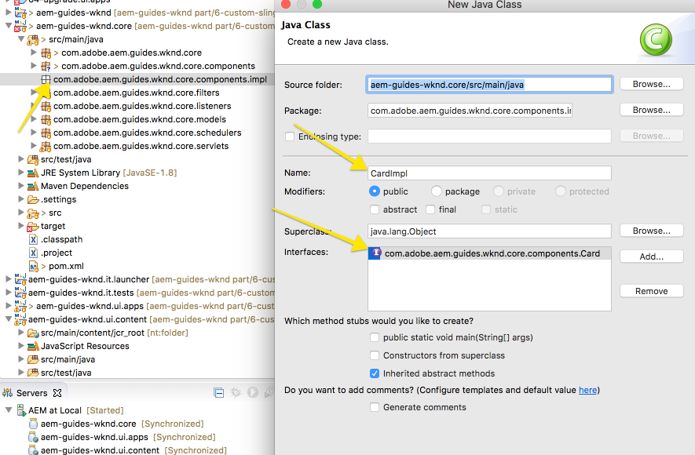

1. Open **CardImpl.java**. It is populated with all of the methods defined in **Card.java**.

   ```java
   package com.adobe.aem.guides.wknd.components.impl;
   
   import com.adobe.aem.guides.wknd.components.Card;
   
   public class CardImpl implements Card {
   
       @Override
       public String getTitle() {
           // TODO Auto-generated method stub
           return null;
       }
   
       @Override
       public String getDescription() {
           // TODO Auto-generated method stub
           return null;
       }
   
       @Override
       public String getLinkPath() {
           // TODO Auto-generated method stub
           return null;
       }
   
       @Override
       public String getImageSrc() {
           // TODO Auto-generated method stub
           return null;
       }
   
       @Override
       public boolean isEmpty() {
           // TODO Auto-generated method stub
           return false;
       }
   
   }
   ```

1. Add the Sling Model annotations by updating **CardImpl.java** with the following:

   ```java
   import org.apache.sling.api.SlingHttpServletRequest;
   import org.apache.sling.models.annotations.Model;
   import org.apache.sling.models.annotations.DefaultInjectionStrategy;
   
   ...
   
   @Model(
           adaptables = {SlingHttpServletRequest.class},
           adapters = {Card.class},
           resourceType = {CardImpl.RESOURCE_TYPE},
           defaultInjectionStrategy = DefaultInjectionStrategy.OPTIONAL
   )
   public class CardImpl implements Card {
   
       protected static final String RESOURCE_TYPE = "wknd/components/content/card";
   ```

   The @Model annotation registers CardImpl as a Sling Model when it is deployed to AEM. The **adaptables** parameter specifies that this model can be adapted by the request. The **adapters** parameter allows the implementation class to be registered under the Card interface. This allows the HTL script to call the Sling Model via the interface (instead of the impl directly). [More details about adapters can be found here](https://sling.apache.org/documentation/bundles/models.html#specifying-an-alternate-adapter-class-since-110). The **resourceType** points to the Card Component resource type (created earlier) and helps to resolve the correct model if there are multiple implementations. More details about [associating a model class with a resource type can be found here](https://sling.apache.org/documentation/bundles/models.html#associating-a-model-class-with-a-resource-type-since-130).

   >[!NOTE]
   >
   >Use Eclipse or IDE tool to resolve package imports automatically.

   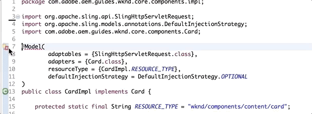

1. Add the following global variables and annotations:

   ```java
   ...
   
   import com.day.cq.wcm.api.Page;
   import com.day.cq.wcm.api.PageManager;
   import org.apache.sling.models.annotations.Required;
   import org.apache.sling.models.annotations.injectorspecific.ScriptVariable;
   import org.apache.sling.models.annotations.injectorspecific.ValueMapValue;
   
   ...
   
   public class CardImpl implements Card {
   
   ...
   
   /**
    * Represents the path to the article page 
    */
   @ValueMapValue
   private String articlePath;
       
   @ValueMapValue
   private String titleOverride;
       
   @ValueMapValue
   private boolean hideDescription;
       
   /**
    * A global variable made available by HTL script
    */
   @ScriptVariable
   @Required
   private PageManager pageManager;
       
   /***
    * The underlying article page used to populate the card content.
    */
   private Page articlePage;
   
   ...
   ```

   The **@ValueMapValue** is an annotation that injects the value of the JCR property that matches the variable name. For example, the variable **articlePath** maps to the JCR Property named *articlePath*.

   Several [Global Objects](https://helpx.adobe.com/experience-manager/htl/using/global-objects.html) are made available by the HTL/component framework, including the **PageManager**. The @ScriptVariable annotation allows the model to use these Global Objects. The **PageManager** class is used to resolve the **articlePath **to a Page.

1. Add the **init()** model method beneath the global variables:

   ```java
   ...
   
   import javax.annotation.PostConstruct;
   import org.apache.commons.lang.StringUtils;
   
   ...
   
   public class CardImpl implements Card {
   
   ...
   
   @PostConstruct
   public void init() {
           
       if(StringUtils.isNotBlank(articlePath)) {
           articlePage = pageManager.getPage(articlePath); 
       }       
   }
   
   ...
   
   }//end CardImpl
   ```

   The @PostConstruct annotation indicates that the method will be called immediately after the model is constructed. It is an opportunity to initialize any global objects that other methods will rely on.

   The **articlePath** value is read from the component and the **pageManager** resolves the path to the **articlePage**, an instance of the [Page API](https://helpx.adobe.com/experience-manager/6-3/sites/developing/using/reference-materials/javadoc/com/day/cq/wcm/api/Page.html).

1. Update methods for **getTitle()**, **getDescription()**, and **getLinkPath()**. These methods use several methods exposed by the [Page API](https://helpx.adobe.com/experience-manager/6-3/sites/developing/using/reference-materials/javadoc/com/day/cq/wcm/api/Page.html) based on the underlying **articlePage**.

   ```java
   public class CardImpl implements Card {
   
   ...
   
   /***
    * Order of resolution for the Title
    * 
    * 1. Override title (set by author dialog) if Article Page found: 2. Article
    * Page getTitle() 3. Article Page getName() otherwise return null
    */
   @Override
   public String getTitle() {
       String title = null;
   
       //if a Title Override is found use that
       if (StringUtils.isNotBlank(titleOverride)) {
           return titleOverride;
       }
   
       //Otherwise look for the title on the Page and fall back to the name.
       if (articlePage != null) {
           title = StringUtils.isNotBlank(articlePage.getTitle()) ? articlePage.getTitle() : articlePage.getName();
       }
       return title;
   }
   
   @Override
   public String getDescription() {
       
       //if hideDesciption not true
       if (articlePage != null && !hideDescription) {
           return articlePage.getDescription();
       }
       return null;
   }
   
   @Override
   public String getLinkPath() {
       //Use the articlePage's path to populate the link for the card
       if (articlePage != null) {
           return articlePage.getPath();
       }
       return null;
   }
   
   ...
   
   }//end CardImpl
   ```

1. To implement the **getImageSrc()** method it is preferable to use the Core Component Image model: **com.adobe.cq.wcm.core.components.models.Image**. Using the Core Image model avoids rewriting complex logic to resolve an image source. A few more annotations are needed.

   ```java
   ...
   import org.apache.sling.models.factory.ModelFactory;
   import org.apache.sling.models.annotations.injectorspecific.Self;
   ...
   
   public class CardImpl implements Card {
   ...
   
   //Relative location of Article Page to look for Hero Image
   private static final String HERO_IMAGE_LOCATION = "root/image";
       
   @Self
   @Required
   private SlingHttpServletRequest request;
       
   @OSGiService
   private ModelFactory modelFactory;
   ...
   
   } //end CardImpl
   ```

   The HERO_IMAGE_LOCATION defines the location of the Hero Image relative to the Article Page's **jcr:content** node. The **Hero Image** is a fixed part of the **Structure** portion of the **Article Page's** template. It is therefore a safe assumption that the Hero Image will be there.

   The **SlingHttpServletRequest** is the request for the Card component. The **SlingHttpServletRequest** and the **ModelFactory** are used to adapt the Hero Image Resource to the Core Component **Image** model. The ModelFactory is a safe method for referencing another Sling Model within the current Sling Model.

   >[!CAUTION]
   >
   >It is possible that while editing the Article Page Template that the Hero Image node name has changed.
   >
   >
   >To verify the location of the Hero Image, in [CRXDE-Lite](http://localhost:4502/crx/de/index.jsp#/conf/wknd/settings/wcm/templates/article-page-template/structure/jcr%3Acontent/root/image) find */conf/wknd/settings/wcm/templates/article-page-template/structure/jcr:content/root/image*.

1. Populate the **getImageSrc()** with the following:

   ```java
   ...
   import org.apache.sling.api.resource.Resource;
   import com.adobe.cq.wcm.core.components.models.Image;
   ...
   
   public class CardImpl implements Card {
   ...
   
   @Override
   public String getImageSrc() {
       if (articlePage != null) {
   
           // get the resource of the hero image relative to the article page
           Resource heroImgRes = articlePage.getContentResource(HERO_IMAGE_LOCATION);
   
           // if the resource is found
           if (heroImgRes != null) {
               // Adapt the resource using the Core Image component
               // com.adobe.cq.wcm.core.components.models.Image
               // since the Core Image component can only be adapted from a
               // SlingHttpServletRequest we need to use the
               // modelFactory to wrap the request.
               Image img = modelFactory.getModelFromWrappedRequest(request, heroImgRes, Image.class);
   
               if (img != null) {
                   // use Image model to return the src attribute
                   return img.getSrc();
               }
           }
   
       }
       return null;
   }
   
   ..
   } //end CardImpl
   ```

1. Populate the **isEmpty()** method with logic based on the availability of the **articlePage**.

   ```java
   public class CardImpl implements Card {
   ...
   
   @Override
   public boolean isEmpty() {
       //if the articlePage is non null then the component is not empty
       if (articlePage != null) {
           return false;
       }
       
       //if the articlePage cannot be found return true
       return true;
   }
   
   ...
   
   } //end CardImpl
   ```

1. Deploy the code to AEM.

   Navigate to the ** [OSGi Console](http://localhost:4502/system/console/bundles)** &gt; **Status** &gt; **Sling Models**

   

1. The **CardImpl** is now registered as a Sling Model and bound to the resource type *wknd/components/content/card*. 

   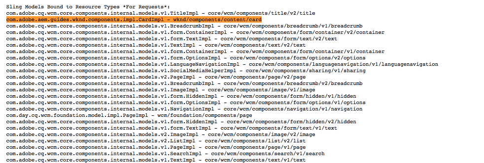

** [The full code for CardImpl.java can be found here.](https://github.com/Adobe-Marketing-Cloud/aem-guides-wknd/blob/chapter/6-custom-sling-model/core/src/main/java/com/adobe/aem/guides/wknd/components/impl/CardImpl.java)**

## Card HTL {#card-htl}

1. In the **ui.apps** module open **/apps/wknd/components/content/card/card.html**.

   Update **card.html** with the following:

   ```xml
   <!-- variable `card` uses the Card interface which is backed by the CardImpl Sling Model -->
   <div data-sly-use.card="com.adobe.aem.guides.wknd.core.components.Card"
        data-sly-use.placeholderTemplate="core/wcm/components/commons/v1/templates.html"
        data-sly-test.hasContent="${!card.isEmpty}"
        class="cmp-card">
        <!-- use method getLinkPath() to populate card link -->
        <a class="cmp-card__link" href="${card.linkPath @ extension = 'html'}">
           <!-- use an in-line style to populate the background image of the card, using the getImageSrc() method -->
           <div class="cmp-card__wrapper"
                 style="background-image: url(${card.imageSrc @ context='uri'})">
                   <div class="cmp-card__content">
                        <!-- Populate the card title using the getTitle() method -->
                        <h2 class="cmp-card__title" data-sly-test.title="${card.title}">${title}</h2>
                        <!-- Populate the description using the getDescription() method -->
                        <h3 class="cmp-card__description" data-sly-test.description="${card.description}">${description}</h3>
                   </div>
               </div>
       </a>
   </div>
   <sly data-sly-call="${placeholderTemplate.placeholder @ isEmpty=card.isEmpty}"></sly>
   ```

   The **data-sly-use.card="com.adobe.aem.guides.wknd.components.Card"** uses the **Card** interface which is implemented by **CardImpl**. An HTL variable named **card** is created and can be used in the rest of the script to call various methods of the **Card** object. In HTL *getter* methods exposed by the Card model are shortened:

    * (Java Method) **getLinkPath()** -&gt; (HTL call) **.linkPath**

   Java methods that require a parameter cannot be used in HTL. This is by design to keep the logic in HTL very simple.

   HTL detects the context of any expressions and automatically protects against **XSS** (cross site scripting). In some cases, an explicit context must be set. An example of this is the in-line style for the **background-image.** The **@context='uri'** is added safely to render the Image Source within in-line style. More information about the [HTL Expression Language can be found here](https://helpx.adobe.com/experience-manager/htl/using/expression-language.html).

1. **Add default styles for the Card Component**. In the **ui.apps** project under **/apps/wknd/clientlibs/clientlib-site/components**:

    1. Create a new folder named **card**.
    1. Create a new file beneath the **card** folder named **card.less**.
    
    1. Create a new folder beneath the **card** folder named **styles**.
    
    1. Create a new file beneath **card/styles** folder named **default.less**.

   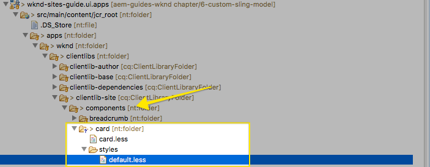

1. Populate **card.less** with the following:

   ```css
   /* WKND Card - card.less*/
   
   @card-default-height: 365px;
   @card-mini-height: ((@card-default-height / 2) - 10px);
   @card-mobile-height: 265px;
   @light-color: #fff;
   @dark-color: @text-color;
   
   @import-once "styles/default.less";
   ```

1. Populate **default.less** with the following:

   ```css
   /* WKND Card - default.less*/
   
   .cmp-card {
       
       position: relative;
       margin-bottom: 1em;
       
       .cmp-card__link {
           display: block;
       }
       
       .cmp-card__wrapper {
           display: block;
           width: 100%;
           background-position: center;
           height: @card-default-height;
           background-size:cover;
           background-color:@light-color;
       }
       
       .cmp-card__content {
           width: 100%;
           text-align: center;
           position: absolute;
           color: @dark-color;
           padding-left: 2em;
           padding-right: 2em;
           top: 0;
       }
       
       .cmp-card__title {
           font-family: @font-family-serif;
       }
       
       .cmp-card__description {
           font-size: @font-size-small;
           margin-top: 0.25em;
       }
       
       @media (max-width: (@screen-sm-min + 1)) {
       
           .cmp-card__wrapper {
               height: @card-mobile-height;
           }
           
           .cmp-card__description {
               display: none;  
           }

       }
       
   } 
   ```

1. Update **/apps/wknd/clientlibs/clientlib-site/main.less** to include **card.less.**

   Add an import statement to include **card.less** beneath the other imports of component styles.

   ```css
   /* WKND main.less */
   ...
   
   /* Import WKND Components styles */
   ...
   
   @import "components/card/card.less";
   ```

1. Deploy the code to AEM.
1. 

   >[!CAUTION]
   >
   >The below package overwrites any content currently on the local AEM instance beneath:  
   >**/content/wknd** and **/content/dam/wknd.**
   >
   >
   >This is an optional installation.

   [Get File](assets/chapt-6-sample-content-inprogress-1001.zip)

1. Navigate to the [Home page](http://localhost:4502/editor.html/content/wknd/en.html) and add a new card component to the page.

   Configure the card component to point to **/content/wknd/en/restaurants/best-roasters **or another article.

   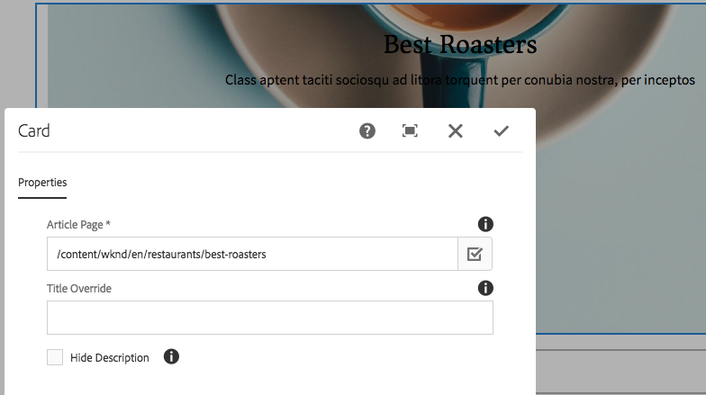

    * To override the Article's title enter text for **Title Override.**
    * To hide the Article's description check **Hide Description.**

1. Add another Card Component and point it to **/content/wknd/en/music/exhibitions **or to a different article than in the previous step.

   Use **Layout Mode** to change the size of the cards and make them align.

   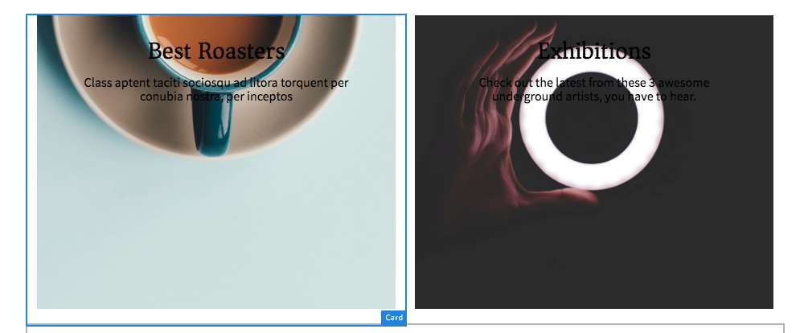

   >[!NOTE]
   >
   >The text can be difficult to read based on the position and color of the background image. In the next section styles are added to allow authors to manipulate the text position and color within individual cards.

## Integrate Style System {#styles-card-component}

To give authors more flexibility with the layout/design of the Card component the Style System is leveraged. This allows authors to:

* **Change the position of the Title/Description**

    * Left
    * Right
    * Top
    * Bottom

* **Change the text color of the Title/Description**

    * White
    * Black

*

    * Default
    * Mini

In the **ui.apps** project under **/apps/wknd/clientlibs/clientlib-site/components/card/styles**:

1. Create a new file named **position.less** beneath **/apps/wknd/clientlibs/clientlib-site/components/card/styles**.

   Populate **position.less** with the following:

   ```css
   /* WKND Card - position.less*/
   
   .cmp-card--left {
       .cmp-card {
           
           .cmp-card__content {
               text-align: left;
               width: 60%;
               left: 0;
           }
           
           @media (max-width: (@screen-sm-min + 1)) {
               .cmp-card__content {
                   width: 100%;
                   text-align:center;
               }
           }
       }
   }
   
   .cmp-card--center { 
       .cmp-card {
           
           .cmp-card__content {
               text-align: center;
           }
       }
   }
   
   .cmp-card--right {
       .cmp-card {
           
           .cmp-card__content {
               text-align: right;
               width:60%;
               right:0;
           }
           
           @media (max-width: (@screen-sm-min + 1)) {
               .cmp-card__content {
                   width: 100%;
                   text-align:center;
               }
           }
       }
   }
   
   .cmp-card--top {
       .cmp-card { 
           .cmp-card__content {
               top: 0;
               bottom:unset;
           }
       }
   }
   
   .cmp-card--bottom {
       .cmp-card { 
           .cmp-card__content {
               bottom: 0;
               top:unset;
           }
       }
   }
   ```

1. Create another file beneath the **styles** folder named **color.less**.

   Populate **color.less** with the following:

   ```css
   /* WKND Card - color.less*/
   
   .cmp-card--white {
       
       .cmp-card {
           .cmp-card__content {
               color: @light-color;
           }
           
           .cmp-card__wrapper {
               background-color: @dark-color;
           }
       }
   }
   ```

1. Create a fourth file beneath the **styles** folder named **size.less**.  
   Populate **size.less** with the following:

   ```css
   /* WKND Card - size.less*/
   
   .cmp-card--mini {
       
       .cmp-card {
           .cmp-card__wrapper {
               height: @card-mini-height;
           }
       }
   }
   ```

1. Update **card.less** to import the new style files:

   ```css
   /* WKND Card - card.less*/
   
   @card-default-height: 365px;
   @card-mini-height: ((@card-default-height / 2) - 10px);
   @card-mobile-height: 265px;
   @light-color: #fff;
   @dark-color: @text-color;
   
   @import-once "styles/default.less";
   @import-once "styles/position.less";
   @import-once "styles/color.less";
   @import-once "styles/size.less";
   ```

   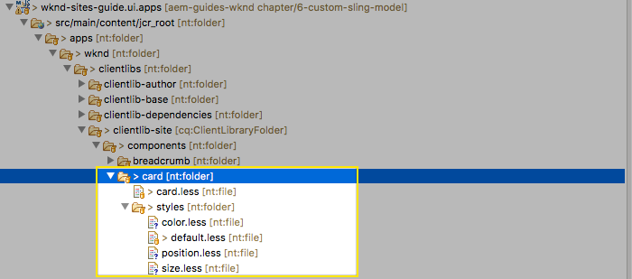

1. Add a Design Dialog to the Card Component to enable the Style System. In the **ui.apps** module beneath **/apps/wknd/components/content/card:**

   Create a new node named **cq:design_dialog** of type **nt:unstructured**.

1. Editing the XML directly is most efficient. Open **.content.xml** beneath:

   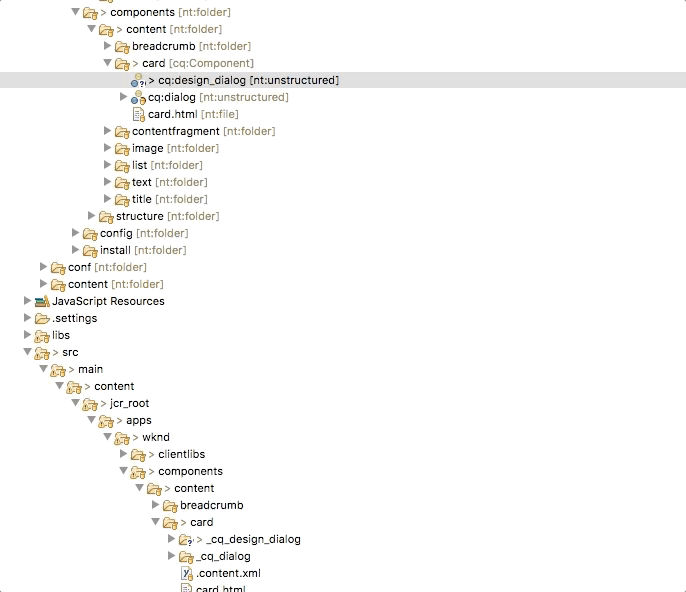

   Populate the **.content.xml** with the following to enable the Styles tab in the Card Component's policy dialog:

   ```xml
   <?xml version="1.0" encoding="UTF-8"?>
   <jcr:root xmlns:sling="http://sling.apache.org/jcr/sling/1.0" xmlns:cq="http://www.day.com/jcr/cq/1.0" xmlns:jcr="http://www.jcp.org/jcr/1.0" xmlns:nt="http://www.jcp.org/jcr/nt/1.0"
       jcr:primaryType="nt:unstructured"
       jcr:title="Card"
       sling:resourceType="cq/gui/components/authoring/dialog">
       <content
           jcr:primaryType="nt:unstructured"
           sling:resourceType="granite/ui/components/coral/foundation/container">
           <items jcr:primaryType="nt:unstructured">
               <tabs
                   jcr:primaryType="nt:unstructured"
                   sling:resourceType="granite/ui/components/coral/foundation/tabs"
                   maximized="{Boolean}true">
                   <items jcr:primaryType="nt:unstructured">
                       <styletab
                           jcr:primaryType="nt:unstructured"
                           sling:resourceType="granite/ui/components/coral/foundation/include"
                           path="/mnt/overlay/cq/gui/components/authoring/dialog/style/tab_design/styletab"/>
                   </items>
               </tabs>
           </items>
       </content>
   </jcr:root>
   ```

   Deploy to the code to AEM.

1.

    1. In AEM navigate to **Landing Page Template**: [http://localhost:4502/editor.html/conf/wknd/settings/wcm/templates/landing-page-template/structure.html](http://localhost:4502/editor.html/conf/wknd/settings/wcm/templates/landing-page-template/structure.html)
    
    1. In the Layout Container, click the **policy** icon next to the Card to open its Policy dialog.

   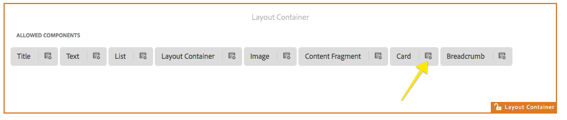

1.

    1. Policy &gt; Policy Title&#42; = **WKND Card Policy**
    1. Styles &gt; Allowed Styles &gt; Style Group named **Text Alignment**. Add the following styles:

        * **Left** = **cmp-card--left**
        
        * **Center** = **cmp-card--center**
        
        * **Right** = **cmp-card--right**

    1. Add a new style group named **Text Position**. Add the following styles:

        * **Top** = **cmp-card--top**
        
        * **Bottom** = **cmp-card--bottom**

    1. Add a third style group named **Text Color**. Add the following styles:

        * **Black** = **cmp-card--default**
        
        * **White** = **cmp-card--white**

    1. Add a fourth style group named **Size**. Add the following styles:

        * **Default** = **cmp-card--default**
        
        * **Mini** = **cmp-card--mini**

   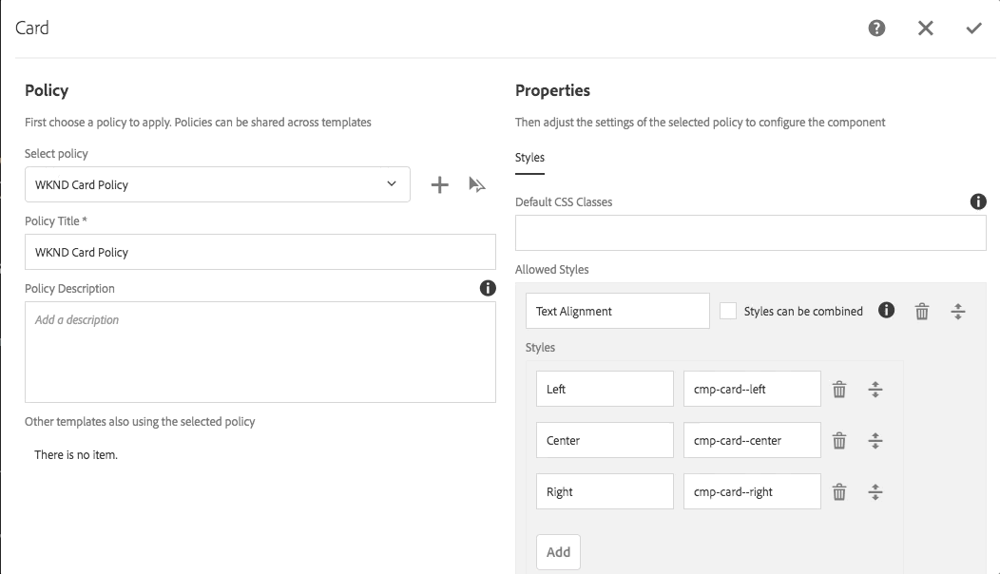

   Save the changes to the card policy.

## Putting It Together {#putting-together}

The below video shows editing the [WKND Home Page](http://localhost:4502/editor.html/content/wknd/en.html) and adding several **Card** components with different content and styles to create a compelling home page.

>[!VIDEO](https://video.tv.adobe.com/v/21626?quality=9)

## Help! {#help}

## Next Steps {#next-steps}

Check back soon for the next part in the tutorial!

Download the finished package for this part of the tutorial: [https://github.com/Adobe-Marketing-Cloud/aem-guides-wknd/releases](https://github.com/Adobe-Marketing-Cloud/aem-guides-wknd/releases)

## Troubleshooting {#troubleshooting}

Note if you do not see **src/main/java** source folder in Eclipse you can add the folders by right clicking **src** and adding folders for **main **and **java**. After adding the folders you should see the **src/main/java** package appear. 

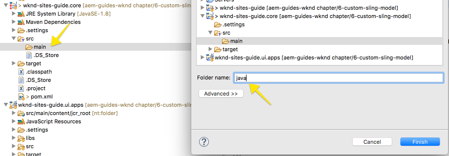

Note if you have unresolved package imports for some of the new dependencies added to the core project, try updating the **wknd-sites-guide.core** maven project. You can do this by Right+Clicking **wknd-sites-guide.core** &gt; **Maven** &gt; **Update Project**.

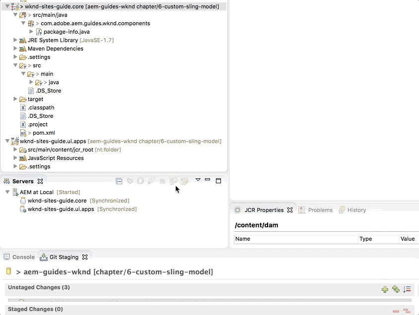

