# Pages and Templates {#pages-and-template}

In this chapter we will explore the relationship between a base page component and editable templates. We will build out an un-styled Article template based on some mockups from [AdobeXD](https://www.adobe.com/products/xd.html). In the process of building out the template, Core Components and advanced policy configurations of the Editable Templates are covered.

## Prerequisites {#prerequisites}

Review the required tooling and instructions for setting up a [local development environment](overview.md#local-dev-environment).

### Starter Project

Check out the base-line code the tutorial builds on:

1. Clone the [github.com/adobe/aem-guides-wknd](https://github.com/adobe/aem-guides-wknd) repository.
2. Check out the `pages-templates/start` branch

   ```shell
   $ git clone git@github.com:adobe/aem-guides-wknd.git ~/code/aem-guides-wknd
   $ cd ~/code/aem-guides-wknd
   $ git checkout pages-templates/start
   ```

3. Deploy code base to a local AEM instance using your Maven skills:

   ```shell
   $ cd ~/code/aem-guides-wknd
   $ mvn clean install -PautoInstallSinglePackage
   ```

You can always view the finished code on [GitHub](https://github.com/adobe/aem-guides-wknd/tree/pages-templates/solution) or check the code out locally by switching to the branch `pages-templates/solution`.

## Objective

1. Inspect a page design created in Adobe XD and map it to Core Components.
2. Understand the details of Editable Templates and how policies can be used to enforce granular control of page content.
3. Learn how Templates and Pages are linked 

## What you will build {#what-you-will-build}

In this part of the tutorial, you will build a new Article Page Template that can be used to create new article pages and aligns with a common structure. The Article Page Template will be based on designs and a UI Kit produced in AdobeXD. This chapter is only focused on building out the structure or skeleton of the template. No styles will be implemented but the template and pages will be functional.

   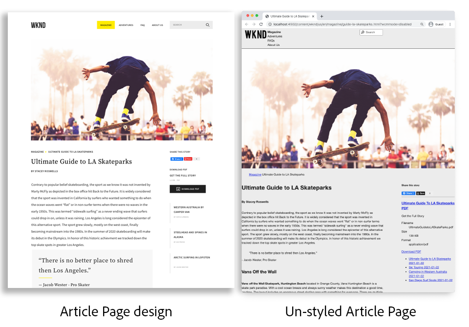

## UI Planning with Adobe XD {#adobexd}

In most cases, planning for a new website starts with mockups and static designs. [Adobe XD](https://www.adobe.com/products/xd.html) is a design tool building user experiences. Next we will inspect a UI Kit and mockups to help plan the structure of the Article Page Template.

>[!VIDEO](https://video.tv.adobe.com/v/30214/?quality=12&learn=on)

Download the [WKND Article Design File](https://github.com/adobe/aem-guides-wknd/releases/download/aem-guides-wknd-0.0.2/AEM_UI-kit-WKND-article-design.xd).

## Create a Header and Footer with Experience Fragments {#experience-fragments}

A common practice when creating global content, such as a header or footer, is to use an [Experience Fragment](https://docs.adobe.com/content/help/en/experience-manager-learn/sites/experience-fragments/experience-fragments-feature-video-use.html). Experience Fragments, allow us to combine multiple components to create a single, reference-able, component. Experience Fragments have the advantage of supporting multi-site management and allows us to manage different headers/footers per locale.

Next  we will update the Experience Fragment intended to be used as the Header and Footer to add the WKND logo.

>[!VIDEO](https://video.tv.adobe.com/v/30215/?quality=12&learn=on)

>[!NOTE]
>
> Does your Experience Fragments look different then in the video? Try deleting them and re-installing the starter project code base.

Below are the high level steps performed in the above video.

1. Update the Experience Fragment Header located at [http://localhost:4502/editor.html/content/experience-fragments/wknd/us/en/site/header/master.html](http://localhost:4502/editor.html/content/experience-fragments/wknd/us/en/site/header/master.html) to include the WKND Dark logo.

   

   *WKND Dark logo*

2. Update the Experience Fragment Header located [http://localhost:4502/editor.html/content/experience-fragments/wknd/us/en/site/footer/master.html](http://localhost:4502/editor.html/content/experience-fragments/wknd/us/en/site/footer/master.html) to include the WKND Light logo.

   

   *WKND Light logo*

## Create the Article Page Template

When creating a page you must select a template, which will be used as the basis for creating the new page. The template defines the structure of the resultant page, initial content, and allowed components.

There are 3 main areas of [Editable Templates](https://docs.adobe.com/content/help/en/experience-manager-65/developing/platform/templates/page-templates-editable.html):

1. **Structure** - defines components that are a part of the template. These will not be editable by content authors.
2. **Initial Content** - defines components that the template will start with, these can be edited and/or deleted by content authors
3. **Policies** - defines configurations on how components will behave and what options authors will have available.

The next thing we will do is create the Article Page Template. This will occur in a local instance of AEM.

>[!VIDEO](https://video.tv.adobe.com/v/30217/?quality=12&learn=on)

Below are the high level steps performed in the above video.

1. Navigate to the WKND Sites Template folder:

   **Tools** &gt; **General** &gt; **Templates** &gt; **WKND Site**

2. Create a new template using the **WKND Site Empty Page** Template Type with a title of **Article Page Template**

3. In **Structure** mode, configure the template to include the following elements:

   * Experience Fragment Header
   * Image
   * Breadcrumb
   * Container - 8 columns wide Desktop, 12 columns wide Tablet, Mobile
   * Container - 4 columns wide, 12 columns wide Tablet, Mobile
   * Experience Fragment Footer

   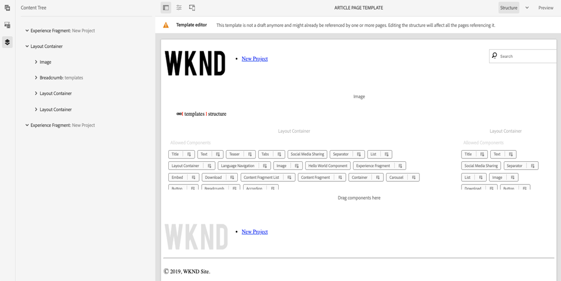

   *Structure - Article Page Template*

4. Switch to **Initial Content** mode and add the following components as starter content:

   * **Main Container**
      * Title - default size of H1
      * Title - *"By Author Name"* with a size of H4
      * Text - empty
   * **Side Container**
      * Title - *"Share this Story"* with a size of H5
      * Social Media Sharing
      * Separator
      * Download
      * List

   

   *Initial Content - Article Page Template*

5. Update the **Initial Page Properties** to enable user sharing for both **Facebook** and **Pinterest**.
6. Upload an image to the **Article Page Template's** properties in order to easily identify it:

   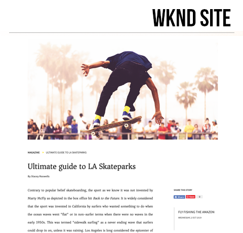

   *Article Page Template Thumbnail*

7. Enable the **Article Page Template's** in the [WKND Site Templates folder](http://localhost:4502/libs/wcm/core/content/sites/templates.html/conf/wknd/settings/wcm/templates).

## Create an Article Page

Now that we have a template, let's create a new page using that template.

1. Download the following zip package, [WKND-PagesTemplates-DAM-Assets.zip](assets/pages-templates/WKND-PagesTemplates-DAM-Assets.zip) and install it via [CRX Package Manager](http://localhost:4502/crx/packmgr/index.jsp).

   The above package will install several images and assets beneath `/content/dam/wknd/en/magazine/la-skateparks` to be used to populate an article page in later steps.

   *Images and assets in the above package are license free courtesy of [Unsplash.com](https://unsplash.com/).*

   

2. Create a new page, beneath **WKND** &gt; **US** &gt; **en**, named **Magazine**. Use the **Content Page** Template.

   This page will add some structure to our site and allow us to see the Breadcrumb component in action.

3. Next create a new page, beneath  **WKND** &gt; **US** &gt; **en** &gt; **Magazine**. Use the **Article Page** template. Use a title of **Ultimate guide to LA Skateparks** and a name of **guide-la-skateparks**.

   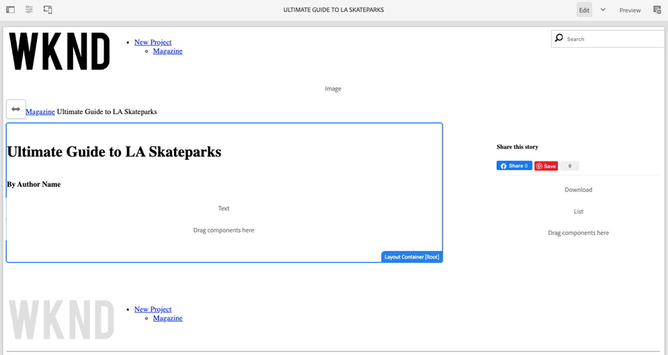

4. Populate the page with content in order to match the mockups inspected in [UI Planning with AdobeXD](#adobexd) portion. Sample article text can be [downloaded here](assets/pages-templates/la-skateparks-copy.txt). You should be able to create something similar to this:

   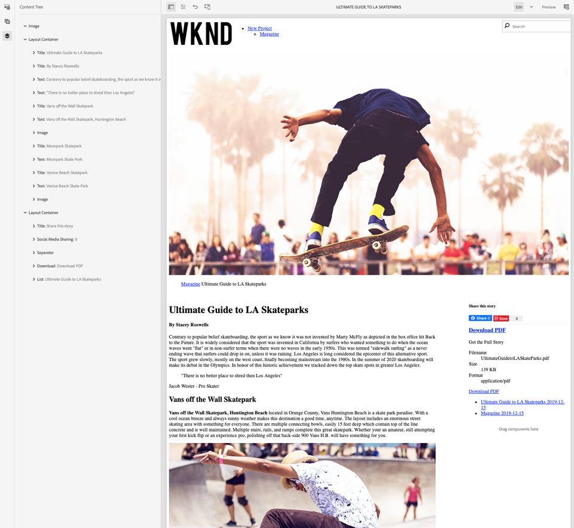

   >[!NOTE]
   >
   > The Image component at the top the page can be edited but not removed. The breadcrumb component appears on the page but cannot be edited or removed.

## Inspect the node structure {#node-structure}

At this point the article page is clearly un-styled. However the basic structure is in place. Next we will look at the node structure of the article page in order to gain a better understanding of the role of the template and page component's responsible for rendering the content.

We can do this using the CRXDE-Lite tool on a local AEM instance.

1. Open [CRXDE-Lite](http://localhost:4502/crx/de/index.jsp#/content/wknd/us/en/magazine/guide-la-skateparks/jcr%3Acontent) and use the tree navigation to navigate to `/content/wknd/us/en/magazine/guide-la-skateparks`.

2. Click on the `jcr:content` node beneath the `la-skateparks` page and view the properties:

   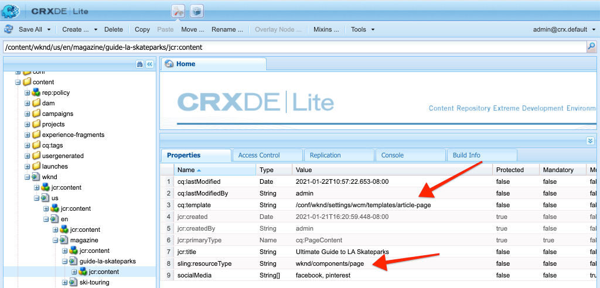

   Notice the value for `cq:template`, which points to `/conf/wknd/settings/wcm/templates/article-page`, the Article Page Template we created earlier.

   Also notice the value of `sling:resourceType`, which points to `wknd/components/structure/page`. This is the page component created by the AEM project archetype and is responsible for rendering page based on the template.

3. Expand the `jcr:content` node beneath `/content/wknd/us/en/magazine/guide-la-skateparks/jcr:content` and view the node hierarchy:

   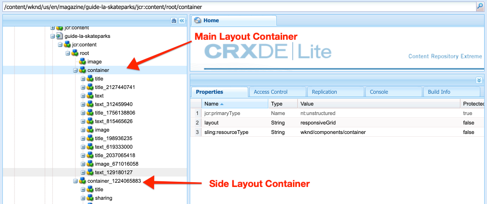

   You should be able to loosely map each of the nodes to components that were authored. See if you can identify the different Layout Containers used by inspecting the nodes prefixed with `responsivegrid`.

4. Next inspect the page component at `/apps/wknd/components/structure/page`. View the component properties in CRXDE Lite:

   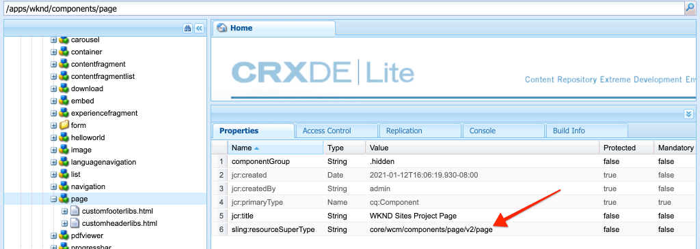

   Note that the page component is beneath a folder named **structure**. This is a convention that corresponds to the Template Editor structure mode and is used to indicate that the page component is not something authors will interact with directly.

   Note that there are only 2 HTL scripts, `customfooterlibs.html` and `customheaderlibs.html` beneath the page component. So how does this component render the page?

   Note the `sling:resourceSuperType` property and the value of `core/wcm/components/page/v2/page`. This property allows the WKND's page component to inherit all of the functionality of the Core Component page component. This is the first example of something called the [Proxy Component Pattern](https://docs.adobe.com/content/help/en/experience-manager-core-components/using/developing/guidelines.html#ProxyComponentPattern). More information can be found [here.](https://docs.adobe.com/content/help/en/experience-manager-core-components/using/developing/guidelines.html).

5. Inspect another component within the WKND components, the `Breadcrumb` component located at: `/apps/wknd/components/content/breadcrumb`. Notice that the same `sling:resourceSuperType` property can be found, but this time it points to `core/wcm/components/breadcrumb/v2/breadcrumb`. This is another example of using the Proxy component pattern to include a Core Component. In fact, all of the components in the WKND code base are proxies of AEM Core Components (except for our famous HelloWorld component). It is a best practice to try and re-use as much of the functionality of Core Components as possible *before* writing custom code.

6. Next inspect the Core Component Page at `/apps/core/wcm/components/page/v2/page` using CRXDE Lite:

   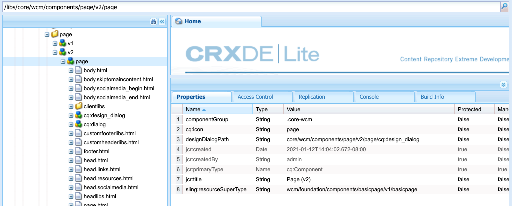

   Notice that many more scripts are included beneath this page. The Core Component Page contains a lot of functionality. This functionality is broken into multiple scripts for easier maintenance and readability. You can trace the inclusion of the HTL scripts by opening the `page.html` and looking for `data-sly-include`:

   ```html
   <!--/* /apps/core/wcm/components/page/v2/page/page.html */-->
   <!DOCTYPE HTML>
   <html data-sly-use.page="com.adobe.cq.wcm.core.components.models.Page" lang="${page.language}"
         data-sly-use.head="head.html"
         data-sly-use.footer="footer.html"
         data-sly-use.redirect="redirect.html">
      <head data-sly-call="${head.head @ page = page}"></head>
      <body class="${page.cssClassNames}">
         <sly data-sly-test.isRedirectPage="${page.redirectTarget && (wcmmode.edit || wcmmode.preview)}"
               data-sly-call="${redirect.redirect @ redirectTarget = page.redirectTarget}"></sly>
         <sly data-sly-test="${!isRedirectPage}">
               <sly data-sly-include="body.socialmedia_begin.html"></sly>
               <sly data-sly-include="body.html"></sly>
               <sly data-sly-call="${footer.footer @ page = page}"></sly>
               <sly data-sly-include="body.socialmedia_end.html"></sly>
         </sly>
      </body>
   </html>
   ```

   The other reason for breaking out the HTL into multiple scripts is to allow the proxy components to override individual scripts to implement custom business logic. The HTL scripts, `customfooterlibs.html` and `customheaderlibs.html`, are created for the explicit purpose to be overridden by implementing projects.

   You can learn more about how the Editable Template factors into the rendering of the [content page by reading this article](https://docs.adobe.com/content/help/en/experience-manager-65/developing/platform/templates/page-templates-editable.html#resultant-content-pages).

7. Inspect the another Core Component, like the Breadcrumb at `/apps/core/wcm/components/breadcrumb/v2/breadcrumb`. View the `breadcrumb.html` script to understand how the markup for the Breadcrumb component is ultimately generated.

## Saving Configurations to Source Control {#configuration-persistence}

In many cases, especially at the beginning of an AEM project it is valuable to persist configurations, like templates and related content policies, to source control. This ensures that all developers are working against the same set of content and configurations and can ensure additional consistency between environments. Once a project reaches a certain level of maturity, the practice of managing templates can be turned over to a special group of power users.

For now we will treat the templates like other pieces of code and sync the **Article Page Template** down as part of the project. Up until now we have **pushed** code from our AEM project to a local instance of AEM. The **Article Page Template** was created directly on a local instance of AEM, so we need to **pull** or import the template into our AEM project. The **ui.content** module is included in the AEM project for this specific purpose.

The next few steps will take place using the Eclipse IDE, but could be doing using any IDE that you have configured to **pull** or import content from a local instance of AEM.

1. In the Eclipse IDE, ensure that a server the connecting AEM developer tool plugin to the local instance of AEM has been started and that the **ui.content** module has been added to the Server configuration.

   

2. Expand the **ui.content** module in the Project explorer. Expand the `src` folder (the one with the small glob icon) and navigate to `/conf/wknd/settings/wcm/templates`.

3. [!UICONTROL Right+Click] the `templates` node and select **Import from Server...**:

   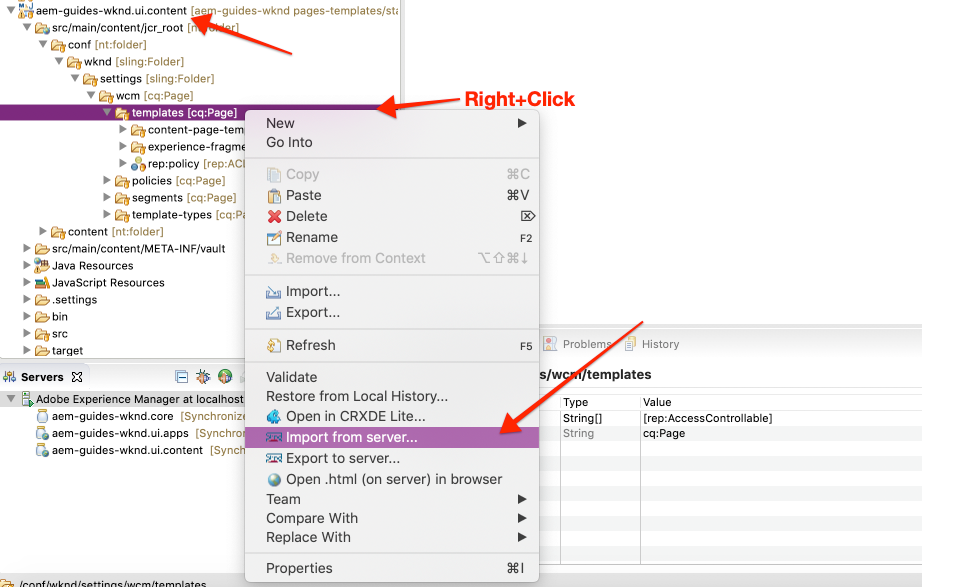

   Confirm the **Import from Repository** dialog and click **Finish**. You should now see the `article-page-template` beneath the `templates` folder.

4. Repeat the steps to import content but select the **policies** node located at `/conf/wknd/settings/wcm/policies`.

   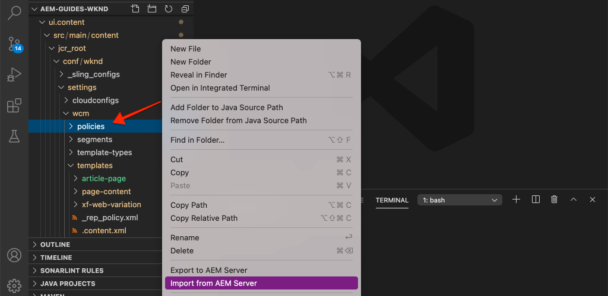

5. Inspect the `filter.xml` file located at `src/main/content/META-INF/vault/filter.xml`.

   ```xml
   <!--ui.content filter.xml-->
   <?xml version="1.0" encoding="UTF-8"?>
   <workspaceFilter version="1.0">
      <filter root="/conf/wknd" mode="merge"/>
      <filter root="/content/wknd" mode="merge"/>
      <filter root="/content/dam/wknd" mode="merge"/>
      <filter root="/content/experience-fragments/wknd" mode="merge"/>
   </workspaceFilter>
   ```

   The `filter.xml` file is responsible for identifying the paths of nodes that will be installed with the package. Notice the `mode="merge"` on each of the filters which indicates that existing content will not be modified, only new content is added. Since content authors may be updating these paths, it is important that a code deployment does **not** overwrite content. See the [FileVault documentation](https://jackrabbit.apache.org/filevault/filter.html) for more details on working with filter elements.

   Compare `ui.content/src/main/content/META-INF/vault/filter.xml` and `ui.apps/src/main/content/META-INF/vault/filter.xml` to understand the different nodes managed by each module.

   >[!WARNING]
   >
   > In order to ensure consistent deployments for the WKND Reference site some branches of the project are setup such that `ui.content` will overwrite any changes in the JCR. This is by design, i.e for Solution Branches, since code/styles will be written for specific policies.

## Congratulations! {#congratulations}

Congratulations, you have just created a new template and page with Adobe Experience Manager Sites.

### Next Steps {#next-steps}

At this point the article page is clearly un-styled. Follow the [Client-Side Libraries and Front-end Workflow](client-side-libraries.md) tutorial to learn the best practices for including CSS and Javascript to apply global styles to the site and integrate a dedicated front-end build.

View the finished code on [GitHub](https://github.com/adobe/aem-guides-wknd) or review and deploy the code locally at on the Git brach `pages-templates/solution`.

1. Clone the [github.com/adobe/aem-wknd-guides](https://github.com/adobe/aem-guides-wknd) repository.
2. Check out the `pages-templates/solution` branch.
