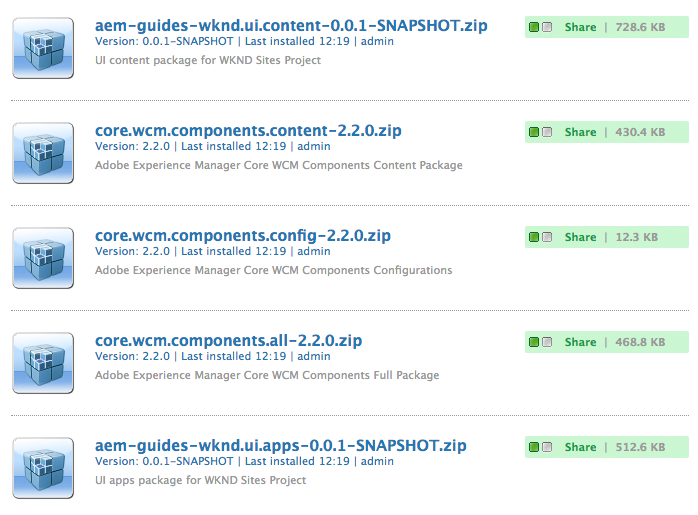
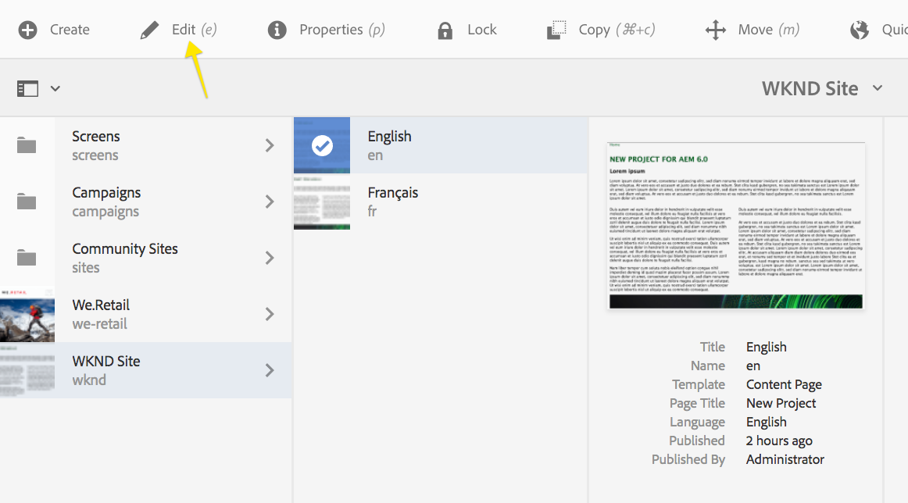
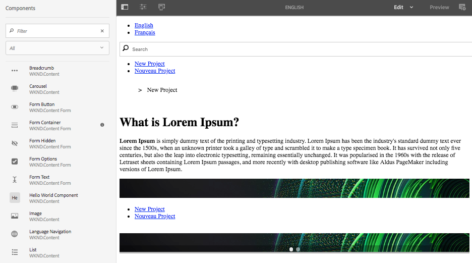
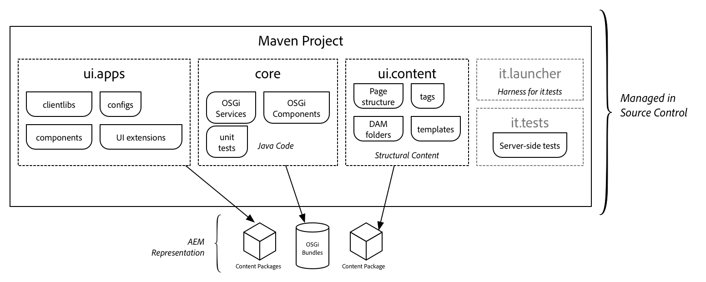
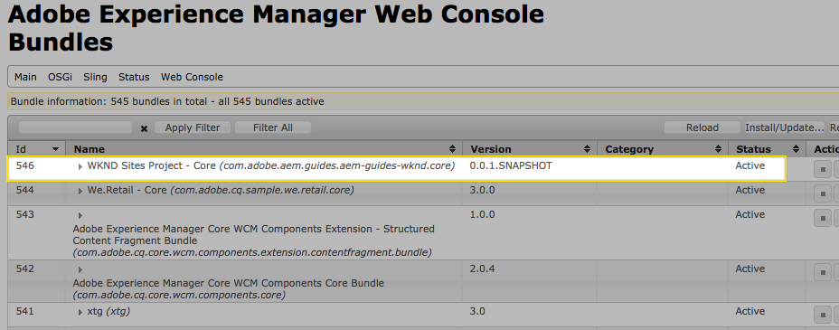
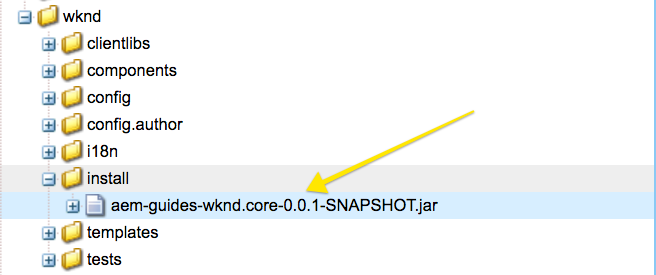
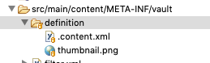
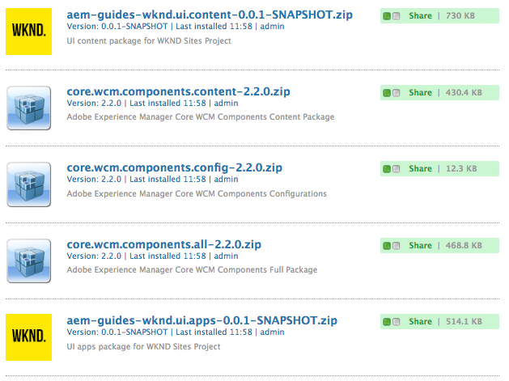
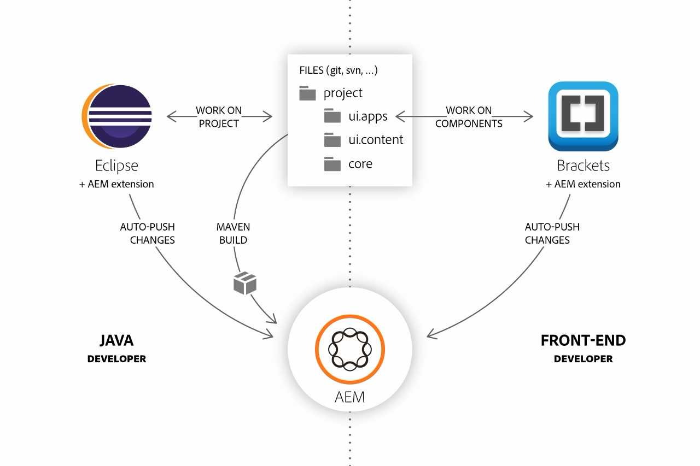
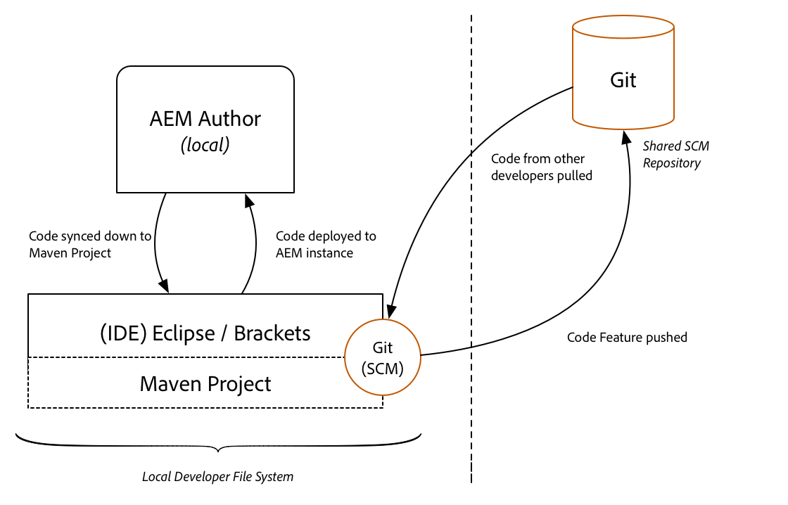

# Getting Started with AEM Sites Chapter 1 - Project Setup{#getting-started-with-aem-sites-chapter-project-setup}

Covers the creation of a Maven Multi Module Project to manage the code and configurations for an AEM Site.

## Prerequisites {#prerequisites}

This is Part 1 of the multi-part tutorial. An [overview can be found here](getting-started-wknd-tutorial-develop.md).

A local development environment is necessary to complete this tutorial. Screenshots and video are captured from a Mac OS environment but the commands and code used should be independent of the local operating system, unless otherwise noted.

The following is required:

1. [Java 1.8](https://www.oracle.com/technetwork/java/javase/downloads/index.html)
2. [Apache Maven](https://maven.apache.org/) (3.3.9 or newer)
3. [AEM 6.4](https://helpx.adobe.com/experience-manager/6-4/sites/deploying/using/technical-requirements.html) + [Service Pack 2](https://helpx.adobe.com/experience-manager/6-4/release-notes/sp-release-notes.html)**or** 
4. [AEM 6.3](https://helpx.adobe.com/experience-manager/6-3/sites/deploying/using/technical-requirements.html) + [Service Pack 3](https://helpx.adobe.com/experience-manager/6-3/release-notes/sp3-release-notes.html)
5. [Eclipse](https://helpx.adobe.com/experience-manager/6-4/sites/developing/using/aem-eclipse.html) or other IDE

For more information see: [Set up a Local AEM Development Environment](https://helpx.adobe.com/experience-manager/kt/platform-repository/using/local-aem-dev-environment-article-setup.html).

## Create Project with Maven AEM Project Archetype 15 {#maven-multimodule}

There are a  couple  options for creating a Maven Multimodule project for AEM. This tutorial will leverage the [Maven AEM Project Archetype 15](https://github.com/Adobe-Marketing-Cloud/aem-project-archetype). Another perfectly valid approach is to use [ACS AEM Lazybones template](https://github.com/Adobe-Consulting-Services/lazybones-aem-templates).

The next series of steps will take place using a UNIX based command line  terminal,  but should be similar if using a Windows terminal.

1. Open up a command line terminal and verify that Maven has been installed and added to the command line path:

   ```shell
   $ mvn -version
   ...
   Apache Maven 3.3.9
   Maven home: /Library/apache-maven-3.3.9
   Java version: 1.8.+, vendor: Oracle Corporation
   Java home: /Library/Java/JavaVirtualMachines/jdk1.8.+.jdk/Contents/Home/jre
   ```

2. Paste the following into the command line to initiate the creation of a new project:

   ```shell
   mvn org.apache.maven.plugins:maven-archetype-plugin:2.4:generate \
    -DarchetypeGroupId=com.adobe.granite.archetypes \
    -DarchetypeArtifactId=aem-project-archetype \
    -DarchetypeVersion=15 \
    -DarchetypeCatalog=https://repo.adobe.com/nexus/content/groups/public/
   ```

   >[!NOTE]
   >
   >It is also possible to create the Maven AEM project using the [AEM Developer Tools plugin for Eclipse](https://helpx.adobe.com/experience-manager/6-4/sites/developing/using/aem-eclipse.html).

3. The AEM project archetype will ask a series of questions to set up the project. The following table lists the values used for this tutorial:

   | **Description** |**Property** |**Value** |
   |---|---|---|
   | Maven group id |groupId |com.adobe.aem.guides |
   | Maven artifact id |artifactId |aem-guides-wknd |
   | Starting version of project |version |0.0.1-SNAPSHOT |
   | Java source package |package |com.adobe.aem.guides.wknd |
   | /apps folder name |appsFolderName |wknd |
   | Maven project name |artifactName |WKND Sites Project |
   | AEM component group name |componentGroupName |WKND.Content |
   | /conf folder name |confFolderName |wknd |
   | /content folder name |contentFolderName |wknd |
   | Prefix used in generated CSS |cssId |wknd |
   | Content Package group name |packageGroup |aem-guides/wknd |
   | AEM site name |siteName |WKND Site |

4. Navigate into the **aem-guides-wknd** directory and run the following maven command to build and deploy the project

   ```shell
   $ cd aem-guides-wknd
   $ mvn -PautoInstallPackage -Padobe-public clean install
   ...
   [INFO] ------------------------------------------------------------------------
   [INFO] Reactor Summary:
   [INFO]
   [INFO] aem-guides-wknd .................................... SUCCESS [  0.369 s]
   [INFO] WKND Sites Project - Core .......................... SUCCESS [  3.836 s]
   [INFO] WKND Sites Project - UI apps ....................... SUCCESS [  3.172 s]
   [INFO] WKND Sites Project - UI content .................... SUCCESS [  0.554 s]
   [INFO] WKND Sites Project - Integration Tests Bundles ..... SUCCESS [  0.896 s]
   [INFO] WKND Sites Project - Integration Tests Launcher .... SUCCESS [  2.574 s]
   [INFO] ------------------------------------------------------------------------
   [INFO] BUILD SUCCESS
   [INFO] ------------------------------------------------------------------------
   [INFO] Total time: 12.530 s
   [INFO] Finished at: 2018-04-04T18:17:45-04:00
   [INFO] Final Memory: 57M/600M
   [INFO] ------------------------------------------------------------------------
   ```

   the Maven profile ***autoInstallPackage*** is the most common profile used to deploy an AEM project. The archetype generates a **POM** file that will deploy to an AEM instance running locally on port **4502** and with the credentials of **admin:admin**.

   The ***adobe-public*** profile ensures that **repo.adobe.com** is referenced when building the project.

   ```shell
   mvn -PautoInstallPackage -Padobe-public clean install
   ```

5. A best practice is to add an **adobe-public** profile to your Maven [settings.xml](https://maven.apache.org/settings.html) file in order to automatically add **repo.adobe.com** to the maven build process.

6. Create a file named `settings.xml`at `${user.home}/.m2/settings.xml` if it doesn't exist already.

7. Add the adobe-public profile to the `settings.xml` file based on [the instructions here](https://helpx.adobe.com/experience-manager/kb/SetUpTheAdobeMavenRepository.html).

   A sample `settings.xml`can be found below:

   ```xml
   <settings xmlns="https://maven.apache.org/SETTINGS/1.0.0"
     xmlns:xsi="https://www.w3.org/2001/XMLSchema-instance"
     xsi:schemaLocation="https://maven.apache.org/SETTINGS/1.0.0
                         https://maven.apache.org/xsd/settings-1.0.0.xsd">
   <profiles>
   <!-- ====================================================== -->
   <!-- P U B L I C P R O F I L E -->
   <!-- ====================================================== -->
   <profile>
       <id>adobe-public</id>
       <activation>
           <activeByDefault>false</activeByDefault>
       </activation>
       <properties>
           <releaseRepository-Id>adobe-public-releases</releaseRepository-Id>
           <releaseRepository-Name>Adobe Public
               Releases</releaseRepository-Name>
           <releaseRepository-URL>https://repo.adobe.com/nexus/content/groups/public</releaseRepository-URL>
       </properties>
       <repositories>
           <repository>
               <id>adobe-public-releases</id>
               <name>Adobe Basel Public Repository</name>
               <url>https://repo.adobe.com/nexus/content/groups/public</url>
               <releases>
                   <enabled>true</enabled>
                   <updatePolicy>never</updatePolicy>
               </releases>
               <snapshots>
                   <enabled>false</enabled>
               </snapshots>
           </repository>
       </repositories>
       <pluginRepositories>
           <pluginRepository>
               <id>adobe-public-releases</id>
               <name>Adobe Basel Public Repository</name>
               <url>https://repo.adobe.com/nexus/content/groups/public</url>
               <releases>
                   <enabled>true</enabled>
                   <updatePolicy>never</updatePolicy>
               </releases>
               <snapshots>
                   <enabled>false</enabled>
               </snapshots>
           </pluginRepository>
       </pluginRepositories>
   </profile>
   </profiles>
   <activeProfiles>
   <activeProfile>adobe-public</activeProfile>
     </activeProfiles>
   </settings>
   ```

8. Navigate into the **aem-guides-wknd** directory and run the following maven command, without the **adobe-public** profile to build and deploy the project

   ```shell
   $ cd aem-guides-wknd
   $ mvn -PautoInstallPackage clean install
   ...
   [INFO] ------------------------------------------------------------------------
   [INFO] Reactor Summary:
   [INFO]
   [INFO] aem-guides-wknd .................................... SUCCESS [  0.369 s]
   [INFO] WKND Sites Project - Core .......................... SUCCESS [  3.836 s]
   [INFO] WKND Sites Project - UI apps ....................... SUCCESS [  3.172 s]
   [INFO] WKND Sites Project - UI content .................... SUCCESS [  0.554 s]
   [INFO] WKND Sites Project - Integration Tests Bundles ..... SUCCESS [  0.896 s]
   [INFO] WKND Sites Project - Integration Tests Launcher .... SUCCESS [  2.574 s]
   [INFO] ------------------------------------------------------------------------
   [INFO] BUILD SUCCESS
   [INFO] ------------------------------------------------------------------------
   [INFO] Total time: 12.530 s
   [INFO] Finished at: 2018-04-04T18:17:45-04:00
   [INFO] Final Memory: 57M/600M
   [INFO] ------------------------------------------------------------------------
   ```

9. View Packages on AEM

   Navigate to Package Manager on your local AEM instance: [http://localhost:4502/crx/packmgr/index.jsp](http://localhost:4502/crx/packmgr/index.jsp). You should see the following 5 packages installed:

   

   >[!NOTE]
   >
   >Notice that 3 packages related to core components were also installed. We will inspect this further below.

10. The WKND Site will be one of the sites. It will include two content pages, one for English and one for French.
   

11. Some content is already created and several components are available to be added to a page. Experiment with these components to get an idea of the functionality. How this page and components are configured will be explored in detail later in the tutorial.

   

## Inspecting the Project Structure {#project-structure}

There are six areas to the project:

1. **Parent POM** - deploys maven modules and manages dependency versions
2. **core** - Java bundle containing all core functionality like OSGi services, listeners or schedulers, as well as component-related Java code such as servlets or request filters.
3. **ui.apps** - contains the /apps parts of the project, ie JS&CSS clientlibs, components, runmode specific configs as well as Hobbes-tests
4. **ui.content** - contains structural content and configurations (/content, /conf)
5. **ui.tests** - Java bundle containing JUnit tests that are executed server-side. This bundle is not to be deployed onto production.
6. **ui.launcher** - contains glue code that deploys the ui.tests bundle (and dependent bundles) to the server and triggers the remote JUnit execution

 

### Parent POM {#parent-pom}

In the pom.xml at the root of the project (`<src-directory>/aem-guides-wknd/pom.xml`), several global properties are defined:

```xml
<properties>
        <aem.host>localhost</aem.host>
        <aem.port>4502</aem.port>
        <aem.publish.host>localhost</aem.publish.host>
        <aem.publish.port>4503</aem.publish.port>
        <sling.user>admin</sling.user>
        <sling.password>admin</sling.password>
        <vault.user>admin</vault.user>
        <vault.password>admin</vault.password>

        <project.build.sourceEncoding>UTF-8</project.build.sourceEncoding>
        <project.reporting.outputEncoding>UTF-8</project.reporting.outputEncoding>
</properties>
```

These properties are set up to deploy to a local AEM instance, as this is the most common build that developers will do. Notice there are properties to deploy to an Author Instance as well as a Publish instance. This is also where the basic-auth credentials are set to authenticate with the AEM instance. The default **admin:admin** credentials are used.

These properties are setup so that they can be overridden when deploying to higher level environments. In this way the POM files do not have to change, but variables like aem.host and aem.password can be overridden via command line arguments:

```shell
mvn -PautoInstallPackage clean install -Daem.host=production.hostname -Dsling.password=productionpasswd
```

The Parent POM will build five sub-modules: **core**, **ui.apps**, **ui.content**, **ui.tests**, **it.launcher**. These modules are defined at the bottom of the file. More modules can always be added as a project evolves.

```xml
<modules>
        <module>core</module>
        <module>ui.apps</module>
        <module>ui.content</module>
        <module>it.tests</module>
        <module>it.launcher</module>
</modules>
```

The Parent POM includes a DependencyManagement section that lists all of the dependencies and versions of APIs that are going to be used in the project. Versions should be managed in the Parent POM and sub-modules like Core and UI.apps should not include any version information.

One of the key dependencies to inspect is the [AEM uber-jar.](https://helpx.adobe.com/experience-manager/6-4/sites/developing/using/ht-projects-maven.html#ExperienceManagerAPIDependencies) This will include all of the AEM APIs with just a single dependency entry for the version of AEM. More information about the uber-jar can be found [here.](https://helpx.adobe.com/experience-manager/6-4/sites/developing/using/ht-projects-maven.html#ExperienceManagerAPIDependencies)

```xml
 <dependencyManagement>
        ...
         <dependency>
                <groupId>com.adobe.aem</groupId>
                <artifactId>uber-jar</artifactId>
                <version>6.3.0</version>
                <scope>provided</scope>
                <classifier>apis</classifier>
            </dependency>
            ...
</dependencyManagement>
```

>[!NOTE]
>
>As a best practice you should update the uber-jar version to match the target version of AEM. i.e, if you plan to deploy to AEM 6.4 you should update the version of the uber-jar to 6.4.0.

### Core Module {#core-pom}

The Core maven module (`<src-directory>/aem-guides-wknd/core`) will include all the Java code needed for the implementation. The module will package all of the Java code and deploy to the AEM instance as an OSGi Bundle.

The Maven Bundle Plugin defined in the **aem-guides-wknd/core/pom.xml** is responsible for compiling the Java code into an OSGi bundle that can be recognized by AEM's OSGi container. Notice that this is where the location of Sling Models are defined. This will be leveraged in later parts of the tutorial.

```xml
//core/pom.xml

<plugin>
    <groupId>org.apache.felix</groupId>
        <artifactId>maven-bundle-plugin</artifactId>
        <extensions>true</extensions>
        <configuration>
            <instructions>
            <!-- Import any version of javax.inject, to allow running on multiple versions of AEM -->
            <Import-Package>javax.inject;version=0.0.0,*</Import-Package>
                    <Sling-Model-Packages>
                        com.adobe.aem.guides.wknd.core
                    </Sling-Model-Packages>
            </instructions>
    </configuration>
</plugin>

```

The Maven Sling Plugin allows the Core Bundle to be deployed to AEM directly leveraging the autoInstallBundle profile (defined in the Parent Pom.xml).

>[!NOTE]
>
>It is rare that the Core Bundle is deployed independently of the ui.apps module in upper level environments. Deploying the Core Bundle directly is useful during local development/testing.

```xml
//core/pom.xml

<plugin>
    <groupId>org.apache.sling</groupId>
    <artifactId>maven-sling-plugin</artifactId>
</plugin>
```

Try building the Core module independently from the rest of the project with the following commands from the terminal:

```shell
$ cd aem-guides-wknd/core/
$ mvn -PautoInstallBundle clean install
...
[INFO] Installing Bundle com.adobe.aem.guides.aem-guides-wknd.core(/src/aem-guides-wknd/core/target/aem-guides-wknd.core-0.0.1-SNAPSHOT.jar) to http://localhost:4502/system/console via WebConsole
[INFO] Bundle installed
[INFO] ------------------------------------------------------------------------
[INFO] BUILD SUCCESS
[INFO] ------------------------------------------------------------------------
[INFO] Total time: 4.304 s
[INFO] Finished at: 2018-04-05T12:10:59-04:00
[INFO] Final Memory: 29M/469M
[INFO] ------------------------------------------------------------------------
```

Navigating to [http://localhost:4502/system/console/bundles](http://localhost:4502/system/console/bundles) you should be able to see the bundle installed and active.



The OSGi bundle is a jar that gets deployed to the AEM repository as an embedded part of the ui.apps module. You can see the 'physical' location of the jar in [CRXDE-Lite](http://localhost:4502/crx/de/index.jsp#/apps/wknd/install/wknd-sites-guide.core-0.0.1-SNAPSHOT.jar):



### UI.apps Module {#uiapps-pom}

**UI.apps** maven module will include all of the rendering code needed for the site beneath /apps. This includes CSS/JS that will be stored in an AEM format called [clientlibs](https://helpx.adobe.com/experience-manager/6-4/sites/developing/using/clientlibs.html). This also includes [HTL](https://docs.adobe.com/docs/en/htl/overview.html) scripts for rendering dynamic HTML. You can think of the ui.apps module as a map to the structure in the JCR but in a format that can be stored on a file system and committed to source control.

The [Apache Jackrabbit FileVault Package plugin](https://jackrabbit.apache.org/filevault-package-maven-plugin/index.html) is used to compile the contents of the ui.apps module into an AEM package that can be deployed to AEM. The global configurations for the plugin are defined at the Parent pom.xml. Inspecting the plugin definition you can see a configuration for `filterSource`. The `filterSource` points to the location of the filter.xml file that is used to define the jcr paths that are included in the package. The `filterSource` points to the location of the `filter.xml` file that is used to define the jcr paths that are included in the package. Beneath the FileVault Package plugin is the definition of the **Content Package Plugin** which is used to then push the package into AEM. Note that variables for aem.host, aem.port, vault.user, and vault.password are used that correspond to the global properties.

```xml
// pom.xml

<!-- Jackrabbit FileVault Package Plugin -->
<plugin>
    <groupId>org.apache.jackrabbit</groupId>
    <artifactId>filevault-package-maven-plugin</artifactId>
    <version>1.0.1</version>
    <configuration>
        <filterSource>src/main/content/META-INF/vault/filter.xml</filterSource>
    </configuration>
</plugin>
<!-- Content Package Plugin -->
<plugin>
    <groupId>com.day.jcr.vault</groupId>
    <artifactId>content-package-maven-plugin</artifactId>
    <version>1.0.2</version>
    <configuration>
        <targetURL>https://${aem.host}:${aem.port}/crx/packmgr/service.jsp</targetURL>
        <failOnError>true</failOnError>
        <userId>${vault.user}</userId>
        <password>${vault.password}</password>
    </configuration>
</plugin>
```

Looking at the pom.xml beneath the ui.apps folder you can see the **filevault-package-maven-plugin**. The **embedded** tags includes the compiled **core** bundle as part of the ui.apps package and where it will be installed.

```xml
//ui.apps/pom.xml

<!-- ====================================================================== -->
<!-- V A U L T   P A C K A G E   P L U G I N                                -->
<!-- ====================================================================== -->
<plugin>
    <groupId>org.apache.jackrabbit</groupId>
    <artifactId>filevault-package-maven-plugin</artifactId>
    <extensions>true</extensions>
    <configuration>
    <embeddeds>
        <embedded>
            <groupId>com.adobe.aem.guides</groupId>
            <artifactId>aem-guides-wknd.core</artifactId>
            <target>/apps/wknd/install</target>
        </embedded>
    </embeddeds>
    <subPackages>
        <subPackage>
            <groupId>com.adobe.cq</groupId>
            <artifactId>core.wcm.components.all</artifactId>
            <filter>true</filter>
        </subPackage>
    </subPackages>
    </configuration>
</plugin>
```

Notice that **core.wcm.components.all** is included as a **subPackage**. Inclusion of Core Components explained below:

Open the file `ui.apps/src/main/content/META-INF/vault/filter.xml`. This file contains the defines the paths that will be included and installed with the ui.apps package:

```xml
<!-- ui.apps/src/main/content/META-INF/vault/filter.xml -->
<?xml version="1.0" encoding="UTF-8"?>
<workspaceFilter version="1.0">
    <filter root="/apps/wknd"/>
    <filter root="/apps/sling" />
</workspaceFilter>

```

### UI.content Module {#uicontent-pom}

**ui.content** maven module includes baseline content and configurations beneath /content and /conf. ui.content gets compiled into an AEM package much like ui.apps. The major difference is that the nodes stored in **ui.content** can be modified on the AEM instance directly. This includes pages, DAM assets, and editable templates. the **ui.content** module can be used to store sample content for a clean instance and/or to create some baseline configurations that are to be managed in source control.

Open the file `ui.content/src/main/content/META-INF/vault/filter.xml`. This file contains the defines the paths that will be included and installed with the ui.content package. Notice that a `mode="merge"` attribute is added to the path. This ensures that the configurations deployed with a code deployment do not automatically override content or configurations that have been authored on the AEM instance directly.

```xml
<!-- ui.content/src/main/content/META-INF/vault/filter.xml -->

<?xml version="1.0" encoding="UTF-8"?>
<workspaceFilter version="1.0">
    <filter root="/conf/wknd" mode="merge"/>
    <filter root="/content/wknd" mode="merge"/>
    <filter root="/content/dam/wknd" mode="merge"/>
</workspaceFilter>

```

The `ui.content/pom.xml`, like the **ui.apps** module, uses the **FileVault Package plugin**. Notice that an extra configuration is added here for `acHandling`, set to `merge_preserve`. This is included because the **ui.content** module includes Access Control Lists (ACLs) which are permissions on who can edit the templates. In order for these ACLs to be imported into AEM the `acHandling` property is needed.

```xml
<!-- ui.content/pom.xml -->
 <!-- ====================================================================== -->
            <!-- V A U L T   P A C K A G E   P L U G I N S                              -->
            <!-- ====================================================================== -->
            <plugin>
                <groupId>org.apache.jackrabbit</groupId>
                <artifactId>filevault-package-maven-plugin</artifactId>
                <extensions>true</extensions>
                <configuration>
                    <acHandling>merge_preserve</acHandling>
                </configuration>
            </plugin>
```

## Inclusion of Core Components {#core-components}

The project will leverage AEM Core Components. Earlier, when inspecting the deployed packages to AEM, 3 packages related to Core Components were included. Core Components are a set of base components designed to accelerate the development of an AEM Sites project. Core Components are open source and available on [GitHub](https://github.com/Adobe-Marketing-Cloud/aem-core-wcm-components). More information about Core Components can be found [here](https://docs.adobe.com/content/help/en/experience-manager-core-components/using/introduction.html).

Core Components are installed in AEM automatically in the default runmode and used by the sample We.Retail site. In a [production runmode](https://helpx.adobe.com/experience-manager/6-4/sites/administering/using/production-ready.html) (`nosamplecontent`) Core Components will not be available. In order to leverage them in all deployments it is a best practice to include them as part of the Maven project.

The AEM project archetype includes Core Components by default. It is a good idea to understand how this is included.

1. View the dependencies section of `aem-guides-wknd/pom.xml`:

   A dependency for Core Components version 2.2.0 is added.

   ```xml
   <dependencies>
   ...
    <dependency>
       <groupId>com.adobe.cq</groupId>
       <artifactId>core.wcm.components.all</artifactId>
       <type>zip</type>
      <version>2.2.0</version>
   </dependency>
   ...
   </dependencies>
   ```

2. View `aem-guides-wknd/ui.apps/pom.xml`:

   Notice the **core.wcm.components.all** is included as a dependency in the dependency list. Notice also that a version is not included here. As a best practice, versions for dependencies are managed in the Parent Pom file.

   ```xml
   //ui.apps/pom.xml
   <dependencies>
   ...
   <dependency>
      <groupId>com.adobe.cq</groupId>
       <artifactId>core.wcm.components.all</artifactId>
       <type>zip</type>
   </dependency>
   ...
   </dependencies>
   ```

3. View the Vault Package Plugin within `aem-guides-wknd/ui.apps/pom.xml`:

   Notice that `core.wcm.components.all` zip is included as a sub-package. This will deploy the Core Components package along with the WKND code each time.

   ```xml
   //ui.apps/pom.xml
   <!-- ====================================================================== -->
   <!-- V A U L T   P A C K A G E   P L U G I N                                -->
   <!-- ====================================================================== -->
   <plugin>
        <groupId>org.apache.jackrabbit</groupId>
        <artifactId>filevault-package-maven-plugin</artifactId>
        <extensions>true</extensions>
        <configuration>
            <embeddeds>
                <embedded>
                    <groupId>com.adobe.aem.guides</groupId>
                    <artifactId>aem-guides-wknd.core</artifactId>
                    <target>/apps/wknd/install</target>
                </embedded>
            </embeddeds>
            <subPackages>
                <subPackage>
                    <groupId>com.adobe.cq</groupId>
                    <artifactId>core.wcm.components.all</artifactId>
                    <filter>true</filter>
                </subPackage>
            </subPackages>
        </configuration>
    </plugin>
   ```

## (Optional) Add a Custom Thumbnail for the Package {#custom-thumbnail}

This is an optional task but its nice to easily identify your custom code packages. You can do this by adding a custom thumbnail to the ui.apps module and when it is deployed to AEM it will show up in Package Manager.

1. Create an image named **thumbnail.png**.

   The recommended dimensions are 64 x 64 pixels.

   

2. Create a new folder named definition beneath: `aem-guides-wknd/ui.apps/src/main/content/META-INF/vault/definition`

   Add the thumbnail to the `definition` folder.

   As a sibling of thumbnail.png, inside the definition folder, add a file named `.content.xml`. Populate it with the following:

   ```xml
   <?xml version="1.0" encoding="UTF-8"?>
   <jcr:root xmlns:vlt="https://www.day.com/jcr/vault/1.0" xmlns:jcr="https://www.jcp.org/jcr/1.0" xmlns:nt="https://www.jcp.org/jcr/nt/1.0">
       <thumbnail.png/>
   </jcr:root>
   ```

   

3. When building the package the maven content-package plugin will compile the files and folders inside the ui.apps project into an AEM package. You can direct it to use the custom thumbnail by updating the `<build>` tag in the `ui.apps/pom.xml`.

   ```xml
   <!-- ui.apps/pom.xml -->
   <!-- ====================================================================== -->
   <!-- B U I L D   D E F I N I T I O N                                        -->
   <!-- ====================================================================== -->
   <build>
       <sourceDirectory>src/main/content/jcr_root</sourceDirectory>
       <resources>
           <!-- define the resources that will go into the package -->
           <resource>
               <directory>${basedir}/src/main/content/jcr_root</directory>
               <excludes>
                   <!-- exclude .vlt control files in the package -->
                   <exclude>**/.vlt</exclude>
                   <exclude>**/.vltignore</exclude>
                   <exclude>**/.gitignore</exclude>
                   <exclude>**/*.iml</exclude>
                   <exclude>**/.classpath</exclude>
                   <exclude>**/.project</exclude>
                   <exclude>**/.settings</exclude>
                   <exclude>**/.DS_Store</exclude>
                   <exclude>**/target/**</exclude>
                   <exclude>**/pom.xml</exclude>
               </excludes>
           </resource>
           <!-- added thumbnail -->
           <resource>
               <directory>${basedir}/src/main/content/META-INF/vault/definition</directory>
               <targetPath>../vault-work/META-INF/vault/definition</targetPath>
           </resource>
       </resources>
       ...
   ```

## Deploy the Project to AEM {#deploy-project}

1. To test and verify our changes, once again run the following maven command from the project root:

   ```shell
   $ cd <src>/aem-guides-wknd
   $ mvn -PautoInstallPackage -Padobe-public clean install
   ...
   [INFO] aem-guides-wknd .................................... SUCCESS [  0.369 s]
   [INFO] WKND Sites Project - Core .......................... SUCCESS [  3.836 s]
   [INFO] WKND Sites Project - UI apps ....................... SUCCESS [  3.172 s]
   [INFO] WKND Sites Project - UI content .................... SUCCESS [  0.554 s]
   [INFO] WKND Sites Project - Integration Tests Bundles ..... SUCCESS [  0.896 s]
   [INFO] WKND Sites Project - Integration Tests Launcher .... SUCCESS [  2.574 s]
   [INFO] ------------------------------------------------------------------------
   [INFO] BUILD SUCCESS
   ```

2. Navigate to [Package Manager](http://localhost:4502/crx/packmgr/index.jsp) in AEM.

   5 packages get installed. **core.wcm.components.all** includes 2 sub packages: **core.wcm.components.config **and** core.wcm.components.content**. You should also see the custom thumbnail for the WKND **ui.apps** and **ui.content** packages.

   

## Source Control Management {#source-control}

It is always a good idea to use some form of source control to manage the code in your application. This tutorial uses git and GitHub. There are several files that get generated by Maven and/or the IDE of choice that should be ignored by the SCM.

Maven will create a target folder whenever you build and install the code package. The target folder and contents should be excluded from SCM.

Beneath ui.apps you will also notice many .content.xml files that are created. These XML files map the node types and properties of content installed in the JCR. These files are critical and should **not** be ignored except at the very root level.

The AEM project archetype will generates a sample .gitignore file that can be used as a starting point for which files can be safely ignored:

```plain
# Created by https://www.gitignore.io/api/eclipse,java,maven

### Eclipse ###
*.pydevproject
.metadata
.gradle
bin/
tmp/
*.tmp
*.bak
*.swp
*~.nib
local.properties
.settings/
.loadpath

# Eclipse Core
.project
MANIFEST.MF

# External tool builders
.externalToolBuilders/

# Locally stored "Eclipse launch configurations"
*.launch

# CDT-specific
.cproject

# JDT-specific (Eclipse Java Development Tools)
.classpath

# Java annotation processor (APT)
.factorypath

# PDT-specific
.buildpath

# sbteclipse plugin
.target

# TeXlipse plugin
.texlipse

### Java ###
*.class

# Mobile Tools for Java (J2ME)
.mtj.tmp/

# Package Files #
*.jar
*.war
*.ear

# virtual machine crash logs, see https://www.java.com/en/download/help/error_hotspot.xml
hs_err_pid*

# Mac OS #
.DS_Store

### Maven ###
target/
pom.xml.tag
pom.xml.releaseBackup
pom.xml.versionsBackup
pom.xml.next
release.properties
dependency-reduced-pom.xml
buildNumber.properties
.mvn/timing.properties

### Vault ###
.vlt

### IntelliJ ###
.idea/
*.iml

```

## Using an Integrated Development Environment {#eclipse-ide}

There are multiple tools that can be used when developing with AEM:

* [**Eclipse IDE**](https://eclipse.adobe.com/aem/dev-tools/)
* [**Brackets**](https://docs.adobe.com/docs/en/dev-tools/aem-brackets.html)
* [**IntelliJ**](https://helpx.adobe.com/experience-manager/using/creating-aem-project-using-intellij.html)

In general Eclipse and IntelliJ tend to be preferred environments for Java development and Brackets is preferred by Front-end developers.



Popular developer workflow

This tutorial will use the Eclipse IDE and the AEM Developer tools plugin. 

> **Follow the instructions here [to set up an integrated development environment](https://helpx.adobe.com/experience-manager/kt/platform-repository/using/local-aem-dev-environment-article-setup.html#setup-integrated-env)**

## Developer Workflow {#developer-workflow}



High level developer workflow when working with AEM in a local environment

Developers will push and pull code and configurations between their local file system and an AEM instance running locally. Once code is tested thoroughly on the local AEM instance and all necessary code and configurations have been synced to file system the developer can then commit the code and push it to a shared SCM repository. From there the code can be integrated into the master code base and pushed to shared environments like Dev, QA...

## Next Steps {#next-steps}

Next part in the tutorial:

* **[Getting Started with AEM Sites Chapter 2 - Creating a Base Page and Template](part2.md)**

View the finished code on [GitHub](https://github.com/Adobe-Marketing-Cloud/aem-guides-wknd) or download the finished package for this part of the tutorial:

## Help! {#help}

If you get stuck or have additional questions make sure to check out the [Experience League forums for AEM](https://forums.adobe.com/community/experience-cloud/marketing-cloud/experience-manager) or view existing [GitHub issues](https://github.com/Adobe-Marketing-Cloud/aem-guides-wknd/issues).

Didn't find what you were looking for? Think you found an error? Please file a [GitHub issue for the WKND project](https://github.com/Adobe-Marketing-Cloud/aem-guides-wknd/issues).