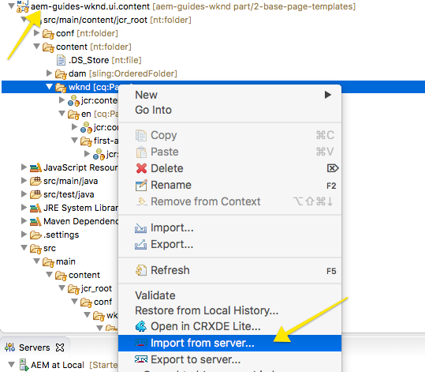

# Getting Started with AEM Sites Chapter 2 - Creating a Base Page and Template{#getting-started-with-aem-sites-chapter-creating-a-base-page-and-template}

Covers the creation of a base page and an editable template. Core Components are proxied into the project. Core Components of Text, Image, and Title are used to author an initial page.

## Prerequisites {#prerequisites}

This is Chapter 2 of the multi-part tutorial. **[Chapter 1 can be found here](part1.md)** and an [overview can be found here](getting-started-wknd-tutorial-develop.md).

Note you will need Eclipse or an IDE setup. Instructions for setting up a development environment can be found in [Chapter 1](part1.md).

You can view Chapter 1 on [GitHub](https://github.com/Adobe-Marketing-Cloud/aem-guides-wknd/tree/chapter-1/project-setup) or you can download the solution package:

## Inspect Base Page Component {#base-page}

The archetype has created a component to be used as a base for all Pages created. The base page is responsible for ensuring that global areas of the site are consistent. This includes loading of global CSS and Javascript, as well as the inclusion of code that will ensure the page can be edited using AEM authoring tools.

In Eclipse (or in the IDE of your choice) you will be viewing nodes beneath `/apps/wknd` in the **ui.apps** project.

1. View the folder beneath **`/apps/wknd/components/structure`** named **page**.

   The AEM project archetype creates a component named **page**. [Editable templates](https://helpx.adobe.com/experience-manager/6-4/sites/developing/using/page-templates-editable.html) will be used for the WKND site. The name **structure** matches a specific mode of Editable template and is the common convention when using Editable templates. Any component added into the structure folder indicates that the component is meant to be used when constructing a template, and not to be used when authoring a page. 

   

2. View the properties of the **page** component:

    

   |Name|Value|Description|
   |--- |--- |--- |
   |componentGroup|.hidden|indicates that this is not an author-able component|
   |jcr:title|WKND Site Page|title|
   |sling:resourceSuperType|core/wcm/components/page/v2/page|will inherit functionality from the Core Page component|
   |jcr:primaryType|cq:Component|primary node type (read-only)|

   The **sling:resourceSuperType** property is critical in that it allows the WKND's page component to inherit all of the functionality of the Core Component page component. This is the first example of something called the [Proxy Component Pattern](https://helpx.adobe.com/experience-manager/core-components/using/guidelines.html#ProxyComponentPattern). More information can be found [here.](https://helpx.adobe.com/experience-manager/core-components/using/guidelines.html)

## Create Header Component {#header-nav}

Next a Header component will be created to be integrated into the Base page. The goal is just to establish a basic structure, so the code will be minimal. In later tutorials this component will be built in full.

1. Create a node named **header** with node type of **cq:Component** beneath **/apps/wknd/components/structure**

   

2. You may see an error like the following: ***Unable to validate node types since project aem-guides-wknd.ui.apps is not associated with a server or the server is not started***.

   

   Double check and ensure that the aem-guides-wknd.ui.apps project is associated with an AEM eclipse server and that the server is started.

   If you continue to encounter the error:

    1. Right+Click the aem-guides-wknd.ui.apps project in the Project explorer
    2. Open **Properties** &gt;** Project Facets**
    
    3. Uncheck **Dynamic Web Module **

   This should resolve the error and you should then get a drop down of node types when creating new nodes.

   

   uncheck Dynamic Web Module under Properties > Project Facets

   Also ensure that the content sync root directory beneath the AEM tab is pointed to the jcr_root folder:

   

3. Update the header component with additional JCR properties. Select the header component and then Right+Click in the JCR Propertied panel to add new properties.

   Add the following properties to the header component.

    

|Name|Type|Value|Tutorial Description (don't copy, info only)|
|--- |--- |--- |--- |
|componentGroup|String|WKND.Structure|All components meant for the structure of Templates will use this group.|
|jcr:description|String|Page Header with navigation|description of component|
|jcr:title|String|WKND Page Header|title|
|jcr:primaryType|Name|cq:Component|primary node type|

   >[!NOTE]
   >
   >**Pro Tip!**
   >
   >
   >You can Double+Click the component in the Project Explorer and edit the XML configuration directly. This is preferrable when many edits must be made, but it can be error prone.

   ```xml
   <?xml version="1.0" encoding="UTF-8"?>
   <jcr:root 
       xmlns:sling="https://sling.apache.org/jcr/sling/1.0"
       xmlns:jcr="https://www.jcp.org/jcr/1.0"
       jcr:primaryType="cq:Component"
       componentGroup="WKND.Structure"
       jcr:description="Page Header with navigation"
       jcr:title="WKND Page Header"/>
   ```

1. Add a node named **cq:dialog** of type **nt:unstructured** beneath the **header** component

    

   Dialogs are the mechanism that allows content authors to update properties/logic of a component through a UI dialog. The full dialog and fields will be defined in later parts of the tutorial. In order to support baseline author functionality at least a dialog placeholder is needed.

1. Add a **file** named **header.html** beneath the **header** component

   

   This file is is actually an [HTL](https://docs.adobe.com/docs/en/htl/docs/getting-started.html) script. There are a set of [global objects](https://docs.adobe.com/docs/en/htl/docs/global-objects.html) that are always available to HTL scripts within a component. **currentPage** represents the current content page. Using the dot notation .title a method named .getTitle() is called. This will print the current page's title. Conditional logic can be used to print out 'header' if the page title can't be found. The name of the file **header**.html is important for Sling resource resolution, as it matches the name of the component. More information about Sling resource resolution can be found [here](https://sling.apache.org/documentation/the-sling-engine/url-to-script-resolution.html).

   Add the following contents to the header.html file:

   ```xml
   <!--/* Header Component for WKND Site 
    
   */-->
    
   <header class="wknd-header">
    <div class="container">
     <a class="wknd-header-logo" href="#">WKND</a>
     <h1>${currentPage.title ? currentPage.title : 'header'}</h1>
    </div>
   </header>
   ```

1. Its a good idea to periodically publish to AEM to verify/test your code changes. With Eclipse AEM dev tools you can publish the ui.apps project from within Eclipse.

   You can also always publish using Maven. It is a good idea deploy using Maven as well since this will ultimately be how you deploy to a Dev/Production environment and Maven will also run through unit tests and other code style checks prior to installing.

   ```shell
   $ mvn -PautoInstallPackage -Padobe-public clean install
   ```

   

   See the Page node in CRXDE Lite after deploying code changes

   In [CRXDE-Lite](https://localhost:4502/crx/de/index.jsp) verify that the header component has been pushed to your local AEM instance.

## Inspect Proxy Components {#proxy-components}

[AEM Core Components](https://github.com/Adobe-Marketing-Cloud/aem-core-wcm-components) provide several basic building blocks for creating content. This includes Text, Image and Title and several other components. The AEM project archetype includes these in the WKND project automatically. Each component added has a **sling:resourceSuperType** property to point to the Core Component. This is known as [creating proxy components](https://docs.adobe.com/docs/en/aem/6-3/develop/components/core-components/using.html#Create Proxy Components) and is the recommended way of using Core Components in your project.

In the first few parts of the tutorial the following Core Components will be used:

* [Breadcrumb](https://github.com/adobe/aem-core-wcm-components/blob/master/content/src/content/jcr_root/apps/core/wcm/components/breadcrumb/v2/breadcrumb)
* [Carousel](https://github.com/adobe/aem-core-wcm-components/blob/master/content/src/content/jcr_root/apps/core/wcm/components/carousel/v1/carousel)
* [Content Fragment](https://github.com/adobe/aem-core-wcm-components/blob/master/extension/contentfragment/content/src/content/jcr_root/apps/core/wcm/extension/components/contentfragment/v1/contentfragment)&#42;
* [Image](https://github.com/adobe/aem-core-wcm-components/blob/master/content/src/content/jcr_root/apps/core/wcm/components/image/v2/image)
* [List](https://github.com/adobe/aem-core-wcm-components/blob/master/content/src/content/jcr_root/apps/core/wcm/components/list/v2/list)
* [Navigation](https://github.com/adobe/aem-core-wcm-components/blob/master/content/src/content/jcr_root/apps/core/wcm/components/navigation/v1/navigation)
* [Page](https://github.com/adobe/aem-core-wcm-components/blob/master/content/src/content/jcr_root/apps/core/wcm/components/page/v2/page)
* [Quick Search](https://github.com/adobe/aem-core-wcm-components/blob/master/content/src/content/jcr_root/apps/core/wcm/components/search/v1/search)
* [Teaser](https://github.com/adobe/aem-core-wcm-components/blob/master/content/src/content/jcr_root/apps/core/wcm/components/teaser/v1/teaser)
* [Text](https://github.com/adobe/aem-core-wcm-components/blob/master/content/src/content/jcr_root/apps/core/wcm/components/text/v2/text)
* [Title](https://github.com/adobe/aem-core-wcm-components/blob/master/content/src/content/jcr_root/apps/core/wcm/components/title/v2/title)

The Core Components themselves can be viewed in CRXDE Lite under** /apps/core/  wcm /components**.

1. Notice that several Core Components have already been included in the project. Each component included will have a sling:resourceSuperType property that points to the equivalent Core Component. The exception is the **helloworld** component which is a sample component.

   

   Breadcrumb Component for creating navigation breadcrumbs.

1. Core Components also include a set of components for building HTML forms. These components are also proxied into the project, like the components under /content. Notice also that these components have a unique componentGroup.

   

   Text Component for creating RTE content

1. The cq:editConfig defines various behavior including Drag+Drop functionality from the Asset Finder in the Sites Editor. It is a required configuration for the Image component.

1. View the node beneath the image component named **cq:editConfig** with a type of **cq:EditConfig**

   1. Notice the **cq:dropTargets/image/parameters** node. This tells AEM what component resource type to use when dragging an Image on to the page. If you are extending the Image component for custom component it will be important to update the** cq:editConfg**. 

   

## Inspect Empty Page Template Type {#template-type}

[Template Types](https://docs.adobe.com/docs/en/aem/6-3/develop/templates/page-templates-editable.html#Template Type) are effectively a template for a template. They are necessary in order to take advantage of AEM's Editable Template feature. Templates and Template Types are stored beneath /conf. The AEM project archetype creates a template type to get started with. Nodes in /conf can be updated in AEM directly via the UI. Thus any template related nodes are stored in the **ui.content** project.

There are 3 main areas of Editable Templates:

1. **Structure** - defines components that are a part of the template. These will not be editable by content authors.
1. **Initial Content** - defines components that the template will start with, these can be edited and/or deleted by content authors
1. **Policies** - defines configurations on how components will behave and what options authors will have available.

Since Template Types can be thought of as a template of a template you will find the same structure for the template type. There are examples of template type structures that can be found beneath: **/libs/settings/wcm/template-types/**

The AEM Project archetype creates an Empty Page Template Type to start with. Inspect a few areas of the Empty Page Template Type in the **ui.content **module.

1. Note on the jcr:content node that the sling:resourceType points to the base page component (created earlier in this part). Also notice that the breakpoints for Phone and Tablet are defined here. Desktop will be considered larger than 1200. 

   

1. Beneath **/conf/wknd/settings/wcm/template-types/empty-page/structure/jcr:content/cq:responsive **are nodes for Tablet and Phone breakpoints. The default Tablet breakpoint is 1200.

   Set the Phone breakpoint to **768** 

   

1. The **jcr:content** node beneath the **initial** page also points back to the base page component created earlier.

   

1. The policies page defines how policies will be mapped to various components. This structure is standard across template types and not unique to the wknd's empty page template type.
1. **(Optional) Add a thumbnail **beneath** /conf/wknd/settings/wcm/template-types/empty-page**

   Thumbnails are great! This thumbnail will show up for users in the AEM author environment in order to easily identify the Template Type. Recommended dimensions are 460 x 460.


2. The next part of the tutorial will take place within AEM.

## Create Article and Landing Page Templates {#article-template}

The AEM project archetype pre-created a sample Content Template. The next few steps will detail creating 2 new templates:

1. **Article Page Template**
1. **Landing Page Template**

This will take place in AEM. The short video below details the steps.

> Note the role of creating a template being done as a development task. However once the implementation reaches a level of maturity, additional templates may be created by a select group of "power-users".

>[!VIDEO](https://video.tv.adobe.com/v/22102?quality=9)


Landing Page Template Thumbnail

Use the above video to complete the following tasks:

1. Each of these templates include a fixed **Header** component and an unlocked Layout Container. The Layout Container is configured with the following allowed components:

    * **Breadcrumb**
    * **Image**
    * **List**
    * **Text**
    * **Title**
    * **Layout Container**

   Reuse the Layout Container Policy from the Article Page Template on the Landing Page Template.

   

2. The Home page should be created at **/content/wknd/en** (or the language locale of your choice). It should be created using the Landing Page Template.

   

3. The First Article page should be created beneath the Home Page at **/content/wknd/en/first-article**. It should be created using the **Article Page Template**. 

   

4. In order to re-deploy these templates to other environments it is possible to make them part of source control. Use the Eclipse Dev Tools, as outlined in the video, to import the templates created in AEM into the **ui.content** module.

   

## Inspect Content Root {#content-root}

The AEM project archetype created a content root for the WKND site automatically at **/content/wknd**. The content root defines the allowed templates for the site and is used to set other global configurations. By convention the content root is not intended to be the Home page for the site and instead will redirect to the true home page. It is a good idea to understand the properties on the content root.

1. 
1. View the following properties on the **jcr:content** node:

<table border="1" cellpadding="1" cellspacing="0" width="100%"> 
 <tbody> 
  <tr> 
   <td>Name</td> 
   <td>Type</td> 
   <td>Value</td> 
   <td>Tutorial Description<br /> (don't copy, info only)</td> 
  </tr> 
  <tr> 
   <td>cq:allowedTemplates</td> 
   <td>String[]</td> 
   <td><strong>/conf/wknd/settings/wcm/templates/.*</strong></td> 
   <td>Will allow any templates created under the WKND folder to be used</td> 
  </tr> 
  <tr> 
   <td>cq:deviceGroups</td> 
   <td>String[]</td> 
   <td><strong>/etc/mobile/groups/responsive</strong><br /> </td> 
   <td>defines the device groups used in Layout Mode. Will use the default settings.</td> 
  </tr> 
  <tr> 
   <td>jcr:title</td> 
   <td>String</td> 
   <td><strong>WKND Site</strong></td> 
   <td>title</td> 
  </tr> 
  <tr> 
   <td><em>jcr:primaryType</em></td> 
   <td><em>Name</em></td> 
   <td><em>cq:pageContent</em></td> 
   <td>primary node type</td> 
  </tr> 
  <tr> 
   <td>redirectTarget</td> 
   <td>String</td> 
   <td>/content/wknd/en</td> 
   <td>redirect target</td> 
  </tr> 
  <tr> 
   <td>sling:redirect</td> 
   <td>Boolean</td> 
   <td>true</td> 
   <td> </td> 
  </tr> 
  <tr> 
   <td>sling:redirectStatus</td> 
   <td>Long</td> 
   <td>302</td> 
   <td> </td> 
  </tr> 
  <tr> 
   <td>sling:resourceType</td> 
   <td>String</td> 
   <td>foundation/components/redirect</td> 
   <td>will use the Foundation Redirect component to perform the redirect.</td> 
  </tr> 
 </tbody> 
</table>

   As you can see some of the properties such as **allowedTemplates** on the Content Root are critical to the behavior of the site. In many implementations root configurations such as this are saved into scm to provide some baseline content structure. In other cases offline content packages are created and provide a similar role.

1. Using Eclipse Dev Tools, in the **ui.content module** Right + Click **/content/wknd** page and **Import from server...**

   

## Help! {#help}

## Next Steps {#next-steps}

Next part in the tutorial:

* ** [Getting Started with AEM Sites Chapter 3 - Client-Side Libraries and Responsive Grid](/help/getting-started-wknd-tutorial-develop/part3.md)**
* View the finished code on [GitHub](https://github.com/Adobe-Marketing-Cloud/aem-guides-wknd) or download the solution package:

