# Getting Started with AEM Sites Chapter 4 - Developing with the Style System{#getting-started-with-aem-sites-chapter-developing-with-the-style-system}

Covers using the Style System to extend Core Components with brand-specific CSS and advanced policy configurations of the Template Editor. Content Fragments are also integrated to create long form article text.

## Prerequisites {#prerequisites}

This is Chapter 4 of the multi-part tutorial. ** [Chapter 3 can be found here](/help/getting-started-wknd-tutorial-develop/part3.md) **and an ** [overview can be found here](/help/getting-started-wknd-tutorial-develop/getting-started-wknd-tutorial-develop.md)**.

You can check out the finished code on [**GitHub**](https://github.com/Adobe-Marketing-Cloud/aem-guides-wknd) or you can download the solution package:

## Article Template Planning {#component-planning}

In this chapter we will use the [Style System feature](https://helpx.adobe.com/experience-manager/kt/sites/using/style-system-feature-video-use.html) and [Editable Templates](https://helpx.adobe.com/experience-manager/6-4/sites/developing/using/page-templates-editable.html) to create a unified look and feel for the Article Template. To start, we will identify areas of the article mockup that will map to AEM components.

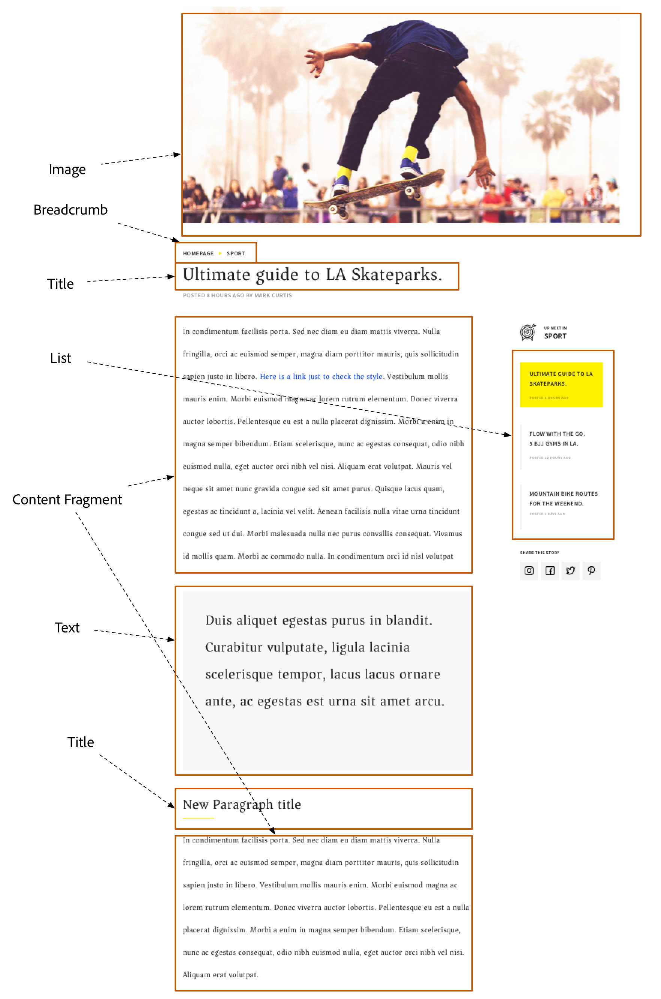

** [Breadcrumb](https://github.com/Adobe-Marketing-Cloud/aem-core-wcm-components/tree/master/content/src/content/jcr_root/apps/core/wcm/components/breadcrumb/v2/breadcrumb)**

* Configurable start level
* Option to show hidden navigation items
* Exclude the current page from the breadcrumb

** [Content Fragment](https://helpx.adobe.com/experience-manager/6-4/assets/using/content-fragments.html)**

* Allow for article text (copy) to be created and managed independently of a page
* Promotes reuse and variations for cross-channel

** [Image](https://github.com/Adobe-Marketing-Cloud/aem-core-wcm-components/tree/master/content/src/content/jcr_root/apps/core/wcm/components/image/v2/image)**

* Smart loading of optimal rendition
* In-place editing, cropping, rotating, and resizing
* Image title, description, accessibility text and link

** [List](https://github.com/Adobe-Marketing-Cloud/aem-core-wcm-components/tree/master/content/src/content/jcr_root/apps/core/wcm/components/list/v2/list)**

* Multiple sources:

    * List page children
    * List tagged items
    * List query result
    * List static items

* Ordering, pagination and limit
* Styles

** [Text](https://github.com/Adobe-Marketing-Cloud/aem-core-wcm-components/tree/master/content/src/content/jcr_root/apps/core/wcm/components/text/v2/text)**

* In-place editing
* Rich Text authoring

** [Title](https://github.com/Adobe-Marketing-Cloud/aem-core-wcm-components/tree/master/content/src/content/jcr_root/apps/core/wcm/components/title/v2/title)**

* In-place editing
* Use the Page title with option to override the text

The Core Components provide all the above functionality. We will focus on styling the components to match the mockups.

## Style System {#style-system}

The [Style System](https://helpx.adobe.com/experience-manager/6-3/release-notes/style-system-fp.html) allows developers and template editors to create multiple visual variations of a component. Authors can then in turn decide which style to use when composing a page. We will leverage the Style System throughout the rest of the tutorial to achieve several unique styles, while leveraging Core Components in a low code approach.

The general idea with the Style System is that authors can choose various styles of how a component should look. The "styles" are backed by additional CSS classes that are injected into the outer div of a component. In the client libraries CSS rules are added based on these style classes so that the component changes appearance.

You can find [detailed documentation for Style System here.](https://helpx.adobe.com/experience-manager/6-3/release-notes/style-system-fp.html) There is also a great [video overview for using the Style System](https://helpx.adobe.com/experience-manager/kt/sites/using/style-system-feature-video-use.html).

## Title Component {#title-component}

At this point the [Title Component](https://helpx.adobe.com/experience-manager/core-components/using/title.html) has been proxied into the project under **/apps/wknd/components/content/title**. We will add styles for the Title Component in the **clientlib-site** library:** /apps/wknd/clientlibs/clientlib-site/components**

The mockups contain a unique style for the Title component with an underline. Instead of creating 2 components or modifying the component dialog, the Style System can be used to allow authors the option to add an underline style.


>[!NOTE]
>
>It is considered a best practice to always tightly scope styles to the target component. This ensures that extra styles don't affect other areas of the page.
>
>All Core Components adhere to ** [BEM notation](https://github.com/Adobe-Marketing-Cloud/aem-core-wcm-components/wiki/CSS-coding-conventions)**. It is a best practice to target the outer CSS class when creating a default style for a component. Another best practice is to target class names specified by the Core Component BEM notation rather than HTML elements.

**Title Component BEM Notation**

```
BLOCK cmp-title
    ELEMENT cmp-title__text
```

1. In the previous chapter, some default styles were imported for the Title component. In the **ui.apps** module beneath **/apps/wknd/clientlibs/clientlib-site/components/title. **There is currently a default style defined by **default.less**:

   ```css
   /* WKND Title Default style */
    
   .cmp-title {
        
       h1, h2, h3, h4 {
           font-family: @font-family-serif;
       }
   
       h1 {
           font-size: 48px;
   
           @media (max-width: @screen-medium) {
               font-size: @font-size-h1;
           }
       }
       
   }
   ```

1. Create a file named **underline.less** beneath the **styles** folder in the previous step: **/apps/wknd/clientlibs/clientlib-site/components/title/styles/underline.less**

   Add the following code:

   ```css
   /* WKND Title Underline style */
   
   .cmp-title--underline {
    
    .cmp-title {
     .cmp-title__text {
      &:after {
      display: block;
         width: 84px;
         padding-top: 8px;
         content: '';
         border-bottom: 2px solid @brand-primary;
      }
     }
    }
   }
   
   ```

   This will add a partial underline beneath the title component with the WKND's brand primary color (yellow).

1. Update **/apps/wknd/clientlibs/clientlib-site/components/title/title.less **with the following code to inculde the default and underline styles:

   ```css
   /* WKND Title Styles */
   
   @import (once) "styles/default.less";
   @import (once) "styles/underline.less";
   ```

   

1. 
1. Click the Title Component in the Layout Container to open its policy configuration:

   <!--
   Comment Type: annotation
   Last Modified By: pid90611
   Last Modified Date: 2018-02-13T08:44:40.769-0500
   "its policy configuration"
   -->

   

1. Update the Policy with the following values:

   Policy Title &#42; : **WKND Title - Article**

   Properties &gt; Sizes &gt; **Check all sizes**

   Properties &gt; Styles Tab &gt; Add a new style

   **Underline** : **cmp-title--underline**

   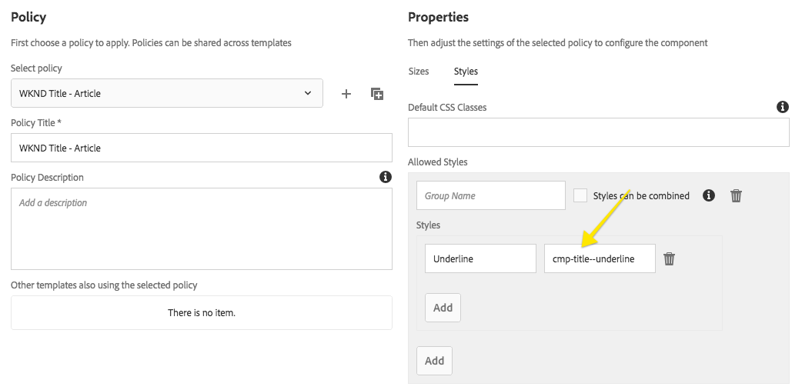

   Notice how ***cmp-title--underline*** added in the template policy matches top level CSS class rule specified in the **underline.less file.** 

1. You should now be able to add a new Title component to the a page and then apply the Underline style to the component. Navigate to: [https://localhost:4502/editor.html/content/wknd/en/first-article-page.html](https://localhost:4502/editor.html/content/wknd/en/first-article-page.html)

   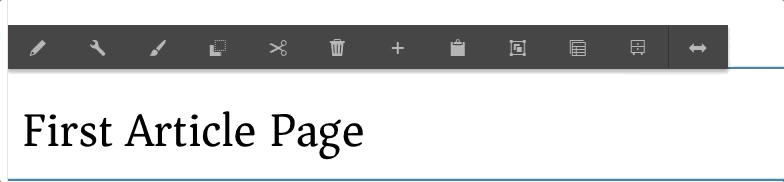

   View the HTML source of the Title Component when no style is applied:

   ```xml
   <div class="title aem-GridColumn aem-GridColumn--default--12">
       <div class="cmp-title">
           <h2 class="cmp-title__text">New paragraph</h2>
       </div>
   </div>
   ```

   HTML source of the Title component when the Underline style is applied:

   ```xml
   <div class="title cmp-title--underline aem-GridColumn aem-GridColumn--default--12">
       <div class="cmp-title">
           <h2 class="cmp-title__text">New paragraph</h2>
       </div>
   </div>
   ```

   Note that CSS classes applied through the Style System always populate the outer div surrounding the component.

## Text Component {#text-cmp-component}

Next we will add some additional styles to the text component so that authors are able to create a Quote Block style, in addition to standard article text.

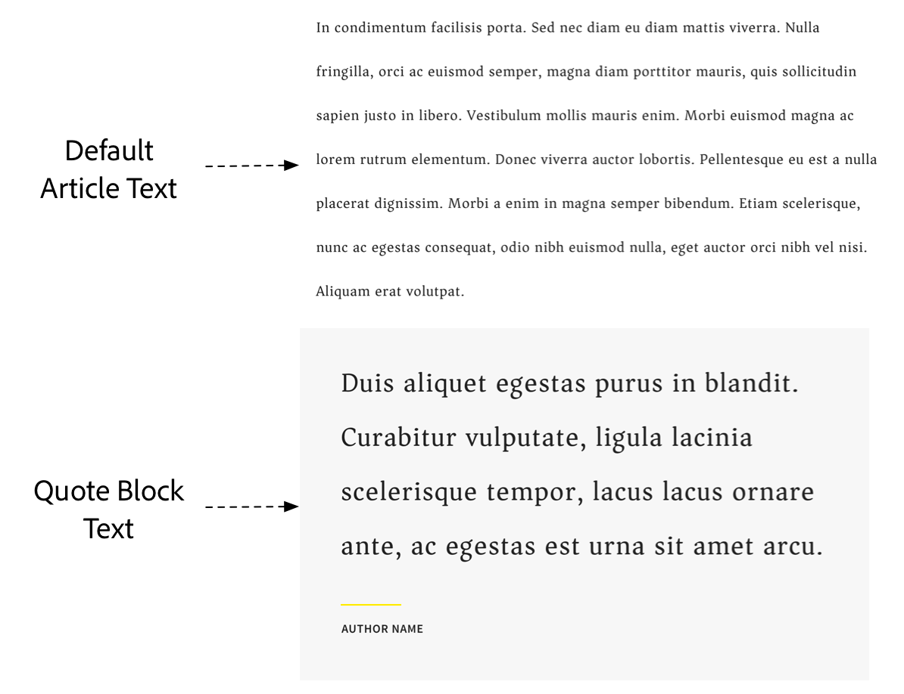

**Text Component BEM Notation**

```
BLOCK cmp-text
    ELEMENT cmp-text__paragraph (only present if text is NOT Rich Text)
```

1. Beneath **/apps/wknd/clientlibs/clientlib-site/components/text/styles **create a new file named **quote.less**. 

   

1. Populate **/apps/wknd/clientlibs/clientlib-site/components/text/styles/quote.less **with the following:

   ```css
   /* WKND Text Quote style */
   
   .cmp-text--quote {
   
         background-color:@brand-secondary;
         padding: 1em 3em;
        margin: 1em 0em;
         
         blockquote {
          margin: 0;
          font-size: 36px;
          border: none;
          padding: 14px 0px;
         }
         
         u {
          text-decoration: none;
          font-family: @font-family-sans-serif;
          &:before {
                   border-top: 2px solid @brand-primary;
                   content: '';
                   display: block;
                   width: 80px;
          }
         }
   }
   
   ```

1. Update **/apps/wknd/clientlibs/clientlib-site/components/text/text.less **to include the **default.less** and **quote.less** files:

   ```css
   /* WKND Text Styles */

   @import (once) "styles/default.less";
   @import (once) "styles/quote.less";

   ```

1. 
1. Click the Text Component in the Layout Container to open its policy configuration. Configure the following:

    1. Policy Title &#42; = **WKND Text - Article**
    1. Plugins &gt; Formatting &gt; Check **Show underline option**
    1. Plugins &gt; Paragraph Styles &gt; Check **Enable paragraph styles**. Remove all elements except for **Paragraph** and **Quote**
    
    1. Styles &gt; Add a new Style named **Quote Block **with a value of **cmp-text--quote**

   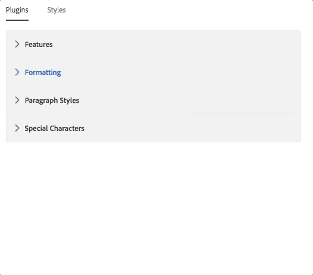

1.

    1. Edit the text component (pencil icon)
    1. Expand the RTE to full screen
    1. Use the Paragraph dropdown to create a Block Quote and add a famous quote.
    1. On a new line below the Block Quote create a paragraph element and add the name of the author
    1. Apply the Underline RTE style to the Author Name
    1. Save changes
    1. Change the Style to Quote Block style

   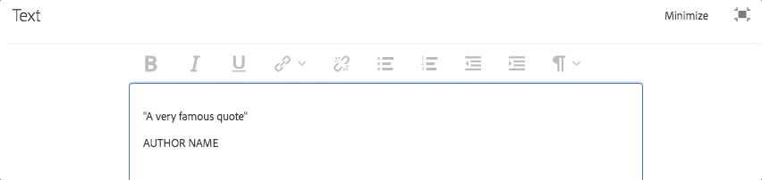 

## List Component {#list-component-style}

The List component as offered from the Core Component will be used to populate an Up Next list of articles. A List component will also be made a fixed part of the Article Page Template to promote consistency across Article Pages. The List component can be used for other parts of the site so a unique style will be created for the Up Next variation.

**List BEM Notation:**

```
BLOCK cmp-list
    ELEMENT cmp-list__item
    ELEMENT cmp-list__item-link
    ELEMENT cmp-list__item-title
    ELEMENT cmp-list__item-date
```

1. Beneath **/apps/wknd/clientlibs/clientlib-site/components:**

    1. Create a new folder named **list**
    1. Create a new file named** list.less**
    1. Create a new folder named **styles **beneath the **list **folder
    
    1. In the **styles** folder create a file named **default.less**
    
    1. In the **styles** folder create a file named **upnext.less**

   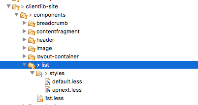

1. Populate **default.less** with the following:

   ```css
   /* WKND List Default Style */

   .cmp-list {
        
       float:left;
       padding:0;
        
       .cmp-list__item {
           list-style: none;
           float:left;
           width:100%;
           margin-bottom:1em;
       }
        
       .cmp-list__item-link {
           font-weight: 600;
           float:left;
           padding: 0.5rem 1rem;
            
           &:hover {
               background: @brand-secondary;
           }
       }
        
       .cmp-list__item-title {
           width:100%;
           float:left;
       }
        
       .cmp-list__item-date {
           width:100%;
           float:left;
           color: @gray-light;
           font-size: @font-size-small; 
       }
        
   }
   ```

1. Populate **upnext.less **with the following:

   ```css
   /* WKND List Up Next Style */
        
   .cmp-list--upnext {
        
       .cmp-list {
                
               padding-left: 0em;
                
               .cmp-list__item {
                   list-style: none;
                   float:left;
                   width:100%; 
                   margin-bottom:1em;
               }
                
               .cmp-list__item-link {
                   font-weight: normal;
                   height: 120px;
                   border-left: 6px solid @brand-secondary;
                    
                   &:hover {
                       background: @brand-primary;
                       border-color: @text-color;
                   }
                    
               }
                
               .cmp-list__item-title {
                   color: @text-color;
                   padding: 5px;
                   text-transform: uppercase;
                    
               }
                
               .cmp-list__item-date {
                   color: @gray-light;
                   font-size: @font-size-xsmall; 
                   padding: 5px;
                   text-transform: uppercase;
               }
                
           }
   }        
   ```

1. Update **list.less **with the following to include the **default** and **upnext** styles:

   ```css
   /* WKND List Styles */
   
   @import (once) "styles/default.less";
   @import (once) "styles/upnext.less";
   ```

1. Add a line to **/apps/wknd/clientlibs/clientlib-site/main.less** file to import the **list.less** file:

   ```css
   /* Component Styles */
   @import "components/breadcrumb/breadcrumb.less";
   @import "components/contentfragment/contentfragment.less";
   @import "components/header/header.less";
   @import "components/image/image.less";
   @import "components/layout-container/layout-container.less";
   /* add list.less */
   @import "components/list/list.less";
   @import "components/text/text.less";
   @import "components/title/title.less";
   ```

1. 
1. Click the policy icon for the **List Component** in the Layout Container to open its policy configuration. Configure the following:

    1. Policy Title &#42; = **WKND List - Article**
    1. List Settings &gt; Date Format &gt; **EEEE, d MMM y**
    1. Styles &gt; Add a new Style named **Up Next **with a value of **cmp-list--upnext**

   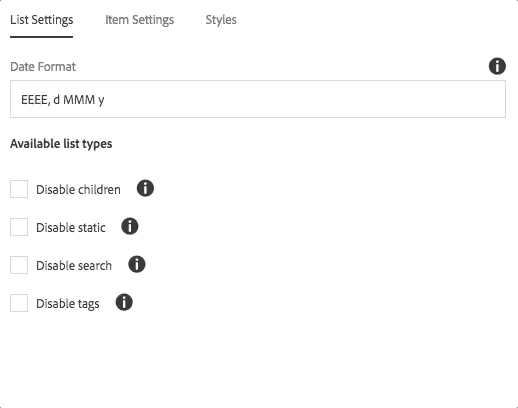

1.

    1. Drag + Drop a List Component on to the page
    1. Click the wrench icon to configure the List component
    1. List Settings &gt; Build List Using &gt; **Fixed List**

        1. Under** **Options for Fixed List** **&gt; **Add a couple of pages**

    1. Item Settings &gt; Check **Link Items**, **Show date**

   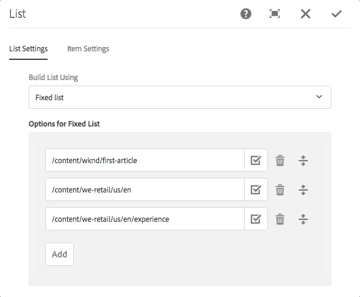

   Several dynamic sources can be configured for the List component including:

    * Child pages
    * Tagged items
    * Query results.

   Full configuration details can be found in the [List Component README.](https://github.com/Adobe-Marketing-Cloud/aem-core-wcm-components/tree/master/content/src/content/jcr_root/apps/core/wcm/components/list/v2/list)

1. 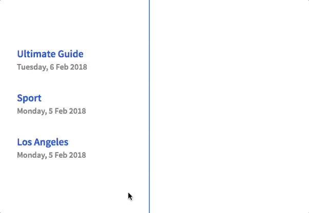

## Layout Container {#layout-container}

At this point, you may have noticed that the "body" of the Article template is spanning the full width of the page. The Layout Container, which we configued in Chapter 2, represents the body of the article and is used to allow authors to add components. We can use the Style System with the Layout Container to create a new, **fixed-width **style to restrict the body of the pages.

1. Beneath **/apps/wknd/clientlibs/clientlib-site/components **perform the following tasks to create a new structure to contain Layout Container styles:

    1. Create a new folder named: **layout-container.**
    1. Beneath this folder create a file named:** layout-container.less**
    1. Beneath the **layout-container** folder create a new folder named: **styles**.
    
    1. In the **styles** folder create a file named **fixed-width.less**

   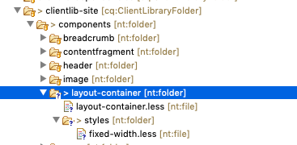

1. Populate **fixed-width.less **with the following:

   ```css
   /* WKND Layout Container - fixed-width.less */
   
   .cmp-layout-container--fixed {
     display:block;
     max-width:  @max-width !important;
     float: unset !important;
     margin: 0 auto !important;
     padding: 0 @gutter-padding;
     clear: both !important; 
   
     @media (max-width: @screen-medium) {
       padding: 0 !important;
     }
     
   }
   ```

   The above snippet will center and restrict the Layout Container, that has a class of **.cmp-layout-container--fixed **to a max-width using a LESS variable, **@max-width**. This variable is defined in the **variables.less** file and is set to: 1164px. 

1. Populate **layout-container.less **with the following:

   ```css
   /* WKND Layout Container Styles */
   
   @import (once) "styles/fixed-width.less";
   ```

1. Next update **/apps/wknd/clientlibs/clientlib-site/main.less** to include the **layout-container.less **file:

   Update **main.less **with the following:

   ```css
   /* Component Styles */
   @import "components/breadcrumb/breadcrumb.less";
   @import "components/contentfragment/contentfragment.less";
   @import "components/header/header.less";
   @import "components/image/image.less";
   /* add import of layout-container.less */
   @import "components/layout-container/layout-container.less";
   @import "components/text/text.less";
   @import "components/title/title.less";
   ```

1. If you have been editing the code base within Eclipse or another IDE, deploy the code to AEM.
1. Click the Layout Container Component and then click it's policy icon to open up the Layout Container policy dialog:

   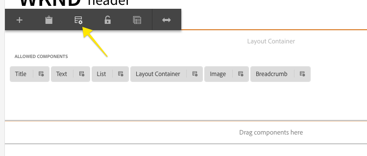 
   The current policy title is WKND Content.  
   Update the Styles tab:

    1. Styles &gt; Add a new Style named **Default **with no value  
    
    1. Styles &gt; Add a new Style named **Fixed Width** with a value: **cmp-layout-container--fixed**

   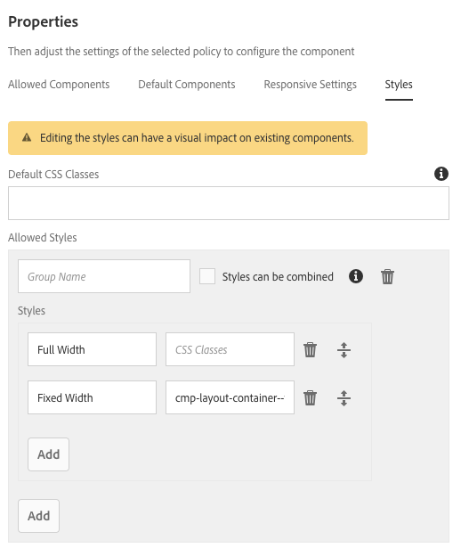

1. Finally, test out the Fixed Width style on the layout container. 

   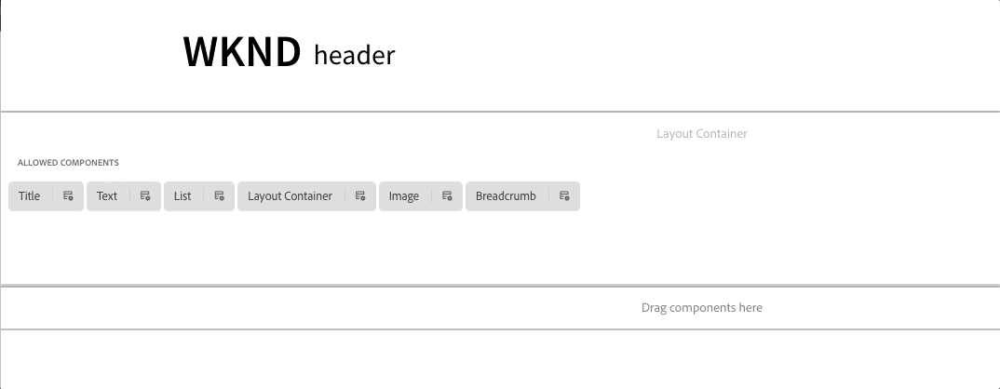

   >[!CAUTION]
   >
   >If you view a page created by the Article Template, you might notice that the page's Layout Container does not have a fixed width. At the end of this chapter we will make some large updates to the Article Template to ensure that all pages created from this template has a fixed width.

## Content Fragment Component {#content-fragment}

For the article body we will leverage [AEM Content Fragments](https://helpx.adobe.com/experience-manager/6-4/assets/using/content-fragments.html). Content Fragments are de-coupled from the presentation layer and promote reuse of content across channels. The editorial UI of Content Fragments lends itself to working with large amounts of text. We will add a component to the WKND application to be able to reference Content Fragments into an article page. To view an [overview of Content Fragments click here.](../../../sites/using/content-fragments-feature-video-understand.md)

1. The Content Fragment component is a separate module of AEM Core Components. The paren pom.xml must be updated to ensure it is available on AEM.

   Add the following dependency to **aem-guides-wkn/pom.xml**:

   ```xml
   //pom.xml
   
   ...
   <dependencies>
   ...
   <dependency>
       <groupId>com.adobe.cq</groupId>
       <artifactId>core.wcm.components.extension</artifactId>
       <type>zip</type>
       <version>1.0.6</version>
   </dependency>
   ...
   </dependencies>
   ```

1. Make the following updates to the ui.apps/pom.xml:

   ```xml
   // ui.apps/pom.xml
   
   ...
   
   <dependencies>
   ...
       <dependency>
           <groupId>com.adobe.cq</groupId>
    <artifactId>core.wcm.components.extension</artifactId>
    <type>zip</type>
       </dependency>
   ...
   </dependencies>
   ```

   ```xml
   // ui.apps/pom.xml
   
   <plugins>
   ...
   <!-- ====================================================================== -->
               <!-- V A U L T   P A C K A G E   P L U G I N S                              -->
               <!-- ====================================================================== -->
               <plugin>
                   <groupId>org.apache.jackrabbit</groupId>
                   <artifactId>filevault-package-maven-plugin</artifactId>
                   <extensions>true</extensions>
                   <configuration>
                       <embeddeds>
                           <embedded>
                               <groupId>com.adobe.aem.guides</groupId>
                               <artifactId>aem-guides-wknd.core</artifactId>
                               <target>/apps/wknd/install</target>
                           </embedded>
                       </embeddeds>
                       <subPackages>
                           <subPackage>
                               <groupId>com.adobe.cq</groupId>
                               <artifactId>core.wcm.components.all</artifactId>
                               <filter>true</filter>
                           </subPackage>
                           <subPackage>
                            <groupId>com.adobe.cq</groupId>
       <artifactId>core.wcm.components.extension</artifactId>
                  <filter>true</filter>
                           </subPackage>
                       </subPackages>
                   </configuration>
               </plugin>
   ...
   </plugins>
   ```

1. There is a Content Fragment reference component in AEM Core Components. It was not included automatically by the AEM project archetype. Manually proxy the component into the WKND code base.

   Create a **cq:Component** node named **contentfragment** beneath **/apps/wknd/components/content.**

   Add the following properties to the node:

   | Name |Type |Value |
   |---|---|---|
   | componentGroup |String |**WKND.Content** |
   | jcr:description |String |**Displays content from a referenced Content Fragment** |
   | jcr:title |String |**Content Fragment** |
   | *jcr:primaryType* |*Name* |*cq:Component* |
   | sling:resourceSuperType |String |**core/wcm/extension/components/contentfragment/v1/contentfragment** |
   | cq:isContainer |Booean |true |

   ```xml
   <?xml version="1.0" encoding="UTF-8"?>
   <jcr:root xmlns:sling="https://sling.apache.org/jcr/sling/1.0" xmlns:cq="https://www.day.com/jcr/cq/1.0" xmlns:jcr="https://www.jcp.org/jcr/1.0"
       cq:isContainer="{Boolean}true"
       jcr:primaryType="cq:Component"
       componentGroup="WKND.Content"
       sling:resourceSuperType="core/wcm/extension/components/contentfragment/v1/contentfragment"
       jcr:title="Content Fragment"
       jcr:description="Displays content from a referenced Content Fragment"/>
   ```

1. In the previous chapter, as part of the import, some default styles for the Content Fragment component were included beneath **/apps/wknd/clientlibs/clientlib-site/components/contentfragment **:

   ```css
   /* WKND Content Fragment style - default.less */
   
   .cmp-contentfragment {
    
    font-family: @font-family-serif;
    
       p {
        text-align: justify;
        font-size: 20px;
        line-height: (@line-height-base + 1);
       }
   }
   ```

   

1. Deploy the code base to a local AEM instance. Since major changes were made to the POM files, perform a full Maven build from the project's root directory:

   ```shell
   $ cd aem-guides-wknd
   $ mvn -PautoInstallPackage -Padobe-public clean install
   ```

   Notice that in Package Manager two additional packages are installed for the Content Fragment extension:

   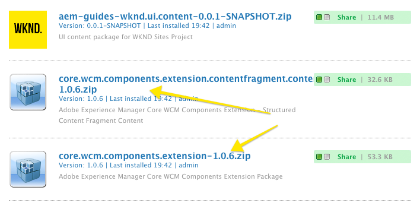

1. Enable the Content Fragment by updating the Layout Container Policy

    1. Navigate to the **Article Page Template:** [https://localhost:4502/editor.html/conf/wknd/settings/wcm/templates/article-page-template/structure.html](https://localhost:4502/editor.html/conf/wknd/settings/wcm/templates/article-page-template/structure.html)
    
    1. Select the main** Layout Container **and click its Policy Icon
    1. Update the **Allowed Components** to include the Content Fragment component under **WKND.Content**

   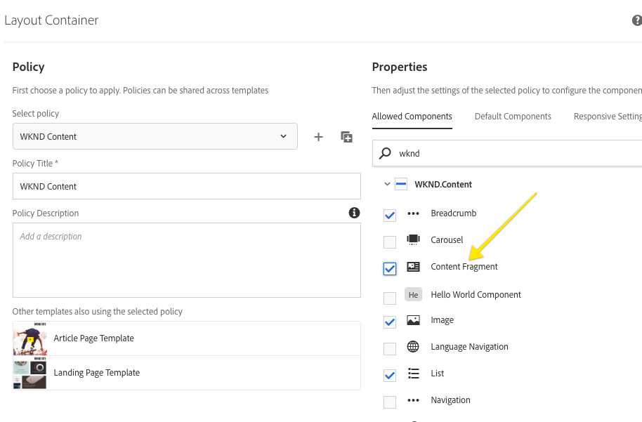

1. The Content Fragment component should now be enabled and allowed to be added to a page.

   

   Empty Content Fragment component added to a page.

1. You can create a new Content Fragment by navigating to [https://localhost:4502/assets.html/content/dam](https://localhost:4502/assets.html/content/dam) and clicking the Create button &gt; Content Fragment from the dropdown. [More information about authoring Content Fragments.](https://helpx.adobe.com/experience-manager/6-4/assets/using/content-fragments.html)

   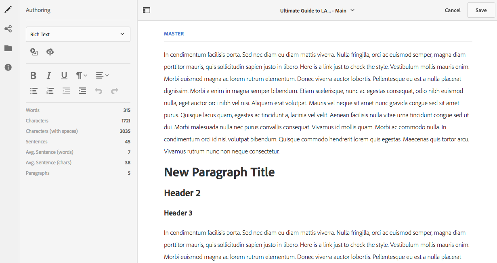

   Content Fragment author UI.

1. Navigate back to the content page in which the Content Fragment component was added (Step 4). Click the Wrench icon to bring up the dialog. Using the path finder you can navigate and select an existing content fragment from the DAM. Optionally you can use the Asset Finder filter to restict the assets to only Content Fragments and Drag+Drop one of the Content Fragments on to the component.

   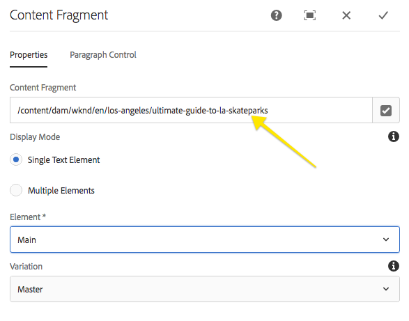

   Editing the Content Fragment component dialog to reference a content fragment.

   You will notice that each paragraph of the Content Fragment has a drop-zone to embed additional components within the Content Fragment. You will also notice that the content of the Content Fragment is read-only. This is by design so that the Content Fragment can only be updating by editing the original fragment.

## Putting It Together {#putting-it-together}

Now that we have some more components to work with we can start to add some more structure to our Article Template. The powerful feature of Editable Templates is the flexibility to make some components of the page fixed and standard across all pages, while making other components editable at the page level. It is important to find a balance between what is editable at the page level and what needs to be managed at the template level.

Below is a diagram of the Article Template sliced into what is fixed, fixed and unlocked and what is fully editable.

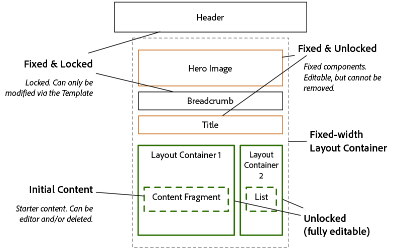

Article Template component architecture

The following videos show how we can implement the above requirements with AEM's Template Editor and then author an article page:

>[!VIDEO](https://video.tv.adobe.com/v/22109?quality=9)

>[!VIDEO](https://video.tv.adobe.com/v/22110?quality=9)

## Help! {#help}

## Next Steps {#next-steps}

Next part in the tutorial:

* [Getting Started with AEM Sites Chapter 5 - Navigation and Search](/help/getting-started-wknd-tutorial-develop/part5.md)
* View the finished code on [GitHub](https://github.com/Adobe-Marketing-Cloud/aem-guides-wknd) or download the finished package for this part of the tutorial:

