# Getting Started with AEM Sites Chapter 6 - Creating a new AEM Component{#getting-started-with-aem-sites-chapter-creating-a-new-aem-component}

Covers the end to end creation of a custom byline component that displays authored content. Includes developing a Sling Model to encapsulate business logic to populate the byline component and corresponding HTL to render the component.

## Prerequisites {#prerequisites}

This is Chapter 6 of a multi-part tutorial. [Chapter 5 can be found here](https://helpx.adobe.com/experience-manager/kt/sites/using/getting-started-wknd-tutorial-develop/part5.html) and an [overview can be found here](https://helpx.adobe.com/experience-manager/kt/sites/using/getting-started-wknd-tutorial-develop.html).

You can check out the finished code on [**GitHub**](https://github.com/Adobe-Marketing-Cloud/aem-guides-wknd) or you can download the solution package:

## Byline Component {#byline-component}

>[!VIDEO](https://video.tv.adobe.com/v/25086/?quality=12)

In this part of the WKND tutorial, a Byline Component is built to be used on the Article pages that displays authored information about the article's contributor.


Byline component visual design provided by WKND design team.

The implementation of this new component includes a dialog that collects the byline content and a custom Sling Model dynamically retrieves the byline's

* Name
* Image
* Occupations

for display by a HTL script.


Byline component decomposition

## Create Byline component {#create-byline-component}

First, create the Byline component node structure and define a dialog. This represents the Component in AEM and implicitly defines the component's resource type by its location in the JCR.

The dialog exposes the interface with which content authors can provide. For this implementation, the AEM WCM Core Component's Image component will be leveraged to handle the authoring and rendering of the Byline's image, so it will be set as our component's `sling:resourceSuperType`.

1. In the `  ui .apps` module beneath `/apps/wknd/components/content` create a new node named `byline` of type `  cq   :Component`.

   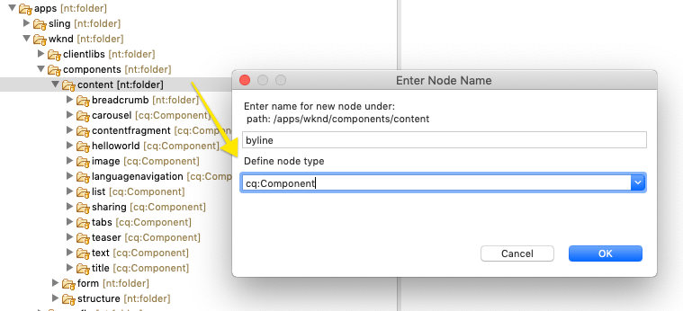

1. Add the following properties to the Byline component's `cq:Component` node.

   ```
   jcr:title = Byline
   jcr:description = Displays a contributor's byline.
   componentGroup = WKND.Content
   sling:resourceSuperType =  core/wcm/components/image/v2/image
   ```

   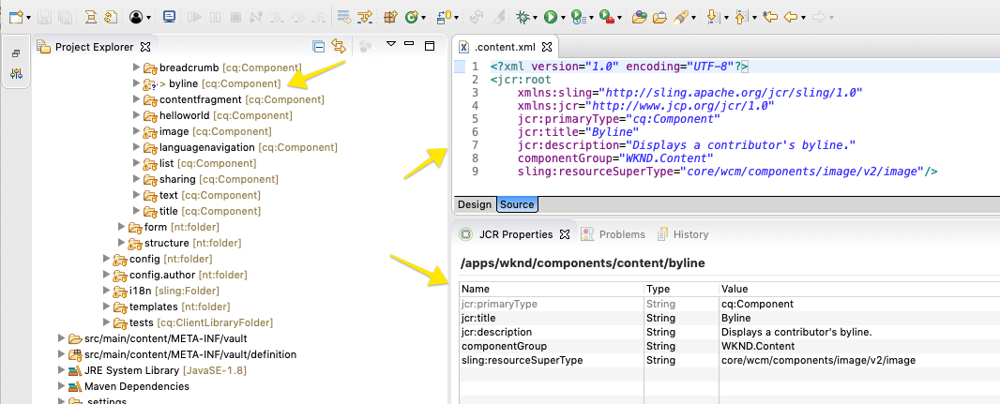

   Which results in this XML:

   ```xml
   <?xml version="1.0" encoding="UTF-8"?>
   <jcr:root
       xmlns:sling="https://sling.apache.org/jcr/sling/1.0"
       xmlns:jcr="https://www.jcp.org/jcr/1.0"
       jcr:primaryType="cq:Component"
       jcr:title="Byline"
       jcr:description="Displays a contributor's byline."
       componentGroup="WKND.Content"
       sling:resourceSuperType="core/wcm/components/image/v2/image"/>
   ```

### Create the HTL script {#create-the-htl-script}

1. Beneath the `byline cq:Component` node, add a new file named `byline.html` which is responsible for the HTML presentation of the component. Naming the file the same as the `cq:Component` node is important as this makes it the default script Sling will use to render this resource type.
1. Add the following code to the `byline.html`.

   ```xml
   <div data-sly-use.placeholderTemplate="core/wcm/components/commons/v1/templates.html">
   </div>
   <sly data-sly-call="${placeholderTemplate.placeholder @ isEmpty=true}"></sly>
   ```

This `byline.html` is revisited later in this part once the Sling Model is created. The HTL file's current state allows the component to display in the AEM Sites' Page Editor when it's drag and dropped onto the page.

### Create the Dialog definition {#create-the-dialog-definition}

Next, define a dialog for the Byline component with the following fields:

* **Name**: a text field the contributor's name.
* **Image**: a reference to the contributor's bio picture.
* **Occupations**: a list of occupations attributed to the contributor. Occupations should be sorted alphabetically in an ascending order (a to z).

1. Beneath the byline component node create a new node named `cq:dialog` of type `nt:unstructured`.
1. Update the `cq:dialog` with the following XML. It is easiest to open up the `.content.xml` and copy/paste the following XML into it.

   ```xml
   <?xml version="1.0" encoding="UTF-8"?>
   <jcr:root xmlns:sling="https://sling.apache.org/jcr/sling/1.0" xmlns:granite="https://www.adobe.com/jcr/granite/1.0" xmlns:cq="https://www.day.com/jcr/cq/1.0" xmlns:jcr="https://www.jcp.org/jcr/1.0" xmlns:nt="https://www.jcp.org/jcr/nt/1.0"
       jcr:primaryType="nt:unstructured"
       jcr:title="Byline"
       sling:resourceType="cq/gui/components/authoring/dialog">
       <content
           jcr:primaryType="nt:unstructured"
           sling:resourceType="granite/ui/components/coral/foundation/container">
           <items jcr:primaryType="nt:unstructured">
               <tabs
                   jcr:primaryType="nt:unstructured"
                   sling:resourceType="granite/ui/components/coral/foundation/tabs"
                   maximized="{Boolean}false">
                   <items jcr:primaryType="nt:unstructured">
                       <!-- This allows the Core Components' Image component's asset definition tab -->
                       <asset 
                           jcr:primaryType="nt:unstructured"
                           sling:hideResource="{Boolean}false"/>
                       <!-- This hides the Core Components' Image component's metadata tab -->
                       <metadata 
                           jcr:primaryType="nt:unstructured"
                           sling:hideResource="{Boolean}true"/>    
                       <properties
                           jcr:primaryType="nt:unstructured"
                           jcr:title="Properties"
                           sling:resourceType="granite/ui/components/coral/foundation/container"
                           margin="{Boolean}true">
                           <items jcr:primaryType="nt:unstructured">
                               <columns
                                   jcr:primaryType="nt:unstructured"
                                   sling:resourceType="granite/ui/components/coral/foundation/fixedcolumns"
                                   margin="{Boolean}true">
                                   <items jcr:primaryType="nt:unstructured">
                                       <column
                                           jcr:primaryType="nt:unstructured"
                                           sling:resourceType="granite/ui/components/coral/foundation/container">
                                           <items jcr:primaryType="nt:unstructured">
                                               <name
                                                   jcr:primaryType="nt:unstructured"
                                                   sling:resourceType="granite/ui/components/coral/foundation/form/textfield"
                                                   fieldLabel="Name"
                                                   fieldDescription="The contributor's name to display."
                                                   emptyText="Enter the contributor's name to display."             name="./name"
                                                   required="{Boolean}true"/>
                                         <occupations
                                                 jcr:primaryType="nt:unstructured"
                                                 fieldLabel="Occupations"
                                                 fieldDescription="A list of the contributor's occupations."
                                                 required="{Boolean}false"
                                                 sling:resourceType="granite/ui/components/coral/foundation/form/multifield">
                                              <field
                                                     jcr:primaryType="nt:unstructured"
                                                  name="./occupations"
                                                     emptyText="Enter an occupation"
                                                     sling:resourceType="granite/ui/components/coral/foundation/form/textfield"/>
                                         </occupations>
                                           </items>
                                       </column>
                                   </items>
                               </columns>
                           </items>
                       </properties>
                   </items>
               </tabs>
           </items>
       </content>
   </jcr:root>
   ```

   Note lines **15-22** above. These node definitions use [Sling Resource Merger](https://sling.apache.org/documentation/bundles/resource-merger.html) to control which dialog tabs are inherited from the `sling:resourceSuperType` component, in this case the Core Components' Image component.

### Create the Policy dialog {#create-the-policy-dialog}

Following the same approach as with the Dialog creation, create a Policy dialog (formerly known as a Design Dialog) to hide unwanted fields in the Policy configuration inherited from the Core Components' Image component.

1. Beneath the byline `  cq   :Component` node, create a new node named `  cq :design_dialog` of type `  nt   :unstructured`.
1. Update the `  cq :design_dialog` with the following XML. It is easiest to open up the `.content.xml`and copy/paste the XML below into it.

   ```xml
   <?xml version="1.0" encoding="UTF-8"?>
   <jcr:root xmlns:sling="https://sling.apache.org/jcr/sling/1.0" xmlns:jcr="https://www.jcp.org/jcr/1.0"
             xmlns:nt="https://www.jcp.org/jcr/nt/1.0" xmlns:cq="https://www.day.com/jcr/cq/1.0"
             xmlns:granite="https://www.adobe.com/jcr/granite/1.0"
       jcr:primaryType="nt:unstructured"
       jcr:title="Byline"
       sling:resourceType="cq/gui/components/authoring/dialog">
       <content
           jcr:primaryType="nt:unstructured">
           <items jcr:primaryType="nt:unstructured">
               <tabs
                   jcr:primaryType="nt:unstructured">
                   <items jcr:primaryType="nt:unstructured">
                       <properties
                           jcr:primaryType="nt:unstructured">
                           <items jcr:primaryType="nt:unstructured">
                               <content
                                   jcr:primaryType="nt:unstructured">
                                   <items jcr:primaryType="nt:unstructured">
                                       <decorative
                                           jcr:primaryType="nt:unstructured"
                                           sling:hideResource="{Boolean}true"/>
                                       <altValueFromDAM
                                           jcr:primaryType="nt:unstructured"
                                           sling:hideResource="{Boolean}true"/>
                                       <titleValueFromDAM
                                           jcr:primaryType="nt:unstructured"
                                           sling:hideResource="{Boolean}true"/>
                                       <displayCaptionPopup
                                           jcr:primaryType="nt:unstructured"
                                           sling:hideResource="{Boolean}true"/>
                                       <disableUuidTracking
                                           jcr:primaryType="nt:unstructured"
                                           sling:hideResource="{Boolean}true"/>                                
                                   </items>
                               </content>
                           </items>
                       </properties>
                       <features
                           jcr:primaryType="nt:unstructured">
                           <items jcr:primaryType="nt:unstructured">
                               <content
                                   jcr:primaryType="nt:unstructured">
                                   <items jcr:primaryType="nt:unstructured">
                                       <accordion
                                           jcr:primaryType="nt:unstructured">
                                           <items jcr:primaryType="nt:unstructured">
                                               <orientation
                                                   jcr:primaryType="nt:unstructured"
                                                   sling:hideResource="{Boolean}true"/>
                                               <crop
                                                   jcr:primaryType="nt:unstructured"
                                                   sling:hideResource="{Boolean}true"/>
                                           </items>
                                       </accordion>
                                   </items>
                               </content>
                           </items>
                       </features>
                   </items>
               </tabs>
           </items>
       </content>
   </jcr:root>
   ```

   The basis for the preceeding Policy dialog XML was obtained from the [Core Components Image (v2) component](https://github.com/Adobe-Marketing-Cloud/aem-core-wcm-components/blob/master/content/src/content/jcr_root/apps/core/wcm/components/image/v2/image/_cq_design_dialog/.content.xml).

   Like in the Dialog configuration, [Sling Resource Merger](https://sling.apache.org/documentation/bundles/resource-merger.html) is used to hide irrelevant fields that are otherwise inherited from the `sling:resourceSuperType`, as seen by the node definitions with only a `  jcr :primaryType` and `sling:hideResource="{Boolean}true"` property.

### Deploy the code {#deploy-the-code}

Deploy the code to AEM.

### Add the component to an Article page {#add-the-component-to-an-article-page}

We'll add the Byline component in its current state to an Article page to verify that the node definition is correct, AEM sees the new component definition and the component's dialog works for authoring.

### Enable the Byline component on the Article Page template {#enable-the-byline-component-on-the-article-page-template}

1. Navigate to **AEM &gt; Tools &gt; General &gt; Templates &gt; WKND Site &gt; Article Page Template** and edit the template.
1. While in **Structure** mode, select the main **Layout Container** and tap the **policy **icon to edit its Policy.

   

1. In the **WKND.Content** component group, check the **Byline** component to allow it to be added to this layout container, and tap the Check in the top right to save the change.

   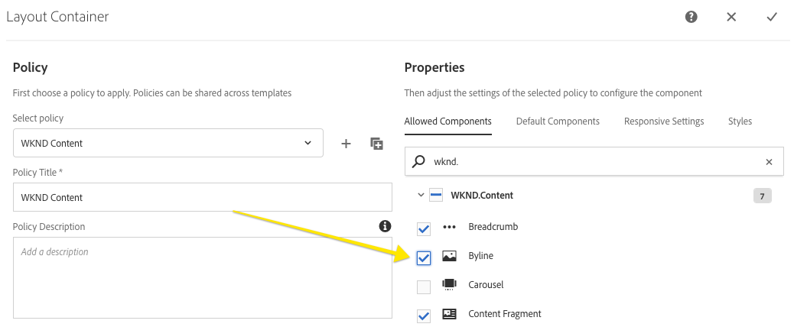

### Drag and drop the component onto the page {#drag-and-drop-the-component-onto-the-page}

1. Navigate to the article page at **AEM &gt; Sites &gt; WKND Site &gt; Home &gt; Sports &gt; Ultimate guide to LA skateparks**, and edit to open.
1. From the left sidebar, drag and drop a Byline component on to bottom of the Layout Container of the opened article page.

   

### Author the component {#author-the-component}

AEM authors configure and author components via the dialogs. At this point in the development of the Byline component the dialogs are included for collecting the data, however the logic to render the authored content has not yet been added.

1. Ensure the **left sidebar is open** and visible, and the **Asset Finder** is selected.

   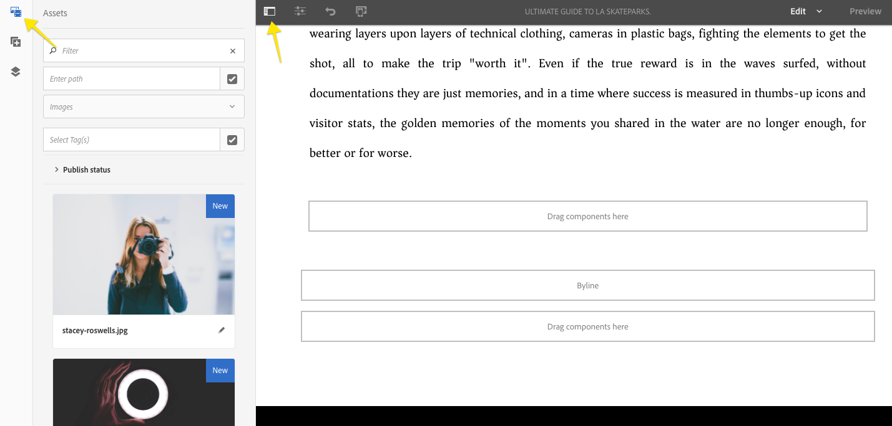

1. **Select the Byline component placeholder**, which in turn displays the action bar and **tap the Wrench **icon to open the dialog.

   

1. With the dialog open, and the first tab (Asset) active, open the left sidebar, and from the asset finder, drag an image into the Image drop-zone.

   Any AEM Asset can be used, but to use the same bio picture as in this tutorial, download the attached image and upload to AEM Assets.* (Image courtesy of [@staceygabby at unsplash.com](https://unsplash.com/photos/bduka9UJzrk))*

   [Get File](assets/stacey-roswells.jpg)
   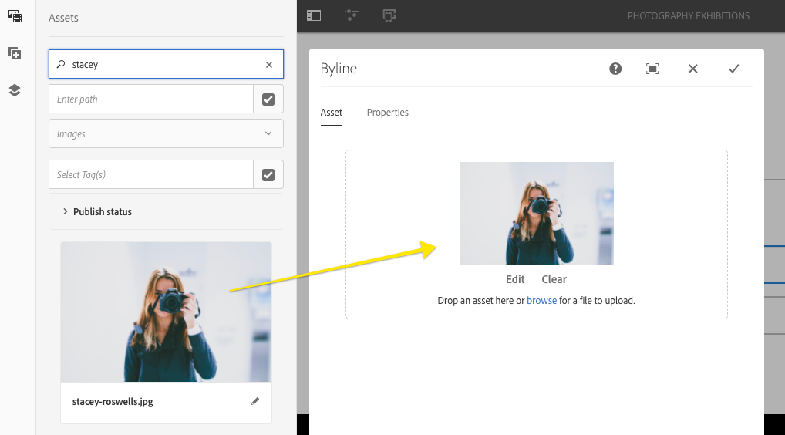

1. After adding an image, click on the **Properties** tab to enter the **Name** and **Occupations**.

   When entering occupations, enter them in **reverse alphabetical** order (so the alphabetizing business logic we'll implement in the Sling Model is readily apparent).

   Tap the **Check** icon in the top right to save the changes.

   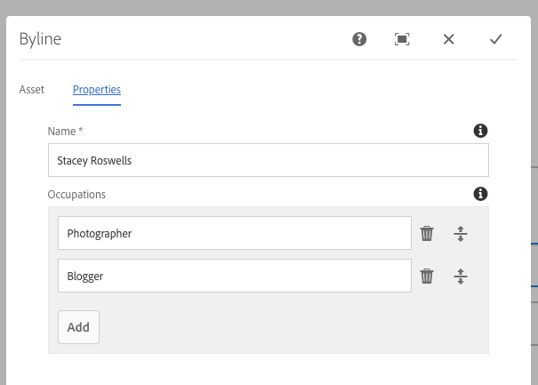

1. After saving the dialog, navigate to [CRXDE Lite](https://localhost:4502/crx/de/index.jsp#/content/wknd/en/art/exhibitions/jcr%3Acontent/root/responsivegrid) and review how the component's content is stored on the Byline component content node under the AEM page.

   Find the Byline component content node beneath the `jcr:content/root/responsivegrid/responsivegrid` node i.e `/content/wknd/en/sports/la-skateparks/jcr:content/root/responsivegrid/responsivegrid/byline`.

   Notice the property names of `name`, `occupations`, and `fileReference` are stored on the byline node.

   Also, notice the `sling:resourceType` of the node is set to `wknd/components/content/byline`which is what binds this content node to the Byline component implementation.

   

   /content/wknd/en/art/exhibitions/jcr:content/root/responsivegrid/byline

Next, we'll create a Sling Model to act as the data model and house the business logic for the Byline component.

Sling Models are annotation driven Java "POJO's" (Plain Old Java Objects) that facilitate the mapping of data from the JCR to Java variables, and provide a number of other nicities when developing in the context of AEM.

## Update reactor and core pom.xml {#update-reactor-and-core-pom-xml}

In order to most efficiently use Sling Models, the project's POM's need updating. Update the `reactor` and `core` `pom.xml` files to use the latest standards and practices. We'll also use the opportunity to leverage the [Apache Commons-Lang3 library](https://commons.apache.org/proper/commons-lang/) which is provided by AEM and provides a suite of very useful utility classes.

1. Edit the Parent Reactor POM: `  aem -guides-wknd/pom.xml`
1. Ensure that the [uber-jar](https://helpx.adobe.com/experience-manager/6-4/sites/developing/using/ht-projects-maven.html#ExperienceManagerAPIDependencies) dependency is at least **6.3.2**

   ```xml
   <dependencies>
   ...
       <dependency>
           <groupId>com.adobe.aem</groupId>
           <artifactId>uber-jar</artifactId>
           <version>6.3.2</version>
           <classifier>apis</classifier>
           <scope>provided</scope>
        </dependency>
   ...
   </dependencies>
   ```

1. Add a dependency for [Core Components - Core](https://github.com/adobe/aem-core-wcm-components/tree/master/bundles/core). This is the dependency for the Sling Models associated with Core Components.

   ```xml
   <dependencies>
       ...
       <dependency>
           <groupId>com.adobe.cq</groupId>
           <artifactId>core.wcm.components.core</artifactId>
           <version>2.2.0</version>
           <scope>provided</scope>
   </dependency>
   ...
   </dependencies>
   ```

   The Image Sling Model, exposed by the **core** bundle, will be leveraged in the byline Sling model later in the tutorial.

1. Add dependency for [Apache commons-lang3](https://commons.apache.org/proper/commons-lang/apidocs/org/apache/commons/lang3/package-summary.html). This provides a number of helpful utilities classes.

   ```xml
   <dependencies>
       ...
       <dependency>
           <groupId>org.apache.commons</groupId>
           <artifactId>commons-lang3</artifactId>
           <version>3.6</version>
           <scope>provided</scope>
       </dependency>
       ...
   </dependencies>
   ```

   The full contents of the updated [reactor pom.xml can be found here](https://github.com/Adobe-Marketing-Cloud/aem-guides-wknd/blob/part/6-new-component/pom.xml).

   The &lt;scope&gt;provided&lt;/scope&gt; indicates that AEM will be satisfying this dependency upon deployment. The version 3.6 is used as this is the version exposed by AEM which can be determined by looking up the exported version in the AEM Web Console's Dependency Finder *([https://localhost:4502/system/console/depfinder](https://localhost:4502/system/console/depfinder))*.

   

1. Edit `  aem -guides-wknd/core/pom.xml` and add a matching dependency for **core.wcm.components.core **entry so the core project is aware of it. Note that the version and scope is not provided here, but rather these will be derived from the definition in the reactor pom.

   ```xml
   <dependencies>
       ...
       <dependency>
    <groupId>com.adobe.cq</groupId>
           <artifactId>core.wcm.components.core</artifactId>
      </dependency>
       ...
   </dependencies>
   ```

1. Edit `  aem -guides-wknd/core/pom.xml` and add matching dependency entry for **commons-lang3.**

   ```xml
   <dependencies>
       ...
        <dependency>
           <groupId>org.apache.commons</groupId>
           <artifactId>commons-lang3</artifactId>
       </dependency>    
       ...
   </dependencies>
   ```

1. Update the `maven-bundle-plugin` in the `core pom.xml` to use the Sling ModelsScannerPlugin.

   In the **maven-bundle-plugin's instructions**, remove the configuration `<Sling-Model-Packages>...</Sling-Model-Packages>`, and replace it with `<_plugin>org.apache.sling.bnd.models.ModelsScannerPlugin</_plugin>.`  
  
   The replaced configuration required the project explicitly specify the packages containing Sling Models. [Sling ModelsScannerPlugin](https://sling.apache.org/documentation/bundles/models.html#registration-of-sling-models-classes-via-bnd-plugin) allows for the creation of Sling Models in any Java packages, resulting in more flexibility.

   ```xml
   <plugins>
       ...
       <plugin>
           <groupId>org.apache.felix</groupId>
           <artifactId>maven-bundle-plugin</artifactId>
           <extensions>true</extensions>
           <configuration>
               <instructions>
               <Import-Package>javax.inject;version=0.0.0,*</Import-Package>
               <Bundle-SymbolicName>com.adobe.aem.guides.wknd.core</Bundle-SymbolicName>
               <_plugin>org.apache.sling.bnd.models.ModelsScannerPlugin</_plugin>
               </instructions>
           </configuration>
           <dependencies>
               <dependency>
                   <groupId>org.apache.sling</groupId>
                   <artifactId>org.apache.sling.bnd.models</artifactId>
                   <version>1.0.0</version>
               </dependency>
           </dependencies>
       </plugin>
       ...
   </plugins>
   ```

   The full updates to `core/pom.xml` can be found here.

## Byline interface {#byline-interface}

Next, create a public Java Interface for the Byline. `Byline.java` defines the public methods needed to drive the `byline.html` HTL script.

1. Within the `wknd-sites-guide.core` module beneath `src/main/java,`right-click to create a new Java package named `com.adobe.aem.guides.wknd.core.components`. Check **Create package-info.java** in the New Java Package dialog.

   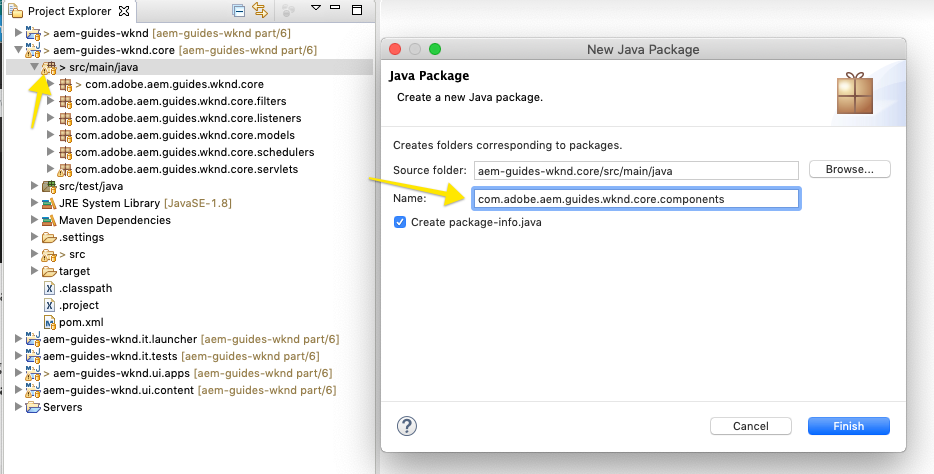

1. Beneath `com.adobe.aem.guides.wknd.components`update `package-info.java` with the following:

   ```java
   @Version("0.0.1")
   package com.adobe.aem.guides.wknd.core.components;  
   
   import org.osgi.annotation.versioning.Version;
   ```

   A best practice is to version Java packages that expose public interfaces. This can be used to alert consuming code if the exposed methods have changed, and is most helpful if various teams are relying on this interface

1. Create a new Java Interface named `Byline.java` by right-clicking the `com.adobe.aem.guides.wknd.core.components` **package > New > Interface**. Enter `Byline` as the interface Name, and click Finish.

   

1. Update `Byline.java` with the following methods:

   ```java
   package com.adobe.aem.guides.wknd.core.components;
   
   import java.util.List;
   
   /** 
    * Represents the Byline AEM Component for the WKND Site project.
    **/
   public interface Byline {
       /***
        * @return a string to display as the name.
        */
       String getName();
    
       /***
        * Occupations are to be sorted alphabetically in a descending order.
        * 
        * @return a list of occupations.
        */
       List<String> getOccupations();
    
       /***
        * @return a boolean if the component has content to display.
        */
       boolean isEmpty();
   }
   ```

   The first two methods expose the values for the **Name** and **Occupations** for the Byline component.

   The `isEmpty()` method is used to determine if the component has any content to render or if it is waiting to be configured.

   Notice there is no method for the Image; we'll take a look at as to why that is later.

## Byline implementation {#byline-implementation}

`BylineImpl.java` is the implementation of the Sling Model that implements the `Byline.java` interface defined earlier. The full code for **BylineImpl.java** can be found at the bottom of this section.

1. Within the `core` module beneath `src/main/java`, right-click to create a new Java package named `com.adobe.aem.guides.wknd.core.components.impl`. This time, leave **Create package-info.java** unchecked as this is a private package as denoted by the `  impl` package name.

   

1. Create a new class file named `BylineImpl.java` by right-clicking the `com.adobe.aem.guides.wknd.core.components.impl` package and selecting **New &gt; Class**.

   For the name, enter `BylineImpl`. Add the `Byline interface` as an implementing interface.

   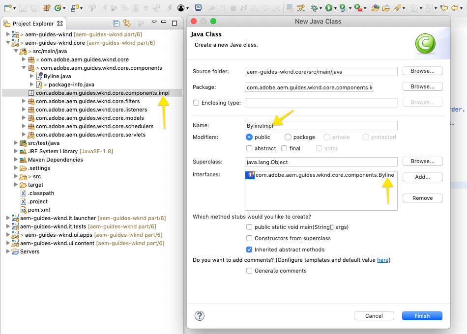

1. Open `BylineImpl.java`. It is auto-populated with all of the methods defined in the interface `Byline.java`.

   ```java
   package com.adobe.aem.guides.wknd.core.components.impl;
   
   import java.util.List;
   import com.adobe.aem.guides.wknd.core.components.Byline;
   
   public class BylineImpl implements Byline {
   
    @Override
    public String getName() {
     // TODO Auto-generated method stub
     return null;
    }
   
    @Override
    public List<String> getOccupations() {
     // TODO Auto-generated method stub
     return null;
    }
   
    @Override
    public boolean isEmpty() {
     // TODO Auto-generated method stub
     return false;
    }
   }
   ```

1. Add the Sling Model annotations by updating `BylineImpl.java` with the following class-level annotations. This `@Model(..)`annotation is what turns the class into a Sling Model.

   ```java
   import org.apache.sling.api.SlingHttpServletRequest;
   import org.apache.sling.models.annotations.Model;
   import org.apache.sling.models.annotations.DefaultInjectionStrategy;
   ...
   @Model(
           adaptables = {SlingHttpServletRequest.class},
           adapters = {Byline.class},
           resourceType = {BylineImpl.RESOURCE_TYPE},
           defaultInjectionStrategy = DefaultInjectionStrategy.OPTIONAL
   )
   public class BylineImpl implements Byline {
       protected static final String RESOURCE_TYPE = "wknd/components/content/byline";
       ...
   }
   ```

   Let's review this annotation and its parameters  :.

    * The `@Model` annotation registers BylineImpl as a Sling Model when it is deployed to AEM.
    * The `  adaptables` parameter specifies that this model can be adapted by the request.
    * The `adapters` parameter allows the implementation class to be registered under the Byline interface. This allows the  HTL  script to call the Sling Model via the interface (instead of the  impl  directly). [More details about adapters can be found here](https://sling.apache.org/documentation/bundles/models.html#specifying-an-alternate-adapter-class-since-110).
    
    * The `resourceType` points to the Byline component resource type (created earlier) and helps to resolve the correct model if there are multiple implementations. [More details about associating a model class with a resource type can be found here](https://sling.apache.org/documentation/bundles/models.html#associating-a-model-class-with-a-resource-type-since-130).

### Implementing the Sling Model methods {#implementing-the-sling-model-methods}

#### Implementing getName() {#implementing-getname}

The first method we'll tackle is `getName()` which simply returns the value stored to the byline's JCR content node under the property **`name`**.

For this, the `@ValueMapValue` Sling Model annotation can be used to inject the value into a Java field in the Sling Model.

```java
... 
import org.apache.sling.models.annotations.injectorspecific.ValueMapValue; 
... 
public class BylineImpl implements Byline {
    ...

    @ValueMapValue
    private String name;

    ...
    @Override
    public String getName() {
        return name;
    }
    ...
}
```

Because the JCR property shares the same name as the Java field (both are "name"), @ `ValueMapValue` automatically resolves this association and injects the value at the property name into the Java field.

If the JCR property had been named something different, additional annotations can be used to coerce the value injection. For example, if the JCR property had been named `fullName`, the following would inject its value into the Java field `name`.

```java
import org.apache.sling.models.annotations.injectorspecific.ValueMapValue;
import javax.inject.Named;
...

@ValueMapValue
@Named("fullName")
private String name;
```

#### Implementing getOccupations() {#implementing-getoccupations}

The next method to implement is `getOccupations()`` This method should collect all the occupations stored in the JCR property `occupations` and return a sorted (alphabetically) collection of them.

Using the same technique explored in `getName()` the property value can be injected into the Sling Model.

```java
@ValueMapValue
private List<String> occupations;
```

Now that the JCR property values are available in the Sling Model via the injected Java field `occupations`, the sorting business logic can be applied in the `getOccupations()` method.

```java
import java.util.Collections;
...

public class BylineImpl implements Byline {
...

public List<String> getOccupations() {
    if (occupations != null) {
        Collections.sort(occupations);
        return occupations;
    } else {
        return Collections.emptyList();
    }
}
...
}
...
```

#### Implementing isEmpty() {#implementing-isempty}

The last public method is `isEmpty()` which determines when the component should consider itself "authored enough" to render.

For this component, we have business requirements stating that all three fields, name, image and occupations must be filled out.

```java
import org.apache.commons.lang3.StringUtils;
...
public class BylineImpl implements Byline {
...
@Override
public boolean isEmpty() {
    if (StringUtils.isBlank(name)) {
        // Name is missing, but required
        return true;
    } else if (occupations == null || occupations.isEmpty()) {
        // At least one occupation is required
        return true;
    } else if (/* image is not null*/) {
        // A valid image is required
        return true;
    } else {
  // Everything is populated, so this component is not considered empty
        return false;
    }
}
...

}
```

#### Tackling the "Image problem" {#tackling-the-image-problem}

Checking the name and occupation conditions are trivial (and the Apache Commons Lang3 provides the always handy [StringUtils](https://commons.apache.org/proper/commons-lang/apidocs/org/apache/commons/lang3/StringUtils.html) class), however, there is a problem in that it's unclear how the presence of the Image can be validated since we're using the Core Components Image component to surface the image.

There are two ways to tackle this:

**1. **Check if the fileReference JCR property resolves to an asset.

**OR**

**2. **Convert this resource into a Core Component Image Sling Model and ensure the getSrc() method is not empty.

We will opt for approach #2. The first approach is likely sufficient, but in this tutorial, the latter will be used to explore other features of Sling Models.

The first thing to do is create a private method that gets the Image. This method is left private because we do not need to expose the Image object in the HTL itself, and its only used to drive `isEmpty().`

```java
import com.adobe.cq.wcm.core.components.models.Image;
...
private Image getImage() { 
    Image image = null;
    // Figure out how to populate the image variable!
    return image;
}
```

There are two approaches to get the Image Sling Model:

**1. ** Use the `@Self` annotation, to automatically adapt the current request to the Image.class

```
@Self
 private Image image;
```

**OR**

**2. **Use the [Apache Sling ModelFactory](https://sling.apache.org/apidocs/sling10/org/apache/sling/models/factory/ModelFactory.html) OSGi service, which is a very handy service, and helps us create Sling Models of other types in Java code.

We will opt for approach #2.

>[!NOTE]
>
>In a real-world implementation, approach #1, using @Self is preferred since it's the simpler, more elegant solution. In this tutorial we'll use the second approach, as it requires us to explore more facets of Sling Models!

Since Sling Models are Java POJO's, and not OSGi Services, the usual OSGi injection annotations, like** @Reference**, cannot be used, meaning the following would not work (modelFactory would be null).

```java
import org.apache.sling.models.factory.ModelFactory;
...
public class BylineImpl implements Byline {
    ...
     // will be null, so will not use @Reference annotation
    @Reference
    private ModelFactory modelFactory;
}

```

Instead, Sling Models provide a special ` [@OSGiService](https://sling.apache.org/documentation/bundles/models.html#injector-specific-annotations)` annotation that provides similar functionality.

```java
import org.apache.sling.models.factory.ModelFactory;
import org.apache.sling.models.annotations.injectorspecific.OSGiService;

public class BylineImpl implements Byline {
    ...
    @OSGiService
    private ModelFactory modelFactory;
}
```

With the `ModelFactory` available, a Core Component Image Sling Model can be created using `modelFactory.getModelFromWrappedRequest(SlingHttpServletRequest request, Resource resource, java.lang.Class<T> targetClass)`, however, this method requires both a request and resource, neither yet available in the Sling Model.

For this, more Sling Model annotations are used!

To get the current request the ` [@Self](https://sling.apache.org/documentation/bundles/models.html#injector-specific-annotations)` annotation  be  used to inject the `adaptable` (which is defined in the `@Model(..)` as `SlingHttpServletRequest.class`, into a Java class field.

```java
import org.apache.sling.models.annotations.injectorspecific.Self;
...
@Self
private SlingHttpServletRequest request;
```

Remember, using `@Self Image image` to inject the Core Component Image Sling Model was an option above - the `@Self` annotation tries to inject the adaptable object (in our case a SlingHttpServletRequest), and adapt to the annotation field type. Since the Core Component Image Sling Model is adaptable from SlingHttpServletRequest objects, this would have worked and is less code than our more exploratory approach.

Now we've injected the variables necessary to instantiate our Image model via the ModelFactory API. We will use Sling Model's ** [@PostConstruct](https://sling.apache.org/documentation/bundles/models.html#postconstruct-methods)** annotation to obtain this object after the Sling Model instantiates.

`@PostConstruct` is incredibly useful and acts in a similar capacity as a constructor, however, it is invoked after the class is instantiated and all annotated Java fields are injected. Whereas other Sling Model annotations annotate Java class fields (variables), `@PostConstruct` annotates a void, zero parameter method, typically named `init()` (but can be named anything).

```java
import javax.annotation.PostConstruct;
...
public class BylineImpl implements Byline {
         ...
 private Image image;

 @PostConstruct
 private void init() {
  image = modelFactory.getModelFromWrappedRequest(request, request.getResource(), Image.class);
 }
    ...
} 
```

Remember, Sling Models are **NOT** OSGi Services, so it is safe to maintain class state. Often the `@PostConstruct` derives and sets up Sling Model class state for later use, similar to what a plain constructor does.

Note that if the `@PostConstruct` method throws an exception, the Sling Model will not instantiate (it will be null).

`getImage()` can now be updated to simply return the image object.

```java
/**
 * @return the Image Sling Model of this resource, or null if the resource cannot create a valid Image Sling Model. 
 */
@Nullable
private Image getImage() { 
 return image;
}
```

Let's head back to `isEmpty()` and finish the implementation.

```java
@Override
public boolean isEmpty() {    
    if (StringUtils.isBlank(name)) {
        // Name is missing, but required
        return true;
    } else if (occupations == null || occupations.isEmpty()) {
        // At least one occupation is required
        return true;
    } else if (getImage() == null || StringUtils.isBlank(getImage().getSrc())) {
        // A valid image is required
        return true;
    } else {
        // Everything is populated, so this component is not considered empty
        return false;
    }
}
```

Note multiple calls to `getImage()` is not problematic as returns the initialized `image`class variable and does not invoke `modelFactory.getModelFromWrappedRequest(...)` which isn't an incredibly costly, but worth avoiding calling unnecessarily.

The final `BylineImpl.java` should look like:

```java
package com.adobe.aem.guides.wknd.core.components.impl;

import java.util.Collections;
import java.util.List;

import javax.annotation.PostConstruct;

import org.apache.commons.lang3.StringUtils;
import org.apache.sling.api.SlingHttpServletRequest;
import org.apache.sling.models.annotations.DefaultInjectionStrategy;
import org.apache.sling.models.annotations.Model;
import org.apache.sling.models.annotations.injectorspecific.OSGiService;
import org.apache.sling.models.annotations.injectorspecific.Self;
import org.apache.sling.models.annotations.injectorspecific.ValueMapValue;
import org.apache.sling.models.factory.ModelFactory;

import com.adobe.aem.guides.wknd.core.components.Byline;
import com.adobe.cq.wcm.core.components.models.Image;
import com.drew.lang.annotations.Nullable;

@Model(
        adaptables = {SlingHttpServletRequest.class},
        adapters = {Byline.class},
        resourceType = {BylineImpl.RESOURCE_TYPE},
        defaultInjectionStrategy = DefaultInjectionStrategy.OPTIONAL
)
public class BylineImpl implements Byline {
    protected static final String RESOURCE_TYPE = "wknd/components/content/byline";

    @Self
    private SlingHttpServletRequest request;
    
    @OSGiService
    private ModelFactory modelFactory;
    
    @ValueMapValue
    private String name;
    
    @ValueMapValue
    private List<String> occupations;
    
    private Image image;
    
    @PostConstruct
    private void init() {
        image = modelFactory.getModelFromWrappedRequest(request, request.getResource(), Image.class);
    }
    
    @Override
    public String getName() {
        return name;
    }
    
    @Override
    public List<String> getOccupations() {
         if (occupations != null) {
             Collections.sort(occupations);
             return occupations;
         } else {
             return Collections.emptyList();
         }
    }

    @Override
    public boolean isEmpty() {
        final Image image = getImage();
        
        if (StringUtils.isBlank(name)) {
            // Name is missing, but required
            return true;
        } else if (occupations == null || occupations.isEmpty()) {
            // At least one occupation is required
            return true;
        } else if (image == null || StringUtils.isBlank(image.getSrc())) {
            // A valid image is required
            return true;
        } else {
            // Everything is populated, so this component is not considered empty
            return false;
        }
    }
    
    /**
     * @return the Image Sling Model of this resource, or null if the resource cannot create a valid Image Sling Model. 
     */
    @Nullable
    private Image getImage() {
        return image;
    }
}
```

## Byline HTL {#byline-htl}

In the ui.apps module, open /apps/wknd/components/content/byline/byline.html we created in the earlier set up of the AEM Component.

```xml
<div data-sly-use.placeholderTemplate="core/wcm/components/commons/v1/templates.html">
</div>
<sly data-sly-call="${placeholderTemplate.placeholder @ isEmpty=false}"></sly>
```

Let's review what this HTL script does so far:

1. The `placeholderTemplate` points to Core Components' placeholder, which displays when the component is not fully configured. This renders in AEM Sites Page Editor as a grey box with the component title, as defined above in the `  cq   :Component   `'s   jcr   :title` property.

1. The `data-sly-call="${placeholderTemplate.placeholder @ isEmpty=false}` loads the `  placeholderTemplate` defined above and passes in a boolean value (currently hard-coded to `false`) into the placeholder template. When `isEmpty` is true, the placeholder template renders the grey box, else it renders nothing.

Update `byline.html` with the following skeletal HTML structure:

```xml
<div data-sly-use.placeholderTemplate="core/wcm/components/commons/v1/templates.html"     
     class="cmp-byline">
        <div class="cmp-byline__image">
            <!-- Include the Core Components Image Component -->
        </div>
        <h2 class="cmp-byline__name"><!-- Include the name --></h2>
        <p class="cmp-byline__occupations"><!-- Include the occupations --></p>
</div>
<sly data-sly-call="${placeholderTemplate.placeholder @ isEmpty=true}"></sly>
```

Note the CSS classes follow the [BEM naming convention](https://getbem.com/naming/). While the use of BEM conventions isn't mandatory, BEM is recommended as it's used in Core Component CSS classes and generally results in clean, readable CSS rules.

### Instantiating Sling Model objects in HTL {#instantiating-sling-model-objects-in-htl}

The [Use block statement](https://github.com/Adobe-Marketing-Cloud/htl-spec/blob/master/SPECIFICATION.md#221-use) is one of the most common, as it's used to instantiate Sling Model objects in the HTL script and assign it to an HTL variable.

`data-sly-use.byline="com.adobe.aem.guides.wknd.components.Byline"` uses the Byline interface (com.adobe.aem.guides.wknd.components.Byline) implemented by BylineImpl and adapts the current SlingHttpServletRequest to it, and the result is stored in a HTL variable name byline ( `data-sly-use.<variable-name>`).

```xml
<div data-sly-use.byline="com.adobe.aem.guides.wknd.core.components.Byline"
     data-sly-use.placeholderTemplate="core/wcm/components/commons/v1/templates.html"     
     class="cmp-byline">...</div>
```

### Accessing Sling Model methods {#accessing-sling-model-methods}

HTL borrows from  JSTL,  and uses the same shortening of Java getter methods names.

For example, invoking the Byline Sling Model's `getName()` method can be shortened to `byline.name`, similarly instead of `byline.isEmpty`, this can be shorted to `byline.empty`. Using full method names, `byline.getName` or `byline.isEmpty`, works as well. Note the `()` are never used to invoke methods in HTL (similar to JSTL).

Java methods that require a parameter cannot be used in HTL. This is by design to keep the logic in HTL simple.

The Byline name can be added to the component by invoking the getName() method on the Byline Sling Model, or in HTL: `${byline.name}`.

```xml
<h2 class="cmp-byline__name">${byline.name}</h2>

```

### Using HTL Expression Options {#using-htl-expression-options}

[HTL Expressions Options](https://github.com/Adobe-Marketing-Cloud/htl-spec/blob/master/SPECIFICATION.md#12-available-expression-options) act as modifiers on content in  HTL,  and range from date-formatting to i18n translation. Expressions can also be used to join lists or arrays of values, which is what's needed to display the occupations in a comma delimited format.

Expressions are added via the `@` operator in the HTL expression. To join the list of occupations with ", ", the following code is used:

```xml
<p class="cmp-byline__occupations">${byline.occupations @ join=', '}</p>

```

### Conditionally displaying the placeholder {#conditionally-displaying-the-placeholder}

Most HTL scripts for AEM Components leverage the placeholder paradigm to provide a visual cue to authors indicating a component is incorrectly authored and will not display on AEM Publish. The convention to drive this decision is to implement a method on the component's backing Sling Model, in our case: `Byline.isEmpty()`.

`isEmpty()` is invoked on the Byline Sling Model and the result (or rather its negative, via the `!` operator) is saved to an HTL variable named `hasContent`:

```xml
<div data-sly-use.byline="com.adobe.aem.guides.wknd.core.components.Byline"
     data-sly-use.placeholderTemplate="core/wcm/components/commons/v1/templates.html"     
     data-sly-test.hasContent="${!byline.empty}"
     ...>
```

Note the use of `data-sly-test`, the HTL `test` block is interesting in that it both sets an HTL variable AND renders/doesn't render the HTML element it's on, based on if the result of the HTL expression is truthy or not. If truthy, the HTML element renders, else it does not render.

This HTL variable `hasContent` can now be re-used to conditionally show/hide the placeholder.

```xml
<sly data-sly-call="${placeholderTemplate.placeholder @ isEmpty=!hasContent}"></sly>
```

### Using the Core Components Image component to display the image {#using-the-core-components-image-component-to-display-the-image}

The HTL script for `byline.html` is now almost complete and is only missing the image.

```xml
<div data-sly-use.byline="com.adobe.aem.guides.wknd.core.components.Byline"
     data-sly-use.placeholderTemplate="core/wcm/components/commons/v1/templates.html"
     data-sly-test.hasContent="${!byline.empty}"
     class="cmp-byline">
        <div class="cmp-byline__image">
            <!-- Include the Core Components Image component -->
        </div>
        <h2 class="cmp-byline__name">${byline.name}</h2>
        <p class="cmp-byline__occupations">${byline.occupations @ join=', '}</p>
</div>
<sly data-sly-call="${placeholderTemplate.placeholder @ isEmpty=!hasContent}"></sly>
```

Since we use `sling:resourceSuperTyped` the Core Components Image component to provide the authoring of the image, we can also use the Core Component Image component to render the image!

For this, we need to include the current byline resource, but force the resource type of the Core Components Image component, using resource type `core/  wcm /components/image/v2/image`. This can be a powerful pattern to re-use components in one another. For this HTL's `data-sly-resource` block is used.

```xml
<div class="cmp-byline__image"
     data-sly-resource="${ '.' @ resourceType = 'core/wcm/components/image/v2/image' }"></div>
```

This data-sly-resource, included the current resource via the relative path `'.'`, and forces the inclusion with the resourceType of `core/wcm/components/image/v2/image`.

The Core Component resource type is used directly, and not via a proxy, because this is an in-script use, and it's never persisted to our content.

Completed **byline.html** below:

```xml
<div data-sly-use.byline="com.adobe.aem.guides.wknd.core.components.Byline"
     data-sly-use.placeholderTemplate="core/wcm/components/commons/v1/templates.html"
     data-sly-test.hasContent="${!byline.empty}"
     class="cmp-byline">
       <div class="cmp-byline__image"
       data-sly-resource="${ '.' @ resourceType = 'core/wcm/components/image/v2/image' }">
      </div>
        <h2 class="cmp-byline__name">${byline.name}</h2>
        <p class="cmp-byline__occupations">${byline.occupations @ join=','}</p>
</div>
<sly data-sly-call="${placeholderTemplate.placeholder @ isEmpty=!hasContent}"></sly>
```

### Deploy the code {#deploy-the-code-1}

Deploy the updated code to AEM.

### Reviewing the unstyled Byline component {#reviewing-the-unstyled-byline-component}

After deploying the update, the image now appears and we have a un-styled, but working Byline component.

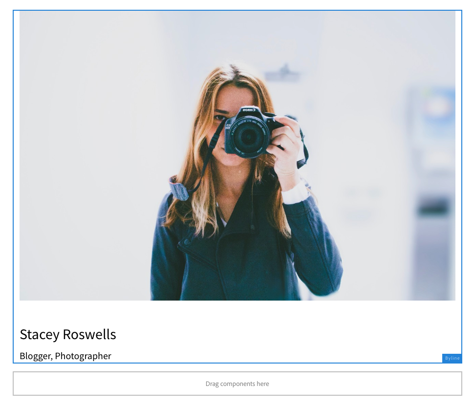 

### Reviewing the Sling Model registration {#reviewing-the-sling-model-registration}

The [AEM Web Console's Sling Models Status view](https://localhost:4502/system/console/status-slingmodels) displays all the registered Sling Models in AEM. The Byline Sling Model can be validated as being installed and recognized by reviewing this list.

If the BylineImpl was not displayed in this list, then there was is likely an issue with the Sling Model's annotations or with the SlingModelsScanner Module configuration in the core pom.xml.

 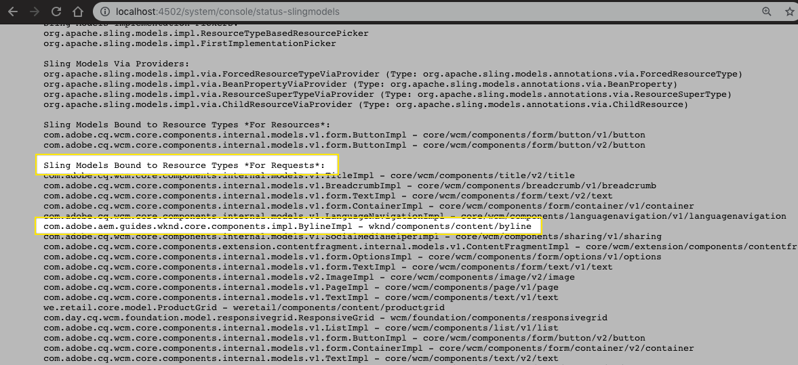

https://localhost:4502/system/console/status-slingmodels

## Byline styles {#byline-styles}

The Byline component needs to be styled to align with the creative design for the Byline component. This will be achieved by using LESS, which AEM provides support for via its Client Libraries, to generate the necessary CSS to provide the correct default style for the Byline component.

After styling, the Byline component should adopt the follow aesthetic.


Byline component design as defined by the WKND creative team

Add default styles for the Byline component. In the `ui.apps` project under `/apps/wknd/clientlibs/clientlib-site/components`.

1. Create a new folder named `byline`.
1. Create a new file beneath the byline folder named `byline.less.`
1. Create a new folder beneath the byline folder named `styles`.
1. Create a new file beneath byline/styles folder named `default.less`.
1. Start by populating **byline.less** to include the default style:

   ```css
   /* WKND Byline styles */
   
   @import (once) "styles/default.less";
   ```

1. Step text

   We'll start by creating a "skeleton" from BEM classes applied to the elements in the `byline.html`. Only the BEM classes should be styled, and CSS selector rule depth should be shallow to avoid rule-weight conflicts.

```css
.cmp-byline {
    .cmp-byline__image {
        // Align to the left of Name and Occupations

        .cmp-image__image {
            // This is the BEM class applied by the embedded Core Image component to the actual img tag
            // Create a 60px x 60px, circular image
        }
    }

    .cmp-byline__name {
        // Default text color
        // Right of image
    }

    .cmp-byline__occupations {
        // Color grey
        // All uppercase
        // Align right of image
    }
}
```

Starting from this skeletal framework of the CSS class we are "allowed" to target makes writing clean CSS more straightforward, and reduces the temptation to style   non- BEM  CSS classes or bare elements.

Let's drop in the style implementations, and re-use the previously defined LESS variables from `/apps/wknd/clientlibs/clientlib-site/site/less/variables.less`.

```css
/* WKND Byline - default.less*/
 
.cmp-byline {
    @imageSize: 60px;

    .cmp-byline__image {
  float: left;
  
  /* This class targets a Core Component Image CSS class */
     .cmp-image__image {
   width: @imageSize;
   height: @imageSize;
   border-radius: @imageSize / 2;
   object-fit: cover;
  }
    }

    .cmp-byline__name {
     margin-left: @imageSize + 20px;
     margin-bottom: .25rem;
    }

    .cmp-byline__occupations {
     margin-left: @imageSize + 20px;
  color: @gray-light;
  font-size: @font-size-small;
  text-transform: uppercase;
  font-weight: 600;
    }
}
```

### Include the Byline styles in the WKND Sites client library {#include-the-byline-styles-in-the-wknd-sites-client-library}

Update `/apps/wknd/clientlibs/clientlib-site/main.less` to include `byline.less`.

Add an import statement to include `  byline   .less` beneath the other imports of component styles.

```css
/* WKND main.less */
...
/* Import WKND Components styles */
...
@import "components/byline/byline.less";
```

### Deploy the code {#deploy-the-code-2}

Deploy the code to AEM, clear the browser cache to ensure stale CSS is not being served, and refresh the page with the Byline component to get the full styled.

## Putting It Together {#putting-it-together}

Below is what the fully authored and styled Byline component should look like on the AEM page.

 

### Part 6 review {#part-review}

Watch the video below for a quick walk-through of what was built in this part of the WKND tutorial.

>[!VIDEO](https://video.tv.adobe.com/v/25089/?quality=12)

## Help! {#help}

If you get stuck or have additional questions make sure to check out the [Experience League forums for AEM](https://forums.adobe.com/community/experience-cloud/marketing-cloud/experience-manager) or view existing [GitHub issues](https://github.com/Adobe-Marketing-Cloud/aem-guides-wknd/issues).

Didn't find what you were looking for? Think you found an error? Please file a [GitHub issue for the WKND project](https://github.com/Adobe-Marketing-Cloud/aem-guides-wknd/issues).

## Next steps {#next-steps}

Next part in the tutorial:

* [Getting Started with AEM Sites Chapter 7 - Teaser and Carousel Components](https://helpx.adobe.com/experience-manager/kt/sites/using/getting-started-wknd-tutorial-develop/part7.html)
* View the finished code on [GitHub](https://github.com/Adobe-Marketing-Cloud/aem-guides-wknd) or download the finished package for this part of the tutorial:

## Troubleshooting {#troubleshooting}

Note if you do not see src/main/java source folder in Eclipse you can add the folders by right clicking src and adding folders for main and java. After adding the folders you should see the src/main/java package appear.

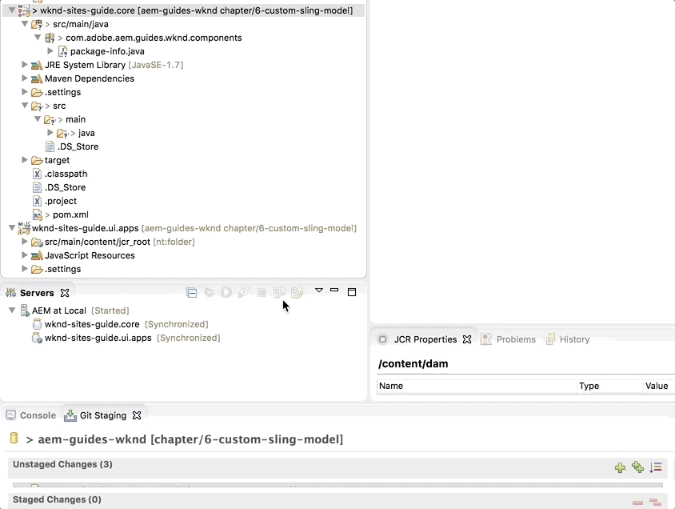

Note if you have unresolved package imports for some of the new dependencies added to the core project, try updating the wknd-sites-guide.core maven project. You can do this by right-clicking wknd-sites-guide.core &gt; Maven &gt; Update Project.


