# Getting Started with AEM Sites Chapter 7 - Teaser and Carousel Components{#getting-started-with-aem-sites-chapter-teaser-and-carousel-components}

Covers the implementation of the Teaser and Carousel components to populate a dynamic and exciting Home page.

## Prerequisites {#prerequisites}

This is Chapter 7 of a multi-part tutorial. [Chapter 6 can be found here](https://helpx.adobe.com/experience-manager/kt/sites/using/getting-started-wknd-tutorial-develop/part6.html) and an [overview can be found here](https://helpx.adobe.com/experience-manager/kt/sites/using/getting-started-wknd-tutorial-develop.html).

You can check out the finished code on [**GitHub**](https://github.com/Adobe-Marketing-Cloud/aem-guides-wknd) or you can download the solution package:

## Teaser and Carousel Components {#teaser-carousel-overview}

>[!VIDEO](https://video.tv.adobe.com/v/25470/?quality=9)

At this point in the WKND tutorial, considerable time has been spent implementing a well-structured Article page template. We can create great articles. However, the Homepage has been neglected. In this part, we will extend two components of AEM Core Components:

* ** [Teaser Component](https://helpx.adobe.com/experience-manager/core-components/using/teaser.html) **- Includes an image, title, description and call to action button(s)
* [**Carousel Component**](https://helpx.adobe.com/experience-manager/core-components/using/carousel.html) - A modified container component, that allows authors to use existing components to populate multiple "slides" of a carousel.

Below are some examples of the finished Teaser and Carousel components, after the various styles and configurations have been applied to the WKND project:


Teaser component with a Card style applied

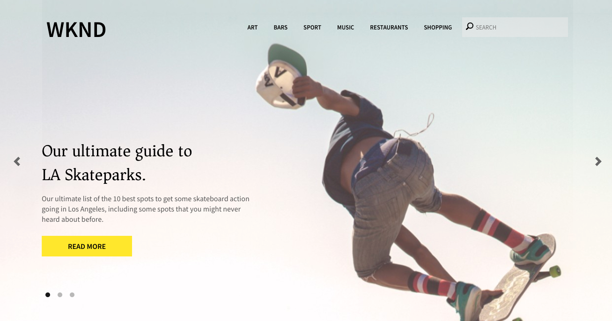

Carousel component with a Hero-style applied. The Carousel component actually embeds a Teaser component that in turn has it's own style.

## Add Teaser Component {#add-teaser-component}

The Teaser component has already been proxied in to the WKND project as part of the Maven archetype creation. We will update the template policy to allow the Teaser component to be added to the Homepage.

1. In the `  ui .apps` module beneath `/apps/wknd/components`you can find the proxied `teaser` component. Inspect the `sling:resourceSuperType` property to see that it points to `core/  wcm /components/teaser/v1/teaser`. Also, notice the `imageDelegate` property. This points to `wknd/components/content/image`. The **Teaser** component will use the **Image** delegate to populate the image as part of the **Teaser**.   
   ``

   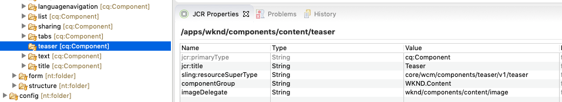

1. Navigate to **AEM &gt; Tools &gt; General &gt; Templates &gt; WKND Site &gt; Landing Page Template** and edit the template.
1. While in **Structure** mode, select the main **Layout Container** and tap the **policy **icon to edit its Policy.

   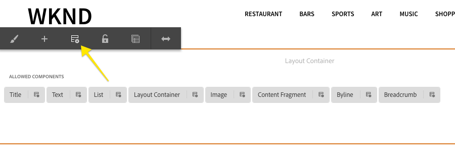

1. Update the **WKND Content** policy. In the **WKND.Content** component group, check the **Teaser** component to allow it to be added to this layout container, and tap the Check in the top right to save the change.

   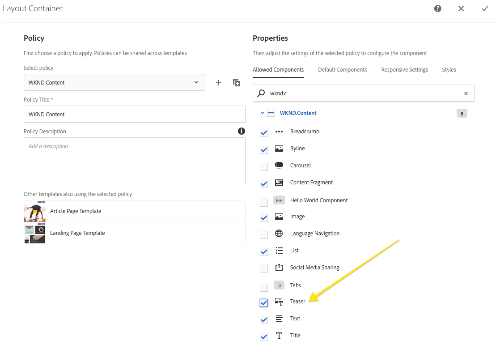

1. Update the policy of the Layout Container component, within the main Layout Container:

   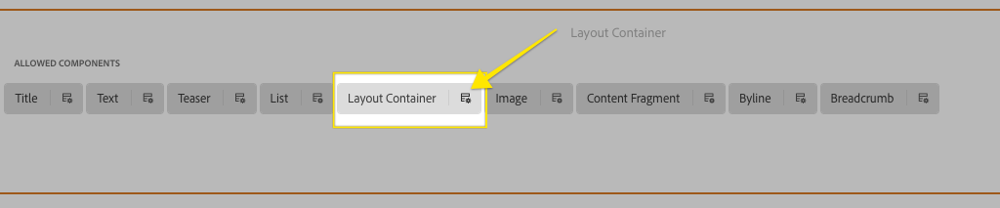

   Set the policy to the **WKND Content **policy to apply to the Layout Container. This will allow us to use the Fixed Width style when creating new Layout Containers on the Landing Page Template. 

   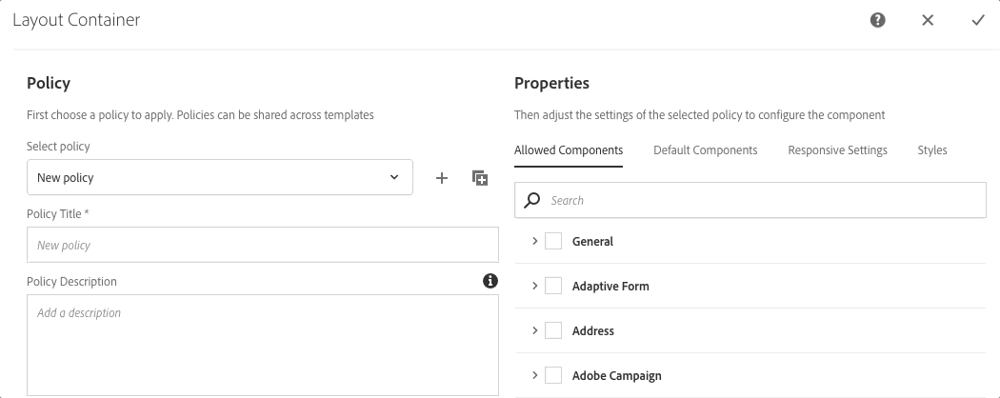

### Author Teaser {#author-teaser}

Next, we will author a few Teaser components to have some sample content to develop against.

1. Author a few articles using the Article page template. The Teaser component will dynamically pull the Title and Description for linked pages as part of the Teaser content. This ensures consistency throughout the site.

   You can also install the below package using ** [CRX Package Manager](http://localhost:4502/crx/packmgr/index.jsp)**, which includes a several sample articles already created.

   [Get File](assets/chapter-7-sample-articles.zip)

   >[!NOTE]
   >
   >The Style System assigns a **cq:styleId,** a number based on a timestamp, to represent each style. The cq:styleId is then used on the content node to reference the Style from the template. Due to this, most likely installing the above content package will result in un-styled components. This can be easyily rectified by re-enabling the styles in the author environment. However it is something to keep in mind when moving content packages between environments that potentially have different policies.

1. Navigate to the home page at **AEM &gt; Sites &gt; WKND Site &gt; Home **and edit to open.
1. Add another Layout Container to the page. Apply the **Fixed Width** style to the new Layout Container. 

   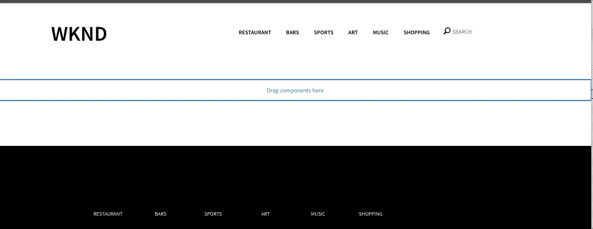

1. Add a new Teaser Component to the page and author some sample content.

   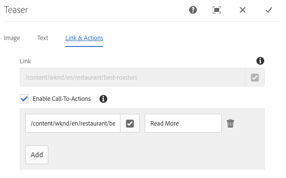

   Point to an Article page and enable Call-To-Actions.

   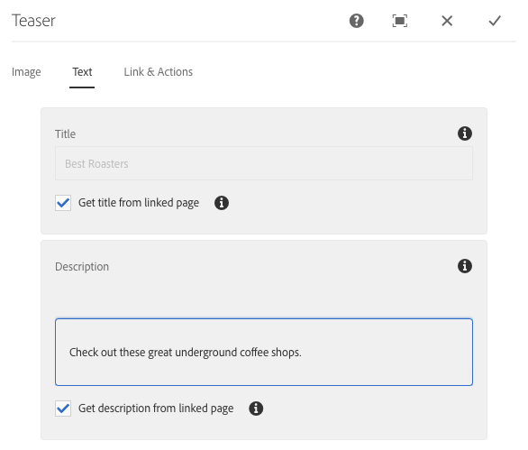

   The text for the Title and Description are dynamically pulled from the referenced page in the Link & Actions.

   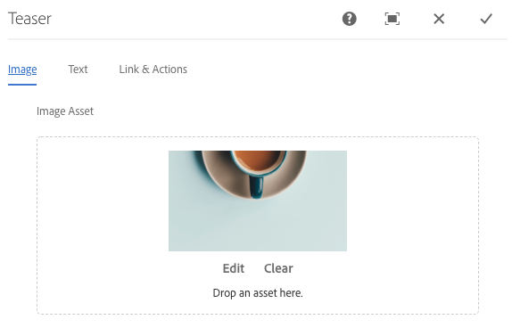

   Choose an image to populate the Teaser.

1. Add two more Teaser components and populate. Use the Layout mode to re-size the Teasers to align horizontally.

   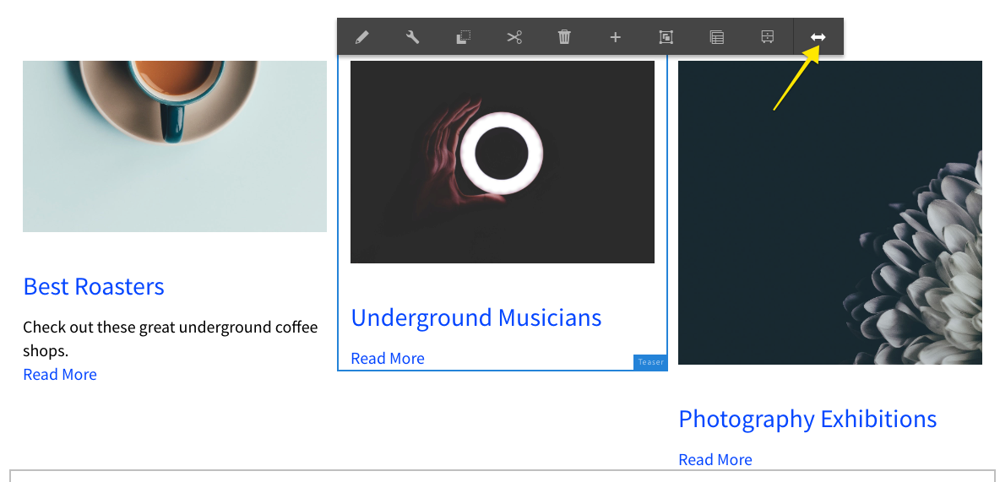

   Three Teaser components, re-sized to allow each Teaser components to align horizontally.

Next, we will implement a new style for the Teaser component.

## Implement Teaser Style - Card {#teaser-styles-card}

The first style we will implement for the Teaser component is a Card style, intended to be used on the Home page. The Call To Action button will be highlighted in yellow on hover and the image will be styled to cover the contents of the component. The description, if set, will be hidden with this style.

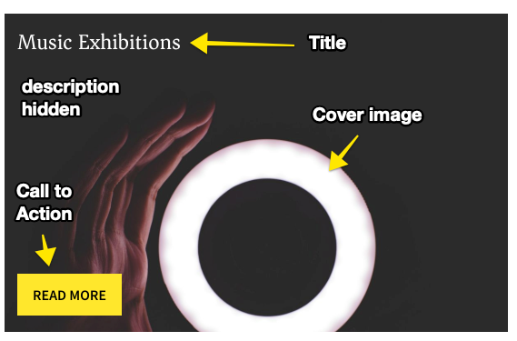

Byline component design as defined by the WKND creative team

### Teaser BEM notation {#bem-notation}

```
BLOCK cmp-teaser
    ELEMENT cmp-teaser__image
    ELEMENT cmp-teaser__title
    ELEMENT cmp-teaser__title-link
    ELEMENT cmp-teaser__description
    ELEMENT cmp-teaser__action-container
    ELEMENT cmp-teaser__action-link
```

The above is the BEM notation of the Teaser component. We will target these classes as we style the component.

In the `ui.apps` project under `/apps/wknd/clientlibs/clientlib-site/components`.

1. In the ui.apps project under **/apps/wknd/clientlibs/clientlib-site/components**:

    1. Create a new folder named **teaser**
    1. Beneath the **teaser** folder, create a new file named **teaser.less**
    
    1. Beneath the **teaser** folder, create a new folder named **styles**
    
    1. Beneath the **styles** folder, create a new file named **default.less**
    
    1. Beneath the **styles** folder, create a new file named **card.less**

   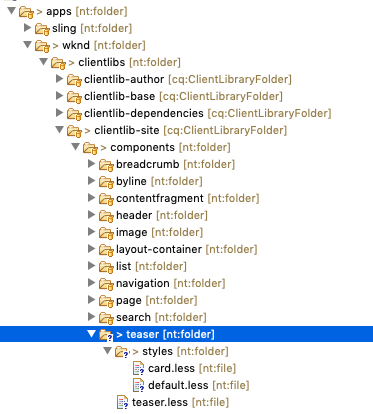

1. Populate **teaser.less **with the following:

   ```css
   /* WKND Teaser Styles */
   
   @teaser-light-color: #fff;
   @teaser-dark-color: @text-color;
    
   @import (once) "styles/default.less";
   @import (once) "styles/card.less";
   
   ```

   This will include the **default.less** and **card.less** styles. It also creates two teaser-specific colors that will be used throughout the teaser styles.

1. Populate **default.less** with the following default styles of the teaser:

   ```css
   .cmp-teaser {
   
       .cmp-teaser__title {
           font-family: @font-family-serif;
           margin-top: 0;
       }
       
       .cmp-teaser__title-link {
        color: @teaser-dark-color;
       }
       
       .cmp-teaser__description {
        color: @gray;
        font-size: @font-size-small;
        margin: 1em 0;
        
       }
       
       .cmp-teaser__action-link {
        background-color: @brand-primary;
        text-transform: uppercase;
        font-size: @font-size-small;
        padding: 0.75em 3.5em;
        margin-top: .5em;
        font-weight: @font-weight-bold;
        color: @teaser-dark-color;
    }
   }
   ```

1. The card style will be defined in card.less. The class that will be used to define the card style will be named **cmp-teaser--card**. To create a uniform look, we will set the a fixed height of 350px for the teaser when the card style is applied. We will also make use of [CSS transitions](https://www.w3schools.com/css/css3_transitions.asp) to add some subtle animation when the user hovers over the card.

   Populate **card.less** with the following styles:

   ```css
   /* WKND teaser - card.less*/
     
   @teaser-height: 350px;
   @teaser-img-height:  @teaser-height;
   
   .cmp-teaser--card {
   
       .cmp-teaser {
           position: relative;
           height:  @teaser-height;
           max-height:  @teaser-height;
           overflow: hidden;
           background-color: #ededed;
           margin-bottom: @gutter-padding;
   
           @media (max-width: @screen-small) {
               width:  @teaser-height;
               margin-left: auto !important;
               margin-right: auto !important;
           } 
           
           .cmp-teaser__image {
               width: 100%;
               overflow: hidden;
               padding-top: 0px;
   
               .cmp-image__image {
                   margin-top: 0px;
                   object-fit: cover;
                   object-position: top;
                   height: @teaser-img-height;
                   width: 100%;
                   -webkit-transition: all .2s;
                   -moz-transition: all .2s; 
                   -o-transition: all .2s;
                   transition: all .25s;
               }
           }
   
           .cmp-teaser__title {
               font-family: @font-family-serif;
               width: 100%;
               text-align: left;
               font-size: @font-size-h3;
               margin-top: 0;
               position: absolute;
               top: @gutter-padding;
               padding-left: @gutter-padding;
           }
   
           .cmp-teaser__title-link {
               color: @teaser-light-color;
           }
   
           .cmp-teaser__description {
               display: none;
           }
   
           .cmp-teaser__action-container {
               position: absolute;
               bottom: @gutter-padding * 2;
               left: @gutter-padding;
           }
   
           .cmp-teaser__action-link {
               border: 1px solid @teaser-light-color;
               color: @teaser-light-color;
               background-color: transparent;
               -webkit-transition: all .25s ease-out;
               -moz-transition: all .25s ease-out;
               -o-transition: all .25s ease-out;
               transition: all .25s ease-out;
           }
   
           &:hover {
               .cmp-teaser__action-link {
                   color: @teaser-dark-color;
                   background-color: @brand-primary;
                   border-color: @brand-primary;
                   
               }
   
               .cmp-image__image {
                   -moz-transform: scale(1.05);
                   -webkit-transform: scale(1.05);
                   transform: scale(1.05);
               }
           }
       }
   }
   ```

1. Update `/apps/wknd/clientlibs/clientlib-site/main.less` to include `teaser.less`.

   Add an import statement to include `  teaser   .less` beneath the other imports of component styles.

   ```css
   /* main.less */
   
   ...
   
   /* Component Styles */
   @import "components/breadcrumb/breadcrumb.less";
   @import "components/byline/byline.less";
   @import "components/contentfragment/contentfragment.less";
   @import "components/header/header.less";
   @import "components/image/image.less";
   @import "components/layout-container/layout-container.less";
   @import "components/list/list.less";
   @import "components/navigation/navigation.less";
   @import "components/search/search.less";
   @import "components/text/text.less";
   /* import teaser.less */
   @import "components/teaser/teaser.less";
   @import "components/title/title.less";
   ```

1. Deploy the code to AEM, clear the browser cache to ensure stale CSS is not being served, and refresh the page with the Teaser component(s) to get the full styled.

### Apply Teaser Style - Card {#apply-teaser-style}

1. In AEM, navigate to the Landing Page Template:
1. In structure mode, click the Teaser's policy icon to configure the policy.

   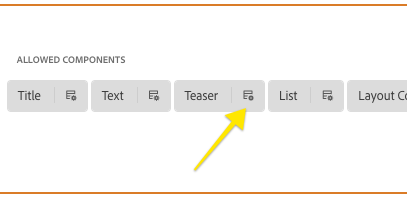

1. Create a new policy named **WKND Teaser**

    1. Beneath the Style Tab create a new style group
    1. Add a style named **Card** with a value of **cmp-teaser--card**

   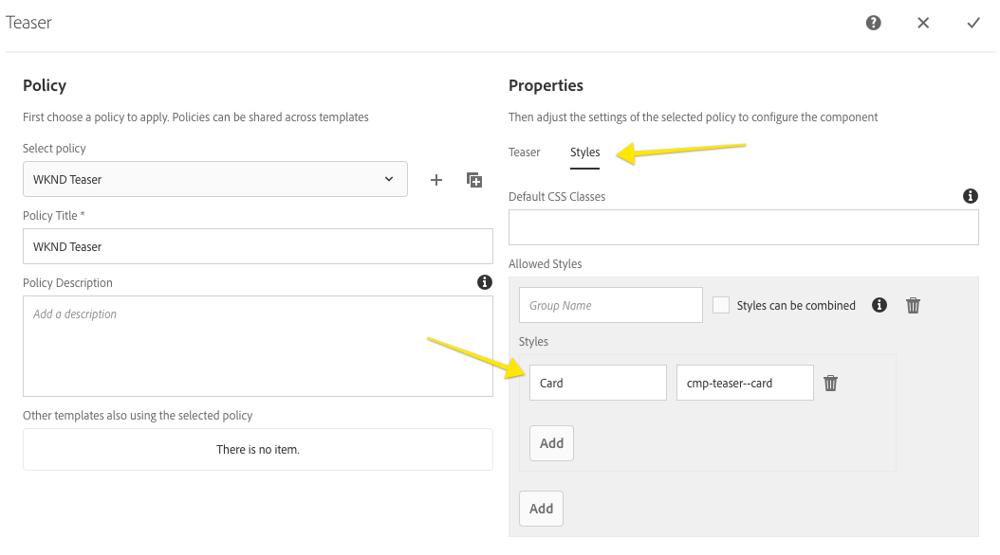

   Add a Card style to the Teaser's policy

1. Navigate to the Home page, where the teaser components were authored. The Default style defined in clientlib-site should now be visible.

   

   Teaser with default style

1. Apply the Card style to the Teaser components. The components should now all have a uniform height.

   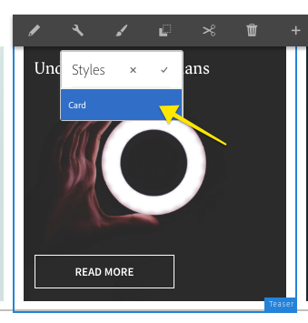

   Teaser with card style

1. Switch into **Preview** mode and view the hover CSS transistion effects.

## Add Carousel Component {#add-carousel}

Like the Teaser, the Carousel component has already been proxied in to the WKND project as part of the Maven archetype creation. We will update the template policy to allow the Carousel component to be added to the Homepage.

1. In the `  ui .apps` module beneath `/apps/wknd/components`you can find the proxied `carousel` component. Inspect the `sling:resourceSuperType` property to see that it points to `core/  wcm /components/carousel/v1/carousel`. Notice the `  cq :editConfig` node. The ` [  cq :editConfig](https://helpx.adobe.com/experience-manager/6-4/sites/developing/using/components-basics.html#EditBehavior)`allows developers to  specificy  advanced edit behavior when a component is authored. In this case, following an edit, a full page refresh is triggered. This is a common design pattern when working with components that rely heavily on javascript.   
   ``

   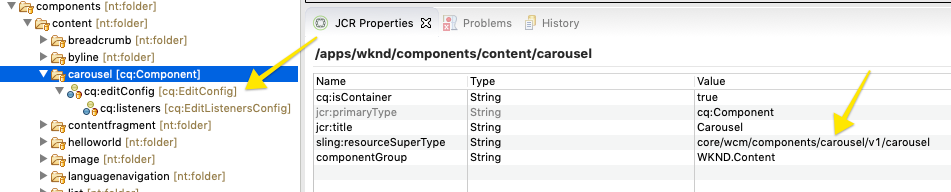

1. Navigate to **AEM &gt; Tools &gt; General &gt; Templates &gt; WKND Site &gt; Landing Page Template** and edit the template.
1. While in **Structure** mode, select the main **Layout Container** and tap the **policy **icon to edit its Policy.

   

1. Update the **WKND Content** policy. In the **WKND.Content** component group, check the **Carousel** component to allow it to be added to this layout container, and tap the Check in the top right to save the change.

   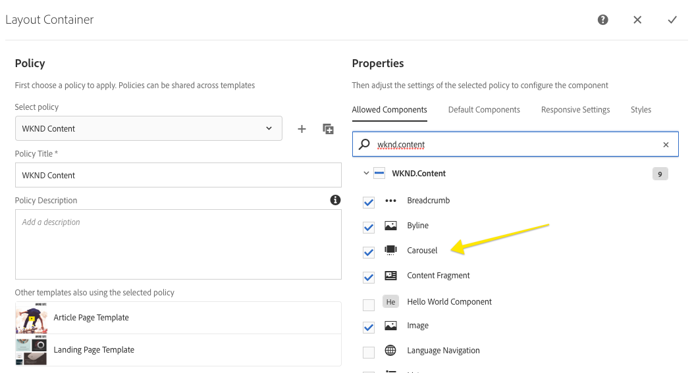

1. Update the Carousel's policy by clicking its policy icon.

   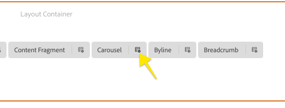

1. Create a new policy named **WKND Carousel**.

   Unlike other components, the Carousel is considered a container component, in that it embeds sub-components, similar to the Layout Container. Update the Allowed Components to include just the **WKND.Content** &gt; **Teaser** component. 

   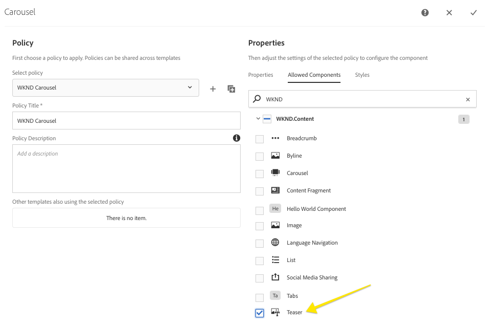

### Author Carousel {#author-carousel}

Next we will author an un-styled Carousel on the Home page. This Carousel will act as a hero carousel, and contain several teaser components as the slides.

1. Navigate to the home page at **AEM &gt; Sites &gt; WKND Site &gt; Home **and edit to open.
1. Add a Carousel component to the page, above the fixed Layout Container, directly beneath the Header. We want the Carousel Component to span the full width of the page.

   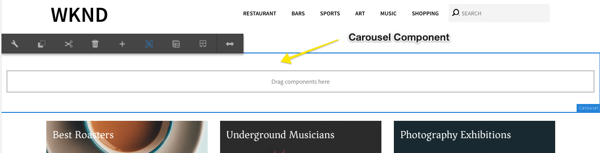

1. Add a new Teaser Component to the Carousel Component. Note that the only component available to be added to the Carousel is the Teaser component. This is based on the policy configured in the previous section.
1. Edit the Teaser component by clicking the wrench icon. Be sure to edit the Teaser component and not the outer Carousel.

   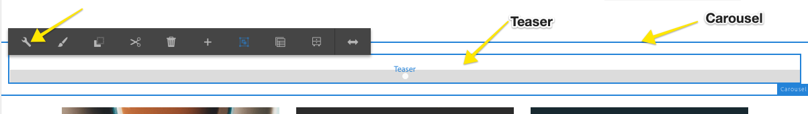

1. Author the Teaser Component with a skateboarding hero image. Leave the **Title** and **Description** fields checked to pull from the Page's title and description. Link the Teaser to point to the **Ultimate guide to LA Skateparks** article and enable the Call-To-Actions. Update the CTA label to be **Read More**.

   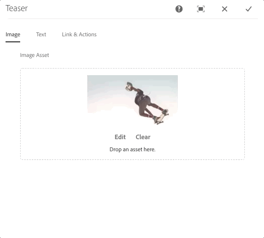

1. Edit the Carousel component to add two more additional Teasers beneath the LA Skatepark teaser.

   

1. After more than one item has been added to the Carousel, a new icon will appear in the Carousel's edit menu. Click the select panel icon to navigate to other panels within the Carousel.

   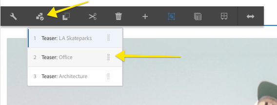

   You can now edit the other Teaser components. Author the other Teaser components so that you end up with three Teasers inside the carousel that look something like the following:

   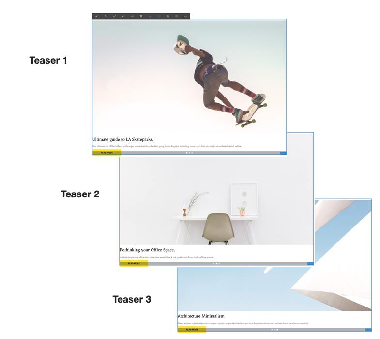

   In the next sections, we will implement an additional style, **Slide**, to the Teaser component that is optimized for the Carousel. We will also implement a style, **Hero**, for the Carousel.

## Implement Teaser Style - Slide {#teaser-slide}

Next, a **Slide** style will be implemented for the Teaser component. This style is intended to be used in conjunction with a full width Carousel component. Based on our mockups, we want the Title, Description and CTA button of the Teaser to grouped together and overlay the Image. Unfortunately the out of the box markup for the Teaser Core Component does not wrap the Title, Description, and CTA button(s). We could probably accomplish this with CSS alone, however we will take this opportunity to extend the markup of the Teaser component.

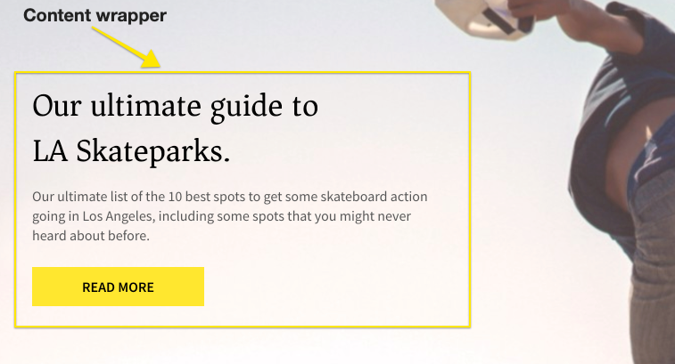

1. In the ui.apps project under **/apps/wknd/components/content/teaser**

    1. Create a new file named **teaser.html**
    1. Populate **teaser.html **with the following:

   ```xml
   <!--/* WKND Teaser Component
          Overrides /apps/core/wcm/components/teaser/v1/teaser/teaser.html
       */-->
   
     <div data-sly-use.teaser="com.adobe.cq.wcm.core.components.models.Teaser"
     data-sly-use.templates="core/wcm/components/commons/v1/templates.html"
     data-sly-use.imageTemplate="image.html"
     data-sly-use.titleTemplate="title.html"
     data-sly-use.descriptionTemplate="description.html"
     data-sly-use.actionsTemplate="actions.html"
     data-sly-test.hasContent="${teaser.imageResource || teaser.title || teaser.description || teaser.actions.size > 0}"
     class="cmp-teaser${!wcmmode.disabled && teaser.imageResource ? ' cq-dd-image' : ''}">
    <sly data-sly-call="${imageTemplate.image @ teaser=teaser}"></sly>
    
   <!--/* Add content wrapper div to surround text elements */-->
    <div class="cmp-teaser__content-wrapper">
       <sly data-sly-call="${titleTemplate.title @ teaser=teaser}"></sly>
       <sly data-sly-call="${descriptionTemplate.description @ teaser=teaser}"></sly>
       <sly data-sly-call="${actionsTemplate.actions @ teaser=teaser}"></sly>
    </div>
   
   </div>
   <sly data-sly-call="${templates.placeholder @ isEmpty=!hasContent, classAppend='cmp-teaser'}"></sly>
    
   ```

   By adding the above** teaser.html** file, we are effectively overriding the HTL script from the **v1 Teaser **component located at `/apps/core/wcm/components/teaser/v1/teaser/teaser.html`. This is an effective way to override the markup of the proxied component. As a best practice, you should only override the files that you intend to extend.

   In this case, we have added a wrapper div with a class name of `  cmp -teaser__content-wrapper.` This div surrounds the Title, Description, and CTA markup.

   >[!CAUTION]
   >
   >By including the **teaser.html **file beneath `/apps/wknd/components/content/teaser`we are extending the markup for **ALL** teaser components used on the WKND site, not just the Teasers meant to be used in the Carousel. This is an important consideration when making HTL changes to a component.

1. In the ui.apps project beneath `/apps/wknd/clientlibs/clientlib-site/components/teaser/styles`

    1. Create a new file named `slide.less`
    1. Populate `slide.less` with the following:

   ```css
   /* WKND teaser - default.less*/

   @slide-height: 700px;
   @slide-mobile-height: 400px;
   @slide-content-width: 450px;
   
   .cmp-teaser--slide {
   
   .cmp-teaser {
       min-height: @slide-height;
       position: relative;
       overflow: hidden;
   
       @media (max-width: @screen-small) {
           min-height: @slide-mobile-height;
       }
   
           .cmp-image__image {
               height: @slide-height;
               object-fit: cover;
               object-position: top;
               width: 100%;
               padding: 0;
               margin:0;
   
               @media (max-width: @screen-small) { 
                   opacity: .75;
               }
           }
   
           .cmp-teaser__content-wrapper {
               .container-content();
               left: 0;
               right: 0;
               position: absolute;
               left: @gutter-padding * 2;
               bottom: 8em;

               @media (max-width: @screen-medium) {
                   top: 8em;
               }
   
               @media (max-width: @screen-small) {
                   top: 8em;
                   left:0;
                   text-align: center;
               }
   
           }
   
           .cmp-teaser__title {
               font-family: @font-family-serif;
               width: 100%;
               color: @dark-color;
               bottom: 20px;
               font-size: @font-size-h1;
               max-width: @slide-content-width - 100;
               @media (max-width: @screen-small) {
                   max-width: 100%;
               }
           }
   
           .cmp-teaser__description {
               color: @gray;
               font-size: @font-size-small;
               margin-bottom: 2em;
               max-width: @slide-content-width;
   
               @media (max-width: @screen-small) {
                   max-width: 100%;
               }
           }
   
           .cmp-teaser__action-link {
               background-color: @brand-primary;
               text-transform: uppercase;
               font-size: @font-size-small;
               padding: 0.75em 3.5em;
               margin-top: .5em;
               font-weight: @font-weight-bold;
           }
       }
   }
   
   ```

1. Update `/apps/wknd/clientlibs/clientlib-site/components/teaser/teaser.less` to include **slide.less.**

   ```css
   /* WKND Teaser Styles */
   
   @teaser-light-color: #fff;
   @teaser-dark-color: @text-color;
    
   @import (once) "styles/default.less";
   @import (once) "styles/card.less";
   @import (once) "styles/slide.less";
   ```

1. Deploy the code to AEM, clear the browser cache to ensure stale CSS is not being served, and refresh the page with the Teaser component(s) to get the full styled.

### Apply Teaser Style - Slide {#apply-teaser-slide}

1. In AEM, navigate to the Landing Page Template:
1. In structure mode, click the Teaser's policy icon to configure the policy.

   

1. Update the **WKND Teaser **policy

    1. Beneath the Style Tab add a style named **Slide** with a value of **cmp-teaser--slide**

   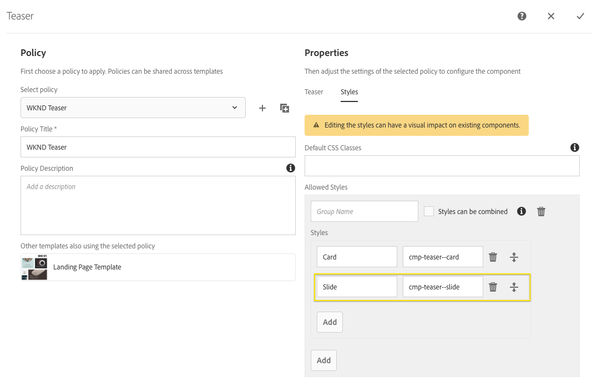

   Add a Card style to the Teaser's policy

1. Navigate to the Home page, where the Carousle and Teaser components were authored. Update each of the Teasers within the Carousel and apply the **Slide** style.

   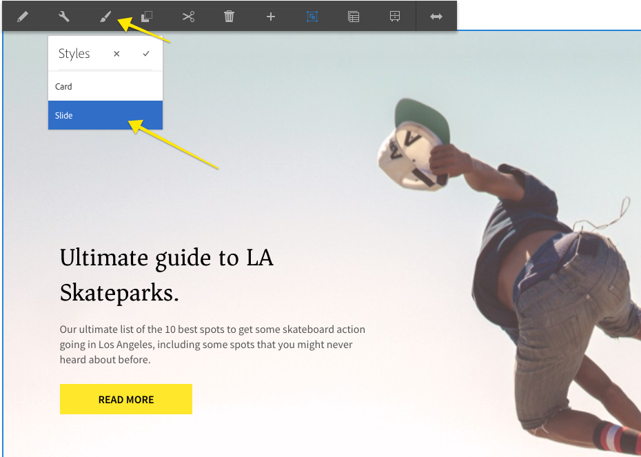

   Teaser within the Carousel with the Slide style applied.

## Implement Carousel Styles {#carousel-hero-style}

At this point the contents of the Carousel, the Teaser with Slide style applied, looks good. Currently, the carousel has a hard transition between panels. We will add [Animate.css](https://daneden.github.io/animate.css/), a 3rd party CSS library, to our project and include some styles to create a nice fade-in transition to the next slides. We will also create a new **Hero** style that can be applied to the Carousel to match the mockups of the homepage carousel.

1. In the ** ui .apps** project beneath **/apps/wknd/  clientlibs **:

    1. Create a new folder named **vendor**
    1. Beneath the **vendor** folder, create a new node named ** animatecss ** with a type ** cq   :ClientLibraryFolder **
    
    1. Add a `String[]`property to   `animatecss`   folder named categories with a value of `[vendor.animatess]`

   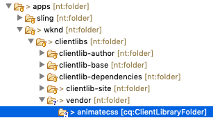 

   ```xml
   <?xml version="1.0" encoding="UTF-8"?>
   <jcr:root 
       xmlns:sling="https://sling.apache.org/jcr/sling/1.0"
       xmlns:jcr="https://www.jcp.org/jcr/1.0"
       jcr:primaryType="cq:ClientLibraryFolder"
       categories="[vendor.animatecss]"/>
   ```

1. Beneath **/apps/wknd/clientlibs/vendor/animatecss** client library folder:

    1. Create a new file named **css.txt**
    1. Create a new folder named **css**
    1. Beneath the **css** folder create a new file named **animate.css**

   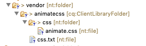

1. Populate **css.txt** with the following to include the **animate.css** file:

   ```
   #base=css
   
   animate.css
   ```

1. Download **Animate.css** from [https://daneden.github.io/animate.css/](https://daneden.github.io/animate.css/) and populate **animate.css** file in the client library.  

1. Update `embed` properties of `/apps/wknd/  clientlibs /  clientlib -base`client library to embed the vendor `  animatecss `client library.

   The XML representation of **clientlib-base** is below. Remember the order in which clientlibrary categories are embedded effects the order in which CSS is rendered.

   ```css
   <?xml version="1.0" encoding="UTF-8"?>
   <jcr:root xmlns:cq="https://www.day.com/jcr/cq/1.0" xmlns:jcr="https://www.jcp.org/jcr/1.0"
       jcr:primaryType="cq:ClientLibraryFolder"
       allowProxy="{Boolean}true"
       categories="[wknd.base]"
       embed="[wknd.webfonts,vendor.animatecss,core.wcm.components.tabs.v1,core.wcm.components.carousel.v1,core.wcm.components.image.v2,core.wcm.components.breadcrumb.v2,core.wcm.components.search.v1,core.wcm.components.form.text.v2,wknd.site]"/>
   ```

1. Update `/apps/wknd/clientlibs/clientlib-site/less/mixins.less` to include re-usable mixins that leverage the **Animate.css** animations.

   ```css
   /* mixins.less */
   
   ...
   
   .animated() {
     -webkit-animation-duration: 1s;
     animation-duration: 1s;
     -webkit-animation-fill-mode: both;
     animation-fill-mode: both;
   }
   
   .fadeIn() {
     -webkit-animation-name: fadeIn;
     animation-name: fadeIn;
   }
   ```

### Carousel BEM Notation {#carousel-bem}

```
BLOCK cmp-carousel
    ELEMENT cmp-carousel__content
    ELEMENT cmp-carousel__item
    ELEMENT cmp-carousel__action
        MOD cmp-carousel__action--previous
        MOD cmp-carousel__action--next
    ELEMENT cmp-carousel__action-icon
    ELEMENT cmp-carousel__action-text
    ELEMENT cmp-carousel__indicators
    ELEMENT cmp-carousel__indicator
```

The above is the BEM notation of the Carousel component. We will target these classes as we style the component.

In the `ui.apps` project under `/apps/wknd/clientlibs/clientlib-site/components`.

1. In the ui.apps project under **/apps/wknd/clientlibs/clientlib-site/components**:

    1. Create a new folder named **carousel**
    1. Beneath the **carousel** folder, create a new file named **carousel.less**
    
    1. Beneath the **carousel** folder, create a new folder named **styles**
    
    1. Beneath the **styles** folder, create a new file named **default.less**
    
    1. Beneath the **styles** folder, create a new file named **hero.less**

   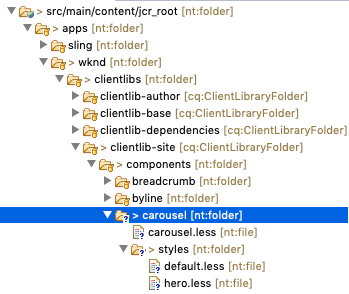

1. Populate **carousel.less **with the following:

   ```css
   /* WKND Carousel Styles */
   
   @import (once) "styles/default.less";
   @import (once) "styles/hero.less";
   
   ```

   This will include the **default.less** and **card.less** styles. It also creates two teaser-specific colors that will be used throughout the teaser styles.

1. Populate **default.less** with the following default styles of the carousel. This will include the `.animated()`and `.fadeIn()` mixins in order to make the carousel panels fade in when a transition occurs.

   ```css
   /* WKND Carousel - default.less */
   
   .cmp-carousel {
   
       .cmp-carousel__item {
           .animated();
           .fadeIn();
   
           display: none;
           &--active {
               display: block;
           }
       }
   
   }
   ```

1. The Hero style will be defined in **hero.less**. The class that will be used to define the card style will be named ** cmp -carousel--hero**. We will update the carousel indicators to be positioned closer to the Teaser content. The carousel actions, the left  and  right arrows, are also updated to be a darker color.

   Populate **hero.less** with the following LESS:

   ```css
   /* WKND Carousel - hero.less*/
    
   @cmp-carousel-indicator-size: 10px;
   @cmp-carousel-action-icon-size: 24px;
   
   .cmp-carousel--hero {
       padding:0;
   
       .cmp-carousel__action {
           width: 8%;
           cursor: pointer;
   
           @media (max-width: @screen-medium) {
               width: 5%;
           }
           @media (max-width: @screen-small) {
               width: @gutter-padding * 2;
           }
       }
   
       .cmp-carousel__action--previous {
           left: 0;
           .cmp-carousel__action-icon {
               background-image: url("data:image/svg+xml;charset=utf8,%3Csvg xmlns='https://www.w3.org/2000/svg' fill='%23666' viewBox='0 0 8 8'%3E%3Cpath d='M5.25 0l-4 4 4 4 1.5-1.5-2.5-2.5 2.5-2.5-1.5-1.5z'/%3E%3C/svg%3E");
   
           }
       }
       
       .cmp-carousel__action--next {
           right: 0;
       
           .cmp-carousel__action-icon {
               background-image: url("data:image/svg+xml;charset=utf8,%3Csvg xmlns='https://www.w3.org/2000/svg' fill='%23666' viewBox='0 0 8 8'%3E%3Cpath d='M2.75 0l-1.5 1.5 2.5 2.5-2.5 2.5 1.5 1.5 4-4-4-4z'/%3E%3C/svg%3E");
           }
       }
       
       .cmp-carousel__indicators {
           .container-content();
           padding: 0;
           bottom: 30px;
           padding-left: @gutter-padding * 2;
           display: flex;
           justify-content: left;
           list-style: none;
           background-color: transparent;
           height:50px;
   
           @media (max-width: @screen-medium) {
               justify-content: center;
           }
       }
       
       .cmp-carousel__indicator {
           position: relative;
           cursor: pointer;
           flex: 0 1 auto;
           width: @cmp-carousel-indicator-size;
           height: @cmp-carousel-indicator-size;
           margin: 6px 8px;
           border-radius: 50%;
       
           font-size: 0;
           text-indent: -3000px;
       
           background-color: rgba(116, 116, 116, 0.5);
       
           &--active {
               background-color: rgba(0, 0, 0, 0.9);
           }
       }
       
   }
   ```

1. Update `/apps/wknd/clientlibs/clientlib-site/main.less` to include `carousel.less`.

   Add an import statement to include `  carousel   .less` beneath the other imports of component styles.

   ```css
   /* main.less */
   
   ...
   
   /* Component Styles */
   @import "components/breadcrumb/breadcrumb.less";
   @import "components/byline/byline.less";
   /* import carousel styles */
   @import "components/carousel/carousel.less";
   @import "components/contentfragment/contentfragment.less";
   @import "components/header/header.less";
   @import "components/image/image.less";
   @import "components/layout-container/layout-container.less";
   @import "components/list/list.less";
   @import "components/navigation/navigation.less";
   @import "components/search/search.less";
   @import "components/text/text.less";
   @import "components/teaser/teaser.less";
   @import "components/title/title.less";
   ```

1. Deploy the code to AEM, clear the browser cache to ensure stale CSS is not being served.

### Apply Carousel Style - Hero {#carousel-hero-apply}

1. In AEM, navigate to the Landing Page Template:
1. In structure mode, click the Carousel's policy icon to configure the policy.

   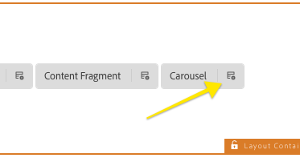

1. Update the **WKND Carousel **policy

    1. Beneath the Style Tab add a style named **Hero** with a value of **cmp-carousel--hero**

   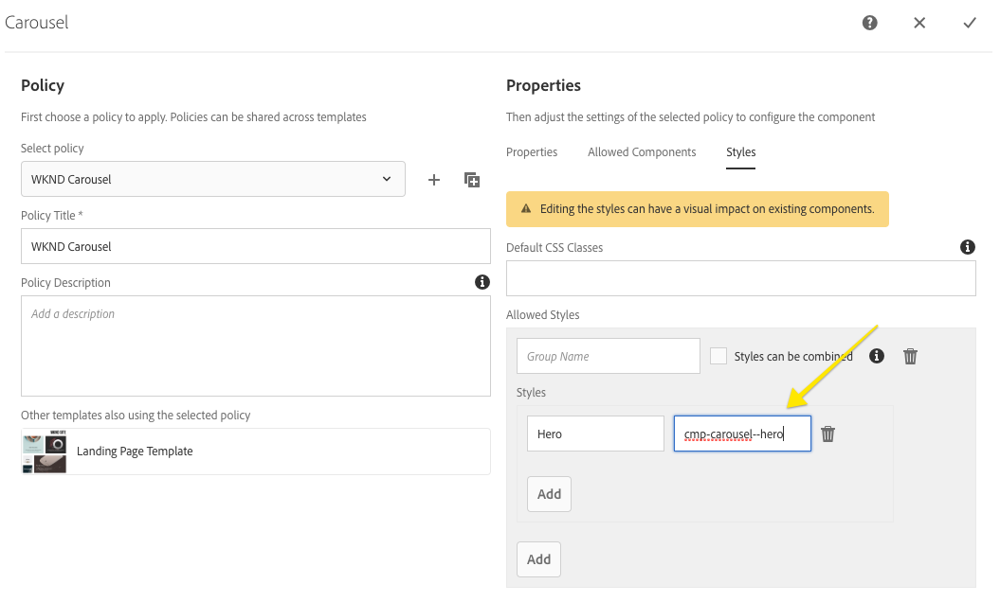

   Add a Hero style to the Carousel's policy

1. Navigate to the Home page, where the Carousel was authored. Apply the **Hero** style to the Carousel component.

   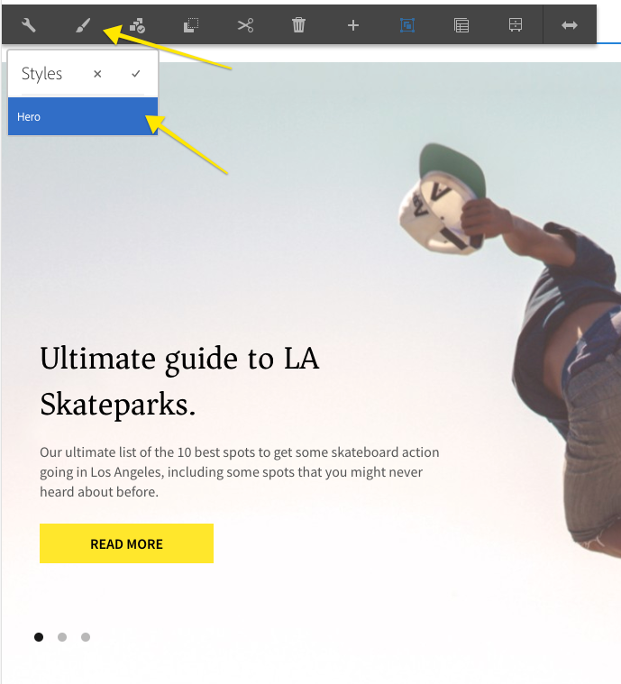

   Teaser within the Carousel with the Slide style applied.

   You should see a repositioning of the carousel indicators and an update to the styles of the previous and next buttons. You should also see a nice fade transition between slides.

   In the next section we will complete the Hero carousel by updating the page design so that the Header component overlays the carousel.

## Implement Home Page Style {#implement-home-page-style}

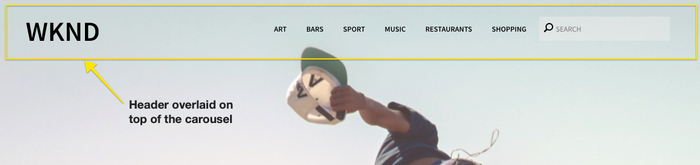

Header component overlaid on top of the Carousel

Based on the mockups, we would like the Hero Carousel to start at the top of the page and have the Header component overlaid on top of it. We only wish to have this behavior on the Home page, when a Carousel component is configured. Currently the HTML root DIV has padding to ensure that the sticky Header does not overlay the components. In this section we will add a new style that can be applied to the entire page, allowing authors to toggle a Homepage style to remove the padding.

1. In the **ui.apps** project under **/apps/wknd/clientlibs/clientlib-site/components/page/styles**:

    1. Create a new file named** homepage.less**

1. Populate **homepage.less **with the following:

   ```css
   /* WKND Page - homepage.less */
   
   body.wknd-page--home {
       .root {
           padding-top:0px;
           @media (max-width: @screen-medium) {
               padding-top:0px;     
           }
       }
   }
   ```

   This will remove the top padding on the **root** div. 

1. Update `/apps/wknd/clientlibs/clientlib-site/components/page/page.less` to include the **homepage.less** styles:

   ```css
   /* WKND Page styles */
   
   @import (once) "styles/default.less";
   @import (once) "styles/homepage.less";
   ```

1. Update `/apps/wknd/  clientlibs /  clientlib -author/less/header.less` to update the header style when the **Homepage** style is applied in the authoring environment.

   ```css
   /* clientlib-author /less/header.less */
   
   ...
   
   body.wknd-page--home {
       
       .wknd-header {
           position: fixed;
       }
   }
   ```

1. Deploy the code to AEM, clear the browser cache to ensure stale CSS is not being served.

### Apply Homepage Style {#apply-homepage-style}

1. In AEM, navigate to the Landing Page Template:
1. In structure mode, click the Page editor menu &gt; Page Policy

   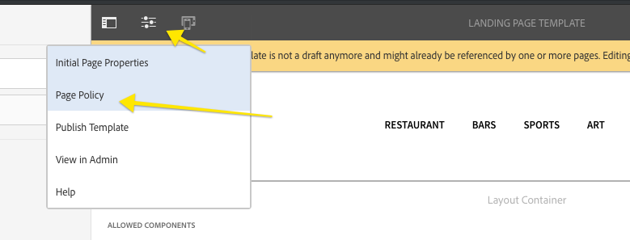

1. Create a new policy named **WKND Landing Page**

    1. Beneath the Style Tab add a style named **Homepage** with a value of **wknd-page--hero**

   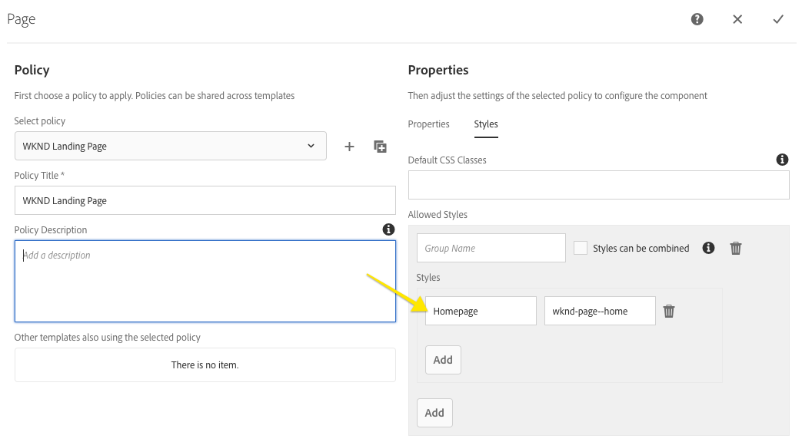

   Add a Hero style to the Carousel's policy

1. Navigate to the Home page, where the Carousel was authored. Apply the **Homepage** style to the Page.

   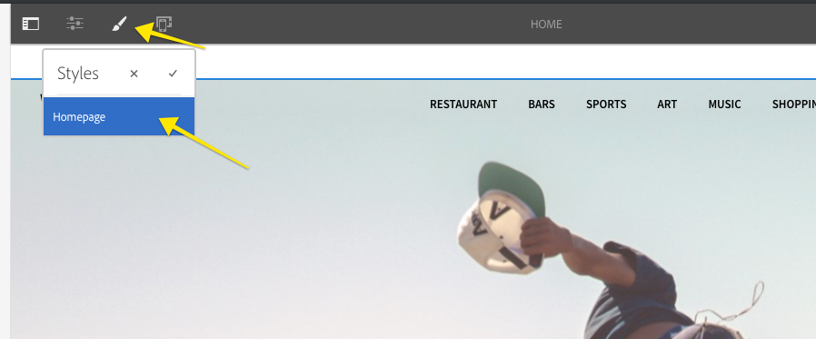

   Page with Homepage style applied.

   You should now see the Hero carousel shift towards the top of the page. It is still possible to edit the carousel and when viewing the page in Preview or wcmmode=disabled the carousel will cover the entire top half of the page.

## Putting It Together {#putting-it-together}

Below is a screenshot of an authored version of the finished Homepage:

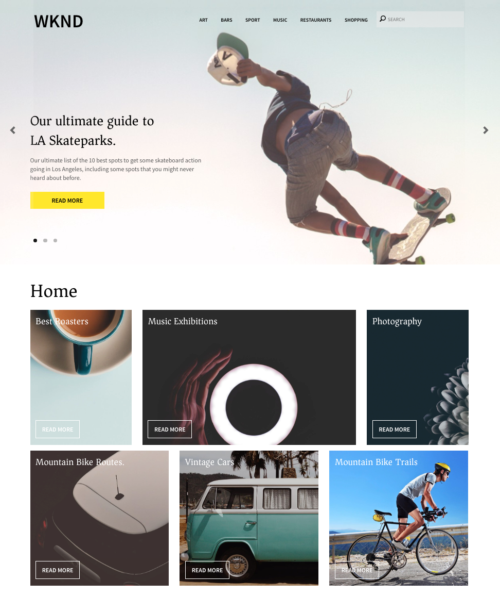 

## Help! {#help}

If you get stuck or have additional questions make sure to check out the [Experience League forums for AEM](https://forums.adobe.com/community/experience-cloud/marketing-cloud/experience-manager) or view existing [GitHub issues](https://github.com/Adobe-Marketing-Cloud/aem-guides-wknd/issues).

Didn't find what you were looking for? Think you found an error? Please file a [GitHub issue for the WKND project](https://github.com/Adobe-Marketing-Cloud/aem-guides-wknd/issues).

## Next steps {#next-steps}

Next part in the tutorial:

* [Getting Started with AEM Sites Chapter 8 - Unit Testing](/help/getting-started-wknd-tutorial-develop/part8.md)
* View the finished code on [GitHub](https://github.com/Adobe-Marketing-Cloud/aem-guides-wknd) or download the finished package for this part of the tutorial:

