# Getting Started with AEM Sites Chapter 8 - Unit Testing{#getting-started-with-aem-sites-chapter-unit-testing}

Covers the implementation of a Unit Test that validates the behavior of the Byline component's Sling Model, created in Chapter 6 of the tutorial.

## Prerequisites {#prerequisites}

This is Chapter 8 of a multi-part tutorial. [Chapter 7 can be found here](https://helpx.adobe.com/experience-manager/kt/sites/using/getting-started-wknd-tutorial-develop/part7.html) and an [overview can be found here](https://helpx.adobe.com/experience-manager/kt/sites/using/getting-started-wknd-tutorial-develop.html).

You can check out the finished code on [**GitHub**](https://github.com/Adobe-Marketing-Cloud/aem-guides-wknd) or you can download the solution package:

## Unit Testing {#unit-testing}

In this chapter, we'll explore how to write [Unit Tests](https://en.wikipedia.org/wiki/Unit_testing) for our Byline component's [Sling Model](https://sling.apache.org/documentation/bundles/models.html) (created in [Part 6](https://helpx.adobe.com/experience-manager/kt/sites/using/getting-started-wknd-tutorial-develop/part6.html)). Unit tests are build-time tests written in Java that verify expected behavior of Java code. Each unit tests are typically small, and validate the outcome of methods (or units of work) against expected results.

We will be using AEM best practices, and use:

* [JUnit 4](https://junit.org/junit4/)
* [Mockito Testing Framework](https://site.mockito.org/)
* [wcm.io Test Framework](https://wcm.io/testing/) (which builds on [Apache Sling Mocks](https://sling.apache.org/documentation/development/sling-mock.html))

>[!VIDEO](https://video.tv.adobe.com/v/25565/?quality=12)

## Unit Testing and Cloud Manager for AEM {#unit-testing-and-cloud-manager-for-aem}

[Cloud Manager for AEM](/content/help/en/experience-manager/cloud-manager/user-guide) integrates unit test execution and [code coverage reporting](/content/help/en/experience-manager/cloud-manager/using/understand-your-test-results#CodeQualityTesting) into its CI/CD pipeline to help encourage and promote the best practice of unit testing AEM code.

While unit testing code is a good practice for any code base, when using Cloud Manager it is important to take advantage of its code quality testing and reporting facilities by providing unit tests for Cloud Manager to run.

## Adding the test Maven dependencies {#adding-the-test-maven-dependencies}

The first step is to add Maven dependencies to support writing and running the tests. There are four dependencies require

1. JUnit4
1. Mockito Testing Framework
1. Apache Sling Mocks
1. wcm.io Test Framework

The JUnit4, Mockito and Sling Mocks dependencies are automatically added to the project during setup using the [AEM Maven archetype](/help/getting-started-wknd-tutorial-develop/part1.md). *(Note the Sling Mocks depedency version needs updating as we see below).*

The io.wcm Testing Framework dependency must be added to the project's  pom.xmls .

1. To add these dependencies, open the ** aem -guides-wknd/pom.xml**, navigate to the `<dependencies>..</dependencies>` and ensure the following dependencies are defined; you will need to add the **io.wcm** dependencies manually. The JUnit and Mockito dependencies are previously added by the Adobe AEM Maven Archetype.

   ```xml
   <dependencies>
       ...
       <dependency>
           <groupId>io.wcm</groupId>
           <artifactId>io.wcm.testing.aem-mock.junit4</artifactId>
           <version>2.3.2</version>
           <scope>test</scope>
       </dependency>             
       <dependency>
           <groupId>junit</groupId>
           <artifactId>junit</artifactId>
           <version>4.12</version>
           <scope>test</scope>
       </dependency>
       <dependency>
           <groupId>org.mockito</groupId>
           <artifactId>mockito-core</artifactId>
           <version>2.7.22</version>
           <scope>test</scope>
       </dependency>
       <dependency>
           <groupId>junit-addons</groupId>
           <artifactId>junit-addons</artifactId>
           <version>1.4</version>
           <scope>test</scope>
       </dependency>
       ...
   </dependencies>
   ```

1. In the reactor **pom.xml**, ensure that that **org.apache.sling.testing.sling-mock** dependency is **2.3.4 or greater**.

   ```xml
   <dependencies>
   ...
       <dependency>
           <groupId>org.apache.sling</groupId>
           <artifactId>org.apache.sling.testing.sling-mock</artifactId>
           <version>2.3.4</version>
           <scope>test</scope>
       </dependency>
   ...
   </dependencies>
   ```

1. Open ** aem -guides-wknd/core/pom.xml** and add the corresponding entries as needed.

   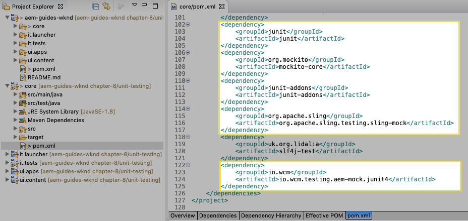

   core/pom.xml

   A parallel source folder in the **core** project will contain the unit tests and any supporting test files. This **test** folder provides separation of test classes from the source code but allows the tests to act as if they live in the same packages as the source code.

## Creating the JUnit test {#creating-the-junit-test}

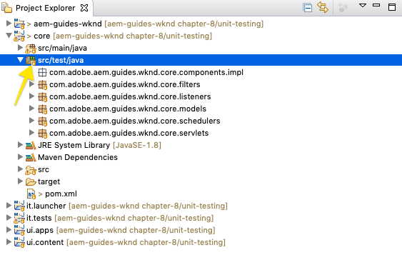

The core project's test folder (core/src/test)

Unit tests typically map 1-to-1 with Java classes. In this chapter, we'll write a JUnit test for the **BylineImpl.java**, which is the Sling Model backing the Byline component.

1. We can do this in Eclipse, by right-clicking on the Java class to test, and selecting the** New &gt; Other &gt; Java &gt; JUnit &gt; JUnit Test Case**.

   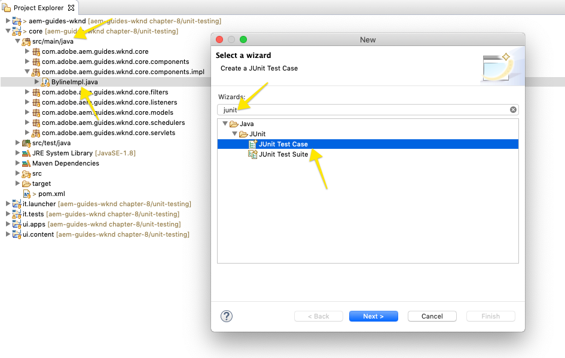

   New JUnit Test Case

   In the first wizard screen, validate the following:

    1. The JUnit test type is **New JUnit 4 Test** as these are the JUnit Maven dependencies set up in our **pom.xml's**.
    
    1. The **package** is the java package of the class being tested (BylineImpl.java)
    1. The Source folder points to the **core** project, which instructs Eclipse where the unit test files are stored.
    1. The **setUp()** method stub will be created manually; we'll see how this is used later.
    1. And the class under test is **BylineImpl.java**, as this is the Java class we want to test.

   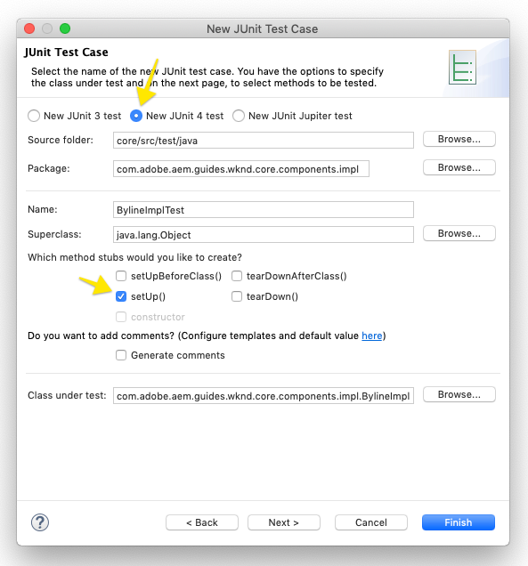

   JUnit Test Case wizard

1. Click the **Next** button at the bottom of the wizard.

   This next step helps with the auto-generation of test methods. Typically each public method of the Java class has at least one corresponding test method, validating its behavior. Often a unit test will have multiple test methods testing a single public method, each representing a different set of inputs or states.

   In the wizard, select all the methods under **BylineImpl**, with the exception of `init()` which is a method used by the Sling Model internally (via `@PostConstruct`). We will effectively test the `init()` by testing all other methods, as the other methods rely on `init()` executing successfully.

   New test methods can be added any time to the JUnit test class, this page of the wizard is merely for convenience.

   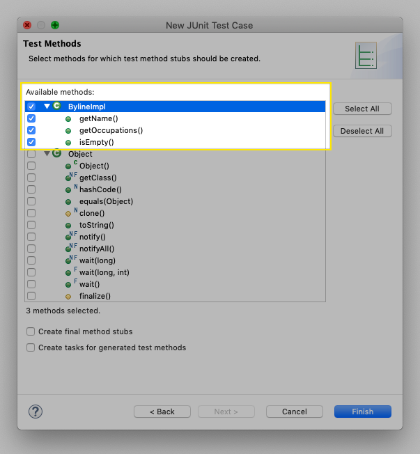

   JUnit Test Case wizard (continued)

1. Click the Finish button at the bottom of the wizard to generate the JUnit4 test file.
1. Verify the JUnit4 test file has been created in the corresponding package structure on ** aem -guides-wknd.core** &gt; **/src/test/java** as a file named **BylineImplTest.java**.

## Reviewing BylineImplTest.java {#reviewing-bylineimpltest-java}

Our test file has a number of auto-generated methods. At this point, there is nothing AEM specific about this JUnit test file.

The first method is `public void setUp() { .. }` which is annotated with `@Before`.

The `@Before` annotation is a JUnit annotation that instructs the JUnit test running to execute this method before running each test method in this class.

The subsequent methods are the test methods themselves and are marked as such with the `@Test` annotation. Notice that by default, all our tests are set to fail.

When this JUnit test class (also known as a JUnit Test Case) is run, each method marked with the `@Test` will execute as a test which can either pass or fail.

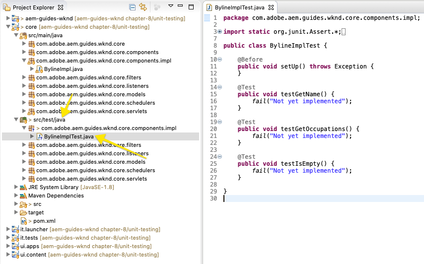

core/src/test/java/com/adobe/aem/guides/wknd/core/components/impl/BylineImplTest.java

1. Run the JUnit Test Case by right-clicking on the class name, and **Run As &gt; JUnit Test**.

   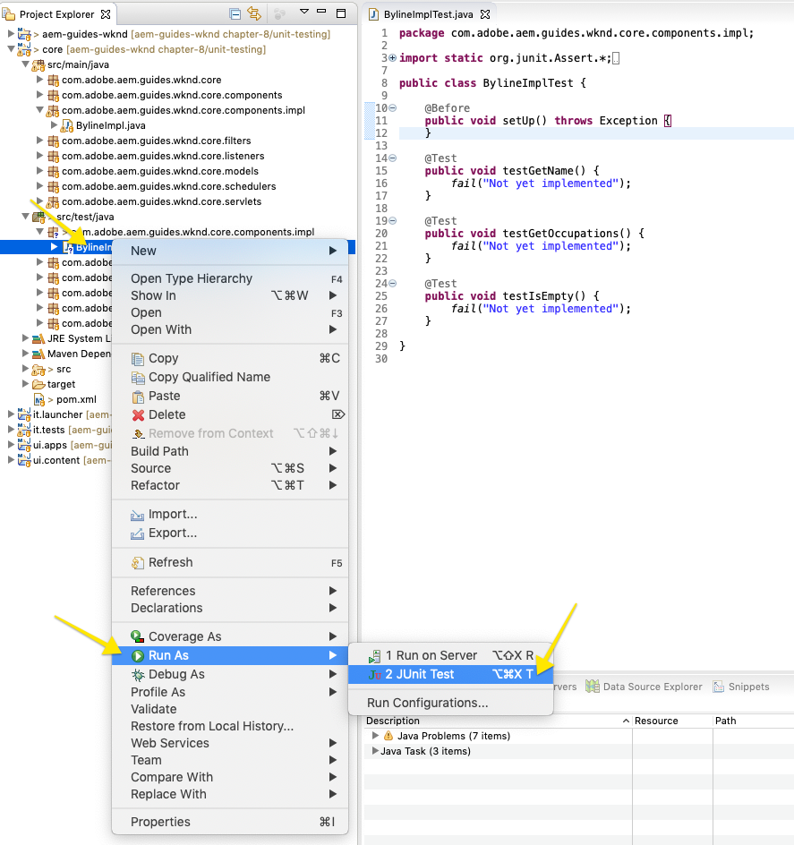

   Right-click on BylineImplTests.java > Run As > JUnit Test

1. As expected, all tests fail.

   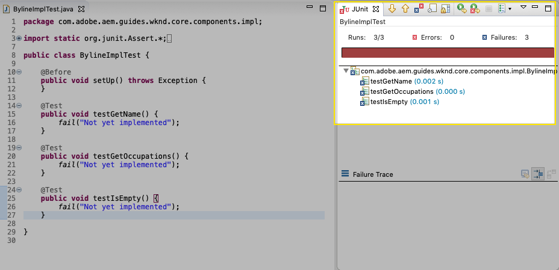

   JUnit view at Eclipse > Window > Show View > Java > JUnit

## Reviewing BylineImpl.java {#reviewing-bylineimpl-java}

When writing unit tests, there are two primary approaches:

* [TDD or Test Driven Development](https://en.wikipedia.org/wiki/Test-driven_development), which involves writing the unit tests incrementally, immediately before the implementation is developed; write a test, write the implementation to make the test pass.
* Implementation-first Development, which involves developing working code first and then writing tests that validate said code.

In this tutorial, the latter approach is used (as we've already created a working **BylineImpl.java** in a previous chapter). Because of this, we must review and understand its public methods' behaviors, but also some of its implementation details. This may sound contrary, as a good test should only care about the inputs and outputs, however when working in AEM, there are a variety of implementation considerations that are required to be understood in order to construct the running tests.

TDD in the context of AEM requires a level of expertise and is best adopted by AEM developers proficient in AEM development and unit testing of AEM code.

>[!VIDEO](https://video.tv.adobe.com/v/25566/?quality=12)

## Setting up AEM test context  {#setting-up-aem-test-context}

Most code written for AEM relies on JCR, Sling or AEM APIs, which in turn, require the context of a running AEM to execute properly.

Since unit tests are executed at build, outside the context of a running AEM instance, there is no such resource. To facilitate this, [io.wcm's AEMContext](https://wcm.io/testing/aem-mock/usage.html) creates a mock context that allows these APIs to mostly act as if they are running in AEM.

1. Create an AEM context using io.wcm's AemContext in **BylineImplTest.java** by adding it as a class variable decorated with `@Rule`.

   ```java
   import org.junit.Rule;
   import io.wcm.testing.mock.aem.junit.AemContext;
   ...
   @Rule
   public final AemContext ctx = new AemContext();
   ```

   This variable, `  ctx`, exposes a mock AEM context that provides a number of AEM and Sling abstractions:

    * The BylineImpl Sling Model will be registered into this context
    * Mock JCR content structures are created in this context
    * Custom OSGi services can be registered in this context
    * Provides a variety of common required mock objects and helpers such as SlingHttpServletRequest objects, a variety of mock Sling and AEM OSGi services such as ModelFactory, PageManager, Page, Template, ComponentManager, Component, TagManager, Tag, etc.

        * *Note that not all methods for these objects are implemented!*

    * And [much more](https://wcm.io/testing/aem-mock/usage.html)!

   The **`  ctx`** object will act as the entry point for most of our mock context.

1. In the `setUp(..)` method, which is executed prior to each `@Test`method, define a common mock testing state.

   ```java
   @Before
   public void setUp() throws Exception {
       ctx.addModelsForClasses(BylineImpl.class);
               
       ctx.load().json("/com/adobe/aem/guides/wknd/core/components/impl/BylineImplTest.json", "/content");
   }
   ```

   **Line 3** registers the Sling Model to be tested, into the mock AEM Context, so it can be instantiated in the `@Test`methods.  
   **Line 5** loads resource structures into the mock context, allowing the code to interact with these resources as if they were provided by a real repository. The resource definitions in the file **BylineImplTest.json **are loaded into the mock JCR context under **/content**.

   **BylineImplTest.json** does not yet, exist, so let's create it and define the JCR resource structures that are needed for the test.

1. Create a new **core/src/test/resources** folder which will hold any JSON files that represent mock resource structures. By convention, the resource structure follows the Java package structure to provide clarity around which JSON files support which tests.

   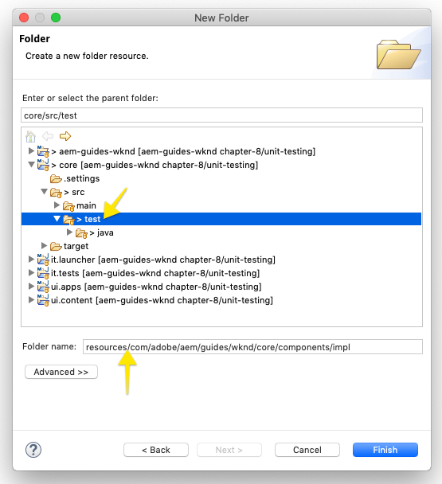

   Right-click on core > Src > Test and select New > Folder

1. The JSON files that represent the mock resource structures are stored under **core/src/test/resources** following the same package pathing as the JUnit Java test file.

   Create a new JSON file at **core/test/resources/com/adobe/aem/guides/wknd/core/components/impl/BylineImplTest.json** with the following content:

   ```
   {
     "byline": {
       "jcr:primaryType": "nt:unstructured",
       "sling:resourceType": "wknd/components/content/byline"
     }
   }
   ```

   This JSON defines a mock resource definition for the Byline component unit test. At this point, the JSON has the minimum set of properties required to represent a Byline component content resource, the ** jcr :primaryType** and **sling:resourceType**.

   A general rule of them when working with unit tests is to create the minimal set of mock content, context, and code required to satisfy each test. Avoid the temptation of building out complete mock context before writing the tests, as it often results in unneeded artifacts.

   Now with the existence of **BylineImplTest.json**, when `ctx.json("/com/adobe/aem/guides/wknd/core/components/impl/BylineImplTest.json", "/content")` is executed, the mock resource definitions are loaded into the context at the path **/content.**

## Testing getName() {#testing-getname}

Now that we have a basic mock context setup, let's write our first test for **BylineImpl's getName()**. This test must ensure the method **getName()** returns the correct authored name stored at the resource's "**name"** property.

1. Update the **testGetName**() method in **BylineImplTest.java** as follows:

   ```java
   import com.adobe.aem.guides.wknd.core.components.Byline;
   ...
   @Test
   public void testGetName() {
       final String expected = "Jane Doe";
   
       ctx.currentResource("/content/byline");
       Byline byline = ctx.request().adaptTo(Byline.class);
       
       String actual = byline.getName();
   
       assertEquals(expected, actual);
   }
   ```

   **Line 3** sets the expected value. We will set this to "**Jane Done**".

   **Line 5** sets the context of the mock resource to evaluate the code against, so this is set to **/content/byline** as that is where the mock byline content resource is loaded.

   **Line 6** instantiates the Byline Sling Model by adapting it from the mock Request object.

   **Line 8** invokes the method we're testing, **getName(),** on the Byline Sling Model object.

   **Line 10** asserts the expected value matches the value returned by the byline Sling Model object. If these values are not equal, the test will fail.

1. Run the test... and it fails.

   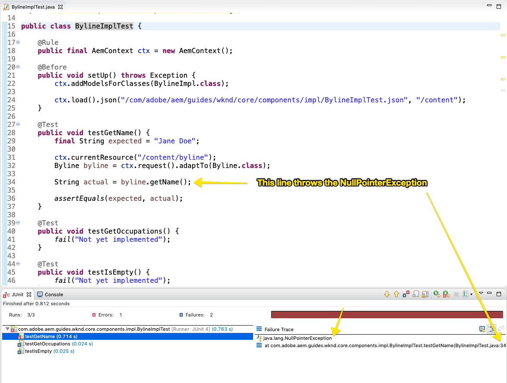

   testGetName() failure due to NullPointedException

   Note that this test does NOT fail because we never defined a "**name**" property in the mock JSON, that will cause the test to fail however the test execution hasn't gotten to that point! This test fails due to a **NullPointerException** on the byline object itself.

1. In the [Reviewing BylineImpl.java](/help/getting-started-wknd-tutorial-develop/part8.md#reviewing-bylineimpl-java) video above, we discuss how if `@PostConstruct init()` throws an exception it prevents the Sling Model from instantiating, and that is what's happening here.

   ```java
   @PostConstruct
   private void init() {
       image = modelFactory.getModelFromWrappedRequest(request, request.getResource(), Image.class);
   }
   ```

   It turns out that while the ModelFactory OSGi service is provided via the AemContext (by way of the Apache Sling Context), not all methods are implemented, including `getModelFromWrappedRequest(...)` which is called in the BylineImpl's `init()` method. This results in an [AbstractMethodError](https://docs.oracle.com/javase/8/docs/api/java/lang/AbstractMethodError.html), which in term causes `init()` to fail, and the resulting adaption of the `  ctx .request().adaptTo(Byline.class)` is a null object.

   Since the provided mocks cannot accommodate our code, we must implement the mock context ourselves For this, we can use Mockito to create a mock ModelFactory object, that returns a mock Image object when `getModelFromWrappedRequest(...)` is invoked upon it.

   Since in order to even instantiate the Byline Sling Model, this mock context must be in place, we can add it to the `@Before setUp()` method. We also need to add the `@RunWith(MockitoJUnitRunner.class)`annotation above the BylineImpleTest class.

   ```java
   import org.junit.runner.RunWith;
   import org.mockito.junit.MockitoJUnitRunner;
   import org.mockito.Mock;
   import com.adobe.cq.wcm.core.components.models.Image;
   import org.apache.sling.models.factory.ModelFactory;
   import static org.mockito.Mockito.*;
   ...
   @RunWith(MockitoJUnitRunner.class)
   public class BylineImplTest {
   
    @Rule
    public final AemContext ctx = new AemContext();
    
    @Mock
    private Image image;
    
    @Mock 
    private ModelFactory modelFactory;
    
    @Before
    public void setUp() throws Exception {
     ctx.addModelsForClasses(BylineImpl.class);
             
     ctx.load().json("/com/adobe/aem/guides/wknd/core/components/impl/BylineImplTest.json", "/content");
                  
     when(modelFactory.getModelFromWrappedRequest(eq(ctx.request()), 
       any(Resource.class),
       eq(Image.class))).thenReturn(image);
   
     ctx.registerService(ModelFactory.class, modelFactory, 
       org.osgi.framework.Constants.SERVICE_RANKING, Integer.MAX_VALUE);
    }
           ...
   ```

   **Line 8** marks the Test Case class to be run with the [MockitoJUnitRunner](https://static.javadoc.io/org.mockito/mockito-core/2.6.8/org/mockito/junit/MockitoJUnitRunner.html) which allows for the use of the @Mock annotations to define mock objects at the Class level.

   **Lines 14-15** creates a mock object of type com.adobe.cq.wcm.core.components.models.Image. Note that this is defined at the class level so that, as needed, `@Test`methods can alter its behavior as needed.  
   **Line 11** creates a mock object of type ModelFactory. Note that this is a pure Mockito mock and has no methods implemented on it. Note that this is defined at the class level so that, as needed, `@Test`methods can alter its behavior as needed.  
   **Lines 26-28** registers mock behavior for when `getModelFromWrappedRequest(..)` is called on the mock ModelFactory object. The result defined in `  thenReturn (..)` is to return the mock Image object. Note that this behavior is only invoked when: the 1st parameter is equal to the `  ctx`  's  request object, the 2nd param is any Resource object, and the 3rd param must be the Core Components Image class. We accept any Resource because throughout our tests we will be setting the `ctx.currentResource(...)` to various mock resources defined in the **BylineImplTest.json**.

   **Lines 30-31** registers the mock ModelFactory object into the AemContext, with the highest service ranking. This is required since the ModelFactory used in the BylineImpl's `init()` is injected via the `@OSGiService ModelFactory model` field. In order for the AemContext to inject **our** mock object, which handles calls to `getModelFromWrappedRequest(..)`, we must register it as the highest ranking Service of that type (ModelFactory). 

1. Re-run the test, and again it fails, but this time the message is clear why its failed.

   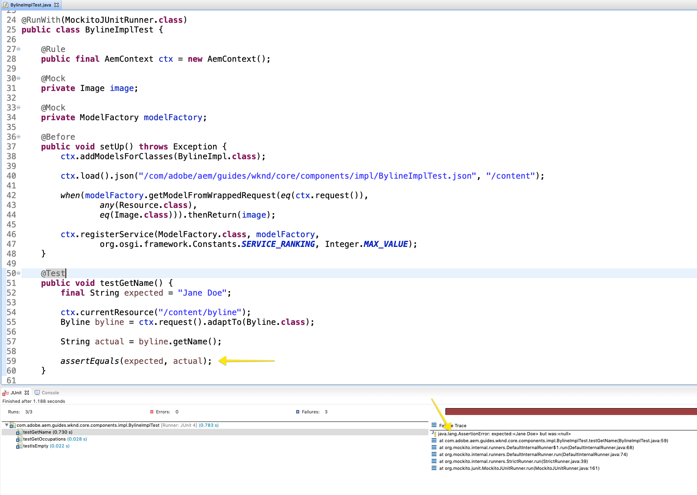

   testGetName() failure due to assertion

   We receive an **AssertionError** which means the assert condition in the test failed, and it tells us the** expected value is "Jane Doe" **but the** actual value is null**. This makes sense because the "**name"** property has not been added to mock **/content/byline** resource definition in **BylineImplTest.json**, so let's add it:

1. Update **BylineImplTest.json** to define `"name": "Jane Doe".`

   ```
   {
     "byline": {
       "jcr:primaryType": "nt:unstructured",
       "sling:resourceType": "wknd/components/content/byline",
       "name": "Jane Doe"
     }
   }
   ```

1. Re-run the test, and **`testGetName()`** now passes!

   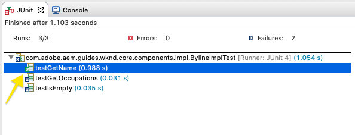

   testGetName() passes

## Testing getOccupations() {#testing-getoccupations}

Ok great! Our first test has passed! Let's move on and test **`getOccupations()`. **Since the initialization of the mock context was does in the `@Before setUp()`method, this will be available to all `@Test` methods in this Test Case, including `getOccupations()`.

Remember that this method must return an alphabetically sorted list of occupations (descending) stored in the occupations property.

1. Update **`testGetOccupations()`** as follows:

   ```java
   import java.util.List;
   import com.google.common.collect.ImmutableList;
   ...
   @Test
   public void testGetOccupations() {
       List<String> expected = new ImmutableList.Builder<String>()
                               .add("Blogger")
                               .add("Photographer")
                               .add("YouTuber")
                               .build();
   
       ctx.currentResource("/content/byline");
       Byline byline = ctx.request().adaptTo(Byline.class);
       
       List<String> actual = byline.getOccupations();
        
       assertEquals(expected, actual);
   }
   ```

   **Lines 6-10** define the expected result.

   **Line 13** sets the current resource to evaluate the context against to the mock resource definition at /content/byline. This ensures the **BylineImpl.java** executes in the context of our mock resource.

   **Line 14** instantiates the Byline Sling Model by adapting it from the mock Request object.

   **Line 15** invokes the method we're testing, `getOccupations()`, on the Byline Sling Model object.

   **Line 17** asserts expected list is the same as the actual list.

1. Remember, just like **`getName()`** above, the **BylineImplTest.json** does not define occupations, so this test will fail if we run it, since `byline.getOccupations()` will return an empty list.

   Update **BylineImplTest.json** to include a list of occupations, and they will be set in non-alphabetical order to ensure that our tests validate that the occupations are sorted by **`getOccupations()`**.

   ```
   {
     "byline": {
       "jcr:primaryType": "nt:unstructured",
       "sling:resourceType": "wknd/components/content/byline",
       "name": "Jane Doe",
       "occupations": ["Photographer", "Blogger", "YouTuber"]
     }
   }
   ```

1. Run the test, and again we pass! Looks like getting the sorted occupations works!

   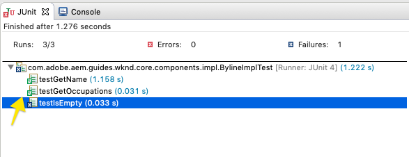

   testGetOccupations() passes

## Testing isEmpty() {#testing-isempty}

The last method to test** `isEmpty().`**

Testing `isEmpty()`** **is interesting as it requires testing for a variety of conditions. Reviewing **BylineImpl.java**'s `isEmpty()` method the following conditions must be tested:

1. Return true when the name is empty
1. Return true when occupations are null or empty
1. Return true when the image is null or has no src URL
1. Return false when the name, occupations, and Image (with  a src  URL) are present

For this, we need to create new test methods, each testing a specific condition as well as new mock resource structures in **BylineImplTest.json** to drive these tests.

Note that this check allowed us to skip testing for when `getName()`, `getOccupations()` and `getImage()` are empty since the expected behavior of that state is tested via `isEmpty()`.

1. The first test will test the condition of a brand new component, that has no properties set.

   Add a new resource definition to **BylineImplTest.json**, giving it the semantic name "**empty**"

   ```
   {
     "byline": {
       "jcr:primaryType": "nt:unstructured",
       "sling:resourceType": "wknd/components/content/byline",
       "name": "Jane Doe",
       "occupations": ["Photographer", "Blogger", "YouTuber"]
     },
     "empty": {
       "jcr:primaryType": "nt:unstructured",
       "sling:resourceType": "wknd/components/content/byline"
     }
   }
   
   ```

   **Lines 8-11** define a new resource definition named "empty" that only has a ** jcr :primaryType** and **sling:resourceType**.

   Remember we load **BylineImplTest.json** into  `ctx`  before the execution of each test method in `@setUp`, so this new resource definition is immediately available to us in tests at **/content/empty.**

1. Update `testIsEmpty()` as follows, setting the current resource to the new "**empty**" mock resource definition.

   ```java
   @Test
   public void testIsEmpty() {
       ctx.currentResource("/content/empty");
       Byline byline = ctx.request().adaptTo(Byline.class);
       
       assertTrue(byline.isEmpty());
   }
   ```

   Run the test and ensure it passes.

1. Next, create a set of methods to ensure that if any of the required data points (name, occupations, or image) are empty, `isEmpty()` returns true.

   For each test, a discrete mock resource definition is used, update **BylineImplTest.json** with the additional resource definitions for **without-name** and **without-occupations**.

   ```
   {
     "byline": {
       "jcr:primaryType": "nt:unstructured",
       "sling:resourceType": "wknd/components/content/byline",
       "name": "Jane Doe",
       "occupations": ["Photographer", "Blogger", "YouTuber"]
     },
     "empty": {
       "jcr:primaryType": "nt:unstructured",
       "sling:resourceType": "wknd/components/content/byline"
     },
     "without-name": {
       "jcr:primaryType": "nt:unstructured",
       "sling:resourceType": "wknd/components/content/byline",
       "occupations": "[Photographer, Blogger, YouTuber]"
     },
     "without-occupations": {
       "jcr:primaryType": "nt:unstructured",
       "sling:resourceType": "wknd/components/content/byline",
       "name": "Jane Doe"
     }  
   }
   ```

   Create the following test methods to test the each of these states.

   ```java
   @Test
   public void testIsEmpty() {
       ctx.currentResource("/content/empty");
   
       Byline byline = ctx.request().adaptTo(Byline.class);
       
       assertTrue(byline.isEmpty());
   }
   
   @Test
   public void testIsEmpty_WithoutName() {
       ctx.currentResource("/content/without-name");
   
       Byline byline = ctx.request().adaptTo(Byline.class);
       
       assertTrue(byline.isEmpty());
   }
   
   @Test
   public void testIsEmpty_WithoutOccupations() {
       ctx.currentResource("/content/without-occupations");
   
       Byline byline = ctx.request().adaptTo(Byline.class);
       
       assertTrue(byline.isEmpty());
   }
   
   @Test
   public void testIsEmpty_WithoutImage() {
       ctx.currentResource("/content/byline");
       
       when(modelFactory.getModelFromWrappedRequest(eq(ctx.request()), 
           any(Resource.class),
           eq(Image.class))).thenReturn(null);    
   
       Byline byline = ctx.request().adaptTo(Byline.class);
       
       assertTrue(byline.isEmpty());
   }
   
   @Test
   public void testIsEmpty_WithoutImageSrc() {
       ctx.currentResource("/content/byline");
       
       when(image.getSrc()).thenReturn("");
       
       Byline byline = ctx.request().adaptTo(Byline.class);
       
       assertTrue(byline.isEmpty());
   }
   ```

   **Lines 1-8** define `testIsEmpty()` that tests against the empty mock resource definition, and asserts that `isEmpty()` is true.

   **Lines 10-17** define `testIsEmpty_WithoutName()` that test against a mock resource definition that has occupations but no name.

   **Lines 19-26** define `testIsEmpty_WithoutOccupations()` that test against a mock resource definition that has a name but no occupations.

   **Lines 28-39** define `testIsEmpty_WithoutImage()`that tests against a mock resource definition with a name and occupations but sets the mock Image to return to null. Note that we override the `modelFactory.getModelFromWrappedRequest(..)`behavior defined in `  setUp ()` to ensure the Image object returned by this call is null.

   **Lines 41-50** define `testIsEmpty_WithoutImageSrc()` that tests against a mock resource definition with a name and occupations, but sets the mock Image to return a blank string when `getSrc()` is invoked.

1. Lastly, write a test to ensure that **isEmpty()** returns false when the component is properly configured. For this condition, we can re-use **/content/byline** which represents a fully configured Byline component.

   ```java
   @Test
   public void testIsNotEmpty() {
    ctx.currentResource("/content/byline");
    when(image.getSrc()).thenReturn("/content/bio.png");
   
    Byline byline = ctx.request().adaptTo(Byline.class);
    
    assertFalse(byline.isEmpty());
   }
   ```

## Code coverage {#code-coverage}

Code coverage is the amount of source code covered by unit tests. Modern IDEs provide tooling that automatically checks what source code is executed over the course of the unit tests. While code coverage in itself is not an indicator of code quality, it is helpful to understand if there are important areas of source code not tested by unit tests.

1. In Eclipse's Project Explorer, right-click on **BylineImplTest.java** and select **Coverage As &gt; JUnit Test**

   Ensure the Coverage summary view is opened (Window &gt; Show View &gt; Other &gt; Java &gt; Coverage).

   This will run the unit tests within this file and provide a report indicating the code coverage. Drilling into the class and methods gives clearer indications of what parts of the file are tested, and which are not.

   

   Code coverage summary

   Eclipse provides a quick view of how much of each class and method are covered by the unit test. Eclipse even color codes the lines of code:

    * **Green** is code that is executed by at least one test
    * **Yellow** indicates a branch that is not evaluated by any test
    * **Red** indicates code that is not executed by any test

1. In the coverage report it's been identified the branch the executes when the occupations field is null and returns an empty list, is never evaluated. This is indicated by line 59 being colored yellow, indicated a branch of the if/else is not executed, and the line 63 in red indicating that line of code is never executed.

   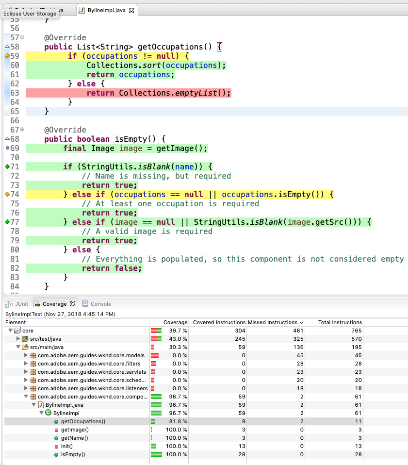

1. This can be remedied by adding a test for `getOccupations()` that asserts an empty list is returned when there is no occupations value on the resource. Add the following new test method to **BylineImplTests.java**.

   ```java
   @Test
   public void testGetOccupations_WithoutOccupations() {
       List<String> expected = Collections.emptyList();
   
       ctx.currentResource("/content/empty");
       Byline byline = ctx.request().adaptTo(Byline.class);
       
       List<String> actual = byline.getOccupations();
       
       assertEquals(expected, actual);
   }
   ```

   **Line 3** sets the expected value to an empty list.

   **Line 5** sets the current resource to /content/empty, which we know does not have an occupations property defined.

1. Re-running the Coverage As, it reports that BylineImpl.java is now at 100% coverage, however there is still one branch that is not evaluated in isEmpty() which again has to do with the occupations. In this case, the occupations == null is being evaluated, however the occupations.isEmpty() is not since there is no mock resource definition that sets "occupations": [].

   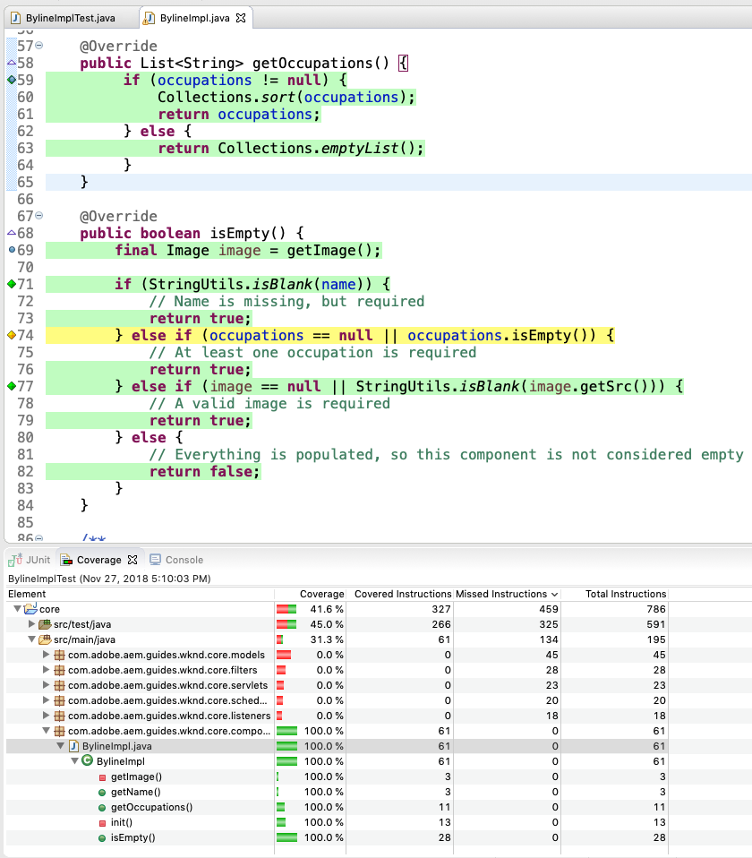

   Coverage with testGetOccupations_WithoutOccupations()

1. This can be easily solved by creating another test method that is used a mock resource definition that sets the occupations to the empty array.

   Add a new mock resource definition to **BylineImplTest.json** that is a copy of **"without-occupations"** and add a occupations property set to the empty array, and name it** "without-occupations-empty-array".**

   ```
   "without-occupations-empty-array": {
       "jcr:primaryType": "nt:unstructured",
       "sling:resourceType": "wknd/components/content/byline",
       "name": "Jane Doe",
       "occupations": []
     }  
   ```

   Create a new **@Test** method in **BylineImplTest.java** that uses this new mock resource, asserts `isEmpty()` returns true.

   ```java
   
   @Test
   public void testIsEmpty_WithEmptyArrayOfOccupations() {
       ctx.currentResource("/content/without-occupations-empty-array");
       
       Byline byline = ctx.request().adaptTo(Byline.class);
       
       assertTrue(byline.isEmpty());
   }
   ```

   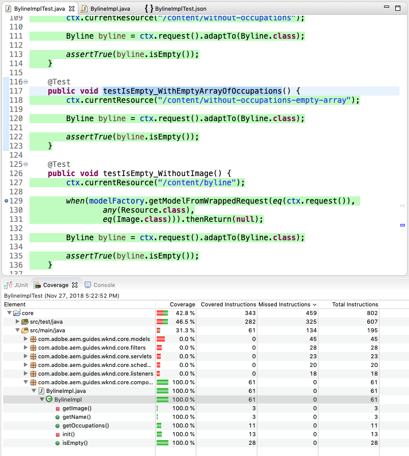

   Coverage with testIsEmpty_WithEmptyArrayOfOccupations()

1. With this last addition, **BylineImpl.java** enjoys 100% code coverage with all it's conditional pathing evaluated.

   The tests validate the expected behavior of BylineImpl without while relying on a minimal set of implementation details.

## Running unit tests as part of the build {#running-unit-tests-as-part-of-the-build}

Unit tests are executed are required to pass as part of the maven build. This ensures that all tests successfully pass before an application be be deployed. Executing Maven goals such as package or install automatically invoke and require the passing of all unit tests in the project.

```shell
$ mvn package

```

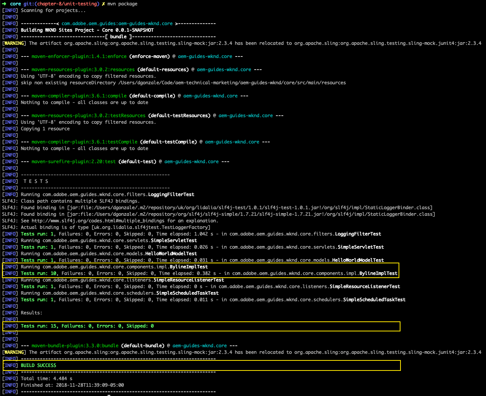

$ mvn package

Likewise, if we change a test method to fail, the build fails and reports which test failed and why.

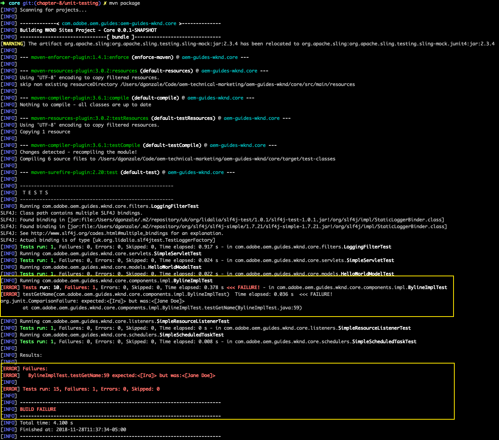

$ mvn package

## Review {#review}

>[!VIDEO](https://video.tv.adobe.com/v/25567/?quality=12)

## Help! {#help}

If you get stuck or have additional questions make sure to check out the [Experience League forums for AEM](https://forums.adobe.com/community/experience-cloud/marketing-cloud/experience-manager) or view existing [GitHub issues](https://github.com/Adobe-Marketing-Cloud/aem-guides-wknd/issues).

Didn't find what you were looking for? Think you found an error? Please file a [GitHub issue for the WKND project](https://github.com/Adobe-Marketing-Cloud/aem-guides-wknd/issues).

## Next steps {#next-steps}

Coming soon: Performance best practices.

Download the finished solution package:
