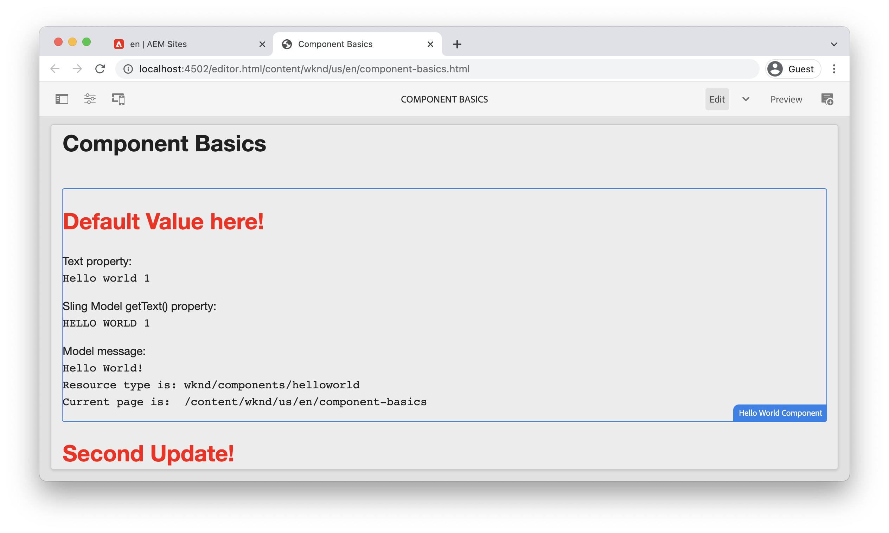

# Component Basics {#component-basics}

In this chapter, let's explore the underlying technology of an Adobe Experience Manager (AEM) Sites Component through a simple `HelloWorld` example. Small modifications are made to an existing component, covering topics of authoring, HTL, Sling Models, Client-side libraries.

## Prerequisites {#prerequisites}

Review the required tooling and instructions for setting up a [local development environment](./overview.md#local-dev-environment).

The IDE used in the videos is [Visual Studio Code](https://code.visualstudio.com/) and the [VSCode AEM Sync](https://marketplace.visualstudio.com/items?itemName=yamato-ltd.vscode-aem-sync) plugin.

## Objective {#objective}

1. Learn the role of HTL templates and Sling Models to dynamically render HTML.
1. Understand how Dialogs are used to facilitate authoring of content.
1. Learn the very basics of Client-side libraries to include CSS and JavaScript to support a component.

## What you are going to build {#what-build}

In this chapter, you perform several modifications to a simple `HelloWorld` component. While making updates to the `HelloWorld` component, you learn about the key areas of AEM component development.

## Chapter Starter Project {#starter-project}

This chapter builds upon a generic project generated by the [AEM Project Archetype](https://github.com/adobe/aem-project-archetype). Watch the below video and review the [prerequisites](#prerequisites) to get started!

>[!NOTE]
>
> If you successfully completed the previous chapter, you can reuse the project and skip the steps for checking out the starter project.

>[!VIDEO](https://video.tv.adobe.com/v/330985?quality=12&learn=on)

Open a new command-line terminal and perform the following actions.

1.  In an empty directory, clone the [aem-guides-wknd](https://github.com/adobe/aem-guides-wknd) repository:

    ```shell
    $ git clone git@github.com:adobe/aem-guides-wknd.git --branch tutorial/component-basics-start --single-branch
    ```

    >[!NOTE]
    >
    > Optionally, you can continue using the project generated in the previous chapter, [Project Setup](./project-setup.md).

1.  Navigate into the  `aem-guides-wknd` folder.

    ```shell
    $ cd aem-guides-wknd
    ```

1.  Build and deploy the project to a local instance of AEM with the following command:

    ```shell
    $ mvn clean install -PautoInstallSinglePackage
    ```

    >[!NOTE]
    >
    > If using AEM 6.5 or 6.4, append the `classic` profile to any Maven commands.

    ```shell
    $ mvn clean install -PautoInstallSinglePackage -Pclassic
    ```

1.  Import the project into your preferred IDE by following the instructions to set up a [local development environment](overview.md#local-dev-environment).

## Component Authoring {#component-authoring}

Components can be thought of as small modular building blocks of a web page. In order to reuse components, the components must be configurable. This is accomplished via the author dialog. Next let's author a simple component and inspect how values from the dialog are persisted in AEM.

>[!VIDEO](https://video.tv.adobe.com/v/330986?quality=12&learn=on)

Below are the high-level steps performed in the above video.

1. Create a page named **Component Basics** beneath **WKND Site** `>` **US** `>` **en**.
1. Add the **Hello World Component** to the newly created page.
1. Open the dialog for the component and enter some text. Save the changes to see the message displayed on the page.
1. Switch in to developer mode and view the Content Path in CRXDE-Lite and inspect the properties of the component instance.
1. Use CRXDE-Lite to view the `cq:dialog` and `helloworld.html` script from `/apps/wknd/components/content/helloworld`.

## HTL (HTML Template Language) and Dialogs {#htl-dialogs}

HTML Template Language or **[HTL](https://experienceleague.adobe.com/docs/experience-manager-htl/content/getting-started.html)** is a light-weight, server-side templating language used by AEM components to render content.

**Dialogs** define the configurations available that can be made for a component.

Next let's update the `HelloWorld` HTL script to display an extra greeting before the text message.

>[!VIDEO](https://video.tv.adobe.com/v/330987?quality=12&learn=on)

Below are the high-level steps performed in the above video.

1.  Switch to the IDE and open the project to the `ui.apps` module.
1.  Open the `helloworld.html` file and update the HTML Markup.
1.  Use the IDE tools like [VSCode AEM Sync](https://marketplace.visualstudio.com/items?itemName=yamato-ltd.vscode-aem-sync) to synchronize the file change with the local AEM instance.
1.  Return to the browser and observe the component render has changed.
1.  Open the `.content.xml` file that defines the dialog for the `HelloWorld` component at:

    ```plain
    <code>/aem-guides-wknd/ui.apps/src/main/content/jcr_root/apps/wknd/components/helloworld/_cq_dialog/.content.xml
    ```

1.  Update the dialog to add an extra textfield named **Title** with a name of `./title`:

    ```xml
    <?xml version="1.0" encoding="UTF-8"?>
    <jcr:root xmlns:sling="http://sling.apache.org/jcr/sling/1.0" xmlns:cq="http://www.day.com/jcr/cq/1.0" xmlns:jcr="http://www.jcp.org/jcr/1.0" xmlns:nt="http://www.jcp.org/jcr/nt/1.0"
        jcr:primaryType="nt:unstructured"
        jcr:title="Properties"
        sling:resourceType="cq/gui/components/authoring/dialog">
        <content
            jcr:primaryType="nt:unstructured"
            sling:resourceType="granite/ui/components/coral/foundation/fixedcolumns">
            <items jcr:primaryType="nt:unstructured">
                <column
                    jcr:primaryType="nt:unstructured"
                    sling:resourceType="granite/ui/components/coral/foundation/container">
                    <items jcr:primaryType="nt:unstructured">
                        <title
                            jcr:primaryType="nt:unstructured"
                            sling:resourceType="granite/ui/components/coral/foundation/form/textfield"
                            fieldLabel="Title"
                            name="./title"/>
                        <text
                            jcr:primaryType="nt:unstructured"
                            sling:resourceType="granite/ui/components/coral/foundation/form/textfield"
                            fieldLabel="Text"
                            name="./text"/>
                    </items>
                </column>
            </items>
        </content>
    </jcr:root>
    ```

1.  Reopen the file `helloworld.html`, which represents the main HTL script responsible for rendering the `HelloWorld` component from below path:

    ```plain
        <code>/aem-guides-wknd.ui.apps/src/main/content/jcr_root/apps/wknd/components/helloworld/helloworld.html
    ```

1.  Update `helloworld.html` to render the value of the **Greeting** textfield as part of an `H1` tag:

    ```html
    <div class="cmp-helloworld" data-cmp-is="helloworld">
        <h1 class="cmp-helloworld__title">${properties.title}</h1>
        ...
    </div>
    ```

1.  Deploy the changes to a local instance of AEM using the developer plugin or using your Maven skills.

## Sling Models {#sling-models}

Sling Models are annotation driven Java&trade; "POJOs" (Plain Old Java&trade; Objects) that facilitate the mapping of data from the JCR to Java&trade; variables. They also provide several other niceties when developing in the context of AEM.

Next, let's make some updates to the `HelloWorldModel` Sling Model in order to apply some business logic to the values stored in the JCR before outputting them to the page.

>[!VIDEO](https://video.tv.adobe.com/v/330988?quality=12&learn=on)

1.  Open the file `HelloWorldModel.java`, which is the Sling Model used with the `HelloWorld` component.

    ```plain
    <code>/aem-guides-wknd.core/src/main/java/com/adobe/aem/guides/wknd/core/models/HelloWorldModel.java
    ```

1.  Add the following import statements:

    ```java
    import org.apache.commons.lang3.StringUtils;
    import org.apache.sling.models.annotations.DefaultInjectionStrategy;
    ```

1.  Update the `@Model` annotation to use a `DefaultInjectionStrategy`:

    ```java
    @Model(adaptables = Resource.class,
       defaultInjectionStrategy = DefaultInjectionStrategy.OPTIONAL)
       public class HelloWorldModel {
       ...
    ```

1.  Add the following lines to the `HelloWorldModel` class to map the values of the component's JCR properties `title` and `text` to Java&trade; variables:

    ```java
    ...
    @Model(adaptables = Resource.class,
    defaultInjectionStrategy = DefaultInjectionStrategy.OPTIONAL)
    public class HelloWorldModel {

        ...

        @ValueMapValue
        private String title;

        @ValueMapValue
        private String text;

        @PostConstruct
        protected void init() {
            ...
    ```

1.  Add the following method `getTitle()` to the `HelloWorldModel` class, that returns the value of the property named `title`. This method adds the additional logic to return a String value of "Default Value here!" if the property `title` is null or blank:

    ```java
    /***
    *
    * @return the value of title, if null or blank returns "Default Value here!"
    */
    public String getTitle() {
        return StringUtils.isNotBlank(title) ? title : "Default Value here!";
    }
    ```

1.  Add the following method `getText()` to the `HelloWorldModel` class, that returns the value of the property named `text`. This method transforms the String to all uppercase characters.

    ```java
        /***
        *
        * @return All caps variation of the text value
        */
    public String getText() {
        return StringUtils.isNotBlank(this.text) ? this.text.toUpperCase() : null;
    }
    ```

1.  Build and deploy the bundle from the `core` module:

    ```shell
    $ cd core
    $ mvn clean install -PautoInstallBundle
    ```

    >[!NOTE]
    >
    > For AEM 6.4/6.5 use `mvn clean install -PautoInstallBundle -Pclassic`

1.  Update the file `helloworld.html` at `aem-guides-wknd.ui.apps/src/main/content/jcr_root/apps/wknd/components/content/helloworld/helloworld.html` to use the newly created methods of the `HelloWorld` model:

    ```html
    <div class="cmp-helloworld" data-cmp-is="helloworld"
    data-sly-use.model="com.adobe.aem.guides.wknd.core.models.HelloWorldModel">
        <h1 class="cmp-helloworld__title">${model.title}</h1>
        <div class="cmp-helloworld__item" data-sly-test="${properties.text}">
            <p class="cmp-helloworld__item-label">Text property:</p>
            <pre class="cmp-helloworld__item-output" data-cmp-hook-helloworld="property">${properties.text}</pre>
        </div>
        <div class="cmp-helloworld__item" data-sly-test="${model.text}">
            <p class="cmp-helloworld__item-label">Sling Model getText() property:</p>
            <pre class="cmp-helloworld__item-output" data-cmp-hook-helloworld="property">${model.text}</pre>
        </div>
        <div class="cmp-helloworld__item"  data-sly-test="${model.message}">
            <p class="cmp-helloworld__item-label">Model message:</p>
            <pre class="cmp-helloworld__item-output"data-cmp-hook-helloworld="model">${model.message}</pre>
        </div>
    </div>
    ```

1.  Deploy the changes to a local instance of AEM using the Eclipse Developer plugin or using your Maven skills.

## Client-Side Libraries {#client-side-libraries}

Client-Side Libraries, `clientlibs` for short, provides a mechanism to organize and manage CSS and JavaScript files necessary for an AEM Sites implementation. Client-side libraries are the standard way to include CSS and JavaScript on a page in AEM.

The [ui.frontend](https://experienceleague.adobe.com/docs/experience-manager-core-components/using/developing/archetype/uifrontend.html) module is a de-coupled [webpack](https://webpack.js.org/) project that is integrated into the build process. This enables the use of popular front-end libraries like Sass, LESS, and TypeScript. The `ui.frontend` module is explored in more depth in the [Client-Side Libraries chapter](/help/getting-started-wknd-tutorial-develop/project-archetype/client-side-libraries.md).

Next, update the CSS styles for the `HelloWorld` component.

>[!VIDEO](https://video.tv.adobe.com/v/340750?quality=12&learn=on)

Below are the high-level steps performed in the above video.

1.  Open a terminal window and navigate into the `ui.frontend` directory

1.  Being in `ui.frontend` directory run the `npm install npm-run-all --save-dev` command to install the [npm-run-all](https://www.npmjs.com/package/npm-run-all) node module. This step is **required on Archetype 39 generated AEM project**, in upcoming Archetype version this is not required.

1.  Next, run the `npm run watch` command:

    ```shell
    $ npm run watch
    ```
    
1.  Switch to the IDE and open the project to the `ui.frontend` module.
1.  Open the file `ui.frontend/src/main/webpack/components/_helloworld.scss`.
1.  Update the file to display a red title:

    ```scss
    .cmp-helloworld {}
    .cmp-helloworld__title {
        color: red;
    }
    ```

1.  In the terminal, you should see activity indicating that the `ui.frontend` module is compiling and syncing the changes with the local instance of AEM.

    ```shell
    Entrypoint site 214 KiB = clientlib-site/site.css 8.45 KiB clientlib-site/site.js 206 KiB
    2022-02-22 17:28:51: webpack 5.69.1 compiled successfully in 119 ms
    change:dist/index.html
    + jcr_root/apps/wknd/clientlibs/clientlib-site/css/site.css
    + jcr_root/apps/wknd/clientlibs/clientlib-site/css
    + jcr_root/apps/wknd/clientlibs/clientlib-site/js/site.js
    + jcr_root/apps/wknd/clientlibs/clientlib-site/js
    + jcr_root/apps/wknd/clientlibs/clientlib-site
    + jcr_root/apps/wknd/clientlibs/clientlib-dependencies/css.txt
    + jcr_root/apps/wknd/clientlibs/clientlib-dependencies/js.txt
    + jcr_root/apps/wknd/clientlibs/clientlib-dependencies
    ```

1.  Return to the browser and observe that the title color has changed.

    

## Congratulations! {#congratulations}

Congratulations, you have learned the basics of component development in Adobe Experience Manager!

### Next Steps {#next-steps}

Get familiar with Adobe Experience Manager pages and templates in the next chapter [Pages and Templates](pages-templates.md). Understand how Core Components are proxied into the project and learn advanced policy configurations of editable templates to build out a well-structured Article Page template.

View the finished code on [GitHub](https://github.com/adobe/aem-guides-wknd) or review and deploy the code locally at on the Git branch `tutorial/component-basics-solution`.
