# Custom Component {#custom-component}

This tutorial covers the end-to-end creation of a custom AEM Byline Component that displays content authored in a Dialog, and explores developing a Sling Model to encapsulate business logic that populates the component's HTL.

## Prerequisites {#prerequisites}

Review the required tooling and instructions for setting up a [local development environment](overview.md#local-dev-environment).

### Starter Project

>[!NOTE]
>
> If you successfully completed the previous chapter you can re-use the project and skip the steps for checking out the starter project.

Check out the base-line code the tutorial builds on:

1. Check out the `tutorial/custom-component-start` branch from [GitHub](https://github.com/adobe/aem-guides-wknd)

    ```shell
    $ cd aem-guides-wknd
    $ git checkout tutorial/custom-component-start
    ```

1. Deploy code base to a local AEM instance using your Maven skills:

    ```shell
    $ mvn clean install -PautoInstallSinglePackage
    ```

    >[!NOTE]
    >
    > If using AEM 6.5 or 6.4, append the `classic` profile to any Maven commands.

    ```shell
    $ mvn clean install -PautoInstallSinglePackage -Pclassic
    ```

You can always view the finished code on [GitHub](https://github.com/adobe/aem-guides-wknd/tree/tutorial/custom-component-solution) or check the code out locally by switching to the branch `tutorial/custom-component-solution`.

## Objective

1. Understand how to build a custom AEM component
1. Learn to encapsulate business logic with Sling Models
1. Understand how to use a Sling Model from within an HTL Script

## What you will build {#byline-component}

In this part of the WKND tutorial, a Byline Component is created that will be used to displays authored information about an article's contributor.

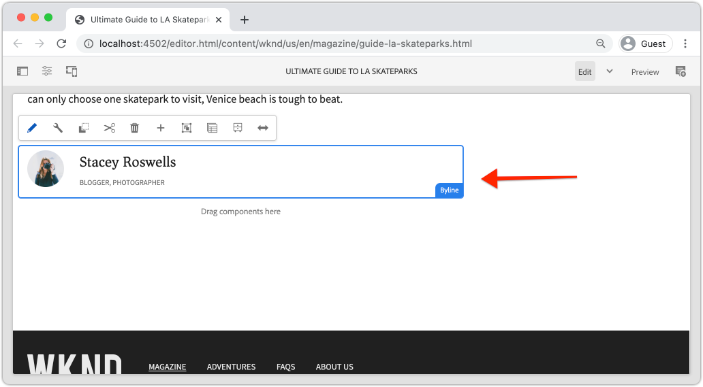

*Byline component*

The implementation of the Byline component includes a dialog that collects the byline content and a custom Sling Model that retrieves the byline's:

* Name
* Image
* Occupations

## Create Byline component {#create-byline-component}

First, create the Byline Component node structure and define a dialog. This represents the Component in AEM and implicitly defines the component's resource type by its location in the JCR.

The dialog exposes the interface with which content authors can provide. For this implementation, the AEM WCM Core Component's **Image** component will be leveraged to handle the authoring and rendering of the Byline's image, so it will be set as our component's `sling:resourceSuperType`.

### Create Component Definition {#create-component-definition}

1. In the **ui.apps** module, navigate to `/apps/wknd/components` and create a new folder named `byline`.
1. Beneath the `byline` folder add a new file named `.content.xml`

    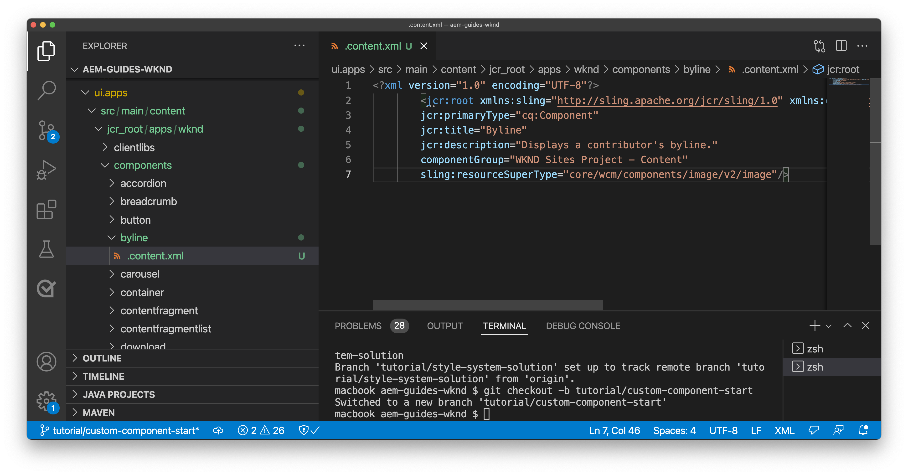

1. Populate the `.content.xml` file with the following:

    ```xml
    <?xml version="1.0" encoding="UTF-8"?>
        <jcr:root xmlns:sling="http://sling.apache.org/jcr/sling/1.0" xmlns:cq="http://www.day.com/jcr/cq/1.0" xmlns:jcr="http://www.jcp.org/jcr/1.0"
        jcr:primaryType="cq:Component"
        jcr:title="Byline"
        jcr:description="Displays a contributor's byline."
        componentGroup="WKND Sites Project - Content"
        sling:resourceSuperType="core/wcm/components/image/v2/image"/>

    ```

    The above XML file provides the definition for the component, including the title, description and group. The `sling:resourceSuperType` points to `core/wcm/components/image/v2/image`, which is the [Core Image Component](https://experienceleague.adobe.com/docs/experience-manager-core-components/using/components/image.html).

### Create the HTL script {#create-the-htl-script}

1. Beneath the `byline` folder, add a new file `byline.html`, which is responsible for the HTML presentation of the component. Naming the file the same as the folder is important, as it becomes the default script Sling will use to render this resource type.

1. Add the following code to the `byline.html`.

    ```html
    <!--/* byline.html */-->
    <div data-sly-use.placeholderTemplate="core/wcm/components/commons/v1/templates.html">
    </div>
    <sly data-sly-call="${placeholderTemplate.placeholder @ isEmpty=true}"></sly>
    ```

`byline.html` is [revisited later](#byline-htl), once the Sling Model is created. The HTL file's current state allows the component to display in an empty state, in the AEM Sites' Page Editor when it's drag and dropped onto the page.

### Create the Dialog definition {#create-the-dialog-definition}

Next, define a dialog for the Byline component with the following fields:

* **Name**: a text field the contributor's name.
* **Image**: a reference to the contributor's bio picture.
* **Occupations**: a list of occupations attributed to the contributor. Occupations should be sorted alphabetically in an ascending order (a to z).

1. Beneath the `byline` folder, create a new folder named `_cq_dialog`.
1. Beneath `byline/_cq_dialog` add a new file named `.content.xml`. This is the XML definition for the dialog. Add the following XML:

    ```xml
    <?xml version="1.0" encoding="UTF-8"?>
    <jcr:root xmlns:sling="http://sling.apache.org/jcr/sling/1.0" xmlns:cq="http://www.day.com/jcr/cq/1.0" xmlns:jcr="http://www.jcp.org/jcr/1.0" xmlns:nt="http://www.jcp.org/jcr/nt/1.0"
            jcr:primaryType="nt:unstructured"
            jcr:title="Byline"
            sling:resourceType="cq/gui/components/authoring/dialog">
        <content
                jcr:primaryType="nt:unstructured"
                sling:resourceType="granite/ui/components/coral/foundation/container">
            <items jcr:primaryType="nt:unstructured">
                <tabs
                        jcr:primaryType="nt:unstructured"
                        sling:resourceType="granite/ui/components/coral/foundation/tabs"
                        maximized="{Boolean}false">
                    <items jcr:primaryType="nt:unstructured">
                        <asset
                                jcr:primaryType="nt:unstructured"
                                sling:hideResource="{Boolean}false"/>
                        <metadata
                                jcr:primaryType="nt:unstructured"
                                sling:hideResource="{Boolean}true"/>
                        <properties
                                jcr:primaryType="nt:unstructured"
                                jcr:title="Properties"
                                sling:resourceType="granite/ui/components/coral/foundation/container"
                                margin="{Boolean}true">
                            <items jcr:primaryType="nt:unstructured">
                                <columns
                                        jcr:primaryType="nt:unstructured"
                                        sling:resourceType="granite/ui/components/coral/foundation/fixedcolumns"
                                        margin="{Boolean}true">
                                    <items jcr:primaryType="nt:unstructured">
                                        <column
                                                jcr:primaryType="nt:unstructured"
                                                sling:resourceType="granite/ui/components/coral/foundation/container">
                                            <items jcr:primaryType="nt:unstructured">
                                                <name
                                                        jcr:primaryType="nt:unstructured"
                                                        sling:resourceType="granite/ui/components/coral/foundation/form/textfield"
                                                        emptyText="Enter the contributor's name to display."
                                                        fieldDescription="The contributor's name to display."
                                                        fieldLabel="Name"
                                                        name="./name"
                                                        required="{Boolean}true"/>
                                                <occupations
                                                        jcr:primaryType="nt:unstructured"
                                                        sling:resourceType="granite/ui/components/coral/foundation/form/multifield"
                                                        fieldDescription="A list of the contributor's occupations."
                                                        fieldLabel="Occupations"
                                                        required="{Boolean}false">
                                                    <field
                                                            jcr:primaryType="nt:unstructured"
                                                            sling:resourceType="granite/ui/components/coral/foundation/form/textfield"
                                                            emptyText="Enter an occupation"
                                                            name="./occupations"/>
                                                </occupations>
                                            </items>
                                        </column>
                                    </items>
                                </columns>
                            </items>
                        </properties>
                    </items>
                </tabs>
            </items>
        </content>
    </jcr:root>
    ```

    These dialog node definitions use the [Sling Resource Merger](https://sling.apache.org/documentation/bundles/resource-merger.html) to control which dialog tabs are inherited from the `sling:resourceSuperType` component, in this case the **Core Components' Image component**.

    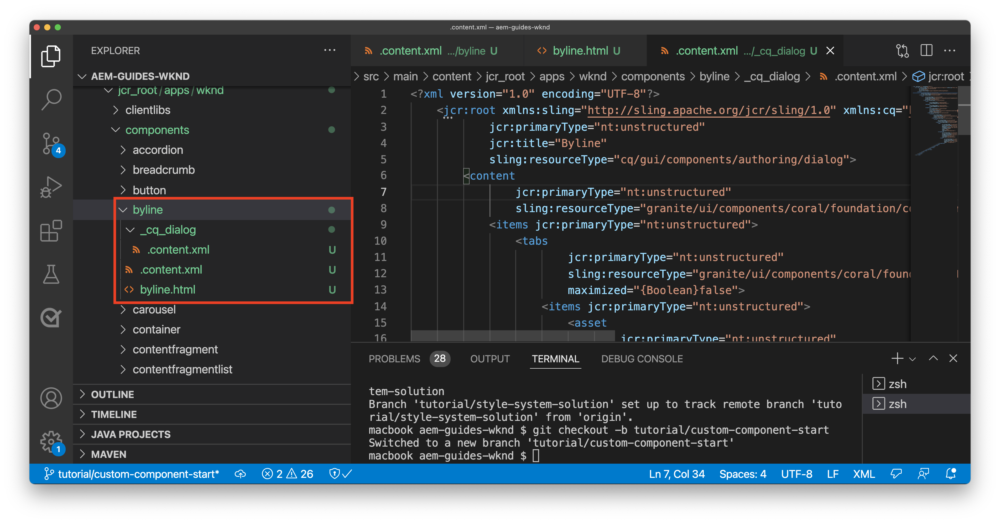

### Create the Policy dialog {#create-the-policy-dialog}

Following the same approach as with the Dialog creation, create a Policy dialog (formerly known as a Design Dialog) to hide unwanted fields in the Policy configuration inherited from the Core Components' Image component.

1. Beneath the `byline` folder, create a new folder named `_cq_design_dialog`.
1. Beneath `byline/_cq_design_dialog` create a new file named `.content.xml`. Update the file with the following: with the following XML. It is easiest to open up the `.content.xml` and copy/paste the XML below into it.

    ```xml
    <?xml version="1.0" encoding="UTF-8"?>
    <jcr:root xmlns:sling="http://sling.apache.org/jcr/sling/1.0" xmlns:granite="http://www.adobe.com/jcr/granite/1.0" xmlns:cq="http://www.day.com/jcr/cq/1.0" xmlns:jcr="http://www.jcp.org/jcr/1.0" xmlns:nt="http://www.jcp.org/jcr/nt/1.0"
        jcr:primaryType="nt:unstructured"
        jcr:title="Byline"
        sling:resourceType="cq/gui/components/authoring/dialog">
        <content
                jcr:primaryType="nt:unstructured">
            <items jcr:primaryType="nt:unstructured">
                <tabs
                        jcr:primaryType="nt:unstructured">
                    <items jcr:primaryType="nt:unstructured">
                        <properties
                                jcr:primaryType="nt:unstructured">
                            <items jcr:primaryType="nt:unstructured">
                                <content
                                        jcr:primaryType="nt:unstructured">
                                    <items jcr:primaryType="nt:unstructured">
                                        <decorative
                                                jcr:primaryType="nt:unstructured"
                                                sling:hideResource="{Boolean}true"/>
                                        <altValueFromDAM
                                                jcr:primaryType="nt:unstructured"
                                                sling:hideResource="{Boolean}true"/>
                                        <titleValueFromDAM
                                                jcr:primaryType="nt:unstructured"
                                                sling:hideResource="{Boolean}true"/>
                                        <displayCaptionPopup
                                                jcr:primaryType="nt:unstructured"
                                                sling:hideResource="{Boolean}true"/>
                                        <disableUuidTracking
                                                jcr:primaryType="nt:unstructured"
                                                sling:hideResource="{Boolean}true"/>
                                    </items>
                                </content>
                            </items>
                        </properties>
                        <features
                                jcr:primaryType="nt:unstructured">
                            <items jcr:primaryType="nt:unstructured">
                                <content
                                        jcr:primaryType="nt:unstructured">
                                    <items jcr:primaryType="nt:unstructured">
                                        <accordion
                                                jcr:primaryType="nt:unstructured">
                                            <items jcr:primaryType="nt:unstructured">
                                                <orientation
                                                        jcr:primaryType="nt:unstructured"
                                                        sling:hideResource="{Boolean}true"/>
                                                <crop
                                                        jcr:primaryType="nt:unstructured"
                                                        sling:hideResource="{Boolean}true"/>
                                            </items>
                                        </accordion>
                                    </items>
                                </content>
                            </items>
                        </features>
                    </items>
                </tabs>
            </items>
        </content>
    </jcr:root>
    ```

    The basis for the preceding **Policy dialog** XML was obtained from the [Core Components Image component](https://github.com/adobe/aem-core-wcm-components/blob/master/content/src/content/jcr_root/apps/core/wcm/components/image/v2/image/_cq_design_dialog/.content.xml).

    Like in the Dialog configuration, [Sling Resource Merger](https://sling.apache.org/documentation/bundles/resource-merger.html) is used to hide irrelevant fields that are otherwise inherited from the `sling:resourceSuperType`, as seen by the node definitions with `sling:hideResource="{Boolean}true"` property.

### Deploy the code {#deploy-the-code}

1. Deploy the updated code base to a local AEM instance using your Maven skills:

    ```shell
    $ cd aem-guides-wknd
    $ mvn clean install -PautoInstallSinglePackage
    ```

## Add the component to a page {#add-the-component-to-a-page}

To keep things simple and focused on AEM component development, we'll add the Byline component in its current state to an Article page to verify the `cq:Component` node definition is deployed and correct, AEM recognizes the new component definition and the component's dialog works for authoring.

### Add an image to the AEM Assets

First, upload a sample head shot to AEM Assets to use to populate the image in the Byline component.

1. Navigate to the LA Skateparks folder in AEM Assets: [http://localhost:4502/assets.html/content/dam/wknd/en/magazine/la-skateparks](http://localhost:4502/assets.html/content/dam/wknd/en/magazine/la-skateparks).

1. Upload the head shot for  **[stacey-roswells.jpg](assets/custom-component/stacey-roswells.jpg)** to the folder.

    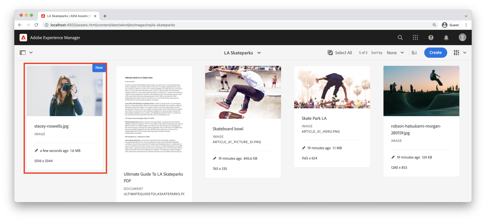

### Author the component {#author-the-component}

Next, add the Byline component to a page in AEM. Because we added the Byline component to the **WKND Sites Project - Content** Component Group, via the `ui.apps/src/main/content/jcr_root/apps/wknd/components/byline/.content.xml` definition, it is automatically available to any **Container** whose **Policy** allows the **WKND Sites Project - Content** component group, which the Article Page's Layout Container is.

1. Navigate to the LA Skatepark article at: [http://localhost:4502/editor.html/content/wknd/us/en/magazine/guide-la-skateparks.html](http://localhost:4502/editor.html/content/wknd/us/en/magazine/guide-la-skateparks.html)

1. From the left sidebar, drag and drop a **Byline component** on to **bottom** of the Layout Container of the opened article page.

    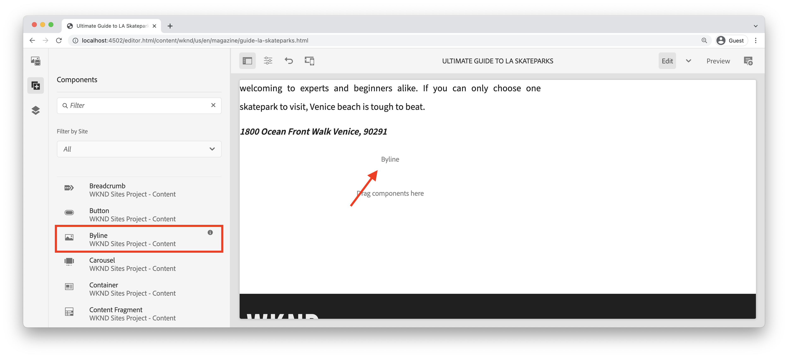

1. Ensure the **left sidebar is open** and visible, and the **Asset Finder** is selected.

    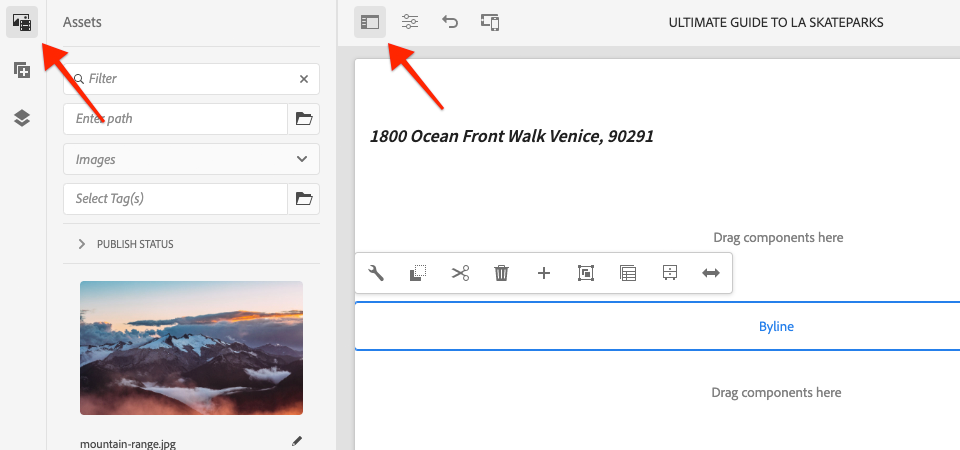

1. Select the **Byline component placeholder**, which in turn displays the action bar and tap the **wrench** icon to open the dialog.

    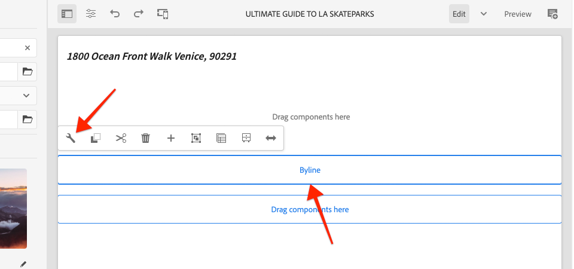

1. With the dialog open, and the first tab (Asset) active, open the left sidebar, and from the asset finder, drag an image into the Image drop-zone. Search for "stacey" to find Stacey Roswells bio picture provided in the WKND ui.content package.

    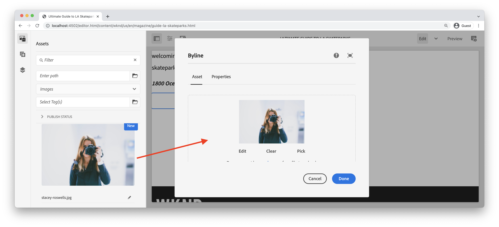

1. After adding an image, click on the **Properties** tab to enter the **Name** and **Occupations**.

    When entering occupations, enter them in **reverse alphabetical** order so the alphabetizing business logic we'll implement in the Sling Model is readily apparent.

    Tap the **Done** button in the bottom right to save the changes.

    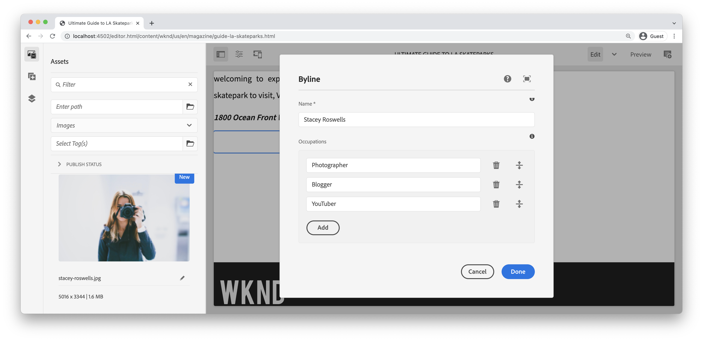

    AEM authors configure and author components via the dialogs. At this point in the development of the Byline component the dialogs are included for collecting the data, however the logic to render the authored content has not yet been added. Therefore only the placeholder shows up.

1. After saving the dialog, navigate to [CRXDE Lite](http://localhost:4502/crx/de/index.jsp#/content/wknd/us/en/magazine/guide-la-skateparks/jcr%3Acontent/root/container/container/byline) and review how the component's content is stored on the byline component content node under the AEM page.

    Find the Byline component content node beneath the LA Skate Parks page, i.e `/content/wknd/us/en/magazine/guide-la-skateparks/jcr:content/root/container/container/byline`.

    Notice the property names `name`, `occupations`, and `fileReference` are stored on the **byline node**.

    Also, notice the `sling:resourceType` of the node is set to `wknd/components/content/byline` which is what binds this content node to the Byline component implementation.

    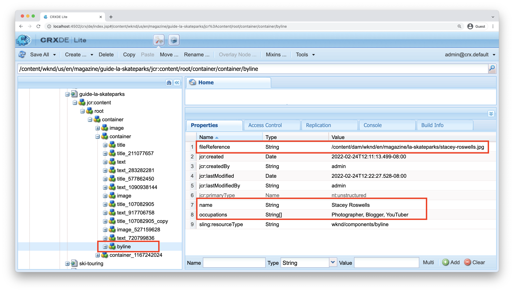

## Create Byline Sling Model {#create-sling-model}

Next, we'll create a Sling Model to act as the data model and house the business logic for the Byline component.

Sling Models are annotation driven Java "POJO's" (Plain Old Java Objects) that facilitate the mapping of data from the JCR to Java variables, and provide a number of other niceties when developing in the context of AEM.

### Review Maven Dependencies {#maven-dependency}

The Byline Sling Model will rely on several Java APIs provided by AEM. These APIs are made available via the `dependencies` listed in the `core` module's POM file. The project used for this tutorial has been built for AEM as a Cloud Service. However it is unique in that it is backward's compatible with AEM 6.5/6.4. Therefore both dependencies for Cloud Service and AEM 6.x are included.

1. Open the `pom.xml` file beneath `<src>/aem-guides-wknd/core/pom.xml`.
1. Find the dependency for `aem-sdk-api` - **AEM as a Cloud Service Only**

    ```xml
    <dependency>
        <groupId>com.adobe.aem</groupId>
        <artifactId>aem-sdk-api</artifactId>
    </dependency>
    ```

    The [aem-sdk-api](https://experienceleague.adobe.com/docs/experience-manager-cloud-service/implementing/developing/aem-as-a-cloud-service-sdk.html?lang=en#building-for-the-sdk) contains all public Java APIs exposed by AEM. The `aem-sdk-api` is used by default when building this project. The version is maintained in the Parent reactor pom located at the root of the project at `aem-guides-wknd/pom.xml`.

1. Find the dependency for the `uber-jar` - **AEM 6.5/6.4 Only**

    ```xml
    ...
        <dependency>
            <groupId>com.adobe.aem</groupId>
            <artifactId>uber-jar</artifactId>
            <classifier>apis</classifier>
        </dependency>
    ...
    ```

    The `uber-jar` is only included when the `classic` profile is invoked, i.e `mvn clean install -PautoInstallSinglePackage -Pclassic`. Again, this is unique to this project. In a real-world project, generated from the AEM Project Archetype the `uber-jar` will be the default if the version of AEM specified is 6.5 or 6.4. 

    The [uber-jar](https://experienceleague.adobe.com/docs/experience-manager-65/developing/devtools/ht-projects-maven.html#experience-manager-api-dependencies) contains all public Java APIs exposed by AEM 6.x. The version is maintained in the Parent reactor pom located at the root of the project `aem-guides-wknd/pom.xml`.

1. Find the dependency for `core.wcm.components.core`:

    ```xml
     <!-- Core Component Dependency -->
        <dependency>
            <groupId>com.adobe.cq</groupId>
            <artifactId>core.wcm.components.core</artifactId>
        </dependency>
    ```

    This is the all of the public Java APIs exposed by AEM Core Components. AEM Core Components is a project maintained outside of AEM and therefore has a separate release cycle. For this reason it is a dependency that needs to included separately and is **not** included with the `uber-jar` or `aem-sdk-api`.

    Like the uber-jar, the version for this dependency is maintained in the Parent reactor pom file located at `aem-guides-wknd/pom.xml`.

    Later in this tutorial we will use the Core Component Image class to display the image in the Byline component. It is necessary to have the Core Component dependency in order to build and compile our Sling Model.

### Byline interface {#byline-interface}

Create a public Java Interface for the Byline. `Byline.java` defines the public methods needed to drive the `byline.html` HTL script.

1. Within the `aem-guides-wknd.core` module beneath `core/src/main/java/com/adobe/aem/guides/wknd/core/models` create a new file named `Byline.java`

    

1. Update `Byline.java` with the following methods:

    ```java
    package com.adobe.aem.guides.wknd.core.models;

    import java.util.List;

    /**
    * Represents the Byline AEM Component for the WKND Site project.
    **/
    public interface Byline {
        /***
        * @return a string to display as the name.
        */
        String getName();

        /***
        * Occupations are to be sorted alphabetically in a descending order.
        *
        * @return a list of occupations.
        */
        List<String> getOccupations();

        /***
        * @return a boolean if the component has enough content to display.
        */
        boolean isEmpty();
    }
    ```

    The first two methods expose the values for the **name** and **occupations** for the Byline component.

    The `isEmpty()` method is used to determine if the component has any content to render or if it is waiting to be configured.

    Notice there is no method for the Image; [we'll take a look at as to why that is later](#tackling-the-image-problem).

1. Java packages that contain public Java classes, in this case a Sling Model, must be versioned using the package's  `package-info.java` file. 

Since the WKND source's Java package `com.adobe.aem.guides.wknd.core.models` declares are version of `2.0.0`, and we are adding a non-breaking public interface and methods, the version must be increased to `2.1.0`. Open the file at `core/src/main/java/com/adobe/aem/guides/wknd/core/models/package-info.java` and update `@Version("2.0.0")` to `@Version("2.1.0")`.

    ```java
    @Version("2.1.0")
    package com.adobe.aem.guides.wknd.core.models;

    import org.osgi.annotation.versioning.Version;
    ```

Whenever a changes are made to the files in this package, the [package version must be adjusted semantically](https://semver.org/). If not, the Maven project's [bnd-baseline-maven-plugin](https://github.com/bndtools/bnd/tree/master/maven/bnd-baseline-maven-plugin) will detect an invalid package version and break the built. Luckily, on failure the Maven plugin reports the invalid Java package version as well as the the version it should be. Just updated teh `@Version("...")` declaration in the violating Java package's `package-info.java` to the version recommended by the plugin to fix.

### Byline implementation {#byline-implementation}

`BylineImpl.java` is the implementation of the Sling Model that implements the `Byline.java` interface defined earlier. The full code for `BylineImpl.java` can be found at the bottom of this section.

1. Create a new folder named `impl` beneath `core/src/main/java/com/adobe/aem/guides/core/models`.
1. In the `impl` folder create a new file `BylineImpl.java`.

    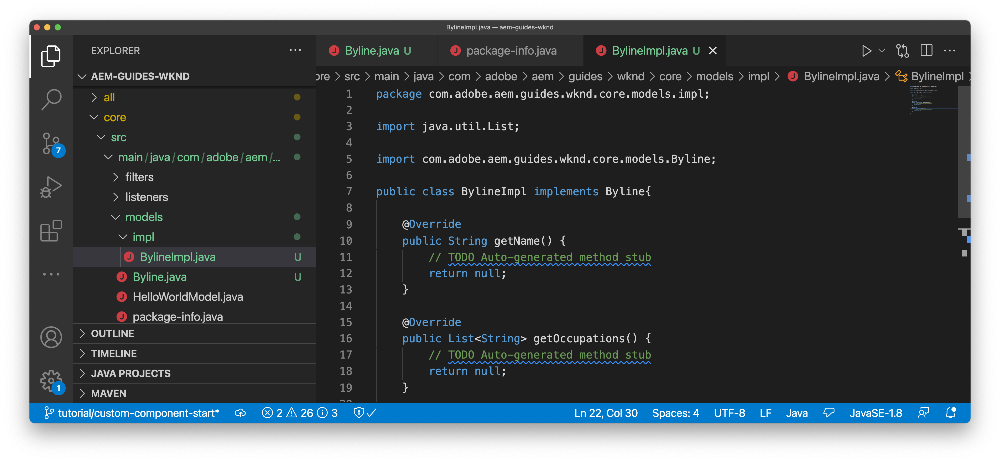

1. Open `BylineImpl.java`. Specify that it implements the `Byline` interface. Use the auto-complete features of the IDE or manually update the file to include the methods needed to implement the `Byline` interface:

    ```java
    package com.adobe.aem.guides.wknd.core.models.impl;
    import java.util.List;
    import com.adobe.aem.guides.wknd.core.models.Byline;

    public class BylineImpl implements Byline {

        @Override
        public String getName() {
            // TODO Auto-generated method stub
            return null;
        }

        @Override
        public List<String> getOccupations() {
            // TODO Auto-generated method stub
            return null;
        }

        @Override
        public boolean isEmpty() {
            // TODO Auto-generated method stub
            return false;
        }
    }
    ```

1. Add the Sling Model annotations by updating `BylineImpl.java` with the following class-level annotations. This `@Model(..)`annotation is what turns the class into a Sling Model.

    ```java
    import org.apache.sling.api.SlingHttpServletRequest;
    import org.apache.sling.models.annotations.Model;
    import org.apache.sling.models.annotations.DefaultInjectionStrategy;
    ...
    @Model(
            adaptables = {SlingHttpServletRequest.class},
            adapters = {Byline.class},
            resourceType = {BylineImpl.RESOURCE_TYPE},
            defaultInjectionStrategy = DefaultInjectionStrategy.OPTIONAL
    )
    public class BylineImpl implements Byline {
        protected static final String RESOURCE_TYPE = "wknd/components/content/byline";
        ...
    }
    ```

    Let's review this annotation and its parameters:

    * The `@Model` annotation registers BylineImpl as a Sling Model when it is deployed to AEM.
    * The `adaptables` parameter specifies that this model can be adapted by the request.
    * The `adapters` parameter allows the implementation class to be registered under the Byline interface. This allows the  HTL  script to call the Sling Model via the interface (instead of the  impl  directly). [More details about adapters can be found here](https://sling.apache.org/documentation/bundles/models.html#specifying-an-alternate-adapter-class-since-110).
    * The `resourceType` points to the Byline component resource type (created earlier) and helps to resolve the correct model if there are multiple implementations. [More details about associating a model class with a resource type can be found here](https://sling.apache.org/documentation/bundles/models.html#associating-a-model-class-with-a-resource-type-since-130).

### Implementing the Sling Model methods {#implementing-the-sling-model-methods}

#### getName() {#implementing-get-name}

The first method we'll tackle is `getName()` which simply returns the value stored to the byline's JCR content node under the property `name`.

For this, the `@ValueMapValue` Sling Model annotation is used to inject the value into a Java field using the Request's resource's ValueMap.


```java

import org.apache.sling.models.annotations.injectorspecific.ValueMapValue;

public class BylineImpl implements Byline {
    ...
    @ValueMapValue
    private String name;

    ...
    @Override
    public String getName() {
        return name;
    }
    ...
}

```

Because the JCR property shares the same name as the Java field (both are "name"), `@ValueMapValue` automatically resolves this association and injects the value of the property into the Java field.

#### getOccupations() {#implementing-get-occupations}

The next method to implement is `getOccupations()`. This method collects all the occupations stored in the JCR property `occupations` and return a sorted (alphabetically) collection of them.

Using the same technique explored in `getName()` the property value can be injected into the Sling Model's field.

Once the JCR property values are available in the Sling Model via the injected Java field `occupations`, the sorting business logic can be applied in the `getOccupations()` method.


```java

import java.util.ArrayList;
import java.util.Collections;
  ...

public class BylineImpl implements Byline {
    ...
    @ValueMapValue
    private List<String> occupations;
    ...
    @Override
    public List<String> getOccupations() {
        if (occupations != null) {
            Collections.sort(occupations);
            return new ArrayList<String>(occupations);
        } else {
            return Collections.emptyList();
        }
    }
    ...
}
  ...

```


#### isEmpty() {#implementing-is-empty}

The last public method is `isEmpty()` which determines when the component should consider itself "authored enough" to render.

For this component, we have business requirements stating that all three fields, name, image and occupations must be filled out *before* the component can be rendered.


```java

import org.apache.commons.lang3.StringUtils;
  ...
public class BylineImpl implements Byline {
    ...
    @Override
    public boolean isEmpty() {
        if (StringUtils.isBlank(name)) {
            // Name is missing, but required
            return true;
        } else if (occupations == null || occupations.isEmpty()) {
            // At least one occupation is required
            return true;
        } else if (/* image is not null, logic to be determined */) {
            // A valid image is required
            return true;
        } else {
            // Everything is populated, so this component is not considered empty
            return false;
        }
    }
    ...
}

```


#### Tackling the "Image problem" {#tackling-the-image-problem}

Checking the name and occupation conditions are trivial (and the Apache Commons Lang3 provides the always handy [StringUtils](https://commons.apache.org/proper/commons-lang/apidocs/org/apache/commons/lang3/StringUtils.html) class), however, it's unclear how the **presence of the Image** can be validated since the Core Components Image component is used to surface the image.

There are two ways to tackle this:

Check if the `fileReference` JCR property resolves to an asset. *OR* Convert this resource into a Core Component Image Sling Model and ensure the `getSrc()` method is not empty.

We will opt for the **second** approach. The first approach is likely sufficient, but in this tutorial the latter will be used to allow us to explore other features of Sling Models.

1. Create a private method that gets the Image. This method is left private because we do not need to expose the Image object in the HTL itself, and its only used to drive `isEmpty().`

    The following private method for `getImage()`:

    ```java
    import com.adobe.cq.wcm.core.components.models.Image;
    ...
    private Image getImage() {
        Image image = null;
        // Figure out how to populate the image variable!
        return image;
    }
    ```

    As noted above, there are two more approaches to get the **Image Sling Model**:

    The first uses the `@Self` annotation, to automatically adapt the current request to the Core Component's `Image.class`

    ```java

    @Self
    private Image image;

    ```

    The second uses the [Apache Sling ModelFactory](https://sling.apache.org/apidocs/sling10/org/apache/sling/models/factory/ModelFactory.html) OSGi service, which is a very handy service, and helps us create Sling Models of other types in Java code.

    We will opt for the second approach.

    >[!NOTE]
    >
    >In a real-world implementation, approach "One", using `@Self` is preferred since it's the simpler, more elegant solution. In this tutorial we'll use the second approach, as it requires us to explore more facets of Sling Models that are extremely useful is more complex components!

    Since Sling Models are Java POJO's, and not OSGi Services, the usual OSGi injection annotations `@Reference` **cannot** be used, instead Sling Models provide a special **[@OSGiService](https://sling.apache.org/documentation/bundles/models.html#injector-specific-annotations)** annotation that provides similar functionality.

1. Update `BylineImpl.java` to include the `OSGiService` annotation to inject the `ModelFactory`:

    ```java
    import org.apache.sling.models.factory.ModelFactory;
    import org.apache.sling.models.annotations.injectorspecific.OSGiService;
    ...
    public class BylineImpl implements Byline {
        ...
        @OSGiService
        private ModelFactory modelFactory;
    }
    ```

    With the `ModelFactory` available, a Core Component Image Sling Model can be created using:

    ```java
    modelFactory.getModelFromWrappedRequest(SlingHttpServletRequest request, Resource resource, java.lang.Class<T> targetClass)
    ```

    However, this method requires both a request and resource, neither yet available in the Sling Model. To obtain these, more Sling Model annotations are used!

    To get the current request the **[@Self](https://sling.apache.org/documentation/bundles/models.html#injector-specific-annotations)** annotation can be  used to inject the `adaptable` (which is defined in the `@Model(..)` as `SlingHttpServletRequest.class`, into a Java class field.

1. Add the **@Self** annotation to get the **SlingHttpServletRequest request**:

    ```java
    import org.apache.sling.models.annotations.injectorspecific.Self;
    ...
    @Self
    private SlingHttpServletRequest request;
    ```

    Remember, using `@Self Image image` to inject the Core Component Image Sling Model was an option above - the `@Self` annotation tries to inject the adaptable object (in our case a SlingHttpServletRequest), and adapt to the annotation field type. Since the Core Component Image Sling Model is adaptable from SlingHttpServletRequest objects, this would have worked and is less code than our more exploratory approach.

    Now we've injected the variables necessary to instantiate our Image model via the ModelFactory API. We will use Sling Model's **[@PostConstruct](https://sling.apache.org/documentation/bundles/models.html#postconstruct-methods)** annotation to obtain this object after the Sling Model instantiates.

    `@PostConstruct` is incredibly useful and acts in a similar capacity as a constructor, however, it is invoked after the class is instantiated and all annotated Java fields are injected. Whereas other Sling Model annotations annotate Java class fields (variables), `@PostConstruct` annotates a void, zero parameter method, typically named `init()` (but can be named anything).

1. Add **@PostConstruct** method:

    ```java
    import javax.annotation.PostConstruct;
    ...
    public class BylineImpl implements Byline {
        ...
        private Image image;

        @PostConstruct
        private void init() {
            image = modelFactory.getModelFromWrappedRequest(request,
                                                            request.getResource(),
                                                            Image.class);
        }
        ...
    }
    ```

    Remember, Sling Models are **NOT** OSGi Services, so it is safe to maintain class state. Often `@PostConstruct` derives and sets up Sling Model class state for later use, similar to what a plain constructor does.

    Note that if the `@PostConstruct` method throws an exception, the Sling Model will not instantiate (it will be null).

1. **getImage()** can now be updated to simply return the image object.

    ```java
    /**
        * @return the Image Sling Model of this resource, or null if the resource cannot create a valid Image Sling Model.
    */
    private Image getImage() {
        return image;
    }
    ```

1. Let's head back to `isEmpty()` and finish the implementation:

    ```java
    @Override
    public boolean isEmpty() {
       final Image componentImage = getImage();
       
        if (StringUtils.isBlank(name)) {
            // Name is missing, but required
            return true;
        } else if (occupations == null || occupations.isEmpty()) {
            // At least one occupation is required
            return true;
        } else if (componentImage == null || StringUtils.isBlank(componentImage.getSrc())) {
            // A valid image is required
            return true;
        } else {
            // Everything is populated, so this component is not considered empty
            return false;
        }
    }
    ```

    Note multiple calls to `getImage()` is not problematic as returns the initialized `image` class variable and does not invoke `modelFactory.getModelFromWrappedRequest(...)` which isn't an overly costly, but worth avoiding calling unnecessarily.

1. The final `BylineImpl.java` should look like:


    ```java

    package com.adobe.aem.guides.wknd.core.models.impl;

    import java.util.ArrayList;
    import java.util.Collections;
    import java.util.List;
    import javax.annotation.PostConstruct;
    import org.apache.commons.lang3.StringUtils;
    import org.apache.sling.api.SlingHttpServletRequest;
    import org.apache.sling.models.annotations.DefaultInjectionStrategy;
    import org.apache.sling.models.annotations.Model;
    import org.apache.sling.models.annotations.injectorspecific.OSGiService;
    import org.apache.sling.models.annotations.injectorspecific.Self;
    import org.apache.sling.models.annotations.injectorspecific.ValueMapValue;
    import org.apache.sling.models.factory.ModelFactory;
    import com.adobe.aem.guides.wknd.core.models.Byline;
    import com.adobe.cq.wcm.core.components.models.Image;

    @Model(
            adaptables = {SlingHttpServletRequest.class},
            adapters = {Byline.class},
            resourceType = {BylineImpl.RESOURCE_TYPE},
            defaultInjectionStrategy = DefaultInjectionStrategy.OPTIONAL
    )
    public class BylineImpl implements Byline {
        protected static final String RESOURCE_TYPE = "wknd/components/content/byline";

        @Self
        private SlingHttpServletRequest request;

        @OSGiService
        private ModelFactory modelFactory;

        @ValueMapValue
        private String name;

        @ValueMapValue
        private List<String> occupations;

        private Image image;

        @PostConstruct
        private void init() {
            image = modelFactory.getModelFromWrappedRequest(request, request.getResource(), Image.class);
        }

        @Override
        public String getName() {
            return name;
        }

        @Override
        public List<String> getOccupations() {
            if (occupations != null) {
                Collections.sort(occupations);
                return new ArrayList<String>(occupations);
            } else {
                return Collections.emptyList();
            }
        }

        @Override
        public boolean isEmpty() {
            final Image componentImage = getImage();

            if (StringUtils.isBlank(name)) {
                // Name is missing, but required
                return true;
            } else if (occupations == null || occupations.isEmpty()) {
                // At least one occupation is required
                return true;
            } else if (componentImage == null || StringUtils.isBlank(componentImage.getSrc())) {
                // A valid image is required
                return true;
            } else {
                // Everything is populated, so this component is not considered empty
                return false;
            }
        }

        /**
        * @return the Image Sling Model of this resource, or null if the resource cannot create a valid Image Sling Model.
        */
        private Image getImage() {
            return image;
        }
    }

    ```


## Byline HTL {#byline-htl}

In the `ui.apps` module, open `/apps/wknd/components/byline/byline.html` we created in the earlier set up of the AEM Component.

```html
<div data-sly-use.placeholderTemplate="core/wcm/components/commons/v1/templates.html">
</div>
<sly data-sly-call="${placeholderTemplate.placeholder @ isEmpty=false}"></sly>
```

Let's review what this HTL script does so far:

* The `placeholderTemplate` points to Core Components' placeholder, which displays when the component is not fully configured. This renders in AEM Sites Page Editor as a box with the component title, as defined above in the `cq:Component`'s  `jcr:title` property.

* The `data-sly-call="${placeholderTemplate.placeholder @ isEmpty=false}` loads the `placeholderTemplate` defined above and passes in a boolean value (currently hard-coded to `false`) into the placeholder template. When `isEmpty` is true, the placeholder template renders the grey box, else it renders nothing.

### Update Byline HTL

1. Update **byline.html** with the following skeletal HTML structure:

    ```html
    <div data-sly-use.placeholderTemplate="core/wcm/components/commons/v1/templates.html"
        class="cmp-byline">
            <div class="cmp-byline__image">
                <!--/* Include the Core Components Image Component */-->
            </div>
            <h2 class="cmp-byline__name"><!--/* Include the name */--></h2>
            <p class="cmp-byline__occupations"><!--/* Include the occupations */--></p>
    </div>
    <sly data-sly-call="${placeholderTemplate.placeholder @ isEmpty=true}"></sly>
    ```

    Note the CSS classes follow the [BEM naming convention](https://getbem.com/naming/). While the use of BEM conventions isn't mandatory, BEM is recommended as it's used in Core Component CSS classes and generally results in clean, readable CSS rules.

### Instantiating Sling Model objects in HTL {#instantiating-sling-model-objects-in-htl}

The [Use block statement](https://github.com/adobe/htl-spec/blob/master/SPECIFICATION.md#221-use) is used to instantiate Sling Model objects in the HTL script and assign it to an HTL variable.

`data-sly-use.byline="com.adobe.aem.guides.wknd.models.Byline"` uses the Byline interface (com.adobe.aem.guides.wknd.models.Byline) implemented by BylineImpl and adapts the current SlingHttpServletRequest to it, and the result is stored in a HTL variable name byline ( `data-sly-use.<variable-name>`).

1. Update the outer `div` to reference the **Byline** Sling Model by its public interface:

    ```xml
    <div data-sly-use.byline="com.adobe.aem.guides.wknd.core.models.Byline"
        data-sly-use.placeholderTemplate="core/wcm/components/commons/v1/templates.html"
        class="cmp-byline">
        ...
    </div>
    ```

### Accessing Sling Model methods {#accessing-sling-model-methods}

HTL borrows from JSTL, and uses the same shortening of Java getter methods names.

For example, invoking the Byline Sling Model's `getName()` method can be shortened to `byline.name`, similarly instead of `byline.isEmpty`, this can be shorted to `byline.empty`. Using full method names, `byline.getName` or `byline.isEmpty`, works as well. Note the `()` are never used to invoke methods in HTL (similar to JSTL).

Java methods that require a parameter **cannot** be used in HTL. This is by design to keep the logic in HTL simple.

1. The Byline name can be added to the component by invoking the `getName()` method on the Byline Sling Model, or in HTL: `${byline.name}`.

    Update the `h2` tag:

    ```xml
    <h2 class="cmp-byline__name">${byline.name}</h2>
    ```

### Using HTL Expression Options {#using-htl-expression-options}

[HTL Expressions Options](https://github.com/adobe/htl-spec/blob/master/SPECIFICATION.md#12-available-expression-options) act as modifiers on content in  HTL, and range from date-formatting to i18n translation. Expressions can also be used to join lists or arrays of values, which is what's needed to display the occupations in a comma delimited format.

Expressions are added via the `@` operator in the HTL expression.

1. To join the list of occupations with ", ", the following code is used:

    ```html
    <p class="cmp-byline__occupations">${byline.occupations @ join=', '}</p>
    ```

### Conditionally displaying the placeholder {#conditionally-displaying-the-placeholder}

Most HTL scripts for AEM Components leverage the **placeholder paradigm** to provide a visual cue to authors **indicating a component is incorrectly authored and will not display on AEM Publish**. The convention to drive this decision is to implement a method on the component's backing Sling Model, in our case: `Byline.isEmpty()`.

`isEmpty()` is invoked on the Byline Sling Model and the result (or rather its negative, via the `!` operator) is saved to an HTL variable named `hasContent`:

1. Update the outer `div` to save an HTL variable named `hasContent`:

    ```html
     <div data-sly-use.byline="com.adobe.aem.guides.wknd.core.models.Byline"
          data-sly-use.placeholderTemplate="core/wcm/components/commons/v1/templates.html"
          data-sly-test.hasContent="${!byline.empty}"
          class="cmp-byline">
          ...
    </div>
    ```

    Note the use of `data-sly-test`, the HTL `test` block is interesting in that it both sets an HTL variable AND renders/doesn't render the HTML element it's on, based on if the result of the HTL expression is truthy or not. If "truthy", the HTML element renders, else it does not render.

    This HTL variable `hasContent` can now be re-used to conditionally show/hide the placeholder.

1. Update the conditional call to the `placeholderTemplate` at the bottom of the file with the following:

    ```html
    <sly data-sly-call="${placeholderTemplate.placeholder @ isEmpty=!hasContent}"></sly>
    ```

### Display the Image using Core Components {#using-the-core-components-image}

The HTL script for `byline.html` is now almost complete and is only missing the image.

Since we use `sling:resourceSuperType` the Core Components Image component to provide the authoring of the image, we can also use the Core Component Image component to render the image!

For this, we need to include the current byline resource, but force the resource type of the Core Components Image component, using resource type `core/wcm/components/image/v2/image`. This is a powerful pattern for component re-use. For this, HTL's `data-sly-resource` block is used.

1. Replace the `div` with a class of `cmp-byline__image` with the following:

    ```html
    <div class="cmp-byline__image"
        data-sly-resource="${ '.' @ resourceType = 'core/wcm/components/image/v2/image' }"></div>
    ```

    This `data-sly-resource`, included the current resource via the relative path `'.'`, and forces the inclusion of the current resource (or the byline content resource) with the resource type of `core/wcm/components/image/v2/image`.

    The Core Component resource type is used directly, and not via a proxy, because this is an in-script use, and it's never persisted to our content.

2. Completed `byline.html` below:

    ```html
    <!--/* byline.html */-->
    <div data-sly-use.byline="com.adobe.aem.guides.wknd.core.models.Byline" 
        data-sly-use.placeholderTemplate="core/wcm/components/commons/v1/templates.html"
        data-sly-test.hasContent="${!byline.empty}"
        class="cmp-byline">
        <div class="cmp-byline__image"
            data-sly-resource="${ '.' @ resourceType = 'core/wcm/components/image/v2/image' }">
        </div>
        <h2 class="cmp-byline__name">${byline.name}</h2>
        <p class="cmp-byline__occupations">${byline.occupations @ join=', '}</p>
    </div>
    <sly data-sly-call="${placeholderTemplate.placeholder @ isEmpty=!hasContent}"></sly>
    ```

3. Deploy the code base to a local AEM instance. Since major changes were made to the POM files, perform a full Maven build from the project's root directory.

    ```shell
    $ cd aem-guides-wknd/
    $ mvn clean install -PautoInstallSinglePackage
    ```

    If deploying to AEM 6.5/6.4 invoke the `classic` profile:

    ```shell
    $ mvn clean install -PautoInstallSinglePackage -Pclassic
    ```

### Reviewing the un-styled Byline component {#reviewing-the-unstyled-byline-component}

1. After deploying the update, navigate to the [Ultimate Guide to LA Skateparks ](http://localhost:4502/editor.html/content/wknd/us/en/magazine/guide-la-skateparks.html) page, or wherever you added the Byline component earlier in the chapter.

1. The **image**, **name**, and **occupations** now appears and we have a un-styled, but working Byline component.

    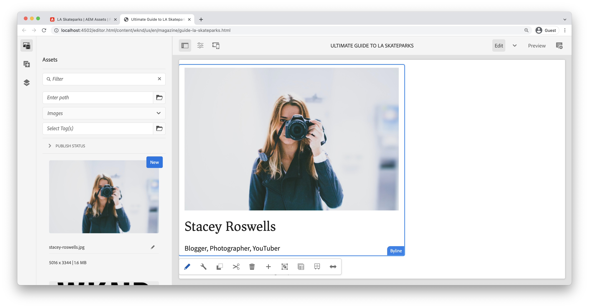

### Reviewing the Sling Model registration {#reviewing-the-sling-model-registration}

The [AEM Web Console's Sling Models Status view](http://localhost:4502/system/console/status-slingmodels) displays all the registered Sling Models in AEM. The Byline Sling Model can be validated as being installed and recognized by reviewing this list.

If the **BylineImpl** is not displayed in this list, then there was is likely an issue with the Sling Model's annotations or the Sling Model was not added to the registered Sling Models package (com.adobe.aem.guides.wknd.core.models) in the core project.

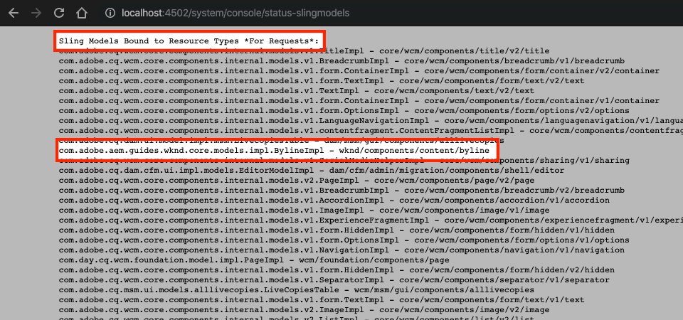

*http://localhost:4502/system/console/status-slingmodels*

## Byline styles {#byline-styles}

The Byline component needs to be styled to align with the creative design for the Byline component. This will be achieved by using SCSS, which AEM provides support for via the **ui.frontend** Maven sub-project.

### Add a default style

Add default styles for the Byline component. In the **ui.frontend** project under `/src/main/webpack/components`:

1. Create a new file named `_byline.scss`.

    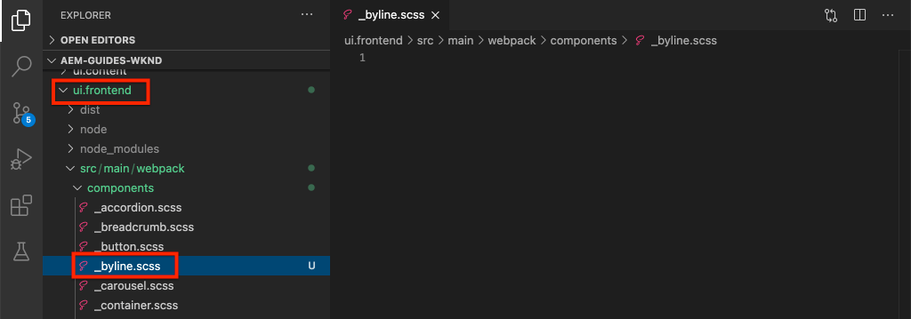

1. Add the Byline implementations CSS (written as SCSS) into the `default.scss`:

    ```scss
    .cmp-byline {
        $imageSize: 60px;

        .cmp-byline__image {
            float: left;

        /* This class targets a Core Component Image CSS class */
        .cmp-image__image {
            width: $imageSize;
            height: $imageSize;
            border-radius: $imageSize / 2;
            object-fit: cover;
            }
        }

        .cmp-byline__name {
            font-size: $font-size-medium;
            font-family: $font-family-serif;
            padding-top: 0.5rem;
            margin-left: $imageSize + 25px;
            margin-bottom: .25rem;
            margin-top:0rem;
        }

        .cmp-byline__occupations {
            margin-left: $imageSize + 25px;
            color: $gray;
            font-size: $font-size-xsmall;
            text-transform: uppercase;
        }
    }
    ```

1. Review `main.scss` at `ui.frontend/src/main/webpack/site/main.scss`:

    ```scss
    @import 'variables';
    @import 'wkndicons';
    @import 'base';
    @import '../components/**/*.scss';
    @import './styles/*.scss';
    ```

    `main.scss` is the main entrypoint for styles included by the `ui.frontend` module. The regular expression `'../components/**/*.scss'` will include all files beneat the `components/` folder.

1. Build and deploy the full project to AEM:

    ```shell
    $ cd aem-guides-wknd/
    $ mvn clean install -PautoInstallSinglePackage
    ```

    If using AEM 6.4/6.5 add the `-Pclassic` profile.

   >[!TIP]
   >
   >You may need to clear the browser cache to ensure stale CSS is not being served, and refresh the page with the Byline component to get the full styled.

## Putting It Together {#putting-it-together}

Below is what the fully authored and styled Byline component should look like on the AEM page.

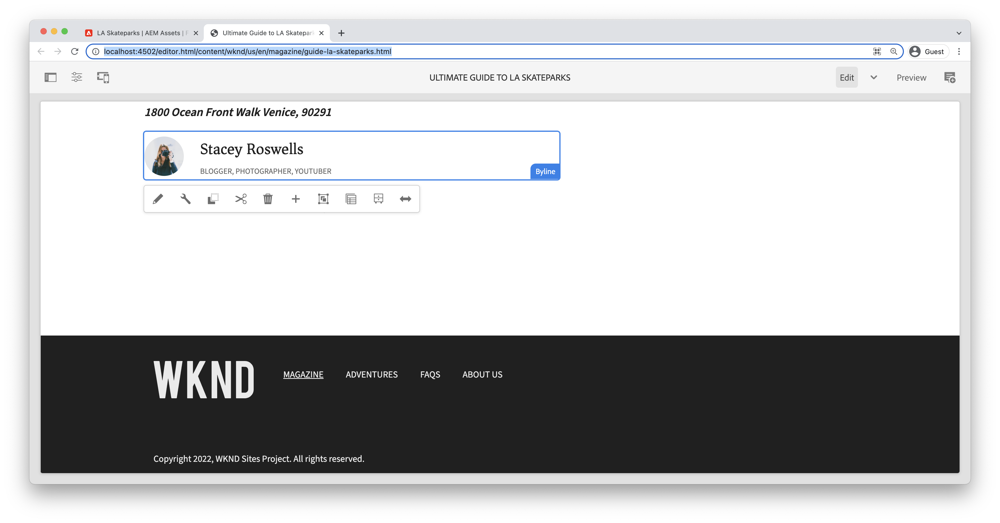

## Congratulations! {#congratulations}

Congratulations, you have just created a custom component from scratch using Adobe Experience Manager!

### Next steps {#next-steps}

Continue to learn about AEM Component development by exploring how to write JUnit tests for the Byline Java code to ensure everything is developed properly, and implemented business logic is correct and complete.

* [Writing Unit Tests or AEM Components](unit-testing.md)

View the finished code on [GitHub](https://github.com/adobe/aem-guides-wknd) or review and deploy the code locally at on the Git brach `tutorial/custom-component-solution`.

1. Clone the [github.com/adobe/aem-guides-wknd](https://github.com/adobe/aem-guides-wknd) repository.
1. Check out the `tutorial/custom-component-solution` branch
